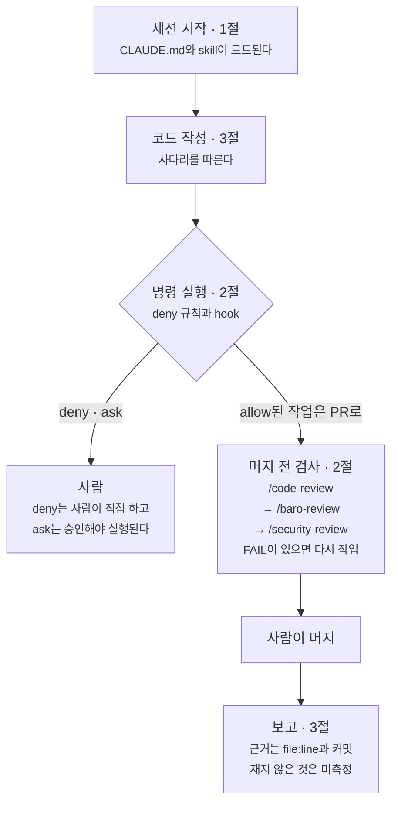

정치·공직자 정보 앱 baro를 사실상 혼자 개발하고 운영합니다. 저장소는 일곱 개(백엔드, 뉴스 파이프라인, 모바일 앱, 웹, 어드민, 입점 신청 사이트, Slack 지식봇)이고, 코드는 대부분 AI 에이전트와 같이 씁니다.
2026-08-24부터 09-24까지 일곱 저장소에 쌓인 커밋 334건(머지 커밋 제외) 중 235건에 Claude 공동 작성자 표기가 있습니다.
반면 백엔드와 파이프라인의 최근 머지 PR 20건에는 리뷰가 한 건도 없습니다. 에이전트가 만든 변경을 다른 사람이 검토하는 단계가 없습니다.

에이전트에게 맡기는 일이 늘면서 문제가 세 가지 드러났습니다.

- 지침이 닿지 않았습니다. 워크스페이스 루트에 모아 둔 skill이 하위 레포에서 연 세션에는 로드되지 않았습니다.
- 위험한 명령이 허용돼 있었습니다. 하위 레포 로컬 설정의 허용 목록에는 원격 명령과 pem 키 ssh가, 루트 설정에는 PR 머지가 있었습니다. 허용 목록에 있는 명령은 에이전트가 묻지 않고 실행합니다.
- 근거 없는 문장이 남았습니다. 지침의 구조 설명 하나가 코드와 달랐고, 다시 재지 않은 성능 수치가 개선 결과처럼 문서에 있었습니다. 테스트가 실패하면 기대값을 고쳐 통과시키는 길도 열려 있었습니다.

그래서 에이전트가 무엇을 읽고, 무엇을 실행할 수 없고, 머지 전에 무엇을 통과해야 하고, 무엇을 주장할 수 있는지를 정했습니다. 기준은 네 가지입니다.

1. 지침은 한 곳에 두되, 도구가 실제로 읽는 위치에 둔다.
2. 규칙은 버전 관리되는 곳에 둔다.
3. 되돌리기 어려운 행동은 지침으로 당부하지 않고 기계로 막는다.
4. 측정하지 않은 것은 주장하지 않는다.

| 문제 | 바꾼 것 | 확인한 것 |
| --- | --- | --- |
| 하위 레포 세션에 skill이 없음 | 원본은 루트에 두고 `~/.claude/skills`에 링크 | 링크 4개가 모두 원본을 가리킴 |
| 파이프라인 지침이 세션마다 25KB | 규칙이 아닌 상태 서술을 별도 문서로 옮김 | 25,595 → 8,696 bytes(−66%), 옮긴 줄을 원본과 대조 |
| 운영 명령이 허용 목록에 있음 | 허용 항목 삭제, deny 규칙 5개와 PreToolUse hook | 판정 샘플 21건이 기대대로 나옴, 실제 세션에서 차단 |
| 레포 고유 규칙을 일반 리뷰가 모름 | `/baro-review` grep 게이트 | 첫 실행의 오탐 3건 제거, PR 본문에 판정 첨부 |
| 지침과 문서의 근거 없는 문장 | 구조 설명을 코드와 대조, 보고 규약과 skill 3개 | 구조 설명 5건 중 1건의 숫자 정정 |
| 쓰지 않을 코드를 미리 만듦 | 사다리 규칙 19줄(예외 3줄 포함), `ponytail:` 장부 | 효과는 미측정, 2026-10-05에 다시 잼 |

이 장치들로 결함이 줄었는지는 아직 재지 않았습니다. 재측정 계획은 마지막 절에 적었습니다.

## 작업 한 건이 지나가는 길

장치는 작업 한 건이 지나가는 길목마다 놓여 있습니다. 그림의 절 번호는 아래 본문의 절입니다.



## 1. 지침: 도구가 실제로 읽는 위치에 둔다

### skill만 로드되지 않은 이유

워크스페이스 루트에는 공통 CLAUDE.md를, 각 레포에는 그 레포 규칙만 담은 CLAUDE.md를 두고, 공통 skill은 루트 `.claude/skills/`에 모았습니다.
그런데 하위 레포에서 세션을 열면 CLAUDE.md는 읽히는데 skill은 목록에 없었습니다. Claude Code 문서를 확인해 보니 파일 종류마다 찾는 범위가 달랐습니다.

| 대상 | 찾는 범위 | 그래서 둔 곳 |
| --- | --- | --- |
| <span style="white-space:nowrap">CLAUDE.md</span> | 작업 디렉터리와 그 위의 모든 상위 디렉터리 | 루트에 공통 지침 하나, 레포 CLAUDE.md에는 그 레포 규칙만 |
| <span style="white-space:nowrap">skill</span> | 작업 디렉터리부터 저장소 루트까지, 그리고 `~/.claude/skills` | 원본은 루트 `.claude/skills/`, `~/.claude/skills`에 심볼릭 링크 |
| <span style="white-space:nowrap">settings.json</span><br/><span style="white-space:nowrap">hook</span> | 세션을 연 디렉터리(로컬 허용 목록은 저장소 루트)와 `~/.claude`. 그 위 디렉터리는 보지 않음 | 가드는 `~/.claude/settings.json` |

하위 레포는 각자 git 저장소라서 skill 탐색이 그 레포 루트에서 멈춥니다. 그래서 skill 원본은 루트에서 버전 관리하고, `~/.claude/skills`에 심볼릭 링크를 걸어 어느 레포에서든 보이게 했습니다. Claude Code는 링크를 따라가 대상의 `SKILL.md`를 읽습니다.
가드 설정도 같은 이유로 홈에 두었는데, 이 파일이 저장소 밖에 있다는 문제는 2절에서 다룹니다.

### AGENTS.md는 그사이 동작이 바뀌었다

지식봇 레포에는 Codex용 안전 규칙이, 웹과 어드민에는 Next.js가 생성한 에이전트 안내가 AGENTS.md로 있었습니다.
2026-09-18에 확인한 문서로는 Claude Code가 AGENTS.md를 읽지 않았습니다. 그래서 같은 규칙을 두 벌로 쓰지 않도록, 지식봇 레포에는 첫 줄에서 `@AGENTS.md`로 그 파일을 가져오는 CLAUDE.md를 새로 두었습니다. 웹과 어드민에는 Next.js가 같은 방식의 CLAUDE.md를 이미 만들어 두었습니다.

글을 쓰며 다시 확인해 보니 같은 날 나온 v2.1.277부터 AGENTS.md를 직접 읽습니다. 다만 기본 설정에서는 작업 디렉터리와 그 위 어디에도 CLAUDE.md가 없을 때만 읽습니다.
루트에 CLAUDE.md가 있는 이 워크스페이스에서는 가져오는 한 줄이 여전히 필요하고, 문서에 따르면 그 줄 때문에 같은 파일을 두 번 읽지는 않습니다.

### 지침을 줄이고, 적힌 사실을 코드로 확인했다

CLAUDE.md는 세션마다 통째로 컨텍스트에 올라갑니다. 파이프라인 레포의 CLAUDE.md는 25,595바이트였고, 그중 「현재 초점」(진행 상황과 다음 할 일)과 문서별 한 줄 설명은 규칙이 아닌 상태 서술이었습니다.
이 둘을 상태 문서와 문서 색인으로 옮겨 8,696바이트(−66%)로 줄였습니다(magazine-pipeline PR #143).
옮기면서 빠진 내용이 없는지 원본 줄을 새 파일 세 개와 한 줄씩 대조했습니다. 원본의 비어 있지 않은 줄 173개(중복 제외) 중 글자 그대로 찾지 못한 5개는 절 제목 2개, 옮기면서 뺀 안내 문구 2개, 다른 줄에 합쳐진 문장 1개였습니다(2026-09-24 재실행).

지침에 적힌 사실도 다시 확인했습니다. 에이전트는 CLAUDE.md를 사실로 받아들이고 그 위에서 코드를 씁니다.
백엔드 CLAUDE.md의 구조 설명 다섯 건을 코드에 grep으로 대조했더니 한 건의 숫자가 틀렸습니다. 「오프셋 커서 어댑터 7개」가 실제로는 어댑터 6개에 호출 지점 7곳이었습니다.
지금은 CLAUDE.md 맨 위에 검증일을 적고, 리뷰 게이트가 "지침에 적힌 사실(풀 크기, 스케줄 시각, API 수)이 바뀌었는데 지침도 고쳤는가"를 묻습니다.

## 2. 가드와 게이트: 되돌리기 어려운 것은 기계가 거른다

### 지침만으로는 막을 수 없었다

"운영 서버에 원격 명령을 보내지 않는다"는 규칙은 CLAUDE.md에도 있습니다. 하지만 Claude Code 문서는 CLAUDE.md를 강제되는 설정이 아닌 컨텍스트로 다루고, 에이전트의 판단과 상관없이 막아야 하는 행동은 PreToolUse hook으로 막으라고 안내합니다.

게다가 로컬 설정은 원격 명령을 허용하고 있었습니다. `settings.local.json`은 권한 요청에서 "다시 묻지 않기"를 고르면 허용 규칙이 쌓이는 파일인데, 하위 레포의 이 파일에 원격 명령과 pem 키 ssh가 있었습니다. 원격 명령의 대상은 이미 운영에서 빠진 인스턴스라 실제로 운영에 닿지는 않았지만, 위험한 명령이 이렇게 허용 목록에 쌓이고 있었습니다.
이 항목들부터 지웠고, 2026-09-24에 로컬 설정 네 곳을 다시 grep했을 때 운영 원격 명령, pem 키, PR 머지, 인프라 apply, DB 덤프에 해당하는 항목은 0건이었습니다.

### 되돌릴 수 있는가, 사람이 봐야 하는가

판정 기준은 명령이 위험해 보이는지보다 되돌릴 수 있는지, 사람이 봐야 하는지였습니다.

| <span style="white-space:nowrap">판정</span> | 명령 | 이유 |
| --- | --- | --- |
| <span style="white-space:nowrap">deny</span> | 운영 인스턴스 원격 명령, pem 키 ssh, 인프라 apply·destroy, PR 머지, launchd 작업 등록, RDS 재부팅·변경·삭제, 오토스케일링 용량 변경, 머지된 Flyway 파일 수정·삭제 | 사람이 직접 한다 |
| <span style="white-space:nowrap">ask</span> | `git push`, 운영 세션 접속, 배포·이미지 삭제, 컨테이너 중단·재시작, 과금·실네트워크 테스트, 운영 DB 접속 | 되돌리기 어렵거나 운영에 닿는다 |
| <span style="white-space:nowrap">allow</span> | 그 밖의 읽기·빌드·기본 테스트 | |

PR 머지는 명령이 위험해서라기보다 머지를 사람이 하는 일로 정했기 때문에 deny에 넣었습니다.

차단은 두 겹입니다. `~/.claude/settings.json`의 `permissions.deny`에 다섯 개(운영 원격 명령, `tofu apply`, `terraform apply`, PR 머지, `launchctl submit`)를 넣고, 나머지는 PreToolUse hook인 `guard-bash.sh`가 판정합니다.
hook은 Bash 명령이 실행되기 전에 명령 문자열을 받아 판정을 JSON으로 돌려주고, 사유 문자열은 에이전트에게 그대로 전달됩니다.

```json
{"hookSpecificOutput": {
  "hookEventName": "PreToolUse",
  "permissionDecision": "deny",
  "permissionDecisionReason":
    "운영 인스턴스 원격 명령은 사람이 직접 실행한다 (CLAUDE.md 안전 규칙)"}}
```

hook은 입력을 읽지 못하면 아무것도 내보내지 않고 기본 권한 흐름에 맡깁니다(fail-open). 파싱 실패까지 막으면 그때마다 작업이 멈춰 가드를 우회하는 습관이 생긴다고 봤습니다.
스크립트 머리 주석에도 "마지막 방어선이 아니라 실수 방지선"이라고 적었습니다. 위의 다섯 개는 deny 규칙에도 있어서, hook이 판정을 포기해도 한 번 더 걸립니다.

### 돌려서 확인한 것과 가드가 못 하는 것

판정 로직은 표준 입력으로 도구 호출 JSON을 받는 스크립트라 단독으로 돌릴 수 있습니다.

- 2026-09-18: 샘플 20건(deny 8, ask 5, allow 5, Bash가 아닌 도구 1, 깨진 JSON 1)을 기대값과 비교해, 과금 테스트를 잡는 패턴 하나가 틀린 것을 고쳤습니다. 실제 세션에서도 도움말 옵션만 붙인 운영 원격 명령을 시도해, 실행되지 않고 사유가 돌아오는 것을 확인했습니다.
- 2026-09-24: 샘플 21건(deny 9, ask 5, allow 5, Bash가 아닌 도구 1, 깨진 JSON 1)을 다시 넣었고 모두 기대대로 나왔습니다.

못 하는 것도 있습니다.

- 명령 문자열에 정해진 문구가 있는지만 봐서, 실행과 언급을 구분하지 못합니다. 이 글을 쓰려고 로컬 설정을 grep하던 명령도 검색 패턴에 인프라 apply 문구가 있어 막혔습니다. 가드를 끄지 않고 패턴 문자열을 나눠 다시 찾았습니다.
- 반대로 문구가 조금만 달라도 알아보지 못합니다. 공백을 하나 더 넣은 운영 원격 명령 샘플은 hook을 통과했습니다.
- Claude Code 세션 안에서만 동작합니다. 터미널에서 사람이 치는 명령은 막지 않습니다.
- 설정이 버전 관리 밖에 있습니다. `~/.claude/settings.json`이 지워지면 deny 규칙과 hook 연결이 함께 사라지는데, 세션은 평소처럼 열려서 알아채기 어렵습니다. 지금은 가드 부분만 `settings.json.example`로 떠서 루트 저장소에 두고, 규칙을 바꿀 때마다 실제 설정과 비교합니다(2026-09-24 비교 결과 같음).

```bash
jq -e '.permissions.deny | length' ~/.claude/settings.json   # 5가 나와야 한다
```

### 레포에서만 통하는 규칙은 grep 게이트로

머지 전 리뷰는 순서를 정해 두었습니다. built-in `/code-review`가 버그·중복·비효율을, `/baro-review`가 이 레포에서만 통하는 규칙을 보고, 인증이나 개인정보를 건드렸으면 `/security-review`를 돌립니다.
FAIL이 하나라도 있으면 머지하지 않고, 머지는 사람이 합니다.

`/baro-review`를 따로 둔 건 그때까지 찾은 결함이 일반 리뷰로는 잡기 어려운 종류였기 때문입니다.
요청 한 건이 커넥션을 12번 잡는 조회 구조나, 커밋 뒤 리스너가 커넥션을 하나 더 잡는 구조는 운영 풀이 10개라는 사실을 알아야 문제로 보입니다. 규칙마다 grep으로 돌릴 수 있는 명령을 붙였습니다.

| 게이트 | 보는 것 |
| --- | --- |
| 레이어 경계 | core 모듈이 infra를 참조하는가 |
| 트랜잭션 형태 | `@Transactional` 안에서 S3·HTTP·FCM을 부르는가, `AFTER_COMMIT` + `REQUIRES_NEW`가 새로 들어왔는가 |
| 페이지네이션 | 새 목록 API가 오프셋 커서를 쓰는가, size 상한이 있는가 |
| Flyway | 머지된 마이그레이션 파일을 고치거나 지웠는가 |
| 로그·시크릿 | 민감값을 로그에 넣는가, 키를 하드코딩했는가 |
| 테스트 | 단언을 지우거나 `@Disabled`를 붙였는가 |
| LLM 호출(파이프라인) | 앱이 OpenAI를 직접 부르는가, 프롬프트·모델 변경에 실험 기록이 있는가 |
| 과잉 구현, `ponytail:` 장부 | 3절에서 설명 |

테스트에서 단언을 지우거나 기준을 낮춘 변경은 "계약 완화"로 따로 분류하고 사유를 요구합니다. 테스트를 통과시키려고 기대값을 고친 변경이 조용히 들어오지 않게 하려는 장치입니다.

```bash
# 테스트에서 지운 단언 수 (0이 아니면 계약 완화로 보고 사유를 요구)
git diff $BASE...HEAD -- '*Test.kt' \
  | grep -E '^-.*(assert|shouldBe|verify)' | wc -l
```

### 실코드에 먼저 돌려 본 결과

게이트를 처음 만들었을 때 백엔드와 파이프라인 실코드에 전부 돌려 봤고, 오탐이 세 건 나왔습니다. 테스트 픽스처의 더미 시크릿, 이벤트 이름에 들어간 `token`이라는 단어, 파이프라인이 기사 발행에 쓰는 HTTP 클라이언트였습니다.
패턴을 고쳐 세 건을 없앴습니다. 지금 패턴은 테스트 경로를 빼고, 로그는 `$` 보간만 보고, OpenAI 호출은 엔드포인트 문자열로 찾습니다.
과잉 구현 게이트를 더할 때도 최근 커밋 25개(백엔드 15, 파이프라인 10)에 먼저 돌려 오탐 세 종류(내부 모듈 의존, 아키텍처가 요구하는 포트 인터페이스, 문서 속 "나중에")를 걷어냈습니다.

오탐을 걷어낸 뒤에도 걸린 것이 있었습니다. 트랜잭션 안의 외부 호출, 정상 경로를 WARN으로 남기는 로그처럼 실제로 고쳐야 할 후보 세 종류였고, 이미 있던 코드라 이 작업에서는 고치지 않고 기록만 했습니다.

### 0건이 PASS처럼 보이는 함정

게이트 명령 대부분은 기준 브랜치와의 차이(`git diff $BASE...HEAD`)에 grep을 겁니다.
2026-09-20 파이프라인에 게이트를 돌렸을 때는 원격 기준 브랜치를 fetch하지 않은 상태라 `$BASE`가 없는 참조였습니다. diff가 비었고, 프롬프트·모델 변경을 찾는 게이트가 0건을 돌려줘 PASS처럼 보였습니다. 글을 쓰며 같은 상황을 다시 만들어 보니 git은 오류 코드 128로 끝났고 출력은 0줄이었습니다.
0건이라는 출력만으로는 위반이 없는 것과 검사가 안 된 것을 구분할 수 없습니다.

그래서 SKILL에 `git rev-parse --verify $BASE`로 참조가 실제로 있는지부터 확인하라는 줄을 넣었습니다(53d7fdf). 처음에는 과잉 구현 게이트 설명 안에만 있었는데, 이 글을 쓰며 실행 순서의 두 번째 단계로 옮겨(a7d1f4b) 모든 게이트가 이 확인을 먼저 거치게 했습니다. 확인이 실패하면 `$BASE`를 쓰는 게이트는 모두 UNVERIFIED로 적습니다.

### PR에서 쓰는 방식

게이트 결과는 PR 본문에 붙입니다. 2026-09-24에 머지한 파이프라인 PR 세 건(#144~#146)은 본문에 판정을 적었고, #146에는 게이트별 근거 표가 있습니다. 아래는 그 일부입니다.

| 게이트 | 판정 | 근거 |
| --- | --- | --- |
| B1 app 직접 OpenAI 호출 | PASS | grep 0건 |
| 테스트 단언 삭제·`@Disabled` | PASS | 0건 · `.kt` 변경은 전부 주석 줄 |
| C4 과잉 구현 | PASS | 새 의존성·인터페이스·util·TODO 0건. Lean already. |

다만 이 게이트는 사람이나 에이전트가 직접 돌리는 skill이고 CI에 걸려 있지 않아서, 돌리지 않으면 그만입니다. 백엔드 PR #282(2026-09-23, 주석·문서만 변경)는 게이트 결과 없이 머지됐습니다.

## 3. 사다리와 측정: 만들 것과 주장할 것을 줄인다

### 쓰지 않을 코드를 미리 만들지 않는다

구현체가 하나뿐인 인터페이스, 공용 util 패키지, "나중을 위한" 설정값처럼 쓰지 않을 코드를 미리 만드는 것을 막는 장치가 없었습니다. 리뷰어가 없으니 한번 들어온 코드는 그대로 남습니다.

외부 룰셋(Ponytail, MIT 라이선스)의 7단 사다리를 가져왔습니다. 변경이 닿는 코드를 끝까지 읽은 뒤 "애초에 필요한가 → 코드베이스에 이미 있나 → 표준 라이브러리 → 플랫폼·DB 기능(제약, 인덱스, `ON CONFLICT`) → 이미 깔린 의존성 → 한 줄로 되나 → 그제야 최소 구현" 순서로 묻고, 처음 맞는 단에서 멈춥니다.
플러그인으로 설치하지 않고 규칙 19줄을 루트 CLAUDE.md에 직접 넣었습니다(53d7fdf). 플러그인은 갱신될 때 규칙이 저장소 밖에서 바뀌어, 규칙은 버전 관리되는 곳에 둔다는 기준과 맞지 않았습니다.

같이 넣은 예외 세 줄은 사다리보다 우선합니다.

- 레이어 규칙이 요구하는 포트·어댑터·모듈 경계는 구현체가 하나뿐이어도 유지한다.
- 테스트는 사다리를 이유로 줄이지 않는다.
- 보고의 근거와 미측정 표기는 줄이지 않는다.

단순하게 쓰라는 규칙만 있으면 "포트를 빼도 된다"로 읽힐 수 있어서, 단순화하면 안 되는 것을 같이 적었습니다.

일부러 자른 모서리는 코드 자리에 `ponytail:` 주석으로 한계와 다시 볼 조건을 남깁니다. 백엔드에서 이미 알고 있던 한계 세 곳에 먼저 달았습니다(baro-backend PR #281, 주석만 변경).

| 위치 | 한계 | 다시 볼 조건 |
| --- | --- | --- |
| 푸시 발송 스레드풀 | core 4·max 8·queue 500에 산정 근거가 없음 | 부하테스트에서 큐 적체나 거절이 보이면 재산정 |
| 콘텐츠 반응 카운터의 MERGE | 동시 첫 삽입 때 유니크 충돌 가능, 재시도 없음 | 운영에서 관측되면 `ON CONFLICT DO UPDATE`로 |
| DB 접속 설정 | `statement_timeout` 없음. 소켓 타임아웃은 클라이언트 쪽만 끊음 | 끝나지 않는 쿼리가 관측되면 |

`grep -rn "ponytail:"` 한 줄로 이 장부를 모으고, 리뷰 게이트도 같은 명령으로 PR이 마커를 더했는지 해소했는지 확인합니다.

### 측정하지 않은 것은 주장하지 않는다

에이전트와 같이 쓴 문서에는 다시 재지 않은 지연 개선 수치가 성과처럼 적혀 있었고, API 수나 파일 수 같은 숫자가 문서마다 달랐습니다. 그래서 CLAUDE.md의 보고 규약은 세 가지를 요구합니다.

- 재지 않은 것은 「미측정」, 계산으로 낸 값은 「환산」이라고 적는다.
- 근거는 `file:line`이나 커밋 sha로 단다.
- "해결했다" 대신 무엇이 바뀌었고 무엇이 남았는지를 쓴다.

자주 반복되는 형식은 skill로 만들었습니다.

| skill | 쓰는 때 | 요구하는 것 |
| --- | --- | --- |
| <span style="white-space:nowrap">`/experiment-design`</span> | 프롬프트·모델·인덱스·설정을 바꾸기 전 | 가설, 지표, 기준선, 평가셋, 성공 기준, 결과표. 결과표 없이 머지하지 않는다 |
| <span style="white-space:nowrap">`/incident-rca`</span> | 장애나 결함을 고친 뒤 | 증상, 탐지, 원인, 조치, 재발 방지, 영향, 미측정 |
| <span style="white-space:nowrap">`/resume-evidence`</span> | 주장을 밖에 내기 전 | 주장마다 코드·커밋 근거를 찾아 VERIFIED, PARTIAL, UNVERIFIED, CONTRADICTED로 판정 |

이 글의 숫자와 사실도 `/resume-evidence`로 코드와 커밋에 대조한 뒤 적었습니다.

## 정리

지금 이 워크스페이스에서 에이전트는 지침을 읽고, 코드를 쓰고, 테스트와 게이트를 돌리고, PR 본문에 근거를 붙입니다.
사람이 직접 판단하는 지점은 deny와 ask에 걸린 명령, 게이트의 FAIL, 실험의 결과표, 그리고 머지입니다.

### 재지 않은 것

이 장치들로 결함이나 되돌림이 줄었는지는 재지 않았습니다.
사다리를 넣을 때 레포별 최근 머지 PR 5개씩의 변경 줄 수, 파일 수, 본문 길이를 기준선으로 떠 두었지만, 표본이 5개이고 작업 성격이 제각각(2개 파일 수정부터 194개 파일 리팩터링까지)이라 수치 목표는 두지 않았습니다. 대신 두 가지를 정했습니다.

- 사다리 때문에 필요한 검증·테스트·포트가 빠진 사례가 한 건이라도 나오면 예외 문구를 강화합니다.
- 2026-10-05에 같은 표를 다시 채우고 `/experiment-design` 형식으로 결론을 적습니다. 숫자보다 만들어 놓고 쓰지 않는 코드가 새로 생겼는지를 봅니다.

### 남은 일

- 게이트를 돌리지 않은 PR을 걸러 낼 방법이 없습니다.
- 가드 설정이 사라진 것을 알려 주는 장치가 없습니다. hook 경로도 워크스페이스 절대 경로라 다른 기기에서는 고쳐야 합니다.
- 모바일 앱과 입점 신청 사이트 저장소에는 레포 지침이 없고, 웹과 어드민에는 Next.js가 생성한 안내뿐입니다.
- 규칙·skill·가드를 담은 워크스페이스 루트 저장소는 원격 없이 로컬에만 있습니다.
- 수정 후 린트를 자동으로 돌리는 hook(PostToolUse)은 넣지 않았습니다. 매번 드는 시간이 실수를 줄이는 효과보다 크다고 봤습니다.
