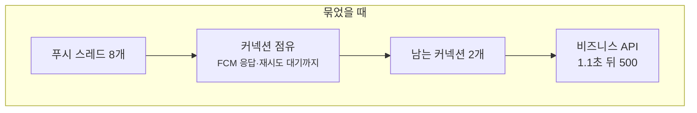
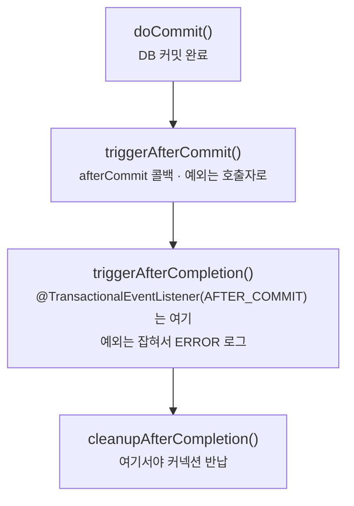
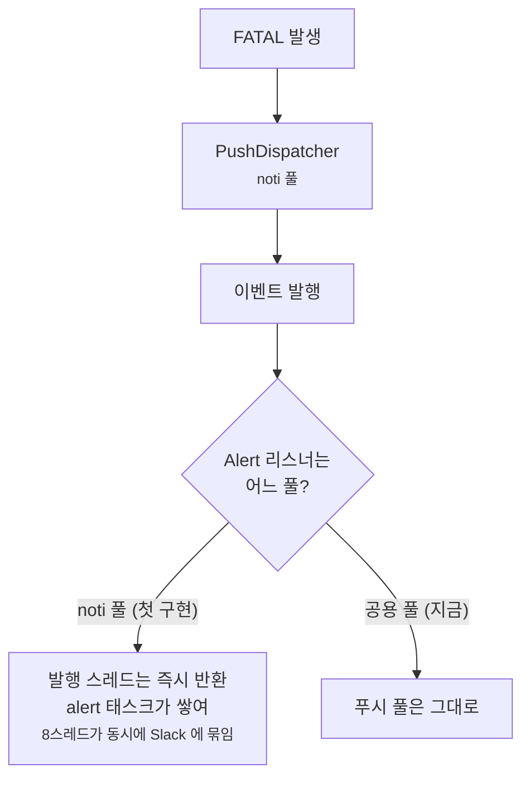

댓글을 달면 두 가지 일이 일어납니다. **댓글이 저장되고, 글쓴이에게 푸시가 갑니다.**

둘의 무게는 전혀 다릅니다. 댓글 저장이 실패하면 사용자가 쓴 글이 사라집니다.
푸시가 실패하면 알림이 하나 안 갈 뿐이고, 알림함에는 이미 남아 있습니다.

그러니까 **푸시는 best-effort**입니다. 실패해도 됩니다.

문제는 이겁니다.

> **실패해도 되는 작업이, 실패하면 안 되는 작업을 끌어내릴 수 있다.**

이 글은 그 연결을 하나씩 끊은 기록입니다. 그리고 글을 쓰면서 **코드에 적어 둔 이유를 하나씩 직접 돌려 봤는데, 여럿이 틀렸습니다.**
결정은 대부분 그대로 유지되지만, 틀린 이유 하나 밑에는 실제 결함이 숨어 있었습니다. 그 이야기까지 같이 적습니다.

## 어떻게 끌어내리나

푸시 한 건이 나가려면 이런 일이 필요합니다.

1. 그 회원의 기기 토큰과 안 읽은 알림 수를 **DB에서 읽고**
2. **FCM에 전송하고**
3. 죽은 토큰이 있으면 **DB에서 지운다**

1~3을 한 트랜잭션으로 묶으면 **FCM 왕복이 끝날 때까지 DB 커넥션을 쥐고 있습니다.**
재시도까지 하면 백오프 대기 시간 동안에도 쥐고 있습니다.

가정이 아니었습니다. 첫 구현이 정확히 이 모양이었습니다.
`@Transactional(REQUIRES_NEW)` 하나가 FCM 호출과 최대 3회 재시도 대기를 통째로 감쌌고,
머지 전 점검에서 걸렸습니다. 운영에 나간 적은 없습니다.

지금 운영 커넥션 풀은 **10개**이고, 커넥션을 못 받은 요청은 **1.1초** 기다리다 포기합니다.

```yaml
# db-core.yml (live)
maximum-pool-size: 10
minimum-idle: 10
connection-timeout: 1100
```

푸시 스레드는 최대 8개입니다. 8개가 FCM 응답을 기다리며 커넥션을 하나씩 쥐면 **10개 중 8개가 묶이고**(게다가 FCM 호출에는 타임아웃이 설정돼 있지 않아 그 대기에 상한이 없습니다. 마지막 절에서 다룹니다),
댓글 쓰기·글 조회 같은 진짜 요청은 커넥션을 못 받아 1.1초 뒤 예외로 끝납니다. 공통 예외 처리기가 이걸 500으로 응답합니다.



**알림이 안 간 것보다 훨씬 나쁜 일**입니다. 다만 부하를 걸어 이 상황을 실제로 만들어 본 적은 없습니다. 미측정입니다.

## 1단계. 트랜잭션에서 네트워크를 꺼낸다

DB 구간과 네트워크 구간을 분리했습니다.
`PushDispatchService`가 **짧은 트랜잭션 둘**만 갖고, 그 사이 FCM 호출은 트랜잭션 밖입니다.

```kotlin
@Transactional(propagation = Propagation.REQUIRES_NEW, readOnly = true)
fun loadDispatch(event: NotificationCreated): PushDispatch { /* 토큰·배지 조회 */ }

@Transactional(propagation = Propagation.REQUIRES_NEW)
fun removeInvalidTokens(fcmTokens: List<String>) { /* 무효 토큰 삭제 */ }
```

호출하는 쪽은 트랜잭션을 아예 선언하지 않습니다.

```kotlin
val dispatch = pushDispatchService.loadDispatch(event)
// 트랜잭션 밖. DB 커넥션을 쥐지 않은 채 네트워크 왕복과 재시도 대기가 일어난다.
val result = pushNotificationPort.send(dispatch.payload!!, dispatch.targets)
pushDispatchService.removeInvalidTokens(result.invalidTokens)
```

### `@Async`와 `@Transactional`을 한 메서드에 겹치지 않는 이유

코드 주석은 이유를 두 개 댑니다.

> `@Async` 와 `@Transactional` 을 한 메서드에 겹치면 프록시 적용 순서에 의존하게 되고,
> 무엇보다 FCM 왕복을 트랜잭션이 감싸면 안 된다

**첫 번째 이유는 틀렸습니다.** Spring은 이 순서를 고정해 둡니다.
`AsyncAnnotationBeanPostProcessor`는 생성자에서 `setBeforeExistingAdvisors(true)`를 호출하고,
그래서 기본 설정에서는 `@Async` advisor가 **항상 기존 advisor들보다 바깥**에 붙습니다.
두 애노테이션을 한 메서드에 붙이면 매번 같은 일이 일어납니다. 먼저 비동기 스레드로 넘어가고, 거기서 트랜잭션이 열립니다.

진짜 이유는 두 번째 하나입니다. 순서가 고정돼 있어도 **그렇게 열린 트랜잭션이 메서드 전체, 즉 FCM 왕복을 감쌉니다.**
그게 바로 앞 절의 문제입니다. 클래스를 둘로 나누면 `@Async`는 디스패처가, `@Transactional`은 서비스가 갖게 됩니다.
그러면 트랜잭션이 네트워크 호출을 감쌀 자리가 **구조적으로 없어집니다.**

## 2단계. 스레드풀을 나눈다

트랜잭션을 뺐어도 **스레드**는 여전히 공유됩니다.
FCM이 느리면 푸시 작업이 `@Async` 풀을 다 먹고, 다른 비동기 작업이 밀립니다. 그래서 풀을 둘로 나눴습니다.

| | `generalExecutor` | `notificationExecutor` |
| --- | --- | --- |
| core / max | 10 / 10 | **4 / 8** |
| queue | 10,000 | **500** |
| 거절 정책 | 기본(Abort) | **`LoggingDiscardPolicy`** |

이 격리에는 **컴파일러가 안 잡아 주는 함정**이 있고, 주석이 그걸 적어 뒀습니다.

> 이 분리는 `@Async` 가 이름을 명시할 때만 성립한다. 이름 없이 붙이면 공용 풀로 가고,
> 반대로 푸시와 무관한 작업에 이 이름을 붙이면 격리가 무너진다 —
> **두 방향 모두 실수해도 컴파일은 통과하므로** 선언 지점에서 어느 풀인지 읽히게 두는 것이 유일한 방어다.

`@Async`에 이름을 빠뜨리면 조용히 공용 풀로 갑니다. 에러도 경고도 없습니다.
**이 격리는 코드 구조가 아니라 규율로 유지됩니다.** 그래서 공용 풀에도 `generalExecutor`라는 이름을 붙여,
모든 `@Async`가 선언 지점에서 어느 풀인지 드러나게 했습니다.

## 3단계. 큐가 넘치면 — 적어 둔 이유를 직접 돌려 봤다

큐(500)가 가득 차면 `ThreadPoolExecutor`는 거절 정책에 따라 움직입니다. 후보는 셋이었고, 코드 주석은 이렇게 결론을 냈습니다.

> 기본 AbortPolicy 는 큐 포화 시 TaskRejectedException 을 @Async 호출 지점으로 동기 전파한다.
> 그 지점이 AFTER_COMMIT(=요청 스레드)이라 **best-effort 푸시가 비즈니스 API 를 500 으로 끌어내린다.**
> CallerRuns 는 요청 스레드에서 FCM I/O 를 돌려 지연을 만든다.
> 알림은 이미 알림함에 남아 있으므로 버리고 기록만 남기는 쪽을 택한다.

그럴듯합니다. 저도 그렇게 믿고 있었습니다. 그런데 이 글을 쓰면서 확인해 보니 **"500으로 끌어내린다"는 틀린 말이었습니다.**

### `AFTER_COMMIT`은 `afterCommit()`에서 돌지 않는다

푸시 디스패처의 선언은 이렇습니다.

```kotlin
@TransactionalEventListener(phase = TransactionPhase.AFTER_COMMIT)
@Async(NOTIFICATION_EXECUTOR)
fun on(event: NotificationCreated) { dispatchSafely(event) }
```

`@Async` 제출, 그러니까 큐에 넣는 시도는 이 리스너가 호출되는 순간 일어납니다. 그 순간이 언제인지가 핵심입니다.
이름만 보면 `TransactionSynchronization.afterCommit()`일 것 같지만, Spring의 `TransactionPhase` Javadoc은 명시적으로 부정합니다.

> **AFTER_COMMIT** — This is a specialization of `AFTER_COMPLETION` and therefore executes in the same sequence of events as `AFTER_COMPLETION` **(and not in `TransactionSynchronization#afterCommit()`)**.

두 콜백은 예외를 다르게 다룹니다. 같은 인터페이스의 Javadoc입니다.

| 콜백 | 예외는 |
| --- | --- |
| `afterCommit()` | **propagated to the caller** |
| `afterCompletion(int)` | **logged but not propagated** |

실제로 spring-tx 6.2.6 소스를 열어 보면 `AFTER_COMMIT` 리스너는 `afterCompletion`에서 실행되고,

```java
// TransactionalApplicationListenerSynchronization.PlatformSynchronization
public void afterCompletion(int status) {
    if (phase == TransactionPhase.AFTER_COMMIT && status == STATUS_COMMITTED) {
        processEventWithCallbacks();
    }
    // ...
}
```

그 호출은 예외를 전부 잡아서 로그만 남깁니다.

```java
// TransactionSynchronizationUtils
for (TransactionSynchronization synchronization : synchronizations) {
    try {
        synchronization.afterCompletion(completionStatus);
    }
    catch (Throwable ex) {
        logger.error("TransactionSynchronization.afterCompletion threw exception", ex);
    }
}
```

커밋 순서로 그리면 이렇습니다.



### 재현

소스 판독만으로 결론 내기 싫어서 운영 호출 사슬을 그대로 본뜬 최소 재현을 만들었습니다.

```
CommentService.create()                 @Transactional (요청 트랜잭션)
 └ NotificationListener                 AFTER_COMMIT, try/catch 없음 (최악 가정)
    └ NotificationHandler               REQUIRES_NEW (알림 적재)
       └ PushDispatcher                 AFTER_COMMIT + @Async(noti), FCM 대신 sleep 1.5초
```

푸시 풀을 core 1 / max 1 / queue 1로 줄이고 댓글 쓰기를 세 번 연달아 호출했습니다.
첫 번째가 스레드를, 두 번째가 큐를 차지하니 **세 번째가 거절됩니다.**
Spring 6.2.6, HikariCP(풀 10, 타임아웃 1.1초), 로컬 단일 실행입니다.

| 거절 정책 | 세 번째 호출 | 응답 시간 | 푸시 본문이 돈 스레드 | FCM 대기 중 쥔 커넥션 |
| --- | --- | --- | --- | --- |
| Abort | **정상 반환** | 3 ms | 실행 안 됨 | — |
| CallerRuns | 정상 반환 | **1,529 ms** | **`main`(요청 스레드)** | **2개** |
| Discard | 정상 반환 | 0 ms | 실행 안 됨 | — |

Abort의 로그는 이렇습니다.

```
[ERROR] [main] TransactionSynchronizationUtils - TransactionSynchronization.afterCompletion threw exception
org.springframework.core.task.TaskRejectedException: ExecutorService in active state did not accept task: ...
Caused by: java.util.concurrent.RejectedExecutionException: ... [Running, pool size = 1, active threads = 1, queued tasks = 1, ...]
```

주석의 앞 절반은 맞았습니다. `TaskRejectedException`은 **요청 스레드(`main`)에서 동기로** 던져집니다.
하지만 뒤 절반은 틀렸습니다. Spring이 `afterCompletion` 단계에서 잡아 버리니 **API는 500이 되지 않습니다.**
재현에서는 알림 리스너의 `try/catch`까지 빼 두었는데도 그랬습니다.

### 그래서 결정은 바뀌나

**안 바뀝니다. 이유가 바뀝니다.**

**Abort의 실제 비용은 500이 아니라 관측성입니다.** 거절이 "`afterCompletion threw exception`"이라는 범용 스택트레이스로 남습니다.
이게 푸시 거절이라는 걸 알려면 스택을 읽어야 하고, 큐 길이와 활성 스레드 수도 안 남습니다.
`LoggingDiscardPolicy`는 같은 사건을 검색 가능한 한 줄로 바꿉니다.

```kotlin
object LoggingDiscardPolicy : RejectedExecutionHandler {
    override fun rejectedExecution(runnable: Runnable, executor: ThreadPoolExecutor) {
        logger.error {
            "event=notification.push result=rejected queue=${executor.queue.size} " +
                "active=${executor.activeCount} reason=executor_saturated"
        }
    }
}
```

**CallerRuns는 주석이 적은 것보다 나쁩니다.** 지연만 생기는 게 아닙니다.
요청 스레드가 FCM을 기다리는 그 순간은 아직 `cleanupAfterCompletion` 전입니다.
**원래 요청의 커넥션과 알림 적재용 `REQUIRES_NEW` 커넥션을 둘 다 쥔 채로** 기다립니다. 재현에서 잰 값이 2개였습니다.
풀이 10이면 이런 요청 5개가 동시에 들어올 때 풀이 마릅니다(환산값이고 부하 실측은 없습니다).
1단계에서 없앤 문제가 거절 정책을 통해 요청 스레드 쪽으로 되돌아오는 셈입니다.

> 운영은 `JpaTransactionManager`이고 재현은 `DataSourceTransactionManager`입니다.
> 예외를 삼키는 코드는 둘이 공유하는 `AbstractPlatformTransactionManager` 경로에 있습니다.
> 커넥션 반납 시점은 spring-orm 소스로 확인했습니다. Spring이 Hibernate를
> `DELAYED_ACQUISITION_AND_HOLD`로 설정하고, `EntityManager`는 `doCleanupAfterCompletion`에서 닫힙니다.
> 운영 환경에서 이 수치를 잰 것은 아닙니다.

결국 이 결정이 성립하는 전제는 처음과 같습니다.

> **알림은 이미 알림함에 커밋돼 있다.** 푸시가 안 가도 사용자가 앱을 열면 봅니다.

전제가 깨지면 결론도 깨집니다. 재난 경보처럼 **유실이 허용되지 않는 도메인**이라면 버리는 정책은 답이 될 수 없습니다.
생산자를 늦춰서라도 보내야 하니 `CallerRuns`나 영속 큐가 맞습니다. 여기서 기각한 정책이 거기서는 정답입니다.

## 4단계. 외부 API 실패를 어떻게 읽을 것인가

FCM은 여러 이유로 실패하고, **전부 같이 다루면 안 됩니다.**

```kotlin
enum class FcmFailureAction {
    DELETE_TOKEN,  // 다시 유효해지지 않는 토큰. 삭제한다
    RETRY,         // 일시적. 실패한 토큰만 backoff 재시도한다
    DROP,          // 재시도하지 않는다
    FATAL,         // 인증/권한 문제처럼 전체 발송이 막힌 상태. 운영 Alert 승격 대상
}
```

### 하위 코드를 먼저 보는 이유

`FirebaseMessagingException`은 코드를 **두 계층**으로 들고 있습니다.

- **상위 `ErrorCode`** — HTTP status에서 옵니다
- **하위 `MessagingErrorCode`** — FCM이 알려 주는 구체적 원인입니다

```kotlin
fun classify(e: FirebaseMessagingException?): FcmFailureAction {
    if (e == null) return FcmFailureAction.DROP
    e.messagingErrorCode?.let { return classifyMessaging(it) }   // 하위 먼저
    return classifyTransport(e.errorCode)                        // 없을 때만 상위
}
```

이 순서는 첫 구현 다음 날 두 번 뒤집힌 끝에 정해졌습니다.

1. 처음에는 **하위 코드만** 봤습니다. 권한 문제로 하위 코드 없이 403만 오면 DROP으로 떨어져, 발송이 전부 실패해도 Alert가 뜨지 않았습니다.
2. 그래서 **상위를 먼저** 보게 고쳤습니다. 그러자 `SENDER_ID_MISMATCH`가 문제가 됐습니다. 이 코드는 "이 토큰은 다른 Firebase 프로젝트 것"이라는 **토큰 하나의 문제**인데, HTTP로는 **403**으로 옵니다. 상위만 보면 `PERMISSION_DENIED`, 즉 **전면 장애로 읽힙니다.** 그 결과 죽은 토큰이 영영 지워지지 않고, 오탐 Alert가 10분 스로틀 슬롯을 먹어 **진짜 전면 장애 Alert를 가립니다.**
3. 결국 **하위를 먼저 보고, 없을 때만 상위로** 폴백합니다.

2번을 테스트가 못 잡은 이유도 있었습니다. mock 헬퍼가 상위 코드를 `UNKNOWN`으로 하드코딩해 두어서, 분류 순서를 뒤집어도 테스트가 전부 통과했습니다.
그래서 FCM 코드별 **실제 HTTP status 짝**을 픽스처로 모으고, 분류표를 그 조합으로 고정했습니다.

### 지우지 않는 쪽을 고른 자리

```kotlin
// payload 결함일 수도 있어 토큰을 지우지 않는다. 지웠다가 정상 토큰을 날리는 쪽이 더 나쁘다.
MessagingErrorCode.INVALID_ARGUMENT,
MessagingErrorCode.QUOTA_EXCEEDED,
-> FcmFailureAction.DROP
```

`INVALID_ARGUMENT`는 토큰이 잘못됐을 수도 있고 **우리가 보낸 payload가 잘못됐을 수도** 있습니다.
구분이 안 되면 **덜 파괴적인 쪽**을 고릅니다. 알림 한 번 못 가는 것과 멀쩡한 사용자의 푸시를 영구히 끊는 것은 무게가 다릅니다.

### 재시도는 실패분만

```kotlin
var pending = chunk
repeat(properties.retry.maxAttempts) { attempt ->
    if (pending.isEmpty() || fatal) return@repeat
    val outcome = sendOnce(spec, pending)
    pending = outcome.retryTokens        // 실패한 것만 다음 시도로
    if (pending.isNotEmpty() && !fatal && attempt < maxAttempts - 1) sleepBackoff(attempt)
}
```

성공한 토큰이 섞인 배치를 통째로 다시 보내면 **이미 받은 사람에게 또 갑니다.** 그래서 `pending`만 넘깁니다.
백오프는 500ms에서 시작하는 지수 방식에 지터를 섞고, 첫 시도를 포함해 최대 3회 보냅니다. `fatal`이면 남은 시도를 건너뜁니다.

### 검증하다 보니 보인 두 틈

분류표를 다시 읽다가, 주석이 말하는 것보다 좁게 동작하는 곳 두 군데를 찾았습니다.

**"일시 장애는 재시도"는 FCM이 그렇게 답했을 때만입니다.** `RETRY`는 하위 코드가 `UNAVAILABLE`·`INTERNAL`일 때만 나옵니다.
타임아웃이나 연결 실패처럼 FCM에 닿지도 못한 실패는 하위 코드가 없고, 상위 코드는 `DEADLINE_EXCEEDED`나 `UNAVAILABLE`입니다.
`classifyTransport`는 이 둘을 `DROP`으로 보냅니다. 네트워크가 잠깐 흔들린 경우는 재시도하지 않습니다.

**"자격증명이 폐기되면 하위 코드 없이 401/403이 온다"는 절반만 맞을 수 있습니다.**
서비스 계정 키가 삭제되면 요청은 FCM에 가기 전, **액세스 토큰을 발급받는 단계**에서 실패합니다.
google-auth 1.47.0은 이 실패를 `GoogleAuthException`으로 감싸는데, 이 예외는 `IOException`이지 `HttpResponseException`이 아닙니다.
firebase-admin 9.10.0은 이런 `IOException`을 `ErrorCode.UNKNOWN`으로 바꾸고, 분류표는 `UNKNOWN`을 `DROP`으로 보냅니다.
즉 **토큰별 WARN은 쌓이지만 FATAL Alert는 안 뜹니다.**
FATAL이 확실히 잡는 경우는 토큰은 발급됐지만 FCM이 권한 문제로 거절한 경우입니다.
이건 라이브러리 코드를 읽고 한 추론이고, 실제 키를 폐기해 재현하지는 않았습니다.

## 5단계. 알림을 보내다 지키려던 풀을 도로 붙잡는 함정

`FATAL`이 나면 Slack으로 알려야 합니다. 여기에는 **재귀적인 함정**이 있었고, 실제로 한 번 빠졌습니다.

Slack 전송은 최대 3회 시도합니다. 그런데 설정의 3초(`alert.yml`)는 **연결 타임아웃으로만** 쓰입니다. 쓰고 있는 Slack 라이브러리가 `setReadTimeout`을 부르지 않기 때문입니다.
연결 단계만 따져도 최악 10초를 넘고, 연결된 뒤 응답이 늦으면 **상한이 없습니다.**
그리고 이 이벤트를 발행하는 `PushDispatcher`는 **푸시 풀에서 돕니다.**

첫 구현은 Alert 리스너에 `@Async(NOTIFICATION_EXECUTOR)`를 붙였습니다. 주석에는 "푸시 스레드를 붙잡지 않으려고"라고 적어 놓고,
붙인 이름은 **붙잡지 않겠다던 바로 그 풀**이었습니다.



`@Async`가 없었다면 Slack에 묶이는 건 발행 스레드 하나뿐이었을 겁니다.
`@Async`가 붙자 발행 스레드는 바로 돌아가고 Alert 태스크만 큐에 쌓여서, **푸시 풀 8스레드가 동시에 Slack에 묶일 수 있게 됐습니다.**
격리하려던 코드가 포화를 만든 겁니다. 같은 날 먼저 들어간 10분 스로틀이 볼륨을 막아 이 결함을 가리고 있었고, 머지 전 점검에서 잡혀 운영에 나가지는 않았습니다.

지금은 Alert만 **공용 풀**로 보냅니다.

```kotlin
@EventListener
@Async(AsyncConfig.GENERAL_EXECUTOR)
fun on(event: NotificationPushFatal) { ... }
```

### 그리고 10분에 한 번만

fatal 이벤트는 알림 건마다 발행됩니다. 자격증명이 막히면 **모든 발송이 fatal**이라 발송 수만큼 쌓이는데, 원인은 하나뿐이니 그만큼 알릴 이유가 없습니다.

```kotlin
private val lastAlertAt = AtomicReference(Instant.EPOCH)

private fun acquireAlertSlot(): Boolean {
    val current = now()
    val previous = lastAlertAt.get()
    if (Duration.between(previous, current) < ALERT_INTERVAL) return false
    return lastAlertAt.compareAndSet(previous, current)   // 10분
}
```

`compareAndSet`이라 **여러 스레드가 동시에 와도 한 건만** 나갑니다. 락도 별도 저장소도 필요 없습니다.
상태가 메모리에 있어서 인스턴스마다 따로 세는데, 운영 API 인스턴스가 1대라 지금은 문제가 되지 않습니다.

## 같은 `AFTER_COMMIT`, 다른 실패 정책 — 그리고 하나는 작동하지 않았다

이 시스템에는 `AFTER_COMMIT` 리스너가 셋 있고, **실패 정책이 전부 다릅니다.**

| 리스너 | 실패하면 | 왜 |
| --- | --- | --- |
| 개인 알림 적재 | **삼키고 ERROR 기록** | 본업은 이미 커밋됐다. 알림은 부수 효과 |
| 푸시 디스패치 | **별도 스레드에서 삼키고 기록** | 알림함 사본을 보내는 일이다 |
| **신고 제재** | **일부러 드러낸다** | 감추면 "승인됐는데 콘텐츠는 그대로"가 남는다 |

(브로드캐스트 팬아웃에도 `runCatching`이 있지만 `AFTER_COMMIT` 리스너는 아닙니다. 스케줄러와 콘텐츠 발행 경로가 부르는 포트 구현이고, 실패를 발송 원장에 `FAILED`로 남깁니다.)

판단 기준은 **"그 작업이 원 요청의 결과인가, 부수 효과인가"**입니다.
좋아요 알림은 부수 효과라 실패해도 좋아요는 유효합니다. 신고 제재는 **승인의 결과 그 자체**라, 실패하면 승인이 의미를 잃습니다.

드러내는 쪽에는 `try/catch`가 아예 없고, 이유가 주석에 적혀 있습니다.

> 신고 승인의 결과가 곧 대상 삭제라, 실패를 감추면 「승인됐는데 문제 콘텐츠는 그대로」인 상태가
> 조용히 남는다. 관리자 조치라 재시도가 멱등하고(삭제를 두 번 해도 같다) 호출자가 사람이므로,
> 드러내는 편이 낫다.

기준은 맞습니다. **그런데 3단계에서 본 그 메커니즘 때문에 이 의도는 실현되지 않습니다.**
`AFTER_COMMIT` 리스너가 던진 예외는 `afterCompletion`에서 잡혀 로그로만 남습니다. 재현 프로그램에 같은 사슬을 붙여 봤습니다.

```
ReportService.approve()          @Transactional
 └ ReportEnforcementListener     AFTER_COMMIT, try/catch 없음
    └ ReportEnforcementService   REQUIRES_NEW, 예외를 던진다
```

```
[ERROR] [main] TransactionSynchronizationUtils - TransactionSynchronization.afterCompletion threw exception
java.lang.IllegalStateException: 제재 집행 실패(재현용)
  report approve: returned normally
```

**승인 호출은 정상 반환됩니다.** 승인 API는 성공으로 응답하고, 콘텐츠는 그대로 남습니다.
남는 흔적은 푸시 거절 때와 같은 범용 ERROR 한 줄뿐입니다. 주석이 막으려던 "조용히 남는 상태"가 정확히 그대로 생깁니다.

같은 이유로 개인 알림 리스너의 `safely()`도 다시 봐야 합니다.

```kotlin
private fun safely(trigger: String, context: () -> String, block: () -> Unit) {
    runCatching(block).onFailure { error ->
        logger.error(error) { "event=notification.create result=failed trigger=$trigger ${context()}" }
    }
}
```

이 코드를 넣을 때는 "삼키지 않으면 이미 커밋된 댓글 요청이 500을 받는다"를 이유로 댔습니다. 그것도 틀렸습니다.
`safely()`가 없어도 Spring이 삼킵니다. 그래도 이 코드는 남길 가치가 있습니다.
**격리가 아니라 관측을 위해서입니다.** 어떤 트리거에서 무엇이 실패했는지를 검색 가능한 한 줄로 남기니까요.

### 왜 아무도 몰랐나

이 격리를 고정한다는 테스트가 있었습니다.

```kotlin
private val handler: NotificationEventHandlerService = mockk()
private val listener = NotificationListener(handler)

@Test
fun `댓글 알림이 실패해도 예외가 전파되지 않는다`() {
    every { handler.on(any<ContentCommentCreated>()) } throws RuntimeException("db down")
    assertThatCode { listener.on(commentCreated()) }.doesNotThrowAnyException()
}
```

이 테스트는 리스너 메서드를 **직접** 부릅니다. 트랜잭션도, 이벤트 발행도, `afterCompletion`도 거치지 않습니다.
그래서 "`safely()`가 예외를 삼킨다"는 증명하지만, "**삼키지 않으면 호출자에게 전파된다**"는 전제는 한 번도 시험되지 않았습니다.
주석과 커밋 메시지와 테스트가 같은 오해를 공유했고, 테스트는 초록이었습니다.

> **프레임워크가 어떻게 동작하는지에 대한 전제는 mock으로 고정할 수 없습니다.** 실제 트랜잭션을 태워야 드러납니다.

### 스스로 적어 둔 해법

신고 제재 주석은 사실 여기서 멈추지 않았습니다.

> **다만 이 구조 자체가 dual write 다** — 승인은 이미 커밋됐으므로 여기서 던져도 불일치는 안 고쳐진다.
> 올바른 해법은 삭제를 승인 트랜잭션 안으로 옮기는 것이다.

이 해법은 이번에 드러난 문제까지 같이 풉니다. 삭제가 승인과 같은 트랜잭션 안에 있으면 실패는 승인과 함께 롤백되고, 예외는 평범하게 호출자까지 올라갈 것입니다(아직 바꾸지 않았으니 예상입니다).
**다만 "지금은 드러나니까 견딘다"던 근거는 무너졌습니다.** 그러니 이 해법은 "언젠가"가 아니라 다음 작업입니다.

## 남은 것

이번 검증 뒤에도 남아 있는 것들입니다.

| 항목 | 상태 |
| --- | --- |
| 푸시 풀 core 4 · max 8 · queue 500 | **산정 근거 없음.** 코드에 `ponytail:` 마커로 남겼다. 부하 테스트에서 적체나 거절이 보이면 재산정 |
| `result=rejected` 로그 | **로그일 뿐 카운터가 아니다.** 레포에서 확인되는 모니터 정의도 없다. 큐가 넘쳐 푸시를 버려도 조용하다 |
| 신고 제재 실패 | **API에 드러나지 않는다**(재현 확인). 삭제를 승인 트랜잭션 안으로 옮겨야 한다 |
| 키 폐기형 자격증명 장애 | `UNKNOWN` → `DROP`으로 분류될 수 있다. 라이브러리 코드 판독이고, 실제 재현은 하지 않았다 |
| 전송 계층 일시 장애 | 재시도하지 않는다 |
| FCM 호출 타임아웃 | **설정돼 있지 않다.** firebase-admin 기본값 0이 그대로 실려 요청 객체에서 connect·read 모두 0(= 무한)으로 찍힌다(로컬 실측). 응답 없는 FCM에 푸시 스레드가 무기한 묶일 수 있다. 격리 덕에 API는 안전하고 푸시만 멈춘다 |
| Slack Alert 읽기 타임아웃 | **없다.** 공용 풀 스레드가 늦은 Slack 응답에 상한 없이 묶일 수 있다 |

앞에서 "큐 500"이라고 여러 번 썼지만 **그 500에는 산정 근거가 없습니다.** 마커를 쓸 당시(2026-09-21) 푸시 대상 기기가 31대라 넉넉했을 뿐입니다.
버리기로 한 결정은 맞다고 보지만, **버린 것을 세지 않는 건 별개 문제**입니다.

## 정리

연결을 끊은 지점은 넷이었습니다.

| 끊은 것 | 방법 |
| --- | --- |
| 커넥션 점유 | DB 구간을 `REQUIRES_NEW` 짧은 트랜잭션 둘로, FCM은 트랜잭션 밖 |
| 스레드 경합 | 푸시 전용 풀 분리 (4 / 8 / 500) |
| 요청 스레드로의 역류 | `CallerRuns` 기각, 거절은 버리고 구조화 로그로 기록 |
| Alert의 재귀 점유 | fatal Alert만 공용 풀 + 10분 CAS 스로틀 |

이 결정들의 바탕에는 **하나의 전제**가 있습니다. 알림은 이미 알림함에 있고, 푸시는 그 사본이라는 것입니다.
그래서 "버려도 된다"가 아니라 "**이 전제 위에서** 버려도 된다"가 정확한 문장입니다.

그리고 이번에 하나를 더 배웠습니다. **결정만 검증 대상인 게 아니라, 적어 둔 이유도 검증 대상입니다.**
거절 정책은 틀린 이유 위에서도 맞는 결론에 닿았습니다. 운이 좋았던 겁니다.
신고 제재는 틀린 이유 때문에 결함이 가려져 있었습니다.
`@TransactionalEventListener(phase = AFTER_COMMIT)`이라는 이름은 `afterCommit()`처럼 읽히지만, 실제로는 `afterCompletion()`에서 돕니다.
이름을 믿지 말고 실행해 보는 것, 이번 검증에서 얻은 교훈은 그것 하나입니다.
