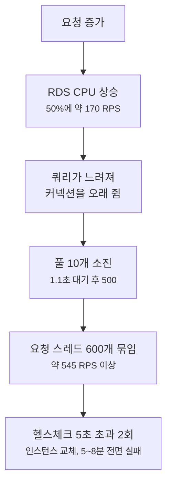

운영 서버에 관측 믹스 그대로 부하를 걸어 100 RPS까지 올려 봤습니다.
그 너머, 즉 서버가 실제로 깨지는 지점(breakpoint)은 재지 않았습니다.
운영에서 깨질 때까지 올리면 서버가 교체되면서 전면 장애가 나고, 운영과 같은 크기의 격리 환경은 아직 없습니다.

그래서 이번에는 측정한 추세를 이어 그어 어디서 먼저 무너질지 추정하고, 한계에 닿았을 때의 대응 순서를 미리 정했습니다.
결론을 먼저 적으면 이렇습니다.

- 이 조건(익명 GET, 관측 믹스, API만)에서 성능이 먼저 꺾이는 곳은 DB(RDS `db.t4g.micro`)로 추정합니다. RDS CPU 추세를 이으면 50%에 약 170 RPS, 서버 p99 190ms에 약 200 RPS입니다.
- 무너지는 모양은 커넥션 풀입니다. DB가 느려지면 요청이 커넥션을 최대 1.1초 기다리다 500으로 끝납니다.
- 가장 나쁜 모양은 서버 교체입니다. 요청 스레드가 모두 묶이거나 CPU가 가득 차면 헬스체크가 늦어지고, 인스턴스가 교체되는 동안 5~8분 동안 모든 요청이 실패합니다. 약 400~550 RPS 구간으로 환산됩니다.
- 부하 시험은 API만 쳤습니다. 공개 GET 요청의 80%는 웹 서버의 SSR에서 오는데, 그 웹 서버(`t2.micro`)의 한계는 재지 않았고 실제로는 이쪽이 먼저일 수 있습니다.
- 지금까지 관측한 가장 붐빈 1시간의 평균은 3.45 RPS로, 추정한 첫 꺾임의 약 50분의 1입니다. 아래 대응 순서는 지금 할 일이 아니라, 조건이 되면 꺼낼 순서입니다.

## 측정한 것

| 단계 (RPS) | 서버 p99 (ms) | API 서버 CPU, 5분 평균 (%) | RDS CPU 최대 (%) | RDS 여유 메모리 최저 (MiB) | Hikari 사용 중 최대 |
| --- | ---: | ---: | ---: | ---: | ---: |
| 9 | 50 | 7.5 | 6.3 | 106 | 1 |
| 17 | 48 | 9.4 | 8.2 | 108 | 1 |
| 35 | 52 | 13.9 | 12.3 | 97 | 2 |
| 70 | 76 | 21.6 | 23.4 | 85 | 2 |
| 100 | 101 | 조회 안 함 | 31.1 | 87 (swap +27) | 7 |

- 서버 p99는 ALB 접근 로그의 `target_processing_time`에서 부하 요청만 골라 집계했습니다.
- 각 단계는 5분이었고, 100 RPS는 약 4분 뒤 감시 규칙(Hikari 순간 몰림)에 걸려 멈췄습니다. 서버 오류(5xx)는 모든 단계에서 0이었습니다.
- 100 RPS에서 Hikari 사용 중 커넥션은 10초 표본 23개 기준 평균 1.26, 중앙값 1이었습니다. 요청 하나가 커넥션을 평균 3.25번 빌렸고, 한 번 빌리면 평균 약 3.9ms 쥐었습니다(환산).
- 환경은 API 서버 EC2 `t4g.medium` 1대(Tomcat 스레드 최대 600, Hikari 최대 10, 커넥션 대기 한도 1.1초)와 RDS PostgreSQL `db.t4g.micro` 1대(vCPU 2, 메모리 1 GiB, 단일 AZ)입니다.

## 자원별로 이어 그어 보기

### RDS CPU

다섯 단계의 최대값에 직선을 맞추면 `RDS CPU ≈ 0.278 × RPS + 3.4`입니다(r = 0.999).
이 직선으로는 50%에 168 RPS, 70%에 240 RPS, 100%에 347 RPS가 됩니다.

CPU가 50%를 넘으면 쿼리가 CPU를 기다리는 시간이 늘기 시작합니다.
100%까지 직선으로 가지 않고, 그 전에 응답 시간이 먼저 급하게 늘 것으로 봅니다.

### API 서버 CPU

100 RPS 값은 조회하지 않아 네 단계로 맞췄습니다. `CPU ≈ 0.231 × RPS + 5.5`(r = 0.9995)이고, 50%에 192 RPS, 100%에 409 RPS입니다.
DB보다 기울기가 조금 낮고 출발점이 비슷해서, CPU만 보면 API 서버가 DB보다 늦게 찹니다.

### 응답 시간

서버 p99는 17 → 35 → 70 → 100 RPS에서 48 → 52 → 76 → 101ms로 늘었고, 늘어나는 폭이 점점 커졌습니다.
마지막 두 점의 기울기(RPS당 0.83ms)를 그대로 이으면 평소의 두 배인 190ms에 약 207 RPS가 닿습니다.
기울기가 계속 커지는 중이라 실제로는 이보다 앞설 가능성이 높습니다. 207은 낙관적인 값입니다.

### 커넥션 풀

평균 사용량은 요청률 × 요청당 빌림 × 빌림당 점유 시간입니다.
100 × 3.25 × 3.9ms = 1.27로, 실측 평균 1.26과 맞습니다.
점유 시간이 그대로라면 평균이 10에 닿는 것은 약 790 RPS입니다.

하지만 점유 시간은 그대로 있지 않습니다.
DB가 느려지면 커넥션을 쥐는 시간이 늘고, 같은 요청률에서도 사용량이 불어납니다.
그래서 풀은 스스로 한계에 닿기보다 DB가 느려진 결과로 먼저 막힐 것으로 봅니다.
이미 100 RPS에서 평균 1.26일 때 순간값이 7까지 오른 적이 있고, 그 원인은 아직 모릅니다.

풀이 막히면 이 서버는 느려지지 않고 오류를 냅니다.
요청 스레드는 최대 600개인데 커넥션은 10개라, 넘치는 요청은 커넥션을 기다리다 1.1초 뒤 500으로 끝납니다.

### RDS 메모리

여유 메모리는 요청률에 비례하지 않았습니다. 단계별 최저값이 85~108 MiB 사이를 오갔고, 100 RPS에서 swap이 27 MiB 늘었습니다.
평소에도 swap을 200 MiB대로 쓰는 인스턴스라, 이 자원은 직선으로 이을 수 없습니다.
감시 기준(여유 메모리 64 MiB)에 언제 닿을지 추정하지 못했고, 가장 먼저 닿을 수도 있는 가장 불확실한 자원입니다.
swap을 얼마나 읽고 쓰는지는 Enhanced Monitoring이 꺼져 있어 보지 못했습니다.

### 요청 스레드와 헬스체크

DB가 포화돼 모든 요청이 1.1초씩 기다렸다 실패하는 상황이면, 스레드 600개가 처리할 수 있는 요청은 초당 약 600 / 1.1 ≈ 545건입니다(환산).
이보다 많이 들어오면 스레드가 모두 묶입니다.

헬스체크 경로(`/health`)는 DB를 거치지 않지만 같은 스레드 풀에서 처리됩니다.
스레드가 모두 묶이거나 CPU가 가득 차 헬스체크가 5초 안에 답하지 못하는 일이 두 번(30초 간격) 이어지면, 오토스케일링 그룹이 인스턴스를 교체합니다.
교체되는 동안은 최대 1대인 API가 없어 5~8분 동안 모든 요청이 실패합니다.
DB 쪽 문제만으로는 헬스체크가 실패하지 않지만, 요청이 이만큼 몰리면 이야기가 달라집니다.

### 웹 서버

부하 시험은 API에 직접 걸었습니다.
그런데 공개 GET 요청의 80%는 웹 서버(Next.js SSR)가 보냅니다. 웹 서버는 `t2.micro` 1대(vCPU 1, 메모리 1 GiB)입니다.

| 항목 | 값 |
| --- | --- |
| CPU 크레딧 모드 | Standard (AWS API로 확인) |
| 크레딧 적립 / 최대 보유 | 시간당 6 / 144 |
| 최근 14일 | 크레딧 최저 136.8, CPU 평균 3.3%, 시간 단위 최대 72.8% |

Standard 모드는 크레딧이 바닥나면 CPU가 기준선(10%)까지 깎입니다([AWS 문서](https://docs.aws.amazon.com/AWSEC2/latest/UserGuide/burstable-credits-baseline-concepts.html)).
CPU 100%로 돌면 시간당 60을 쓰고 6을 벌어서, 가득 찬 크레딧 144가 약 2.7시간이면 바닥납니다(환산).
그 뒤에는 처리 능력이 10분의 1이 됩니다.

지금까지 관측한 가장 붐빈 구간(60분 평균 3.45 RPS)은 크롤러로 보이는 요청이 웹의 정치인 상세 페이지를 훑은 것이었습니다.
정치인 상세는 페이지마다 1시간 캐시(ISR)가 있지만, 서로 다른 인물 약 3,000명의 페이지를 차례로 훑는 크롤러에게는 대부분 처음 보는 페이지라 캐시가 거의 소용없습니다.
웹 서버의 한계는 재지 않았으므로, 방문자 입장에서 먼저 무너지는 곳은 API가 아니라 웹일 수 있습니다.

## 추정 요약

| 요청률 (API, 이 믹스) | 일어날 일 | 근거 | 성격 |
| --- | --- | --- | --- |
| 약 63 RPS 지속 | API 서버 CPU가 버스트 기준선 20%를 넘어 초과분에 요금이 붙습니다(Unlimited 모드라 느려지지는 않음) | CPU 직선, `t4g.medium` 기준선 | 환산 |
| 약 170 RPS | RDS CPU 50%, 쿼리 대기가 늘기 시작 | RDS CPU 직선 | 추정 |
| 약 200 RPS 이하 | 서버 p99가 평소의 두 배(190ms) | p99 마지막 기울기, 낙관적 | 추정 |
| 약 240~350 RPS | RDS CPU 70~100%, 풀 대기가 이어져 500이 나기 시작 | RDS CPU 직선과 풀 동작 | 추정 |
| 약 400~550 RPS | API 서버 CPU 100% 또는 스레드 고갈, 헬스체크 실패, 인스턴스 교체 | CPU 직선, 600 / 1.1초 | 환산 |
| 알 수 없음 | RDS 여유 메모리 64 MiB 아래, swap 증가 | 비례하지 않음 | 미측정 |
| 알 수 없음 | 웹 서버 CPU 포화, 2.7시간 뒤 크레딧 소진으로 10% 제한 | 크레딧 계산 | 미측정 |

이 표를 그대로 믿으면 안 되는 이유가 있습니다.

- 100 RPS까지 잰 직선을 그 너머로 이었습니다. 포화에 가까워질수록 직선에서 벗어나는 것이 보통입니다.
- 각 단계가 5분이었습니다. 몇 시간 이어지는 부하에서 메모리와 swap이 어떻게 되는지는 모릅니다.
- 요청이 전부 익명 GET입니다. 로그인 사용자의 개인화 조회와 쓰기는 빠졌습니다.
- 믹스의 서버 시간 23%가 정치인 목록 API 하나였고, 그중 인기순 집계 쿼리는 시험 이후 고쳐 배포했습니다. 요청당 DB 비용이 줄었을 것이므로 위 요청률은 보수적인 쪽일 수 있지만, 재지 않았습니다.
- 운영 DB 인스턴스에는 dev 데이터베이스도 함께 있습니다. dev에서 일어나는 일이 이 숫자를 흔듭니다.

## 한계에 닿으면 무엇을 할까

### 0. 먼저 알아차려야 한다

지금은 이 한계들에 닿아도 바로 알려 줄 경보가 없습니다.
CloudWatch 경보는 하나도 없고(AWS API로 확인), Datadog에는 Hikari와 RDS 지표가 들어오지 않습니다.
부하 시험 때는 별도 감시 스크립트로 이 값들을 봤습니다.

그래서 가장 먼저 할 일은 경보입니다.

| 경보 | 기준 (제안) | 왜 |
| --- | --- | --- |
| ALB 5xx 비율, 서버 p99 | 5xx 1% 이상, p99 190ms 이상이 5분 지속 | 사용자가 보는 증상 |
| RDS CPU | 5분 평균 50% 이상 | 추정한 첫 꺾임 |
| RDS 여유 메모리, swap | 64 MiB 미만, swap 256 MiB 초과 | 가장 불확실한 자원 |
| 웹 서버 CPU 크레딧 | 잔고 50 미만 | 바닥나면 10%로 제한 |
| Hikari 대기, 타임아웃 | 대기 요청이 30초 이상 이어짐, 타임아웃 1건 이상 | 500 직전 신호 |

RDS의 Enhanced Monitoring도 켭니다. 중단 없이 켤 수 있고([AWS 문서](https://docs.aws.amazon.com/AmazonRDS/latest/UserGuide/USER_ModifyInstance.Settings.html)), swap을 얼마나 읽고 쓰는지 볼 수 있습니다.

### 1. 원인이 사용자인지 크롤러인지 가른다

지금까지 관측한 최대 부하는 사용자가 아니라 크롤러로 보이는 요청이었습니다.
알림을 보낸 직후의 급증은 10분 안의 분당 최대가 중앙값 14~23건으로 작았습니다.

크롤러가 원인이면 증설보다 요청률 제한이 먼저입니다.
ALB 접근 로그에서 호스트와 사용자 에이전트, IP별 요청 수를 보면 가를 수 있습니다.
크롤러면 WAF에 IP별 요청률 규칙을 걸고, 문제가 되는 경로를 `robots.txt`로 막습니다. 서버는 그대로 둡니다.

### 2. 몇 분 안에, 중단 없이 할 수 있는 것

| 할 일 | 효과 | 대가 |
| --- | --- | --- |
| dev 환경 끄기 (`/dev off`) | 같은 DB 인스턴스에서 dev 몫의 부하와 커넥션이 빠짐 | 개발이 멈춤 |
| 웹 서버 크레딧 모드를 Unlimited로 변경 | 크레딧이 바닥나도 10%로 깎이지 않음. 실행 중에 바로 바꿀 수 있음([AWS 문서](https://docs.aws.amazon.com/AWSEC2/latest/UserGuide/burstable-performance-instances-how-to.html)) | 기준선을 넘은 만큼 요금 |

### 3. 중단이 따르는 상향

RDS 인스턴스 클래스를 올리면 DB가 멈춥니다(AWS 문서: "Downtime occurs during this change").
단일 AZ라 그동안 모든 요청이 실패하고, 몇 분이 걸릴지는 재 보지 않았습니다.
다중 AZ 전환은 중단 없이 할 수 있으므로, 다중 AZ로 먼저 바꾸고 클래스를 올리면 중단을 장애 조치 시간으로 줄일 수 있습니다. 대신 DB 비용이 늘어납니다.

API 서버의 인스턴스 타입을 올리는 것은 평소 배포(blue/green)처럼 새 인스턴스로 갈아 끼우면 중단 없이 될 것으로 보지만, 해 보지는 않았습니다. 인프라 코드를 바꿔 사람이 적용해야 합니다.

### 4. 서버를 2대로 늘리는 것은 스위치가 아니다

API 서버 그룹은 최대 1대로 고정해 두었습니다.
2대로 늘리기 전에 풀어야 할 것이 있습니다.

- API 서버 안에서 도는 스케줄러가 두 개 있고, 분산 락이 없습니다.
  - 브로드캐스트 알림은 회차마다 고유 키(`slot_key` UNIQUE)가 있어 두 대가 동시에 돌아도 한 번만 나갑니다.
  - 인물 랭킹 집계는 코드 주석에 "여러 대로 뜨면 같은 회차가 인스턴스 수만큼 집계된다"고 적혀 있습니다. 먼저 잠금을 붙이거나 한 대에서만 돌게 해야 합니다.
- DB 커넥션 예산은 `max_connections` 81에서 관리용 예약분을 뺀 78 − R개입니다. API 몫이 2대 × 10 = 20개로 늘어나므로, 배치와 파이프라인 같은 다른 사용처까지 더해 예산 안에 드는지 먼저 확인해야 합니다.

### 5. 무너지는 모양을 바꾼다

지금은 과부하가 오면 스레드 600개가 커넥션 10개를 두고 1.1초씩 기다리다 500을 냅니다.
스레드를 50~100개로 줄이고 대기열(`accept-count`)을 정하면, 넘치는 요청이 즉시 500이 되는 대신 줄을 서서 느리게 처리되는 쪽으로 바뀝니다.
스레드가 적을수록 헬스체크가 묶일 여지도 줄어듭니다.
쿼리 하나가 커넥션을 오래 쥐지 못하게 `statement_timeout`도 겁니다.

이 둘은 과부하에서만 효과가 보이므로 운영이 아니라 격리 환경의 과부하 시험으로 확인한 뒤 적용합니다.

### 6. 구조를 바꾼다

- 캐시: 조회가 대부분이고, 서버 시간의 23%가 정치인 목록 API 하나에서 나옵니다.
- 크롤러가 여는 웹 페이지의 캐시 시간을 늘리고 sitemap 생성 비용을 줄입니다.
- 읽기 복제본: 요청의 대부분이 읽기입니다.

이 단계는 앞의 경보와 증설로 버틸 수 없다는 근거가 쌓였을 때 합니다.

## 언제 꺼내나

위 순서를 언제 시작할지 기준을 정해 둡니다. 모두 제안값입니다.

| 신호 | 할 일 |
| --- | --- |
| 지금 | 0단계 경보와 Enhanced Monitoring |
| 실트래픽의 60분 피크가 40 RPS를 넘음 | 격리 환경을 만들어 breakpoint를 실제로 잰다. 이 글의 추정을 측정으로 바꾼다 |
| RDS CPU 5분 평균 40% 이상이 하루에 여러 번, 또는 p99 150ms 이상이 이어짐 | 3단계 (다중 AZ 전환 후 RDS 상향) |
| 크롤러 급증 | 1단계 (요청률 제한), 필요하면 2단계 (웹 서버 Unlimited) |

40 RPS는 추정한 첫 꺾임(약 170 RPS)의 약 4분의 1입니다.
직선을 이은 추정의 오차를 모르고, 격리 환경을 만들고 재는 데 시간이 걸리므로 여유를 크게 잡았습니다.

## 한계

- 이 글의 요청률은 모두 100 RPS까지 잰 값을 이어 그은 추정이나 환산입니다. 실제 breakpoint는 재지 않았습니다.
- 웹 서버의 한계는 재지 않았습니다.
- RDS 메모리와 swap이 언제 문제가 될지는 추정하지 못했습니다.
- RDS 클래스 변경에 걸리는 중단 시간은 재지 않았습니다.
- 경보 기준은 이 추정을 바탕으로 한 제안이고, 오탐 빈도는 아직 모릅니다.
- Datadog 쪽 모니터 설정은 확인하지 않았습니다.
