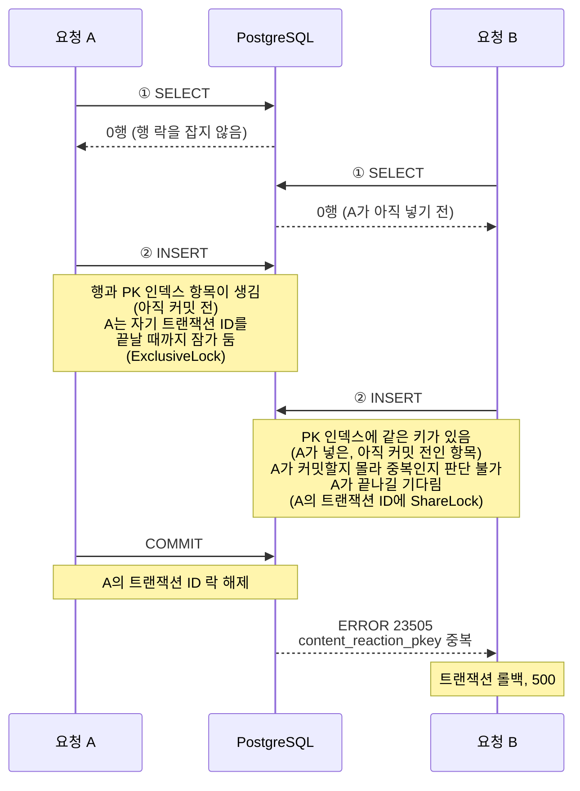
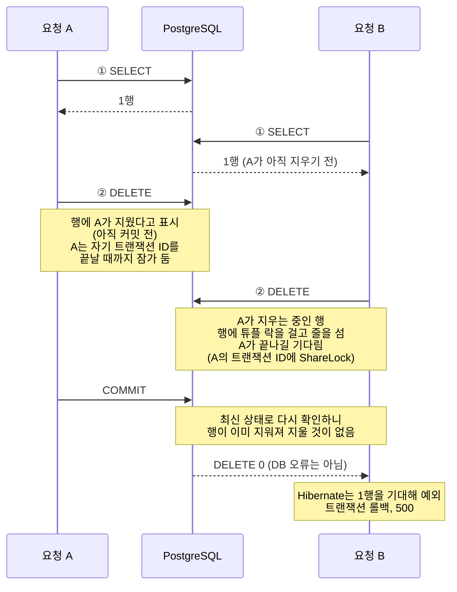
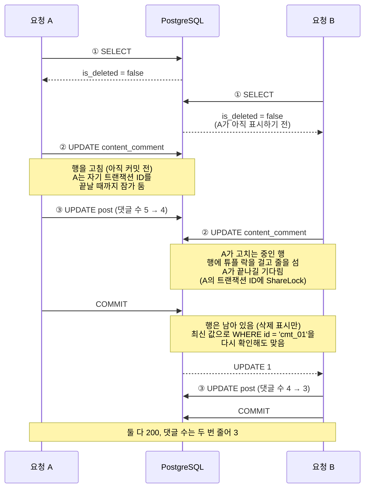

앱의 좋아요 버튼에는 요청이 끝날 때까지 다시 누르지 못하게 막는 장치가 없었습니다.
빠르게 두 번 누르면 같은 요청 두 개가 거의 동시에 서버에 도착합니다.
서버는 "있는지 조회하고, 없으면 저장한다"는 모양이라 두 요청이 모두 "없음"을 보고 저장을 시도하고, 늦게 온 요청은 기본 키 충돌로 500이 됩니다.
댓글 삭제는 반대로 두 요청이 모두 성공해서 댓글 수가 두 번 줄어듭니다.
운영에서 관측한 것이 아니라, 코드를 읽고 PostgreSQL에서 재현한 결과입니다.

결과를 먼저 요약하면 이렇습니다.

- PostgreSQL 16 컨테이너에서 두 트랜잭션의 순서를 고정해 수정 전 SQL을 돌렸습니다. 반응 INSERT는 늦게 온 쪽이 23505(유니크 위반)로 실패했고, 댓글 삭제 UPDATE는 두 요청이 모두 1행씩 바꿨습니다.
- 반응·투표·댓글 반응·평가의 저장과 취소, 댓글·게시글 삭제를 두 가지 방법으로 고쳤습니다. 저장은 `INSERT ... ON CONFLICT DO NOTHING`으로 바꾸고, 삭제와 상태 변경은 바뀐 행 수를 돌려받는 조건부 쿼리로 바꿨습니다. 실제로 행을 바꾼 요청만 이벤트를 냅니다.
- 앱에서는 TanStack Query의 `scope`로 같은 대상의 요청을 누른 순서대로 한 줄로 보내게 했습니다. 화면은 누르는 즉시 바뀝니다.

## 발견한 경위

같은 요청이 동시에 두 번 들어오면 쓰기 경로에서 문제가 날 수 있다는 건 알고 있었지만, 직접 재현해 보지는 않았습니다.

익명 GET만으로 부하 시험을 마치고 나니 쓰기 경로는 한 번도 확인하지 않은 채로 남아 있었습니다. 그래서 이번에 재현해 보기로 했습니다.
준비하면서 먼저 읽고 나서 쓰는 코드가 반응, 투표, 평가, 삭제에 두루 있다는 것, 앱 버튼에 잠금이 없어 연타가 그대로 서버에 온다는 것도 확인했습니다.

## 앱에서 연타가 서버로 가는 모양

반응 훅은 누른 시점의 캐시에서 다음 상태(좋아요 또는 취소)를 계산하고, 화면을 먼저 바꾼 뒤 요청을 보냅니다.
요청 중에 버튼을 막지 않으므로 두 번째 탭은 첫 요청이 끝나기 전에 나갑니다.

| 버튼 | 요청 중 잠금 |
| --- | --- |
| 콘텐츠 반응 (아티클, 의안, 게시글) | 없음 |
| 게시글 투표 | 없음 |
| 댓글 반응 | 없음 |
| 정치인 평가와 평가 취소 | 없음 |
| 댓글 삭제, 게시글 삭제 | 확인창만 있음 |
| 댓글 작성, 글 작성, 신고, 가입 | 있음 (요청 중 버튼 비활성) |

좋아요와 취소를 빠르게 이어 누르면 PUT과 DELETE가 거의 동시에 나가고, 서버에 어느 쪽이 먼저 도착할지는 정해져 있지 않습니다.

## 서버의 조회 후 저장

연타가 서버에 닿으면 경로마다 다른 모양으로 깨집니다. 저장, 취소, 삭제 순서로 봅니다.

### 반응 저장: 늦게 온 요청이 500

수정 전 반응 저장 코드입니다.

```kotlin
private fun likeContent(command: ReactToContentCommand, now: LocalDateTime) {
    val existing = contentReactionPort.findByTargetAndMemberId(
        command.contentType,
        command.contentId,
        command.memberId,
    )
    val reaction = ContentReaction(command.contentType, command.contentId, command.memberId, command.type)
    when {
        existing == null -> {
            contentReactionPort.save(reaction)
            eventPublisher.publishEvent(ContentReactionCreated(/* ... */))
        }
        existing.type == command.type -> return
        else -> contentReactionPort.update(reaction)
    }
}
```

이 코드에서 충돌과 관련된 문장은 둘입니다. Hibernate가 보내는 문장에서 별칭을 빼고 예시 값을 넣었습니다.

```sql
-- ① 이미 반응했는지 조회
SELECT content_type, content_id, member_id, type, created_at
  FROM content_reaction
 WHERE content_type = 'INTELLIGENCE_ARTICLE'
   AND content_id   = 'intel_art_01'
   AND member_id    = 'mem_01';

-- ② 없으면 저장
INSERT INTO content_reaction (content_type, content_id, member_id, type, created_at)
VALUES ('INTELLIGENCE_ARTICLE', 'intel_art_01', 'mem_01', 'LIKE', now());
```

같은 회원의 연타로 두 요청이 겹치면, PostgreSQL 기본 격리 수준(READ COMMITTED)에서 이렇게 진행됩니다.



B가 기다리는 동안 락 상태를 보면 이렇습니다. 서로 막지 않는 테이블 단위 락은 뺐습니다.

| 세션 | 락 대상 | 모드 | 상태 |
| --- | --- | --- | --- |
| A | A의 트랜잭션 ID | ExclusiveLock | 잡음 |
| B | A의 트랜잭션 ID | ShareLock | **대기** |
| B | B의 트랜잭션 ID | ExclusiveLock | 잡음 |

`pg_stat_activity`에서도 B의 대기 이벤트는 `Lock / transactionid`로 나옵니다.

이 흐름에서 헷갈리기 쉬운 점이 세 가지 있습니다.

- **두 요청이 같은 키가 되는 이유.** 반응 테이블의 기본 키는 따로 발급하는 번호가 아니라 `(content_type, content_id, member_id)`, 곧 "누가 무엇에 반응했나"입니다.
  같은 회원이 같은 아티클을 연타하면 두 요청이 넣으려는 값이 똑같습니다. 한 회원이 한 콘텐츠에 반응을 하나만 남기도록 기본 키로 막아 둔 것이 여기서 충돌로 드러납니다.
- **행 X락이 아닌 이유.** PostgreSQL의 행 락은 이미 있는 행을 고치거나 지울 때(UPDATE, DELETE, `SELECT … FOR UPDATE`) 겁니다.
  B가 INSERT하는 순간 A의 행은 아직 커밋 전이라 B에게는 보이지 않는 행이고, 락을 걸 행이 없습니다. PostgreSQL은 MySQL(InnoDB)처럼 인덱스 레코드에 락을 걸어 기다리게 하지도 않습니다.
- **트랜잭션 ID를 기다리는 이유.** B는 PK 인덱스에서 같은 키를 찾았지만, 그 키를 넣은 A가 커밋하면 중복이고 롤백하면 중복이 아닙니다. B가 알아야 하는 건 키가 아니라 A가 어떻게 끝나는지입니다.
  PostgreSQL에서 "다른 트랜잭션이 끝날 때까지 기다리기"는 그 트랜잭션의 ID에 락을 요청하는 방식입니다. 모든 트랜잭션은 끝날 때까지 자기 ID에 `ExclusiveLock`을 쥐고 있고, 기다리는 쪽은 그 ID에 `ShareLock`을 요청해 A가 락을 놓을 때까지 멈춥니다.

그래서 A가 커밋하면 중복이 확정되어 B는 23505로 실패하고, A가 롤백하면 B의 INSERT는 그대로 성공합니다.
A가 이미 커밋한 뒤에 B의 INSERT가 도착하면 기다리지 않고 곧바로 23505가 납니다. 어느 쪽이든 결과는 같습니다.

늦게 온 요청은 같은 트랜잭션에서 하던 일이 모두 롤백되고 500을 받습니다.

### 취소: 늦게 온 삭제가 0행이 되어 예외

반응·투표·댓글 반응의 취소는 다른 모양으로 깨집니다. 수정 전 콘텐츠 반응 취소 코드입니다.

```kotlin
@Transactional
fun cancelContentReaction(command: CancelContentReactionCommand) {
    val existing = contentReactionPort.findByTargetAndMemberId(
        command.contentType,
        command.contentId,
        command.memberId,
    ) ?: throw ReactionNotFoundException()
    // 내부에서 deleteByContentTypeAndContentIdAndMemberId(...)를 부른다
    contentReactionPort.delete(command.contentType, command.contentId, command.memberId)
    eventPublisher.publishEvent(ContentReactionDeleted(/* ... */))
}
```

Spring Data JPA의 파생 삭제 메서드(`deleteBy...`)는 DELETE 한 문장을 보내지 않고, 조건에 맞는 엔티티를 먼저 읽은 뒤 하나씩 지웁니다.
그래서 DB에는 이렇게 나갑니다. 값은 예시입니다.

```sql
-- ① 반응이 있는지 조회. 코드의 조회와 deleteBy가 같은 조건으로 읽는다
SELECT content_type, content_id, member_id, type, created_at
  FROM content_reaction
 WHERE content_type = 'INTELLIGENCE_ARTICLE'
   AND content_id   = 'intel_art_01'
   AND member_id    = 'mem_01';

-- ② 읽은 엔티티를 기본 키로 지운다
DELETE FROM content_reaction
 WHERE content_type = 'INTELLIGENCE_ARTICLE'
   AND content_id   = 'intel_art_01'
   AND member_id    = 'mem_01';
```

같은 회원이 취소를 연타하면 이렇게 진행됩니다.



B가 기다리는 동안 락 상태는 이렇습니다.

| 세션 | 락 대상 | 모드 | 상태 |
| --- | --- | --- | --- |
| A | A의 트랜잭션 ID | ExclusiveLock | 잡음 |
| B | 지우려는 행 (튜플) | AccessExclusiveLock | 잡음 |
| B | A의 트랜잭션 ID | ShareLock | **대기** |
| B | B의 트랜잭션 ID | ExclusiveLock | 잡음 |

반응 저장 때와 다른 점은 행이 이미 있다는 것입니다.
B는 먼저 그 행에 튜플 락을 겁니다. 같은 행을 기다리는 요청이 여럿이면 이 락으로 순서를 정합니다.
그다음은 저장 때와 같습니다. 행을 지운 A가 커밋할지 롤백할지 알아야 하니 A의 트랜잭션 ID를 기다립니다.

A가 커밋하면 PostgreSQL은 B의 DELETE를 그 행의 최신 상태에 다시 맞춰 봅니다(READ COMMITTED).
행은 이미 지워졌으니 지울 것이 없고, B의 DELETE는 오류 없이 0행으로 끝납니다.
DB에서는 정상 종료지만 앱에서는 아닙니다. Hibernate는 읽어 둔 엔티티를 지우는 DELETE가 1행을 바꿀 것으로 기대하는데, 0행이 나오면 다른 트랜잭션이 먼저 바꿨다고 보고 예외를 던집니다. 이 예외가 처리되지 않아 500이 됩니다.

### 댓글 삭제: 둘 다 성공해 수가 두 번 줄어든다

댓글 삭제는 반대로 둘 다 성공합니다. 수정 전 코드입니다.

```kotlin
@Transactional
fun deleteComment(commentId: String, actorId: String, role: RoleType) {
    val comment = contentCommentLoader.loadActive(commentId) // 없거나 이미 지워졌으면 404
    val deletedAt = LocalDateTime.now()
    contentCommentPort.update(comment.markDeletedBy(actorId, role))
    contentEventPublisher.publishDeleted(comment, actorId, role, deletedAt)
}
```

댓글 엔티티에는 버전 컬럼(`@Version`)이 없어서, 삭제 표시는 읽어 둔 값을 모든 컬럼에 다시 쓰는 UPDATE가 됩니다.
삭제 이벤트를 받은 리스너는 같은 트랜잭션에서 댓글 수를 줄입니다. 게시글에 단 댓글이라면 DB에는 이렇게 나갑니다.

```sql
-- ① 지울 댓글 조회. 이미 지워진 댓글인지 확인한다
SELECT id, content_type, content_id, parent_id, author_id, content, reply_count, is_deleted, created_at, updated_at
  FROM content_comment
 WHERE id = 'cmt_01';                                  -- is_deleted = false

-- ② 삭제 표시. 읽어 둔 값을 모든 컬럼에 다시 쓴다
UPDATE content_comment
   SET content_type = 'POST', content_id = 'post_01', parent_id = NULL, author_id = 'mem_01',
       content = '댓글', reply_count = 0, is_deleted = true, updated_at = now()
 WHERE id = 'cmt_01';

-- ③ 리스너가 게시글의 댓글 수를 줄인다
UPDATE post SET comment_count = comment_count - 1 WHERE id = 'post_01';
```

같은 회원이 삭제를 연타하면 이렇게 진행됩니다. 댓글 수는 5개에서 시작합니다.



B가 기다리는 동안 락 상태는 취소 때와 같은 모양입니다. 행을 고치는 UPDATE라 튜플 락의 모드만 한 단계 약합니다.

| 세션 | 락 대상 | 모드 | 상태 |
| --- | --- | --- | --- |
| A | A의 트랜잭션 ID | ExclusiveLock | 잡음 |
| B | 고치려는 행 (튜플) | ExclusiveLock | 잡음 |
| B | A의 트랜잭션 ID | ShareLock | **대기** |
| B | B의 트랜잭션 ID | ExclusiveLock | 잡음 |

차이는 A가 커밋한 뒤에 있습니다. 댓글 삭제는 행을 실제로 지우지 않고 `is_deleted`를 true로 바꾸는 표시만 합니다. 그래서 A가 커밋한 뒤에도 행은 그대로 남아 있습니다.
기다리던 B의 UPDATE는 A가 커밋하면 바로 실행되지 않고, 먼저 그 행의 최신 값이 자기 WHERE 조건에 아직 맞는지 다시 확인합니다(READ COMMITTED의 동작). 취소 때는 이 확인에서 행이 이미 사라져 0행이 됐습니다.
댓글은 행이 남아 있고, B의 조건은 `WHERE id = 'cmt_01'` 하나뿐입니다. id는 그대로이니 조건에 맞고, B는 이미 true인 `is_deleted`를 한 번 더 true로 쓰며 1행을 바꿉니다.
두 요청이 모두 성공했으니 삭제 이벤트도 두 번 나가고, 리스너가 댓글 수를 두 번 줄입니다. 답글이었다면 부모 댓글의 답글 수도 두 번 줄어듭니다.

①에서 이미 지워진 댓글인지 확인하지만, 두 요청이 모두 A가 커밋하기 전에 읽었으니 둘 다 통과합니다.
버전 컬럼이 있었다면 B의 UPDATE는 `WHERE id = ? AND version = ?`가 되어 0행으로 끝났을 것입니다.

## 순서를 고정해서 재현하기

결과를 정하는 것은 DB의 동시성 규칙이라, HTTP 부하를 거는 대신 두 트랜잭션의 순서를 코드로 고정했습니다.

1. 트랜잭션 A가 문장을 실행하고 커밋하지 않습니다.
2. 트랜잭션 B가 같은 행에 같은 문장을 실행합니다.
3. B가 300ms 안에 끝나지 않는 것을 확인합니다. A를 기다리고 있다는 뜻입니다. 그 안에 끝나 버렸다면 겹침을 만들지 못한 것이라 테스트를 실패로 처리합니다.
4. A를 커밋하고 B의 결과를 봅니다.

```kotlin
private fun <T> overlap(finishFirst: () -> Unit, second: () -> T): Result<T> {
    val executor = Executors.newSingleThreadExecutor()
    try {
        val started = CountDownLatch(1)
        val future = executor.submit<Result<T>> {
            started.countDown()
            runCatching(second)
        }
        assertThat(started.await(1, TimeUnit.SECONDS)).isTrue()
        assertThatThrownBy { future.get(300, TimeUnit.MILLISECONDS) }
            .describedAs("뒤 트랜잭션이 앞 트랜잭션을 기다려야 겹친 것이다")
            .isInstanceOf(TimeoutException::class.java)

        finishFirst()

        return future.get(5, TimeUnit.SECONDS)
    } finally {
        executor.shutdownNow()
    }
}
```

DB는 Testcontainers의 `postgres:16-alpine`에 Flyway 마이그레이션 전체를 올린 것입니다. 운영 RDS와 메이저 버전이 같습니다.
인수 테스트가 쓰는 H2는 운영과 동시성 동작이 같다는 보장이 없어서 여기에 쓰지 않았습니다.

수정 전 SQL의 결과는 이랬습니다. 두 경우 모두 A는 1행을 바꿨고, B는 A가 끝나길 기다렸습니다.

| 문장 | B의 결과 |
| --- | --- |
| 반응 INSERT (JPA 저장이 내던 모양) | 23505, `content_reaction_pkey` |
| 댓글 삭제 UPDATE (조건 없음) | 성공, 1행 |

## 경로별로 바뀐 것

| 경로 | 수정 전 (늦게 온 요청) | 수정 후 |
| --- | --- | --- |
| 콘텐츠 반응·투표·댓글 반응 연타 | 500 (콘텐츠 반응은 SQL 수준 재현, 나머지는 같은 모양) | 200, 이벤트 1번 |
| 반응·투표·댓글 반응 취소 연타 | 500 (코드 추적) | 200, 이벤트 1번 |
| 댓글 삭제 연타 | 둘 다 200, 댓글 수 2 감소 (UPDATE 두 번 성공은 SQL 수준 재현) | 200, 댓글 수 1 감소 |
| 정치인 첫 평가 연타 | 500 (코드 추적) | 200, 늦게 온 요청은 점수만 덮어씀 |
| 정치인 평가 취소 연타 | 500 (코드 추적) | 404 |
| 리포스트가 달린 게시글 삭제 연타 | 500 (코드 추적) | 200 |

같은 요청을 순서대로 두 번 보냈을 때의 응답은 바꾸지 않았습니다. 이미 지운 댓글을 다시 지우면 전과 같이 404입니다.

## 고친 방법

### 없으면 넣기

```kotlin
@Modifying
@Query(
    value = """
    INSERT INTO content_reaction (content_type, content_id, member_id, type, created_at)
    VALUES (:contentType, :contentId, :memberId, :type, :createdAt)
    ON CONFLICT DO NOTHING
    """,
    nativeQuery = true,
)
fun insertIfAbsent(
    @Param("contentType") contentType: String,
    @Param("contentId") contentId: String,
    @Param("memberId") memberId: String,
    @Param("type") type: String,
    @Param("createdAt") createdAt: LocalDateTime,
): Int
```

겹친 요청의 INSERT는 앞 요청이 끝나길 기다렸다가 오류 없이 0을 돌려줍니다.
서비스는 이 값을 보고 이벤트를 낼지 정합니다.

```kotlin
existing == null -> {
    if (contentReactionPort.saveIfAbsent(reaction)) {
        eventPublisher.publishEvent(ContentReactionCreated(/* ... */))
        return
    }
    // 조회와 저장 사이에 겹친 요청(연타)이 먼저 넣었다. 반응자는 그쪽이 셌으니 종류만 맞춘다.
    contentReactionPort.update(reaction)
}
```

충돌 대상 컬럼은 적지 않았습니다. 이번에 바꾼 테이블들은 유니크 제약이 기본 키 하나뿐이라, 적든 안 적든 기본 키 충돌만 처리한다는 뜻은 같습니다.
PostgreSQL에서 `ON CONFLICT`는 유니크 위반만 대신 처리하므로, 체크 제약이나 외래 키 위반은 전처럼 오류가 납니다.
투표, 댓글 반응, 정치인 평가도 같은 방법으로 바꿨습니다.

### 지운 행 수로 판단하기

```kotlin
@Modifying
@Query(
    value = """
    DELETE FROM content_reaction
    WHERE content_type = :contentType AND content_id = :contentId AND member_id = :memberId
    """,
    nativeQuery = true,
)
fun deleteIfPresent(
    @Param("contentType") contentType: String,
    @Param("contentId") contentId: String,
    @Param("memberId") memberId: String,
): Int
```

엔티티를 읽지 않고 바로 지우므로 Hibernate의 행 수 검사를 거치지 않습니다.
늦게 온 요청은 앞 요청이 끝나길 기다렸다가 0을 받고, 서비스는 이벤트 없이 끝냅니다.

```kotlin
// 겹친 취소(연타)가 먼저 지웠으면 이 요청은 뺄 것이 없다 — Deleted 를 두 번 내면 카운터가 두 번 준다.
if (!contentReactionPort.delete(command.contentType, command.contentId, command.memberId)) return
```

정치인 평가 취소만은 0행이면 404를 돌려줍니다.
평가 취소 API는 원래 "평가가 없으면 404"였고, 겹친 요청도 순서대로 두 번 보낸 경우와 같은 응답을 받게 했습니다.

### 댓글과 게시글 삭제는 조건부 UPDATE

```sql
UPDATE content_comment
SET is_deleted = TRUE, updated_at = :now
WHERE id = :id AND is_deleted = FALSE
```

늦게 온 요청의 UPDATE는 앞 요청이 잡은 행 잠금을 기다립니다.
앞 요청이 커밋하면 PostgreSQL은 WHERE 조건을 새 버전의 행에 다시 평가하고, 이미 삭제된 행이라 0행이 됩니다.
삭제 이벤트는 1행을 바꾼 요청만 냅니다.

```kotlin
comment.markDeletedBy(actorId, role) // 권한 확인. 바뀌는 값(is_deleted)은 아래 조건부 UPDATE 가 쓴다
if (!contentCommentPort.markDeleted(comment.id, deletedAt)) return
contentEventPublisher.publishDeleted(comment, actorId, role, deletedAt)
```

게시글 삭제도 `deleted_at IS NULL` 조건으로 같게 바꿨습니다. 리포스트 정리와 삭제 이벤트는 1행을 바꾼 요청만 합니다.

## 앱에서 같은 대상의 요청을 한 줄로 보내기

```ts
const mutation = useMutation({
  // 연타한 요청을 누른 순서대로 한 줄로 보낸다. 겹쳐 보내면 좋아요(PUT)와 취소(DELETE)가 서버에
  // 거꾸로 도착해 화면과 서버가 갈린다. 낙관적 갱신(onMutate)은 줄과 상관없이 바로 돈다.
  scope: { id: `article-reaction:${target.type}:${target.id}` },
  mutationFn: (next: ReactionType | null) =>
    next ? reactToArticle(target, next) : cancelArticleReaction(target),
  // ...
});
```

TanStack Query v5에서 같은 `scope.id`를 가진 mutation은 앞의 것이 끝나야 다음 것의 요청이 나갑니다.
설치된 5.101.0의 소스(`mutation.js`의 `execute`)를 보면, `onMutate`는 대기와 상관없이 바로 호출되고 네트워크 요청을 보내는 부분만 앞 mutation이 끝나길 기다립니다.
그래서 화면은 누르는 즉시 바뀌고, 서버에는 누른 순서대로 도착합니다.

아티클, 의안, 댓글, 평가 훅은 대상마다 따로 만들어지므로 대상 id를 넣어 줄을 나눴습니다.
게시글 반응 훅은 목록 전체가 하나를 함께 쓰기 때문에 줄도 하나(`post-reaction`)입니다. 다른 글을 빠르게 이어 누르면 두 번째 요청이 첫 요청이 끝날 때까지 기다립니다.

서버를 고쳤으니 앱을 고치지 않아도 500은 나지 않습니다.
앱을 고친 이유는 순서입니다. 좋아요와 취소가 거꾸로 도착하면 마지막으로 누른 상태가 서버에 남지 않을 수 있습니다.

## 검증

| 무엇을 | 어디서 | 결과 |
| --- | --- | --- |
| 겹친 요청이 기다렸다가 예외 없이 0행으로 끝나는지 (콘텐츠 반응, 댓글 반응, 투표, 평가, 댓글 삭제, 게시글 삭제) | PostgreSQL 16 컨테이너, 새로 작성 | 6개 통과 |
| 저장소가 false를 돌려주면 이벤트를 내지 않는지 | 서비스 단위 테스트 | 반응 9개, 댓글 삭제 2개 통과 |
| 이미 있으면 넣지 않고 false, 이미 지웠으면 false | H2 인수 테스트 | 통과 |
| 전체 | core/service, infra/persistence, api-app | 152 / 52 / 508개, 실패 0 |
| 앱 | tsc, eslint, prettier | 통과 |

PostgreSQL 테스트는 SQL을 테스트 코드에 복사하지 않고, 리포지토리 메서드의 `@Query` 값을 읽어 그대로 실행합니다.
운영이 실행하는 문장과 테스트가 실행하는 문장이 어긋나지 않게 하려는 것입니다.

## 고치지 않은 것

- 앱에서 이미 요청 중 버튼을 막는 경로(신고, 가입, 기기 등록 등)는 서버가 겹친 요청을 받으면 여전히 500이 날 수 있습니다. 연타로는 닿지 않고, 네트워크 재시도나 여러 기기에서 동시에 보낼 때만 생깁니다.
- 댓글과 게시글 편집은 여전히 엔티티 전체를 다시 씁니다. 편집과 삭제가 겹치면 삭제를 되돌리거나, 편집하는 사이 늘어난 답글 수를 덮을 수 있습니다. 연타 문제가 아니라서 이번 범위에서 뺐습니다.
- 넣기, 취소, 다시 넣기 세 요청이 겹쳐 그 사이 행이 지워지면 마지막 요청은 바꿀 행을 찾지 못하고 200으로 끝납니다. 앱이 요청을 한 줄로 보내면 한 기기에서는 생기지 않아서, 코드에 한계와 고칠 조건만 남겼습니다.
