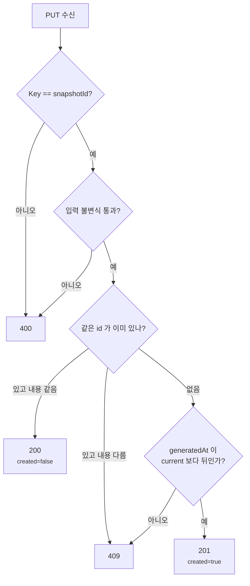
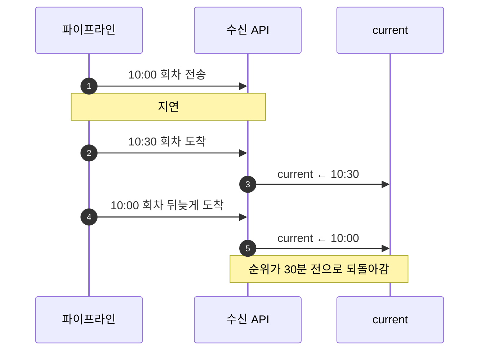
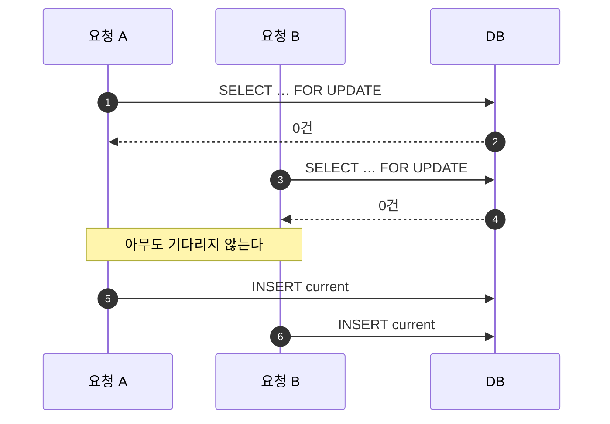

네트워크는 **재전송합니다.** 응답을 못 받은 클라이언트는 같은 요청을 다시 보냅니다.
그래서 쓰기 API를 만들면 곧바로 질문 하나가 따라옵니다.

> **같은 요청이 또 왔을 때 무엇을 돌려줘야 하나?**

"이미 있으니까 그냥 200 주면 되지 않나" — 처음엔 저도 그렇게 생각했습니다.
그런데 **"같은 요청이 또 왔다"에는 성격이 다른 상황이 여러 개 섞여 있습니다.**

- 진짜 재시도입니다. 내용이 완전히 같습니다
- **같은 id인데 내용이 바뀌었습니다.** 상류가 다시 계산했거나, 뭔가 잘못됐습니다
- **옛날 회차가 뒤늦게 도착했습니다.** 지금 것보다 오래된 데이터입니다

**전부 200으로 답하면 조용히 오염됩니다.** 두 번째는 덮어쓰면 안 되는 사고이고,
세 번째는 받아들이면 최신 데이터가 과거로 되돌아갑니다.

이 글은 그 구분을 **HTTP 상태코드와 DB 제약으로 나눠 담은 기록**입니다.

## 무엇을 받는가

뉴스 파이프라인이 별도 앱으로 돌면서, 집계가 끝난 **랭킹 회차**를 서비스 쪽으로 밀어 넣습니다.

```
PUT /internal/intelligence-rank-snapshots/{category}
Idempotency-Key: snap-2f1c…

{ "snapshotId": "snap-2f1c…", "generatedAt": "...", "items": [ … ] }
```

보내는 쪽은 이렇게 생겼습니다.

```kotlin
@Scheduled(fixedDelayString = "\${news-intel.trend.poll-interval:1800000}")
fun generateSnapshotsAndArticles() {
    for (category in crawlStore.activeCategories()) {
        runCatching { /* 집계 → PUT */ }
            .onFailure { log.error(it) { "스냅샷·아티클 생성 실패: $category" } }
    }
}
```

**주기가 `fixedDelay` 30분**이라는 점이 중요합니다. 정시 cron이 아니라 **이전 실행이 끝난 뒤 30분**이라
시각이 조금씩 밀립니다. 카테고리(`ECONOMY` · `POLITICS` · `SOCIETY`)마다 한 번씩,
한 스레드에서 순차로 돕니다.

> 받는 쪽 입장에서는 "**언제 올지 정확히 모르고, 한 번에 여러 건이 올 수 있고, 실패하면 다시 온다**"가 전제입니다.

## 계약을 먼저 정했다

코드를 쓰기 전에 **응답 표**를 먼저 만들었습니다. 이게 이 API의 전부입니다.

| 상황 | 응답 | 뜻 |
| --- | --- | --- |
| `Idempotency-Key` ≠ 본문 `snapshotId` | **400** | 두 값이 갈린 요청은 아예 안 받는다 |
| 새 회차 | **201** | 새로 만들었다 |
| 같은 id · 같은 내용 | **200** | 재시도다. 이미 처리했다 |
| **같은 id · 다른 내용** | **409** | **재시도가 아니라 사고다** |
| 지금 것보다 오래된 회차 | **409** | 되돌릴 수 없다 |
| 입력 불변식 위반 | **400** | 애초에 말이 안 되는 회차다 |



## 400 — 두 값이 갈린 상태를 아예 안 받는다

```kotlin
if (idempotencyKey != request.snapshotId) {
    throw IntelligenceRankSnapshotInvalidException(
        "Idempotency-Key와 snapshotId가 일치해야 합니다",
    )
}
```

헤더와 본문에 **같은 값이 두 번 들어오는 게 이상해 보일 수 있습니다.** 하나로 합치면 되지 않나요.

합치지 않은 이유는, 합치면 **어느 쪽이 진짜인지 정하는 문제가 사라지지 않고 미뤄지기** 때문입니다.
헤더만 쓰면 본문에 id가 없어 저장할 때 다시 꺼내 써야 하고, 본문만 쓰면 멱등키가 프로토콜 층에 안 드러납니다.
둘 다 받고 **다르면 400으로 끊는 쪽**이 계약이 가장 단순합니다.

> 실제로 지금 보내는 쪽은 `Idempotency-Key`에 `snapshotId`를 그대로 넣습니다.
> 그러니 이 400은 **현재 호출자를 위한 게 아니라, 계약을 잘못 쓰는 것을 막기 위한 것**입니다.
> 클라이언트가 하나뿐일 때도 계약은 계약대로 닫아 두는 편이 낫습니다.

## 409 — 같은 id에 다른 내용은 재시도가 아니다

여기가 이 설계의 핵심입니다.

```kotlin
snapshotPort.findById(draft.id)?.let { existing ->
    if (!existing.hasSameInput(draft)) {
        throw IntelligenceRankSnapshotConflictException(
            "같은 snapshotId가 다른 내용으로 사용되었습니다: snapshotId=${draft.id}",
        )
    }
    return IntelligenceRankSnapshotResult(draft.id, created = false)
}
```

`snapshotId`는 **회차 식별자**입니다. 재계산을 했다면 그건 **새 회차**여야 합니다.
"같은 회차인데 결과가 달라졌다"는 재시도가 아니라 **상류의 비결정성**입니다.

조용히 덮어쓰면 어떻게 될까요. 이미 이 회차를 근거로 속보 알림이 나갔을 수 있습니다.
**나간 알림의 근거가 소리 없이 바뀝니다.** 그래서 200이 아니라 409로 드러냅니다.

### "같은 내용"의 정의

무엇을 비교할지도 정해야 합니다.

```kotlin
fun hasSameInput(draft: IntelligenceRankSnapshotDraft): Boolean = id == draft.id &&
    category == draft.category &&
    generatedAt == draft.generatedAt &&
    items.map { it.toDraftItem() } == draft.items
```

`toDraftItem()`이 중요합니다. 저장된 item에는 `previousRank`·`isNewEntry`가 있는데
**이건 받는 쪽이 계산한 파생값**입니다. 보낸 쪽은 이런 값을 보내지 않습니다.

그래서 비교 전에 **파생값을 떼어내고 입력만 남깁니다.** 안 그러면
같은 요청을 두 번 보냈을 때 "내용이 다르다"며 409가 나갑니다. 멱등이 스스로 깨집니다.

> **멱등 비교는 "입력"끼리 해야지 "저장된 것"끼리 하면 안 됩니다.**

## 정밀도 — 같은 회차가 다른 회차로 보이는 경로

`generatedAt`을 비교한다고 했는데, 여기에 함정이 있습니다.

```kotlin
// DB 계약이 TIMESTAMP(6)이므로 멱등 비교 전에 같은 정밀도로 정규화한다.
generatedAt = generatedAt.truncatedTo(ChronoUnit.MICROS),
```

Java의 `Instant`는 **나노초**까지 갖습니다. PostgreSQL `TIMESTAMP(6)`은 **마이크로초**까지입니다.

그래서 이런 일이 생깁니다.

```
보낸 값   2026-09-23T10:00:00.123456789Z
저장된 값 2026-09-23T10:00:00.123456Z     ← 나노초가 잘림
```

재전송이 와서 둘을 비교하면 **다릅니다.** 같은 회차인데 **409가 나갑니다.**

고치는 방법은 **비교하기 전에 DB와 같은 정밀도로 자르는 것**입니다.
저장 시점이 아니라 **도메인에 들어오는 시점**에 자르는 게 요점입니다 —
그래야 비교도, 저장도, 그 뒤의 모든 판단도 같은 값을 봅니다.

> 이건 이 도메인만의 문제가 아닙니다. **애플리케이션 타입의 정밀도가 DB 컬럼보다 높으면**
> 어디서든 같은 버그가 납니다. `LocalDateTime`, `Instant`, `OffsetDateTime` 전부 해당합니다.

## 지연 도착 — 왜 버전 컬럼으로는 안 되나

### 무슨 일이 일어나는가

파이프라인이 10:00 회차를 보냈는데 네트워크 사정으로 늦어졌습니다.
그 사이 10:30 회차가 먼저 도착해 처리됐고, 그다음에 10:00 회차가 뒤늦게 들어옵니다.



사용자 화면에서는 **방금 1위였던 기사가 사라지고 예전 순위가 돌아옵니다.**
데이터가 깨진 건 아닙니다. **더 오래된 데이터를 나중에 썼을 뿐**입니다.

### 흔한 해법은 여기서 안 통한다

이런 "덮어쓰기" 문제에는 보통 **버전 컬럼**(JPA의 `@Version`)을 씁니다.
행마다 숫자를 하나 두고, 쓸 때 이렇게 나갑니다.

```sql
UPDATE current SET ..., version = 6 WHERE category = 'POLITICS' AND version = 5
```

내가 읽었을 때 `version`이 5였으니 **아직 5여야만** 쓴다는 뜻입니다.
그 사이 누가 먼저 썼으면 0행이 갱신되고 예외가 납니다.

**그런데 이 방법은 지금 문제를 못 막습니다.** 이유가 둘입니다.

**① 지연 도착은 애초에 동시성 문제가 아닙니다.**
10:30이 완전히 끝나고 **한참 뒤에** 10:00이 도착하면 경쟁 자체가 없습니다.
버전을 읽으면 6이고, 6으로 쓰면 그만입니다. **검사는 통과하고 데이터는 되돌아갑니다.**

**② 동시에 오더라도 재시도하면 통과합니다.**
10:00과 10:30이 겹쳐 들어와 10:00 쪽이 `OptimisticLockException`을 맞아도,
보통은 **다시 읽고 다시 씁니다.** 이번엔 버전이 맞으니 성공합니다. 역시 되돌아갑니다.

> **버전 컬럼은 "누가 먼저 썼나"를 지킵니다. "어느 쪽이 더 최신 데이터인가"는 모릅니다.**
> 우리가 막아야 하는 건 **쓰기 순서**가 아니라 **데이터의 시점**입니다.

### 그래서 값 자체를 비교한다

다행히 비교할 값이 이미 있습니다. 회차마다 붙어 오는 `generatedAt`입니다.

`intelligence_rank_current`라는 작은 테이블이 "**이 카테고리는 지금 어느 회차까지 왔다**"를 기억합니다.
새 회차가 오면 그보다 **뒤인지**만 봅니다.

```kotlin
current.generatedAt?.let { currentGeneratedAt ->
    if (!draft.generatedAt.isAfter(currentGeneratedAt)) {
        throw IntelligenceRankSnapshotConflictException(
            "current보다 오래되거나 같은 시각의 스냅샷입니다: …",
        )
    }
}
```

10:00 회차가 뒤늦게 와도 `current`가 이미 10:30이면 **`isAfter`가 false**라 409로 끊깁니다.
동시에 왔든 한참 뒤에 왔든 **결과가 같습니다.** 시점을 비교하니까요.

> 버전 컬럼이 필요한 건 **도메인에 순서를 말해 주는 값이 없을 때**입니다.
> 이미 있으면 컬럼 하나와 그걸 증가시키는 코드가 통째로 없어집니다.

## 그런데 왜 락이 필요한가

값만 비교하면 될 것 같은데 `FOR UPDATE`가 왜 붙어 있을까요.

**"읽고 → 판단하고 → 쓰는" 모양이기 때문**입니다. 세 단계 사이에 남이 끼어들 수 있습니다.

```
요청 A (10:30)                    요청 B (11:00)
  current 읽기 → 10:00
                                    current 읽기 → 10:00
  10:30 > 10:00 → 통과
                                    11:00 > 10:00 → 통과
  current ← 10:30
                                    current ← 11:00
```

이 경우는 운 좋게 결과가 맞습니다. 하지만 순서가 뒤집히면 **11:00을 쓴 뒤 10:30이 덮어씁니다.**
둘 다 "내가 더 최신"이라고 **낡은 값을 보고 판단**했기 때문입니다.

`FOR UPDATE`는 이 셋을 **한 덩어리로 묶습니다.** A가 그 행을 잠그면 B는 A가 커밋할 때까지 기다리고,
기다렸다가 읽으면 **A가 쓴 최신 값**을 봅니다.

```kotlin
val current = currentRepository.findByCategoryForUpdate(draft.category.name)
    ?: error("intelligence_rank_current 기준 행이 없습니다: category=${draft.category}")
```

잠그는 대상은 **그 카테고리 행 하나**입니다. 카테고리끼리는 독립이라 전역으로 잠글 이유가 없습니다.
`ECONOMY` 처리가 `POLITICS` 처리를 기다리게 만들면 손해만 봅니다.

### 잠글 행이 없으면 아무도 기다리지 않는다

여기에 함정이 하나 있습니다. **`FOR UPDATE`는 "존재하는 행"만 잠급니다.**

행이 없으면 그냥 **빈 결과**가 돌아옵니다. 에러도 아니고, 기다리지도 않습니다.
첫 요청 두 개가 동시에 들어오면 이렇게 됩니다.



> 번호표 기계가 있어야 줄을 섭니다. **기계가 없으면 모두가 자기가 1번이라고 생각합니다.**

그래서 세 행을 **마이그레이션에서 미리 만들어 둡니다.**

```sql
-- current 행은 최초 요청 전에 반드시 존재해야 SELECT FOR UPDATE가 카테고리별 직렬화를 보장한다.
INSERT INTO intelligence_rank_current (category, snapshot_id, generated_at, updated_at) VALUES
    ('ECONOMY', NULL, NULL, NOW()),
    ('POLITICS', NULL, NULL, NOW()),
    ('SOCIETY', NULL, NULL, NOW());
```

`snapshot_id`와 `generated_at`이 `NULL`인 채로 행만 있습니다.
**"아직 아무 회차도 안 받았다"는 상태를 행의 부재가 아니라 값으로 표현**한 것입니다.

"첫 요청이 알아서 만들겠지"로 두면, 하필 첫 요청 두 개가 겹칠 때 둘 다 락 없이 통과합니다.
서비스 오픈 직후나 **새 카테고리를 켠 첫 30분**에 정확히 일어날 수 있는 일입니다.

## 락이 못 덮는 구간이 하나 남는다

카테고리별로 잠그기로 했으니, **카테고리가 다르면 서로를 막지 않습니다.** 그게 의도입니다.

그런데 회차 테이블의 기본키를 보면 문제가 보입니다.

```sql
CREATE TABLE intelligence_rank_snapshot (
    snapshot_id  VARCHAR(64)  PRIMARY KEY,   -- 카테고리로 나뉘지 않는다
    category     VARCHAR(20)  NOT NULL,
    ...
);
```

**`snapshot_id`는 전역에서 유일해야 합니다.** 카테고리별이 아닙니다.
그래서 이런 일이 가능합니다.

```
ECONOMY 요청                      POLITICS 요청
  ECONOMY 행 잠금                   POLITICS 행 잠금   ← 서로 안 기다림
  INSERT snapshot_id = "snap-A"
                                    INSERT snapshot_id = "snap-A"  ← PK 충돌
```

**락은 제 일을 했는데도 충돌이 납니다.** 잠근 대상이 서로 다르니까요.
그대로 두면 `DataIntegrityViolationException`이 올라가 **500**이 나갑니다.
호출자 입장에서는 "서버가 터졌다"로 보이지만, 실제로는 **요청이 잘못된 것**입니다.

```kotlin
try {
    snapshotRepository.saveAndFlush(...)
} catch (e: DataIntegrityViolationException) {
    throw IntelligenceRankSnapshotConflictException("snapshot 저장 중 무결성 충돌이 발생했습니다: …", e)
}
```

### `save`가 아니라 `saveAndFlush`인 이유

JPA는 `save()`를 불러도 **INSERT를 바로 보내지 않습니다.** 영속성 컨텍스트에 모아 뒀다가
**커밋 직전에 한꺼번에** 내보냅니다.

그런데 그 커밋은 **`@Transactional` 메서드가 끝난 뒤** 프록시가 처리합니다.
즉 예외가 터지는 시점에는 **이 `try/catch`를 이미 빠져나온 뒤**라 못 잡습니다.

`saveAndFlush()`는 "**지금 INSERT를 보내라**"는 뜻입니다.
덕분에 충돌이 `try` 블록 안에서 터지고, 500이 될 예외가 **409라는 계약**으로 번역됩니다.

> 정리하면 — **예외를 잡으려면 예외가 내 코드 안에서 터지게 만들어야 합니다.**
> JPA에서 "왜 내 catch가 안 잡히지"의 상당수가 이 flush 타이밍 문제입니다.

### 정직하게 덧붙이면

보내는 쪽은 `snapshotId`를 `"snap-${UUID.randomUUID()}"`로 만듭니다.
**카테고리 간 충돌이 실제로 날 확률은 사실상 0입니다.** 위 시나리오는 지금 운영에서 일어나지 않습니다.

그래도 막아 둔 이유는 **수신 API가 발신자의 id 생성 방식을 믿으면 안 되기** 때문입니다.
내일 다른 클라이언트가 `snap-1`, `snap-2` 같은 순번을 쓸 수도 있습니다.
그때 나가야 하는 건 500이 아니라 **"그 id는 이미 쓰였다"는 409**입니다.

## 앱과 DB에 같은 규칙이 두 번 있다

입력 불변식을 애플리케이션에서 검사합니다 — articleId 중복 금지, rank 중복 금지,
rank가 `1..N` 연속, 카테고리 일치와 `PUBLIC`·`PUBLISHED` 적격성.

그런데 **DB에도 거의 같은 게 걸려 있습니다.**

```sql
PRIMARY KEY (snapshot_id, article_id),                      -- articleId 중복 금지
CONSTRAINT uq_intelligence_rank_snapshot_rank UNIQUE (snapshot_id, rank),  -- rank 중복 금지
CONSTRAINT ck_intelligence_rank CHECK (rank BETWEEN 1 AND 10),
```

**중복이 맞습니다.** 그리고 의도한 중복입니다.

- **DB 제약**은 어떤 경로로 들어와도 막습니다. 대신 터지면 `DataIntegrityViolationException`이고
  **어느 규칙을 어겼는지 호출자에게 설명하기 어렵습니다**
- **앱 검증**은 `"items의 rank는 1부터 항목 수까지 연속되어야 합니다"` 같은 문장을 400으로 돌려줍니다

DB는 **최후의 방어선**, 앱은 **설명 가능한 거절**입니다. 역할이 다릅니다.

> 스키마에는 `UNIQUE (category, generated_at)`도 있습니다.
> 같은 카테고리에 같은 시각의 회차가 둘 존재할 수 없다는 뜻이고,
> `generatedAt` 단조성 검사와 **같은 불변식을 다른 층에서** 받칩니다.

## 첫 회차는 판정하지 않는다

마지막으로 대가 이야기입니다.

속보 알림은 "순위가 새로 진입했거나 크게 올랐다"로 판정합니다.
그런데 **첫 회차에는 비교할 이전 순위가 없습니다.** 그대로 두면 **전 항목이 "새 진입"**이 됩니다.

```kotlin
val baseline = currentSnapshotId == null
// ...
isNewEntry = !baseline && previousRank == null,
```

그래서 첫 회차는 **기준선(baseline)으로 표시하고 알림 판정에서 제외**합니다.
브로드캐스트 원장에는 `decision_reason = "BASELINE_SNAPSHOT"`이 남습니다.

**대가는 명확합니다 — 배포 첫날, 또는 새 카테고리를 켠 첫 회차에는 속보가 나가지 않습니다.**
알림 폭발을 막는 값으로 "첫 회차 한 번"을 냈습니다. 이건 버그가 아니라 선택이고,
**선택이라는 걸 남겨 두는 게 중요합니다** — 안 그러면 다음 사람이 "왜 안 나가지" 하고 고치려 듭니다.

## 남는 것

이 설계에서 제일 마음에 드는 부분은 **조용히 넘어가는 경로가 없다**는 것입니다.

- 거부는 전부 예외로 올라가 **4xx로 기록**됩니다
- 조용히 덮어쓰거나 조용히 무시하는 길이 없습니다
- 알림을 안 보낸 회차도 `decision_reason`과 함께 원장에 남습니다

정리하면 이렇습니다.

| 막는 것 | 어디서 | 방법 |
| --- | --- | --- |
| 헤더·본문 불일치 | 컨트롤러 | 400 |
| 같은 id, 다른 내용 | 서비스 | 409 |
| 정밀도로 인한 오판 | 도메인 진입 | `truncatedTo(MICROS)` |
| 지연 도착 | 어댑터 (락 안) | `generatedAt` 단조성 |
| 전역 PK 충돌 | 어댑터 | `saveAndFlush` + 409 번역 |
| 말이 안 되는 입력 | 서비스 + DB | 400 / 제약 |

**"같은 요청이 또 왔다"를 한 덩어리로 다루지 않은 것**이 전부입니다.
재시도와 사고와 지연 도착은 서로 다른 사건이고, 다른 답을 받아야 합니다.
