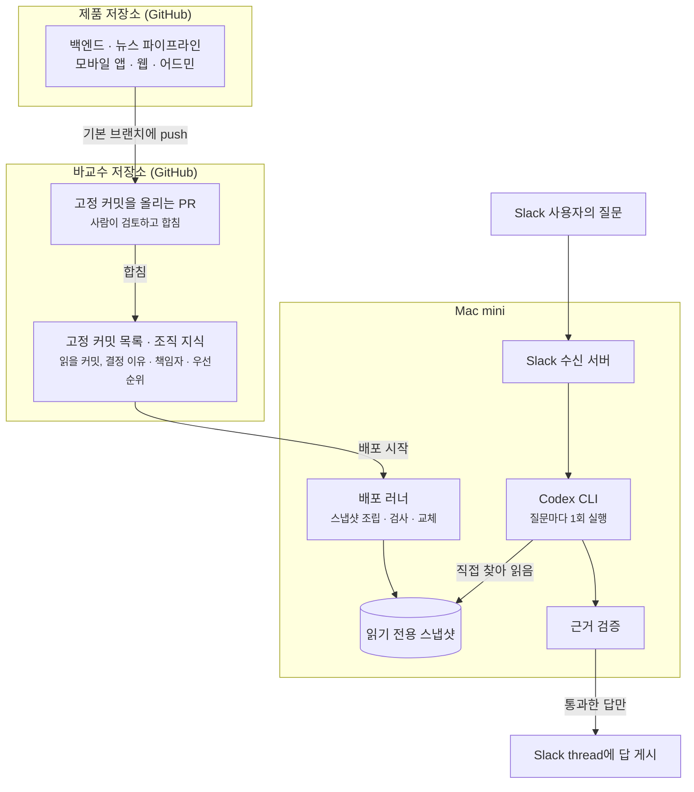
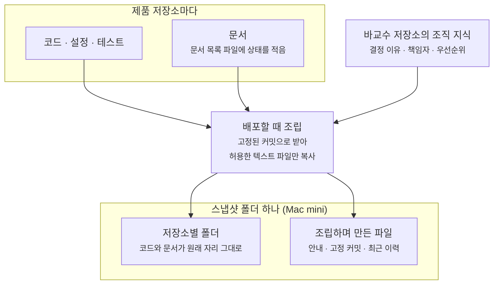
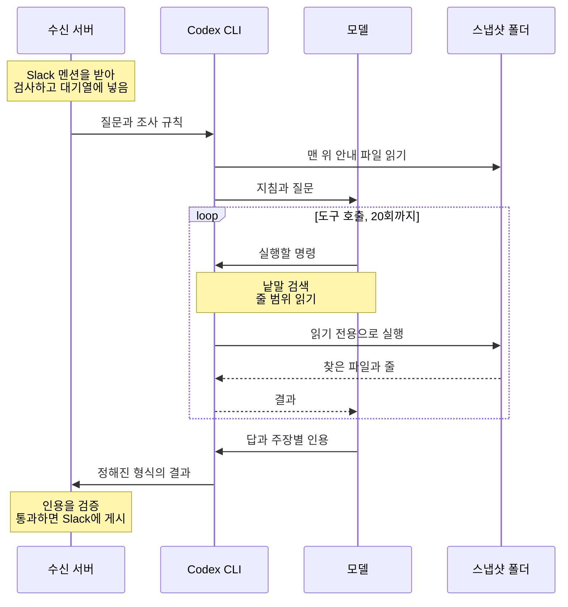
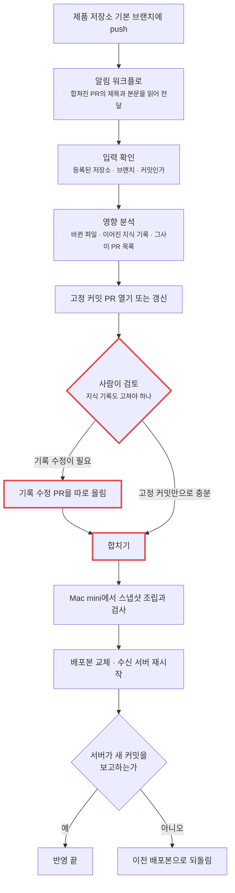
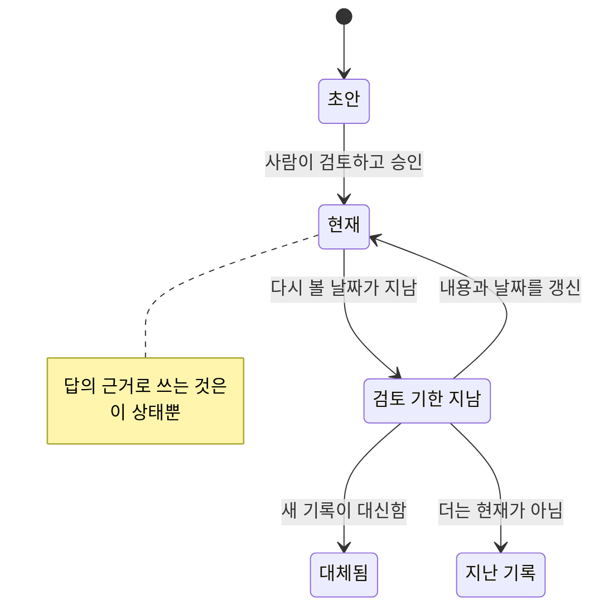

바교수는 사내 Slack에서 `@바교수 배포 구조 설명해줘`처럼 물으면 저장소의 코드와 문서를 근거로 답하는 지식봇입니다.
어떻게 여기까지 왔는지는 [앞 글](/blog/knowledge-bot-without-search/)에 적었습니다.

이번에는 바교수를 고치려고 합니다. 고치기 전에 지금 구조를 처음부터 다시 그렸습니다.
바교수가 무엇을 읽는지, 질문 하나가 어떻게 답이 되는지, 읽는 자료가 어떻게 최신이 되는지를 차례로 보고, 어디가 부족한지와 무엇을 고칠지를 정리합니다.

## 한 장으로 본 구조

바교수는 세 곳에 걸쳐 있습니다. 제품 코드가 있는 저장소들, 바교수 저장소, 그리고 봇이 실제로 도는 Mac mini입니다.



왼쪽은 읽을 자료를 최신으로 만드는 길이고, 오른쪽은 질문이 답이 되는 길입니다. 두 길은 스냅샷에서 만납니다.
검색 DB와 임베딩은 없습니다. 모델이 질문마다 스냅샷의 파일을 직접 찾아 읽습니다.

## 바교수가 읽는 것

### 스냅샷 폴더 하나

문서를 따로 모아 둔 곳은 없습니다. 문서는 각 저장소에 코드와 함께 있고, 배포할 때 저장소 일곱 개를 정해진 커밋으로 받아 코드와 문서를 한 폴더로 조립합니다.



조립된 폴더는 이런 모양입니다. 모델은 이 폴더를 작업 폴더로 삼고, 인용하는 경로도 이 폴더를 기준으로 적습니다.

```text
baro-knowledge-workspace/
├── AGENTS.md                                    조립할 때 만든 안내 파일
├── knowledge-snapshot/
│   ├── sources.yml                              저장소별 고정 커밋
│   └── history/backend.tsv                      최근 커밋 100개 (저장소마다 하나)
├── tools/baro-knowledge/knowledge/
│   ├── source-catalog.yml                       시스템 목록
│   ├── ownership.yml                            책임자
│   ├── priorities/current.md                    우선순위
│   └── records/notification-delivery-decisions.md   조직 지식 기록
├── backend/baro-backend/
│   ├── docs/document-manifest.yml               문서 상태 목록
│   ├── docs/notification-policy.md              기능 문서
│   └── core/service/src/main/kotlin/.../notification/NotificationListener.kt
├── backend/magazine-pipeline/
└── frontend/   (baro-admin, baro-frontend, baro-web, baro-business)
```

파일은 약 2,300개이고, 그중 문서는 130여 개입니다. 용량으로는 다섯에 하나가 문서이고 나머지는 코드입니다.

무엇이 이 폴더에 들어오는지는 둔 곳과 형식으로 갈립니다.

| 둔 곳과 형식 | 읽히나 |
| --- | --- |
| 저장소의 `docs/기능이름.md` (Git에 올라간 마크다운) | 읽힘 |
| 저장소 안의 코드, 설정, SQL, 테스트 파일 | 읽힘 |
| 저장소의 `.claude/` 폴더 안 문서, 저장소 맨 위의 에이전트 지침 파일 | 스냅샷에서 빠짐 |
| PDF, 워드 문서, 이미지, 환경 변수 파일, 800KB가 넘는 파일 | 스냅샷에서 빠짐 |
| 노션, 구글 문서, Slack 대화, PR 본문 | 저장소 파일이 아니라 읽을 수 없음 |
| 아직 합쳐지지 않은 브랜치의 문서 | 읽을 수 없음 |

저장소에 문서를 새로 써도 바로 읽히지는 않습니다. 세 가지가 돼 있어야 합니다.

1. 그 저장소의 문서 목록 파일에 상태가 `current`나 `partial`로 적혀 있습니다.
2. 기본 브랜치에 합쳐져 있습니다.
3. 그 커밋을 가리키는 고정 커밋 PR이 바교수 저장소에서 합쳐져 스냅샷이 다시 조립돼 있습니다.

### 조직 지식

코드와 문서를 읽어서는 알 수 없는 것이 있습니다. 어디에도 적지 않은 결정 이유, 책임자, 지금의 우선순위입니다.
이것은 바교수 저장소의 `knowledge/` 폴더에 사람이 미리 써서 승인해 둡니다. 질문할 때 만들어지는 것이 아니고, 스냅샷 안에서 다른 문서와 똑같이 검색되고 읽힙니다.

기록 하나는 이렇게 시작합니다.

```yaml
id: notification-delivery-decisions
title: Backend 알림 저장·푸시 전달의 현재 구조와 이유
kind: decision
status: current
review_after: "2026-10-13"
related_sources: [backend, mobile]
related_paths:
  - backend/baro-backend/docs/notification-policy.md
  - backend/baro-backend/**/notification/**
  - frontend/baro-frontend/**/notification/**
```

- `status`가 `current`인 기록만 답의 근거가 됩니다.
- `review_after`는 다음에 다시 볼 날짜입니다.
- `related_paths`는 이 기록과 이어진 코드 경로입니다. 답을 찾는 데는 쓰이지 않고, 그 경로의 코드가 바뀌었을 때 이 기록을 다시 보라고 표시하는 데만 씁니다.

기능마다 기록을 써야 답할 수 있는 것은 아닙니다.

| 묻는 것 | 근거가 되는 곳 | 기록을 써야 하나 |
| --- | --- | --- |
| 지금 어떻게 동작하나 | 코드, 설정, 테스트 | 아니요 |
| 요구사항, 설계 방향과 이유 | 저장소의 현재 상태 문서 | 문서에 적혀 있으면 아니요 |
| 어디에도 적지 않은 이유, 여러 저장소에 걸친 결정 | 조직 지식 기록 | 예. 없으면 "코드상 추정"이나 "미확인"으로 답함 |
| 책임자 | 책임자 파일 | 예 |
| 제품과 사업의 우선순위 | 우선순위 문서나 기록 | 예 |

## 질문 하나가 답이 되기까지

백엔드에 기능을 만들고, 요구사항과 설계 방향, 그렇게 정한 이유를 문서 하나로 적어 `docs/` 폴더에 넣었다고 해 봅니다.
누가 Slack에서 그 기능을 물으면 바교수는 그 문서 파일을 그대로 읽습니다. 요약본이나 색인처럼 다른 모양으로 바꿔 둔 것을 읽지 않습니다.



### 받기

수신 서버는 모델을 부르기 전에 요청을 확인합니다. 서명이 맞고 보낸 시각이 5분 안인지, 이미 처리한 이벤트가 아닌지, 봇이 아니라 사람이 허용한 채널에서 보낸 멘션인지, 대기 중인 질문이 다섯 개를 넘지 않는지를 봅니다.
통과하면 바로 200을 돌려주고 질문을 대기열에 넣습니다.

### Codex 한 번, 도구 호출 여러 번

모델은 파일을 직접 볼 수 없습니다. Codex CLI가 모델과 스냅샷 폴더 사이를 오갑니다.

- 무엇을 찾고 어느 파일을 열지는 모델이 정합니다. "이 낱말을 이 폴더에서 찾아 달라", "이 파일의 40번째 줄부터 80번째 줄까지 보여 달라" 같은 명령을 고릅니다.
- Codex가 그 명령을 스냅샷에서 읽기 전용으로 실행해 결과를 돌려줍니다. 이 왕복 한 번이 도구 호출 한 번입니다.
- 모델은 결과를 보고 다음 명령을 고르고, 충분하다고 판단하면 정해진 형식으로 답을 냅니다.

| 세는 것 | 질문 하나에 |
| --- | --- |
| Codex CLI 실행 | 1회. 검증에서 떨어져도 다시 실행하지 않음 |
| 도구 호출 | 20회까지. 넘거나 300초가 지나면 프로세스를 통째로 끝냄 |
| 모델에 보내는 요청 | 도구 호출 수에 마지막 답 한 번을 더한 만큼 |

모델이 따르는 지침은 두 곳에 있습니다. 스냅샷 맨 위의 안내 파일은 Codex가 작업 폴더에서 스스로 읽고, 조사 규칙은 질문과 함께 넘깁니다.
둘 다 어떤 자료가 무엇의 근거인지와 조사 순서를 적은 글입니다.

### 질문 하나가 지나가는 파일

"알림은 왜 저장부터 하고 푸시는 따로 보내나"를 물었을 때를 예로 듭니다.
아래 다섯 순서는 모두 Codex CLI를 한 번 실행한 안에서 일어나고, 순서 하나하나가 도구 호출입니다.

| 순서 | 모델이 하는 일 | 명령의 예 | 여는 파일 |
| --- | --- | --- | --- |
| 1 | 시스템 목록에서 대상 정하기 | 시스템 목록의 앞 60줄 읽기 | `tools/baro-knowledge/knowledge/source-catalog.yml` |
| 2 | "알림", "notification"으로 검색 | 문서와 기록 폴더에서 두 낱말이 든 파일 찾기 | 없음 (파일 이름 목록이 돌아옴) |
| 3 | 기능 문서의 해당 줄 읽기 | 문서의 125~150번째 줄 읽기 | `backend/baro-backend/docs/notification-policy.md` |
| 4 | 조직 지식 기록 읽기 | 기록의 20~45번째 줄 읽기 | `tools/baro-knowledge/knowledge/records/notification-delivery-decisions.md` |
| 5 | 코드로 확인 | 알림 폴더에서 커밋 뒤 실행과 새 트랜잭션 선언 찾기 | `backend/baro-backend/core/service/.../notification/NotificationListener.kt` |

지침이 정해 둔 것은 1번과, 질문 종류에 맞는 자료를 먼저 본다는 원칙까지입니다. 2번부터 무엇을 찾고 어느 파일을 열지는 모델이 검색 결과를 보고 고릅니다.
1번에서 얻는 것도 "백엔드는 `backend/baro-backend` 폴더"라는 사실까지입니다.

```yaml
- id: baro-backend
  name: Baro backend
  aliases: [backend, 백엔드, API 서버]
  purpose: Baro 제품의 서버 API, 배치와 공통 backend 기능
  source: backend
  paths: [backend/baro-backend]
```

어느 문서가 어디 있는지는 목록에 없습니다. 그래서 문서의 제목이나 본문에 질문의 낱말이 없으면 문서를 찾지 못하고 코드만 읽고 답할 수도 있습니다.

### 모델이 내는 답

조사를 마친 모델은 정해진 형식의 데이터를 냅니다. 주장마다 근거의 종류와, 스냅샷 폴더를 기준으로 한 파일 경로와 줄 번호가 붙습니다.

```json
{
  "subject": "baro-backend",
  "answer": "푸시가 실패해도 알림함에는 남도록 저장을 먼저 합니다. [backend/baro-backend/docs/notification-policy.md:134] 알림 저장 기록을 원본으로, 푸시를 그 위의 전달 수단으로 정했기 때문입니다. [tools/baro-knowledge/knowledge/records/notification-delivery-decisions.md:27] 저장은 원래 요청이 커밋된 뒤 새 트랜잭션에서 합니다. [backend/baro-backend/core/service/.../notification/NotificationListener.kt:92]",
  "claims": [
    {
      "text": "푸시가 실패해도 알림은 알림함에 남는다",
      "evidence_type": "current-doc",
      "citations": [{ "path": "backend/baro-backend/docs/notification-policy.md", "line": 134 }]
    },
    {
      "text": "저장 기록이 원본이고 푸시는 전달 수단이라는 결정",
      "evidence_type": "decision-record",
      "citations": [{ "path": "tools/baro-knowledge/knowledge/records/notification-delivery-decisions.md", "line": 27 }]
    },
    {
      "text": "커밋 뒤 새 트랜잭션에서 저장한다",
      "evidence_type": "current-code",
      "citations": [{ "path": "backend/baro-backend/core/service/.../notification/NotificationListener.kt", "line": 92 }]
    }
  ],
  "inferences": [],
  "unknowns": [],
  "conflicts": []
}
```

코드 경로의 `...`은 여기서 줄여 적은 것이고, 실제로는 폴더 이름을 모두 적습니다.

### 근거 검증

검증 코드는 인용을 하나씩 열어 봅니다. 하나라도 떨어지면 답을 게시하지 않고, 왜 답하지 못했는지만 알립니다.

| 검사 | 떨어지는 경우 |
| --- | --- |
| 경로와 줄 | 스냅샷 밖 경로, 없는 파일, 파일 길이를 넘는 줄 |
| 등록된 저장소 | 고정 커밋 목록에 없는 곳의 파일. 조립할 때 만든 맨 위 안내 파일도 여기에 걸림 |
| 자료의 종류 | 책임자 근거를 책임자 파일이 아닌 곳에서, 우선순위 근거를 우선순위 문서나 기록이 아닌 곳에서 인용 |
| 문서 상태 | 문서 목록 파일에서 `current`나 `partial`이 아닌 문서, `current`가 아닌 기록 |
| 약한 줄 | 주장의 인용이 모두 제목, 주석, 괄호 한 짝, 함수 선언, 값 없는 설정 키 같은 줄 |
| 본문 표시 | 주장의 인용이 답 본문에 `[경로:줄]`로 하나도 표시되지 않음 |

통과하면 Slack에는 답 본문과 근거로 쓴 파일 목록이 올라갑니다.

```text
푸시가 실패해도 알림함에는 남도록 저장을 먼저 합니다. [backend/baro-backend/docs/notification-policy.md:134] …

근거 상태: valid
근거 파일:
• backend/baro-backend/docs/notification-policy.md (current, 백엔드 고정 커밋)
• tools/baro-knowledge/knowledge/records/notification-delivery-decisions.md (current, 바교수 커밋)
• backend/baro-backend/core/service/.../notification/NotificationListener.kt (current, 백엔드 고정 커밋)
```

## 변경이 스냅샷에 반영되기까지

스냅샷은 저절로 최신이 되지 않습니다. 제품 저장소에 변경이 합쳐진 뒤 바교수가 읽는 자료가 되기까지 네 단계를 거칩니다.



빨간 테두리가 사람이 하는 일이고, 나머지는 자동입니다.

1. **감지.** 5분마다 훑어보는 방식은 쓰지 않습니다. 제품 저장소마다 알림 워크플로를 설치해 두었고, 기본 브랜치에 push가 생기면 그 커밋과 이어진 PR의 제목과 본문을 읽어 바교수 저장소에 알립니다. 백엔드, 뉴스 파이프라인, 모바일 앱, 웹, 어드민이 이렇게 이어져 있고, 입점 신청 사이트는 원격 저장소가 없어 손으로 뜬 스냅샷을 씁니다.
2. **고정 커밋 PR.** 바교수 저장소는 넘겨받은 값이 등록된 저장소와 브랜치인지 확인한 뒤, 읽을 커밋을 새 커밋으로 바꾸는 PR을 엽니다. PR 본문에는 그 구간에 합쳐진 PR 전부, 바뀐 파일, 바뀐 경로와 이어진 지식 기록, 사람이 확인할 항목이 들어갑니다. PR은 저장소마다 하나이고, 합치기 전에 push가 또 생기면 같은 PR을 최신 커밋으로 갱신합니다.
3. **사람이 검토하고 합치기.** 코드가 바뀌어 문서의 설명이 틀려졌는지, 결정 이유가 달라졌는지를 사람이 판단합니다. 기록을 고쳐야 하면 따로 PR을 올려 함께 합칩니다.
4. **배포.** Mac mini의 러너가 저장소마다 고정된 커밋을 받아 스냅샷을 조립하고, 문서 목록과 지식 기록 형식, 단위 테스트를 돌립니다. 통과하면 새 배포본 폴더로 바꾸고 수신 서버를 다시 시작합니다. 서버가 30초 안에 새 커밋을 보고하지 않으면 이전 배포본으로 되돌립니다.

자동화가 보장하는 것은 어느 커밋을 읽는가뿐입니다. 문서의 뜻이 코드와 맞는지는 3번에서 사람이 봅니다.

### 조직 지식의 최신화

조직 지식은 사람이 적어야 하므로 다른 장치가 붙어 있습니다.



기록이 생기거나 다시 검토되는 계기는 셋입니다.

- **코드가 바뀔 때.** 고정 커밋 PR이 바뀐 경로와 이어진 기록을 표시합니다.
- **기한이 지날 때.** 매주 월요일에 다시 볼 날짜가 지난 기록과 책임자 항목을 모아 issue 하나로 알립니다.
- **Slack에서 논의가 끝났을 때.** 메시지 메뉴에서 「지식 기록 초안 만들기」를 고르면 그 thread를 읽어 초안을 만들고 PR로 올립니다. 초안은 사람이 `current`로 바꾸기 전에는 답의 근거가 되지 않습니다.

알림 워크플로 자체도 매주 점검합니다. 저장소마다 복사해 설치한 것이라 누가 지우거나 스위치를 내리면 그 저장소만 조용히 멈추기 때문에, 원본과 설치본을 비교해 다르면 issue로 알립니다.

## 부족한 것

구조를 그리고 지금 상태를 대 보니 부족한 곳이 다섯 군데였습니다.

### 답을 내지 못한다

[앞 글의 평가](/blog/knowledge-bot-without-search/)에서 지금 설정으로는 33턴 가운데 한 건도 게시하지 못했습니다. 더 큰 모델로 바꿔도 같은 16턴 가운데 3건이었습니다.
구조를 다시 보니 원인이 될 만한 곳이 보입니다.

- **찾을 곳이 넓습니다.** 가장 많은 실패가 도구 호출 20회를 다 쓰고 중단된 것이었습니다. 모델은 파일 2,300개 가운데 문서 130여 개를 검색으로 찾아야 하고, 시스템 목록은 저장소 폴더까지만 알려 줍니다.
- **본문 인용을 모델에게 맡깁니다.** 주장별 인용을 데이터로 냈어도, 같은 인용을 답 본문에 다시 적지 않으면 떨어집니다.
- **읽으라고 준 파일을 인용하면 떨어집니다.** 맨 위 안내 파일은 등록된 저장소에 속하지 않아, 모델이 이 파일을 근거로 대면 답 전체가 떨어집니다.
- **문서를 쓰는 방식과 약한 줄 판정이 부딪힙니다.** 판정이 `*`로 시작하는 줄을 주석으로 보기 때문에, 굵은 글씨로 시작하는 줄과 별표 목록도 약한 줄이 됩니다. 예로 든 알림 문서는 핵심 문장 넷이 모두 굵은 글씨 한 줄이라, 그 줄은 근거로 인정되지 않고 아래 설명 줄을 인용해야 통과합니다.

### 검증에 빈틈이 있다

- 문서 목록에 오르지 않은 문서를 현재 문서로 봅니다. 문서 목록 파일은 그런 문서를 근거에서 빼라고 적어 두었는데, 검증 코드는 반대로 동작합니다.
- "결정 기록" 근거로 표시한 인용이 실제로 조직 지식 기록인지 확인하지 않습니다.
- 검증이 보는 것은 인용한 줄이 실제로 있는지까지입니다. 막은 답이 정말 틀린 답이었는지는 확인한 적이 없습니다.

### 최신화가 사람 손에서 멈춘다

고정 커밋 PR 세 건이 합쳐지지 않은 채 쌓여 있습니다. 그사이 스냅샷은 백엔드보다 7커밋, 뉴스 파이프라인보다 12커밋 뒤처졌습니다.
조직의 공식 지식을 봇이 혼자 바꾸지 못하게 하려고 사람의 승인을 넣었는데, 혼자 운영하는 환경에서는 그 승인이 그대로 밀립니다.
봇이 답을 잘 내게 고치더라도, 지금은 며칠 전 코드를 근거로 답하게 됩니다.

### 조직 지식이 채워지지 않는다

- 검토 기한 알림이 처리되지 않은 채 열려 있습니다.
- 우선순위 문서는 비어 있어, 우선순위를 물으면 "미확인"으로만 답할 수 있습니다.
- 기록 일곱 개 모두 담당자 칸이 비어 있습니다.
- Slack 논의를 초안으로 올리는 길로는 아직 한 건도 올라오지 않았습니다.

### 다시 잴 도구가 모자라다

- 검증에서 떨어진 답은 본문이 남지 않아, 사람이 읽고 맞는 답이었는지 판정할 수 없습니다.
- 같은 질문도 돌릴 때마다 결과가 달라지는데, 평가는 한 번씩만 돌렸습니다.
- 자동 채점이 질문 대상의 이름을 글자 그대로 비교해, 사람이 보기에 좋은 답을 틀렸다고 셉니다.

## 고칠 것

| 부족한 것 | 고칠 방향 | 확인하는 방법 |
| --- | --- | --- |
| 다시 잴 도구가 모자라다 | 떨어진 답의 본문과 사유를 남기고, 같은 질문을 여러 번 돌린다 | 뒤의 모든 수정이 이 도구로 재는 것이라 가장 먼저 한다 |
| 찾을 곳이 넓다 | 문서를 먼저 읽고 코드는 확인할 때만 읽게 한다. 스냅샷을 조립할 때 현재 상태인 문서의 목록을 만들어 시작점으로 준다 | 같은 평가 질문에서 도구 호출 수와 게시 수 |
| 본문 인용을 모델에게 맡긴다 | 주장별 인용을 코드가 본문에 붙인다 | 같은 사유로 떨어진 답의 수 |
| 안내 파일과 굵은 글씨 줄이 떨어진다 | 안내 파일 인용은 떼어 내고 나머지로 판정한다. 문서에서는 `*`로 시작하는 줄을 주석으로 보지 않는다 | 같은 사유로 떨어진 답의 수 |
| 검증에 빈틈이 있다 | 목록에 없는 문서는 근거에서 빼고, 결정 기록 표시는 실제 기록일 때만 인정한다 | 틀린 인용을 넣은 테스트 |
| 최신화가 사람 손에서 멈춘다 | 사람의 승인이 꼭 필요한 변경과 그렇지 않은 변경을 나눈다 | 스냅샷이 뒤처진 커밋 수 |
| 조직 지식이 채워지지 않는다 | 우선순위와 담당자처럼 사람만 채울 수 있는 것부터 채운다 | 열려 있는 검토 알림 |

문서를 저장소에서 떼어 한 곳에 모으는 방법도 견줘 봤습니다. 찾을 곳이 좁아지는 것은 같지만, 문서와 코드를 같은 PR에서 고칠 수 없게 되고 문서가 틀렸을 때 코드와 대조할 수도 없게 됩니다.
그래서 원본은 각 저장소에 그대로 두고, 읽는 순서만 문서 먼저로 바꾸는 쪽을 먼저 시험합니다.

고치는 순서는 재는 것부터입니다. [다음 글](/blog/knowledge-bot-rag-preloaded-sources/)에서는 이 표의 수정을 하나씩 넣으면서 같은 질문으로 다시 재 봅니다. 그래도 답이 나오지 않아서, 문서와 코드를 먼저 검색해 모델에게 주는 RAG를 넣습니다.
