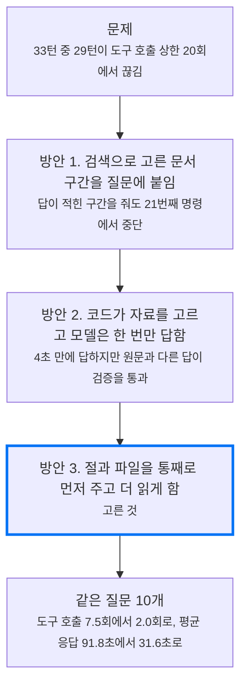
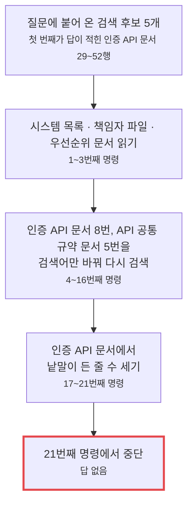
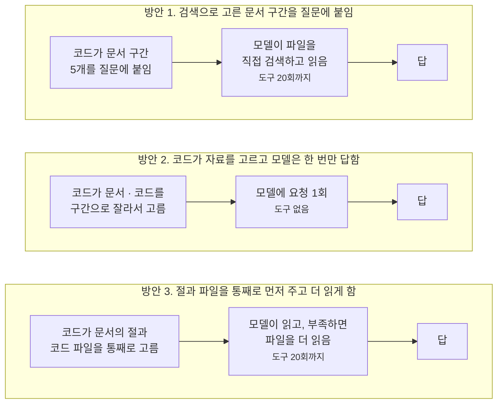
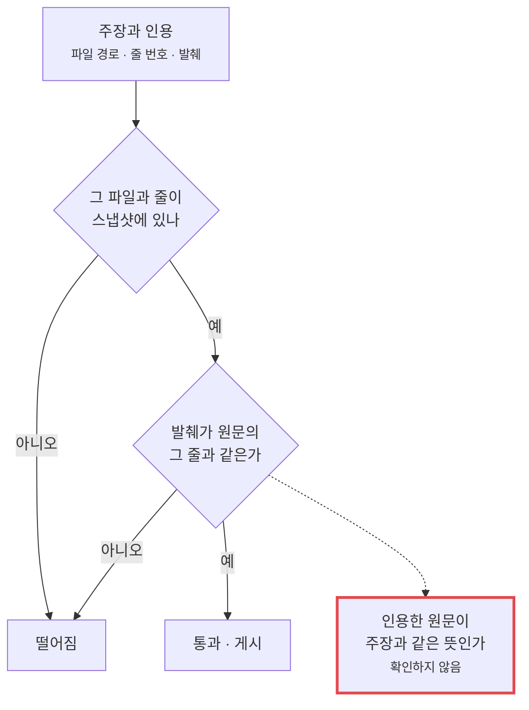
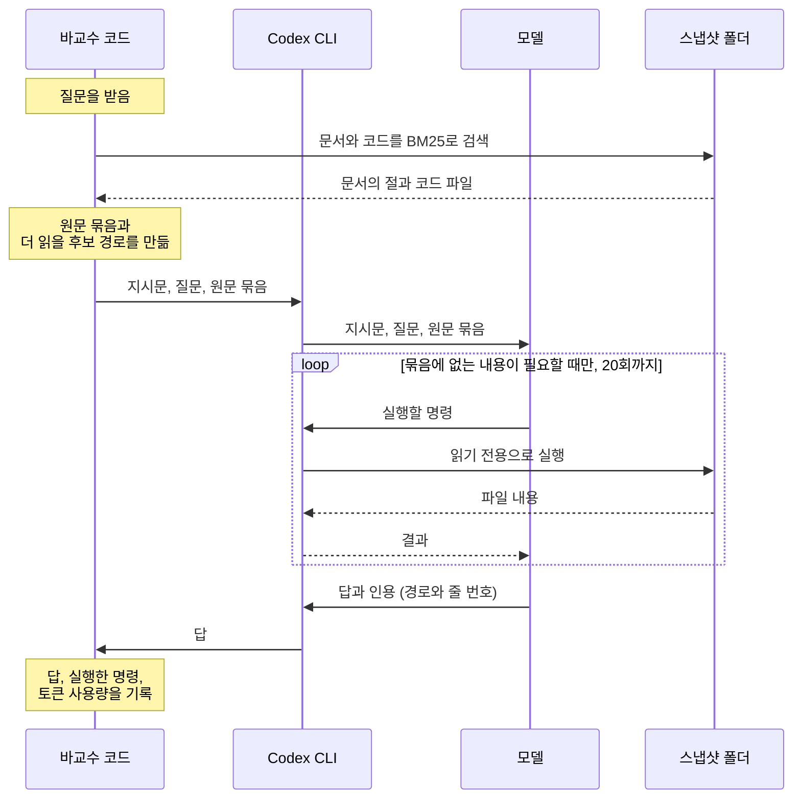
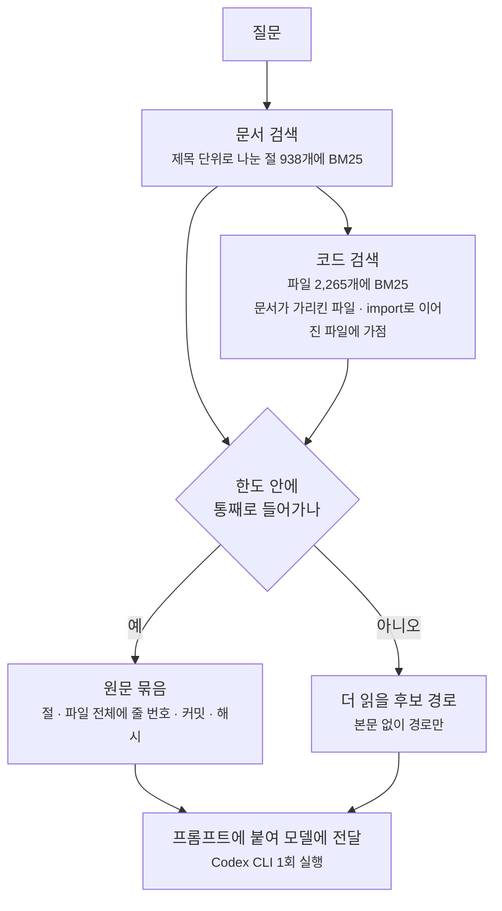
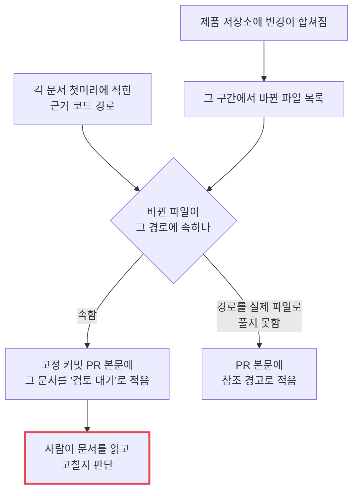

바교수는 사내 Slack에서 질문을 받으면 저장소의 코드와 문서를 근거로 답하는 지식봇입니다.
[3편](/blog/knowledge-bot-without-search/)에서는 RAG를 보류하고 모델이 저장소를 직접 검색해 읽게 했고, [앞 글](/blog/knowledge-bot-current-structure/)에서는 그 구조에서 고칠 것 일곱 가지를 표로 적었습니다.

RAG는 질문과 관련된 자료를 코드가 먼저 검색해서 모델의 입력에 넣어 주는 방식입니다. 보류했던 RAG를 이번에 세 가지 형태로 넣어 봤습니다.
처음에는 검색으로 고른 문서 구간을 질문에 붙여 주면 될 것 같았습니다. 그런데 답이 적힌 구간을 넘겨도 모델은 같은 문서를 다시 검색하다가 도구 호출 상한 20회를 넘겨 답 없이 끝났습니다.
그래서 자료를 코드가 골라 주고 모델은 도구 없이 한 번만 답하게 해 봤는데, 이번에는 원문과 반대로 설명한 답이 근거 검증을 통과했습니다.
결국 문서의 절과 코드 파일을 자르지 않고 먼저 주되, 모델이 더 읽는 것은 막지 않는 쪽을 골랐습니다.

누적 입력 토큰도 59.2% 줄었고, 방안 2에서 3개였던 원문과 반대인 답은 0개가 됐습니다.

도구 호출은 모델이 Codex CLI 안에서 셸 명령 하나를 실행하는 것이고, 근거 검증은 답에 붙은 인용의 파일과 줄을 봇의 코드가 확인하는 단계입니다. 근거 검증을 통과한 답만 Slack에 게시합니다.
스냅샷은 봇이 읽는 폴더로, 저장소들을 정해진 커밋으로 받아 조립한 읽기 전용 사본입니다. 아래 실험은 모두 로컬에서 돌렸고 Slack에 실제로 게시하지는 않았습니다.

## 문제

[3편의 평가](/blog/knowledge-bot-without-search/)에서 운영 설정(gpt-4o-mini, 도구 호출 20회 상한)은 33턴 중 29턴이 도구 호출 상한에서 끊겼고, 게시된 답은 0건이었습니다.

앞 글의 '고칠 것' 표에 적은 수정을 넣으면 끊기지 않고 답이 나오는지 확인하려고, 질문 하나를 정해 같은 운영 설정으로 다섯 번 물었습니다.
인증 토큰 갱신의 동작을 묻는 질문이고, 답은 인증 API 문서 한 곳에 적혀 있습니다.

아래 표는 한 줄이 실행 한 번입니다. 실행할 때마다 봇에 수정을 하나씩 더 넣었고, 위 줄에서 넣은 수정은 아래 줄에도 그대로 들어 있습니다.

| 실행 | 이 실행에서 봇에 새로 넣은 수정 | 도구 호출 수 | 답 |
| --- | --- | ---: | --- |
| 1번째 | 없음. 수정 전 봇 그대로 | 21 | 없음 |
| 2번째 | 스냅샷에 문서 34개 추가 (새로 쓴 백엔드 API 문서 등) | 21 | 없음 |
| 3번째 | 근거 검증이 잘못 막거나 잘못 통과시키던 경우를 고침 | 21 | 없음 |
| 4번째 | 모델은 주장과 인용만 내고 답 본문은 봇의 코드가 조립 | 21 | 없음 |
| 5번째 | 검색으로 고른 문서 구간 5개를 질문에 붙임 | 21 | 없음 |

수정 네 가지를 모두 넣어도 다섯 번 다 답이 나오지 않았습니다. 상한이 20회이고 봇은 21번째 도구 호출이 보이면 프로세스를 끝내므로, 표의 21은 상한에 걸려 끊겼다는 뜻입니다. 모델이 답을 쓰기 전에 끊겨서 근거 검증은 실행되지도 않았습니다.

5번째 실행에서 질문에 붙인 검색 후보 5개 중 첫 번째가 인증 API 문서 29~52행이었고, 답이 되는 문장이 그 안에 있었습니다. 그런데도 모델은 명령 21개를 이렇게 썼습니다.

원인은 둘로 나눴습니다. 어느 문서와 코드를 볼지를 모델이 질문마다 처음부터 정하고, 조사를 언제 끝낼지도 모델이 정합니다.
프롬프트에 "도구 호출 12회 이내를 목표로 한다"고 적어 두었지만, 봇의 코드는 21번째 명령에서 프로세스를 끝낼 뿐 남은 횟수를 모델에게 알려 주지 않습니다.

이 질문이 끊긴 것은 문서가 없어서도, 근거 검증이 엄격해서도 아니었습니다.

## 해결 방안

어느 자료를 볼지를 봇의 코드가 먼저 정해 주는 방식이 RAG입니다. 3편에서 RAG를 보류한 이유는 임베딩 색인을 따로 운영해야 하고, 그 색인이 코드보다 낡아도 알 수 없다는 것이었습니다.
이번에는 임베딩 없이 BM25로 검색합니다. BM25는 질문과 같은 낱말이 얼마나 겹치는지로 점수를 매기는 검색입니다. 색인은 저장해 두지 않고 봇이 읽는 스냅샷에서 실행할 때 메모리에 만들기 때문에, 색인이 스냅샷보다 낡을 수 없습니다.

RAG를 세 가지 형태로 차례로 해 봤습니다. 검색한 자료를 어떤 단위로 주는지와, 받은 뒤에 모델이 파일을 더 읽을 수 있는지가 다릅니다.

방안 1은 '문제' 절 표의 5번째 실행입니다. 문서를 36줄 단위로 나눠 BM25로 고른 구간 5개를 질문에 붙입니다. 파일을 열고 조사를 끝내는 것은 그대로 모델이 합니다.

방안 2는 흔히 RAG라고 할 때의 형태입니다. Ruby 코드가 문서 구간과 코드 구간(2,400자 단위, 12구간까지)을 골라 입력으로 묶고, 모델에는 도구 없이 요청을 한 번만 보냅니다. 모델은 받은 자료만으로 답합니다.

방안 3은 코드가 먼저 고르는 것은 같지만 자르지 않습니다. 문서는 절 하나, 코드는 파일 하나를 통째로 주고, 모델은 다른 파일을 더 읽을 수 있습니다.

## 트레이드오프와 해결 방안 선택

### 방안 1: 답이 적힌 구간을 줘도 20회 안에 끝나지 않았다

'문제' 절 표의 5번째 실행이 그 결과입니다. 어느 문서를 볼지는 코드가 도왔지만 언제 끝낼지는 여전히 모델이 정했습니다. 이것만으로는 채택하지 않았습니다.

### 방안 2: 4초 만에 답했지만 원문과 다른 답이 근거 검증을 통과했다

다섯 번 끊겼던 인증 토큰 질문에는 2.87초 만에 답했고 근거 검증도 통과했습니다. 그래서 업무 질문 20개와, 맞는 답이 "기록에 없다"이거나 전제가 틀린 질문 6개를 고정하고 GPT-4.1로 쟀습니다.
목표는 업무 질문 20개 중 16개 이상에서 원문과 맞는 답이 통과하고, 원문과 반대이거나 기록에 없는 의도를 지어낸 답은 한 건도 통과하지 않는 것이었습니다.

두 번 수정한 뒤에도 못 미쳤습니다. 평균 응답 4.4초, 질문당 추정 비용 약 $0.04로 빠르고 쌌지만, 원문과 다른 답 다섯 건이 근거 검증을 통과했습니다. 그중 세 건입니다.

| 질문 | 원문과 답의 차이 | 모델이 받은 자료 |
| --- | --- | --- |
| 개인 알림이 저장되고 푸시로 나가는 순서 | 코드는 알림 저장 트랜잭션 안에서 이벤트를 발행함. 답은 "저장이 커밋된 뒤에 발행한다"고 함 | 저장과 발행을 하는 함수 전체가 들어 있었음 |
| 같은 멱등 키로 기사 발행 요청을 다시 보내면 | 코드는 기사 본문은 그대로 두고 등장 인물 목록은 교체함. 답은 "아무것도 바뀌지 않는다"고 함 | 인물 목록을 교체하는 호출(64행)이 2,400자 단위로 자르면서 빠짐 |
| 뉴스 인텔리전스 앱과 매거진 앱의 프로세스를 나눈 이유 | 결정 문서는 "뉴스 인텔리전스 앱이 매거진 앱에 의존하지 못하게 막는다"고 적음. 답은 방향을 반대로 적음 | 결정 문서의 해당 절이 들어 있었음 |

첫째와 셋째는 자료가 입력에 있었는데 모델이 순서와 방향을 바꿔 쓴 것이고, 둘째는 코드가 자료를 자르다 필요한 줄을 뺀 것입니다.
원인은 달라도 통과한 이유는 같습니다. 근거 검증이 확인하는 것은 아래 두 가지뿐입니다.

다시 물으면 고쳐지는 오답도 아니었습니다. 평가 과정에서 질문 8개는 같은 입력으로 답이 두 번 생성돼 있었는데, 두 답을 나란히 읽은 4개 질문에서 같은 종류의 오류가 두 번 모두 나왔습니다.
방안 2는 모델이 답을 쓸 때의 무작위성을 정하는 값(temperature)을 0.1로 낮게 두어서, 같은 입력이면 거의 같은 답이 나옵니다.
문서에는 "코드가 이 검사를 하지 않는다"는 현재 동작만 적혀 있는데, 두 번 모두 "의도적으로 그렇게 설계했다고 문서에 명시돼 있다"고 답한 것이 한 예입니다.

뜻이 맞는지를 기계로 확인하는 방법 두 가지도 실패했습니다. 인용문에 "이유", "때문" 같은 낱말이 없으면 그 문장을 지우는 규칙은 맞게 쓴 이유 문장 네 개를 지웠습니다. 같은 GPT-4.1에게 답과 원문을 주고 판정시키는 방법은 필요한 조건을 빠뜨린 답을 충분하다고 판정했습니다.

방안 2는 Slack 자동 게시에 쓰지 않기로 했습니다. 자료가 잘리거나 모델이 원문과 다르게 써도 그 뒤에 바로잡을 단계가 없습니다.

### 방안 3: 원문과 반대인 답은 없었지만 답 하나에 92초가 걸렸다

그래서 모델이 파일을 직접 더 읽게 하고 다시 쟀습니다. 위 질문 중 10개(방안 2에서 원문과 반대였던 3개 포함)를 골라, 모델을 바꾸고(요청한 이름은 gpt-6.1-sol) Codex CLI 안에서 읽기 전용으로 검색하고 읽게 했습니다.

에이전트가 답을 원문과 대조한 결과 원문과 반대인 답은 0개였습니다.
대신 답 하나에 평균 91.8초, 도구 7.5회가 걸렸습니다. 그래서 방안 2처럼 코드가 먼저 자료를 골라 주되 자르지 않고 주는 단계를 더했고, 이것이 방안 3입니다.

### 임베딩 검색과 프레임워크는 넣지 않았다

검색 방식은 기대 문서를 미리 정한 질문 32개로 비교했습니다. 기대 문서를 상위 5개 안에서 찾은 질문이 BM25는 23개, 임베딩(multilingual-e5-small)은 26개였습니다.
임베딩이 3개를 더 찾았지만 넣지 않았습니다. 방안 2의 오답 세 건은 문서를 못 찾아서가 아니라 자료를 자르거나 뜻을 바꿔서 생긴 것이라 검색을 바꿔도 그대로이고, 임베딩 색인을 스냅샷과 함께 갱신하는 일이 하나 더 생깁니다.

LangChain과 LangGraph도 넣지 않았습니다. 필요한 것은 검색, 프롬프트 조립, CLI 한 번 실행, 상한 감시였고 Ruby 표준 라이브러리로 구현했습니다. 원문을 고르는 파일이 292줄입니다.

### 선택

| 방안 | 얻는 것 | 잃는 것 | 판단 |
| --- | --- | --- | --- |
| 1. 문서 구간을 질문에 붙임 | 고칠 코드가 가장 적음 | 답이 적힌 구간을 줘도 20회 안에 끝나지 않음 | 이것만으로는 채택하지 않음 |
| 2. 모델은 한 번만 답함 | 평균 4.4초, 요청 1회로 고정 | 원문과 다른 답이 근거 검증을 통과하고 바로잡을 단계가 없음 | Slack 자동 게시에 쓰지 않음 |
| 3. 통째로 먼저 주고 더 읽게 함 | 방안 2에서 3개였던 원문과 반대인 답이 0개가 됨 | 방안 2보다 느림. 평균 31.6초 | 채택 |

## 결과

### 채택한 RAG: 원문을 먼저 주고 더 읽게 한다

질문이 들어오면 바교수 코드가 먼저 스냅샷을 검색해 원문 묶음을 만듭니다. 원문 묶음은 질문과 관련된 문서의 절과 코드 파일을 자르지 않고 모은 것입니다. 모델은 이 묶음을 들고 시작하고, 묶음에 없는 내용이 필요할 때만 파일을 더 읽습니다.

[앞 글의 구조](/blog/knowledge-bot-current-structure/)에서는 모델이 빈손으로 시작해서, 어느 파일을 볼지부터 도구 호출로 찾았습니다. 지금은 검색을 바교수 코드가 먼저 하고, 도구 호출은 묶음에 없는 내용을 읽는 데만 씁니다.

### 원문 묶음을 만드는 방법

검색 대상은 스냅샷의 문서 133개와 코드·설정 파일 2,265개입니다.

문서는 고정 길이로 자르지 않고 제목 단위의 절로 나눠 검색합니다. 9,000자 이하인 문서는 문서 전체가 한 단위이고, 코드는 파일 하나가 한 단위입니다.

문서 검색 결과는 코드 검색에 다시 씁니다. 상위 문서 절 4개에 적힌 클래스 이름과 파일 경로를 뽑아 그 코드 파일에 가점을 주고, 코드 검색 상위 4개 파일이 import하는 파일과 그 파일들을 import하는 파일에도 가점을 줍니다.
질문의 낱말이 적게 나오는 파일이라도 저장, 발행, 수신처럼 호출로 이어진 파일이 함께 들어오게 하려는 것입니다.

고른 절과 파일은 통째로 넣고, 줄마다 원래 줄 번호를, 항목마다 커밋과 해시를 붙입니다.
방안 2에서 멱등 키 질문이 틀린 것은 2,400자 단위로 자르다가 64행의 호출이 빠졌기 때문인데, 통째로 넣으면 조건문과 그 뒤의 호출이 한 항목 안에 남습니다.

원문 묶음은 42,000자, 12개 항목(문서는 4개)까지입니다. 9,000자가 넘는 절과 16,000자가 넘는 파일, 한도에 밀린 파일은 잘라 넣지 않고 경로만 '더 읽을 후보'로 10개까지 적습니다.
에이전트에게는 받은 원문으로 충분하면 바로 답하고, 조건이나 후속 처리가 빠졌으면 후보 경로부터 더 읽으라고 지시합니다. 후보 경로와 import 관계는 실제 호출의 증거가 아니라는 경고도 함께 넣습니다.

### 원문 묶음이 있을 때와 없을 때

두 경우 모두 에이전트는 스냅샷의 어느 파일이든 읽을 수 있습니다. 다른 것은 시작할 때 손에 든 자료입니다.
방안 2가 순서를 바꿔 답했던 개인 알림 질문으로 두 실행을 나란히 놓으면 이렇습니다.

| | 원문 묶음 없음 | 원문 묶음 붙임 |
| --- | --- | --- |
| 프롬프트 | 지시문과 질문, 1,069자 | 같은 지시문과 질문 뒤에 원문 묶음, 40,343자 |
| 시작할 때 가진 자료 | 없음 | 문서 구간 4개, 알림·푸시 코드 파일 8개, 더 읽을 후보 경로 9개 |
| 첫 명령 | `rg`로 알림 관련 문서와 파일이 어디 있는지 검색 | 후보 경로에 적힌 알림 저장 코드와 리스너 파일을 바로 읽음 |
| 명령으로 읽은 파일 | 26개 | 21개. 원문 묶음에 든 코드 파일 8개는 다시 읽지 않음 |
| 도구 호출 | 7회 | 4회 |
| 입력 토큰 | 320,894 | 208,708 |
| 응답 시간 | 154.4초 | 120.6초 |

원문 묶음이 없으면 에이전트는 파일이 어디 있는지부터 찾고, 푸시 발송 코드를 포함해 필요한 파일을 모두 명령으로 열어 읽습니다.
원문 묶음이 있으면 찾는 단계를 건너뜁니다. 이 질문에서는 묶음에 든 푸시 발송 코드 8개를 다시 읽지 않았고, 묶음에 없던 알림 저장 코드와 알림을 일으키는 서비스 코드, 설정 파일 등 21개를 더 읽었습니다.
두 실행 모두 알림 저장, 같은 트랜잭션 안의 이벤트 발행, 커밋 뒤 푸시 발송 순서로 답했습니다.

프롬프트는 약 38배로 길어졌는데 입력 토큰은 줄었습니다. 에이전트는 도구를 한 번 호출할 때마다 그때까지의 프롬프트와 도구 출력을 전부 다시 모델에 보내기 때문에, 호출 횟수가 줄면 다시 보내는 양도 줄어듭니다.

### 도구 호출 7.5회에서 2.0회, 누적 입력 토큰 59.2% 감소

최종 설정은 원문 묶음에 모델 gpt-6-luna(추론 강도 high)와 Codex의 빠른 응답 모드를 쓰는 것입니다. 원문 묶음 없이 탐색만 시켰을 때(gpt-6.1-sol)와 같은 질문 10개로 비교했습니다. 질문마다 새 세션에서 한 번씩 돌렸습니다.

| 지표 | 원문 묶음 없이 탐색 | 최종 설정 | 변화 |
| --- | ---: | ---: | ---: |
| 평균 응답 시간 (검색 시간 포함) | 91.8초 | 31.6초 | 65.6% 감소 |
| 평균 도구 호출 | 7.5회 | 2.0회 | 73.3% 감소 |
| 누적 입력 토큰 (10개 합계) | 2,475,448 | 1,010,004 | 59.2% 감소 |

```mermaid
%%{init: {"xyChart": {"width": 640, "height": 340}, "themeVariables": {"xyChart": {"plotColorPalette": "#6b7684,#0072f5", "xAxisLineColor": "#8b95a1", "yAxisLineColor": "#8b95a1", "xAxisTickColor": "#8b95a1", "yAxisTickColor": "#8b95a1"}}}}%%
xychart-beta
    title "질문별 도구 호출 수: 회색은 원문 묶음 없이 탐색, 파랑은 최종 설정"
    x-axis ["1", "2", "3", "4", "5", "6", "7", "8", "9", "10"]
    y-axis "도구 호출 수" 0 --> 12
    bar [9, 12, 7, 8, 10, 7, 6, 6, 6, 4]
    bar [3, 3, 4, 0, 4, 4, 0, 0, 2, 0]
```

질문마다 막대 두 개를 겹쳐 그렸습니다. 회색 막대의 높이가 원문 묶음 없이 탐색했을 때의 호출 수이고, 그 위에 겹친 파란 막대의 높이가 최종 설정의 호출 수입니다. 회색으로 남은 부분이 줄어든 호출 수입니다.
질문 10개 모두에서 도구 호출이 줄었고 응답도 빨라졌습니다. 1번 질문은 9회에서 3회로 줄었고, 4번, 7번, 8번, 10번은 도구를 한 번도 호출하지 않고 원문 묶음만으로 답했습니다.

검색은 질문당 평균 0.08초이고 가장 긴 것이 0.17초입니다. 색인을 만드는 4.1초는 질문 10개에 한 번만 들어서 위 평균에 넣지 않았습니다. 응답 시간의 대부분은 모델이 읽고 쓰는 시간이고, 도구를 한 번도 호출하지 않은 질문 4개도 10.7초에서 25.2초가 걸렸습니다.

### 함께 고친 것

RAG와 별개로, 앞 글에서 적은 문제 세 가지를 고쳤습니다.

첫째는 근거 검증입니다.
문서에서 굵은 글씨로 시작하는 문장은 인용해도 근거로 인정되지 않았습니다. 검증 코드가 `*`로 시작하는 줄을 코드 주석으로 취급했기 때문입니다. 문서 파일에는 이 규칙을 적용하지 않게 했습니다.
반대로 통과하면 안 되는 근거가 통과하기도 했습니다. 하나는 문서 목록에 없는 문서입니다. 문서 목록은 지금 유효한 문서를 적어 둔 파일인데, 여기에 없는 문서를 근거로 대도 통과했습니다. 다른 하나는 초안 상태의 결정 기록입니다. 사람이 아직 승인하지 않은 기록인데도 근거로 통과했습니다. 지금은 둘 다 떨어집니다.

둘째는 코드가 바뀌었을 때 다시 읽어야 할 문서를 알려 주는 일입니다.
제품 저장소의 코드가 바뀌면 바교수 저장소에 PR이 자동으로 열립니다. 봇이 읽는 커밋을 새 커밋으로 바꾸는 PR이고, 앞 글에서 고정 커밋 PR이라고 부른 것입니다.
이 PR 본문에는 바뀐 파일과 그 파일에 이어진 조직 지식 기록이 적힙니다. 그런데 제품 저장소 안에 있는 문서는 적히지 않았습니다. 코드가 바뀌어서 내용이 틀려졌을 문서를 사람이 직접 찾아야 했습니다.
이제는 그 문서도 PR 본문에 '검토 대기'로 적습니다. 문서 첫머리에는 그 문서가 근거로 삼은 코드의 경로가 적혀 있는데, 바뀐 파일이 그 경로 안에 있으면 적습니다. 문서 자체가 바뀌었을 때도 적습니다.

문서를 읽고 고치는 것은 사람입니다. 봇은 어느 문서를 봐야 하는지만 알려 줍니다.

과거 커밋 세 건으로 시험했습니다. 푸시 발송, 인증, 댓글 코드를 고친 커밋에서 바뀐 파일을 하나씩 골랐고, 파일마다 꼭 다시 봐야 할 문서를 미리 정해 두었습니다.
처음에는 세 건 중 두 건에서만 그 문서가 검토 대기로 적혔습니다. 빠진 것은 알림 정책 문서였습니다. 이 문서는 첫머리에 코드 경로를 `core/service/.../notification`처럼 중간을 줄여 적어 두었습니다. 그래서 바뀐 파일이 그 경로 안에 있는지 맞춰 볼 수 없었습니다. 경로를 줄이지 않고 끝까지 적은 뒤에는 세 건 모두 적혔습니다.

셋째는 API 문서입니다. 백엔드의 HTTP API는 117개인데 API 문서는 두 개뿐이었습니다. 117개를 기능별 문서 27개에 나눠 적었습니다.

## 개선 전후 비교

같은 질문 10개의 답을 세 가지 경로로 나란히 놓았습니다. 개선 전은 방안 2를 두 번 수정한 뒤의 답입니다.

| | 방안 2 | 원문 묶음 없이 탐색 | 최종 설정 |
| --- | ---: | ---: | ---: |
| 앞 열에서 바뀐 것 | | 파일을 더 읽게 함, 모델 | 원문 묶음을 붙임, 모델, 응답 모드, 계정 |
| 요청한 모델 | gpt-4.1 | gpt-6.1-sol | gpt-6-luna |
| 평균 응답 시간 | 4.4초 | 91.8초 | 31.6초 |
| 평균 도구 호출 | 0회 | 7.5회 | 2.0회 |
| 질문이 물은 것에 모두 답한 질문 수 | 7 | 10 | 9 |
| 원문과 반대로 설명한 질문 수 | 3 | 0 | 0 |

아래 두 줄은 에이전트가 답을 원문과 대조해 센 값입니다.

최종 설정에서는 질문 10개 중 9개가 물은 것에 모두 답했습니다. 나머지 하나는 멱등 키 질문으로, 등장 인물 목록이 교체된다는 설명이 빠졌습니다.
그 내용이 적힌 API 문서 전체가 원문 묶음에 있었고 에이전트는 도구를 한 번도 호출하지 않았습니다. 자료가 입력에 있어도 모델이 답에 쓰지 않은 것입니다.

앞 글의 고칠 것 일곱 가지는 이렇게 됐습니다.

| 앞 글에서 적은 것 | 한 것 | 못 한 것 |
| --- | --- | --- |
| 다시 잴 도구가 모자라다 | 끊기거나 떨어진 실행도 답, 사유, 명령 목록을 남김 | 같은 질문을 여러 번 돌리는 것 |
| 찾을 곳이 넓다 | 원문 묶음을 먼저 주어 도구 호출 7.5회에서 2.0회로 감소 | 그 경로를 운영 봇에 잇는 것 |
| 본문 인용을 모델에게 맡긴다 | 주장과 인용에서 코드가 본문을 조립 | |
| 굵은 글씨 줄이 떨어진다 | 문서에서는 `*`로 시작하는 줄을 주석으로 보지 않음 | |
| 검증에 빈틈이 있다 | 목록에 없는 문서와 초안 결정 기록을 근거에서 뺌 | 인용한 원문이 주장과 같은 뜻인지 확인하는 것 |
| 최신화가 사람 손에서 멈춘다 | 다시 볼 문서를 고정 커밋 PR 본문에 적음 | 사람의 승인이 필요한 변경과 아닌 변경을 나누는 것 |
| 조직 지식이 채워지지 않는다 | | 기록 일곱 개의 담당자 칸과 우선순위 문서가 비어 있음 |

운영 봇은 이렇게 나아졌습니다. 근거 검증이 굵은 글씨로 시작하는 문장의 인용을 더는 막지 않고, 목록에 없는 문서와 초안 결정 기록을 근거로 든 답은 걸러 냅니다. 봇이 읽을 백엔드 API 문서는 2개에서 27개로 늘었고, 코드가 바뀌면 다시 볼 문서가 고정 커밋 PR 본문에 적힙니다.
원문을 먼저 주는 RAG를 넣은 최종 설정은 같은 질문 10개에서 도구 호출을 7.5회에서 2.0회로, 누적 입력 토큰을 59.2% 줄였고, 방안 2에서 3개였던 원문과 반대인 답은 0개가 됐습니다.
