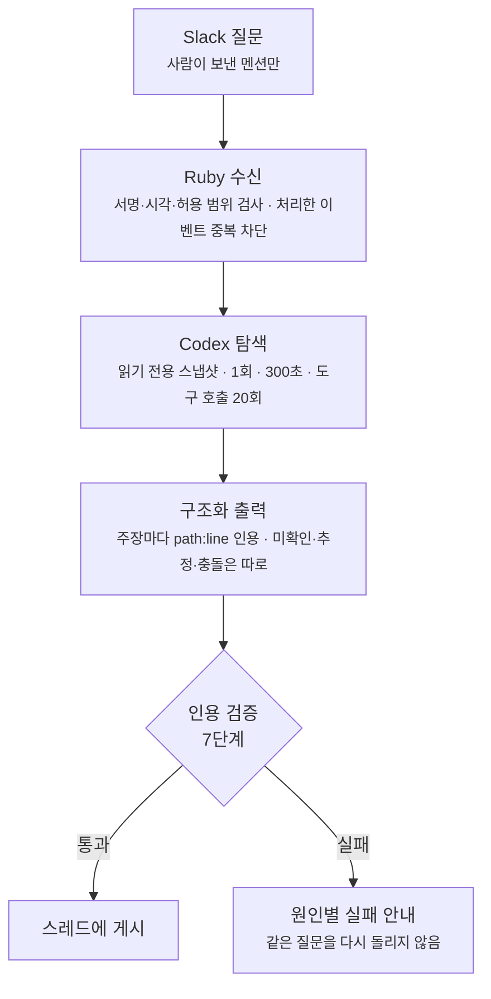

사내 Slack에 지식봇을 하나 띄웠습니다. 이름은 **바교수**입니다. 아무 형식 없이
`@바교수 배포 구조 설명해줘` 라고 물으면 답합니다.

만들면서 **답을 만드는 구조를 세 번 바꿨고, 세 번째에 검색을 없앴습니다.**

## 왜 만들었나

거창한 계획이 있어서 만든 게 아닙니다. 네 가지가 계속 거슬렸습니다.

### 하나. 인수인계를 제대로 못 받았다

넘겨받았을 때 저는 거의 아무것도 파악하지 못했습니다.

코드는 있었습니다. 읽을 수도 있었습니다. 그런데 **읽어서는 알 수 없는 것들**이 있었습니다.

- 이 우회 로직이 버그 회피인지, 의도된 설계인지
- 이 테이블이 어느 화면의 어느 값과 연결되는지
- 지금 보기엔 이상한데, 이유가 있어서 그런 건지

문서가 부족해서가 아닙니다. **코드에 애초에 들어 있지 않은 정보**입니다.
그리고 적어 두지 않으면 사람이 나갈 때 같이 나갑니다. 한동안 더듬으면서 일했습니다.

그러다 이런 생각이 들었습니다. 다음 사람도 똑같이 겪을 텐데, **그 다음 사람이 나일 수도 있다.**

실제로 그랬습니다. 몇 달 전 제가 내린 결정의 이유를 지금의 제가 모르는 일이 생겼거든요.
인수인계는커녕 저 자신에게도 인계가 안 되고 있었습니다.

### 둘. 같은 질문에 매번 내가 붙어야 했다

개발자가 아닌 사람도 물어볼 것은 계속 생깁니다. 이 기능이 지금 어디까지 됐는지,
이건 왜 이렇게 동작하는지, 여기를 바꾸면 무엇이 같이 움직이는지.

솔직히 귀찮았습니다. 비슷한 설명을 몇 번씩 다시 했고, 그때마다 하던 일을 끊었습니다.

그런데 귀찮은 것보다 구조가 문제였습니다. 제가 자리에 없으면 질문이 멈추고,
제가 답해도 그 답은 어디에도 남지 않습니다. 다음에 같은 걸 물으면 저는 또 처음부터 설명합니다.
**답이 제 입에서만 나오는 한, 물어보는 횟수만큼 제가 소모됩니다.**

### 셋. 결정 기록이 레포마다 흩어져 있었다

레포가 다섯 개입니다. "왜 이렇게 했는지"를 아예 안 적은 건 아닌데, 적긴 적었어도
**각 레포 안에 따로** 있었습니다.

문제는 질문이 레포 경계를 안 지킨다는 겁니다. "배포 왜 이렇게 해?" 하나를 답하려면
백엔드와 파이프라인과 인프라 쪽을 동시에 봐야 합니다. 결국 여러 곳을 열어 놓고
짜맞추는 일은 계속 제 몫이었습니다.

### 넷. 문서가 늘어나면서 관리가 안 됐다

문서는 계속 늘었습니다. 그런데 늘어난 만큼 쓸모가 늘지는 않았습니다.

어디에 뭐가 있는지 저도 헷갈렸고, **낡은 문서가 최신 문서 옆에 그대로 남아 있었습니다.**
이게 제일 나쁩니다. 없는 것보다 나쁩니다 — 찾아서 읽었는데 그게 옛날 사실이면,
안 찾아본 것만 못합니다.

### 네 가지가 같은 물건을 가리켰다

코드를 읽을 줄 아는 사람에게도, 읽을 줄 모르는 사람에게도,
**흩어진 기록과 코드를 한 번에 뒤져서 "왜"와 "어디까지"를 근거와 함께 답해 주는 창구.**

남은 문제는 그 창구가 **무엇을 근거로** 답하느냐였습니다.

## 이게 "LLM 창 하나 더"가 아닌 이유

처음엔 단순하게 봤습니다. 저장소를 읽고 답하는 봇, 그게 다 아닌가.

아니었습니다. 그냥 Slack에서 범용 모델을 부르면 되는데도 별도 시스템을 만든 이유가 있습니다.

- **어느 시점의 코드를 읽었는지** 고정되어야 합니다. 어제 머지된 PR 기준인지 지금 기준인지 모르는 답은 쓸 수 없습니다
- **"현재 동작"과 "그렇게 한 이유"와 "누가 책임지는지"는 근거의 종류가 다릅니다.** 코드에서 이유를 추측해 사실처럼 말하면 안 됩니다
- 어떤 채널에서 누가 물을 수 있는지, 어떤 파일이 외부 모델로 나갈 수 있는지 통제해야 합니다

즉 **모델의 조사 능력은 빌려 오되, 조직 경계는 직접 들고 있어야 했습니다.**

## 1차: 검색 결과를 먼저 골라 넣었다 — 실패

첫 구현은 뻔한 구성이었습니다. Ruby로 키워드 검색을 만들고, 검색 상위 결과를 프롬프트에 넣어
모델이 그 안에서 답하게 했습니다.

실패했습니다. 증상이 두 가지였는데 둘 다 고약했습니다.

**첫째, 질문의 주어를 잘못 잡았습니다.** 우리 제품에는 Slack으로 장애 알림을 보내는 기능이
따로 있습니다. 지식봇도 Slack을 씁니다. "Slack 알림 어떻게 가?"라고 물으면 자기 얘기를 하는지
제품 얘기를 하는지 구분을 못 했습니다.

**둘째, 검색 상위 결과를 그냥 근거로 붙였습니다.** 질문과 별 상관없는 백엔드 파일이 키워드 점수가
높다는 이유로 답의 출처가 됐습니다. 틀린 답보다 나쁩니다 — **출처가 붙어 있으니 맞아 보입니다.**

## 2차: 모델이 검색 도구를 고르게 했다 — 그래도 부족했다

검색이 먼저 골라 준 결과 안에서만 답하는 게 문제라고 봤습니다. 그래서 결과를 미리 고정하지 않고,
모델이 파일 찾기·본문 검색·파일 읽기·Git 조회 도구를 직접 골라 여러 번 호출하게 바꿨습니다.
흔히 말하는 tool calling입니다.

도구를 쥐여 줘도 질문의 주어와 시스템 경계를 잘못 잡는 문제는 남았습니다. 이걸 고치려면
**질문 이해와 시스템 경계 판단을 제가 계속 다시 구현해야 했습니다.** 그건 범용 코딩 에이전트가
이미 하는 일입니다.

## RAG는 검토만 하고 보류했다

검색을 직접 만드는 길을 접으면, 다음 후보는 당연히 RAG입니다. 문서를 청킹하고 임베딩해서 벡터 DB에
넣고, 질문과 가까운 청크를 찾아 프롬프트에 넣는 방식이죠. 세 번째 구조를 정하면서 RAG도 대안으로
함께 따져 봤습니다.

검토한 대안을 표로 정리하면 이렇습니다.

| 대안 | 판단 |
| --- | --- |
| 자체 키워드 검색 고도화 | 경계·질문 이해를 계속 재구현해야 함 → 진단용으로만 남김 |
| Slack에서 범용 모델 직접 호출 | 조사 능력은 충분하나 승인·최신성·권한·배포 경계가 없음 |
| **vector/embedding RAG** | **현재 규모에서 과설계로 판단해 보류** |
| 개발자용·대표용 문서 분리 | 같은 사실이 중복되고 서로 어긋날 위험 |

RAG를 뺀 이유는 둘입니다. 하나는 별도 색인의 운영비고, 다른 하나가 더 중요합니다.

> **stale index 위험.**

코드는 계속 바뀌는데 색인은 어제 것입니다. 그리고 **색인은 자기가 낡았다고 말해주지 않습니다.**
낡은 청크를 가져와서 그럴듯한 답을 만들고, 출처까지 붙습니다. 1차 실패와 증상이 똑같습니다.

대신 조건을 적어 뒀습니다. **"규모와 응답시간이 실제 병목이 될 때 측정값을 근거로 다시 검토한다."**
지금 안 한다는 것이지 영원히 안 한다는 게 아닙니다. 다만 몇 초, 몇 개부터를 병목으로 볼지는 아직
숫자로 정하지 않았습니다.

## 3차: 모델이 파일을 직접 뒤지게 했다

채택한 구조는 이겁니다. **검색 결과를 미리 프롬프트에 넣지 않습니다.** 대신 읽기 전용 작업 공간을
통째로 주고, 모델이 알아서 찾아 읽게 합니다.

```bash
codex exec \
  --cd <배포된 workspace> \
  --sandbox read-only \
  --ephemeral \
  --ignore-user-config \
  --skip-git-repo-check \
  --json --output-schema <스키마>
```

옵션 하나하나가 경계입니다. 읽기 전용이라 고칠 수 없고, ephemeral이라 세션이 남지 않고,
사용자 설정을 안 읽어서 제 로컬 환경이 새어 들어가지 않습니다.

탐색 순서는 프롬프트로 정해 뒀습니다. 모델은 먼저 `source-catalog.yml`을 읽어 **"이 질문의 대상이
어느 시스템인지, 이름이 비슷한 다른 시스템은 없는지"** 를 확인합니다. 1·2차에서 주어를 놓쳤던
문제를 여기서 막습니다. 그다음 진입점부터 호출 대상·설정·테스트·기록 순으로 직접 읽어 나갑니다.

질문 하나가 답이 되기까지는 이렇게 흐릅니다. 지금 운영 중인 구조이고, 실행 상한과 "재시도 없음"은
뒤에 나올 사고를 겪고 붙인 것입니다.



Ruby가 맡는 건 앞뒤뿐입니다. 질문을 받고 권한을 확인하는 앞단과, 모델이 낸 근거를 검사하는
뒷단입니다. 가운데 조사는 전부 모델이 합니다.

대가가 있습니다. **질문마다 저장소 탐색이 일어나니 단순 검색보다 느립니다.** 이건 나중에 실제로
사고로 돌아옵니다.

## 무엇을 읽게 할 것인가

모델에게 저장소를 통째로 주는 구조라, **무엇을 주지 않을지**가 곧 보안 설계가 됩니다.

배포 스냅샷은 Git에 tracked된 허용 텍스트 파일만 모아 조립합니다. 제외 목록이 깁니다.

- `.git`, `.env*`, credential 파일, private key, 인프라 변수 파일
- 의존성·빌드 산출물, 바이너리, 심볼릭 링크
- source 저장소의 에이전트 지침 파일 (신뢰된 root 지침은 조립할 때 새로 만듭니다)
- 800KB 넘는 파일

그리고 source마다 **정확한 commit을 핀으로 박습니다.** 이게 "어느 시점을 읽었는지"를 보장합니다.

## 코드로 알 수 없는 것은 따로 적는다

탐색으로 풀리지 않는 게 다섯 가지 있습니다.

1. 왜 이 구조를 선택했는가
2. 어떤 대안이 있었고 왜 떨어졌는가
3. 지금 제품·사업에서 뭐가 우선인가
4. 누가 책임지는가
5. 대표가 알아야 할 영향은 무엇인가

이건 코드에 없습니다. 그래서 `knowledge/` 아래 결정 기록으로 따로 씁니다. 여기에 규칙 하나를 박아
뒀습니다.

> **코드만 보고 이유·책임자·사업 우선순위를 추정하지 않는다.**
> **기록이 없으면 "미확인"이라고 답한다.**

그럴듯하게 지어내느니 모른다고 하는 편이 낫습니다. 그리고 개발자용·대표용 문서를 나누지
않았습니다. 같은 사실을 두 군데 쓰면 반드시 어긋납니다. 원본은 하나만 두고 **설명 깊이를 질문자에
맞춰 조절**하게 했습니다.

### 낡은 문서를 최신 문서와 구분한다

앞에서 말한 네 번째 동기 — 낡은 문서가 최신 문서 옆에 그대로 남아 있던 문제 — 는 여기서 처리합니다.

문서마다 상태를 선언하게 했습니다. **`current`와 `partial`만 현재 사실의 근거로 쓸 수 있습니다.**
`draft`는 사람이 검토해서 owner·이유·대안·영향·다음 검토일을 채우고 `current`로 올리기 전까지
답변 근거가 되지 못합니다.

그리고 매주 한 번, **검토 기한이 지난 `current` 기록만** 골라 이슈로 알립니다.
저장소 전체를 훑지도, 주기적으로 모델을 부르지도 않습니다. 지난 것만 짚어 줍니다.

문서를 안 늘리는 건 불가능했습니다. 대신 **"이건 지금 믿어도 되는 문서인가"를 기계가 판별할 수
있게** 만들었습니다.

## 모델이 댄 근거를 믿지 않는다

여기가 이 시스템에서 제일 중요한 부분입니다.

모델은 구조화된 출력으로 주장과 인용을 함께 냅니다. 그리고 Ruby validator가 **그 인용을 전부
기계로 검사합니다.** 통과 못 하면 답을 게시하지 않습니다.

검사 순서는 이렇습니다.

```
① 형식        — path는 문자열, line은 정수인가
② 경로 이탈    — 절대경로나 `..`가 섞이지 않았는가
③ 실재        — 그 파일이 실제로 있는가, 심볼릭 링크는 아닌가
④ 줄 범위      — 그 줄이 파일 길이 안에 있는가
⑤ 권위        — 책임자 주장인데 ownership 파일을 인용했는가
⑥ 등록 여부    — 등록된 source 안의 파일인가
⑦ 약한 앵커    — 그 줄이 의미 있는 줄인가
```

⑦이 재밌습니다. 모델이 **실제로 있는 파일의 실제로 있는 줄**을 인용했는데도 아무 의미가 없는
경우가 있습니다. 그래서 이런 줄을 약한 앵커로 표시합니다.

```ruby
return true if value.empty?
return true if %w[{ } [ ] ---].include?(value)      # 괄호 한 짝
return true if value.match?(%r{\A(?:#|//|/\*|\*)})  # 주석
return true if value.match?(/\A(?:def|class|module|interface|fun)\s+/)
return true if value.match?(/\A["']?[A-Za-z0-9_.-]+["']?\s*:\s*(?:\{\s*)?\z/)  # 값 없는 YAML 키
```

`{` 하나만 있는 줄을 근거로 대는 답은, 형식상 인용이 붙어 있지만 아무것도 증명하지 않습니다.

**전부를 하드 게이트로 두지는 않았습니다.** 모델이 코드 파일을 "설정 근거"로 라벨만 잘못 고른
경우는 답 전체를 버리지 않고 진단 경고로 남깁니다. 틀린 종류를 구분하지 않고 다 막으면
쓸 수 없는 봇이 됩니다.

그리고 검증에 실패해도 **같은 질문을 모델에 자동으로 다시 시키지 않습니다.** 처음부터 이랬던
건 아닙니다. 처음에는 검증에 실패하면 조사를 한 번 더 돌렸고, 그 재조사가 뒤에 나올 사고를 키운
원인 중 하나였습니다. 지금의 1회 고정은 그 사고를 겪고 고친 결과입니다.

> 검증은 엉뚱한 파일을 장식용으로 붙이는 위험을 크게 줄입니다.
> 다만 **주장의 의미가 맞는지는 보증하지 않습니다.** 그건 여전히 사람이 봐야 합니다.

## 최신화: polling을 하지 않는다

스냅샷을 어떻게 갱신할지도 문제였습니다. 5분마다 폴링하는 방식은 안 썼습니다.

```
source 저장소 기본 브랜치 push
  → 그 저장소의 notify workflow 발화
  → 도구 저장소에 pin 변경 PR 생성 (변경 파일 + 영향받는 결정 기록 목록 포함)
  → 사람이 PR 검토·머지
  → 그제서야 live 스냅샷 교체
```

여기서 스스로 못 박아 둔 문장이 있습니다.

> **이 자동화가 보장하는 것은 "어떤 commit을 읽는가"뿐이다.**

문서 의미가 코드와 맞는지, 결정 이유가 바뀌었는지는 자동화가 모릅니다. 그건 PR 체크리스트와
주간 리뷰 기한 알림으로 따로 관리합니다. **자동화가 보장하는 범위를 자동화가 보장하지 않는
범위와 섞지 않는 것**이 중요했습니다.

그리고 이 구조에 **조용한 실패 모드**가 하나 있습니다. notify workflow는 각 source 저장소에
복사해 설치한 것이라, 누가 지우거나 스위치를 내리면 **그 source만 조용히 멈춥니다.**
에러도 안 나고 PR만 안 올라옵니다. 그래서 주 1회 blob id로 원본과 설치본을 대조해 어긋나면
issue로 알립니다.

## 그리고 사고가 났습니다

여기까지가 설계고, 여기부터가 실제로 일어난 일입니다.

일회성 검증용으로 백그라운드 job을 하나 만들었습니다. 한 번 돌고 끝날 줄 알았는데
**keepalive가 되어 반복 실행됐습니다.** 제거와 감시가 완료되지 않은 상태였습니다.

하필 그때 답변기는 **근거 검증에 실패하면 전체 조사를 한 번 더 실행**하는 구조였습니다.
그리고 한 번의 조사에서 저장소 도구 호출이 수십 회 발생할 수 있었습니다.

세 가지가 겹쳤습니다.

```
사람이 요청하지 않은 반복 실행
  × 검증 실패 시 자동 재조사
  × 조사 1회당 도구 호출 수십 회
  = 아무도 묻지 않은 질문에 대한 과금
```

## 고친 것이 다음 문제를 낳았습니다

사고 뒤의 수습이 한 번에 끝나지 않았습니다. 이 연쇄가 이 글에서 제일 배울 게 많은 부분입니다.

**1. 상한을 걸었습니다.** 질문당 실행 1회 고정, 300초, 도구 호출 20회. 검증 실패 시 자동 재조사
제거.

**2. 그랬더니 넓은 질문이 시간에 걸렸습니다.** 처음 시간 상한은 90초였는데, 여러 저장소의 배포
설정과 문서를 교차해 읽어야 하는 질문이 도구 호출 상한 안에서도 90초를 넘겼습니다. 300초로
올렸습니다. **직접 탐색 방식의 대가가 여기서 청구된 겁니다.**

**3. 세 번째 질문이 연속 실패 차단을 열었습니다.** 300초 안에 끝났지만 근거 검증에 걸렸습니다.
인용한 줄이 전부 아까 그 "약한 앵커"였거든요. 그게 세 번째 연속 실패였고, **30분 동안 모든 질문이
막혔습니다.**

그런데 사용자에게 보이는 건 **"일시 중지" 한 줄**이었습니다. 왜 막혔는지, 언제 풀리는지,
내 질문이 잘못된 건지 시스템이 아픈 건지 알 수가 없었습니다.

**4. 연속 실패 차단을 제거했습니다.** 대신 실패 이유를 원인별로 나눠 Slack에 그대로 보냅니다 —
근거 부족 / 시간 초과 / 도구 호출 상한 / API 크레딧 / 인증 실패.

안전장치가 **원인과 무관하게 전부 막고 진단 신호를 안 주면**, 그건 보호가 아니라 그냥 고장입니다.

## 상한을 어떻게 강제했나

상한은 프롬프트로 부탁하는 게 아니라 프로세스 수준에서 강제해야 했습니다.

```ruby
stdin, stdout, stderr, wait_thread = Open3.popen3(env, *command, pgroup: true)
```

`pgroup: true`가 핵심입니다. **자식 프로세스 그룹을 따로 만듭니다.** 그리고 stdout을 한 줄씩
읽으면서 도구 호출 이벤트의 고유 ID를 Set에 넣어 셉니다. 상한을 넘으면 이렇게 끝냅니다.

```ruby
Process.kill("TERM", -wait_thread.pid)   # 음수 pid = 프로세스 그룹 전체
```

CLI 프로세스만 죽이면 **그 아래 손자 프로세스가 살아남습니다.** 사고의 일부가 그거였습니다.
그래서 그룹 전체에 신호를 보내고, 5초 안에 안 죽으면 KILL로 올립니다.

### 왜 20회인가

20회는 답의 품질을 맞추려고 고른 값이 아닙니다. **비용이 폭주하지 않게 막는 천장입니다.**
사고 때는 조사 한 번에 도구 호출이 수십 회 나왔습니다. 상한을 정할 때 손에 있던 관측값은
2차 구조에서 잰 9회 하나뿐이었고, 그 약 2배로 잡았습니다.

근거가 약했던 건 사실입니다. 운영 실행 8건에서는 이 상한에 걸린 실행이 없었고, 게시된 답은
도구를 3\~6회 썼습니다. 그래서 한동안은 먼저 닿는 한계가 시간이라고 봤습니다.

평가 시나리오로 다시 돌려 보니 반대였습니다. 지금 설정(gpt-4o-mini)은 **33턴 중 29턴이 20회
상한에 먼저 걸려 중단됐습니다**(아래 평가셋 절). 운영 8건 중 7건은 모델을 고정하기 전의 기본
상위 모델이 돌린 것이었고, 표본도 작았습니다. 그렇다고 상한을 40으로 올려 보니 게시되는 답이
늘지 않았습니다. 멈추던 질문이 더 오래 탐색한 뒤 근거 검증에서 떨어졌을 뿐입니다. 그래서
20회를 유지합니다.

## 막아야 할 것은 총량이 아니었습니다

처음엔 "하루 20회" 같은 총량 상한을 뒀습니다. 그런데 이게 틀린 모델이었습니다.
**사람이 하루에 30번 묻는 건 막을 이유가 없습니다.** 그건 봇이 일을 하는 겁니다.

정말 막아야 할 건 두 가지였습니다.

**① 사람이 요청하지 않은 호출.** 모델 호출은 사람이 보낸 Slack 이벤트에서만 시작합니다.
보낸 사람이 없는 이벤트는 `no_human_actor`로 거절합니다. **타이머·스케줄·폴링으로 모델을 부르는
경로는 아예 만들지 않았습니다.**

**② 같은 요청의 반복.** 처리한 이벤트 ID를 디스크에 남깁니다. 메모리에만 두면 안 되는 이유가
구체적입니다 — **Slack은 200 ack를 못 받으면 같은 이벤트를 최대 3회 재전송합니다.** 답변 도중
프로세스가 죽고 재시작하면, 메모리 기록은 초기화된 상태로 같은 질문이 다시 들어옵니다.
그 경로를 닫으려면 상태가 디스크에 있어야 합니다.

총량 상한을 뺄 수 있었던 건 ②를 영속화한 뒤였습니다. 디스크 기반 천장이 사라지니
중복 차단이 튼튼해야 했거든요.

한 가지는 정직하게 적어 뒀습니다.

> **이 변경은 실제 비용 측정값을 근거로 하지 않았다.**
> 관측된 값은 답변 1건당 도구 호출 5\~9회뿐이며, 총 답변 6건이다.

n=6으로 정책을 바꾼 겁니다. 그렇게 적어 둬야 나중에 이 결정을 다시 볼 수 있습니다.

## 비용과 시간은 얼마였나

새 키로 다시 운영하면서 측정한 값이 있습니다.

| 항목 | 값 |
| --- | --- |
| 질문 | 7건 |
| 과금 | **$4.17** (건당 평균 약 $0.60) |
| 답변 게시 성공 | 3건 |
| **실패했는데 과금된 건** | **4건** (시간 초과·근거 검증 실패) |

절반 이상이 돈만 쓰고 답을 못 냈습니다. 그리고 **왜 비쌌는지 나눠 볼 수가 없었습니다.**
CLI를 모델 지정 없이 실행해서 서버 기본 상위 모델로 돌았고, 요청별 토큰 기록도 없었거든요.

고친 건 둘입니다. 모델을 명시적으로 고정했고, 요청 로그마다 토큰 사용량을 남깁니다 —
**실패한 실행의 사용량도 같은 줄에 남깁니다.** 실패가 공짜가 아니니까요.

다만 이 기록에는 빈틈이 있습니다. 사용량은 턴이 끝날 때 나오는 이벤트에서 합산하는데, 도구
상한이나 시간 초과로 도중에 끊긴 실행은 그 이벤트를 내지 않습니다. 그래서 **중단된 실행은
사용량이 0으로 남습니다.** 근거 검증에서 떨어진 실행처럼 끝까지 돈 실패만 제대로 기록됩니다.

고정한 모델은 gpt-4o-mini입니다. **고른 이유는 비용뿐이었고, 답변 품질은 비교하지 않았습니다.**
이 빈칸은 아래에서 다시 나옵니다.

### 운영 로그로 다시 세어 보면

운영 로그에 남은 Codex 실행을 모두 모으면 8건입니다. 인증 실패처럼 모델까지 가지 못한 요청은
뺐습니다. 앞의 7건이 위 표의 7건이고, 마지막 1건은 모델을 고정한 뒤의 첫 실행입니다.

| 시각 | 결과 | 도구 호출 |
| --- | --- | --- |
| 09-15 11:31 | 근거 검증 실패 | – |
| 09-15 12:19 | 게시 | 5회 |
| 09-16 18:35 | 게시 | 3회 |
| 09-17 00:23 | 시간 초과 (90초) | – |
| 09-17 00:26 | 시간 초과 (90초) | – |
| 09-17 00:49 | 근거 검증 실패 | – |
| 09-17 01:06 | 게시 | 6회 |
| 09-17 16:25 | 근거 검증 실패 (gpt-4o-mini 고정 뒤) | – |

도구 호출 상한 20회에 걸린 실행은 없습니다. 실패는 시간 초과 2건과 근거 검증 3건이었습니다.

**응답 시간은 로그만으로 잴 수 없었습니다.** 로그에는 답을 게시한 시각만 있고, 질문을 받은
시각은 남지 않습니다. Slack에 찍힌 질문 시각(분 단위)과 맞춰 보면 게시된 3건은 각각
33\~92초, 32\~91초, 50\~109초 걸렸습니다. 시간 초과 2건은 90초를 넘겼습니다. 접수 시각을
로그에 남기지 않은 것도 빈칸입니다.

**토큰은 모델을 고정한 뒤의 1건만 남아 있습니다.**

| 항목 | 값 |
| --- | --- |
| 입력 | 206,099 토큰 (그중 캐시 176,128) |
| 출력 | 976 토큰 |
| 단가로 환산한 비용 | 약 $0.018 (청구액 아님) |

질문 하나에 입력이 20만 토큰을 넘습니다. 저장소를 직접 읽는 방식이 토큰을 얼마나 쓰는지
보여 주는 숫자입니다. 대부분 캐시라 환산 비용은 고정 전 건당 평균(약 $0.60)보다 훨씬 낮습니다.

다만 **이 1건도 근거 검증에서 떨어졌습니다.** 싸졌다는 건 보이지만, 싼 모델이 게시할 만한 답을
내는지는 이 1건만으로 알 수 없습니다. 그래서 아래에서 평가셋으로 다시 확인했습니다.

## 평가셋을 만들고, 두 모델로 돌려 봤다

자유롭게 묻는 봇이라 질문마다 정답을 적어 두기는 어렵습니다. 대신 **"이렇게 답하면 틀린 것"을
기계가 확인할 수 있는 형태로** 적은 시나리오 32개를 만들었습니다. 인수인계, 온보딩, 결정 이유,
운영, 대표 질문, 책임자, 우선순위, 자기 설명의 8가지 용도로 나눴습니다. 그중 7개는 기록이 없어서
**"모른다"고 답해야 맞는** 질문입니다.

```yaml
- id: rationale-missing
  turns: ["이 라우팅 구조를 선택한 정확한 이유가 기록돼 있어? 없으면 없다고 해줘"]
  expected_subject: baro-web        # 질문 대상을 웹으로 잡았는가
  required_sources: [web]           # 웹 코드를 근거로 댔는가
  required_evidence_types: [current-code]
  must_report_unknown: true         # 기록이 없다는 걸 미확인으로 보고했는가
  review: ["기록이 없으면 코드상 추정과 미확인을 분리한다."]
```

자동으로 채점하는 항목은 주어, 인용 유효성, 필수·금지 source, 근거 종류, 미확인 보고입니다.
자동 채점으로는 답의 의미까지 볼 수 없어서, 사람이 보는 기준 다섯 가지를 따로 적어 뒀습니다.

1. 질문의 표현이 아니라 실제 대상과 의도를 식별했는가
2. 현재 동작, 기록된 이유, 코드상 추정과 미확인을 구분했는가
3. 책임자와 사업 우선순위를 지정된 공식 지식에서만 단정했는가
4. 질문자의 눈높이에 맞는 설명인가
5. 각 핵심 주장과 직접 관련된 근거만 인용했는가

배포 전에 확인하는 건 시나리오 형식이 맞는지까지이고, 그동안 실제 모델 검증은 사람이 Slack에서
보낸 질문으로만 했습니다. 모델을 gpt-4o-mini로 바꾼 뒤 답의 품질을 몰랐던 것도 이 때문입니다.

### 소표본으로 두 모델을 돌려 보니

그 빈칸을 메우려고 시나리오 5개를 골라 gpt-4o-mini와 gpt-5.2로 한 번씩 돌렸습니다(2026-09-28).
바꾼 건 모델 하나이고, 프롬프트·검증기·상한(1회·300초·도구 호출 20회)은 그대로 뒀습니다.
기준은 돌리기 전에 정했습니다. 게시율 차이가 10%p 이내면 gpt-4o-mini를 유지하고, 20%p 이상이면
되돌립니다.

| 모델 | 게시 | 도구 상한으로 중단 | 걸린 시간 |
| --- | --- | --- | --- |
| gpt-4o-mini | 0 / 5 | 5 / 5 | 중단까지 22\~34초 |
| gpt-5.2 | 2 / 5 | 3 / 5 | 게시 64초·87초, 중단 39\~61초 |

gpt-4o-mini는 다섯 개 모두 30초 안팎에서 도구 호출 20회를 넘겨 중단됐습니다. 게시율 차이는
40%p로, 미리 정한 되돌림 기준에 걸립니다. 다만 표본이 5개라 결론이 아니라 신호로만 봅니다.

게시된 두 답은 사람이 보기에 좋은 답이었습니다. 백엔드 장애 책임자를 물으면 등록된 책임자
한 명을 답하고, 그다음 연락 순서는 기록이 없다고 미확인으로 남겼습니다. 그런데 **자동 채점은
둘 다 떨어뜨렸습니다.** 질문 대상(`subject`)을 `baro-web`처럼 시스템 이름으로 적어야 하는데,
모델이 "baro-web 라우팅 구조 선택 이유"처럼 풀어 썼기 때문입니다. 나머지 항목은 모두
통과했습니다. 자동 채점만 봤다면 좋은 답을 틀렸다고 셌을 겁니다.

게시된 두 답의 비용은 단가로 환산해 건당 약 $0.12\~0.17입니다. 추론 토큰을 출력에 한 번 더
더하느냐에 따라 범위가 생깁니다. 중단된 8건은 앞에서 말한 빈틈 때문에 사용량이 남지 않아,
실제 비용은 청구 내역으로만 알 수 있습니다.

### 전체 평가셋으로 다시 돌리니

소표본은 한 개만 달라져도 20%p가 움직입니다. 그래서 32개 시나리오(33턴) 전체를 세 조건으로
돌렸습니다. 모델만 바꾼 비교와 도구 호출 상한만 바꾼 비교입니다. gpt-4o-mini는 33턴을 다 돌았고,
gpt-5.2의 두 조건은 한 턴에 1분 넘게 걸려 중간에 멈췄습니다. 그래서 비교는 양쪽이 모두 돈 같은
질문끼리만 했습니다.

**모델만 바꿨을 때** (도구 호출 상한 20, 같은 16턴)

| 모델 | 게시 | 도구 상한 중단 | 근거 검증 실패 |
| --- | --- | --- | --- |
| gpt-4o-mini | 0 / 16 | 15 | 1 |
| gpt-5.2 | 3 / 16 | 10 | 3 |

gpt-4o-mini는 33턴 전체로 봐도 게시가 0건입니다(도구 상한 29, 근거 검증 4). 원본 이벤트를 열어
보니 같은 파일을 서너 번씩 다시 열다가 상한을 다 썼습니다. 이 Codex 버전은 gpt-4o-mini에 대해
"모델 메타데이터가 없어 기본값으로 대체한다"는 경고도 냈습니다.

**도구 호출 상한만 바꿨을 때** (gpt-5.2, 같은 9턴)

| 상한 | 게시 | 도구 상한 중단 | 근거 검증 실패 | 게시된 답 시간 중앙값 | 게시 1건 환산 비용 |
| --- | --- | --- | --- | --- | --- |
| 20 | 3 / 9 | 4 | 2 | 58초 | $0.11–0.15 |
| 40 | 2 / 9 | 1 | 6 | 92초 | $0.17–0.21 |

미리 정한 기준으로 판정하면 이렇습니다.

- **모델**: 게시율 차이가 19%p로, 전환 기준 20%p에 조금 못 미칩니다. 다만 gpt-4o-mini가 33턴에서
  한 건도 게시하지 못했으니, 지금 설정이 사실상 답을 못 내는 상태라는 건 분명합니다.
- **상한**: 40으로 올려도 게시가 늘지 않았습니다(3건 → 2건). 시간과 비용만 늘어서 20을 유지합니다.

결론은 **모델도 상한도 혼자서는 병목이 아니었다**는 것입니다. 인수인계·온보딩처럼 여러 레포를
가로지르는 질문은 gpt-5.2로도 한 건도 게시되지 않았고, 탐색을 더 허용하면 근거 검증에서
떨어졌습니다. 떨어진 이유는 대부분 세 가지였습니다.

- 주장의 근거를 구조화 인용으로만 달고, 답 본문에는 표시하지 않았다
- 스냅샷을 조립할 때 새로 만드는 루트 지침 파일(`AGENTS.md`)을 인용했다. 등록된 source가 아니라서
  거부된다
- `{` 한 줄 같은 약한 줄만 인용했다

막힌 곳은 "더 많이 찾기"가 아니라 **"검증기를 통과하는 답을 쓰기"**였습니다.

같은 시나리오도 돌릴 때마다 결과가 바뀌었습니다. 소표본에서 게시된 질문이 전체 실행에서는 도구
상한에 걸렸고, 반대 경우도 있었습니다. 한 번 돌린 결과로 모델을 고르면 안 되는 이유입니다.

## 남은 구멍

- **실제로 쓰인 양이 적습니다.** 운영 로그에 남은 Codex 실행은 8건이고, 09-17 이후로는 질문이
  없었습니다. 이 글의 수치는 전부 이 8건에서 나온 것이라 일반화할 수 없습니다
- **켜져 있는 것과 답할 수 있는 것은 다릅니다.** 지금 운영 설정(gpt-4o-mini, 도구 호출 20회)으로는
  평가 33턴 중 하나도 답을 내지 못했습니다. health의 스위치 값만으로는 이걸 알 수 없습니다
- **Slack 과거 대화와 PR 논의는 실시간 검색 대상이 아닙니다.** 사용자가 명시적으로 지정한
  thread만 검토용 초안 PR로 올라갑니다
- **queue와 thread 기억은 메모리 기반**이라 프로세스가 재시작하면 사라집니다
- 맥 미니 한 대, 로그인 세션, 네트워크에 의존합니다
- 근거 검증은 장식용 인용을 줄이지, **주장의 의미가 맞는지는 보증하지 않습니다**
- 책임자와 사업 우선순위는 코드에서 만들 수 없어 사람이 채워야 합니다. 책임자는 한 명으로 등록했지만,
  **그다음 연락 경로와 사업 우선순위는 아직 비어 있습니다**

## 한 줄 요약

**지식봇에서 어려운 부분은 검색이 아니라, 모델이 내놓은 근거를 믿지 않는 장치였습니다.**

## 남은 생각

세 번의 설계를 관통하는 게 하나 있습니다. 1차 실패도, RAG를 뺀 이유도, 검증기를 만든 이유도
결국 같은 문장입니다.

**그럴듯한데 틀린 답이, 모르겠다는 답보다 훨씬 비쌉니다.**

키워드 검색이 엉뚱한 파일을 출처로 붙인 것도, 낡은 색인이 옛날 청크를 가져오는 것도,
모델이 `{` 한 줄을 근거로 대는 것도 전부 같은 사고입니다. 출처가 붙어 있어서 검증을 건너뛰게
만듭니다.

그래서 이 시스템의 기본값은 "모르겠다"입니다. 근거를 못 대면 답하지 않고, 검증에 실패하면
재시도하지 않습니다. 느리고 가끔 아무 답도 못 줍니다. 그래도 **틀린 답에 출처가 붙어서 나가는
것보다는 낫다**고 판단했습니다.

RAG를 다시 볼 조건은 적어 뒀습니다. 응답 시간이 실제 병목이 되고, 그걸 측정으로 보여줄 수 있을 때.
그전까지는 느린 쪽으로 있겠습니다.
