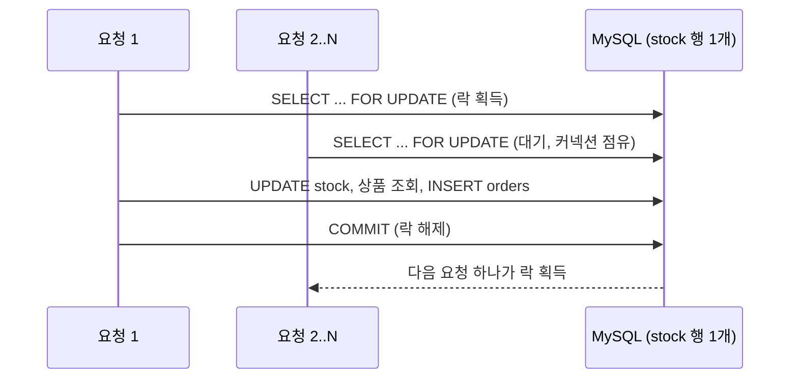

코팡(Kopang)은 한정 수량 상품을 여러 사용자가 한꺼번에 주문하는 선착순 상황을 다루는 커머스 서버 프로젝트입니다.
2025년 12월에 시작했고, 구현은 혼자 하면서 GitHub 이슈와 PR로 리뷰를 받았습니다.

이 글은 첫 단계의 기록입니다. 재고를 DB 비관적 락으로 지켰을 때 어떤 비용이 드는지 측정했고, 그 결과를 보고 다음 방식을 골랐습니다.
그 선택은 구현하기 전에 리뷰에서 바뀌었는데, 바뀐 과정은 [다음 글](/blog/kopang-redis-lua-stock/)에 이어서 적었습니다.

근거는 두 종류입니다. 코드와 커밋, [GitHub PR·이슈](https://github.com/kodesalon/kopang)는 이번에 다시 확인했습니다.
부하 테스트 결과는 [PR #18](https://github.com/kodesalon/kopang/pull/18)에 적힌 수치를 옮겼습니다. 스레드·커넥션 세부 지표는 당시 Grafana 화면을 보고 정리해 둔 기록에서 가져왔습니다.
테스트는 다시 돌리지 않았습니다.

## 목표와 환경

목표는 두 가지였습니다.

- 재고가 N개인 상품에 동시에 주문이 몰려도 정확히 N개까지만 팔린다. 초과 판매는 한 건도 허용하지 않는다.
- 락을 기다리느라 응답이 늦어지거나, 이벤트와 상관없는 기능까지 DB 커넥션을 못 얻는 상황을 줄인다.

테스트 환경은 작았습니다.

| 구분 | 사양 |
| --- | --- |
| 앱 서버 | AWS EC2 t3.small 1대 (2 vCPU, 2GB) |
| DB | AWS RDS MySQL db.t4g.micro 1대 (2 vCPU, 1GB) |
| 부하 도구 | k6, 로컬 M1 맥북에서 EC2로 요청 |

## 첫 구현: 재고 행을 잠근 채 주문까지 한 트랜잭션

처음 구현은 재고 차감과 주문 생성을 트랜잭션 하나로 묶고, 재고 행을 `SELECT ... FOR UPDATE`로 잠그는 방식이었습니다([6303cbd](https://github.com/kodesalon/kopang/commit/6303cbd)).

```java
// StockJpaRepository
@Lock(LockModeType.PESSIMISTIC_WRITE)
@Query("SELECT s FROM StockJpaEntity s WHERE s.productNo = :productNo")
StockJpaEntity findByProductNoWithLock(Long productNo);
```

```java
// PurchaseService
@Transactional
public ReservationOrderResult reservation(Long memberNo, Long productNo,
                                          Integer count) {
    // 재고 행 X-Lock, 차감, UPDATE
    Stock stock = stockService.decrease(productNo, count);
    // 상품 조회, 주문 INSERT
    Order order = orderService.createOrder(memberNo, productNo, count);
    return new ReservationOrderResult(stock, order);
}
```

락은 재고를 조회하는 순간 잡히고 커밋할 때 풀립니다. 그 사이에 상품 조회와 주문 INSERT가 들어 있으므로, 락을 쥐고 있는 시간은 사실상 트랜잭션 전체입니다.
재고가 0이어도 순서는 같습니다. 먼저 락을 잡고 재고를 읽은 뒤에야 "재고 없음" 예외(400)를 던집니다.



정합성은 확실했습니다. 같은 행을 두 요청이 동시에 고칠 수 없으니 초과 판매가 일어날 수 없습니다.
남은 질문은 이 직렬화가 트래픽이 몰릴 때 얼마나 비싼가였습니다.

## 부하 테스트

오픈 직후 주문이 한꺼번에 몰리는 상황을 가정해, 오래 부하를 거는 대신 짧게 몰아치는 시나리오를 짰습니다.
재고는 1,000개로 두었습니다.

```js
// k6/stress-test.js
stages: [
    {target: 10, duration: '10s'},   // 서서히 유입
    {target: 300, duration: '10s'},  // 10초 만에 300 VU
    {target: 300, duration: '40s'},  // 300 VU 유지, 재고 소진 유도
    {target: 0, duration: '10s'},
],
```

결과는 PR #18에 이렇게 남겼습니다.

| 항목 | 값 |
| --- | --- |
| 전체 요청 | 11,901건 |
| 주문 성공 (201) | 1,000건 (재고 수와 일치) |
| 재고 소진 실패 (400) | 10,901건 |
| 서버 오류 (500) | 0건 |
| 최대 응답 시간 | 8.51초 |
| Tomcat 스레드 / Hikari 풀 | 기본값 200 / 10 |
| Hikari active / pending | 10 / 최대 190 |

당시 모니터링 화면에서 따로 정리해 둔 지표도 있습니다. 이 값들은 다시 재지 않았습니다.

| 지표 | 값 |
| --- | --- |
| 커넥션 획득 대기 시간 최대 | 약 1.5초 |
| 성공 응답 최대 | 2.72초 |
| 앱 서버 CPU 최대 | 60% |
| JVM 힙 사용률 | 16.1% |
| 재고 소진 이후 실패 응답 평균 | 15.3ms |

### 결과를 어떻게 읽었나

정합성은 목표대로였습니다. 성공한 주문이 정확히 1,000건이었습니다.

서버가 멈추지도 않았습니다. 500은 0건이었습니다. 당시 정리 글에는 이 상황을 "시스템 마비"라고 적었는데, 이번에 PR 원문과 대조해 보니 과장이었습니다.
요청은 모두 처리됐고, 판매가 진행되는 동안 느려졌다고 쓰는 편이 정확합니다.

성공 응답의 최대가 2.72초였으므로, 최대 8.51초는 성공이 아니라 재고 소진(400) 응답 중 하나에서 나온 값입니다. 어느 시점의 요청이었는지는 기록이 없습니다.

느려진 이유는 커넥션 대기였습니다. Hikari 풀 10개가 모두 락을 기다리거나 쥐고 있었고, 나머지 요청 스레드 190개가 커넥션을 얻으려고 줄을 서 있었습니다.
CPU는 60%, 힙은 16%로 여유가 있었으니 계산이 모자란 게 아니라 I/O를 기다리는 상황이었습니다.

풀이나 스레드를 늘려도 풀리지 않는 구조라고 판단했습니다. 병목은 재고 행 하나이고, 그 행은 한 번에 한 트랜잭션만 쥘 수 있습니다.
풀을 키우면 락을 기다리는 커넥션만 늘어나고, 스레드를 늘리면 커넥션 앞에서 기다리는 스레드만 늘어납니다.

재고가 0이 된 뒤에도 락을 잡는 문제는 있었습니다. 다만 기록을 다시 보니 품절 이후 실패 응답은 평균 15.3ms로 빨랐습니다.
품절 뒤의 요청은 트랜잭션이 짧게 끝나서 대기가 길지 않았다는 뜻입니다. 비용의 대부분은 판매가 진행되는 1,000건 구간의 직렬화에서 나왔습니다.

## 한계 정리

측정 결과를 보고 비관적 락의 한계를 세 가지로 정리했습니다.

1. 커넥션 고갈이 번질 수 있습니다. 주문 요청이 커넥션을 쥐고 기다리는 동안, 같은 풀을 쓰는 다른 API도 커넥션을 얻지 못합니다.
2. 서버를 늘려도 처리량이 늘지 않습니다. 병목이 DB의 행 하나라서 앱 서버를 몇 대로 늘려도 같은 줄에 섭니다.
3. 품절 이후에도 요청마다 DB에서 락을 잡습니다. 응답은 빨랐지만 DB에 불필요한 요청이 계속 들어갑니다.

## 대안을 고른 기준

### 로컬 락과 분산 락

먼저 락을 어디에 둘지 정했습니다.

Java의 `ReentrantLock` 같은 로컬 락은 메모리 안에서 동작해서 빠르고, 외부 시스템이 필요 없습니다. 대신 서버가 두 대가 되면 각 서버의 락이 서로를 모르므로 동시성을 막지 못합니다.
여러 서버가 같은 락을 보려면 Redis 같은 공유 저장소에 락을 두는 분산 락이 필요합니다.

당시 서버는 한 대였지만 분산 락을 골랐습니다. 이유는 두 가지였습니다.

- 서비스가 커지면 서버를 늘려야 하고, 그때 락 구조를 다시 바꾸는 비용을 미리 줄이고 싶었습니다.
- 무중단 배포를 하면 배포 중에 구버전과 신버전 서버가 함께 떠 있으므로 로컬 락으로는 정합성을 지킬 수 없습니다.

두 번째 이유는 이번에 다시 보니 이 프로젝트의 실제 배포와는 맞지 않았습니다. 당시 배포는 CodeDeploy가 인스턴스 한 대에서 기존 프로세스를 내리고(`stop.sh`) 새 프로세스를 띄우는(`deploy.sh`) 방식이라, 두 버전이 동시에 뜨는 순간이 없었습니다.
앞으로 무중단 배포를 도입한다면 필요해지는 조건이었습니다.

### Lettuce와 Redisson

Redis로 분산 락을 만드는 방법으로 두 가지를 비교했습니다. 당시 정리에는 "Lettuce는 스핀 락 방식"이라고 적었는데, 정확히는 Lettuce가 락 기능을 제공하지 않아서 직접 만들면 스핀 락이 된다는 뜻입니다. 표는 그 점을 반영해 고쳐 적었습니다.

| 구분 | Lettuce로 직접 구현 | Redisson `RLock` |
| --- | --- | --- |
| 락 기능 | 없음. `SET key value NX PX`로 직접 구현 | 락 객체 제공 |
| 대기 방식 | 획득할 때까지 재시도 반복 (스핀) | 락 해제를 pub/sub 채널로 알림 받고 그때 재시도 |
| 대기자가 많을 때 Redis 부하 | 대기자 수만큼 요청이 계속 들어감 | 대기 중에는 요청이 거의 없음 |
| 직접 짜야 하는 것 | 재시도 간격, 타임아웃, 내 락인지 확인 후 해제 | 거의 없음 (lease time, 자동 연장 지원) |

락을 기다리는 요청이 수백 개인 상황이라면 스핀 방식은 Redis에 부하를 더합니다. 그래서 Redisson을 쓰기로 정리했습니다.
두 방식의 성능은 직접 재지 않았고, 문서와 동작 방식을 보고 판단했습니다.

## 이 결정은 구현 전에 바뀌었습니다

2025-12-19에 이슈 [#19](https://github.com/kodesalon/kopang/issues/19)에 "Redis 분산 락과 DB 낙관적 락 조합"을 대응안으로 올렸습니다.
이틀 뒤 리뷰어에게 이런 요지의 코멘트를 받았습니다.

- Redis로 옮겨도 트랜잭션 전체에 락을 거는 구조는 그대로다. 달라지는 건 락을 얻는 비용뿐이다.
- 락을 잡는 이유는 재고를 원자적으로 관리하기 위해서다. 트랜잭션 전체가 아니라 재고만 원자적으로 다룰 방법을 생각해 보라.

맞는 지적이었습니다. 분산 락은 락을 DB 밖으로 옮길 뿐, 락을 쥐는 범위(재고 조회부터 주문 INSERT까지)를 줄이지는 않습니다.
그래서 Redisson은 의존성도 추가하지 않은 채 접었습니다. 전체 브랜치의 커밋 이력에도 Redisson 코드는 없습니다.

락 범위를 재고 차감 하나로 줄이는 과정, 그 과정에서 겪은 갱신 손실, 결국 DB 재고 차감을 요청 흐름에서 뺀 이유는 [다음 글](/blog/kopang-redis-lua-stock/)에 적었습니다.

## 다시 확인한 것

글을 쓰면서 당시 정리 글의 주장을 코드·커밋·PR과 다시 대조했습니다.

| 당시 주장 | 확인 결과 | 근거 |
| --- | --- | --- |
| 비관적 락으로 트랜잭션 안에서 재고 차감과 주문 생성 | 맞음. 락은 커밋까지 유지 | [6303cbd](https://github.com/kodesalon/kopang/commit/6303cbd), PR #10 시점 `PurchaseService` |
| 재고 1,000개가 정확히 팔림, 최대 응답 8.51초 | 맞음 | PR #18 본문 |
| 커넥션 풀 고갈로 "시스템 마비" | 과장. 500은 0건이고 서버는 멈추지 않음. 느려진 것 | PR #18 본문 |
| 재고가 0이어도 락을 잡아 DB 부하 | 맞음. 다만 품절 뒤 응답은 평균 15.3ms로 빨랐음 | 당시 모니터링 기록 |
| 무중단 배포 시 구·신 서버 공존 | 당시 배포 방식에는 해당 없음 | `appspec.yml` (stop 후 start) |
| Lettuce는 스핀 락 방식 | 표현 수정. Lettuce로 직접 만든 락이 스핀 방식 | Lettuce·Redisson 문서 |
| Redisson 분산 락 도입 결정 | 결정만 하고 구현 전에 철회 | 이슈 #19 코멘트(2025-12-21), 전체 브랜치 `git log -S Redisson` 결과 없음 |
