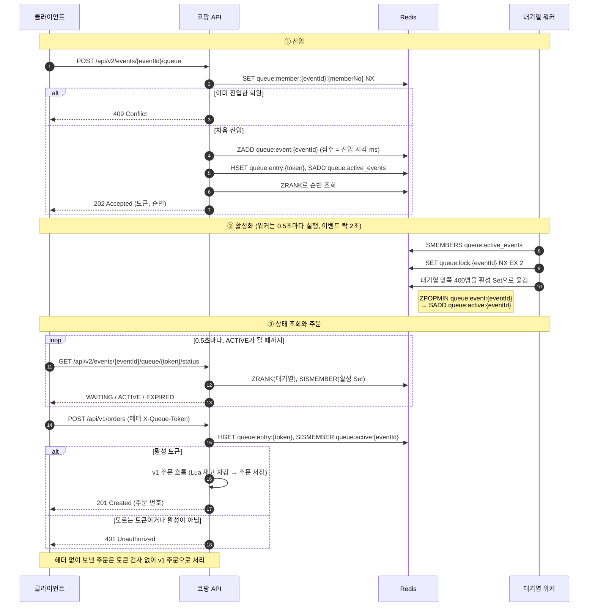
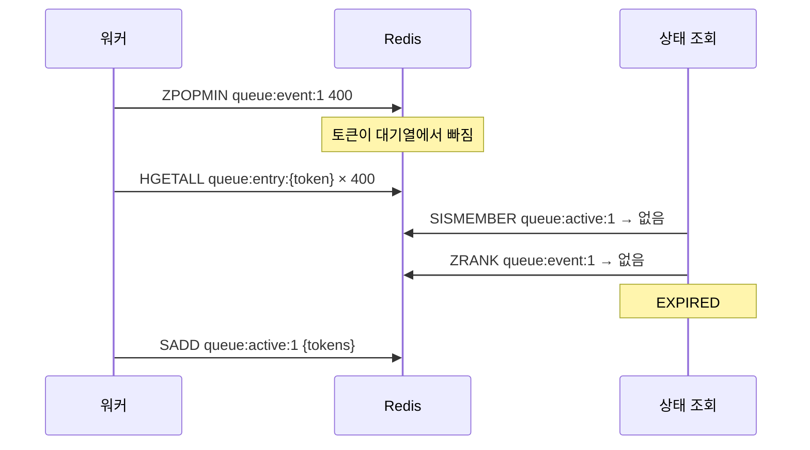

[재고 차감 글](/blog/kopang-redis-lua-stock/)에서 코팡의 재고를 Redis Lua 스크립트로 줄이게 바꿨습니다. 스크립트가 원자적으로 돌아서 초과 판매는 막지만, 누가 먼저 사는지는 정하지 않습니다.
2026년 3월에 50명이 동시에 주문하게 해 보니, 보낸 순서와 주문 번호 순서가 뒤바뀐 쌍이 30.9%였습니다([PR #56](https://github.com/kodesalon/kopang/pull/56)).

그래서 주문 앞에 Redis 대기열을 붙였습니다([PR #58](https://github.com/kodesalon/kopang/pull/58)). 이 글은 그 대기열이 정말 순서를 지키는지 다시 잰 기록입니다.

- 50명이 동시에 보낸 요청은 1~2ms 안에 몰려서, 쌍의 절반 이상은 누가 먼저인지 정할 수 없었습니다.
- 요청 사이에 1ms만 간격을 둬도 v1은 순서를 지켰습니다.
- 800명이 동시에 들어오면 대기열의 순번도 v1의 주문 번호만큼 뒤섞였습니다.
- 간격을 두고 들어오면 대기열이 오히려 주문 순서를 흐렸고, 활성화하는 틈에 사용자가 떨어져 나가는 결함이 있었습니다. 이 결함은 고쳤습니다.

## 대기열(v2)의 구조

대기열은 세 단계로 동작합니다.

1. 진입: `POST /api/v2/events/{eventId}/queue`가 토큰을 발급하고 Redis ZSet에 넣습니다. 점수는 진입 시각(ms)입니다.
2. 활성화: 워커가 대기열 앞쪽 400명을 꺼내 활성 Set에 넣습니다.
3. 상태 조회와 주문: 클라이언트는 0.5초마다 상태를 조회하다가 ACTIVE가 되면, 그 토큰을 붙여 기존 주문 API를 호출합니다.



주문 API는 `X-Queue-Token` 헤더가 있을 때만 토큰을 검사합니다. 헤더 없이 보낸 주문은 상시 주문으로 보고 그대로 처리하므로, 이벤트 상품도 대기열을 거치지 않고 주문할 수 있습니다.

v2를 만들 때의 검증 결과는 "배치 간 역전 0%"였습니다. 앞 배치 사람이 뒤 배치 사람보다 늦게 주문한 쌍이 없었다는 뜻입니다.
그런데 v1은 보낸 시각과 주문 번호를 비교했고, v2는 대기열 순번과 주문 번호를 비교했습니다. 기준이 달라서 두 숫자는 나란히 놓을 수 없습니다.

## 같은 기준으로 재는 방법

v1과 v2를 같은 스크립트, 같은 지표로 다시 쟀습니다.

- 환경: 로컬에서 앱 한 대, H2, Redis 한 대, k6. 절대 수치보다 v1과 v2의 비교에 의미를 둡니다.
- 시나리오: 원래 테스트처럼 모두가 동시에 한 번씩 보내는 경우(50명, 800명)와, 요청 사이에 1ms·5ms 간격을 두는 경우(200명)입니다.
- 지표: 두 요청 A, B에서 A를 엄격히 먼저 보냈는데 B보다 늦게 처리됐으면 역전으로 셉니다. 분모는 전체 쌍입니다. 같은 ms에 보낸 쌍은 누가 먼저인지 정할 수 없어 역전으로 세지 않고 비율을 따로 적었습니다.
- v2는 두 가지를 봤습니다. 보낸 시각과 대기열 순번(진입이 공정한가), 보낸 시각과 주문 번호(끝에서 끝까지)입니다.

측정에 쓴 인원·간격 옵션과 분석 스크립트(`k6/fairness-report.py`)는 [PR #60](https://github.com/kodesalon/kopang/pull/60)에 함께 넣었습니다.

## 동시에 보낸 요청에는 '먼저'가 없습니다

원래 테스트처럼 50명이 동시에 한 번씩 주문하면, 요청은 1~2ms 안에 모두 나갑니다.

| v1, 50명 동시 (5회) | 값 |
| --- | --- |
| 보낸 시각 범위 | 1~2ms |
| 같은 ms에 보낸 쌍 | 50~67% |
| 역전 (엄격히 먼저 보낸 쌍 기준) | 4.4~28.6% |
| 역전 (원래 분석 방식) | 16.4~32.7% |

쌍의 절반 이상이 같은 ms에 나갔으니 누가 먼저인지 말할 수 없습니다. 원래 분석은 이런 쌍을 k6 로그에 찍힌 순서로 줄 세웠는데, 그 방식으로 다시 계산하면 16~33%가 나옵니다. 30.9%는 이 범위 안의 한 번이었습니다.
v2는 더 극단적이었습니다. 50명이 모두 같은 1ms 안에 진입해서 순서를 비교할 쌍이 하나도 없었습니다.

## 간격을 두면 v1은 순서를 지킵니다

요청 사이에 간격을 두고 200명이 한 번씩 주문하게 했습니다.

| 간격 | v1 역전 |
| --- | --- |
| 1ms | 0.0~0.2% (2회) |
| 5ms | 0.0% (2회) |

1ms만 떨어져 도착해도 앞 요청이 먼저 처리됐습니다. v1의 역전은 사실상 동시에 들어온 요청 사이에서만 생깁니다.
같은 ms에 도착한 요청은 Tomcat 스레드가 집어 드는 순서부터 제각각이라, 지켜야 할 '도착 순서'가 처음부터 정해져 있지 않습니다.

## 대기열의 순번도 똑같이 뒤섞입니다

800명이 동시에 들어오는 경우를 비교했습니다. 보낸 시각은 12~47ms 안에 퍼졌습니다.

| 800명 동시 | 역전 |
| --- | --- |
| v1: 보낸 시각 → 주문 번호 | 20.3~48.9% (3회) |
| v2: 보낸 시각 → 대기열 순번 | 33.4~57.6% (3회) |
| v2: 보낸 시각 → 주문 번호 | 32.5~58.0% (3회) |

대기열이 순번을 매기는 코드는 이렇습니다.

```java
// EventQueueRepositoryImpl.enqueue
long requestedAt = System.currentTimeMillis();
redisTemplate.opsForZSet().add(queueKey, token, requestedAt);
```

순번의 기준은 Redis에 도착한 시각이 아니라, 앱 서버가 진입 요청을 처리하던 시각입니다. 진입 요청도 Tomcat 스레드를 거치므로 v1과 같은 뒤섞임을 그대로 겪습니다.
같은 ms에 들어온 요청끼리는 점수가 같아서, ZSet이 토큰(UUID)의 사전순으로 줄을 세웁니다. 사실상 무작위입니다.

"배치 간 역전 0%"는 틀린 값은 아닙니다. 다만 순번대로 배치를 활성화하니 구조상 당연히 0이 나오는 값이었습니다.

## 간격을 두면 대기열이 오히려 순서를 흐립니다

200명이 간격을 두고 들어올 때 v2의 주문 순서는 이랬습니다. 아래 결함을 고친 뒤의 값입니다.

| 간격 | v1 | v2: 보낸 시각 → 주문 번호 |
| --- | --- | --- |
| 1ms | 0.0~0.2% | 0.9~12.3% (3회) |
| 5ms | 0.0% | 18.4~21.6% (3회) |

활성화가 배치 단위라서 생기는 일입니다. 같은 배치의 사람들은 한꺼번에 ACTIVE가 되고, 각자 다음 상태 조회 때 이를 알아채고 주문합니다. 그래서 배치 안의 주문 순서는 도착 순서가 아니라 각자의 폴링 시점이 정합니다.

배치 간격도 설계보다 길었습니다. 워커는 0.5초마다 돌지만 이벤트마다 거는 락(TTL 2초)을 풀지 않아서, 한 이벤트는 약 2초에 한 번 활성화됩니다. 800명 테스트에서 두 번째 배치는 첫 배치보다 약 2초 늦게 ACTIVE가 됐습니다.

재고가 배치 크기(400)보다 적으면 문제가 더 분명해집니다. 첫 배치 400명이 한꺼번에 활성화된 뒤 그 안에서 다시 주문 경쟁을 하므로, 당첨자는 결국 v1과 같은 경쟁으로 정해집니다.

## 활성화하는 틈에 떨어져 나간 사용자

간격을 둔 측정에서 일부 사용자가 대기 중에 EXPIRED를 받았습니다. k6 클라이언트는 EXPIRED를 최종 상태로 보고 주문을 포기합니다. 실제 앱도 대기열이 만료됐다고 안내했을 겁니다.

| 실행 (200명) | 떨어져 나간 사용자 |
| --- | --- |
| 1ms 간격, 1회차 | 58명 |
| 5ms 간격, 1·2회차 | 6명, 11명 |

### 원인 1: 꺼내기와 활성화 사이의 틈

워커는 대기열에서 꺼내는 일과 활성 Set에 넣는 일을 따로 했습니다. 그 사이에 토큰마다 상세 정보를 읽는 호출이 최대 400번 있었습니다.



400명을 한 번에 활성화하는 동안 상태를 계속 조회하는 테스트를 만들어 돌려 봤습니다. 220~244번 조회 중 210~236번이 EXPIRED였습니다(3회).

꺼내기와 활성화를 Lua 스크립트 하나로 묶었습니다. Redis는 스크립트를 실행하는 동안 다른 명령을 끼워 넣지 않으므로, 토큰은 대기열에서 활성 Set으로 한 번에 옮겨집니다.

```lua
local popped = redis.call('ZPOPMIN', KEYS[1], ARGV[1])
if #popped > 0 then
    local tokens = {}
    for i = 1, #popped, 2 do
        tokens[#tokens + 1] = popped[i]
    end
    redis.call('SADD', KEYS[2], unpack(tokens))
    redis.call('EXPIRE', KEYS[2], ARGV[2])
end
if redis.call('ZCARD', KEYS[1]) == 0 then
    redis.call('SREM', KEYS[3], ARGV[3])
end
return popped
```

대기열이 비었는지 확인하고 활성 이벤트 목록에서 빼는 일도 같은 스크립트로 옮겼습니다. 따로 하면 "비었다"고 본 직후 들어온 진입까지 목록에서 지워져, 다음 진입이 올 때까지 활성화되지 않습니다.

### 원인 2: 상태 조회의 순서

스크립트로 바꾼 뒤에도 같은 테스트가 세 번 중 한 번 EXPIRED를 1건 잡았습니다. 이번에는 상태 조회가 문제였습니다.

```java
// 고치기 전
if (isTokenActive(eventId, token)) return ACTIVE;   // ① 아직 대기열에 있어 false
long position = getPosition(eventId, token);          // ② 그사이 옮겨져 -1
if (position >= 0) return WAITING;
return EXPIRED;
```

①과 ② 사이에 토큰이 옮겨지면 두 곳 모두에서 보이지 않습니다. 토큰은 대기열에서 활성 Set으로 한 방향으로만 옮겨지므로, 앞 단계인 대기열을 먼저 보고 뒤 단계인 활성 Set을 나중에 보면 이 틈이 생기지 않습니다.

```java
// 고친 뒤
long position = getPosition(eventId, token);
if (position >= 0) return WAITING;
if (isTokenActive(eventId, token)) return ACTIVE;
return EXPIRED;
```

두 가지를 고친 뒤 같은 테스트는 13번 모두 EXPIRED가 0건이었습니다. k6로 다시 잰 8회(2,200명)에서도 떨어져 나간 사용자는 없었습니다.

### 가끔 실패하던 대기열 테스트

대기열 동시성 테스트 하나가 가끔 "50건을 기대했는데 0건"으로 실패했습니다. 처음에는 다른 테스트 컨텍스트의 워커가 항목을 먼저 가져간다고 봤는데, 원인은 따로 있었습니다.

진입할 때 같은 회원의 중복 진입을 막으려고 `queue:member:{eventId}:{memberNo}` 키를 24시간짜리로 남깁니다. 테스트가 이 키를 지우지 않아서, 다음 테스트나 다음 실행에서 같은 회원 50명의 진입이 모두 거절됐습니다.
정리 대상에 이 키를 넣었습니다. 테스트 프로필에서는 워커도 꺼서, 테스트가 넣은 항목을 워커가 먼저 가져가지 않게 했습니다. 고친 코드는 [PR #60](https://github.com/kodesalon/kopang/pull/60)에 있습니다.

## 대기열이 주는 것과 주지 못하는 것

대기열이 주는 것은 두 가지입니다.

- 배치 경계를 넘는 순서. 앞 배치에 든 사람은 뒤 배치 사람보다 먼저 주문할 기회를 받습니다.
- 주문 API로 넘어가는 양의 조절. 워커가 한 번에 활성화하는 수만큼만 주문 경쟁에 들어옵니다.

주지 못하는 것도 두 가지입니다.

- 동시에 들어온 요청 사이의 공정성. 순번을 매기는 시점도 결국 서버가 진입 요청을 처리하는 순간입니다.
- 배치 안의 순서. 주문 순서는 각자의 폴링 시점이 정하고, 재고가 배치 크기보다 적으면 당첨자도 그 안에서 정해집니다.

v1의 30.9%를 보고 "Lua는 순서를 지키지 않는다"고 결론 내렸지만, 다시 재 보니 v1은 1ms 간격의 요청도 순서대로 처리했습니다. 문제로 봤던 역전은 사실상 동시에 들어온 요청 사이의 일이었습니다.
대기열을 만들기 전에 '먼저'를 정의할 수 있는 도착 간격부터 정하고, v1과 v2를 같은 지표로 쟀어야 했습니다.

## 다시 확인한 것

| 당시 주장 | 확인 결과 | 근거 |
| --- | --- | --- |
| Lua 스크립트는 선착순(FIFO)을 보장하지 않는다(역전 30.9%) | 역전은 같은 ms에 몰린 요청 사이에서만 생김. 1ms 간격이면 0~0.2% | 재측정 |
| 역전율은 실행마다 33~49% | 원자료 없음. 원래 분석 방식으로 다시 재면 16~33% | PR #56, 재측정 |
| 대기열로 배치 간 역전 0%, 공정성 확보 | 순번 → 주문 번호 기준이라 구조상 0. 보낸 시각 → 순번은 800명에서 33~58% | 재측정 |
| Redis에 도착한 시각으로 순서 확정 | 앱 서버가 진입을 처리한 시각(ms). 같은 ms는 토큰 사전순 | `EventQueueRepositoryImpl.enqueue` |
| 워커가 0.5초마다 400명씩 활성화 | 락(2초)을 풀지 않아 이벤트마다 약 2초에 한 번 | `EventQueueWorker`, 재측정 |
| 대기 중 상태는 WAITING 또는 ACTIVE | 활성화 틈에 EXPIRED. 고친 뒤 0건 | 재현 테스트, PR #60 |
