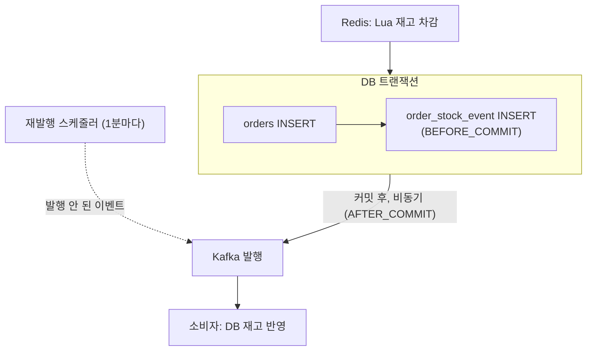

[앞 글](/blog/kopang-lua-atomicity-limits/)까지는 코팡의 Redis 재고를 DB에 맞추는 수단으로 Redis Streams를 골라 두었습니다.
2026-01-28에 이 결정을 바꿔 Kafka와 Transactional Outbox 조합을 최종안으로 올렸고(이슈 [#31](https://github.com/kodesalon/kopang/issues/31) 코멘트), 다음 날 [PR #49](https://github.com/kodesalon/kopang/pull/49)로 구현을 머지했습니다.

이 글은 그 결정의 근거와 실제로 구현된 범위를 다룹니다.
근거는 코드·커밋·이슈와 Redis 공식 문서입니다. 구현 범위는 이번(2026-09-24)에 레포를 복제해 검증 테스트를 추가로 돌려서 확인했습니다. 원래 레포에는 이 테스트를 넣지 않았습니다.

## 풀려던 문제

재고 차감은 Redis에서 하고, 주문은 DB에 INSERT하고, DB의 재고 숫자는 이벤트로 나중에 맞추는 구조입니다.
여기서 가장 신경 쓴 것은 "주문 저장"과 "재고 이벤트 발행"이 따로 논다는 점이었습니다.

주문 INSERT는 커밋됐는데 Kafka로 이벤트를 보내기 전에 프로세스가 죽으면, DB에는 주문이 있는데 재고를 맞출 이벤트는 사라집니다.
그래서 둘은 함께 성공하거나 함께 실패해야 한다고 정했습니다.

## Redis Streams를 다시 뺀 이유

앞 글의 결론이던 Redis Streams를 뺀 이유는 네 가지였습니다. 각각을 공식 문서와 대조하고, 이 프로젝트에 그대로 들어맞는지도 함께 적었습니다.

먼저 전제 하나를 짚습니다. 코팡 앱은 Redis 호스트 하나에 붙도록 설정돼 있고, 클러스터나 센티널 설정은 없습니다. 아래 네 가지 중 앞의 두 개는 Redis를 여러 대로 늘렸을 때의 이야기입니다.

1. 비동기 복제 유실. Redis 복제는 비동기라서, 주 노드가 응답한 직후 복제본에 넘기기 전에 죽으면 그 쓰기는 장애 조치 후 사라집니다. `WAIT` 명령으로 복제본의 확인을 기다릴 수 있지만, [문서](https://redis.io/docs/latest/commands/wait/)에도 `WAIT`가 Redis를 강한 일관성 저장소로 만들지는 않는다고 적혀 있습니다.
2. 핫스팟. Redis Cluster는 키 단위로 노드에 나뉩니다. 한 스크립트가 다루는 키들은 같은 노드에 있어야 하므로 재고 키와 스트림 키를 해시 태그로 묶어야 하고, 인기 상품 하나의 트래픽이 노드 한 대로 몰립니다.
3. 메모리. 소비자가 멈추면 스트림이 메모리에 계속 쌓입니다. 한도에 닿으면 `noeviction` 정책에서는 새 쓰기가 거부되고, `MAXLEN`이나 eviction 정책을 쓰면 아직 처리하지 않은 이벤트가 지워질 수 있습니다.
4. 디스크 기록. AOF를 `everysec`으로 켜도 장애 시 약 1초 분량을 잃을 수 있고, `always`는 느립니다.

이번에 다시 보니 1번과 2번은 스트림만의 문제가 아니었습니다. 최종안에서도 재고 자체는 Redis에 있습니다.
복제 지연으로 차감이 사라지면 Redis 재고가 실제보다 많아지고, 그만큼 더 팔 수 있게 됩니다. 인기 상품의 재고 키도 원래부터 노드 한 대에 있습니다.
그러니 이 두 근거는 "이벤트 기록까지 Redis에 두지는 말자"는 결론으로는 맞지만, 최종안에도 재고 차감의 위험은 그대로 남습니다.

## 후보 두 가지

### 커밋 뒤 바로 발행하고, 실패하면 outbox에 남기기

DB 트랜잭션을 커밋한 뒤 Kafka로 발행하고, 발행이 실패하면 그때 outbox 테이블에 저장하는 방식입니다.
커밋과 발행 사이에 프로세스가 죽으면 발행도, outbox 저장도 일어나지 않습니다. DB에는 주문이 있는데 아무도 그 사실을 모르게 되므로 뺐습니다.

### Transactional Outbox

이벤트를 Kafka로 바로 보내지 않고, 주문 INSERT와 같은 DB 트랜잭션 안에서 outbox 테이블에 먼저 저장합니다. Kafka 발행은 커밋 뒤에 따로 하고, 발행하지 못한 이벤트는 스케줄러가 outbox에서 찾아 다시 보냅니다.
주문이 커밋되면 이벤트도 커밋되고, 주문이 롤백되면 이벤트도 롤백됩니다. 이 방식을 골랐습니다.



최종안 글에는 이 구조를 "Redis, RDBMS, Kafka를 Saga 패턴으로 관리해 원자성을 보장한다"고 적었는데, 과한 표현이었습니다.
코드에 있는 보상 동작은 주문 INSERT가 실패했을 때 같은 프로세스 안에서 Redis 재고를 되돌리는 것 하나뿐입니다. Saga는 원래 보상으로 결국 일관된 상태에 이르게 하는 방식이지 원자성을 보장하는 방식도 아닙니다.

## 구현한 것

PR #49에서 넣은 코드는 이렇습니다(현재 main 기준).

```java
// OrderService: 주문 INSERT와 이벤트 발행이 한 트랜잭션
@Transactional
public Order createOrderPending(Long memberNo, Long productNo, Long warehouseNo,
                                Integer count, BigDecimal productPrice) {
    Order order = orderRepository.register(
        Order.createPending(memberNo, productNo, warehouseNo,
                            count, productPrice));
    eventPublisher.createOrderPending(
        OrderStockEvent.create(order.getNo(), productNo, warehouseNo, count));
    return order;
}
```

```java
// OrderStockEventListener: 커밋 직전, 같은 트랜잭션 안에서 outbox INSERT
@TransactionalEventListener(phase = TransactionPhase.BEFORE_COMMIT)
public void handleOrderStockEvent(OrderStockEvent event) {
    orderStockEventJpaRepository.save(OrderStockEventJpaEntity.builder()
        .id(event.id())
        // ...
        .eventType(OrderStockEventJpaEntity.EventType.DECREASE)
        .build());
}

// OrderStockEventMessageListener: 커밋 뒤 별도 스레드에서 Kafka 발행
@Async("eventTaskExecutor")
@TransactionalEventListener(phase = TransactionPhase.AFTER_COMMIT)
public void handleOrderStockEvent(OrderStockEvent event) {
    kafkaMessageProducer.produce();
}
```

```java
// OrderStockEventRelayScheduler: 5분 넘게 발행되지 않은 이벤트를 1분마다 재발행
@Scheduled(fixedDelay = 60_000, initialDelay = 300_000)
public void replayFailedEvents() {
    List<OrderStockEventJpaEntity> events = orderStockEventJpaRepository
        .findAllByPublishedFalseAndCreatedAtBefore(
            LocalDateTime.now().minusMinutes(5));
    for (OrderStockEventJpaEntity event : events) {
        mockKafkaMessageProducer.produce();
    }
}
```

`kafkaMessageProducer`의 실제 타입은 `MockKafkaMessageProducer`이고, `produce()`는 본문이 비어 있습니다. `build.gradle`에는 Kafka 의존성이 없고 README에도 "Kafka (구현 예정)"으로 적혀 있습니다.

머지한 날 저녁에 핫픽스가 두 번 들어갔습니다. 문자열 UUID인 이벤트 ID에 붙어 있던 `@GeneratedValue(IDENTITY)`를 뺐고([c85c23a](https://github.com/kodesalon/kopang/commit/c85c23a)), 이어서 `created_at` 컬럼의 NOT NULL 제약을 뺐습니다([beac961](https://github.com/kodesalon/kopang/commit/beac961)).
두 번째 핫픽스의 이유는 아래 테스트에서 드러났습니다.

## 다시 돌려 본 결과

앱과 같은 설정(`@SpringBootTest`, test 프로필, H2)으로 두 가지 테스트를 추가로 돌렸습니다. Redis는 쓰지 않았습니다.

첫째, outbox INSERT가 실패하면 주문도 롤백되는가. outbox 저장소가 예외를 던지게 해 두고 주문을 만들었습니다.

```
VERIFY thrown = java.lang.IllegalStateException: outbox insert failed
VERIFY orders count after outbox failure = 0
```

주문은 남지 않았습니다. `BEFORE_COMMIT` 리스너에서 난 예외가 커밋 전에 올라와 트랜잭션 전체가 롤백됩니다. Outbox의 핵심 주장인 "주문과 이벤트는 함께 저장되거나 함께 사라진다"는 코드가 지키고 있었습니다.

둘째, 주문을 하나 만든 뒤 두 테이블과 재발행 조회 결과를 확인했습니다.

```
VERIFY orders row = {NO=1, STATUS=PENDING, ORDERED_AT=null}
VERIFY outbox rows = [{..., EVENT_TYPE=DECREASE, PUBLISHED=false,
                        CREATED_AT=null, PUBLISHED_AT=null}]
VERIFY relay query (cutoff = now+1d) size = 0
```

`created_at`과 `ordered_at`이 둘 다 null입니다. 두 필드에는 `@CreatedDate`가 붙어 있는데, 이 값을 채우려면 `@EnableJpaAuditing`이 있어야 합니다. 전체 브랜치의 커밋 이력 어디에도 이 설정이 없습니다.
그 결과 재발행 스케줄러의 조회 조건 `created_at < 기준 시각`이 null에서는 참이 되지 않아, 기준을 하루 뒤로 넉넉히 줘도 한 건도 찾지 못했습니다. 머지한 날 `created_at`의 NOT NULL 제약을 뺀 것도, MySQL에서 이 null 때문에 INSERT가 실패했기 때문으로 보입니다.

같은 원인으로 `orders.ordered_at`도 비어 있어서, 결제 기한이 지난 주문을 찾는 조회도 0건이었습니다. 이 영향은 결제 글에서 다시 다룹니다.

## 아직 남은 것

테스트와 코드를 함께 보면, 재고 동기화 쪽에서 실제로 동작하는 것은 "주문과 이벤트를 함께 저장한다"까지입니다.

| 단계 | 상태 |
| --- | --- |
| 주문 INSERT와 outbox INSERT를 한 트랜잭션으로 | 동작함 (테스트로 확인) |
| 커밋 뒤 Kafka 발행 | 빈 구현. Kafka 의존성 없음 |
| 발행 성공 표시 (`published = true`) | 이 값을 바꾸는 코드가 없음 |
| 발행 안 된 이벤트 재발행 | `created_at`이 null이라 대상이 0건 |
| 소비자가 DB 재고 반영 | 소비자 없음. DB 재고는 바뀌지 않음 |
| 주문 취소로 재고가 돌아올 때의 이벤트 | 기록하지 않음. `DECREASE`만 저장 |
| Redis 차감과 DB 트랜잭션 사이의 공백 | 그대로. 차감 뒤 커밋 전에 죽으면 Redis 재고만 줄어듦 |

재발행 스케줄러가 대상을 찾게 되더라도, `published`를 `true`로 바꾸는 코드가 없으니 모든 이벤트를 1분마다 계속 다시 보내게 됩니다.
소비자를 만들더라도, 취소 이벤트가 없으니 DB 재고는 취소된 주문만큼 계속 적게 셉니다.

이어서 구현한다면 순서는 이렇게 잡을 것 같습니다.
1. `@EnableJpaAuditing`을 켭니다.
2. 발행이 성공하면 `published`를 표시합니다.
3. 취소할 때 `INCREASE` 이벤트를 남깁니다.
4. 소비자가 `event_id`로 중복을 걸러 멱등하게 반영하도록 만듭니다.
5. 마지막으로 Redis 차감과 DB 사이의 공백은 주문 테이블로 재고를 다시 계산하는 대사 작업으로 메웁니다. 주문 행은 이미 DB 트랜잭션으로 지켜지고 있으므로, 재고 숫자는 주문으로부터 다시 계산할 수 있습니다.

## 다시 확인한 것

| 당시 주장 | 확인 결과 | 근거 |
| --- | --- | --- |
| 주문이 저장되면 재고 이벤트도 반드시 함께 저장 | 맞음. outbox 실패 시 주문도 롤백 | `OrderStockEventListener`(`BEFORE_COMMIT`), 검증 테스트 |
| Kafka로 발행, 소비자가 DB 재고 반영 | 미구현. 발행은 빈 메서드, 소비자 없음 | `MockKafkaMessageProducer`, `build.gradle` |
| 발행 실패 이벤트를 스케줄러가 재발행 | 동작하지 않음. `created_at`이 null이라 대상 0건 | 검증 테스트, `@EnableJpaAuditing` 부재 |
| Saga 패턴으로 원자성 보장 | 과장. 보상은 프로세스 안의 Redis 되돌리기 하나 | `PurchaseOrchestrator.reserve` |
| Redis 비동기 복제로 인한 유실 때문에 Streams 기각 | 이벤트 저장소로서는 타당. 다만 재고 자체는 여전히 Redis라 같은 위험이 남음 | `WAIT` 문서, 현재 구조 |
| 어떤 장애에서도 재고 데이터 유실 없음, DB 정합성 100% | 성립하지 않음. 위 "아직 남은 것" 표 참고 | 코드, 검증 테스트 |
