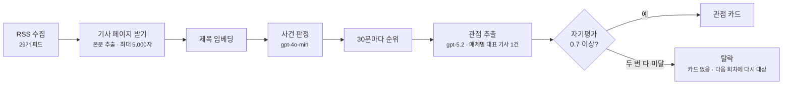

baro의 뉴스 인텔리전스 앱은 언론사 피드를 모아 같은 사건을 다룬 기사끼리 묶고, 화제가 된 사건마다 매체별로 어떤 관점에서 보도했는지 LLM으로 요약해 나란히 보여 줍니다.
파이프라인 구조는 [아웃박스 없이 뉴스 파이프라인 잇기](/blog/state-as-queue-without-outbox/)에 정리했습니다. LLM 비용은 대부분 이 관점 추출에서 나옵니다.

2026-09-15에 운영 로그로 비용을 나눠 보니, 직전 7일(09-08~09-14, 정치 분류) LLM 비용 $10.24 중 $3.64(35.6%)가 카드를 하나도 남기지 못하고 버려진 관점 추출에 쓰였습니다.
버려진 676건 중 653건이 동아일보였고, 09-08 이후 저장된 동아일보 기사 523건 중 본문이 제대로 들어간 기사는 한 건도 없었습니다.
본문 추출기가 공유 팝업 문구나 100자에서 잘린 요약을 본문으로 저장하고 있었습니다.
모델과 프롬프트는 그대로 두고 추출기를 고친 뒤 두 주 동안, 관점 요약 호출 가운데 버려지는 호출은 54%에서 2% 안팎으로 줄었습니다.

한 달 전(08-16)에도 비슷한 감사를 했습니다. 그때도 버려지는 호출의 원인은 모델이 아니라 입력이었습니다.
그리고 커밋을 따라가 보니, 이번 동아일보 결함의 대부분(잘린 요약 75.1%)은 그때 입력을 고치려고 넣은 코드에서 나왔습니다.

이 글은 두 번의 감사와 그 사이에 넣은 계측을 정리한 것입니다.

금액은 모두 청구서가 아니라 로그에 남은 토큰 수에 공시 단가를 곱한 환산값입니다.

## 비용이 나가는 자리

기사 한 건이 관점 카드가 되기까지의 흐름입니다.



관점 추출은 사건마다 매체별 대표 기사 한 건을 골라 gpt-5.2에 보냅니다. 응답 하나에 관점 요약 2~3문장과 `faithfulnessScore`, 즉 모델이 스스로 매긴 충실성 점수가 함께 옵니다.
점수가 0.7 미만이면 같은 요청을 한 번 더 보내고, 또 미달이면 카드를 만들지 않습니다. 카드가 없는 매체는 30분 뒤 다음 회차에 다시 추출 대상이 됩니다.

LLM에 들어가는 입력은 이렇게 만듭니다.

```kotlin
// OpenAiPerspectiveExtractionClient
private fun buildUserPrompt(request: PerspectiveExtractionRequest): String = buildString {
    append("[사건]\n${request.eventLabel}\n\n")
    append("[매체]\n${request.publisherName}\n\n")
    append("[기사 제목]\n${request.articleTitle}")
    if (!request.articleBody.isNullOrBlank()) {
        append("\n\n[기사 본문]\n${request.articleBody}")
    } else if (!request.articleDescription.isNullOrBlank()) {
        append("\n\n[기사 요약]\n${request.articleDescription}")
    }
}
```

본문이 있으면 본문만 넣고, RSS 요약은 본문이 없을 때만 씁니다. 호출 전에 입력이 쓸 만한지 거르는 게이트도 있습니다.

```kotlin
// ArticleContentGenerator
private fun hasUsableContent(rep: RepresentativeArticle): Boolean {
    if (!rep.bodyText.isNullOrBlank()) return true
    val stripped = rep.rssDescription?.replace(HTML_TAG, " ")?.replace(WHITESPACE_RUN, " ")?.trim()
    return (stripped?.length ?: 0) >= MIN_CONTENT_LENGTH   // 50자
}
```

이 두 코드는 뒤의 두 감사에 모두 나옵니다.

## 첫 번째 감사 (2026-08-16): 제목 한 줄로 관점을 요약하라는 요청

운영 전, 정치 기사 503건을 처리하는 동안 LLM 호출이 약 1,300회 나갔고 전부 gpt-5.2였습니다.

| 클라이언트 | 호출 | 비중 | 하는 일 |
| --- | ---: | ---: | --- |
| 사건 판정 | 약 1,200 | 83% | 제목 두 개를 주고 같은 사건인지 true/false |
| 관점 추출 | 약 88 | 12% | 매체 관점 요약과 자기평가 점수 |
| 사건 요약 | 약 15 | 1% | 사건 개요 2~3문장 |

관점 추출 88회에서 남은 카드는 34개였고, 나머지 54회는 충실성 미달로 버려졌습니다.
모델을 바꿔 보기 전에 매체별로 LLM에 실제로 들어간 입력부터 확인했습니다.

| 매체 | 본문 있음 | RSS description | 상태 | 남은 카드 |
| --- | ---: | --- | --- | ---: |
| 조선일보 | 0건 | 없음 | 제목 한 줄만 들어감 | 0 |
| 한겨레 | 8건 (21%) | 38건 전부 `<table>` 마크업 | 태그를 떼면 0바이트 | 0 |
| 동아일보 | 8건 (11%) | 63건, ``와 텍스트 혼합 | 태그를 떼면 약 498자 | 13 |
| 경향신문 | 19건 (28%) | 66건, 깨끗한 텍스트 | 정상 | 10 |
| 연합뉴스 | 95건 (44%) | 197건, 깨끗한 텍스트 | 정상 | 11 |

"본문 있음"은 전날(08-15) 넣은 기사 페이지 본문 추출기가 채운 값입니다. 이 추출기는 뒤에서 다시 나옵니다.

조선일보는 RSS에 description이 없고 크롤러도 본문을 가져오지 못해서, LLM은 제목 한 줄만 받고 관점을 요약해야 했습니다.
한겨레는 description 전체가 `<table border='0px' cellpadding='0px' ...>` 같은 마크업이었습니다.
두 매체 모두 요약, 충실성 미달, 재시도, 다시 미달을 거쳐 기사마다 호출 두 번에 카드 0개였습니다. 입력이 없으면 모델을 바꿔도 결과는 같습니다.

그래서 입력부터 고쳤습니다. 당시 문서에 적은 수정은 아홉 가지입니다.

| 구분 | 수정 | 줄이려던 것 |
| --- | --- | --- |
| 입력 | 본문이 없고 태그를 뗀 description이 50자 미만이면 호출하지 않음 | 조선일보·한겨레의 확정 탈락 호출 |
| 입력 | 수집할 때 description의 HTML 태그 제거 | LLM 입력의 마크업 잡음 |
| 입력 | 한겨레 `.article-text` 선택자, JSON-LD `abstract`·`description` 폴백 | 본문이 없던 매체 |
| 모델 | 사건 판정만 gpt-4o-mini로 분리. 조건은 기존 8쌍 벤치마크 8/8 | 호출의 83%를 차지하던 이진 분류의 단가 |
| 호출 수 | 사건 후보 회수 임계 0.3 → 0.5 (실측 최저 매칭 0.58) | 사건 판정 후보 수 |
| 호출 수 | 새로 합류한 매체만 관점 추출 | 갱신 때마다 전 매체 재추출 |
| 호출 수 | 매체가 1개만 늘었으면 사건 요약 재사용 | 사건 요약 재생성 |
| 지연 | 사건 판정 후보 중 먼저 돌아온 "같다"로 바로 반환 | 호출 수는 같고 대기만 줄어듦 |
| 발행 | 순위·내용이 그대로면 재발행 생략 | LLM이 아니라 발행 HTTP 호출 |

적용 뒤 실 API로 50건 클러스터링과 10개 아티클 생성을 돌려 호출을 셌습니다.
사건 판정 102회(gpt-4o-mini, 기사당 후보 평균 2.04개), 관점 추출 31회, 사건 요약 10회로 합계 143회였습니다.
문서는 적용 전을 같은 조건에서 295회로 잡고, gpt-5.2 호출이 295회에서 41회로(−86%), 비용이 $1.72에서 $0.24로(−86%) 줄었다고 적었습니다.
관점 요약의 충실성 점수는 평균 0.86이었는데, 이건 모델의 자기평가입니다.

이 숫자들은 글 뒤쪽에서 다시 계산해 봤고, 문서에 적힌 가정으로는 재현되지 않았습니다.

## 호출을 한 곳에서 재기

첫 감사의 실측 143회는 OpenAI 클라이언트에 `AtomicInteger` 카운터를 달아 셌습니다.
응답에 들어 있는 토큰 사용량(`usage`)은 그때까지 모든 클라이언트가 버리고 있었습니다. 응답 DTO가 `choices`만 선언했고, Jackson은 모르는 필드를 조용히 무시했습니다.
OpenAI 대시보드로는 이 파이프라인의 어느 단계가 얼마를 쓰는지 알 수 없습니다. 그래서 첫 감사의 토큰과 금액은 모두 추정이었습니다.

계측은 네 번에 나눠 넣었습니다.

| 날짜 | 커밋 | 한 일 |
| --- | --- | --- |
| 08-16 | `7424ee8` | 응답의 `usage`를 파싱. prompt·cached·completion·reasoning 토큰을 단계×모델별로 누적. `usage`가 없는 응답은 따로 셈 |
| 08-22 | `4bf20ce` | 모든 chat 호출을 `OpenAiChatCompletions` 하나로 모으고 호출마다 로그 한 줄 |
| 08-22 | `11f65e1` | 단계별 서킷 브레이커. 누적 사용량을 30분마다 로그로 |
| 08-23 | `36b0480` | 모델별 단가를 설정으로. 단가를 모르는 모델은 0이 아니라 `unpriced` |

### 한 곳으로 모으기

08-22 시점에 `infra:ai` 모듈에는 Kotlin 파일이 37개 있었고 로그 호출은 하나도 없었습니다(이번에 `4bf20ce` 직전 커밋에서 다시 세 봤습니다).
chat 클라이언트 10개가 RestClient 구성, 응답 파싱, 사용량 기록을 각자 똑같이 되풀이하고 있었습니다.
그 부분을 클래스 하나로 옮기자 클라이언트마다 34줄씩 줄었고, 옮긴 자리가 그대로 계측 지점이 됐습니다.
임베딩은 같은 로그 포맷을 따로 붙였습니다. 지금은 9월에 추가된 에디토리얼 초안까지 chat 클라이언트 11개가 모두 이 클래스를 거치고, 11개 모두 Structured Outputs를 `strict: true` JSON 스키마로 요청합니다.

```kotlin
fun <T : Any> complete(stage: String, model: String, body: Map<String, Any?>, target: Class<T>): T {
    breaker.ensureClosed(stage)   // 서킷이 열려 있으면 호출하지 않는다

    val startedAt = System.nanoTime()
    var usage: AiUsage? = null
    var outcome = AiCallOutcome.OK
    try {
        val response = restClient.post().uri("/chat/completions") /* ... */
            .body<ChatCompletionEnvelope>()
            ?: throw AiCallException(stage, AiCallOutcome.EMPTY_RESPONSE, "응답 본문이 비어 있다")
        usage = response.usage
        usageRecorder.record(stage, model, usage)

        val choice = response.choices.firstOrNull()
            ?: throw AiCallException(stage, AiCallOutcome.EMPTY_RESPONSE, "choices 가 비어 있다")
        if (choice.finishReason == "length") {
            throw AiCallException(stage, AiCallOutcome.TRUNCATED, /* ... */)
        }
        val json = choice.message.content /* ?: NO_CONTENT */
        return objectMapper.readValue(json, target)   // 파싱 실패는 SCHEMA_INVALID
    } catch (e: Throwable) {
        outcome = AiCallOutcome.of(e)
        throw e
    } finally {
        AiCallLog.emit(log, stage, model, outcome, elapsedMs(startedAt), usage)   // 성공이든 실패든 한 줄
        breaker.record(stage, outcome)
    }
}
```

로그 한 줄은 이런 모양입니다(코드 주석의 예시).

```
event=ai.call stage=CLAIM_EXTRACTION model=gpt-5.2 outcome=ok latency_ms=3140
  prompt=8210 cached=6100 completion=740 reasoning=520
```

실패는 원인별로 나눴습니다. 전에는 타임아웃, 레이트 리밋, 스키마 위반, 응답 잘림이 모두 예외 하나였습니다.
특히 `truncated`(`finish_reason=length`)와 `schema_invalid`를 구분하지 않으면, 추론 토큰이 출력 상한을 다 써서 본문이 잘린 경우를 스키마 문제로 보고 프롬프트를 고치게 됩니다. 고쳐야 할 것은 `max_completion_tokens`입니다.

실패 로그에는 스택을 싣지 않습니다. 이 계층은 배치 루프 안에서 건별로 불려서, 의존성 하나가 멈추면 같은 원인의 스택이 호출 수만큼 쌓입니다.
원인은 여기서 한 줄로 남기고, 스택은 호출한 쪽의 집계 지점에서 처음 한 번만 남깁니다. 그래서 이 계층의 로그는 성공이든 실패든 호출당 한 줄입니다.

### 타임아웃과 서킷 브레이커

실 OpenAI 클라이언트의 타임아웃은 이보다 앞선 08-02에 넣었습니다(connect 5초, read 60초).
`RestClient.builder()`를 요청 팩토리 없이 쓰면 connect·read 타임아웃이 모두 무제한이라, 응답이 오지 않으면 호출 스레드가 끝없이 기다립니다.

계기는 로컬에서 매거진 파이프라인을 정치 기사로 관측하던 중 검증 단계가 55분 넘게 멈춘 일이었습니다.
다만 같은 테스트를 다시 돌리자 2분 4초 만에 끝나 재현되지 않았고, 당시 커밋에도 머신이 유휴 상태였을 가능성이 높다고 적어 두었습니다.
그러니 55분의 원인이 타임아웃 부재였다고 확인된 것은 아닙니다. 타임아웃이 없다는 결함은 그와 별개로 OpenAI 클라이언트 5개와 발행 클라이언트에 실제로 있었습니다.

타임아웃이 있어도 의존성이 죽으면 배치의 모든 건이 60초씩 기다립니다. 배치가 50건이면 한 사이클이 50분 묶입니다.
08-22에 넣은 서킷 브레이커가 이 경우를 막습니다. 단계별로 연속 실패를 세서 5회가 되면 60초 동안 그 단계의 호출을 막습니다.

실패로 세는 것은 타임아웃, 레이트 리밋, 4xx·5xx, 빈 응답뿐입니다. 스키마 위반과 잘린 응답은 세지 않습니다.
그건 OpenAI가 정상적으로 응답한 것이고 문제는 프롬프트나 상한이라, 호출을 끊어도 나아지지 않습니다.

커밋 당시 OpenAI가 401을 돌려주는 조건으로 169초 동안 앱을 띄워 봤을 때, 로그는 11,250줄에서 424줄로 줄었습니다(한 달로 환산하면 22GB에서 0.70GB).
브레이커는 사건 판정과 사건 요약 단계를 각각 연속 실패 5회에서 열었고, 호출은 15건에서 멈췄습니다.

### 모르는 값은 0으로 적지 않는다

토큰 수만으로는 어느 단계가 비싼지 알 수 없습니다. 같은 사건 판정을 gpt-4o-mini로 돌린 구간은 22만 토큰, gpt-5.2로 돌린 구간은 3.7만 토큰이었는데, 단가가 다르면 토큰이 많은 쪽이 더 쌀 수 있습니다.
그래서 08-23에 모델별 단가를 설정으로 넣었습니다.

```kotlin
/** 단가를 모르는 모델이면 `null`. 0 이 아니다. */
fun costUsd(stat: AiUsageStat): Double? {
    val price = byModel[stat.model] ?: return null
    // reasoningTokens 는 completionTokens 에 포함된 부분집합이라 따로 더하면 이중 계산이다.
    val uncachedPrompt = (stat.promptTokens - stat.cachedPromptTokens).coerceAtLeast(0)
    val cachedRate = price.cachedInputPerMillion ?: price.inputPerMillion
    val usd = uncachedPrompt * price.inputPerMillion +
        stat.cachedPromptTokens * cachedRate +
        stat.completionTokens * price.outputPerMillion
    return usd / 1_000_000
}
```

단가표에 없는 모델은 0원이 아니라 `unpriced`로 기록합니다. `usage`가 빠진 응답을 따로 세는 것과 같은 이유로, 모르는 값을 0으로 합산하면 "공짜였다"로 읽힙니다.
캐시 할인 단가를 모르면 정가로 계산합니다. 적게 보고하는 것보다 많게 보고하는 편이 안전하다고 봤습니다.

기본 단가표에는 확인된 두 모델(gpt-4o-mini, text-embedding-3-small)만 넣고 gpt-5.2는 일부러 비워 뒀습니다.
그래서 앱이 30분마다 남기는 비용 로그로는 정작 가장 비싼 gpt-5.2의 금액이 나오지 않습니다.
두 번째 감사에서는 호출마다 한 줄씩 남은 토큰 수에 공시 단가를 곱해 금액을 따로 계산했습니다. 두 번째 감사의 단계별·매체별 금액은 모두 이 로그 줄에서 나왔습니다.

## 두 번째 감사 (2026-09-15): 비용의 3분의 1이 결과 없이 버려졌다

09-15 낮에 경제·사회 분류를 다시 켰고, 늘어날 비용을 가늠하려고 운영 로그를 집계했습니다.
단가는 100만 토큰당 gpt-5.2 입력 $1.75, 캐시 입력 $0.175, 출력 $14, gpt-4o-mini 입력 $0.15, 캐시 입력 $0.075, 출력 $0.60을 썼습니다.

정치 분류만 돌던 직전 7일(09-08~09-14)의 단계별 비용입니다.

| 단계 | 비용 | 비중 |
| --- | ---: | ---: |
| 관점 추출 | $7.86 | 76.8% |
| 사건 요약 | $1.67 | 16.3% |
| 사건 판정 | $0.71 | 7.0% |
| LLM 합계 | $10.24 | |
| 임베딩 (별도) | $2.65 | |

관점 추출이 최종 탈락하면, 즉 자기평가가 두 번 연속 0.7 미만이면 두 번의 호출 비용은 이미 나간 뒤입니다. 7일 동안 그렇게 버려진 작업은 이랬습니다.

| 최종 탈락 작업 | 해당 API 호출 | 탈락 비용 | LLM 비용 중 비중 |
| ---: | ---: | ---: | ---: |
| 676 | 1,352 | $3.64 | 35.6% |

탈락 로그에는 매체 코드가 남아 있어 매체별로 나눌 수 있었습니다. 676건 중 653건이 동아일보였습니다.
운영 로그 전체(08-25~09-15)로 넓혀도 탈락 1,749건 중 1,705건(97.5%)이 동아일보였고, 운영 첫날부터 매일 있었습니다.

같은 7일 동안 새로 수집된 동아일보 기사는 311건인데 탈락은 653건이었습니다.
탈락한 매체는 카드가 없으니 30분 뒤 다음 회차에서 같은 입력으로 다시 추출됐습니다.
즉시 재시도는 `temperature 0`으로 같은 요청을 한 번 더 보내는 것이라 결과가 거의 달라지지 않았고, 7일간 두 번째 호출 728회 중 통과로 추정되는 것은 52회(7.1%)였습니다.

### 동아일보 본문 523건 중 정상 본문 0건

운영 DB에서 09-08 이후 수집한 기사의 `body_text`를 형태별로 셌습니다.

| 매체 | 건수 | NULL | 공유 팝업 문구 | 100자에서 잘린 요약 | 200자 이상 |
| --- | ---: | ---: | ---: | ---: | ---: |
| 동아일보 | 523 | 1.5% | 23.3% | 75.1% | 0% |
| 조선일보 | 528 | 17.4% | 0% | 0% | 57.2% |
| 한겨레 | 268 | 0% | 0% | 0% | 98.9% |
| 경향신문 | 331 | 0% | 0% | 0% | 99.4% |
| 뉴시스 | 1,256 | 0.2% | 0% | 0% | 96.3% |
| 연합뉴스 | 1,244 | 0.1% | 0% | 0% | 8.8% |

공유 팝업 문구와 잘린 요약은 동아일보에만 있었습니다.
사건×매체 조합 기준으로 카드가 있는 비율(근사)은 동아일보 잘린 요약 80.3%, 공유 문구 42.9%였고, 다른 매체의 200자 이상 본문은 99.0%였습니다.

연합뉴스는 200자 미만이 91.1%인데도 카드 보유율이 98%를 넘어서, 이때는 짧아도 완결된 리드 문단이라고 봤습니다.
나중에 전 매체를 점검하면서 이 짧은 본문 대부분이 연합뉴스 페이지 맨 위의 AI 요약 박스(약 140자)였다는 걸 알게 됐습니다(표본 28건 중 24건).

### 본문 추출기가 한 일

추출기는 선택자를 순서대로 시도하고, 처음으로 100자를 넘긴 요소를 본문으로 확정합니다. 동아일보 본문이 실제로 들어 있는 `section.news_view`는 목록에 없었습니다.
운영과 같은 jsoup 1.18.3으로 동아일보 페이지를 재현한 기록을 보면 이렇게 흘러갔습니다.

```
.news_body   → 옆 칸 '헬스동아' 추천 기사 38자 → 미달
article      → 페이지의 첫 <article>
               ├ 기자 박스가 먼저 나오면 9~13자 → 미달 → 다음
               └ 아니면 공유 팝업(article.share_area) 270자 → 본문으로 확정
article p    → 64자 → 미달 (동아일보 본문은 <p>가 아니라 텍스트와 <br>)
JSON-LD      → 100자에서 잘라 "…"를 붙인 description → 정확히 100자라 통과
```

공유 팝업 문구는 "공유하기 공유하기 SNS 퍼가기 카카오톡으로 공유하기 …"가 반복되는 270자입니다.
게이트는 본문이 비어 있지만 않으면 통과시켰고, 프롬프트는 본문이 있으면 RSS 요약을 넣지 않았습니다.
동아일보 RSS 요약은 523건 중 500건이 300자를 넘는 정상 텍스트였지만, 본문이 NULL인 1.5%를 빼면 LLM에 전달되지 않았습니다.

## 두 번째 원인은 첫 번째 감사 무렵 넣은 코드였다

이 추출 경로가 언제 생겼는지 커밋으로 따라가 봤습니다.

| 날짜 | 커밋 | 추가된 것 | 동아일보에서 생긴 경로 |
| --- | --- | --- | --- |
| 08-15 | `938535b` | 기사 페이지 본문 추출. 선택자 9개, 100자 기준, 마지막 선택자는 범용 `article`. 본문이 있으면 프롬프트에 본문만 넣음 | 공유 팝업이 본문이 됨 (23.3%) |
| 08-16 | `d5bc960` | 첫 감사 수정. JSON-LD `abstract`·`description` 폴백(100자 이상이면 채택), 한겨레 `.article-text` | 잘린 요약이 본문이 됨 (75.1%) |

두 커밋 모두 LLM에 더 나은 입력을 주려고 넣은 것입니다. 본문 추출은 첫 감사 하루 전에 들어왔고, JSON-LD 폴백은 첫 감사의 "본문이 없던 매체" 수정으로 한겨레와 조선일보를 겨냥했습니다.
본문 추출기는 이 뒤로 09-15까지 바뀌지 않았습니다.

첫 감사 표에서 동아일보는 본문이 있는 기사가 11%뿐이라 대부분 RSS description(태그를 떼면 약 498자)이 입력으로 들어갔고, 카드 13개를 남겼습니다.
JSON-LD 폴백이 들어온 뒤로는 본문을 못 찾던 동아일보 페이지가 100자에서 잘린 요약으로 채워졌고, 프롬프트가 본문을 우선하니 멀쩡한 RSS 요약은 밀려났습니다.
운영 로그가 시작된 08-25부터 동아일보 탈락이 매일 있었던 것과 맞습니다.

첫 감사의 게이트는 입력이 비어 있는지를 봤습니다. 두 번째 원인은 비어 있지 않지만 기사가 아닌 입력이었고, 게이트도 100자 기준도 이걸 거르지 못했습니다.
잘린 요약은 정확히 100자라서 `>= 100` 조건을 통과했습니다.

## 09-15 수정: 이미 받아 온 HTML에서 실제 본문 찾기

같은 날 저녁 본문 추출과 RSS 파싱을 고쳐 배포했습니다(`9a4e07d`, 20:16 배포).

| 매체 | 문제 | 수정 |
| --- | --- | --- |
| 동아일보 | 공유 팝업·잘린 JSON-LD 요약이 본문으로 저장됨 | `section.news_view`를 맨 앞에, 탐색 전에 공유 팝업·기자 박스 제거, 광고 칸 제거, `…`로 끝나는 JSON-LD 요약 거부 |
| 연합뉴스 | 페이지의 첫 `<article>`인 AI 요약 박스를 본문으로 씀. 기존 선택자 `article.story-news`는 실제 태그 `div.story-news`와 맞지 않았음 | `div.story-news`, 기자·저작권·송고 시각 줄 제거 |
| 조선일보 | 페이지 HTML에 본문이 없어 JSON-LD 요약(120~200자)만 씀 | 페이지에 내장된 Arc `Fusion.globalContent` JSON의 본문을 먼저 읽음 |
| RSS 전체 | 파싱에 실패하면 빈 목록을 돌려줘 "성공, 발견 0건"으로 기록됨 | CDATA 밖의 이스케이프 안 된 `&` 보정, 그래도 실패하면 `FAILED`·`PARSE_FAILED`로 기록 |

추출기는 이렇게 바뀌었습니다.

```kotlin
private fun extractBodyText(doc: Document): String? {
    doc.select(UI_BOXES).remove()   // ".share_area, .author_info" — 본문보다 먼저 잡히는 UI 박스
    for (selector in BODY_SELECTORS) {   // "section.news_view", "div.story-news", ... , "article"
        val el = doc.selectFirst(selector) ?: continue
        el.select(NOISE).remove()
        val text = el.text().trim()
        if (text.length >= MIN_BODY_LENGTH) return text.take(MAX_BODY_TEXT)
    }
    // ... 문단 모음
    return extractFromArcGlobalContent(doc) ?: extractFromJsonLd(doc)
}

/** 동아일보는 description 을 100자에서 자르고 「…」를 붙인다 — 문장 중간에서 끊긴 요약은 본문이 아니다. */
private fun isUsableSummary(text: String): Boolean =
    text.length >= MIN_BODY_LENGTH && !text.endsWith(TRUNCATION_MARK)
```

공유 팝업을 문서에서 먼저 지우는 데는 이유가 있었습니다. 제목 한 줄뿐인 속보는 `section.news_view`가 34자라 다음 선택자로 넘어가고, 그러면 다시 공유 팝업이 본문으로 잡혔습니다.
미리 지워 두면 이런 기사는 본문이 `null`이 되어 LLM 호출 전 게이트에서 걸립니다.
끊긴 문장을 넣고 호출하는 것보다 비워 두고 호출하지 않는 편이 비용과 품질 모두에 낫다고 봤습니다.

다른 방법도 따져 봤습니다.

- RSS 요약만 쓰기: 동아일보 RSS 요약은 본문 앞부분을 이어서 자른 것이라, 3건을 대조해 보니 본문의 22~64%만 담고 있었습니다. 후반부의 논조와 인용이 빠집니다.
- 동아일보를 빼기: 등록된 보수 성향 매체 중 하나라 관점 다양성이 줄어듭니다.
- 재시도나 모델 바꾸기: 같은 입력의 재시도는 7.1%만 통과했고, 입력에 기사가 없으면 어떤 모델도 충실한 관점을 쓸 수 없습니다.

기사 페이지는 수집할 때 이미 받고 있어서, 페이지 추출을 고치는 데는 추가 HTTP 요청이 들지 않았습니다.

### 검증과 배포 후 첫 수집

수정한 Kotlin 코드로 운영 29개 피드와 동아일보 템플릿 표본 469페이지를 다시 추출해 수정 전 결과와 비교했습니다. 200자 이상 본문이 나온 페이지는 이렇게 바뀌었습니다.

| 표본 | 수정 전 | 수정 후 |
| --- | ---: | ---: |
| 동아일보 피드 | 16/60 (전부 공유 팝업) | 59/60 |
| 동아일보 템플릿 | 9/40 | 38/40 |
| 연합뉴스 | 4/28 | 27/28 |
| 조선일보 | 34/45 | 45/45 |

남은 동아일보 3건은 만평 1건과 한 줄 속보 2건으로, 페이지에 본문이 없는 경우였습니다. 규칙은 `BodyExtractionTest`에 페이지 조각으로 고정했습니다.
동아일보 공유 팝업·광고 칸, 한 줄 속보, 말줄임표로 잘린 요약, 연합뉴스 AI 요약 박스, 조선일보 Arc 본문이 테스트 하나씩이고, 기존 4건과 합쳐 9건입니다(2026-09-24 재실행, 모두 통과).

20:16 배포 후 첫 수집 주기(20:16~20:29)에서 확인한 것입니다.

- 연합뉴스 정치 피드의 발견 건수가 0건에서 120건(신규 56건)으로 돌아왔습니다. 이건 본문 추출이 아니라 RSS 파서 수정의 효과입니다.
  피드에 영상 URL의 `&feature=youtu.be`가 이스케이프 없이 들어와 XML 전체가 파싱되지 않았고, 파서는 빈 목록을 돌려줬습니다.
  그래서 그날 12:08부터 7시간 동안 수집 회차가 "성공, 발견 0건"으로 기록됐고, 연속 실패 지표는 0이라 드러나지 않았습니다.
- 새로 들어온 본문은 동아일보 1건 782자, 연합뉴스 57건 중앙값 1,003자(본문이 있는 50건 모두 200자 이상)였고, 공유 팝업과 잘린 요약은 0건이었습니다.
- 조선일보는 이 주기에 새 기사가 없어 운영에서는 아직 확인하지 못했습니다.

### 다음 날 붙인 것

같은 입력으로 반복되는 탈락은 추출기를 고쳐도 과거 기사에 남습니다. 저장된 본문은 다시 받지 않기로 했기 때문입니다.
그래서 다음 날 새벽 관점 추출 결과를 입력 해시 기준으로 저장하는 캐시를 넣었습니다(`626df3a`).

- 키는 사건, 원문, 매체, 실제 요청의 해시, 평가 버전, 임계값입니다. 원문이나 프롬프트, 모델이 바뀌면 새 키가 됩니다.
- 최종 탈락한 입력은 1시간 뒤 다음 회차에 다시 평가합니다. 통과한 결과는 24시간 재사용합니다.
- API 예외는 캐시하지 않습니다. 콘텐츠 탈락이 아니기 때문입니다.
- 사건 요약은 실제로 채택된 새 카드가 2장 이상일 때만 다시 만듭니다.
- 호출 로그에 사건, 원문, 입력 해시, 시도 번호를 붙였습니다. 09-15 감사 때는 이 연결이 없어서 탈락 하나하나가 어느 기사 때문인지 알 수 없었습니다.

## 자기평가 점수는 입력에 기사가 없다는 걸 몰랐다

동아일보 카드의 점수를, 카드를 만들 때 쓴 원문의 형태별로 나눠 봤습니다.

| 근거 원문 형태 | 카드 | 0.9 이상 | 0.7~0.9 |
| --- | ---: | ---: | ---: |
| 100자에서 잘린 요약 | 211 | 0 | 211 |
| 공유 팝업 문구 | 24 | 23 | 1 |

잘린 요약으로 만든 카드는 모두 기준선 0.7 바로 위에 붙어 있었습니다. 조금만 부족해도 떨어지는 구간이라 탈락이 많았던 것과 맞습니다.
반대로 기사 내용이 전혀 없는 공유 팝업 문구로 만든 카드는 24개 중 23개가 0.9 이상이었습니다.
매체별 평균도 동아일보 0.769, 연합뉴스 0.840, 나머지 9개 매체 0.906~0.926이었으니, 점수만 보면 동아일보는 조금 약한 매체였을 뿐입니다.

코드를 보면 이유가 짐작됩니다. 점수는 요약을 쓴 바로 그 응답에서, 모델이 받은 입력을 기준으로 매깁니다.

```kotlin
"faithfulnessScore는 요약이 원문에 얼마나 충실한지 0.0~1.0으로 자기 평가하세요."
```

모델이 받은 원문이 공유 팝업이면, 그 점수는 "공유 팝업과 제목에 비해 요약이 충실한가"에 대한 답입니다. 입력이 기사인지는 묻지 않습니다.
strict 스키마도 응답의 모양을 보장할 뿐, 점수가 맞는지는 보장하지 않습니다.
그 23개 카드의 요약 내용은 열어 보지 않았으니 모두 틀렸다고 말할 수는 없지만, 높은 점수가 입력의 부재를 가리고 있었다는 것은 확인됐습니다.

같은 레포의 매거진 앱은 요약을 만든 호출과 별도의 호출로, 재료 클레임만 보여 주고 충실성을 다시 판정합니다.
뉴스 인텔리전스 앱에는 그런 단계가 없고, 다른 모델로 다시 검증하는 일은 미착수 과제로 등록해 뒀습니다.
결함 입력으로 이미 채택된 카드(공유 문구 24개, 잘린 요약 211개)는 운영 판단으로 다시 만들지 않았습니다.

## 수정 뒤 비용은 줄었나

탈락은 거의 없어졌습니다. 주 676건이던 최종 탈락이 수정 뒤 두 주 동안 12건, 7건이었고, 동아일보 탈락은 한 건도 없었습니다.
전체 LLM 비용은 줄지 않았습니다. 같은 시기에 경제·사회 분류를 켰기 때문입니다.

### 배포 당일에는 알 수 없었다

배포 당일 밤 22:45까지 로그를 다시 집계해, 배포 경계 앞뒤로 같은 길이(2시간 28분 50초)를 비교했습니다.

| | 배포 전 17:47:20~20:16:10 | 배포 후 20:16:10~22:45 |
| --- | ---: | ---: |
| LLM 비용 | $0.80 | $0.52 |
| 최종 탈락 | 45회 · $0.24 | 28회 · $0.15 |
| 탈락 비용 비중 | 29.5% | 29.8% |
| 관점 추출 호출 | 193 | 128 |
| 사건 판정 호출 | 600 | 654 |

금액은 줄었지만 탈락 비용의 비중은 그대로였습니다. 배포 후 탈락 28회는 동아일보 20회, 한국경제 5회, 연합뉴스 3회였습니다.
시간대와 새로 생성된 아티클 수, 연합뉴스 수집 회복, 과거 입력의 비중이 모두 달라서 금액 감소를 수정의 효과로 볼 수 없었습니다.
배포 후 동아일보 탈락 20회가 과거의 결함 본문 때문인지도, 당시 로그에는 입력 해시가 없어 가려내지 못했습니다.

### 두 주 뒤 같은 방법으로 다시 셌다

수정 뒤 완결된 두 주를 같은 집계로 셌습니다. 먼저 수정 전 7일을 다시 돌려 탈락 676건, $3.64, 35.6%가 그대로 나오는 것을 확인했습니다.

| | 수정 전 9/8~9/14 | 9/17~9/23 | 9/24~9/30 |
| --- | ---: | ---: | ---: |
| 운영 분류 | 정치 | 정치·경제·사회 | 정치·경제·사회 |
| 관점 추출 작업 | 1,762 | 3,674 | 2,733 |
| 최종 탈락 | 676 | 12 | 7 |
| 탈락 비용 | $3.64 | $0.06 | $0.04 |
| LLM 비용 중 탈락 비중 | 35.6% | 0.27% | 0.21% |
| LLM 비용 | $10.24 | $21.83 | $16.41 |

수정 전에는 정치 분류만 돌았으니 정치만 따로 봤습니다. 수정 뒤 로그에는 호출마다 분류가 남습니다.

| 정치 분류 | 수정 전 9/8~9/14 | 9/17~9/23 | 9/24~9/30 |
| --- | ---: | ---: | ---: |
| 관점 추출 작업 | 1,762 | 814 | 579 |
| 최종 탈락 | 676 (38.4%) | 8 (1.0%) | 7 (1.2%) |
| 관점 추출 비용 중 탈락 | 46.4% | 1.2% | 1.5% |

탈락한 작업은 첫 호출과 재시도가 모두 버려지므로, 호출로 세면 비율이 더 큽니다.

| 정치 분류 | 수정 전 9/8~9/14 | 9/17~9/23 | 9/24~9/30 |
| --- | ---: | ---: | ---: |
| 관점 추출 호출 중 버려진 호출 | 54% (2,490회 중 1,352회) | 약 1.9% (16회) | 약 2.4% (14회) |
| 채택된 요약 1건을 얻는 데 든 호출 | 2.3회 | 1.0회 | 1.0회 |

두 주 동안 탈락한 19건은 모두 연합뉴스였습니다. 동아일보는 서로 다른 입력 728건이 추출됐고 탈락이 없었습니다.
동아일보 추출 요청의 입력 토큰 중앙값은 337에서 800 안팎으로 늘었습니다. 잘린 요약 대신 본문이 들어가고 있다는 뜻입니다.

저장된 본문도 다시 셌습니다. 14일이 지난 본문은 비워지므로 9/18 이후 수집분을 봤고, 활성 상태 기사만 셌습니다.

| 매체 | 수정 전 200자 이상 | 수정 후 200자 이상 | 그 본문의 길이 중앙값 |
| --- | ---: | ---: | ---: |
| 동아일보 | 0% (523건 중 0) | 96.7% (2,947건 중 2,851) | 994자 |
| 연합뉴스 | 8.8% | 95.3% (6,722건 중 6,407) | 792자 |
| 조선일보 | 57.2% | 95.3% (3,475건 중 3,311) | 1,083자 |

공유 팝업 문구와 100자에서 잘린 요약은 어느 매체에도 없었습니다.

### 추출 수정만의 효과는 아니다

이틀 사이에 세 가지가 함께 들어갔습니다. 본문 추출 수정, 같은 입력의 탈락을 한 시간 미루는 캐시, 발행한 뒤에는 관점을 더 붙이지 않는 설정(`frozen`)입니다.
탈락 건수와 비용이 줄어든 데는 셋이 모두 들어 있습니다.
수정 전 한 주의 동아일보 탈락 653건은 새 기사 311건보다 많았습니다. 떨어진 입력이 30분마다 다시 추출됐기 때문이고, 이 되풀이를 줄인 것은 캐시와 `frozen`입니다.

추출 수정의 몫으로 볼 수 있는 것은 두 가지입니다. 저장된 본문의 형태가 바뀌었고, 동아일보의 새 입력 728건이 한 번도 떨어지지 않았습니다.
캐시는 떨어진 입력의 재평가를 미룰 뿐이라, 입력이 그대로였다면 탈락이 0건이 될 수 없습니다. 평가 지시문과 기준 0.7은 그대로 뒀습니다.

35.6%를 절감액으로 쓸 수 없다는 점은 같습니다. 탈락 비용은 주 $3.64였고, 분류를 늘린 뒤 전체 LLM 비용은 주 $16~22로 늘었습니다. 정상 본문이 들어가면서 입력 토큰도 늘었습니다.

## 글을 쓰며 다시 확인한 것

### 첫 감사의 절감률은 문서의 가정으로 재현되지 않는다

문서의 적용 전 295회는 실측이 아니라 환산입니다. 사건 판정은 기사 50건 모두 후보 5개(임계 0.3), 관점 추출은 아티클 10개 모두 4.5개 매체로 잡아 곱한 값입니다.
적용 후 143회에는 적용 전 계산에 없던 사건 요약 10회도 들어 있습니다. 적용 전은 사건 요약을 LLM 없이 제목을 이어 붙이는 것으로 계산했습니다.

금액은 호출당 토큰 추정(사건 판정 250, 관점 추출 1,000, 사건 요약 650)과 "gpt-5.2 = $5/M" 단일 단가로 냈다고 적혀 있습니다. 같은 가정으로 다시 계산했습니다.

| | 문서 | 문서의 가정으로 다시 계산 |
| --- | ---: | ---: |
| 적용 전 토큰 | | gpt-5.2 107,500 (250×250 + 45×1,000) |
| 적용 후 토큰 | | gpt-5.2 37,500 (31×1,000 + 10×650), gpt-4o-mini 25,500 |
| 적용 전 금액 | $1.72 | $0.54 |
| 적용 후 금액 | $0.24 | $0.19 (gpt-4o-mini는 문서대로 1/100 단가) |
| 감소율 | −86% | −65% |

$1.72는 107,500토큰에 $5가 아니라 $16/M을 곱해야 나옵니다. $0.24는 $1.72 × 41/295 = $0.239와 같습니다.
즉 문서의 "비용 −86%"는 gpt-5.2 호출 수의 감소율(295 → 41)을 그대로 금액에 옮긴 값입니다. 관점 추출 한 번을 사건 판정 한 번의 4배 토큰으로 가정해 놓고, 금액을 낼 때는 모든 호출을 같은 값으로 쳤습니다.
이 절의 수치는 그 뒤 문서 머리에 날짜가 있는 과거 기준선이라 현재 효과로 쓰지 않는다고 표시해 뒀지만, 산식 자체를 다시 계산한 건 이번이 처음입니다.

### 비용을 줄인 두 수정이 사건 분할 조사에 다시 나왔다

사건 판정을 gpt-4o-mini로 내리면서, 기존 8쌍 벤치마크를 gpt-4o-mini로 다시 돌려 8/8이면 전환하고 아니면 유지한다는 조건을 문서에 적었습니다.
그런데 8/8은 gpt-5.2로 잰 결과였고, gpt-4o-mini로 다시 돌린 기록은 찾지 못했습니다. 전환 뒤 남은 확인은 "102회 호출에서 클러스터 품질 이상 없음 (이벤트 292→293, 정상 병합)" 한 줄이었습니다.

09-16에 한 정부 발표가 여러 사건으로 쪼개져 순위표를 함께 차지한 일을 조사하면서, 실제 제목 11쌍을 운영과 같은 프롬프트로 두 모델에 다시 물었습니다.
gpt-4o-mini는 11쌍 중 10쌍을, gpt-5.2는 7쌍을 "다른 사건"으로 판정했습니다(보고서 본문에는 6쌍이라 적혀 있지만 표를 세면 7쌍입니다).
주원인은 발표 시점이 다르면 다른 사건으로 보라는 프롬프트였고 gpt-5.2로도 해결되지 않지만, 모델 하향이 판정을 바꿨다는 것은 확인됩니다.

먼저 돌아온 "같다"로 바로 반환하는 조기 종료도 같은 조사의 원인 목록에 있었습니다. 후보가 둘 다 같은 사건이면 어느 쪽에 붙을지를 응답 도착 순서가 정해서, 이미 쪼개진 사건들이 계속 나뉘어 자랐습니다.
그리고 이 조기 종료는 호출 수를 줄이지도 않습니다. 후보 전부를 한꺼번에 제출하고, 먼저 온 결과로 반환한 뒤에도 나머지 호출을 취소하지 않습니다(`executor.shutdown()`). 첫 감사의 사건 판정 호출 감소는 회수 임계를 0.5로 올려 후보 수가 줄어든 데서 나왔습니다.

### 55분 정지와 서킷 브레이커

서킷 브레이커 코드 주석은 "검증 호출 하나가 멈춰 파이프라인이 55분 정지"한 일을 "바로 그 모양"이라고 적고 있습니다.
하지만 앞에서 적었듯 그 일은 로컬 관측 테스트에서 있었고 재현되지 않았습니다. 모양도 다릅니다. 55분은 타임아웃 없는 호출 하나가 멈춘 경우이고, 브레이커가 막는 것은 타임아웃이 있는 상태에서 배치의 모든 호출이 60초씩 기다리는 경우입니다.
브레이커가 필요한 이유(의존성이 죽으면 배치 크기 × 60초)는 그 일과 상관없이 성립합니다.

### 반쯤 열린 브레이커는 한 건만 통과시키지 않는다

주석과 테스트 이름은 "쿨다운이 지나면 한 건만 통과시켜 본다"고 적고 있습니다. 코드를 보면 쿨다운이 지난 뒤로는 시험 호출의 결과가 기록되기 전까지 들어오는 호출을 모두 통과시킵니다.

```kotlin
fun rejectIfOpen(now: Long, cooldownMillis: Long): Boolean {
    val opened = openedAt ?: return false
    if (now - opened < cooldownMillis) { rejected++; return true }
    probing = true
    return false   // openedAt 은 그대로라, record() 전까지 다음 호출도 여기로 온다
}
```

컴파일된 클래스로 작은 Java 프로그램을 돌려 확인했습니다. 연속 실패 5회로 브레이커를 연 뒤 시계를 60초 넘기고, 시험 호출의 결과를 기록하기 전에 5건을 연달아 넣었더니 5건 모두 통과했습니다.
호출을 순차로 하는 단계에서는 실제로 한 건씩이지만, 사건 판정(후보 최대 5개)과 관점 추출(매체별)은 가상 스레드로 동시에 호출하므로 쿨다운 직후 여러 건이 한꺼번에 나갈 수 있습니다.
늘어나는 호출은 동시 호출 수만큼이라 크지 않습니다. 기존 테스트는 호출을 순차로만 넣어 이 경우를 보지 않았습니다.

### 회귀 확인 페이지 수

수정 커밋 메시지는 "세 매체 외 341페이지는 추출 결과가 수정 전과 같다"고 적었습니다. 469페이지에서 동아일보 100, 연합뉴스 28, 조선일보 45를 빼면 296입니다.
341은 조선일보를 포함했던 초기 비교의 합계와 맞습니다. 감사 문서에서는 이미 짚었지만 커밋 메시지는 그대로 남아 있습니다.

## 정리

| | 첫 번째 감사 (08-16) | 두 번째 감사 (09-15) |
| --- | --- | --- |
| 증상 | 관점 추출 88회 중 카드 34개 | 7일 LLM 비용의 35.6%가 탈락, 그중 97%가 동아일보 |
| 원인 | 조선일보는 입력이 제목 한 줄, 한겨레는 태그를 떼면 0바이트 | 추출기가 공유 팝업·잘린 요약을 본문으로 저장하고, 프롬프트가 본문을 우선함 |
| 고친 것 | 빈 입력 게이트, HTML 정규화, 본문 추출 보강, 모델 분리, 후보·재추출 축소 | 매체별 본문 선택자, UI 박스 제거, 잘린 요약 거부, RSS 파싱 실패 기록, 같은 입력 탈락 캐시 |
| 확인한 것 | 실 API 143회 (적용 전 295회는 환산) | 페이지 469건 회귀, 배포 후 첫 주기의 새 본문, 두 주 뒤 탈락 676건 → 12건·7건 |
| 남은 것 | 벤치마크 조건 실행 기록 없음, 절감률 산식 오류 | 과거 본문·카드 그대로, 자기평가 한계, 본문 형태 감시 없음 |

두 번 모두 모델을 바꾸기 전에 매체별 입력을 열어 봤고, 그래서 원인을 찾았습니다.
다만 첫 번째에는 비어 있는 입력만 막았고, 두 번째에는 비어 있지 않지만 기사가 아닌 입력이 문제였습니다.

계측 쪽에서는 모르는 값을 0으로 적지 않도록 했습니다. `usage`가 빠진 응답을 따로 세고, 단가를 모르는 모델은 `unpriced`로 남겼습니다.
그런데 수집 단계에 같은 종류의 문제가 두 곳 더 있었습니다. 파싱에 실패한 피드를 "발견 0건, 성공"으로 적은 RSS 파서와, 비어 있지 않은 문자열을 본문으로 적은 추출기입니다.
앞의 것은 이제 실패로 기록되지만, 뒤의 것은 매체별 선택자와 말줄임표 규칙을 더했을 뿐 "처음 100자를 넘긴 요소를 본문으로 본다"는 규칙은 그대로입니다. 매체가 페이지를 개편하면 다시 깨질 수 있습니다.

매시 도는 발행분 감사는 공지성 제목, 카드 수, 과분리 의심 사건 쌍만 봅니다. 매체별 새 본문의 모양을 주기적으로 보는 감시는 가장 싸게 이 결함을 다시 잡을 방법인데, 아직 넣지 않았습니다.
넣는다면 길이만으로는 부족합니다. 동아일보 공유 팝업도 270자라 200자 기준을 넘었으니, 같은 문구의 반복이나 말줄임표로 끝나는 본문도 함께 세야 합니다.
남은 일은 이 감시와, 관점 요약을 다른 호출이나 다른 모델로 다시 검증하는 단계입니다.
