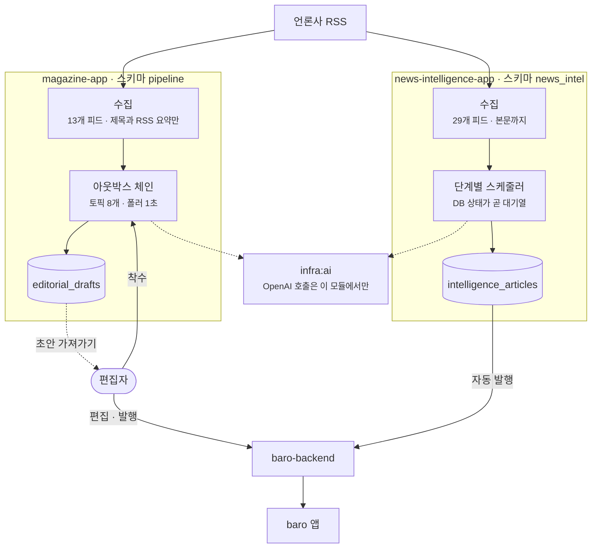
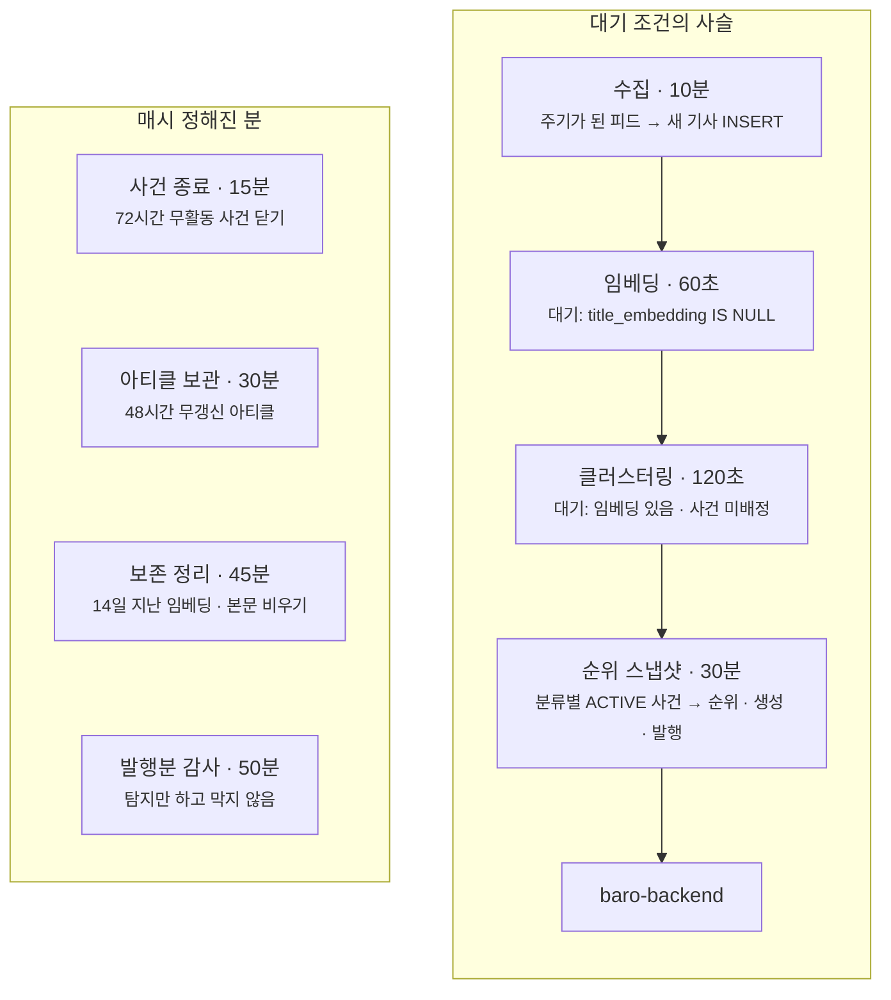
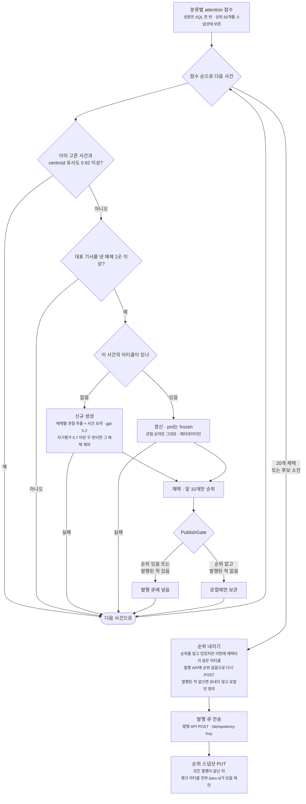
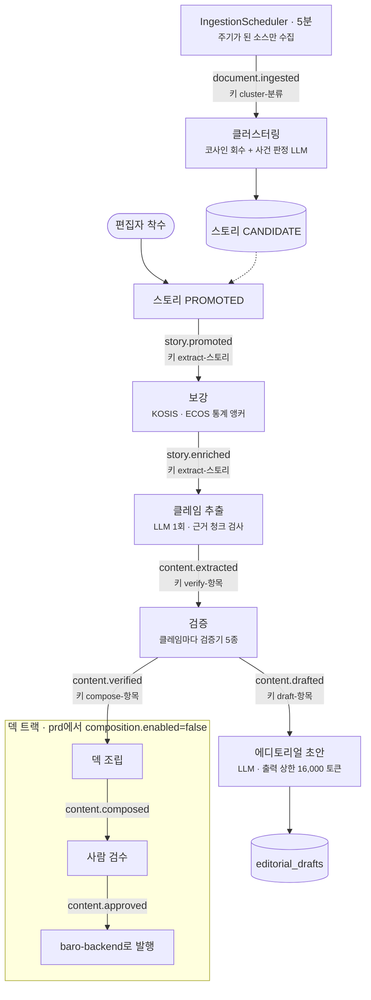
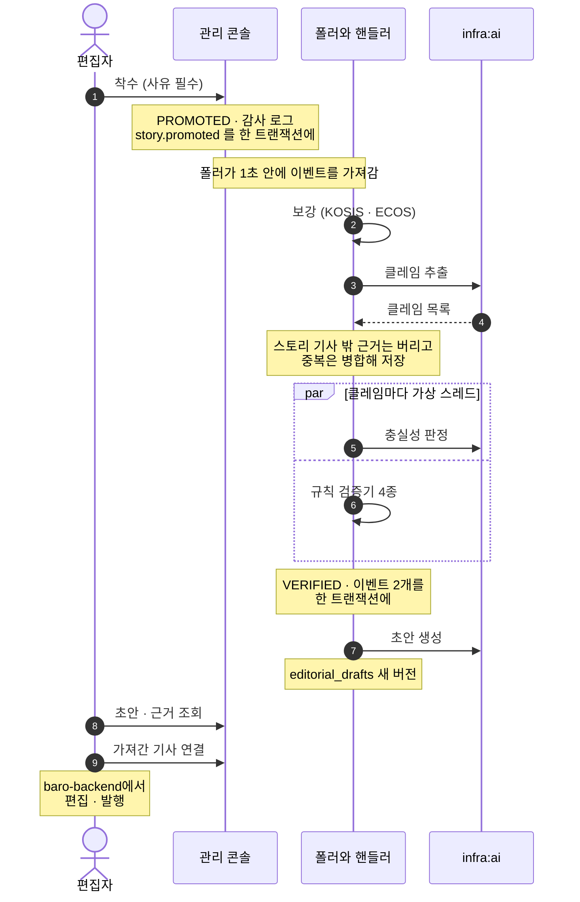
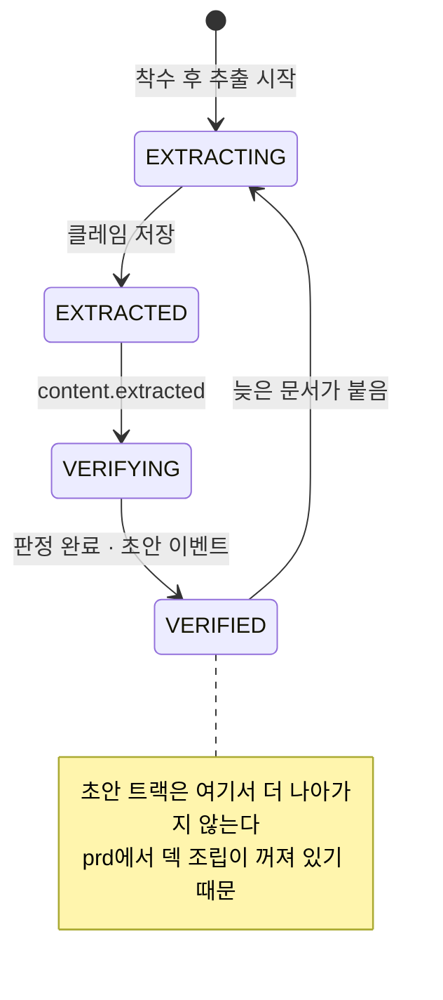

baro의 뉴스 파이프라인 레포(`magazine-pipeline`)에는 Spring Boot 앱이 두 개 있습니다.
둘 다 언론사 RSS를 모으고, 기사를 임베딩해 같은 사건끼리 묶고, OpenAI로 문장을 만들고, 결과를 서비스 백엔드(baro-backend)의 API로 넘깁니다.
여기까지는 같지만 만드는 것과 사람이 끼는 자리가 달라서, 단계를 잇는 방식도 다르게 골랐습니다.

- 뉴스 인텔리전스 앱은 사람 없이 30분마다 사건 순위를 매기고, 상위 사건마다 매체별 관점을 나란히 놓은 아티클을 발행합니다. 단계는 스케줄러마다 DB 상태로 자기 할 일을 찾는 방식으로 잇습니다.
- 매거진 앱은 편집자가 고른 주제만 클레임 원장(검증할 수 있는 주장의 목록)과 검증을 거쳐 장문 에디토리얼 초안으로 만듭니다. 발행은 사람이 합니다. 단계는 아웃박스 테이블로 잇습니다.

이 글은 뉴스 파이프라인 시리즈의 첫 글로, 두 앱의 흐름을 처음부터 끝까지 정리합니다. 이어지는 글은 뉴스 인텔리전스 앱 네 편, 매거진 앱 두 편이고, 단계 하나를 깊게 다룬 글은 해당 자리에도 링크했습니다.

## 두 앱을 한 장에



| | 뉴스 인텔리전스 앱 | 매거진 앱 |
| --- | --- | --- |
| 만드는 것 | 사건별 매체 관점 아티클과 분류별 순위 | 장문 에디토리얼 초안. 발행은 사람이 baro-backend에서 |
| 사람이 하는 일 | 없음 | 주제 착수, 초안 편집과 발행 |
| 수집 | RSS 29개(정치 9·사회 9·경제 11). 기사 페이지에서 본문까지 | RSS 13개(정치 5·사회 5·경제 3). 제목과 RSS 요약만 저장 |
| 단계 연결 | 단계마다 `@Scheduled`가 각자 DB를 조회 | 아웃박스 테이블과 1초 폴러 |
| 문장의 근거 | 매체별 원문. 방어는 모델의 자기평가 점수와 출처 병치 | 검증을 거친 클레임 원장 |
| 실패 처리 | 다음 주기에 다시 잡힘. 상한 없음 | 재시도 4회 뒤 DEAD |

두 앱이 함께 지키는 규칙은 세 가지입니다.

- OpenAI 호출은 `infra:ai` 모듈에만 있습니다. 앱은 인터페이스로만 부르고, 모든 chat 호출은 `OpenAiChatCompletions` 한 곳을 지나며 호출마다 로그를 한 줄 남깁니다. 이 계측은 [LLM 비용 감사 글](/blog/llm-cost-body-extractor/)에서 다뤘습니다.
- 결과는 baro-backend의 발행 API로만 넘기고 서비스 DB는 읽지도 쓰지도 않습니다. 두 앱도 서로의 스키마를 읽지 않습니다.
- 둘 다 Mac mini에서 launchd로 띄운 JVM이고 Postgres만 컨테이너입니다. 앱은 127.0.0.1에만 바인딩되며(`RuntimeConfigurationGuard`가 다른 주소면 기동을 거절합니다), 인증이 없는 관리 콘솔은 tailnet 안에서만 열리는 프록시로 엽니다.

## 뉴스 인텔리전스 앱: 사람 없이 30분마다 발행한다

### 스케줄러마다 각자 할 일을 찾는다

이 앱에는 단계를 호출하는 쪽이 없습니다. 스케줄러마다 자기가 처리할 행을 DB 조건으로 찾습니다.
끝난 행은 조건에서 빠지고, 도중에 죽은 행은 결과가 저장되지 않았으니 다음 주기에 다시 잡힙니다.



스케줄러 스레드는 4개입니다. 오래 걸리는 아티클 생성이 돌고 있으면 주기가 짧은 임베딩·클러스터링이 그 뒤에 줄을 서는데, 설계상 정상 동작입니다.
같은 단계가 겹쳐 돌지 않는다는 보장은 `fixedDelay`와 인스턴스 1대에서 나옵니다. 대기 조건을 조회하는 방식과 그 대가(보존 정리가 비운 임베딩을 다시 채우던 반복 등)는 [상태 큐 글](/blog/state-as-queue-without-outbox/)에서 다뤘습니다.

### 수집: 잡음은 본문을 열기 전에 거른다

`CrawlScheduler`는 10분마다 주기가 된 피드를 조건부 요청(ETag, Last-Modified)으로 받습니다.
링크를 정규화해 (매체, 정규화 URL 해시)로 중복을 보고, 이미 있으면 마지막으로 본 시각만 갱신합니다.
새 기사여도 정기 공지나 날씨 예보처럼 제목 규칙에 걸리면 본문을 열지 않고 `INACTIVE`로만 저장합니다. 이후 단계는 `ACTIVE`만 보므로 이런 기사는 LLM을 한 번도 타지 않습니다.
나머지는 기사 페이지를 받아 대표 이미지와 본문(최대 5,000자)을 뽑습니다. 이 본문 추출기가 관점 추출 비용을 어떻게 버리게 했는지는 [비용 감사 글](/blog/llm-cost-body-extractor/)에 있습니다.

### 사건 묶기

임베딩은 기사 제목만 합니다. 클러스터링은 같은 분류의 `ACTIVE` 사건 중 centroid(소속 기사 제목 임베딩의 평균)와의 코사인이 0.5 이상인 상위 5개를 후보로 뽑고, 후보 전부에 gpt-4o-mini로 같은 사건인지 동시에 묻습니다.
먼저 돌아온 "같다"에 붙이고, 모두 "다르다"면 새 사건을 만듭니다. 붙인 뒤에는 centroid를 다시 계산합니다.
이 판정기의 정확도를 라벨 155건으로 재 본 결과는 [발행 감사와 판정기 평가 글](/blog/publish-audit-and-judge-eval/)에 있습니다.

### 30분 회차: 점수, 채택, 생성, 게이트, 발행

`TrendSnapshotScheduler`가 분류마다 한 번씩 순위를 매기고, 같은 호출 안에서 아티클 생성과 발행까지 끝냅니다. 순위만 만들고 끝나는 경로는 없습니다.

```
attention = 0.35 × coverage + 0.25 × prominence
          + 0.25 × velocity + 0.15 × freshness
```

`coverage`는 최근 6시간 동안 이 사건을 다룬 매체 수, `velocity`는 이름과 달리 관점 다양성, `freshness`는 최신 기사의 경과 시간 구간입니다. `prominence`는 재지 않아 저장값은 NULL이고 합산에는 상수 0.5가 들어갑니다.



아티클은 발행 API(`POST /internal/intelligence-articles`)로, 순위 스냅샷은 `PUT /internal/intelligence-rank-snapshots/{분류}`로 보냅니다. 둘 다 공유 토큰과 멱등키 헤더를 붙입니다.
순위를 내리는 API는 따로 없습니다. 순위를 잃은 아티클도 발행 API에 아티클 전체를 다시 보내되 순위만 비워 보내고, baro-backend는 같은 아티클을 찾아 덮어쓰면서 순위를 지웁니다.

점수 순위와 실제 순위는 다릅니다. 이미 고른 사건과 거의 같은 사건(centroid 유사도 0.92 이상)과 대표 기사를 낸 매체가 1곳뿐인 사건을 건너뛰고, 생성에 실패한 사건도 빠지기 때문에, 점수 7위가 채택 3위가 될 수 있습니다. 앱에 보이는 순위는 채택 순번입니다.

한 회차에 분류마다 최대 20개를 채택하고(새로 만들거나 갱신), 그중 앞 10개에만 순위를 줍니다. 생산 상한과 순위 상한을 나눈 건, 순위가 바뀌는 회차에 바로 내보낼 아티클을 미리 만들어 두기 위해서입니다.
대신 만든 것을 바로 발행하던 때는 순위 밖 아티클이 앱 최신 목록 맨 위에 실렸습니다. 그래서 `PublishGate`가 만드는 것과 보여 주는 것을 나눕니다. 순위 밖이고 발행된 적 없는 아티클은 로컬에만 두고, 순위에 드는 회차에 처음 발행합니다.
처음 넣은 게이트는 순위를 잃은 발행분까지 막아서 서비스에 옛 순위가 남았고 앱 순위표에 같은 순위가 여러 건 생겼습니다. 그래서 순위를 잃은 발행분은 "순위 없음"을 반드시 보내도록 고쳤습니다.

신규 아티클은 매체마다 대표 기사 한 건으로 관점을 추출합니다. 자기평가 점수가 0.7 미만이면 한 번 더 부르고, 또 미달이면 그 매체의 카드는 만들지 않습니다. 카드가 한 장도 없거나 사건 요약이 실패하면 아티클을 만들지 않습니다.
갱신은 콘텐츠 전략에 맡기는데, prd는 `frozen`이라 처음 만든 관점과 요약을 그대로 두고 순위·출처·보도 수 같은 메타데이터만 바꿉니다. 갱신에서는 LLM을 부르지 않습니다.

순위 스냅샷은 모든 아티클 발행이 끝난 뒤에 보냅니다. 도중에 보내면 baro-backend가 이전 회차와 새 회차가 섞인 top 10을 보게 됩니다.
순위를 받은 아티클 중 하나라도 baro-backend id가 없으면 그 회차는 보내지 않습니다. 빼고 번호를 다시 매기면 다음 회차에 신규 진입으로 오인되어 속보 알림이 잘못 나갈 수 있기 때문입니다.

### 정리 작업

매시 정해진 분에 정리 작업이 돕니다. 15분에는 72시간 동안 활동이 없는 사건을 닫고, 30분에는 48시간 동안 갱신되지 않은 아티클을 보관 상태로 돌리고, 45분에는 14일 지난 기사의 임베딩과 본문을 비웁니다. 50분의 발행분 감사는 걸린 것을 로그로 셀 뿐 발행을 막지 않습니다.

## 매거진 앱: 사람이 고른 주제만 끝까지 간다

### 토픽 8개로 이어진 단계

단계와 단계 사이는 `outbox_events` 테이블의 행 하나입니다. 각 단계는 자기 상태를 바꾸는 트랜잭션 안에서 다음 단계의 이벤트를 함께 INSERT하고, 1초마다 도는 폴러가 이벤트를 가져가 다음 핸들러를 부릅니다.



| 토픽 | 핸들러가 부르는 것 | 하는 일 |
| --- | --- | --- |
| `document.ingested` | `PromotionService.process` | 문서를 스토리에 배정 |
| `story.promoted` | `StoryEnrichmentService.enrich` | 공식 통계 앵커를 붙임 |
| `story.enriched` | `ClaimExtractionService.extract` | 클레임 원장을 만듦 |
| `content.extracted` | `ClaimVerificationService.verify` | 클레임마다 판정 |
| `content.drafted` | `EditorialDraftService.draft` | 초안 생성 |
| `content.verified` | `CompositionService.compose` | 덱 조립 (prd에서는 스킵) |
| `content.composed` | `ReviewService.openReview` | 검수 큐 배정 |
| `content.approved` | `PublicationService.publish` | baro-backend로 발행 |

폴러는 한 번에 최대 100건을 `FOR UPDATE SKIP LOCKED`로 가져가 10분짜리 리스를 겁니다. 가져온 이벤트를 스토리 키별로 묶어 키마다 가상 스레드 하나에서 id 순서대로 처리하므로, 같은 키의 이벤트는 한 번에 하나씩 순서대로 처리됩니다.
실패하면 재시도하고, 다섯 번째로 실패하면 DEAD가 되어 관리 콘솔로 넘어갑니다. 대기 중(PENDING)인 이벤트가 500건을 넘으면 예약 수집을 잠시 멈춥니다.
이벤트를 가져가는 SQL과 순서 보장의 세부는 [아웃박스 글](/blog/outbox-without-kafka/)에 있습니다.

### 수집과 클러스터링: 착수 전에도 사건 판정은 돈다

`IngestionScheduler`는 5분마다 돌면서 소스별 주기(RSS는 600초)가 지난 소스만 수집합니다.
RSS 항목은 제목과 RSS 요약만 이어 붙여 저장하고, 기사 본문은 가져오지 않습니다.
원문 해시로 중복을 거르고, HTML을 정규화해 토큰 단위로 청크를 나누고, 청크마다 임베딩을 붙여 적재합니다. 적재와 `document.ingested` INSERT는 한 트랜잭션입니다.
편집자가 직접 넣는 자료(`POST /internal/v1/ingestion/editor-materials`)도 같은 경로를 탑니다.

클러스터링은 두 단계입니다. 같은 분류의 스토리 중 코사인 유사도 0.6 이상인 상위 5개를 후보로 뽑고, 유사도가 높은 순서대로 하나씩 LLM에 같은 사건인지 묻습니다.
처음으로 "같다"가 나온 스토리에 문서를 붙이고, 끝까지 없으면 새 스토리를 CANDIDATE로 만듭니다.
`document.ingested`의 스토리 키가 `cluster-분류`라서 같은 분류의 문서는 한 번에 하나씩 배정됩니다. 같은 새 사건의 문서 둘이 동시에 스토리를 하나씩 만드는 일을 이 키가 막습니다.

> 지금은 세 분류 모두 편집자가 착수해야만 스토리가 승격합니다. 기사가 아무리 많이 붙어도 자동으로 승격하지 않습니다.
> 그렇다고 LLM이 착수한 스토리에만 쓰이는 건 아닙니다. 착수가 필요한 건 클레임 추출부터이고, 사건 판정은 수집된 문서마다 돕니다. 판정 모델도 따로 고르지 않아 기본값인 gpt-5.2를 씁니다.
> 편집자가 착수하지 않는 동안에도 이 비용이 계속 나가서, 운영 중인 매거진 앱을 멈춰 두었습니다.

### 착수부터 초안까지



착수는 사유가 필수이고, 상태 전이와 감사 로그, 다음 이벤트가 한 트랜잭션에 묶입니다. PROMOTED는 되돌리지 않습니다. 늦게 붙은 문서 때문에 승격 재평가가 다시 돌아도 사람의 착수를 CANDIDATE로 덮어쓰지 않습니다.

클레임은 기사에서 뽑아낸 주장 한 문장으로, 사실인지 하나씩 따로 확인할 수 있는 단위입니다. 모델은 클레임을 뽑을 때 기사의 어느 부분을 근거로 삼았는지도 함께 돌려줍니다.
그 근거가 이 스토리에 묶인 기사에서 나온 것이 아니면 그 클레임은 버립니다. 모델이 원래 알고 있던 지식이 아니라 실제로 수집한 기사만 근거로 쓰기 위해서입니다.

검증은 클레임마다 가상 스레드로 동시에 돌고, 클레임 하나에 검증기 다섯 개를 모두 돌려 가장 나쁜 판정을 씁니다. 수치 검사, 단정 표현 검사, 인물 언급 표시는 규칙이고, 충실성은 LLM이 클레임 하나와 그 근거만 보고 판정하며, 공식 통계는 보강 단계에서 붙인 앵커와 대조합니다.
재시도로 다시 불리면 현재 검증기 버전으로 아직 판정하지 않은 클레임만 다시 봅니다.

검증이 끝나면 `content.verified`와 `content.drafted`를 함께 INSERT합니다. 두 이벤트는 스토리 키가 달라(`compose-`, `draft-`) 따로 흐르고 실패도 서로 독립입니다.
prd에서는 덱 조립이 꺼져 있어 `content.verified`는 소비만 되고 아무 일도 하지 않습니다.

초안 생성 앞에는 게이트가 넷 있습니다.

1. `magazine.draft.enabled`가 꺼져 있으면 스킵
2. 조립할 수 있는 클레임이 0건이면 스킵
3. 착수 기록이 없는 스토리면 스킵 (예전 자동 승격 스토리가 재검증으로 흘러들어도 막기 위함)
4. 이미 가져간 초안이 있으면 스킵

초안은 LLM이 쓴 뒤 마커를 링크·배지 블록으로 바꾸고, 통계 앵커는 차트 블록으로, 출처는 매체별 대표 기사 링크로 붙여 baro-backend의 에디토리얼 블록 스키마에 맞춥니다.
초안의 문장이 원장에 있는 클레임을 가리키는지도 검사하지만 게이트는 아니고, 어긋나면 메타데이터에 경고로만 남깁니다.
편집자는 관리 콘솔에서 초안과 근거(클레임별 판정과 출처 발췌)를 보고, baro-backend에 에디토리얼 기사를 만든 뒤 `POST /internal/v1/drafts/{id}/link`로 어느 초안을 가져갔는지 남깁니다. 발행은 baro-backend에서 합니다.

덱 트랙은 코드로 남아 있습니다. 검증된 원장으로 카드 덱을 조립하고, 사람이 검수하고, 멱등키를 붙여 baro-backend에 발행하는 경로입니다. 발행 단계는 [발행 재시도 글](/blog/publish-retry-idempotency/)에서 다뤘습니다.

### 늦게 도착한 문서

착수해서 추출까지 간 스토리에 나중에 수집된 문서가 붙으면, 조건이 맞을 때 체인을 처음부터 다시 돌립니다.

- 사람이 착수한 기록이 있고
- 콘텐츠 항목이 아직 사람이 보기 전 상태(`EXTRACTING`부터 `COMPOSED`·`GATE_FAILED`까지)이고
- 열려 있는 정정 요청이 없으면

항목 상태를 `EXTRACTING`으로 되돌리고 `story.promoted`를 다시 발행합니다. 추출과 검증이 늘어난 기사로 다시 돌고, 초안은 새 버전으로 쌓여 편집자가 전후를 비교할 수 있습니다.



초안 트랙에서 콘텐츠 항목은 `VERIFIED` 다음으로 가지 않습니다. 덱 조립이 꺼져 있어서입니다.
그래서 초안을 가져가 기사로 발행한 뒤에도 항목은 늘 "사람이 보기 전" 상태로 남습니다. 막는 곳은 초안 생성 직전의 네 번째 게이트뿐입니다.

가져간 스토리에 늦은 문서가 붙으면 어디까지 다시 도는지, prd와 같게 덱 조립을 끈 설정의 통합 테스트로 확인했습니다. 착수, 초안 생성, 가져가기 연결까지 마친 뒤 같은 내용의 문서를 하나 더 넣고 아웃박스를 비울 때까지 돌렸습니다.

| 늦은 문서 뒤 | 결과 |
| --- | --- |
| 새로 소비된 이벤트 | `story.promoted`, `story.enriched`, `content.extracted`, `content.verified`, `content.drafted` |
| 클레임 | id 1–6이 지워지고 7–12로 다시 저장됨 (다시 추출) |
| 검증 | 6건 다시 판정 |
| 초안 | "이미 가져간 초안 존재"로 스킵, 버전 1 그대로 |
| 항목 상태 | `VERIFIED` |

실 모델이었다면 늦은 문서 하나마다 클레임 추출 1회와 클레임 수만큼의 충실성 판정이 나가고, 그 결과는 쓰이지 않습니다. 이미 발행된 기사의 사건은 후속 보도가 계속 붙기 쉬우니 이 경로가 드문 경우도 아닙니다.
지금은 앱이 멈춰 있어 새로 나가는 비용은 없습니다.
가져간 초안이 있는 항목을 늦은 문서 재처리 대상에서 빼면, 초안 생성 한 곳이 아니라 체인 입구에서 막을 수 있습니다. 아직 고치지 않았습니다.

덱 조립을 켠 설정에서는 다른 문제가 나왔습니다.
검수 큐 배정이 있어 추출 단계가 재추출을 거절했는데, 늦은 문서 처리가 이미 항목 상태를 `EXTRACTING`으로 되돌린 뒤라 항목이 그 상태에 멈춰 있었습니다.
재처리를 트리거하는 쪽은 상태로, 거절하는 쪽은 검수 배정 여부로 판단해서 둘이 어긋납니다. 덱 트랙은 지금 꺼져 있습니다.

## 두 앱을 나란히 보면

이름이 같은 단계도 두 앱에서 모양이 다릅니다.

| | 뉴스 인텔리전스 앱 | 매거진 앱 |
| --- | --- | --- |
| 사건 판정 입력 | 사건 대표 제목과 기사 제목 | 스토리 대표 텍스트와 들어온 문서 (제목과 RSS 요약) |
| 회수 임계 · 후보 | 0.5 · 5개 | 0.6 · 5개 |
| 판정 방식 | 동시에 묻고 먼저 도착한 "같다" | 유사도 순으로 하나씩, 첫 "같다" |
| 판정 모델 | gpt-4o-mini | gpt-5.2 (기본값) |
| LLM 출력의 검증 | 요약과 같은 응답에서 모델이 매긴 자기평가 점수 | 클레임마다 별도 호출로, 그 클레임의 근거만 보여 주고 다시 판정. 초안 문장은 원장 인용 검사만 하고 막지는 않음 |
| 실패 | 다음 주기에 다시, 상한 없음 | 재시도 4회 뒤 DEAD, 관리 콘솔에서 재처리 |
| 발행 | 30분마다 자동 | 사람이 baro-backend에서 |

단계를 잇는 방식이 달라진 건 사람이 끼는 자리 때문입니다.

뉴스 인텔리전스 앱은 사람 없이 같은 일을 주기마다 반복합니다. 각 단계가 "아직 안 된 행"을 조건으로 찾을 수 있고, 한 번 놓친 행은 다음 주기에 다시 잡히면 됩니다.
이벤트 테이블 없이 행의 상태를 대기열로 쓰는 편이 단순했습니다.
대신 재시도 상한이 없어서, 계속 실패하는 행은 누가 알아채기 전까지 매 주기 다시 돕니다.

매거진 앱은 한 스토리가 착수, 보강, 추출, 검증, 초안을 순서대로 한 번씩 거쳐야 합니다. 같은 스토리의 보강과 추출이 동시에 돌면 안 되고, 사람이 착수한 일이 프로세스가 죽었다고 사라져도 안 됩니다.
그래서 상태 변경과 다음 할 일을 한 트랜잭션에 적는 아웃박스와, 스토리 단위로 순서를 지키며 이벤트를 가져가는 폴러를 골랐습니다.

## 정리

두 앱은 같은 재료에서 출발합니다. 언론사 RSS, 제목 임베딩, 코사인 회수와 LLM 사건 판정, `infra:ai`를 거치는 OpenAI 호출, baro-backend 발행 API입니다.

갈라지는 곳은 사람이 끼는 자리입니다. 뉴스 인텔리전스 앱은 사람이 없어서, 스케줄러마다 DB 상태로 할 일을 찾고 30분 회차 안에서 순위부터 발행까지 끝냅니다.
매거진 앱은 편집자의 착수로 시작해 편집자의 발행으로 끝나고, 그 사이를 스토리 단위로 순서를 지키는 아웃박스로 잇습니다.

지금 운영에서 도는 건 뉴스 인텔리전스 앱입니다. 매거진 앱은 착수 전에도 수집 문서마다 사건 판정 비용이 나가는 구조라 멈춰 두었습니다.
다시 켠다면 짚어 둘 것이 둘 있습니다. 하나는 가져간 초안의 스토리에 늦은 문서가 붙으면 추출과 검증이 다시 도는 경로이고, 다른 하나는 착수가 드문 동안에도 수집 문서마다 사건 판정을 부르는 비용입니다. 둘 다 아직 손대지 않았습니다.
