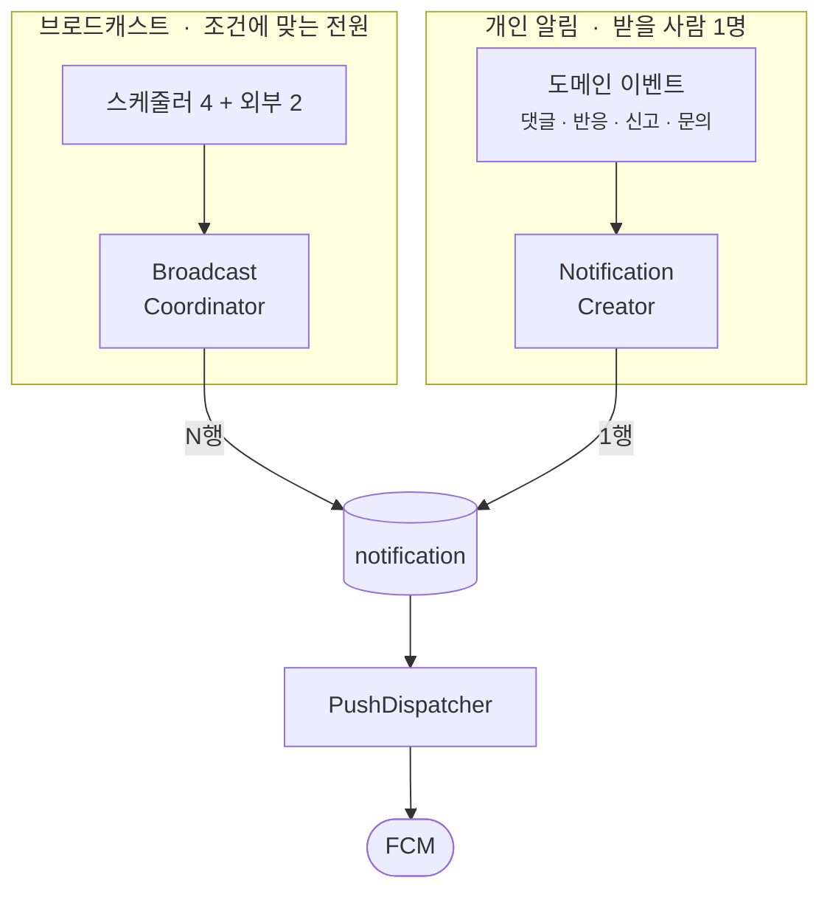
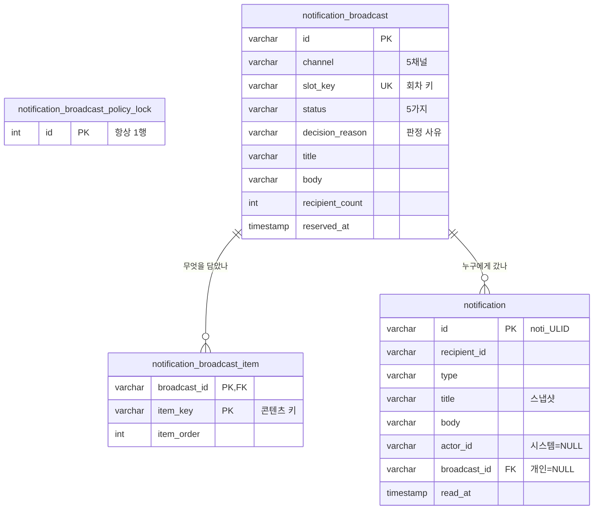
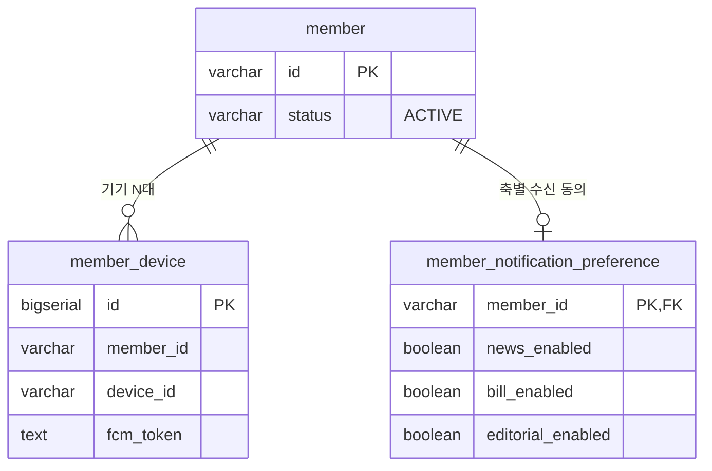
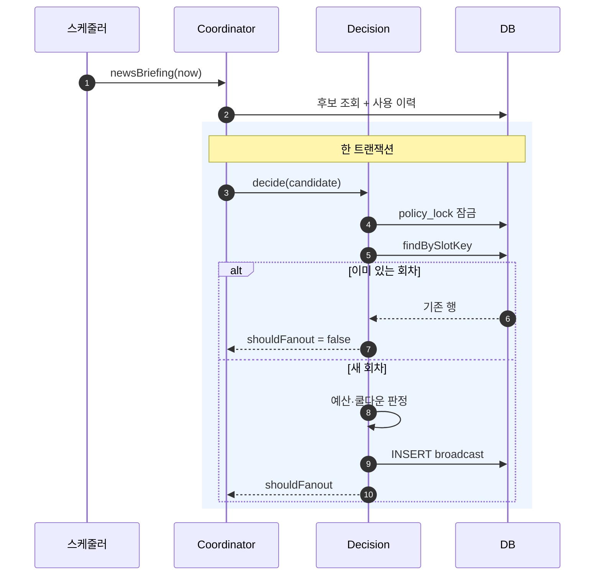
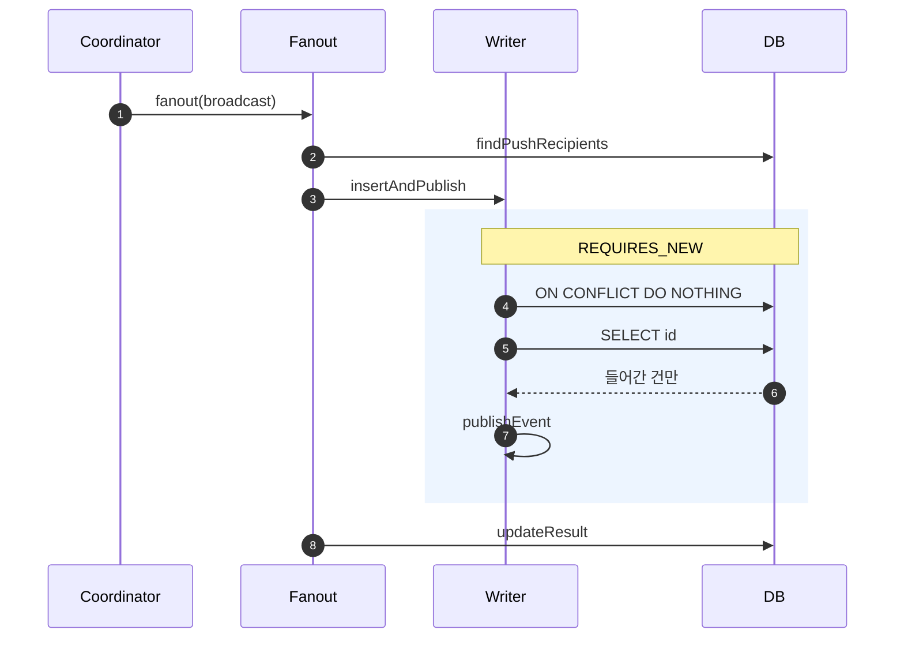
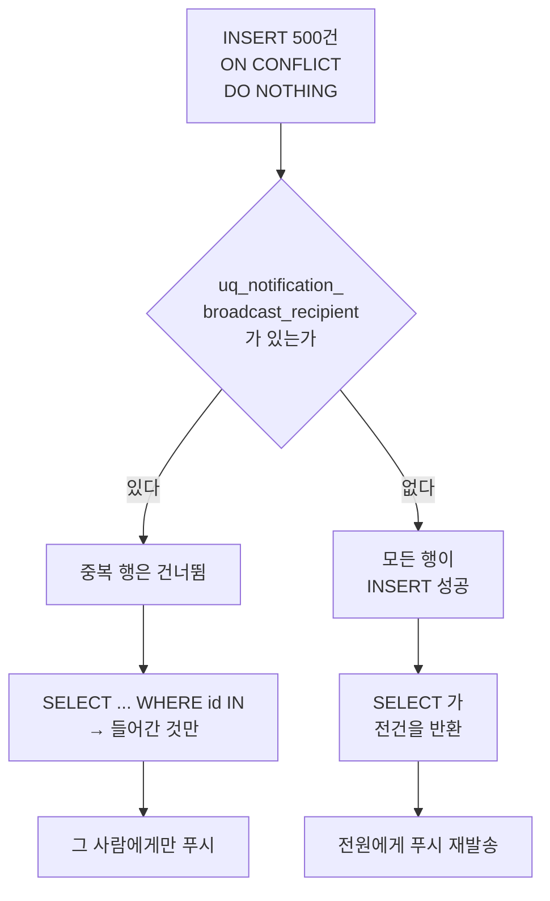
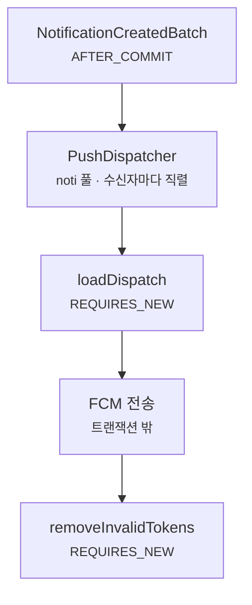

푸시 알림은 **회수할 수 없습니다.** 잘못 쓴 글은 고치면 되지만, 잘못 나간 푸시는 이미 사용자의 잠금화면에 떠 있습니다.

제가 만드는 서비스에는 브로드캐스트 알림 채널이 다섯 개 있습니다. 뉴스 브리핑, 속보, 새로 발의된 의안,
마감 임박 입법예고, 에디토리얼 발행. 여기에 "내 글에 댓글이 달렸다" 같은 개인 알림이 따로 붙습니다.

이 구조에서 **같은 알림이 두 번 나가는 것**을 막는 일이 이 글의 주제입니다.

## 중복이 비싼 이유

푸시 중복은 "좀 거슬리는 일"로 끝나지 않습니다. 수신 동의 스위치가 **채널 단위가 아니라 축 단위**이기 때문입니다.

```
news_enabled      → 뉴스 브리핑 + 속보
bill_enabled      → 새 의안 + 마감 임박 입법예고
editorial_enabled → 에디토리얼
```

채널은 다섯인데 스위치는 셋입니다. 중복에 질린 사용자가 스위치 하나를 내리면 **채널 두 개가 한꺼번에 죽습니다.**
그리고 한 번 끈 사람이 다시 켜 줄 거라고 기대할 수는 없습니다. 중복 한 번의 대가가 그 사용자에 대한 채널 전체입니다.

## 그런데 중복이 생기는 길이 하나가 아니었다

- 스케줄러가 정시에 도는데 **배포가 그 시각을 걸치면** 인스턴스가 잠시 둘이 됩니다
- 실패한 회차를 **재시도**하면 같은 회차가 다시 예약될 수 있습니다
- 외부 파이프라인이 **같은 스냅샷을 재전송**합니다
- 오전 브리핑에 나간 뉴스가 **오후 브리핑 후보에 또 오릅니다**
- 사용자가 좋아요를 **껐다 켜면** 알림 이벤트가 그때마다 새로 발생합니다

"멱등하게 만들면 된다"는 한 문장으로 끝날 문제처럼 보이지만, 실제로는 그렇지 않았습니다.
위 다섯 가지는 **중복을 세는 단위가 전부 다릅니다.** 어떤 건 회차 단위, 어떤 건 콘텐츠 단위,
어떤 건 수신자 단위이고, 마지막 하나는 애초에 기술 문제가 아니라 정책 문제입니다.

한 곳에 장치 하나를 두면 나머지는 그 장치를 그냥 지나갑니다. 그래서 장치가 넷이 되었고,
넷이 서로 다른 지점에 걸려 있습니다.

이 글은 **그 네 개가 각각 무엇을 막는지**, 그리고 **그중 하나는 왜 아직 한 번도 발화한 적이 없는지**를
스키마와 호출 흐름으로 따라갑니다.

## 알림이 두 갈래다

먼저 전체 구조입니다. 이 시스템의 알림은 성격이 다른 두 갈래로 갈라집니다.



**개인 알림**은 "누가 내 글에 반응했다"처럼 받을 사람이 한 명입니다.
**브로드캐스트**는 "오늘의 뉴스"처럼 조건에 맞는 회원 전원에게 갑니다.

두 갈래가 같은 `notification` 테이블로 모이고, 그 뒤 발송 경로는 하나입니다.
**중복을 어디서 끊느냐가 갈리는 지점이 바로 이 합류 전**입니다 — 합류한 뒤에는 무엇이 중복인지 알 수 없습니다.

## 테이블 넷과 그 관계

장치를 보기 전에 데이터 모양부터 봅니다.



읽을 점이 셋 있습니다.

**`notification_broadcast`는 발송 기록이 아니라 결정 원장입니다.** `status`에 `SKIPPED`가 있고
`decision_reason`이 따로 있습니다. 안 나간 회차도 행이 남습니다 —
"무엇이 후보였고 왜 안 나갔는지"를 DB만 보고 설명할 수 있어야 하기 때문입니다.

**`title`·`body`가 `notification`에 복사돼 있습니다.** 저장 시점 스냅샷입니다.
actor 닉네임이 바뀌거나 원본이 지워져도 알림함이 깨지지 않습니다.
대가는 템플릿을 고쳐도 과거 알림에는 소급되지 않는다는 것입니다.

**`notification_broadcast_policy_lock`은 컬럼이 `id` 하나뿐입니다.** 데이터를 담으려는 테이블이 아니라
잠글 대상이 필요해서 만든 테이블입니다. 뒤에서 다시 나옵니다.

그리고 수신자를 고르는 쪽에 두 테이블이 더 붙습니다.



앞에서 말한 "채널 5개, 스위치 3개"가 이 스키마입니다. 수신자 조회는 `member.status = 'ACTIVE'` 와
해당 축 컬럼을 함께 보며, `LEFT JOIN` + `COALESCE(..., TRUE)` 라 **설정 행이 없는 회원은 전부 수신 동의로 취급**합니다.

## 중복이 생기는 길 네 개

이제 본론입니다. 같은 알림이 두 번 갈 수 있는 길이 넷이고, 장치가 각각 다릅니다.

| | 경로 | 막는 장치 | 층위 |
| --- | --- | --- | --- |
| ① | 같은 회차를 두 번 예약 | `slot_key` UNIQUE | DB 제약 |
| ② | 같은 콘텐츠를 다른 회차에 재사용 | `notification_broadcast_item` + `findUsedItemKeys` | 조회 |
| ③ | 같은 회차가 같은 사람에게 두 번 | `uq_notification_broadcast_recipient` UNIQUE | DB 제약 |
| ④ | 개인 알림 반복 | `existsUnread` | 정책 |

하나씩 봅니다.

### ① `slot_key` — 회차에 이름을 붙인다

스케줄러가 중복 기동하거나, 재시도가 돌거나, 배포가 정시를 걸치면 같은 회차가 두 번 예약될 수 있습니다.
그래서 회차마다 **결정적인 이름**을 붙이고 그 컬럼에 UNIQUE를 겁니다.

```kotlin
slotKey = "NEWS_BRIEFING:${SLOT_FORMAT.format(now.atZone(KST))}"  // NEWS_BRIEFING:2026-09-22T08:00
slotKey = "BILL_RECENT:${now.atZone(KST).toLocalDate()}"          // 날짜 단위
slotKey = "EDITORIAL_PUBLISHED:$articleId"                        // 아티클 단위
slotKey = "NEWS_ALERT:$snapshotId"                                // 스냅샷 단위
```

정기 채널은 **시각**이, 이벤트 채널은 **원인이 된 리소스 id**가 키가 됩니다.
"같은 회차"의 정의가 채널마다 다르다는 뜻이고, 그 정의가 문자열 한 줄에 박혀 있습니다.

키 설계로 풀었기 때문에 **blue/green 배포가 정시를 걸쳐 두 인스턴스가 잠시 함께 떠 있어도 안전합니다.**
락이 없어도 UNIQUE가 뒤에서 받습니다.

<details>
<summary><strong><code>slot_key</code> 가 정확히 뭔지 한 번 더 — 병원 예약으로 비유하면</strong></summary>

`slot_key`는 **"이번 발송 기회"에 붙인 이름표**입니다. 중요한 건 그 이름을 **미리 계산할 수 있다**는 점입니다.

병원에 "9월 23일 14:00 진료"라는 칸이 있다고 해 봅시다. 이 칸은 하루에 하나뿐입니다.
예약 버튼을 실수로 두 번 눌러도 **`2026-09-23 14:00` 이라는 같은 이름의 칸**을 두 번 만들 수는 없습니다. 이미 있으니까요.

알림도 같습니다. "오늘 08시 뉴스 브리핑"은 하루에 한 번뿐인 칸이고, 그 칸의 이름이 `NEWS_BRIEFING:2026-09-23T08:00` 입니다.

**이름표가 없으면 이렇게 물어야 합니다.**

> "오늘 아침에 브리핑 보냈던가? 비슷한 시각에 나간 게 있나? 내용이 같나?"

시각이 3초 차이면 같은 회차인가요? 내용이 조금 다르면요? **답하기 애매합니다.**

**이름표가 있으면 질문이 이렇게 바뀝니다.**

> "`NEWS_BRIEFING:2026-09-23T08:00` 이 있나?"

문자열이 같냐 다르냐로 끝납니다. 사람이 판단할 게 없고, `UNIQUE` 제약이 대신 막아 줍니다.
스케줄러가 두 번 뜨든 재시도가 돌든 배포가 정시를 걸치든 **전부 같은 문자열을 만들어 냅니다.**
먼저 들어간 쪽이 이기고 나머지는 "이미 있네" 하고 돌아섭니다.

그래서 **조율이 필요 없습니다.** 두 인스턴스가 동시에 INSERT를 시도해도 UNIQUE가 하나를 튕겨냅니다.

**대신 치르는 값**이 있습니다. 지나간 칸은 되돌아가 채울 수 없습니다.
08:00 회차가 장애로 실패했다면 그 키는 이미 원장에 있어서, 다시 보내려 해도 같은 키가 튕겨냅니다.
정기 채널은 다음 슬롯이 곧 오니 괜찮지만 **하루 한 번인 의안 채널은 그날을 통째로 건너뜁니다.**
버그가 아니라 "장애 복구 후 알림이 한꺼번에 도착하는 것보다 그날 한 번 못 보내는 게 낫다"는 선택의 결과입니다.

</details>

### ② 아이템 원장 — 콘텐츠를 두 번 쓰지 않는다

회차는 다른데 내용이 같으면 사용자에겐 똑같이 중복입니다.
오전 브리핑에 나간 뉴스가 오후 브리핑에 또 나오는 경우입니다.

`notification_broadcast_item`이 "이 회차가 무엇을 담았는지"를 남기고, 다음 회차는 그걸 먼저 조회합니다.

```kotlin
val all = contentPort.findCurrentRankedNews(NEWS_CATEGORY)
val used = broadcastPort.findUsedItemKeys(
    channels = setOf(BroadcastChannel.NEWS_BRIEFING, BroadcastChannel.NEWS_ALERT),
    itemKeys = all.mapTo(mutableSetOf()) { it.key },
)
val items = all.filterNot { it.key in used }
```

`channels`가 집합인 게 요점입니다. 브리핑과 속보가 **서로의 사용 이력을 함께** 봅니다.
속보로 이미 나간 뉴스는 브리핑에서 빠집니다.

조회 쪽에 조건이 하나 더 있습니다.

```sql
WHERE b.channel IN :channels AND b.status <> 'SKIPPED' AND i.item_key IN :itemKeys
```

`SKIPPED` 회차의 아이템은 **소진으로 보지 않습니다.**
예산에 막혀 한 번 못 나간 콘텐츠가 영영 못 나가면 안 되기 때문입니다.

> 다만 이 장치는 5채널 중 3개(`NEWS_BRIEFING`·`NEWS_ALERT`·`BILL_RECENT`)에만 걸려 있습니다.
> 나머지 둘은 `slot_key`가 대신합니다 — 에디토리얼은 슬롯이 아티클 id라 아티클 하나당 한 번이고,
> 입법예고 마감은 날짜 슬롯이라 그날 한 번입니다. **아이템 검사가 필요한 건 "후보가 여럿이고
> 회차마다 골라 담는" 채널뿐입니다.**

### ③ 수신자 UNIQUE — 뒤에서 다시 봅니다

`(broadcast_id, recipient_id)`에 걸린 UNIQUE입니다. 이게 이 글에서 제일 할 말이 많은 장치라
뒤에 따로 절을 뒀습니다.

### ④ `existsUnread` — 기술이 아니라 정책

개인 알림 쪽입니다. 좋아요를 껐다 켜면 이벤트가 매번 발생합니다.
DB 제약으로는 막을 수 없습니다 — 실제로 매번 **다른 사건**이기 때문입니다.

```kotlin
if (command.type.isTogglable() &&
    notificationPort.existsUnread(command.recipientId, command.type, command.actorId, command.target)) {
    return   // 아직 안 읽은 같은 알림이 있으면 새로 만들지 않는다
}

private fun NotificationType.isTogglable(): Boolean =
    this == NotificationType.POST_REACTED || this == NotificationType.COMMENT_REACTED
```

"아직 안 읽었으면 또 알리지 않는다"는 **제품 판단**이지 정합성 장치가 아닙니다.
그래서 적용 대상도 좋아요 계열 둘로 좁혀 두었습니다. 댓글은 껐다 켤 수 없으니 해당이 없습니다.

읽은 뒤에 다시 반응이 오면 알림이 또 갑니다. 그게 의도입니다.

## 호출 흐름 — 예약에서 발송까지

이제 코드가 실제로 어떻게 흐르는지 봅니다.



<small>`스케줄러` = `NotificationBroadcastScheduler`, `Coordinator` = `BroadcastCoordinator`,
`DecisionService` = `BroadcastDecisionService`.</small>

여기까지가 락 안입니다. 예약이 커밋되면 팬아웃은 **트랜잭션 밖에서** 이어집니다.



<small>`Fanout` = `BroadcastRecipientFanout`, `BatchWriter` = `BroadcastNotificationBatchWriter`.</small>

트랜잭션 경계가 어디 있는지가 핵심입니다.

**판정만 한 트랜잭션에 있습니다.** 락을 잡고, 슬롯을 확인하고, 예산을 세고, 행을 하나 넣고, 끝냅니다.
팬아웃은 그 밖입니다. 락을 쥔 채 전 회원에게 INSERT를 돌렸다면
**그동안 모든 채널의 예약이 멈춥니다.**

### 왜 테이블 하나를 잠그나

예약 판정은 "읽고 → 판단하고 → 쓰는" 모양입니다.

```kotlin
@Transactional
fun decide(candidate: BroadcastCandidate, now: Instant): BroadcastDecision {
    broadcastPort.lockPolicy()                      // ← 전역 뮤텍스
    broadcastPort.findBySlotKey(candidate.slotKey)?.let {
        return BroadcastDecision(it, shouldFanout = false)
    }
    val reason = if (candidate.items.isEmpty()) candidate.emptyReason
                 else rejectionReason(candidate.channel, now)
    // ... INSERT
}
```

`lockPolicy()`의 정체는 이겁니다.

```sql
SELECT * FROM notification_broadcast_policy_lock WHERE id = 1 FOR UPDATE
```

**왜 채널별이 아니라 전역인가**가 이 결정의 전부입니다.
예산 규칙에 **채널을 가로지르는 합산 상한**이 있기 때문입니다.

| 단계 | 규칙 |
| --- | --- |
| 1 | 알럿 시간대 08–22 (속보만) |
| 2 | 채널 일일 한도 — 브리핑 4 · 속보 2 · 의안 1 |
| 3 | **이벤트 채널 합산** — 일 3 / 주 12 (속보 + 에디토리얼) |
| 4 | 속보 쿨다운 3시간 |

3번 때문에 속보와 에디토리얼이 **같은 카운터를 공유**합니다.
채널별로 잠그면 둘이 동시에 "아직 2건이니 괜찮다"고 판정할 수 있습니다.

> 락의 범위는 성능이 아니라 **판정이 읽는 데이터의 범위**가 정합니다.
> 병목이 되면 나눌 곳은 락이 아니라 정책입니다.

그리고 예산 쿼리에는 조건이 한 줄 더 있습니다 — `status <> 'SKIPPED'`.
`FAILED`도 예산을 **소비합니다.** 보상 발송을 허용하면 장애가 곧 알림 폭탄이 되기 때문입니다.
앞서 나온 "아이템은 소진으로 안 본다"와 **방향이 정반대**인데, 대상이 다릅니다:
예산은 회차를 세고, 아이템은 콘텐츠를 셉니다.

## ③번 장치 — 한 번도 발화한 적이 없다

이제 미뤄 둔 장치입니다.

```sql
ALTER TABLE notification
    ADD CONSTRAINT uq_notification_broadcast_recipient UNIQUE (broadcast_id, recipient_id);
```

이게 상정한 사고는 "팬아웃이 다시 돌아 같은 회차의 알림이 같은 사람에게 두 번 들어가는 것"입니다.

**그런데 그 경로가 코드에 없습니다.**

`decide()`가 `findBySlotKey`로 먼저 튕겨 `shouldFanout = false`를 돌려주므로 팬아웃은 회차당 한 번만 돕니다.
한 팬아웃 안에서 같은 사람이 두 번 나오지도 않습니다 — 수신자 조회가 회원 기준으로 묶여 있습니다.

```kotlin
return rows.groupByTo(linkedMapOf(), { it.first }, { it.second })
    .map { (recipientId, targets) -> BroadcastPushRecipient(recipientId, targets) }
```

기기가 2대면 `targets`가 2개인 것이지 행이 2개가 되지 않습니다.

그러면 지워도 되는 제약일까요. **아닙니다.**

### 지우면 푸시가 중복된다

적재 코드를 보면 이유가 나옵니다.

```kotlin
// BroadcastNotificationBatchWriter
val inserted = notificationPort.saveBroadcastsIfAbsent(notifications)
if (inserted.isNotEmpty()) {
    eventPublisher.publishEvent(NotificationCreatedBatch(/* inserted 만 */))
}
```

`inserted`가 무엇인지가 전부입니다.

```kotlin
// NotificationPersistenceAdapter
jdbc.update("""
    INSERT INTO notification (id, recipient_id, ..., broadcast_id, ...)
    VALUES (...500건...)
    ON CONFLICT DO NOTHING
""", parameters)

return jdbc.query(
    "SELECT id, recipient_id FROM notification WHERE id IN (:ids)",
    MapSqlParameterSource("ids", notifications.map { it.id }),
) { rows, _ -> rows.getString("id") to rows.getString("recipient_id") }
```

알림 id는 호출할 때마다 새로 뽑는 ULID입니다.
`ON CONFLICT`로 건너뛴 행은 **그 id로 DB에 존재한 적이 없으므로** 두 번째 쿼리에 안 잡히고,
따라서 푸시 이벤트에서도 빠집니다.

**그 `ON CONFLICT`가 걸릴 충돌 대상이 바로 ③번 제약입니다.**



제약을 지우면 재삽입이 전부 성공하고, `inserted`가 항상 전건을 돌려주고,
**수신자 단위 억제가 통째로 무력화됩니다.**

즉 ③은 **죽은 제약이 아니라 무발화 중인 현역 부품**입니다.
걸리는 행을 만드는 경로가 아직 없을 뿐, 없으면 코드의 의미가 달라집니다.

동시에 이런 말도 못 합니다 — "③ 덕분에 안전합니다."
한 번도 발화한 적이 없는 것을 안전의 **근거**로 쓰면 틀립니다.
쓸모를 인정하는 것과 근거로 삼는 것은 다른 일입니다.

## 알림함은 막히는데 푸시가 안 막히는 문제

②·③이 없던 세계를 상상해 보면 이 설계의 이유가 선명해집니다.

UNIQUE만 걸어 두면 **알림함은 막힙니다.** 재실행해도 행이 안 늘어나니까요.
그런데 **푸시는 안 막힙니다.** 저장이 튕긴 것과 무관하게 이벤트를 발행하면
FCM 호출은 그대로 나가고, 사용자 화면에는 같은 푸시가 또 뜹니다.

그래서 **저장 결과와 발송 억제를 같은 자리에서 끊습니다.**
"몇 건 넣었나"가 아니라 "누가 들어갔나"를 돌려주는 이유도 여기 있습니다 —
건수만 알면 어느 수신자를 빼야 할지 모릅니다.

발송 쪽은 이렇게 이어집니다.



DB 구간이 짧은 트랜잭션 **둘**로 쪼개져 있고 그 사이의 FCM 왕복은 트랜잭션 밖입니다.
푸시 스레드가 FCM 지연 동안 커넥션까지 쥐고 있으면
운영 풀(10)을 빠르게 소진해 **비즈니스 API가 커넥션 타임아웃으로 실패**하기 때문입니다.

> 이 구조에는 알려진 한계가 있습니다. 배치 이벤트 하나가 수신자 수만큼 FCM 왕복을 **직렬로** 돌고,
> 배지 카운트(`countUnread`)가 **수신자당 1쿼리 + `REQUIRES_NEW` 1건**씩 그대로 붙습니다.
> 발송 시간이 수신자 수에 선형인데 아직 재보지 않았습니다.

## 정리 — 네 장치가 갈라 선 기준

| 장치 | 막는 것 | 성격 |
| --- | --- | --- |
| `slot_key` UNIQUE | 회차 중복 | 키 설계. 락 없이 성립 |
| 아이템 원장 | 콘텐츠 재사용 | 조회. 3채널에만 적용 |
| 수신자 UNIQUE | 회차 × 사람 중복 | `ON CONFLICT`의 충돌 대상 |
| `existsUnread` | 개인 알림 반복 | 제품 정책. 좋아요 계열만 |

한 줄로 줄이면 이렇습니다 — **정합성은 락이 아니라 키 설계와 상태값이 지킵니다.**
락은 "판정의 원자성"이라는 좁은 일만 맡고, 그래서 락 구간을 판정 + 1행 INSERT로 끝낼 수 있었습니다.

그리고 각 장치마다 **막지 못하는 것**이 있습니다.
`slot_key`는 지나간 슬롯을 되돌아가 채우지 못하고(하루 1회인 의안 채널은 그날을 통째로 건너뜁니다),
아이템 원장은 적용 안 된 2채널을 모르고,
③은 아직 아무 행도 걸러 본 적이 없고,
`existsUnread`는 읽은 뒤의 반복을 막지 않습니다.

**"다 막습니다"가 이런 질문에 대한 최악의 답입니다.**
장치마다 겨냥한 사건이 다르니, 못 막는 것도 장치마다 달라야 정상입니다.
