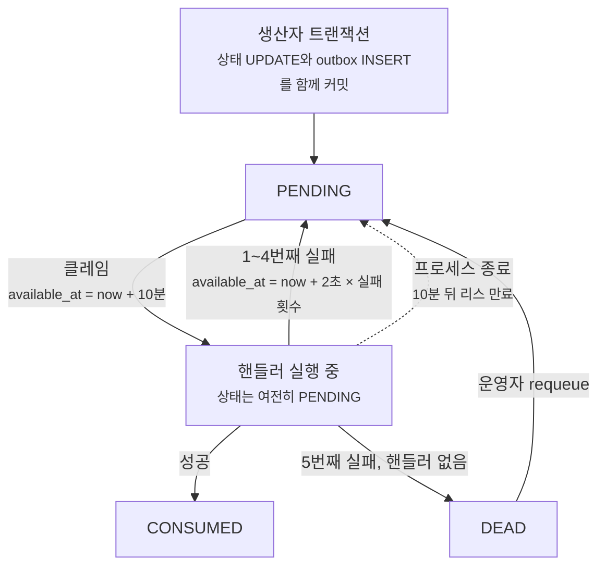

baro에는 뉴스 기사를 모아 사실 검증을 거친 기사 초안으로 만드는 파이프라인이 있습니다.
RSS와 에디터가 넣은 자료를 수집하고, 같은 사건을 다룬 기사끼리 묶고, 공공 통계를 근거로 붙이고,
기사에서 주장(클레임)을 뽑아 하나씩 출처와 대조한 뒤 초안을 씁니다.

이 중 여러 단계가 LLM을 부릅니다. 같은 사건인지 판정할 때는 후보마다 한 번, 클레임 추출에 한 번,
검증에는 클레임마다 한 번, 초안 작성에 한 번입니다. 실측이 있는 건 사건 판정뿐인데 한 번에 평균 2.3초였고(8건),
후보가 최대 5건이라 문서 하나를 판정하는 데만 10초 넘게 걸릴 수 있습니다(환산). 추출·검증·초안의 소요 시간은 따로 재지 않았지만,
긴 자료를 한꺼번에 읽거나 긴 글을 쓰는 호출들입니다.

그래서 단계들을 한 요청 안에서 동기로 이을 수는 없었습니다. 레이어 규칙도 서비스끼리 직접 부르지 못하게 막고 있었습니다.
단계 사이에 이벤트를 두어야 했고, 그 이벤트가 지켜야 할 조건은 네 가지였습니다.

1. 상태 변경과 다음 단계의 트리거는 함께 커밋되거나 함께 사라져야 합니다. 상태만 바뀌고 이벤트가 빠지면 그 스토리는 소리 없이 멈춥니다.
2. 같은 스토리의 이벤트는 순서대로 처리돼야 합니다. 통계를 붙이는 작업과 클레임 추출이 동시에 돌면 추출이 통계가 붙기 전의 자료를 읽습니다.
3. 프로세스가 죽어도 처리하던 이벤트가 사라지면 안 됩니다.
4. 재시도로도 풀리지 않는 이벤트는 누군가 알아차려야 합니다.

결과물은 `outbox_events` 테이블 하나와 1초 간격으로 도는 폴러입니다. 메시지 브로커는 쓰지 않았습니다.
이 글은 그 구조를 설명하고, 글을 쓰면서 다시 확인해 보니 설명과 달랐던 부분을 함께 정리한 것입니다.

근거는 두 곳에서 가져왔습니다. 코드와 Spring Boot·logback 소스, 로컬 PostgreSQL 16에서 돌린 재현(2026-09-24)은 이번에 직접 확인했습니다.
DEAD 건수 같은 운영 관측치는 당시 커밋과 문서에 남긴 기록을 옮긴 것입니다.
이 앱은 2026-09-17부터 운영 판단으로 멈춰 둔 상태라 운영 환경에서 다시 재지는 못했습니다.

## 단계와 토픽

이벤트는 토픽 여덟 개로 흐릅니다.

| 토픽 | 발행하는 곳 | 소비하는 단계 | `story_key` |
| --- | --- | --- | --- |
| `document.ingested` | 예약 수집, 에디터 자료 제출 | 클러스터링·승격 (LLM 사건 판정) | `cluster-{pillar}` |
| `story.promoted` | 승격 전이, 사람의 착수 결정, 늦게 도착한 문서 | 통계 앵커 부착 | `extract-{storyId}` |
| `story.enriched` | 통계 앵커 부착 | 클레임 추출 (LLM) | `extract-{storyId}` |
| `content.extracted` | 클레임 추출 | 병렬 검증 (LLM, 클레임마다) | `verify-{contentItemId}` |
| `content.drafted` | 검증 완료 | 에디토리얼 초안 (LLM) | `draft-{contentItemId}` |
| `content.verified` | 검증 완료, 검수 중 수선 | 덱 조립 (운영에서는 꺼 둠) | `compose-{contentItemId}` |
| `content.composed` | 덱 조립 | 검수 배정 | `review-{contentItemId}` |
| `content.approved` | 검수 서명 | 발행 | `publish-{contentItemId}` |

`story_key`는 이름과 달리 스토리마다 하나씩 있는 값이 아닙니다. 같은 키를 가진 이벤트는 한 번에 하나씩 id 순서대로 처리된다는 뜻이고,
그래서 동시에 돌면 안 되는 것끼리 같은 키를 씁니다.

- `story.promoted`와 `story.enriched`는 둘 다 `extract-{storyId}`입니다. 늦게 도착한 문서 때문에 `story.promoted`가 다시 발행되면,
  앞서 나간 `story.enriched`의 추출이 끝난 다음에야 통계 부착이 다시 돕니다.
- 문서 수집은 pillar(경제·정치·사회)마다 키가 하나입니다. 코드 주석에는 "pillar별 직렬 처리"라고만 적혀 있습니다.
  제가 읽은 이유는 이렇습니다. 클러스터링은 가까운 스토리를 찾아보고 없으면 새로 만드는 방식이라, 같은 사건의 문서 두 건이 동시에 돌면 스토리가 두 개 생길 수 있습니다.
- 검증이 끝나면 `content.verified`와 `content.drafted`를 한 트랜잭션에서 함께 발행합니다. 키가 서로 달라서(`compose-`, `draft-`) 두 트랙은 병렬로 흐르고 실패도 따로 납니다.

## 브로커나 프레임워크를 쓰지 않은 이유

설계 문서에 비교가 남아 있는 대상은 Spring Modulith의 Event Publication Registry와 Spring Batch입니다.
문서에 적은 기각 이유는 이렇습니다.

- Modulith 레지스트리는 N번 실패한 이벤트를 DEAD로 빼는 처리와 키 단위 직렬 처리를 기본으로 제공하지 않는다. 둘 다 이 파이프라인에 필요했다.
- Spring Batch의 Job과 Step은 경계가 정해진 데이터를 정해진 실행 창 안에서 청크 단위로 처리하는 모델이다. 스토리가 제각각 도착해서 각자 다른 시점에 단계를 지나가는 흐름과 맞지 않는다.

Kafka 같은 브로커는 비교 기록이 없습니다. 지금 다시 정리하면 이유는 두 가지입니다.

첫째, 브로커를 붙여도 1번 조건은 풀리지 않습니다. DB 상태 변경과 브로커 발행은 서로 다른 시스템에 쓰는 일이라,
둘을 원자적으로 묶으려면 결국 아웃박스 테이블에 먼저 쓰고 릴레이나 CDC로 옮겨야 합니다.
아웃박스 테이블이 어차피 필요하다면 거기서 바로 소비하는 쪽이 운영할 부품이 하나 적습니다.

둘째, 규모입니다. 앱은 Mac mini 한 대에서 인스턴스 하나로 돕니다. 로컬에서 며칠 돌린 DB를 2026-08-17에 쟀을 때
아웃박스에 쌓인 이벤트는 모두 2,352건(CONSUMED 2,332, DEAD 20)이었습니다.

## 원자성: 상태 변경과 같은 트랜잭션에서 INSERT

발행은 테이블에 행 하나를 넣는 일입니다.

```kotlin
@Component
class OutboxEventPublisher(
    private val repository: OutboxEventJpaRepository,
    private val objectMapper: ObjectMapper,
) {
    fun publish(topic: String, payload: Any, storyKey: String? = null): Long {
        val entity = OutboxEventEntity(
            topic = topic,
            payload = objectMapper.writeValueAsString(payload),
            storyKey = storyKey,
        )
        return requireNotNull(repository.save(entity).id) { "저장된 아웃박스 이벤트의 id 가 null 일 수 없다" }
    }
}
```

이 호출이 상태를 바꾸는 트랜잭션 안에 있으면 원자성은 DB가 보장합니다. 검증 단계의 마지막이 그런 모양입니다.

```kotlin
@Transactional
fun markVerified(contentItemId: Long) {
    contentItemDao.updateStatus(contentItemId, ContentItemStatus.VERIFIED)
    outboxEventPublisher.publish(
        topic = OutboxTopics.CONTENT_VERIFIED,
        payload = ContentVerifiedEvent(contentItemId),
        storyKey = "compose-$contentItemId",
    )
    outboxEventPublisher.publish(
        topic = OutboxTopics.CONTENT_DRAFTED,
        payload = ContentDraftedEvent(contentItemId),
        storyKey = "draft-$contentItemId",
    )
}
```

상태 UPDATE는 JdbcTemplate으로, 아웃박스 INSERT는 JPA로 나가지만 한 트랜잭션입니다.
`JpaTransactionManager`가 트랜잭션을 열면서 JDBC 커넥션을 스레드에 묶어 두고, JdbcTemplate도 그 커넥션을 가져다 쓰기 때문입니다.
커밋되면 VERIFIED 상태와 이벤트 두 건이 함께 생기고, 롤백되면 셋 다 없습니다. 상태는 바뀌었는데 이벤트가 없는 경우가 생길 수 없습니다.

다만 이건 호출하는 쪽이 트랜잭션 안에 있을 때의 이야기이고, `publish()`는 그걸 확인하지 않습니다.
트랜잭션 밖에서 부르면 `SimpleJpaRepository.save`가 자기 트랜잭션을 따로 열어 INSERT만 커밋하고, 에러도 경고도 나지 않습니다.
지금 발행 호출 10곳은 모두 `@Transactional` 메서드나 `TransactionTemplate` 안에 있는 것을 확인했지만, 코드가 강제하는 것은 아닙니다.
`publish()`에 `@Transactional(propagation = Propagation.MANDATORY)`를 붙이면 트랜잭션 밖에서 부르는 순간 예외가 납니다. 아직 붙이지 않았습니다.

## 소비: 트랜잭션 없이 문장 하나씩

소비 쪽은 반대로 트랜잭션을 길게 잡지 않습니다. 핸들러 실행과 "처리 완료" 표시를 한 트랜잭션으로 묶으면
DB 안의 결과만 놓고 볼 때 한 번 처리에 가까워지지만, 그러려면 LLM 응답을 기다리는 동안 DB 커넥션을 계속 쥐고 있어야 합니다.
이 앱의 운영 커넥션 풀은 5개입니다.

그래서 폴러의 DB 작업은 모두 JdbcTemplate의 autocommit 문장 하나씩입니다. 클레임에 한 문장, 결과 기록에 한 문장입니다.
핸들러는 LLM 호출을 트랜잭션 밖에서 끝내고, 결과를 저장할 때만 짧은 트랜잭션을 엽니다. 클러스터링 코드에 이 규칙이 주석으로 남아 있습니다.

```kotlin
// 외부 AI 판정은 DB 트랜잭션 밖에서 끝낸다. 이후 생성·연결·centroid 갱신·늦은 문서 처리는
// 한 트랜잭션으로 묶어 중간 장애가 orphan story나 낡은 centroid를 남기지 않게 한다.
val matchedStoryId = matchingStoryId(pillar, documentId)
```

트랜잭션이 없으니 가상 스레드로 나눠 돌려도 문제가 없습니다. 폴러는 클레임한 이벤트를 키별로 묶어 묶음마다 가상 스레드 하나에 맡기는데,
스레드끼리 공유하는 트랜잭션이 없고 문장마다 커넥션을 잠깐 빌렸다가 바로 돌려줍니다.

대신 처리는 한 번 이상(at-least-once)입니다. 핸들러가 결과를 커밋한 뒤 `markConsumed`가 커밋되기 전에 프로세스가 죽으면,
그 이벤트는 리스가 끝난 뒤 다시 처리됩니다. `markConsumed`가 예외를 던져도 마찬가지입니다.
이 호출이 핸들러와 같은 `try` 블록 안에 있어서, 핸들러는 성공했는데 실패로 집계되고 재시도로 돌아갑니다.
그래서 모든 핸들러는 같은 이벤트를 두 번 받아도 괜찮아야 합니다. 이 전제가 실제로 지켜지는지는 뒤에서 확인합니다.

## 클레임: SQL 한 문장에 넣은 세 가지

폴러는 이전 틱이 끝나고 1초 뒤마다 이 문장을 실행합니다(배치 100, 리스 10분).

```sql
WITH claimed AS (
    SELECT candidate.id
    FROM pipeline.outbox_events candidate
    WHERE candidate.status = 'PENDING'
      AND candidate.available_at <= now()
      AND (
          candidate.story_key IS NULL
          OR NOT EXISTS (
              SELECT 1
              FROM pipeline.outbox_events predecessor
              WHERE predecessor.status = 'PENDING'
                AND predecessor.story_key = candidate.story_key
                AND predecessor.id < candidate.id
          )
      )
    ORDER BY candidate.id
    FOR UPDATE OF candidate SKIP LOCKED
    LIMIT ?
)
UPDATE pipeline.outbox_events o
SET available_at = now() + make_interval(secs => ?),
    updated_at = now()
FROM claimed
WHERE o.id = claimed.id
RETURNING o.id, o.topic, o.payload::text AS payload, o.attempt, o.story_key
```

한 문장에 세 가지가 들어 있습니다.

첫째는 `FOR UPDATE ... SKIP LOCKED`입니다. 다른 폴러가 지금 잠근 행은 기다리지 않고 건너뜁니다. 폴러가 둘이어도 같은 행을 동시에 가져가지 않습니다.

둘째는 리스입니다. 문장이 autocommit이라 행 잠금은 문장이 끝나면 바로 풀립니다. 그 뒤에 중복 픽업을 막는 건 10분 뒤로 밀어 둔 `available_at`입니다.
다음 틱의 클레임은 `available_at <= now()` 조건에 걸려 이 행을 보지 못합니다. 처리 중에 프로세스가 죽으면 10분 뒤 이 조건이 다시 참이 되어 누군가 이어서 가져갑니다.
리스는 처음에 30초였고 2026-08-11(`fe9fafd`)에 10분으로 늘렸습니다. 클러스터링은 사건 후보를 최대 5건까지 차례로 LLM에 판정시키는데,
설정에 남긴 이유는 "후보 5건 × 외부 AI 최악 응답시간을 포함해도 다른 워커가 같은 이벤트를 재점유하지 않도록"입니다.
리스가 처리 시간보다 짧으면 다른 워커가 처리 중인 이벤트를 또 가져갑니다.

셋째는 순서입니다. `NOT EXISTS`는 같은 키에 id가 더 작은 PENDING 행이 남아 있으면 그 행을 후보에서 뺍니다.
여기서 중요한 건 이 조건이 `available_at`이 아니라 `status`를 본다는 점입니다. 이 테이블에서 이벤트는 처리되는 동안에도, 재시도를 기다리는 동안에도 PENDING입니다.
앞 이벤트가 CONSUMED나 DEAD가 되기 전까지 뒤 이벤트는 누구도 가져가지 못합니다.



`available_at`과 `story_key`에 걸린 인덱스는 둘 다 `WHERE status = 'PENDING'` 부분 인덱스라서, CONSUMED가 쌓여도 인덱스 크기는 PENDING 건수만큼입니다.

### 처음엔 순서 조건이 없었다

2026-07-20 첫 구현의 클레임에는 `NOT EXISTS`가 없었습니다. 순서는 폴러가 맡았습니다.
한 번에 클레임한 이벤트를 키별로 묶고, 묶음 안에서 id 순서대로 차례로 처리했습니다.

이 방식은 한 틱 안에서만 순서를 지킵니다. 같은 키의 e1과 e2가 있을 때 e1이 실패하면 `available_at`이 2초 뒤로 밀립니다.
다음 틱에는 e1이 조건에 걸리지 않으니 e2만 클레임되고, e2가 e1보다 먼저 처리됩니다. 폴러가 둘이면 한 틱 안에서도 순서가 깨집니다.

2026-08-11 커밋에서 순서 조건을 SQL로 옮겼고, 그때 추가한 테스트가 이 상황을 고정합니다.

```kotlin
@Test
fun `선행 이벤트가 백오프 중이면 같은 키 후속은 막고 다른 키는 처리한다`() {
    val first = publisher.publish("test.first", mapOf("n" to 1), storyKey = "story-1")
    publisher.publish("test.second", mapOf("n" to 2), storyKey = "story-1")
    val independent = publisher.publish("test.other", mapOf("n" to 3), storyKey = "story-2")
    jdbcTemplate.update(
        "UPDATE pipeline.outbox_events SET available_at = now() + interval '1 hour' WHERE id = ?",
        first,
    )

    assertThat(claimDao.claim(10, Duration.ofMinutes(5)).map { it.id }).containsExactly(independent)
}
```

## 로컬 Postgres에서 다시 돌려 본 결과

글을 쓰면서 V1 마이그레이션과 위 클레임 문장을 그대로 PostgreSQL 16.14 컨테이너에 올리고 몇 가지 상황을 만들어 봤습니다.
클레임은 배치 100, 리스 600초로 불렀습니다.

| 실험 | 넣은 이벤트 | 클레임 결과 |
| --- | --- | --- |
| ① 한 번에 클레임 | `extract-7` 3건, `cluster-ECONOMY` 3건, `verify-3` 1건, 키 없음 2건 | id 1, 4, 7, 8, 9. 키마다 가장 이른 1건과 키 없는 2건 |
| ② 앞 이벤트가 재시도 대기 중 | `extract-7` 2건(1번은 4초 뒤로), `extract-8` 1건 | id 3만. `extract-7`의 2번은 막힘 |
| ③ 앞 이벤트가 DEAD | ②에서 1번을 DEAD로 | id 2 |
| ④ DEAD를 되살림 | ③ 뒤에 2번 CONSUMED, 1번 requeue | id 1. 뒤 이벤트가 끝난 다음에 앞 이벤트가 돈다 |
| ⑤ 두 폴러가 동시에 | A가 클레임 문장을 커밋하지 않은 채 id 1(k1)을 잡고 있을 때 B가 클레임 | B는 id 3(k2)과 5(k3). 잠긴 1은 건너뛰고, 2와 4는 앞 이벤트가 PENDING이라 제외 |

②와 ⑤는 설계대로입니다. 다른 폴러가 잡은 행은 건너뛰고, 같은 키의 뒤 이벤트는 앞 이벤트가 끝날 때까지 아무도 가져가지 않습니다.
그런데 ①, ③, ④에서는 코드 주석에 적혀 있지 않은 성질이 보였습니다.

### 한 번의 클레임에 같은 키는 한 건뿐이다

①에서 `extract-7` 세 건 중 한 건만 나왔습니다. 두 번째 건은 첫 번째가 PENDING이라 빠지고, 세 번째 건은 앞의 두 건이 PENDING이라 빠집니다.
같은 키의 이벤트가 한 문장에서 두 건 이상 나오는 일은 없습니다.

그러면 폴러에서 키별로 묶고 묶음 안을 id 순서로 정렬하는 코드는 실제로는 묶음마다 한 건씩만 받습니다.
순서 조건이 SQL로 옮겨 온 뒤로 이 코드는 방어용으로만 남아 있습니다.

```kotlin
val groups = claimed.groupBy { it.storyKey ?: "__event_${it.id}" }
groups.entries
    .map { (groupKey, events) ->
        groupKey to dispatcher.submit { events.sortedBy { it.id }.forEach { process(it, tally) } }
    }
    .forEach { (groupKey, future) ->
        runCatching { future.get() }
            .onFailure { log.error(it) { "event=outbox.group_failed storyKey=$groupKey size=${groups[groupKey]?.size}" } }
    }
```

더 신경 써야 할 건 처리량입니다. 같은 키의 다음 이벤트는 다음 틱에야 클레임되고, 다음 틱은 이번 틱의 모든 묶음이 끝나야 시작합니다.
`future.get()`으로 전부 기다리고, `@Scheduled(fixedDelay)`라서 틱이 겹치지 않기 때문입니다.
한 틱에 클레임 추출처럼 오래 걸리는 묶음이 섞여 있으면, 가벼운 이벤트만 가진 다른 키도 그만큼 다음 차례를 기다립니다.
게다가 Spring의 기본 스케줄러 스레드가 하나라서 예약 수집과 폴러가 이 스레드를 번갈아 씁니다.

정리하면, 키 하나에서는 한 번에 한 이벤트만 처리되고, 인스턴스가 하나일 때는 키마다 틱당 최대 한 건입니다.
틱의 길이는 그 틱에서 가장 느린 묶음이 정합니다. 문서 클러스터링은 pillar마다 키가 하나라서, 한 pillar의 문서는 틱마다 한 건씩 클러스터링됩니다.
수집량이 이 속도를 넘은 적이 있는지는 재지 않았습니다.

### DEAD는 키의 잠금을 푼다

③에서 앞 이벤트가 DEAD가 되자 뒤 이벤트가 바로 나왔습니다. 조건이 PENDING만 보니 당연한 결과이고, 필요한 동작이기도 합니다.
DEAD가 뒤를 계속 막는다면 문서 하나가 DEAD로 가는 순간 그 pillar의 클러스터링이 사람이 손댈 때까지 전부 멈춥니다.

대신 그 순간부터 그 키의 순서는 보장되지 않습니다. ④처럼 운영자가 DEAD를 되살리면, 이미 끝난 뒤 이벤트보다 id가 작은 앞 이벤트가 나중에 처리됩니다.
`extract-` 키라면 통계 부착이 추출보다 늦게 다시 돌고 `story.enriched`가 한 번 더 나갑니다.
추출은 사람이 검수를 시작한 항목이면 건너뛰지만, 그 전 단계라면 추출과 검증이 처음부터 다시 돌고 LLM 비용도 그만큼 다시 듭니다.

### id 순서는 커밋 순서가 아니다

재현을 하나 더 했습니다. 순서 조건은 id를 비교하는데, id는 INSERT할 때 정해지고 다른 트랜잭션에 보이는 시점은 커밋할 때입니다.

트랜잭션 T1이 `k9` 키로 INSERT(id 1)한 뒤 커밋을 3초 미루게 하고, 그사이 T2가 같은 키로 INSERT(id 2)해서 바로 커밋하게 했습니다.

| 시점 | 클레임 결과 |
| --- | --- |
| T1 커밋 전 | id 2. id 1이 아직 보이지 않아 앞 이벤트가 없다고 판단 |
| T1 커밋 후 (id 2는 리스 중) | id 1. id 1보다 작은 PENDING이 없음 |

나중에 INSERT된 이벤트가 먼저 처리되고, 두 번째 클레임에서는 같은 키의 이벤트가 처리 중인데도 하나가 더 나갑니다.
폴러가 하나면 두 번째 틱은 id 2 처리가 끝난 뒤에 시작하니 동시에 돌지는 않습니다. 폴러가 둘이면 같은 키가 동시에 처리됩니다.

이 파이프라인에서 대부분의 키는 이런 상황이 생기지 않습니다. 예를 들어 `story.enriched`는 `story.promoted`를 처리하는 핸들러 안에서 발행되니,
같은 키의 다음 이벤트는 앞 이벤트가 커밋된 뒤에야 만들어집니다.
제가 찾은 예외는 문서 수집 키 `cluster-{pillar}`입니다. 예약 수집(스케줄러 스레드)과 에디터 자료 제출(HTTP 요청 스레드)이 같은 키로 따로 발행하므로 두 트랜잭션이 겹칠 수 있습니다.
이 키가 지키려는 건 순서보다 동시에 돌지 않는 것이고, 지금은 인스턴스가 하나라서 지켜집니다. 인스턴스를 늘리면 깨질 수 있습니다.
클레임 DAO의 주석은 "여러 인스턴스·재시도 백오프를 가로질러 순서를 보장한다"고 적고 있는데, 여기에는 같은 키의 발행이 서로 겹치지 않는다는 전제가 붙어야 합니다.

## 모든 핸들러가 멱등한가

DEAD를 되살리는 쿼리의 주석은 재처리가 안전한 이유를 이렇게 적어 둡니다.

```kotlin
/**
 * DEAD 이벤트를 PENDING 으로 되돌린다(#36). ...
 *
 * **재처리 자체는 안전하다**: 모든 핸들러가 상태 기반 멱등 스킵을 갖는다. 단 `status='DEAD'` 조건을
 * 반드시 걸어 PENDING/CONSUMED 를 건드리지 않게 한다. 반환값 = 실제로 되돌린 행 수(0 이면 DEAD 아님).
 */
fun requeueDead(id: Long): Int = jdbcTemplate.update(
    """
    UPDATE pipeline.outbox_events
    SET status = 'PENDING', attempt = 0, available_at = now(), last_error = NULL, updated_at = now()
    WHERE id = ? AND status = 'DEAD'
    """.trimIndent(),
    id,
)
```

`WHERE status = 'DEAD'` 덕분에 운영자가 id를 잘못 넣어도 처리 중이거나 끝난 이벤트는 건드리지 않고, 반환값이 0이면 운영 API가 404를 돌려줍니다.
앞에서 본 재전달도 같은 전제에 기댑니다. 그래서 핸들러 8개를 하나씩 확인해 봤습니다.

| 핸들러 | 같은 이벤트를 다시 받으면 |
| --- | --- |
| 클러스터링·승격 | 이미 스토리에 붙은 문서면 그 스토리를 돌려준다. PROMOTED로 바뀌는 순간에만 이벤트를 낸다 |
| 통계 앵커 부착 | 이미 붙은 앵커는 해시로 거르지만 `story.enriched`는 매번 다시 발행한다. 뒤 단계가 걸러야 한다 |
| 클레임 추출 | EXTRACTED면 건너뛴다. 사람이 검수를 시작한 항목도 건너뛴다 |
| 검증 | VERIFIED면 건너뛴다. 재시도할 때는 현재 검증기 버전으로 아직 판정하지 않은 클레임만 판정한다 |
| 덱 조립 | COMPOSED면 건너뛴다 (운영에서는 꺼 둠) |
| 발행 | 같은 덱 버전이 이미 발행됐으면 건너뛰고, 외부 API에는 `contentItemId:deckVersion` 멱등 키를 보낸다 |
| 검수 배정 | 배정 행은 `insertIfAbsent`라 한 번만 생기지만, 감사 로그 `REVIEW_OPENED`는 받을 때마다 한 줄씩 쌓인다 |
| 에디토리얼 초안 | 사람이 이미 가져간 초안이 있으면 건너뛴다. 그 전이면 LLM을 다시 부르고 새 `draft_version`을 쌓는다 |

여섯 곳은 주석대로입니다. 두 곳이 달랐습니다.

검수 배정은 감사 로그가 한 줄 더 남는 정도입니다. 초안은 비용이 듭니다.
초안 테이블은 재검증할 때마다 버전을 쌓도록 설계한 append-only 테이블인데, 재전달과 재검증을 구분하지 않습니다.
같은 `content.drafted`가 두 번 오면 같은 입력으로 장문 생성을 두 번 하고 버전이 두 개 생깁니다.
그리고 운영에서는 덱 조립을 꺼 두었기 때문에, 검증 다음의 기본 경로가 바로 이 초안 트랙입니다.

한 번 이상 처리의 대가는 "핸들러 하나만 멱등하지 않아도 중복이 생긴다"는 것인데, 실제로 그 하나가 LLM을 부르는 단계에 있었습니다.
재전달은 핸들러 커밋과 `markConsumed` 사이에 프로세스가 죽거나 `markConsumed`가 실패할 때만 일어나서 드뭅니다.
하지만 일어나면 LLM 호출과 초안 버전이 하나씩 늘어나고, 로그에는 정상 처리로 남습니다.

## 재시도와 DEAD

핸들러가 예외를 던지면 폴러는 실패 횟수를 보고 다시 시도할지 정합니다.

```kotlin
} catch (e: Exception) {
    val nextAttempt = event.attempt + 1
    if (nextAttempt >= properties.maxAttempts) {
        tally.dead.increment()
        log.error(e) { /* event=outbox.dead reason=attempts_exhausted ... */ }
        claimDao.markDead(event.id, e.message ?: e.toString())
    } else {
        tally.retried.increment()
        log.warn(e) { /* event=outbox.retry attempt=n/max ... */ }
        claimDao.markForRetry(
            event.id,
            e.message ?: e.toString(),
            properties.backoff.multipliedBy(nextAttempt.toLong()),
        )
    }
}
```

`attempt`는 지금까지 실패한 횟수입니다. 최대 시도 5회, 백오프 2초 기준으로 실패할 때마다 2초, 4초, 6초, 8초를 기다리고 다섯 번째 실패에서 DEAD가 됩니다.
첫 실패부터 DEAD까지 기다리는 시간을 모두 더하면 20초입니다. 토픽에 맞는 핸들러가 없을 때는 재시도해도 소용이 없으니 바로 DEAD로 보냅니다.

DEAD가 되면 폴러는 그 이벤트를 다시 보지 않습니다. 원인을 고쳐 배포해도 이미 DEAD인 이벤트는 되살아나지 않으니,
운영 콘솔에서 `last_error`를 보고 requeue할 수 있는 경로를 따로 두었습니다.

## 관측: 저절로 풀리지 않는 상태를 기계가 읽게

아웃박스에서 이벤트가 멈춰 있는 상태는 두 가지입니다.

PENDING 적체는 폴러가 따라잡으면 풀립니다. 수집 단계는 PENDING이 500건을 넘으면 예약 수집을 건너뛰어, 뒤 단계가 따라잡을 시간을 벌어 줍니다.

```kotlin
fun allowsIngestion(): Boolean = repository.countByStatus(OutboxStatus.PENDING) <= properties.lagWarningThreshold
```

DEAD는 사람이 requeue하기 전까지 그대로입니다. 그런데 2026-08-22 전까지 헬스 인디케이터는 DEAD 건수를 `details`에만 싣고 `status`는 PENDING만 보고 정했습니다.
DEAD가 몇 건이든 UP이었습니다. 알림 시스템이 읽는 건 `status`이고 `details`는 사람이 JSON을 열어 봐야 보입니다.
저절로 풀리지 않는 유일한 상태가, 자동으로 감지되지 않는 유일한 신호였던 셈입니다.

지금은 DEAD도 `status`를 움직입니다.

```kotlin
val warnings = buildList {
    if (dead > properties.deadWarningThreshold) add("dead>${properties.deadWarningThreshold}")
    if (pending > properties.lagWarningThreshold) add("pending>${properties.lagWarningThreshold}")
}
val builder = if (warnings.isEmpty()) Health.up() else Health.status("WARN")
```

적체와 DEAD는 둘 다 WARN이라 `status`만으로는 저절로 풀리는 쪽인지 사람이 개입해야 하는 쪽인지 구분되지 않습니다. 그래서 걸린 조건을 `warnings`에 따로 싣습니다.
이 밖에 정해야 했던 것이 세 가지 있습니다.

DOWN이 아니라 WARN으로 올렸습니다. Spring Boot는 DOWN을 HTTP 503으로 응답하고, 헬스 체크로 인스턴스를 교체하는 환경에서는 503이 곧 교체입니다.
baro의 API 서버도 로드밸런서 헬스 체크가 연속으로 실패하면 인스턴스를 바꾸는 구성입니다.
DEAD가 쌓였다고 앱이 고장 난 것은 아니니 멀쩡한 인스턴스를 내리게 할 이유가 없습니다.
이 앱이 지금 도는 Mac mini의 launchd는 프로세스가 비정상 종료할 때만 재시작하고 헬스는 보지 않지만, 나중에 옮길 때 밟을 함정을 미리 만들지 않으려 했습니다.

임계값은 5입니다. 커밋(`2cf080b`)에 남긴 근거는 당시 관측입니다. 평소에는 DEAD가 생기지 않았고(사고 뒤 9일간 신규 0건),
사고가 났을 때는 한 원인에서 20건이 한꺼번에 왔습니다(같은 토픽, 같은 날, 같은 오류). 그러니 임계값이 걸러야 할 것은 가끔 생기는 단발 건이고,
실제 사고는 작은 수라면 무엇이든 넘깁니다. 0이나 1로 두지 않은 이유는 DEAD를 되살리지 않고 닫는 경로가 없어서입니다.
되살릴 가치가 없는 이벤트 한 건이 들어오면 그때부터 헬스가 계속 WARN이 되고, 늘 켜져 있는 경고는 아무도 보지 않게 됩니다.

부등호는 적체 쪽과 같은 `>`로 맞췄습니다. 처음에는 `dead >= threshold`였는데 바로 옆 줄이 `pending > threshold`여서, 모양이 같은 두 설정의 경계가 한 건씩 어긋나 있었습니다.

### 컴포넌트는 WARN인데 전체는 UP이었다

이렇게 고치고 앱을 띄워 보니 `outbox` 컴포넌트는 WARN인데 맨 위 `status`는 UP이었습니다. 모니터가 맨 위만 보면 여전히 DEAD를 놓칩니다.

당시 커밋 메시지와 설정 주석에는 원인을 "기본 순서에 없는 상태는 UP보다 아래로 정렬되기 때문"이라고 적었습니다.
이번에 Spring Boot 3.4.5 소스를 열어 보니 정렬이 아니라 제외였습니다.

```java
// SimpleStatusAggregator
public Status getAggregateStatus(Set<Status> statuses) {
    return statuses.stream().filter(this::contains).min(this.comparator).orElse(Status.UNKNOWN);
}

private boolean contains(Status status) {
    return this.order.contains(getUniformCode(status.getCode()));
}
```

순서 목록에 없는 상태는 `filter`에서 빠져 집계에 아예 들어가지 않습니다. 나머지 컴포넌트가 UP이면 결과도 UP입니다.
이번 경우에는 두 설명의 결과가 같지만, 모든 컴포넌트가 WARN일 때는 달라집니다. 정렬이라면 WARN이 나와야 하는데 실제로는 전부 빠져서 UNKNOWN이 나옵니다.
고치는 방법은 같습니다. 순서 목록에서 WARN을 UP보다 앞에 두었습니다.

```yaml
management:
  endpoint:
    health:
      status:
        order: DOWN,OUT_OF_SERVICE,WARN,UP,UNKNOWN
```

HTTP 매핑은 건드리지 않아서 WARN도 200입니다. 상태 코드로는 WARN을 구분할 수 없으니, Mac mini의 지표 수집 스크립트가 응답 본문에서 첫 번째 `"status"` 값,
즉 맨 위 상태를 꺼내 숫자로 바꿉니다(UP 0, WARN 1, DOWN 2, 응답 없음 3). Grafana 알림 규칙은 이 값이 5분 넘게 0보다 크면 Slack으로 알립니다.
맨 위 `status`가 WARN이 되어야 했던 이유가 이 스크립트에 있습니다.

## 로그: 통로가 하나라 좌표도 한 곳에서 연다

아웃박스는 모든 단계를 잇는 유일한 통로라서, 폴러가 이벤트를 처리하기 직전에 MDC를 엽니다.

```kotlin
private fun openMdc(event: ClaimedOutboxEvent) {
    event.storyKey?.takeIf { it.isNotBlank() }?.let { MDC.put(MDC_STORY_KEY, it) }
    MDC.put(MDC_EVENT_ID, event.id.toString())
    MDC.put(MDC_TOPIC, event.topic)
    MDC.put(MDC_ATTEMPT, event.attempt.toString())
}
```

Store나 LLM 클라이언트, 파서는 스토리 id를 인자로 받지 않아서 로그에 좌표를 직접 붙일 방법이 없었습니다.
폴러에서 한 번 열어 두면 핸들러 아래에서 같은 스레드로 도는 코드의 로그는 모두 `storyKey`, `eventId`, `topic`, `attempt`를 달고 나갑니다.

같은 커밋(`66a3986`, 2026-08-22)에서 로그 레벨도 정리했습니다. 전에는 재시도가 로그에 남지 않아서, rate limit 같은 간헐적 실패는 재시도로 성공해 버리면 흔적이 없었습니다.
지금은 재시도마다 WARN으로 `attempt=n/max`와 스택을 남깁니다. DEAD는 WARN에서 ERROR로 올렸고, 성공은 이벤트마다 한 줄, 틱마다 집계 한 줄로 남깁니다.
아무것도 클레임하지 못한 틱은 남기지 않습니다. 1초 간격이라 남기면 하루 86,400줄이 됩니다.

### 검증 단계에서는 좌표가 끊긴다

MDC가 실제로 상속되는지는 테스트로 확인합니다. 핸들러 안에서 MDC 값을 떠서 네 값이 있는지, 재시도 때 `attempt`가 올라가는지까지 봅니다.
그런데 이 테스트가 보는 건 핸들러가 도는 스레드뿐입니다.

검증 단계는 클레임마다 LLM을 부르기 때문에 가상 스레드를 따로 띄웁니다.

```kotlin
val results = claims
    .map { claim -> dispatcher.submit<List<VerifierResult>> { verifyClaim(claim) } }
    .map { it.get() }
```

logback 1.5의 MDC는 평범한 `ThreadLocal`이라 새로 띄운 스레드로 넘어가지 않습니다.
`verifyClaim` 안에서 남기는 `event=verification.caught` 로그와, 검증기와 LLM 클라이언트가 그 스레드에서 남기는 로그에는 `storyKey`와 `eventId`가 없습니다.
코드 주석 스스로 팬아웃이 가장 큰 단계라고 적어 둔 곳에서 좌표가 빠지는 셈입니다.
작업을 제출할 때 `MDC.getCopyOfContextMap()`을 떠서 작업 안에서 다시 넣어 주면 되는데, 아직 하지 않았습니다.

## 남은 것

| 항목 | 상태 |
| --- | --- |
| 발행이 트랜잭션 안인지 | 지금 10곳 모두 안에 있지만 강제하지 않는다. `publish()`에 `Propagation.MANDATORY`를 붙이면 된다 |
| 초안 핸들러 재전달 | 가져가기 전이면 LLM을 다시 부르고 버전을 하나 더 쌓는다. 최신 초안이 이미 지금 검증 결과로 만들어졌는지 확인하는 조건이 필요하다 |
| 검수 배정 재전달 | 감사 로그 `REVIEW_OPENED`가 중복으로 쌓인다 |
| 검증 단계 로그 | 클레임별 가상 스레드로 MDC가 넘어가지 않아 좌표가 없다 |
| DEAD requeue | 같은 키의 뒤 이벤트가 이미 끝났으면 순서가 뒤집힌다. 뒤 단계의 상태 검사가 건너뛰거나 다시 계산하는 쪽으로 받아 준다 |
| id 순서와 커밋 순서 | `cluster-{pillar}`는 두 경로가 따로 발행한다. 인스턴스가 하나인 동안은 문제가 드러나지 않는다 |
| 틱 길이 | 가장 느린 묶음이 정하고, 스케줄러 스레드 하나를 수집과 나눠 쓴다. pillar별 클러스터링은 틱당 한 건이고, 병목이 된 적이 있는지는 재지 않았다 |
| 헬스 집계 설명 | 설정 주석의 "UP보다 아래로 정렬"을 "집계에서 제외"로 고쳐야 한다 |
| CONSUMED 정리 | 지우는 경로가 없다. 30일 보존 계획만 문서에 있다 |
| 운영 재측정 | 앱이 2026-09-17부터 멈춰 있어서 이번 재현은 로컬에서만 했다 |

## 정리

| 조건 | 장치 | 대가와 전제 |
| --- | --- | --- |
| 상태와 트리거를 함께 커밋 | 같은 트랜잭션 안에서 outbox INSERT | 호출하는 쪽이 트랜잭션 안에 있어야 한다(강제하지 않음) |
| 중복 픽업 방지 | `SKIP LOCKED`와 10분 리스 | 처리가 10분을 넘으면 다른 폴러가 가져간다. 죽은 프로세스의 이벤트는 10분 뒤 복구된다 |
| 같은 키의 순서 | 앞선 PENDING이 있으면 제외하는 `NOT EXISTS` | 키마다 한 번에 한 건. DEAD가 되면 순서가 풀린다. 같은 키를 겹쳐 발행하면 id 순서와 커밋 순서가 어긋난다 |
| 복구 | 재시도 4회(2·4·6·8초), DEAD, requeue | 한 번 이상 처리. 핸들러가 멱등해야 한다(예외 두 곳) |
| 멈춤 감지 | DEAD 잔고로 WARN, 집계 순서 조정, 본문 파싱, Slack | WARN도 200이라 본문을 읽어야 한다 |

브로커 없이 DB 테이블 하나로 처음에 필요했던 네 가지를 얻었습니다. 그 대가는 처음부터 알고 있던 대로 한 번 이상 처리, 키 단위 직렬, 폴링 지연입니다.

이번에 다시 돌려 보면서 여기에 붙은 조건이 몇 개 더 보였습니다. 순서 보장은 같은 키의 발행이 겹치지 않는다는 전제 위에 있고, DEAD가 되는 순간 그 키에서는 풀립니다.
키 단위 직렬은 실제로는 틱당 한 건이고, 틱의 길이는 가장 느린 단계가 정합니다. 멱등하다고 적어 둔 핸들러 중 두 곳은 그렇지 않았습니다.
모두 인스턴스 하나, 지금 규모에서는 드러나지 않았던 것들이라, 인스턴스를 늘리거나 앱을 다시 켜기 전에 먼저 확인할 목록으로 남겨 둡니다.
