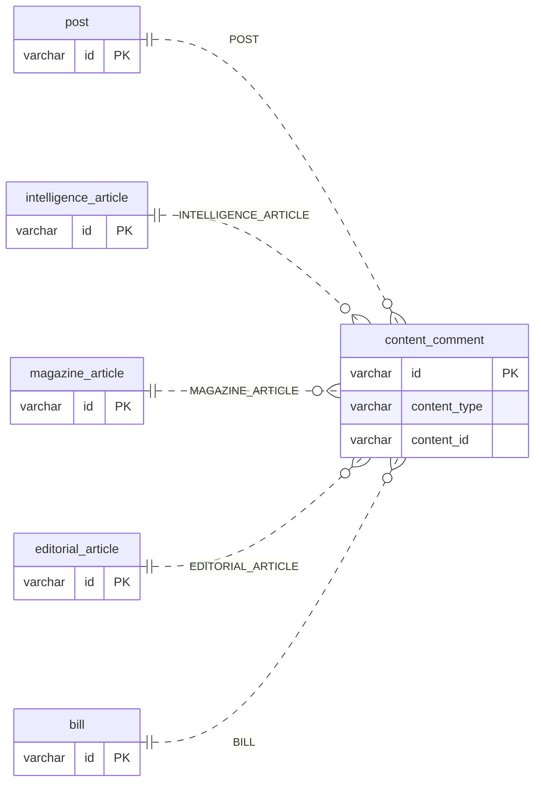
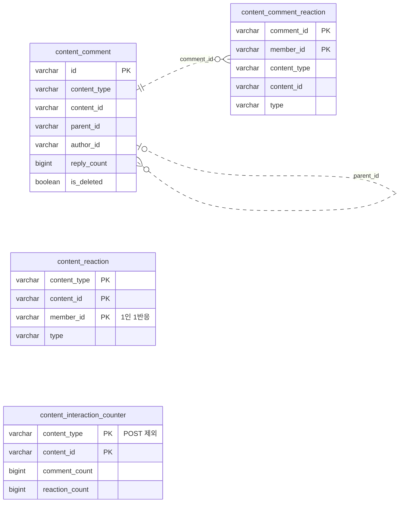
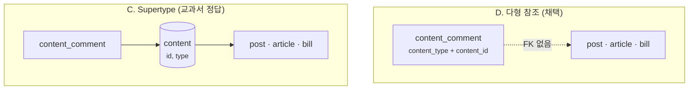
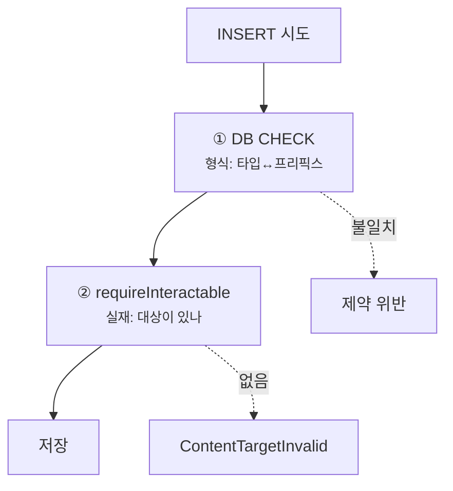
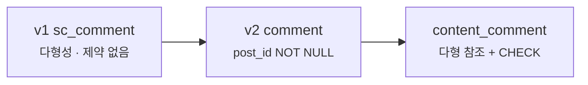

댓글 기능은 보통 게시글 하나만 보고 만들어집니다.

```sql
CREATE TABLE comment (
    post_id VARCHAR(40) NOT NULL,   -- 부모는 언제나 게시글
    ...
);
```

**문제는 대상이 늘어날 때 시작됩니다.** 아티클에도 댓글이 필요해지고, 그다음엔 의안에도, 에디토리얼에도.
결국 **5종**이 됐습니다. 대상 테이블이 제각각이고, id 체계도 다르고,
심지어 **어떤 건 우리가 만든 데이터도 아닙니다.**

댓글 테이블을 타입마다 복제할 수도 있고, 컬럼을 타입마다 늘릴 수도 있고,
공통 부모 테이블을 새로 둘 수도 있습니다. **전부 외래 키를 유지할 수 있는 길입니다.**

그런데 고른 건 **한 테이블이 `(타입, id)` 쌍으로 대상을 가리키는 방식**이었습니다.
Bill Karwin의 『SQL Antipatterns』에 "Polymorphic Associations"라는 이름의
**안티패턴으로 실려 있는** 그 방식이고, **여기엔 외래 키를 걸 수 없습니다.**

그래서 이 글은 두 부분입니다.

1. **FK를 포기하면서까지 이걸 고른 이유** — 대안 셋을 어떤 근거로 기각했나
2. **FK 자리를 무엇으로 메웠나** — CHECK 제약과 런타임 검증 두 층


## 붙여야 했던 것

상호작용 대상이 **다섯 종류**입니다.

| 타입 | id 프리픽스 | 누가 만드나 |
| --- | --- | --- |
| `POST` | `post_` | 사용자 |
| `INTELLIGENCE_ARTICLE` | `intel_art_` | 뉴스 파이프라인 |
| `MAGAZINE_ARTICLE` | `mag_art_` | 매거진 파이프라인 |
| `EDITORIAL_ARTICLE` | `edi_art_` | 관리자 |
| `BILL` | `PRC_` / `ARC_` | **국회** |

### 여기서 결정을 좌우한 건 "누가 만드나" 칸입니다

타입이 다섯이라는 것 자체는 큰 문제가 아닙니다. 진짜 문제는 **콘텐츠가 생기는 경로가 제각각**이라는 것입니다.

- `POST`·`EDITORIAL_ARTICLE`은 사용자·관리자가 **우리 API로** 만듭니다
- **인텔리전스·매거진 아티클은 외부 파이프라인이 발행합니다.** 별도 앱이 HTTP로 밀어 넣고,
  받는 쪽은 "이미 만들어진 아티클을 기록하는" 수신 핸들러입니다
- **의안은 국회 데이터를 배치가 가져옵니다.** 무엇이 언제 생길지는 국회가 정합니다

다섯 경로 **전부 우리 코드이고 우리 DB에 씁니다.** 통제 밖에 있는 건 트랜잭션이 아니라
**"무엇이 언제 생기는가"라는 결정**입니다.

그래서 상호작용을 위한 **공통 부모 테이블**을 만들면, 그 행을 넣는 코드를
**콘텐츠가 생기는 다섯 자리에 전부 끼워 넣어야** 합니다.
그중 셋은 다른 관심사(콘텐츠 생산)를 위해 존재하는 코드입니다.

> 지금은 "**콘텐츠가 생기는 자리와 상호작용을 쓰는 자리가 다르다**"만 기억하면 됩니다.
> 뒤에서 교과서 정답을 기각하는 직접적인 이유가 됩니다.

### 붙여야 하는 곳도 넷입니다

상호작용 테이블이 넷입니다 — 댓글, 리액션, 댓글 리액션, 카운터.
**5종 콘텐츠를 4개 테이블에 어떻게 이을 것인가**가 풀어야 할 문제였습니다.

그리고 넷 중 **카운터만 받는 타입이 다릅니다.**

| 테이블 | 받는 타입 |
| --- | --- |
| 댓글 · 리액션 · 댓글 리액션 | 5종 전부 |
| **카운터** | **`POST` 제외 4종** |

이유가 양쪽 끝에 있습니다.

**게시글은 카운터 테이블에 넣지 않습니다.** 집계의 진실의 원천이 `post` 행의 컬럼이고,
여기 `POST` 행이 생기면 **같은 수치의 출처가 둘**이 됩니다. 피드 목록이 이미 그 컬럼을 직접 읽고 있어서
카운터 테이블로 옮기면 매 페이지에 조인이 붙기도 합니다.

**의안은 반대로 여기 말고는 셀 곳이 없습니다.** 국회 배치가 `bill` 행을 **always-overwrite로 덮어쓰기** 때문에
거기에 댓글 수를 얹으면 **다음 배치에 지워집니다.**

> 같은 "카운터를 어디 둘 것인가"에 **정반대 답이 나온 것**이고, 둘 다 근거가 데이터 소유권에 있습니다.

### 최종 스키마를 먼저 보면

대안을 비교하기 전에, 결국 어떤 모양이 됐는지부터 봅니다.
**점선은 외래 키 없이 값으로만 잇는 참조**입니다. 이 그림에는 실선이 하나도 없습니다.

첫 번째 그림은 **한 컬럼 쌍이 다섯 테이블 중 하나를 가리키는** 구조입니다.
`content_type` 값이 어느 테이블을 볼지 정하고, `content_id`가 그 테이블의 행을 가리킵니다.
선 위의 글자가 그 `content_type` 값입니다.



리액션·댓글 리액션·카운터도 **같은 방식**으로 다섯 테이블을 가리킵니다(카운터만 `post` 선이 없습니다).
선을 전부 그리면 스무 개라, 두 번째 그림은 **상호작용 테이블 넷끼리의 관계**만 따로 그렸습니다.



두 가지를 보면 됩니다.

- **대상을 가리키는 방법은 넷 다 같습니다** — `(content_type, content_id)` 한 쌍. 테이블마다 이 쌍을 검사하는 CHECK가 붙습니다(카운터는 `POST` 제외, 뒤에서 봅니다).
- **테이블끼리의 참조에도 FK가 없습니다.** 대댓글의 `parent_id`, 댓글 리액션의 `comment_id`, 작성자 `author_id`·`member_id` 전부 값으로만 잇습니다.
  댓글 리액션이 `content_type`·`content_id`를 다시 들고 있는 건 비정규화입니다 —
  리액션 이벤트가 원본 콘텐츠를 알아야 알림이 이동 경로를 만들 수 있어서입니다.

## 선택지 넷

| 대안 | 무결성 | 타입 추가 비용 | 결과 |
| --- | --- | --- | --- |
| **A.** 타입별 분리 테이블 | 진짜 FK 가능 | 테이블·서비스·라우트 복제 | 기각 |
| **B.** Exclusive arc | 진짜 FK 여러 개 | **타입 수에 선형** | 기각 |
| **C.** Supertype 테이블 | **최강** | 낮음 | **기각** |
| **D.** 다형 컬럼 `(type, id)` | FK 불가 | enum 값 1개 | **채택** |

**A(타입별 분리)** — `intelligence_comment`, `bill_comment`처럼 타입마다 테이블을 만듭니다.
FK를 제대로 걸 수 있어 깔끔해 보이는데, **댓글만 복제되는 게 아닙니다.**
알림·푸시 계약·신고가 전부 같이 포크됩니다.
신고 기능을 새 테이블에 붙이는 동안 **아티클 댓글이 신고 불가 UGC가 되는 기간**이 생깁니다.

**B(Exclusive arc)** — 컬럼을 타입마다 nullable로 두고 하나만 채웁니다.

```sql
post_id, intelligence_article_id, magazine_article_id, ...   -- 전부 nullable
CHECK (num_nonnulls(post_id, intelligence_article_id, ...) = 1)
```

Karwin 본인이 제시하는 대안입니다. FK도 진짜로 걸립니다.
그런데 **타입이 늘 때마다 `ALTER TABLE` + 인덱스 + 모든 쿼리 재작성**입니다.
시작이 3종이었고 이미 5종이 됐습니다. **안 버팁니다.**

**C(Supertype)** — 이게 교과서 정답입니다. 아래에서 따로 봅니다.

## 교과서 정답을 기각한 이유

C는 `content(id PK, type)`이라는 **부모 테이블**을 두고, 모든 게시글·아티클이 거기에 행을 하나씩 갖습니다.
그러면 `content_comment.content_id`가 **진짜 FK**가 됩니다.



**greenfield라면 C가 정답입니다.** 그런데 여기서 안 쓴 이유가 이 코드베이스 고유의 사실 둘이었습니다.

### ① 콘텐츠 생산 경로가 오염된다

C를 쓰면 **콘텐츠가 생기는 자리마다** `content` 행 INSERT를 끼워 넣어야 합니다.
아티클 발행(`IntelligenceArticleService.publish` / `MagazineArticleService.publish`),
의안 배치, 게시글 작성, 에디토리얼 발행 — **다섯 군데 전부**입니다.

그 순간 **콘텐츠 생산이 상호작용 관심사에 결합됩니다.**
아티클을 발행하는 코드가 "댓글이 달릴 수 있게 하는 일"까지 책임지게 됩니다.

그리고 새 실패 모드가 생깁니다 — "**아티클은 있는데 `content` 행이 없어 댓글이 안 달림.**"

이게 막연한 걱정이 아닌 이유가 있습니다.
**아티클 발행 경로에는 서비스 레벨 `@Transactional`이 없습니다.**
트랜잭션 경계는 그 아래 어댑터의 `save()`에 있습니다.

```kotlin
// IntelligenceArticleService — 클래스에도 메서드에도 @Transactional 이 없다
fun publish(command: PublishIntelligenceArticleCommand): IntelligenceArticleResult {
    // ...
    return try {
        port.save(article)      // ← 트랜잭션 경계는 여기(어댑터)
        IntelligenceArticleResult(article.id, created = true)
    } catch (e: IntelligenceArticleWriteConflictException) { /* 멱등 처리 */ }
}
```

즉 `content` INSERT를 서비스에 그냥 추가하면 **아티클 저장과 다른 트랜잭션이 됩니다.**
둘을 원자적으로 묶으려면 **발행 경로의 트랜잭션 경계부터 다시 설계**해야 하는데,
그건 상호작용 기능을 붙이려다 **콘텐츠 생산 경로를 건드리는 일**입니다.

> 무결성을 얻으려다 **없던 고장 방식을 만들고, 남의 경로까지 손대는 것**입니다.

### ② `content`가 순수 미러 테이블이 된다

id가 이미 전역 유니크이고 **타입 프리픽스를 들고 있습니다**(`intel_art_`, `post_` …).
그러니 `content` 테이블이 담을 정보는 **기존 테이블에 이미 있는 id뿐**입니다.

**새 정보 0, 동기화 실패 가능성 +1.**

### 그래서 결론은 "C보다 낫다"가 아니다

정확한 문장은 이것입니다.

> **무결성 이득 &lt; 파이프라인 결합 비용 — 이 스키마에서는.**

마지막 다섯 글자가 중요합니다. 설계 문서는 이 조건을 이렇게 적어 뒀습니다.

> 파이프라인이 우리 트랜잭션 경계 안이었다면 C를 택했을 것이다.

**"트랜잭션 경계 안"은 "우리 코드가 아니다"라는 뜻이 아닙니다.** 앞에서 봤듯 다섯 경로 전부 우리 코드입니다.
여기서 말하는 건 **콘텐츠 생성과 상호작용 등록을 한 원자 단위로 묶을 수 있는 구조인가**입니다.
지금은 발행 경로의 트랜잭션 경계가 어댑터에 있어서 그러려면 그 경로부터 재설계해야 합니다.

안티패턴이 좋아서 고른 게 아니라, **이 조건에서 비용이 역전됐기 때문**입니다.

## 무엇을 실제로 포기했나

"FK를 포기했다"고 하면 커 보입니다. 그런데 **정직하게 계산하면 생각보다 적습니다.**

**① 원래도 FK가 없었습니다.**
기존 `comment.post_id`, `post_reaction.post_id`, `repost.target_id` 전부 FK가 없습니다.
**다형화가 무결성을 새로 깎은 게 아닙니다.**

**② 여기서는 `ON DELETE CASCADE`가 할 일이 없습니다.**
post는 `deleted_at`, comment는 `is_deleted`, 아티클은 `status = HIDDEN` —
**상호작용의 부모가 하드 삭제되는 경로 자체가 없습니다.** FK의 실질 가치 중 큰 몫이 해당 사항이 없습니다.

> 스키마 전체로 보면 `ON DELETE CASCADE`를 쓰는 곳이 셋 있습니다
> (`member_notification_preference`, `intelligence_rank_snapshot_item`, `notification_broadcast_item`).
> 전부 **부모가 실제로 하드 삭제되는 소유 관계**입니다. 상호작용 테이블만 그 성격이 아닙니다.

**③ 조인을 한 번도 하지 않습니다.**
조회는 항상 `WHERE content_type=? AND content_id=?`입니다. 그 상세 화면에 있으니 대상이 이미 정해져 있습니다.
게다가 이 코드베이스는 `@ManyToOne`/`@JoinColumn`이 **0건**이고 모든 관계를 id 컬럼과 어댑터 조회로 풉니다.
**애초에 조인으로 푸는 스타일이 아닙니다.**

**④ 진짜로 포기한 것** — 앞으로도 이 컬럼엔 FK를 못 붙입니다.
**대상 행의 존재 보장이 영구히 애플리케이션 책임**이 됩니다.

> 이 스키마가 FK를 쓸 줄 모르는 게 아닙니다. 마이그레이션에 FK가 **8건** 있습니다 —
> `poll_vote → poll_option`, `member_profile → hangjungdong`, `member_notification_preference → member`,
> 랭킹 스냅샷 3건, 브로드캐스트 2건.
> **대상이 하나로 정해진 소유 관계엔 쓰고, 상호작용 테이블엔 안 씁니다.**

## FK 대신 무엇을 걸었나 — 두 층

포기한 자리를 비워 두지 않고 **두 층**으로 나눠 막았습니다.



### ① DB CHECK — 형식은 DB가 본다

**id가 타입을 이미 인코딩하고 있습니다.** 그러니 "이 쌍이 형식상 말이 되는가"는 DB가 검증할 수 있습니다.

```sql
CHECK (
       (content_type = 'POST' AND LEFT(content_id, 5) = 'post_')
    OR (content_type = 'INTELLIGENCE_ARTICLE' AND LEFT(content_id, 10) = 'intel_art_')
    OR (content_type = 'MAGAZINE_ARTICLE' AND LEFT(content_id, 8) = 'mag_art_')
    OR (content_type = 'EDITORIAL_ARTICLE' AND LEFT(content_id, 8) = 'edi_art_')
    OR (content_type = 'BILL' AND LEFT(content_id, 4) IN ('PRC_', 'ARC_'))
);
```

**타입 불일치와 타입 오타를 물리적으로 차단합니다.** `content_type='POST'`인데 `intel_art_…`가 들어오면 INSERT가 거부됩니다.

#### 이 방어가 의안에서만 약합니다

여기서 앞의 표에 있던 "**id를 누가 만드나**"가 값을 치릅니다.

넷은 우리 `IdGenerator`가 프리픽스를 붙이니 **반드시** 그 모양입니다. 보증입니다.
**의안은 국회가 붙인 번호를 그대로 PK로 씁니다**(자연키). 형식을 우리가 정하지 않았으니
**보증이 아니라 관측**입니다 — 주석이 그걸 숨기지 않습니다.

> 22대 국회 의안 **19,129건**이 `PRC_`(18,665) 아니면 `ARC_`(464)였다.

**분명히 해 둘 게 있습니다.** 의안이 외부 id를 쓴다는 사실은 **다형 참조를 고른 이유가 아닙니다.**
supertype을 택했더라도 `content` 행에 `PRC_…`를 넣으면 그만이고, 어떤 대안도 이것 때문에 막히지 않습니다.
**이건 고른 뒤에 치른 값입니다** — 하필 다형 참조의 안전망이 "id가 타입을 인코딩한다"는 성질에 기대고 있는데,
다섯 중 하나가 그 성질을 **보증받지 못하는 상태**인 것입니다.

그럼에도 의안까지 CHECK에 넣은 이유는 따로 있습니다.
`content_*`에는 **검증 로직을 안 거치고 직접 INSERT하는 배치가 이미 셋** 있습니다.
의안 쪽에 그런 잡이 생기면 **컬럼 밀림 같은 실수를 잡아 줄 그물이 이것뿐**입니다.
관측에 불과해도 없는 것보다 낫다는 판단입니다.

대신 **깨지는 방식을 미리 적어 뒀습니다** — 국회가 세 번째 프리픽스를 쓰면
그 의안에는 **댓글이 안 달립니다(조회는 됩니다).** 조용히 틀리는 대신 **한 기능이 눈에 띄게 멈추는 쪽**이고,
그때는 값을 하나 더하면 됩니다.

### ② `requireInteractable()` — 실재는 애플리케이션이 본다

CHECK는 **형식만** 봅니다. `post_zzzz`라는 존재하지 않는 id도 형식은 통과합니다.
그래서 실재 확인을 **한 지점에 모았습니다.**

```kotlin
override fun requireInteractable(contentType: ContentType, contentId: String) {
    val interactable = when (contentType) {
        ContentType.INTELLIGENCE_ARTICLE -> intelligenceArticlePort.findPublishedById(contentId) != null
        ContentType.MAGAZINE_ARTICLE -> magazineArticlePort.findPublishedById(contentId) != null
        ContentType.EDITORIAL_ARTICLE -> editorialArticlePort.findPublishedById(contentId) != null
        ContentType.POST -> postPort.findById(contentId) != null
        ContentType.BILL -> billPort.findById(contentId) != null
    }
    if (!interactable) throw ContentTargetInvalidException(contentType, contentId)
}
```

두 가지가 설계입니다.

**exhaustive `when`** — `ContentType`에 값을 추가하면 **여기가 컴파일 에러**를 냅니다.
"새 타입인데 검증을 안 붙였다"를 **구조적으로** 막습니다. 리뷰가 아니라 컴파일러가 잡습니다.

**아티클은 `findPublishedById`로만 본다** — 이 포트가 구현 안에서 `PUBLISHED` 필터를 강제합니다.
호출부가 실수해도 **숨겨진 아티클에 댓글이 달릴 수 없습니다.**

> **DB가 못 하는 일을 애플리케이션이 한 자리에서 대신한다**는 것을 코드 위치로 드러낸 셈입니다.

### 그리고 CHECK가 두 군데 적혀 있다

Flyway 마이그레이션과 JPA 엔티티의 `@Check`에 **같은 식이 이중으로** 있습니다.
DRY 위반인데, 이유가 있습니다.

테스트는 H2 + `ddl-auto: create-drop` + **Flyway 비활성**입니다.
즉 **Flyway에만 있는 제약은 테스트 스키마에 존재하지 않습니다.**

> 버그 한 종류를 잡는 게 존재 이유인 제약을
> **"어떤 테스트도 존재를 증명할 수 없는" 상태로 두는 건 나쁜 거래다.**

PG 함수로 묶어 DRY하게 만드는 안도 같은 이유로 기각됐습니다.

## 레거시 이관과는 무슨 관계인가

이 스키마가 v1→v2 레거시 이관의 결과인지 확인해 봤습니다.
**직접적인 원인은 아니었습니다.** 다만 **세 갈래로 얽혀 있습니다.**



**① 레거시도 다형성이었고, 이관은 그걸 제거했다.**
v1의 `sc_comment`는 `parent_content_type`(BOARD/BILL)로 부모를 가리켰습니다.
**댓글이 게시판에도 법안에도 붙는 구조**였습니다.
v2 이관은 이걸 **`comment(post_id NOT NULL, parent_id NULL)`로 바꿔 다형성을 제거**했습니다.
"다형성 제거로 `post_id`에 진짜 FK 의미를 부여"하는 게 그때의 판단이었습니다.

**그리고 나중에 다시 다형 참조를 도입했습니다.** 같은 모양인데 **인식이 정반대**입니다 —
전자는 설계 없이 뭉개진 것이었고, 후자는 대안 넷을 비교하고 CHECK를 걸고 기각 사유를 남긴 것입니다.

**② 레거시 다형성의 대가가 숫자로 남아 있다.**
이관할 때 `sc_comment`의 **`BILL` 댓글 10건이 탈락**했습니다.
v2가 법안 도메인을 폐기하면서 **갈 곳이 없어진 고아 데이터**였습니다.
문서는 이걸 "다형성 부모가 만든 사각지대"라고 부릅니다.

그리고 아이러니하게도, **v2는 나중에 의안을 상호작용 대상으로 다시 넣었습니다.**

**③ v1과의 병행 운영이 전면 재설계를 강제했다.** 이게 유일한 직접적 인과입니다.
v2를 올리는 동안 v1이 **같은 RDS에서 계속 서빙**하고 있었으니
**`sc_*`를 제자리에서 바꾸면 살아 있는 v1이 깨집니다.**
그래서 "**신규명 테이블로의 전면 재설계가 선택이 아니라 강제**"였고,
그 덕분에 `content_*`를 백지에서 설계할 수 있었습니다.

> 정리하면 — **레거시 이관은 이 스키마의 원인이 아니라 배경**입니다.
> 다만 "같은 다형성을 한 번 걷어내고 다시 들인" 경로를 만든 건 그 이관이 맞습니다.

참고로 이 이관은 처음에 Strangler Fig(도메인별로 라우팅을 하나씩 새 서버로 옮기기)로 계획했지만,
실제로는 v1과 v2를 **호스트로 나눠 병행**하다가 **앱 업데이트로 한 번에** 넘겼습니다.
이 글의 논점에는 영향이 없습니다 — 필요한 사실은 "v1이 같은 DB에서 살아 있었다"는 것 하나입니다.

## 남은 것

**고아 0건은 관측이지 보장이 아닙니다.**

FK 없이 운영해 온 세 참조(`comment → post`, `post_reaction → post`, `comment_reaction → comment`)에서
고아 행이 **0건**으로 실측됐습니다. "애플리케이션 책임"이 희망사항이 아니라
**관측된 상태**라는 뜻이긴 합니다.

그래도 **관측과 보장은 다릅니다.** DB가 막아 주는 게 아니라 **지금까지 안 틀렸을 뿐**입니다.
야간 감사 잡으로 주기적으로 대조하는 게 이 자리를 메우는 정석이고, 아직 없습니다.

**정직한 약점도 하나 있습니다.** "내 활동 전체(게시글 + 아티클 통합)" 같은 화면이 생기면
**타입별 배치 조회 5번**이 됩니다(타입 수만큼 늘어납니다). 다만 그 화면은 UI가 타입별로 다른 카드를 그려야 해서
어차피 분기하긴 합니다.

## 정리

안티패턴을 고를 수 있습니다. **조건이 다르면 비용 계산이 뒤집히기 때문**입니다.

다만 그러려면 세 가지가 있어야 한다고 봅니다.

1. **대안을 실제로 비교한 기록** — "몰라서 이렇게 했다"와 "알고 이렇게 했다"는 완전히 다릅니다
2. **포기한 것의 정확한 크기** — "FK를 포기했다"가 아니라 "원래 없었고, CASCADE는 쓸 일이 없고, 진짜 잃은 건 존재 보장이다"
3. **포기한 자리를 메운 방법** — CHECK로 형식, `requireInteractable`로 실재, 두 층

**"안티패턴이라서 안 쓴다"도 "안티패턴인 줄 몰랐다"만큼이나 생각을 멈춘 자리**입니다.
중요한 건 그 패턴이 왜 안티패턴인지, 그리고 **그 이유가 내 상황에도 성립하는지**입니다.
