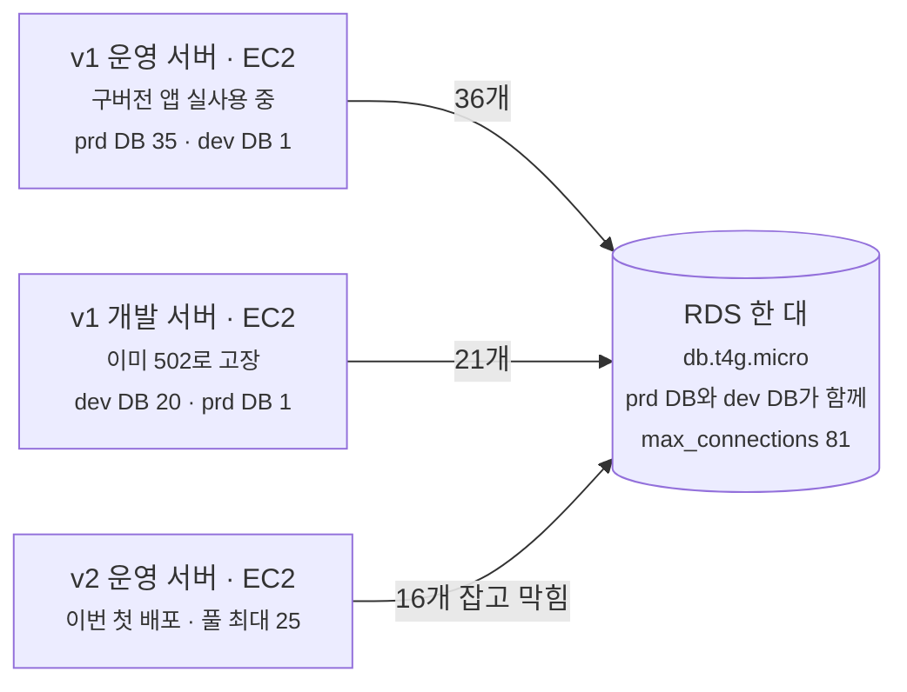
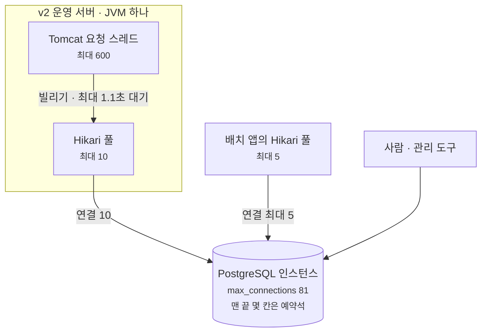
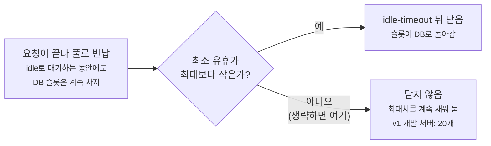
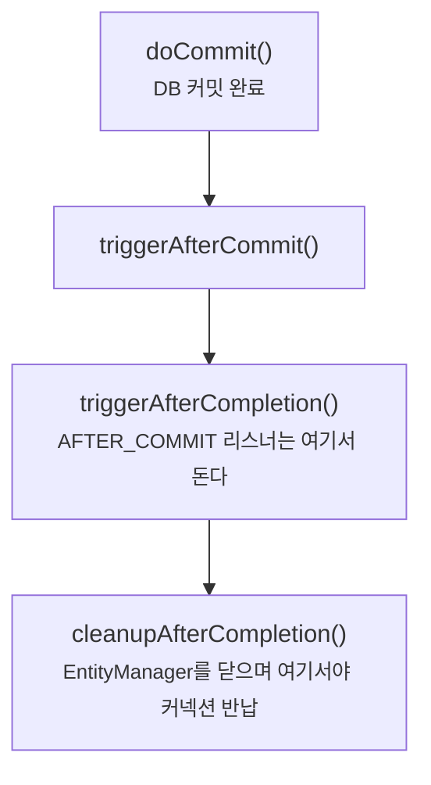

설정 파일의 숫자는 대개 기본값이거나 "이 정도면 되겠지" 하고 넣은 값입니다.
이 글은 그러지 않으려고 따로 근거를 만들어 정했던 숫자 두 개에 관한 이야기입니다.

```yaml
maximum-pool-size: 10            # DB 커넥션 풀
recent-publisher-threshold: 5    # 속보 알림 임계값 K
```

커넥션 풀은 DB 연결 예산을 따져서, 알림 임계값은 과거 데이터를 다시 돌려 봐서 정했습니다.

글을 쓰면서 당시 적어 둔 근거를 다시 확인해 봤습니다. 대부분은 맞았지만 고쳐야 할 설명이 몇 군데 있었고, 아직 확인하지 못한 숫자도 있었습니다. 그 내용도 함께 적었습니다.

근거는 두 곳에서 가져왔습니다. 코드, Spring·Hibernate 소스, 재현 실험(2026-09-23)은 이번에 직접 확인한 것입니다.
사고 당시 지표와 `pg_stat_activity` 표, K를 정할 때의 결과표, 09-23 운영 관측치는 당시 남긴 기록을 옮긴 것이라 다시 재지 않았습니다.
기록끼리 숫자가 맞는지는 확인했고, 기록에서 가져온 수치는 본문에서 따로 밝혔습니다.

## 1부. 커넥션 풀: 25에서 10으로

### 배포하자마자 커넥션이 바닥났다

2026-08-23 밤, 새로 만든 v2 서버를 운영에 처음 올렸습니다.

| 시각 | 무슨 일 |
| --- | --- |
| 21:46 | 배포 시작 |
| 21:48 | RDS `DatabaseConnections` **57 → 73** |
| 21:50 | 배포 성공. `/health`는 200 |
| 21:5x | 새 DB 접속이 전부 거절됨 |
| 21:56 | 인스턴스를 0대로 내림 |

```
FATAL: remaining connection slots are reserved for roles with
       privileges of the "rds_reserved" role
```

배포 자체는 성공으로 끝났습니다. `/health`가 DB를 거치지 않아서 커넥션이 없어도 200을 돌려줬기 때문입니다. 정작 API는 500을 냈습니다.

같은 배포에서 예전 이미지가 뜨는 문제도 겹쳤습니다. 이미지 태그를 손으로 바꾸기 전에 배포 스크립트가 옛 태그를 먼저 읽어 버렸습니다.
500의 직접 원인은 그쪽일 가능성이 크고, 커넥션 거절은 그와 별개로 실제로 일어났습니다. 이 글에서는 커넥션 쪽만 다룹니다.

원인은 설정 한 줄이었습니다. 운영 프로필의 `maximum-pool-size`가 25였습니다.
배치 앱은 "운영 API와 경쟁하지 않도록" 5로 낮춰 뒀는데, API 서버는 그대로였습니다.

DB 쪽 사정도 있었습니다. RDS `db.t4g.micro` 한 대가 dev와 prd 데이터베이스를 함께 받고 있었고, 옛 서버 v1의 운영·개발 인스턴스도 같은 DB에 붙어 있었습니다.
그래서 v2는 25개를 다 채우기도 전에, 16개를 잡은 시점에 한도에 걸렸습니다.

그날 밤 DB 한 대에 붙어 있던 것들을 그려 보면 이렇습니다.



- 서버는 셋이지만 연결 한도 81은 DB 인스턴스 하나에 걸려 있습니다. dev DB로 가는 연결도 prd와 같은 81 안에서 나눠 씁니다.
- v1 서버 두 대는 자기 환경이 아닌 DB에도 연결을 하나씩 잡고 있었습니다(운영 서버 → dev DB, 개발 서버 → prd DB).
- v1 숫자는 아래 `pg_stat_activity` 기록에서, v2의 16은 CloudWatch 연결 수가 57에서 73으로 늘어난 만큼에서 가져왔습니다.
  16개가 더해지자 남은 자리는 예약석뿐이었고, 그 뒤로는 v1이든 v2든 새 접속을 받을 수 없는 상태가 됐습니다.

### 한도는 112가 아니라 81이었다

여기서 한도는 DB 서버가 동시에 받아 주는 연결 수, PostgreSQL의 `max_connections`를 말합니다.
Spring에서 설정하는 Hikari 풀 크기와는 다른 숫자인데, 둘의 차이는 이 절 뒤에서 따로 정리했습니다.

처음에는 한도를 계산으로 추정했습니다. RDS PostgreSQL의 `max_connections` 기본값은 다음 식으로 정해집니다.

```
LEAST({DBInstanceClassMemory / 9531392}, 5000)
```

`db.t4g.micro`의 메모리는 1 GiB이니 1,073,741,824 ÷ 9,531,392 ≈ 112가 나옵니다.
그런데 실제로는 73에서 거절당했으니 이 추정은 틀렸습니다. DB에 직접 조회해 보니 81이었습니다.

차이는 `DBInstanceClassMemory`가 물리 메모리가 아니라는 데서 옵니다.
RDS가 OS와 자기 몫을 떼고 DB 엔진에 넘겨준 양입니다. 이 값을 따로 보여 주는 곳은 없지만,
같은 변수를 쓰는 다른 파라미터로 거꾸로 구할 수 있습니다. `shared_buffers`의 기본값이 `{DBInstanceClassMemory/32768}`(8kB 페이지 단위)입니다.

```
shared_buffers = 23,570 페이지 (× 8kB = 184 MiB)
  → DBInstanceClassMemory = 23,570 × 32,768 = 772,341,760 B = 736.6 MiB
  → max_connections       = 772,341,760 ÷ 9,531,392 = 81.03 → 81
```

실측 81과 정확히 맞고, 물리 1,024 MiB 중 약 287 MiB는 엔진 몫이 아니었다는 뜻이 됩니다.
(이 역산은 두 파라미터가 기본 공식을 그대로 쓸 때만 성립합니다. Terraform의 파라미터 그룹은 두 값을 건드리지 않고, 역산값이 실측과 소수점 아래까지 맞는 것도 그걸 뒷받침합니다.)

덕분에 이 한도는 인스턴스를 바꾸지 않는 한 늘지 않는다는 걸 분명히 알게 됐습니다.
파라미터로 억지로 올릴 수는 있지만, 1 GiB 메모리에서 커넥션을 늘리면 OOM 위험이 커진다고 보고 그 방법은 쓰지 않았습니다.

### 한도 81과 풀 25는 무엇이 다른가

둘 다 "커넥션 개수"라 헷갈리기 쉬운데, 세는 위치와 범위가 다릅니다.

`max_connections`는 DB 서버가 받아 주는 연결의 상한입니다.
PostgreSQL 문서는 "데이터베이스 서버에 동시에 연결할 수 있는 최대 수"라고 정의합니다. 알아 둘 점은 세 가지입니다.

- 데이터베이스가 아니라 서버(인스턴스) 단위입니다. 그래서 같은 인스턴스의 prd DB와 dev DB가 81을 나눠 씁니다.
- 연결 하나가 DB 서버의 프로세스 하나입니다. PostgreSQL은 접속이 들어올 때마다 전용 백엔드 프로세스를 띄웁니다. 한도가 메모리에 비례하는 이유가 이것이고, RDS 기본식은 엔진 메모리 약 9.1 MiB(9,531,392 B)당 연결 1개로 잡습니다.
- 서버를 시작할 때만 정해집니다. 바꾸려면 파라미터를 고치고 DB를 재시작해야 합니다.

그리고 81개가 모두 일반 접속용은 아닙니다. 맨 끝 몇 자리는 예약석입니다.
남은 자리가 `superuser_reserved_connections`(여기서는 3) 이하가 되면 superuser만 접속할 수 있고,
그 바로 위 구간은 지정된 역할만 쓸 수 있습니다. RDS는 이 구간을 관리용 `rds_reserved` 역할 몫으로 잡아 둡니다.
사고 때 본 에러는 "남은 자리는 예약석뿐이라 일반 접속은 받을 수 없다"는 뜻이었습니다.

```
FATAL: remaining connection slots are reserved for roles with
       privileges of the "rds_reserved" role
```

Hikari의 `maximum-pool-size`는 앱 하나가 열어 둘 수 있는 연결의 상한입니다.
HikariCP는 DB가 아니라 앱 프로세스 안에서 도는 라이브러리이고, `maximum-pool-size`는 이 풀이 가질 수 있는 커넥션 수(사용 중인 것과 놀고 있는 것을 합친 수)입니다.
풀이 이 크기까지 찼는데 놀고 있는 커넥션이 없으면, 커넥션을 빌리려는 스레드는 `connection-timeout`만큼 기다렸다가 예외를 받습니다.

풀은 앱 인스턴스마다 따로 생깁니다. 서버가 두 대면 풀도 두 개이고, DB에는 두 풀의 연결이 합쳐져 붙습니다.
그래서 두 숫자 사이에는 다음 관계가 성립해야 합니다.

```
DB에 붙는 모든 풀의 최대치 합 + 사람·관리 도구 ≤ max_connections − 예약석
```

사고 날 밤에는 이 조건이 깨져 있었습니다. v1 두 대가 이미 57개를 잡은 상태에서 v2가 25개를 더 열려고 했습니다.



그림에서 기다리는 지점은 두 곳입니다. 요청 스레드는 풀 앞에서 커넥션을 기다리고, 풀은 DB에 새 연결을 요청합니다.
Tomcat 스레드 600개가 커넥션 10개로 버틸 수 있는 건 요청마다 커넥션을 잠깐 빌렸다가 바로 돌려주기 때문입니다.

| | `max_connections` | Hikari `maximum-pool-size` |
| --- | --- | --- |
| <span style="white-space:nowrap">위치</span> | DB 서버 (RDS 파라미터) | 앱 프로세스 안 (Spring 설정 `db-core.yml`) |
| <span style="white-space:nowrap">세는 대상</span> | 인스턴스에 붙은 모든 연결의 합. 모든 앱, 모든 DB, 사람까지 | 이 풀 하나가 열어 둘 연결 수 |
| <span style="white-space:nowrap">넘치면</span> | 새 접속을 거절한다 (`FATAL`) | 빌리려는 스레드가 `connection-timeout`까지 기다린 뒤 예외 |
| <span style="white-space:nowrap">바꾸려면</span> | 파라미터 변경 후 DB 재시작, 또는 인스턴스 교체 | 설정 변경 후 앱 재배포 |
| <span style="white-space:nowrap">지금 값</span> | 81 | 운영 10 (사고 때 25) |

커넥션이 모자라는 상황도 어디서 막히느냐에 따라 양상이 다릅니다.

| | 앱의 풀이 모자랄 때 | DB 한도에 닿았을 때 |
| --- | --- | --- |
| <span style="white-space:nowrap">막히는 곳</span> | 앱 안. DB에는 자리가 남아 있을 수도 있다 | DB 입구. 같은 DB를 쓰는 모든 앱이 새 연결을 못 연다 |
| <span style="white-space:nowrap">에러</span> | Hikari: `Connection is not available, request timed out after ...ms` | PostgreSQL: `FATAL: remaining connection slots are reserved ...` |
| <span style="white-space:nowrap">영향 범위</span> | 그 앱 하나 | 한 인스턴스를 공유하는 전부. 이번엔 v1 운영까지 위험했다 |
| <span style="white-space:nowrap">이 글에서</span> | 뒤의 재현 실험 | 08-23 사고 |

풀이 인스턴스마다 생긴다는 점은 배포 때도 영향을 줍니다.
운영 배포는 Blue/Green 방식이라, 새 인스턴스로 트래픽이 넘어간 뒤에도 옛 인스턴스를 5분 더 남겨 둡니다(Terraform `termination_wait_time_in_minutes = 5`).
두 인스턴스 모두 최소 유휴 10개를 채우므로, 그동안 v2 운영 몫은 10이 아니라 20이 됩니다.
설정으로 계산한 값이고 실제로 관측하지는 않았습니다. 뒤의 예산표에는 이 구간을 별도 칸으로 넣었습니다.

### 57개는 누가 쥐고 있었나

배포 전부터 있던 57개도 확인했습니다. v2를 내린 뒤 떠 둔 `pg_stat_activity` 기록을 보면 전부 v1의 연결이었습니다.

| 누가 | 개수 | 상태 |
| --- | ---: | --- |
| v1 운영 서버 | 35 | 전부 idle, 가장 오래된 것 2시간 37분 |
| v1 개발 서버 | 20 | 전부 idle |
| 교차 연결 (운영 서버 → dev DB, 개발 서버 → prd DB) | 2 | idle |

57개 중 실제로 일하고 있던 커넥션은 하나도 없었습니다.
v1 개발 서버는 프록시 설정 오류로 이미 502를 내는 상태였는데도 커넥션은 20개 넘게 잡고 있었습니다.

유휴 커넥션이 줄지 않은 건 HikariCP 설정 때문이었습니다.
Hikari는 `minimum-idle`을 지정하지 않으면 `maximum-pool-size`와 같은 값으로 잡습니다.
그러면 풀이 항상 최대치로 채워지고, `idle-timeout`은 `minimumIdle`이 최대치보다 작을 때만 동작하기 때문에 아무 효과가 없습니다.
당시 기록을 보면 v1 개발 서버는 최소 유휴와 최대가 둘 다 20이어서, 쓰지도 않는 커넥션 20개를 계속 들고 있었습니다.

요청이 끝나 커넥션이 풀로 돌아간 뒤의 흐름은 이렇습니다.



풀 입장에서는 정상 동작입니다. 다음 요청에 바로 내줄 커넥션을 준비해 두는 거니까요.
다만 이번처럼 DB 한 대를 여러 서버가 나눠 쓰면, 한 서버가 준비해 둔 커넥션이 다른 서버가 쓸 자리를 차지합니다.
v2가 16개에서 막힌 건 v2 풀이 커서이기도 하지만, 그 전에 아무 일도 하지 않는 커넥션 57개가 이미 자리를 차지하고 있어서였습니다.

### 쓸 수 있는 자리는 몇 개인가

81개가 모두 앱 몫은 아니어서, 예약석부터 뺐습니다.

```
81 − 3 (superuser 예약석, 실측) − R (rds_reserved 예약석, 미확인) = 78 − R
```

일반 접속은 이 78 − R 자리 안에서만 받습니다.
v1·v2의 운영·개발 서버 풀, 배치 앱 풀, 그리고 앱이 아닌 연결(RDS 관리 연결, 사람이 붙이는 연결)이 모두 이 안에 들어가야 합니다.
항목별 숫자는 뒤의 「그래서 10」에서 합산합니다.

당시에는 여기서 `78 × 0.85 ≈ 66`을 "가용 예산"으로 잡았습니다.
0.85에는 "배치·모니터링·사람 몫 15%"라는 설명만 있고 근거는 남아 있지 않아서, 이번에 비율을 빼고 실제로 붙는 연결을 하나씩 세는 방식으로 바꿨습니다.

### 표준 공식 두 개가 서로 맞지 않았다

풀 크기를 정할 때 자주 인용되는 식이 HikariCP 위키 [About Pool Sizing](https://github.com/brettwooldridge/HikariCP/wiki/About-Pool-Sizing)에 두 개 나옵니다.

**처리량 기준**

```
pool = (코어 수 × 2) + 유효 스핀들 수 = (2 × 2) + 1 = 5
```

`db.t4g.micro`는 vCPU가 2개이고, 스토리지는 gp2 SSD라 스핀들 수를 1로 잡았습니다.
여기서 5는 앱 서버 한 대의 풀 크기가 아니라, DB 전체가 동시에 실제로 처리할 수 있는 양입니다.
풀을 이보다 키워도 처리량은 늘지 않고 DB 안에서 기다리는 쿼리만 늘어납니다.

**교착 회피 기준**

```
pool ≥ Tn × (Cm − 1) + 1
```

`Tn`은 동시에 커넥션을 요청할 수 있는 스레드 수, `Cm`은 스레드 하나가 동시에 잡는 커넥션 수입니다.
Tomcat 스레드가 600개이고 `Cm`이 2라면 다음과 같습니다.

```
600 × (2 − 1) + 1 = 601
```

5와 601을 동시에 만족하는 값은 없습니다.
그래서 값을 고르기 전에 둘 중 어느 쪽을 완화할지부터 정해야 했고, 그러려면 `Cm = 2`가 맞는지, 맞다면 실제로 어떤 문제가 생기는지 알아야 했습니다.

### `Cm = 2`는 어디서 오나

알림을 만드는 리스너는 이렇게 생겼습니다.

```kotlin
@Component
class NotificationListener(private val eventHandlerService: NotificationEventHandlerService) {
    @TransactionalEventListener(phase = TransactionPhase.AFTER_COMMIT)
    fun on(event: ContentCommentCreated) {
        safely(/* ... */) { eventHandlerService.on(event) }
    }
}

@Service
class NotificationEventHandlerService(/* ... */) {
    @Transactional(propagation = Propagation.REQUIRES_NEW)
    fun on(event: ContentCommentCreated) { /* 수신자 판정 + 알림 INSERT */ }
}
```

댓글 트랜잭션이 커밋된 뒤, 알림 적재가 새 트랜잭션에서 실행됩니다.
이미 커밋된 트랜잭션에는 참여할 수 없어서 `REQUIRES_NEW`가 필요합니다.
없으면 INSERT가 조용히 사라지는데, 아래 재현에서 `REQUIRES_NEW`를 빼 봤더니 호출자는 아무 예외도 받지 않았고 알림 행만 없었습니다.

문제는 커밋이 끝났다고 커넥션까지 돌려준 건 아니라는 점입니다.
Spring의 커밋 처리(`AbstractPlatformTransactionManager.processCommit`, spring-tx 6.2.6)는 다음 순서로 진행됩니다.



리스너가 도는 C 시점에는 바깥 트랜잭션의 커넥션이 아직 반납되지 않은 상태입니다.
여기서 `REQUIRES_NEW`가 바깥 트랜잭션을 잠시 내려놓고(suspend) 새 `EntityManager`를 열면서 두 번째 커넥션을 받습니다.

JPA를 쓴다고 달라지는 부분이 있는지도 확인했습니다.

- Spring의 `HibernateJpaVendorAdapter`는 Hibernate 커넥션 모드를 `DELAYED_ACQUISITION_AND_HOLD`로 둡니다. 커밋해도 커넥션을 놓지 않고, `EntityManager`를 닫을 때 반납합니다. 닫는 곳이 D입니다.
- Hibernate는 트랜잭션을 시작할 때 `setAutoCommit(false)`를 부르느라 커넥션을 바로 잡습니다. 이 코드베이스는 `LazyConnectionDataSourceProxy`를 쓰지 않습니다.
- `open-in-view`는 꺼져 있습니다. 켜져 있었다면 바깥 커넥션은 요청이 끝날 때까지 살아 있습니다.

신고 제재 리스너(`ReportEnforcementListener` → `REQUIRES_NEW`)도 같은 구조입니다.

당시 산정 문서에서 고친 내용이 두 가지 있습니다.
첫째, 문서에는 AFTER_COMMIT 리스너가 `triggerAfterCommit()`에서 돈다고 적혀 있었는데, 실제로는 `afterCompletion` 단계에서 돕니다.
둘 다 커넥션 반납 전이라 `Cm = 2`라는 결론은 같지만, 두 단계는 예외를 처리하는 방식이 다르고 이 차이는 뒤에서 다시 나옵니다.
둘째, 문서는 푸시 발송도 같은 패턴이라고 했는데, 푸시 리스너는 `@Async`라 요청 스레드에서 두 번째 커넥션을 잡지 않습니다.
대신 푸시 스레드(최대 8개)가 같은 풀에서 짧은 트랜잭션으로 커넥션을 하나씩 씁니다.

### 직접 돌려 본 결과

여기까지는 소스를 읽고 추론한 내용이라, 글을 쓰면서 운영과 같은 조합으로 최소 재현을 만들어 돌렸습니다.
Spring 6.2.6, Hibernate 6.6.13, HikariCP에 `LocalContainerEntityManagerFactoryBean` + `HibernateJpaVendorAdapter` + `JpaTransactionManager`로 구성했습니다.
Spring Boot가 만들어 주는 것과 같은 조합이고, DB만 H2 인메모리로 바꿨습니다.

```kotlin
@Transactional
fun write(id: Int) {
    em.createNativeQuery("insert into t(id) values ($id)").executeUpdate()
    publisher.publishEvent(Written(id))
}

@TransactionalEventListener(phase = TransactionPhase.AFTER_COMMIT)
fun on(e: Written) = inner.handle(e)          // try/catch 없음

@Transactional(propagation = Propagation.REQUIRES_NEW)
fun handle(e: Written) {
    em.createNativeQuery("insert into n(id) values (${e.id})").executeUpdate()
    activeInsideInner = hikari.hikariPoolMXBean.activeConnections
}
```

`connection-timeout`은 운영과 같은 1,100ms로 두고, 풀 크기와 구성을 바꿔 가며 돌렸습니다.

| 경우 | 풀 | 안쪽 트랜잭션 중 활성 커넥션 | 호출자가 받은 예외 | 호출 시간 | 댓글 (바깥) | 알림 (안쪽) |
| --- | ---: | ---: | --- | ---: | --- | --- |
| 기준 | <span style="white-space:nowrap">10</span> | **2** | 없음 | <span style="white-space:nowrap">1~2 ms</span> | 커밋 | 커밋 |
| 두 번째 커넥션이 없을 때 | 1 | — (획득 실패) | 없음 | <span style="white-space:nowrap">1,116~1,152 ms</span> | 커밋 | **유실** |
| `REQUIRES_NEW`를 뺐을 때 | <span style="white-space:nowrap">10</span> | — | 없음 | <span style="white-space:nowrap">32 ms</span> | 커밋 | **유실** |
| `LazyConnectionDataSourceProxy`를 씌웠을 때 | <span style="white-space:nowrap">10</span> | **2** | 없음 | <span style="white-space:nowrap">2 ms</span> | 커밋 | 커밋 |

(풀 10 기준과 풀 1은 두 번씩 돌렸고, 범위로 적었습니다.)

풀이 1일 때 남은 로그입니다.

```
ERROR SqlExceptionHelper -- Connection is not available, request timed out after 1106ms
      (total=1, active=1, idle=0, waiting=0)
ERROR TransactionSynchronizationUtils -- TransactionSynchronization.afterCompletion threw exception
```

한 스레드가 커넥션 두 개를 잡는다는 추론은 맞았고, 두 번째 커넥션을 못 받으면 어떻게 되는지도 확인할 수 있었습니다.

로컬 재현이라 운영에서 동시 보유를 관측한 것은 아닙니다.
[부수 작업이 본업을 끌어내리지 않게 하기](/blog/best-effort-push-isolation/)에서는 `DataSourceTransactionManager`로 같은 현상을 봤고,
이번에는 운영과 같은 `JpaTransactionManager`로 확인했습니다.

### 601을 포기해도 되는 이유

교착 회피 공식이 막으려는 건 모든 스레드가 첫 커넥션을 잡은 채 두 번째를 끝없이 기다리는 상황입니다.
이 시스템에서는 그렇게 되지 않는다는 걸 재현 결과로 확인했습니다.

1. 영구 대기가 아닙니다. 1.1초 뒤 예외로 끝납니다(로그상 1,106ms).
2. 스스로 풀립니다. 안쪽 트랜잭션이 예외로 끝나면 바깥 트랜잭션도 정리되면서 첫 커넥션을 돌려줍니다(재현 후 활성 커넥션 0).
3. 본 작업은 이미 커밋됐습니다. 잃는 건 알림 한 건입니다(댓글 1행 남음, 알림 0행).

그래서 이 시스템에서 `Cm = 2`는 교착으로 이어지지 않고, 부하가 몰리면 알림이 빠지고 요청이 최대 1.1초 늦어지는 형태로 나타납니다.
601에 맞출 필요가 없는 셈입니다. 반면 처리량 공식은 DB의 물리적 한계라 완화할 수 없으니, 완화할 쪽은 교착 회피 공식이었습니다.

재현 표에서 "호출자가 받은 예외" 칸이 전부 "없음"인 것도 짚고 넘어가겠습니다.
AFTER_COMMIT 리스너에서 난 예외는 Spring이 `afterCompletion` 단계에서 잡아 로그로만 남기기 때문에, 알림 적재가 실패해도 댓글 요청은 에러 없이 끝납니다.
예전에는 이걸 반대로 알고 있어서, 코드 주석과 커밋 메시지에 "알림이 실패하면 이미 커밋된 요청이 500이 된다"고 써 두기까지 했습니다.
이 부분은 [푸시 격리 글](/blog/best-effort-push-isolation/)에서 따로 다뤘습니다.

### 그래서 10

| 근거 | 내용 |
| --- | --- |
| 처리량 공식 | DB 전체의 유효 동시성 5의 2배. 더 키워도 처리량은 늘지 않는다 |
| `Cm = 2` 여유 | 첫 커넥션을 쥔 스레드가 동시에 9개까지면 남은 1개로 순서대로 풀린다 (10 ≥ 9 × 1 + 1) |
| 예산 | 예약석을 뺀 일반 접속 자리 안에 여유 있게 들어간다 (아래 표) |
| 사고 값과 비교 | 25보다 60% 작다 |

두 번째 줄도 재현으로 확인했습니다. 스레드들이 바깥 커넥션을 잡은 채 AFTER_COMMIT 리스너 안에서 서로를 기다렸다가,
동시에 두 번째 커넥션을 요청하도록 배리어를 걸었습니다(풀 10).

| 동시에 막힌 요청 | 알림 성공 | 호출자가 받은 예외 | 전체 소요 |
| ---: | ---: | ---: | ---: |
| 9 | **9 / 9** | 0 | 284 ms |
| 10 | **0 / 10** | 0 | 1,383 ms |

9개일 때는 남은 1개를 차례로 돌려 쓰며 모두 끝났고, 10개일 때는 10건 모두 1.1초씩 기다렸다가 알림을 잃었습니다.
경계를 넘으면 조금씩 느려지는 게 아니라 한 번에 전부 실패하는데, 호출자 쪽에는 에러가 전혀 보이지 않습니다.

여기서 9는 알림 요청만 세는 숫자가 아니라, 그 순간 커넥션을 잡고 있는 모든 요청과 푸시 스레드를 합친 수입니다.

예산은 DB에 붙는 연결을 하나씩 더해서 일반 접속 자리(78 − R)와 비교했습니다.
앱 풀은 설정의 최대치이고, RDS 관리 연결과 사람 몫은 사고 뒤 `pg_stat_activity` 기록에 있던 값입니다.
모니터링 도구의 연결은 기록에 없어 넣지 못했습니다.

| 주체 | 과도기 (계획) | v1 종료 후 | v1 종료 후 · 배포 중 5분 |
| --- | ---: | ---: | ---: |
| v1 운영 | 10 | 0 | 0 |
| v1 개발 | 5 | 0 | 0 |
| **v2 운영** | **10** | **10** | **20** |
| v2 개발 | 5 | 5 | 5 |
| 배치 앱 | 5 | 5 | 5 |
| RDS 관리 연결 (`rdsadmin`) | 2 | 2 | 2 |
| 사람 (SSM 터널) | 1 | 1 | 1 |
| **합** | **38** | **23** | **33** |
| **여유 (78 − R − 합)** | **40 − R** | **55 − R** | **45 − R** |

가장 빡빡한 과도기에도 여유는 40 − R입니다. R은 아직 확인하지 않았지만, 예약석이 40개 가까이 되지 않는 한 세 경우 모두 들어갑니다.

과도기가 가장 빡빡했지만, 과도기에 맞춰 풀을 더 줄이지는 않았습니다.
v1을 내리면 v2가 운영을 혼자 받는데, 그때 모자라면 다시 배포해야 하기 때문입니다.
정상 상태를 기준으로 값을 고르고, 과도기에도 들어가는지 확인하는 순서로 정했습니다.

`minimum-idle`도 10으로 명시했습니다. 생략해도 결과는 같습니다.
다만 v1은 이 동작을 모른 채 같은 값이 됐던 경우라, 이번에는 일부러 같게 뒀다는 걸 설정에 남겨 두고 싶었습니다.
용량을 예측할 수 있는 편이 풀 크기를 늘렸다 줄였다 하는 것보다 낫고, 예산에도 여유가 있습니다.

```yaml
# 산정 근거는 docs/db-connection-pool.md. 25 로 뒀다가 2026-08-23 첫 prd 배포에서
# 커넥션이 고갈됐다(#230). minimum-idle 은 생략하면 maximum-pool-size 와 같아지므로
# 의도를 드러내려고 명시한다.
maximum-pool-size: 10
minimum-idle: 10
connection-timeout: 1100
```

문서에는 병목이 생기면 풀을 늘리지 말고 인스턴스를 키운다는 원칙도 적어 뒀습니다. 이 DB의 동시 처리 능력은 vCPU 2개에 묶여 있기 때문입니다.

### 예산 계산에서 다시 고친 것

**① 근거 없는 비율 0.85**

당시 예산표는 "가용 66"(= 78 × 0.85)과 비교했는데, 15%를 떼어 둔 근거가 기록에 없었습니다.
게다가 이미 15%로 뺀 배치·사람 몫을 표에서 배치 5, 사람 2로 한 번 더 넣었습니다.
그래서 비율을 빼고, 위 표처럼 실제로 붙는 연결을 하나씩 더하는 방식으로 바꿨습니다. 결론(10)은 달라지지 않았습니다.

**② 빠져 있던 예약석**

거절 메시지는 superuser가 아니라 `rds_reserved` 역할을 언급합니다.
RDS PostgreSQL 16.5부터는 관리용 `rds_reserved` 역할 몫으로 슬롯이 따로 예약됩니다(`rds.rds_reserved_connections`, [AWS 릴리스 노트](https://docs.aws.amazon.com/AmazonRDS/latest/PostgreSQLReleaseNotes/postgresql-versions.html)).
당시의 `81 − 3 = 78`은 이 몫을 빼지 않은 값이었습니다. 위 표에서는 R로 따로 뒀고, 이 인스턴스의 실제 값은 아직 확인하지 않았습니다.

**③ 과도기 계획의 가정**

표의 v1 운영 10·개발 5는 계획값이고, 사고 때 v1이 실제로 잡고 있던 연결은 57개였습니다. v1 풀을 줄였다는 기록은 찾지 못했습니다.
실측 57을 넣으면 과도기 합계는 57 + 10 + 5 + 5 + 2 + 1 = 80으로, 예약석을 하나도 빼지 않은 78보다도 많습니다.
v1을 내리는 인프라 커밋이 새 앱 출시 다음 날인 08-30이어서, 과도기는 길어야 일주일이었습니다.
그 기간의 연결 수는 재지 않았고, 다시 거절이 났다는 기록도 찾지 못했습니다.

현재 상태는 부하 테스트 사전 점검 때 남긴 기록(2026-09-23, 읽기 전용 조회)으로 확인했습니다. RDS 연결 수는 10, 운영 풀은 active 0 / idle 10이었습니다.
v1이 잡고 있던 57개는 사라졌고, 표의 "v1 종료 후" 23보다도 적게 쓰고 있습니다.

다만 10은 아직 부하로 검증한 값이 아니라 계산으로 정한 값입니다.
지금 운영 트래픽은 초당 0.1건 남짓(짧은 관측을 환산한 값)이라 풀이 모자랄 일이 없고, 그래서 이 계산이 맞는지도 아직 드러나지 않았습니다.
dev와 prd가 DB를 같이 쓰는 구조라 부하 테스트는 안전장치부터 만드는 중이고, 실제 부하는 아직 걸어 보지 않았습니다.

### 남은 구조적 문제

풀 크기를 조정해도 `Cm = 2` 구조 자체가 없어지지는 않습니다.

당시 문서는 해법 후보로 `LazyConnectionDataSourceProxy`를 적었지만, 이 경로에서는 효과가 없었습니다.
위 재현 표 마지막 줄처럼, 프록시를 씌워도 안쪽 트랜잭션 중 활성 커넥션은 2개였습니다.
이 프록시는 SQL을 실행하기 전까지 실제 커넥션 획득을 미룰 뿐인데, 댓글 트랜잭션은 이미 INSERT로 커넥션을 잡았고 알림 트랜잭션도 바로 SQL을 실행하기 때문입니다.

남은 방법은 알림을 원래 트랜잭션 안에서 아웃박스 행으로 쓰거나, 요청 스레드가 커넥션을 돌려준 뒤 다른 스레드에서 적재하는 것입니다.
둘 다 아직 실험하지 않았습니다.

## 2부. 속보 알림 임계값 K를 5로

### 무엇을 정해야 했나

뉴스 순위는 30분마다 갱신됩니다. 그중 갑자기 올라온 사건을 푸시로 알리는 채널이 있고,
하루 2건, 3시간 간격, 08~22시로 제한해 뒀습니다. 판정 조건은 다음과 같습니다.

```kotlin
rank != null &&
    rank <= 3 &&
    item.recentPublisherCount >= threshold &&   // ← K
    (item.isNewEntry || item.previousRank?.let { it - rank >= 4 } == true)
```

상위 3위 안에 있으면서, 새로 순위에 들었거나 4계단 이상 올랐고, 최근 6시간 동안 그 사건을 다룬 매체가 K곳 이상인 사건이 대상입니다.
K가 너무 낮으면 약한 신호가 하루 예산을 다 써 버리고, 너무 높으면 알림이 거의 나가지 않습니다.

K에는 기본값을 두지 않았습니다. 채널을 켰는데 K가 없으면 서버가 기동에 실패하도록 했습니다.

```kotlin
if (properties.mode == Mode.LIVE && properties.channels.newsAlertEnabled) {
    requireNotNull(properties.newsAlert.recentPublisherThreshold) {
        "NEWS_ALERT 활성화 시 notification.broadcast.news-alert.recent-publisher-threshold가 필요합니다"
    }
    require(properties.newsAlert.recentPublisherThreshold > 0) { /* ... */ }
}
```

근거 없는 기본값으로 알림이 조용히 나가는 것보다는 서버가 뜨지 않는 편이 낫다고 판단했습니다.

### 데이터는 연동 전부터 쌓여 있었다

`recentPublisherCount`는 백엔드가 계산하는 값이 아니라, 뉴스 파이프라인이 계산해서 보내 주는 값입니다.
K를 정할 당시에는 파이프라인과 백엔드의 순위 스냅샷 연동이 아직 머지되기 전이었습니다.
연동을 기다렸다가 데이터를 모으면 그만큼 채널을 켜는 날이 늦어집니다. K 없이는 채널을 켤 수 없으니까요.

다행히 이 값은 파이프라인 DB에 회차마다 이미 남아 있었습니다.

```sql
count(DISTINCT pa.publisher_code) FILTER (
    WHERE pa.ingest_kind = 'FEED' AND pa.first_seen_at > ?   -- 6시간 창
) AS recent_publisher_count
```

이 값은 `attention-v2` 순위 알고리즘(2026-08-27)부터 채워졌고, 그 전 회차는 NULL입니다. 0이 아니라 "측정하지 않았다"는 뜻입니다.
그래서 `attention-v2` 회차만 골라 각 회차를 직전 회차와 비교하면서 위 조건을 그대로 다시 적용했고, K 후보마다 중복을 뺀 사건 수를 셌습니다.
같은 사건은 발송 원장이 재발송을 막기 때문에, 여러 회차에 걸쳐 나타나도 한 건으로 셌습니다.

정치 RSS 피드는 그날 낮에 5개에서 9개로 늘었고, `attention-v2`는 그 뒤에 커밋됐습니다.
커밋 순서로 보면 표본은 모두 9개 피드 기준입니다(배포 시각까지는 대조하지 않았습니다).

### K=5와 6 사이에서 건수가 크게 갈렸다

회차 253개(2026-08-27 ~ 09-02)의 결과입니다. 결정 당시(09-02)에 기록한 표를 그대로 옮겼고, 이번에 다시 돌리지는 못했습니다(이유는 아래 ②에 있습니다).

| K | 총건 | 일평균 | 최대/일 | 후보가 있던 날 |
| --- | ---: | ---: | ---: | ---: |
| 1 | 90 | 12.9 | 22 | 7/7 |
| 2 | 74 | 10.6 | 18 | 7/7 |
| 3 | 47 | 7.8 | 13 | 6/7 |
| 4 | 33 | 5.5 | 9 | 6/7 |
| **5** | **19** | **3.8** | **6** | **4/7** |
| 6 | 3 | 1.5 | 2 | 2/7 |
| 7 | 1 | 1.0 | 1 | 1/7 |
| 9 | 0 | — | — | 0/7 |

K=5는 19건인데 K=6은 3건입니다.
정치 피드가 9개뿐이라 표본에서 `recentPublisherCount`는 8을 넘지 않았습니다(K=9는 0건).
K=6이면 "6시간 안에 9곳 중 6곳이 다룬 사건"만 남고, 일주일 중 닷새는 알림이 하나도 없습니다. 속보 채널로 쓰기엔 너무 드뭅니다.

K=5를 고른 이유는 세 가지였습니다.

- 예산의 1.9배입니다. 뉴스가 많은 날은 두 자리가 강한 신호로 차고, 조용한 날은 알림이 나가지 않습니다. 속보 알림에 맞는 동작입니다.
- K=4는 기준이 너무 낮습니다. 하루 5.5건이면 예산의 2.75배라, 실제 선별은 K가 아니라 순위 순서가 하게 됩니다. K를 둔 의미가 약해집니다.
- 두 조건이 한쪽으로 치우치지 않습니다. K=5에서 신규 진입이 9건, 급상승이 10건입니다. `rank <= 3`만 만족하는 사건이 109건이니, 대부분은 K와 진입·급상승 조건에서 걸러집니다.

### 근사의 오차 방향

재현에는 근사가 하나 들어 있습니다.
실제 알림은 스냅샷의 채택 순번(발행 과정에서 걸러진 것을 뺀 순위)을 보는데,
파이프라인 원장에는 점수 순위만 회차별로 남아 있어서 그것으로 대신했습니다.

채택 순번은 점수 순위보다 작거나 같습니다. 점수 4위가 채택 3위가 될 수는 있어도 그 반대는 없습니다.
그러니 실제 후보는 표보다 많거나 같고(점수 4~5위이면서 매체 5곳 이상인 항목이 18건 있었습니다), 오차가 "K=5에서 알림이 안 나간다"는 쪽으로 생기지는 않습니다.
오차가 얼마나 큰지보다, 그 오차가 결론을 뒤집는 방향인지를 먼저 확인한 셈입니다.

결정할 때 다시 계산해야 하는 조건 네 가지도 함께 적어 뒀습니다.

1. 피드 수가 바뀔 때. 분포가 매체 수에 직접 묶여 있다
2. coverage 시간창(기본 6시간)이 바뀔 때
3. 결정 2주 뒤(2026-09-16 무렵). 표본을 주중·주말이 섞인 2주로 늘려 재확인한다
4. 스냅샷 연동이 배포된 뒤 한 번. 그때는 채택 순번이 백엔드 원장에 그대로 쌓여 근사 없이 계산할 수 있다

### K 결정에서 다시 고친 것

**① "일평균"은 달력 기준이 아니었습니다**

표를 역산해 보면 일평균은 `총건 ÷ 후보가 있던 날`입니다(K=1은 90÷7, K=3은 47÷6, K=6은 3÷2).
조용한 날을 빼고 나눈 평균이고, "7일"도 첫날과 마지막 날이 반나절뿐인 달력 날짜입니다.
30분 주기로 253회차면 126.5시간, 약 5.3일입니다(환산값이고, 당시 문서에는 5.5일로 적혀 있었습니다).
예산은 24시간당 건수로 잡았으니, 그 기준으로 다시 나누면 다음과 같습니다.

| K | 총건 | 24시간 환산 (÷ 5.27일) | 예산 2건 대비 |
| --- | ---: | ---: | ---: |
| 4 | 33 | 6.3 | 3.1배 |
| **5** | **19** | **3.6** | **1.8배** |
| 6 | 3 | 0.6 | 0.3배 |

숫자는 조금 바뀌지만 결론은 같습니다. K=5는 예산을 넘고, K=6은 예산에 한참 못 미칩니다.
어떻게 나눠도 K=5와 6 사이의 차이는 그대로입니다.

**② K=5 행의 숫자가 서로 맞지 않습니다**

같은 규칙이라면 19 ÷ 4 = 4.75여야 하는데, 표에는 3.8(= 19 ÷ 5)이 적혀 있습니다.
"후보가 있던 날"이 5/7이었거나 일평균이 4.75였거나 둘 중 하나입니다.
재현에 쓴 쿼리와 결과를 레포에 남기지 않아서, 지금은 어느 쪽인지 확인할 수 없습니다.
결론은 그대로지만, 재현에 쓴 쿼리는 결과와 함께 남겨 둬야 나중에 다시 확인할 수 있습니다.

**③ 재검토 조건 두 개가 이미 지났습니다**

2026-09-16은 지났고, 스냅샷 연동은 09-02에 머지되어 30분 주기로 운영 중입니다. 두 조건 모두 재계산한 기록은 찾지 못했습니다.
조건 1·2는 아직 해당하지 않습니다. 정치 피드는 여전히 9개이고 시간창도 6시간 그대로입니다.
09-15에 경제·사회 피드를 다시 켰지만, 알림은 정치 분류로만 한정했습니다.

**④ 적어 두지 않은 조건이 하나 더 있습니다**

09-16 조사에서 파이프라인이 같은 사건을 여러 사건으로 쪼개는 결함이 발견됐습니다.
한 사건의 기사가 여러 사건으로 나뉘면, 쪼개진 각 사건의 매체 수는 하나로 묶였을 때보다 작거나 같습니다.
그래서 지금의 K=5는 쪼개진 분포를 기준으로 정한 값일 수 있고, 분할이 고쳐지면 같은 K에서도 알림이 더 자주 나갑니다.
결정 당시 표본 기간에 분할이 얼마나 있었는지는 재지 않았습니다.

## 정리

| | 풀 10 | K = 5 |
| --- | --- | --- |
| 근거 | 실측 한도 81에서 예약석을 빼고 사용처를 합산, 충돌하는 두 공식 중 완화할 쪽을 정함 | 과거 회차 253개 재현, K=5·6 사이의 급감과 예산 대비 배수 |
| 이번에 재현으로 확인한 것 | `Cm = 2`, 두 번째 커넥션을 못 받을 때의 실패 모양, 동시 9는 버티고 10은 전부 잃는 경계, 게으른 프록시로는 안 풀림 | 기록된 총건으로 다시 나눠도 K=5·6 사이의 차이는 그대로 |
| 고친 것 | 리스너 실행 시점(`afterCompletion`), 푸시는 `Cm = 2`의 원천이 아님, 근거 없는 0.85를 사용처 합산으로 교체, 예약석·과도기 가정 명시 | 일평균의 정의, 표본 기간 5.5일 → 약 5.3일 |
| 아직 안 잰 것 | 운영 부하에서의 실제 대기·유실, `rds_reserved` 몫 | 원자료 재실행, 2주 표본, 채택 순번 기준 정확한 재계산, 사건 분할의 영향 |

두 숫자 모두 감이 아니라 예산 계산과 과거 데이터 재현으로 정했고, 이번에 다시 확인했을 때도 결론은 바뀌지 않았습니다.
몇몇 숫자는 고쳤지만 81이라는 상한과 K=5·6 사이의 차이는 그대로였습니다.

다만 풀 10은 아직 부하를 받아 본 적이 없고, K=5는 스스로 정한 재검토 날짜를 넘겼습니다.
근거는 적어 뒀지만, 언제 다시 확인할지 정해 두고 그때 실제로 다시 돌리는 데까지는 하지 못했습니다.
남은 일은 부하 테스트, `rds_reserved` 값 확인, K 재계산입니다.

이번에 확인해 보니 근거 문서도 코드와 함께 낡아 있었습니다.
클래스 이름이 바뀌고, 리스너가 `@Async`가 되고, 파이프라인 연동이 머지되는 동안 문서는 그대로였습니다.
