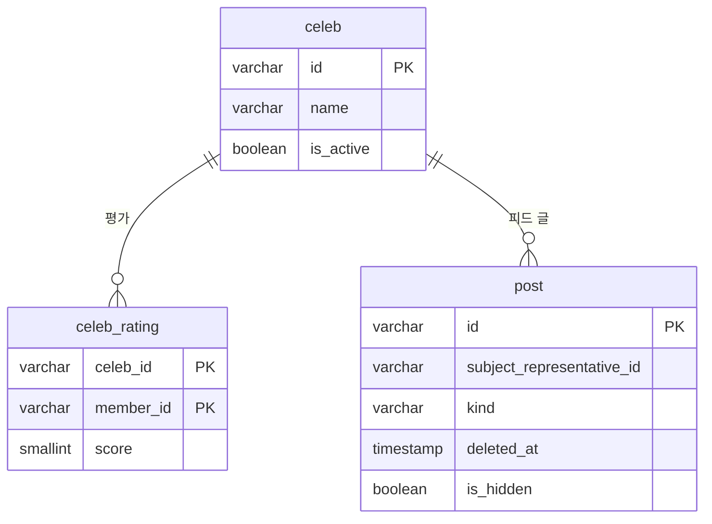

[앞 글](/blog/prd-load-test-100rps/)에서 실제 요청 비율 그대로 100 RPS까지 부하를 걸었습니다.
그때 한 건에 가장 오래 걸린 요청은 정치인 목록을 인기순으로 부르는 요청이었습니다. 요청 수로는 0.5%인데 서버 처리 시간의 7.9%를 썼고, 필터 없이 부르면 한 건에 0.7\~1.2초가 걸렸습니다.
앱의 피드 주제 선택 화면이 이 요청으로 상위 10명을 불러오기 때문에, 실제 사용자가 기다리는 시간이기도 합니다.
이 글은 그 쿼리의 실행 계획을 보고 고친 과정입니다.

결과를 먼저 요약하면 이렇습니다.

- 평가도 글도 없는 정치인까지 목록에 남기려면 LEFT JOIN은 필요했습니다. 문제는 서로 상관없는 일대다 관계 두 개(평가, 글)를 한 번에 붙여 활성 정치인 4,566명이 87,790행으로 곱해진 것이었습니다. `COUNT(DISTINCT)`는 개수만 바로잡을 뿐이라, 이 행들을 정렬하다 `work_mem`(4MB)을 넘겨 디스크를 쓰고 있었습니다.
- 평가와 글을 정치인별로 먼저 센 뒤 붙이도록 바꾸니 같은 조건과 바인드 값에서 661ms가 8.1ms가 됐습니다. 돌려주는 순서는 처음부터 끝까지 같았습니다.
- 준비된 문장이 범용 계획으로 바뀌면 고친 쿼리가 오히려 느려지지만, 예상 비용이 40배 커서 PostgreSQL이 고르지 않는다는 것까지 확인했습니다.

- 앱에 반영해 배포하고 같은 재생 목록으로 100 RPS를 다시 걸었습니다. 필터 없는 인기순은 p50 766ms에서 32ms로, 인기순이 쓰던 서버 시간은 7.9%에서 1.0%로, RDS CPU 최대는 31.1%에서 20.2%로 줄었습니다.

## 느린 요청의 모양

인기순 정렬은 평가 수와 그 정치인 피드에 올라온 글 수를 더한 점수로 줄을 세웁니다. 쿼리는 이렇습니다.

```kotlin
// CelebJpaRepository (발췌)
@Query(
    """
    SELECT c.id FROM CelebJpaEntity c
    LEFT JOIN CelebRatingJpaEntity r ON r.celebId = c.id
    LEFT JOIN PostJpaEntity p ON p.subjectRepresentativeId = c.id
      AND p.kind = :feedKind
      AND p.deletedAt IS NULL
      AND p.isHidden = false
    WHERE c.isActive = true
      AND (
        :type IS NULL
        OR c.type = :type
        OR EXISTS (
          SELECT 1 FROM CelebConcurrentRoleJpaEntity cr
          WHERE cr.celebId = c.id AND cr.type = :concurrentType
        )
      )
      AND (:party IS NULL OR c.party = :party)
      AND (:gender IS NULL OR c.gender = :gender)
      AND (:keyword IS NULL OR c.name LIKE CONCAT('%', CAST(:keyword AS string), '%'))
    GROUP BY c.id, c.name
    ORDER BY (COUNT(DISTINCT r.memberId) + COUNT(DISTINCT p.id)) DESC, c.name ASC, c.id ASC
    """,
)
fun findPopularCelebIds(
    @Param("type") type: CelebType?,
    @Param("concurrentType") concurrentType: ConcurrentRoleType?,
    @Param("party") party: PartyType?,
    @Param("gender") gender: Gender?,
    @Param("keyword") keyword: String?,
    @Param("feedKind") feedKind: PostKind,
    pageable: Pageable,
): List<String>
```

이 집계는 페이지를 부를 때마다 조건에 맞는 정치인 전체를 대상으로 새로 합니다.

부하 중 트레이스를 하나 열어 보니 907ms 가운데 이 SQL이 861ms(95%)였습니다.

<figure class="diagram">

<figcaption>민주당 소속으로 좁힌 인기순 요청 한 건(19:39:46)의 스팬 요약. 집계 쿼리가 861ms, 이어서 인물 정보를 읽는 쿼리가 39ms였습니다. 컨트롤러 줄의 빨간 표시는 시험이 중단되며 k6가 연결을 먼저 끊어 응답을 쓰지 못한 오류(Broken pipe)입니다. <a href="/images/prd-load-test-100rps/popular-trace-spans.png" target="_blank" rel="noopener">크게 보기</a></figcaption>
</figure>

필터에 따라 걸리는 시간이 크게 달랐습니다(앞 글의 100 RPS 구간).

| 호출 형태 | 집계 대상 | 혼자 돌 때 (p50) | 다른 인기순 요청과 겹칠 때 (p50) |
| --- | ---: | --- | --- |
| 필터 없음 | 4,566명 | 766ms (6건) | 834ms (10건, 최대 1,236ms) |
| 민주당만 | 2,455명 | 624ms (8건) | 864ms (4건, 최대 1,204ms) |
| 다른 정당만 | — | 64ms (11건) | 118ms (2건) |
| 직위 지정 | — | 30ms (75건) | 24ms (8건) |

집계할 정치인이 많을수록 느리고, 다른 인기순 요청과 겹치면 1초를 넘깁니다.
앞 글에서는 이 쿼리가 도는 동안 시작된 다른 요청의 p99가 142ms로, 그렇지 않은 요청(81ms)보다 1.8배 긴 것도 봤습니다.

## 실행 계획으로 본 원인

DB에서 읽기 전용 트랜잭션을 열고, 앱이 보내는 SQL을 그대로 `PREPARE`한 뒤 같은 바인드 값으로 `EXPLAIN (ANALYZE, BUFFERS)`를 실행했습니다.
SQL은 코드에서 뽑았습니다. `CelebJpaRepository`를 앱과 같은 Hibernate 6.6.13과 PostgreSQL 방언으로 실행하고, JDBC로 나가기 직전의 문자열을 Hibernate의 `StatementInspector`로 받았습니다. 아래에는 읽기 좋게 줄만 바꿨고, `?`를 `$1`, `$2`…로 바꿔 `PREPARE`했습니다. 값이 비어 있어도 항상 붙는 `$2 is null or ...` 같은 조건도 그대로입니다.

먼저 데이터 규모와 DB 설정입니다.

| 항목 | 값 |
| --- | ---: |
| 활성 정치인 | 4,566명 |
| 평가 (`celeb_rating`) | 10,525건 |
| 정치인 피드 글 (`post`, 공개) | 306건 |
| 정렬용 메모리 (`work_mem`) | 4MB |
| PostgreSQL | 16.13 (RDS `db.t4g.micro`) |

원래 쿼리입니다. 앱의 피드 주제 선택 화면처럼 첫 페이지를 부르면 Hibernate는 `offset` 없이 `fetch first`만 붙입니다.

```sql
PREPARE pop_first(varchar, varchar, varchar, varchar, varchar,
                  varchar, varchar, varchar, varchar, varchar, int) AS
select cje1_0.id
from celeb cje1_0
left join celeb_rating crje1_0 on crje1_0.celeb_id=cje1_0.id
left join post pje1_0 on pje1_0.subject_representative_id=cje1_0.id
  and pje1_0.kind=$1 and pje1_0.deleted_at is null and pje1_0.is_hidden=false
where cje1_0.is_active=true
  and ($2 is null or cje1_0.type=$3
       or exists(select 1 from celeb_concurrent_role ccrje1_0 where ccrje1_0.celeb_id=cje1_0.id and ccrje1_0.type=$4))
  and ($5 is null or cje1_0.party=$6)
  and ($7 is null or cje1_0.gender=$8)
  and ($9 is null or cje1_0.name like ('%'||cast($10 as text)||'%') escape '')
group by cje1_0.id,cje1_0.name
order by (count(distinct crje1_0.member_id)+count(distinct pje1_0.id)) desc,cje1_0.name,cje1_0.id
fetch first $11 rows only;

-- 앱 주제 선택 화면과 같은 값: 필터 없음, 앞에서 10명
EXPLAIN (ANALYZE, BUFFERS)
EXECUTE pop_first('OFFICIAL_FEED', NULL, NULL, NULL, NULL, NULL,
                  NULL, NULL, NULL, NULL, 10);
```

실행 계획에서 시간이 어디에 들었는지는 분명했습니다.

- 조인은 30ms 만에 끝납니다. 평가를 붙이면 13,721행, 글까지 붙이면 87,790행이 됩니다.
- `COUNT(DISTINCT)`를 계산하려고 PostgreSQL은 87,790행을 (정치인 id, 평가한 회원 id) 순으로 정렬합니다. 9.4MB라 정렬용 메모리 `work_mem`(4MB)을 넘어 디스크로 내려갑니다(external merge, 9,416kB).
- 실행 시간 661ms 가운데 조인 뒤의 630ms가 이 정렬과 집계에 들었습니다.

<details>
<summary>실행 계획 원본: 원래 쿼리 (661ms)</summary>

```
QUERY PLAN
-------------------------------------------------------------------------------------------------------------------------------------------------------------------
 Limit  (cost=1998.79..1998.81 rows=10 width=47) (actual time=660.003..660.011 rows=10 loops=1)
   Buffers: shared hit=668, temp read=1177 written=1180
   I/O Timings: temp read=2.385 write=10.262
   ->  Sort  (cost=1998.79..2010.20 rows=4566 width=47) (actual time=660.001..660.008 rows=10 loops=1)
         Sort Key: ((count(DISTINCT crje1_0.member_id) + count(DISTINCT pje1_0.id))) DESC, cje1_0.name, cje1_0.id
         Sort Method: top-N heapsort  Memory: 26kB
         Buffers: shared hit=668, temp read=1177 written=1180
         I/O Timings: temp read=2.385 write=10.262
         ->  GroupAggregate  (cost=1738.56..1900.12 rows=4566 width=47) (actual time=473.412..657.567 rows=4566 loops=1)
               Group Key: cje1_0.id
               Buffers: shared hit=662, temp read=1177 written=1180
               I/O Timings: temp read=2.385 write=10.262
               ->  Sort  (cost=1738.56..1764.68 rows=10448 width=102) (actual time=447.437..487.824 rows=87790 loops=1)
                     Sort Key: cje1_0.id, crje1_0.member_id
                     Sort Method: external merge  Disk: 9416kB
                     Buffers: shared hit=662, temp read=1177 written=1180
                     I/O Timings: temp read=2.385 write=10.262
                     ->  Hash Right Join  (cost=984.30..1041.11 rows=10448 width=102) (actual time=12.185..29.767 rows=87790 loops=1)
                           Hash Cond: ((pje1_0.subject_representative_id)::text = (cje1_0.id)::text)
                           Buffers: shared hit=662
                           ->  Seq Scan on post pje1_0  (cost=0.00..50.81 rows=310 width=63) (actual time=0.020..0.364 rows=306 loops=1)
                                 Filter: ((deleted_at IS NULL) AND (NOT is_hidden) AND ((kind)::text = 'OFFICIAL_FEED'::text))
                                 Rows Removed by Filter: 325
                                 Buffers: shared hit=43
                           ->  Hash  (cost=853.70..853.70 rows=10448 width=70) (actual time=12.117..12.120 rows=13721 loops=1)
                                 Buckets: 16384  Batches: 1  Memory Usage: 1423kB
                                 Buffers: shared hit=619
                                 ->  Hash Right Join  (cost=442.75..853.70 rows=10448 width=70) (actual time=3.269..8.754 rows=13721 loops=1)
                                       Hash Cond: ((crje1_0.celeb_id)::text = (cje1_0.id)::text)
                                       Buffers: shared hit=619
                                       ->  Seq Scan on celeb_rating crje1_0  (cost=0.00..383.50 rows=10450 width=62) (actual time=0.005..1.237 rows=10525 loops=1)
                                             Buffers: shared hit=279
                                       ->  Hash  (cost=385.67..385.67 rows=4566 width=39) (actual time=3.234..3.235 rows=4566 loops=1)
                                             Buckets: 8192  Batches: 1  Memory Usage: 390kB
                                             Buffers: shared hit=340
                                             ->  Seq Scan on celeb cje1_0  (cost=0.00..385.67 rows=4566 width=39) (actual time=0.011..2.167 rows=4566 loops=1)
                                                   Filter: is_active
                                                   Rows Removed by Filter: 1
                                                   Buffers: shared hit=340
 Planning:
   Buffers: shared hit=477
 Planning Time: 7.518 ms
 Execution Time: 661.475 ms
(43 rows)
```

</details>

## LEFT JOIN을 두 개 쓴 이유



정치인 한 명에게 평가도 여러 개, 피드 글도 여러 개 붙습니다. 인기순은 이 두 개수를 더한 점수로 정치인 전체를 줄 세우는 목록이라, 평가도 글도 없는 정치인도 0점으로 목록 끝에 나와야 합니다. 그래서 LEFT JOIN을 썼고, 인수 테스트도 이 경우를 확인합니다.

| 인물 | 평가 | 보이는 글 | 점수 | 인기순 |
| --- | ---: | --- | ---: | ---: |
| 다인기 | 1 | 3 | 4 | 1위 |
| 나평가 | 3 | 0 | 3 | 2위 |
| 가조용 | 0 | 0 (지운 글 2, 숨긴 글 2) | 0 | 3위 |

INNER JOIN이면 평가와 글이 둘 다 있는 다인기만 남습니다. 지운 글과 숨긴 글을 거르는 조건을 `ON`에 둔 것도 같은 이유입니다. `WHERE`에 두면 글이 없는 정치인이 결과에서 빠집니다.

문제는 평가와 글을 한 번에 붙인 데 있었습니다. 평가 3개, 글 4개인 정치인은 조인하면 3 × 4 = 12행이 됩니다. `COUNT(DISTINCT)`로 세면 개수는 평가 3, 글 4로 맞게 나오지만, 12행을 만들어 정렬하는 일은 그대로 합니다.

테스트 데이터에서는 조인 행이 다 합쳐 7행(1×3 + 3×1 + 1×1)이었습니다. 실제 데이터로 같은 식을 계산하면 이렇습니다. 평가나 글이 없으면 1로 셉니다.

| 항목 | 값 |
| --- | ---: |
| 활성 정치인 | 4,566명 |
| 평가가 있는 정치인 | 1,328명 |
| 피드 글이 있는 정치인 | 83명 (모두 평가도 있음) |
| 평가 수 × 글 수의 합 | 87,790행 |
| 그중 평가와 글이 모두 있는 83명의 몫 | 78,416행 (89%) |

이 합은 실행 계획의 87,790행과 같고, 평가만 붙인 단계의 13,721행도 같습니다.
행은 몇 명에게 몰려 있었습니다. 평가 577개, 글 82개인 정치인 한 명이 47,314행으로 전체의 54%였고, 상위 여섯 명이 83%였습니다. 이 여섯 명은 평가가 142\~577개, 글이 15\~82개였습니다. 평가와 글이 같은 정치인에게 쌓이니 행 수는 두 수의 곱으로 늘어납니다.

그래서 고친 쿼리도 LEFT JOIN은 그대로 두고, 평가와 글을 정치인별로 먼저 센 결과를 붙였습니다.

<details>
<summary>계산에 쓴 쿼리와 결과</summary>

```sql
-- 정치인별 평가 수와 공개 피드 글 수를 세고, 조인했을 때 생기는 행 수를 더한다
WITH r AS (SELECT celeb_id, count(*) AS n FROM celeb_rating GROUP BY celeb_id),
     p AS (SELECT subject_representative_id AS celeb_id, count(*) AS n FROM post
           WHERE kind = 'OFFICIAL_FEED' AND deleted_at IS NULL AND is_hidden = false
           GROUP BY subject_representative_id),
     x AS (SELECT coalesce(r.n, 0) AS rn, coalesce(p.n, 0) AS pn
           FROM celeb c LEFT JOIN r ON r.celeb_id = c.id LEFT JOIN p ON p.celeb_id = c.id
           WHERE c.is_active)
SELECT count(*)                                              AS active_celebs,
       sum(greatest(rn, 1))                                  AS rows_after_rating_join,
       sum(greatest(rn, 1) * greatest(pn, 1))                AS rows_after_post_join,
       count(*) FILTER (WHERE rn > 0)                        AS celebs_with_ratings,
       count(*) FILTER (WHERE pn > 0)                        AS celebs_with_posts,
       count(*) FILTER (WHERE rn > 0 AND pn > 0)             AS celebs_with_both,
       sum(rn * pn) FILTER (WHERE rn > 0 AND pn > 0)         AS rows_from_both,
       count(*) FILTER (WHERE rn = 0 AND pn = 0)             AS celebs_with_neither
FROM x;
```

```
 active_celebs | rows_after_rating_join | rows_after_post_join | celebs_with_ratings | celebs_with_posts | celebs_with_both | rows_from_both | celebs_with_neither
---------------+------------------------+----------------------+---------------------+-------------------+------------------+----------------+---------------------
          4566 |                  13721 |                87790 |                1328 |                83 |               83 |          78416 |                3238
```

```sql
-- 조인 행이 많은 순 상위 10명(이름은 읽지 않음)
WITH r AS (SELECT celeb_id, count(*) AS n FROM celeb_rating GROUP BY celeb_id),
     p AS (SELECT subject_representative_id AS celeb_id, count(*) AS n FROM post
           WHERE kind = 'OFFICIAL_FEED' AND deleted_at IS NULL AND is_hidden = false
           GROUP BY subject_representative_id),
     x AS (SELECT coalesce(r.n, 0) AS rn, coalesce(p.n, 0) AS pn,
                  greatest(coalesce(r.n, 0), 1) * greatest(coalesce(p.n, 0), 1) AS rows
           FROM celeb c LEFT JOIN r ON r.celeb_id = c.id LEFT JOIN p ON p.celeb_id = c.id
           WHERE c.is_active)
SELECT rn AS ratings, pn AS posts, rows,
       round(100.0 * sum(rows) OVER (ORDER BY rows DESC ROWS BETWEEN UNBOUNDED PRECEDING AND CURRENT ROW)
             / sum(rows) OVER (), 1) AS cum_pct
FROM x ORDER BY rows DESC LIMIT 10;
```

```
 ratings | posts | rows  | cum_pct
---------+-------+-------+---------
     577 |    82 | 47314 |    53.9
     388 |    32 | 12416 |    68.0
     226 |    23 |  5198 |    74.0
     188 |    17 |  3196 |    77.6
     171 |    17 |  2907 |    80.9
     142 |    15 |  2130 |    83.3
     113 |     5 |   565 |    84.0
      91 |     5 |   455 |    84.5
      67 |     5 |   335 |    84.9
      80 |     4 |   320 |    85.2
```

</details>

## 조인하기 전에 세기

실행 계획을 보면 느린 이유는 세는 일 자체가 아니라 곱해진 행을 정렬하는 데 있었습니다. 그래서 스키마는 그대로 두고 쿼리만 바꿔 봤습니다.

평가와 글을 정치인별로 먼저 센 뒤 붙이도록 바꾼 쿼리입니다. 위 SQL에서 조인, `group by`, `order by`만 바꿨고 조건과 바인드 값은 같습니다.

```sql
PREPARE fix_first(varchar, varchar, varchar, varchar, varchar,
                  varchar, varchar, varchar, varchar, varchar, int) AS
select cje1_0.id
from celeb cje1_0
left join (select celeb_id,count(*) as n
           from celeb_rating group by celeb_id) r on r.celeb_id=cje1_0.id
left join (select subject_representative_id as celeb_id,count(*) as n
           from post
           where kind=$1 and deleted_at is null and is_hidden=false
           group by subject_representative_id) p on p.celeb_id=cje1_0.id
where cje1_0.is_active=true
  and ($2 is null or cje1_0.type=$3
       or exists(select 1 from celeb_concurrent_role ccrje1_0 where ccrje1_0.celeb_id=cje1_0.id and ccrje1_0.type=$4))
  and ($5 is null or cje1_0.party=$6)
  and ($7 is null or cje1_0.gender=$8)
  and ($9 is null or cje1_0.name like ('%'||cast($10 as text)||'%') escape '')
order by coalesce(r.n,0)+coalesce(p.n,0) desc,cje1_0.name,cje1_0.id
fetch first $11 rows only;
```

| | 원래 쿼리 | 개선안 |
| --- | --- | --- |
| 실행 시간 | 661ms (한 번 더 실행하면 657ms) | 8.1ms |
| 조인한 뒤 행 수 | 87,790 | 4,566 |
| 집계 방식 | `COUNT(DISTINCT)`를 위해 87,790행을 정렬 | 조인 전에 정치인별로 집계 |
| 정렬 | 디스크로 넘침 (external merge, 9,416kB) | 상위 10명만 추림 (top-N heapsort, 27kB) |
| 임시 파일 | 읽기 1,177블록, 쓰기 1,180블록 | 없음 |

- 개선안은 조인하기 전에 정치인별로 세어 두니 곱해질 게 없습니다. 평가 테이블의 기본키가 (celeb_id, member_id)이고 글은 id가 기본키라, 정치인별 `count(*)`는 원래의 `COUNT(DISTINCT)`와 같은 값입니다.
- 두 쿼리를 페이지 제한 없이 끝까지 실행해 돌려주는 순서를 비교했습니다. 필터가 없을 때(4,566명)와 민주당만 부를 때(2,455명) 모두 같았습니다.

<details>
<summary>실행 계획 원본: 개선안 (8.1ms)</summary>

```
QUERY PLAN
-----------------------------------------------------------------------------------------------------------------------------------------------------------------------------------------------
 Limit  (cost=963.35..963.38 rows=10 width=47) (actual time=8.046..8.053 rows=10 loops=1)
   Buffers: shared hit=594
   ->  Sort  (cost=963.35..974.77 rows=4566 width=47) (actual time=8.044..8.050 rows=10 loops=1)
         Sort Key: ((COALESCE(r.n, '0'::bigint) + COALESCE(p.n, '0'::bigint))) DESC, cje1_0.name, cje1_0.id
         Sort Method: top-N heapsort  Memory: 27kB
         Buffers: shared hit=594
         ->  Hash Left Join  (cost=443.60..864.68 rows=4566 width=47) (actual time=3.556..7.264 rows=4566 loops=1)
               Hash Cond: ((cje1_0.id)::text = (p.celeb_id)::text)
               Buffers: shared hit=594
               ->  Hash Left Join  (cost=388.19..785.85 rows=4566 width=47) (actual time=3.232..5.958 rows=4566 loops=1)
                     Hash Cond: ((cje1_0.id)::text = (r.celeb_id)::text)
                     Buffers: shared hit=551
                     ->  Seq Scan on celeb cje1_0  (cost=0.00..385.67 rows=4566 width=39) (actual time=0.012..1.601 rows=4566 loops=1)
                           Filter: is_active
                           Rows Removed by Filter: 1
                           Buffers: shared hit=340
                     ->  Hash  (cost=371.69..371.69 rows=1320 width=39) (actual time=3.215..3.216 rows=1329 loops=1)
                           Buckets: 2048  Batches: 1  Memory Usage: 109kB
                           Buffers: shared hit=211
                           ->  Subquery Scan on r  (cost=0.29..371.69 rows=1320 width=39) (actual time=0.110..2.957 rows=1329 loops=1)
                                 Buffers: shared hit=211
                                 ->  GroupAggregate  (cost=0.29..358.49 rows=1320 width=39) (actual time=0.110..2.795 rows=1329 loops=1)
                                       Group Key: celeb_rating.celeb_id
                                       Buffers: shared hit=211
                                       ->  Index Only Scan using idx_celeb_rating_celeb on celeb_rating  (cost=0.29..293.04 rows=10450 width=31) (actual time=0.012..1.258 rows=10525 loops=1)
                                             Heap Fetches: 302
                                             Buffers: shared hit=211
               ->  Hash  (cost=54.24..54.24 rows=94 width=39) (actual time=0.318..0.319 rows=84 loops=1)
                     Buckets: 1024  Batches: 1  Memory Usage: 14kB
                     Buffers: shared hit=43
                     ->  Subquery Scan on p  (cost=52.36..54.24 rows=94 width=39) (actual time=0.276..0.300 rows=84 loops=1)
                           Buffers: shared hit=43
                           ->  HashAggregate  (cost=52.36..53.30 rows=94 width=39) (actual time=0.275..0.288 rows=84 loops=1)
                                 Group Key: post.subject_representative_id
                                 Batches: 1  Memory Usage: 32kB
                                 Buffers: shared hit=43
                                 ->  Seq Scan on post  (cost=0.00..50.81 rows=310 width=31) (actual time=0.007..0.188 rows=306 loops=1)
                                       Filter: ((deleted_at IS NULL) AND (NOT is_hidden) AND ((kind)::text = 'OFFICIAL_FEED'::text))
                                       Rows Removed by Filter: 325
                                       Buffers: shared hit=43
 Planning:
   Buffers: shared hit=3
 Planning Time: 1.212 ms
 Execution Time: 8.124 ms
(44 rows)
```

</details>

<details>
<summary>두 쿼리의 순서가 같은지 확인한 방법</summary>

```sql
-- 같은 트랜잭션에서 페이지 크기를 전체보다 크게 주고 결과를 파일로 받았다
\o pop-all.txt
EXECUTE pop_first('OFFICIAL_FEED', NULL, NULL, NULL, NULL, NULL,
                  NULL, NULL, NULL, NULL, 100000);
\o fix-all.txt
EXECUTE fix_first('OFFICIAL_FEED', NULL, NULL, NULL, NULL, NULL,
                  NULL, NULL, NULL, NULL, 100000);
\o pop-dem.txt
EXECUTE pop_page('OFFICIAL_FEED', NULL, NULL, NULL, 'DEMOCRATIC', 'DEMOCRATIC',
                 NULL, NULL, NULL, NULL, 0, 100000);
\o fix-dem.txt
EXECUTE fix_page('OFFICIAL_FEED', NULL, NULL, NULL, 'DEMOCRATIC', 'DEMOCRATIC',
                 NULL, NULL, NULL, NULL, 0, 100000);
```

```
$ cmp pop-all.txt fix-all.txt && cmp pop-dem.txt fix-dem.txt && echo same
same
$ wc -l pop-all.txt pop-dem.txt
    4566 pop-all.txt
    2455 pop-dem.txt
```

</details>

## 다른 방법은 없었나

쿼리를 고치기 전에 다른 방법도 따져 봤습니다.

| 방법 | 근거 | 판단 |
| --- | --- | --- |
| `work_mem` 올리기 | 디스크 정렬(9.4MB)이 `work_mem` 4MB를 넘어서 생김 | 디스크 정렬은 없어져도 곱해진 행을 만들어 세는 일은 그대로. 1GB 인스턴스에서 정렬·커넥션마다 잡히는 메모리라 올리기 부담 |
| 캐시 | 서버에는 캐시가 없고, 앱이 기기마다 5분 캐시함. 앱의 주제 선택 화면은 검색 결과도 인기순으로 받음 | 검색어마다 결과가 달라 캐시로 못 덮음. 조인 행이 가장 많은 정치인 이름으로 검색하면 413ms(개선안 5.3ms) |
| 평가 수와 글 수를 미리 세어 두기 (카운터) | 글 인기순이 이미 이 방식(댓글 수·반응 수 컬럼) | 읽기는 가장 빠름. 대신 평가 남기기·취소, 피드 글 쓰기·삭제 네 곳을 고쳐야 하고, 정치인 명단을 합치는 마이그레이션처럼 서비스를 거치지 않는 변경이 있어 주기적으로 다시 세는 작업도 필요 |
| 주기적으로 집계해 저장 (스냅샷) | 인기 정치인 순위가 이미 하루 두 번 이 방식 | 평가를 남겨도 다음 집계까지 순위가 안 바뀜. 개선안이 이미 10ms 안팎이라 신선도를 포기할 이유가 없음 |

느린 원인이 쿼리 모양에 있으니 쿼리를 고치기로 했습니다. 미리 세어 두는 방법은 개선안이 요청마다 평가 전체를 세는 비용(지금 1만 건에 4.4ms)이 커지면 다시 보려고 합니다.

<details>
<summary>검색에서 잰 쿼리와 실행 계획</summary>

조인 행이 가장 많은 정치인의 이름을 psql 변수로 넣어, 앞에서 준비한 원래 쿼리(`pop_first`)와 개선안(`fix_first`)을 실행했습니다. 이름은 결과에서 가렸습니다.

```sql
-- 412.845ms
EXPLAIN (ANALYZE, BUFFERS) EXECUTE pop_first('OFFICIAL_FEED',NULL,NULL,NULL,NULL,NULL,NULL,NULL,:'topname',:'topname',10);
-- 5.251ms
EXPLAIN (ANALYZE, BUFFERS) EXECUTE fix_first('OFFICIAL_FEED',NULL,NULL,NULL,NULL,NULL,NULL,NULL,:'topname',:'topname',10);
```

```
QUERY PLAN
-------------------------------------------------------------------------------------------------------------------------------------------------------------------------------
 Limit  (cost=413.94..413.95 rows=1 width=47) (actual time=411.498..411.502 rows=2 loops=1)
   Buffers: shared hit=2005, temp read=660 written=661
   I/O Timings: temp read=1.402 write=5.956
   ->  Sort  (cost=413.94..413.95 rows=1 width=47) (actual time=411.496..411.500 rows=2 loops=1)
         Sort Key: ((count(DISTINCT crje1_0.member_id) + count(DISTINCT pje1_0.id))) DESC, cje1_0.name, cje1_0.id
         Sort Method: quicksort  Memory: 25kB
         Buffers: shared hit=2005, temp read=660 written=661
         I/O Timings: temp read=1.402 write=5.956
         ->  GroupAggregate  (cost=413.90..413.93 rows=1 width=47) (actual time=262.671..411.488 rows=2 loops=1)
               Group Key: cje1_0.id
               Buffers: shared hit=2005, temp read=660 written=661
               I/O Timings: temp read=1.402 write=5.956
               ->  Sort  (cost=413.90..413.90 rows=2 width=102) (actual time=262.647..274.392 rows=47315 loops=1)
                     Sort Key: cje1_0.id, crje1_0.member_id
                     Sort Method: external merge  Disk: 5280kB
                     Buffers: shared hit=2005, temp read=660 written=661
                     I/O Timings: temp read=1.402 write=5.956
                     ->  Nested Loop Left Join  (cost=0.69..413.89 rows=2 width=102) (actual time=0.352..17.099 rows=47315 loops=1)
                           Buffers: shared hit=2005
                           ->  Nested Loop Left Join  (cost=0.28..409.26 rows=1 width=71) (actual time=0.334..1.928 rows=83 loops=1)
                                 Buffers: shared hit=361
                                 ->  Seq Scan on celeb cje1_0  (cost=0.00..397.09 rows=1 width=39) (actual time=0.317..1.763 rows=2 loops=1)
                                       Filter: (is_active AND ((name)::text ~~ '%<검색어>%'::text))
                                       Rows Removed by Filter: 4565
                                       Buffers: shared hit=340
                                 ->  Index Scan using idx_post_kind_subject on post pje1_0  (cost=0.28..12.15 rows=2 width=63) (actual time=0.014..0.070 rows=41 loops=2)
                                       Index Cond: (((kind)::text = 'OFFICIAL_FEED'::text) AND ((subject_representative_id)::text = (cje1_0.id)::text))
                                       Filter: ((deleted_at IS NULL) AND (NOT is_hidden))
                                       Rows Removed by Filter: 14
                                       Buffers: shared hit=21
                           ->  Index Only Scan using celeb_rating_pkey on celeb_rating crje1_0  (cost=0.41..4.55 rows=8 width=62) (actual time=0.007..0.106 rows=570 loops=83)
                                 Index Cond: (celeb_id = (cje1_0.id)::text)
                                 Heap Fetches: 2460
                                 Buffers: shared hit=1644
 Planning:
   Buffers: shared hit=26
 Planning Time: 0.807 ms
 Execution Time: 412.845 ms
(38 rows)
```

</details>

## 부하 중 861ms와 실행 계획의 564ms

위 트레이스의 민주당 요청과 같은 값으로도 떠 봤습니다. 816번째부터 부르면 Hibernate는 끝을 `offset ? rows fetch first ? rows only`로 만들기 때문에, 그 SQL을 따로 준비했습니다(`pop_page`, `fix_page`). 끝부분 말고는 위와 같습니다.

```sql
-- 트레이스의 요청과 같은 값: 민주당, 816번째부터 48명
EXPLAIN (ANALYZE, BUFFERS)
EXECUTE pop_page('OFFICIAL_FEED', NULL, NULL, NULL, 'DEMOCRATIC', 'DEMOCRATIC',
                 NULL, NULL, NULL, NULL, 816, 48);
```

<details>
<summary>민주당 요청에 쓴 SQL 전체</summary>

```sql
PREPARE pop_page(varchar, varchar, varchar, varchar, varchar,
                 varchar, varchar, varchar, varchar, varchar, int, int) AS
select cje1_0.id
from celeb cje1_0
left join celeb_rating crje1_0 on crje1_0.celeb_id=cje1_0.id
left join post pje1_0 on pje1_0.subject_representative_id=cje1_0.id
  and pje1_0.kind=$1 and pje1_0.deleted_at is null and pje1_0.is_hidden=false
where cje1_0.is_active=true
  and ($2 is null or cje1_0.type=$3
       or exists(select 1 from celeb_concurrent_role ccrje1_0 where ccrje1_0.celeb_id=cje1_0.id and ccrje1_0.type=$4))
  and ($5 is null or cje1_0.party=$6)
  and ($7 is null or cje1_0.gender=$8)
  and ($9 is null or cje1_0.name like ('%'||cast($10 as text)||'%') escape '')
group by cje1_0.id,cje1_0.name
order by (count(distinct crje1_0.member_id)+count(distinct pje1_0.id)) desc,cje1_0.name,cje1_0.id
offset $11 rows fetch first $12 rows only;

PREPARE fix_page(varchar, varchar, varchar, varchar, varchar,
                 varchar, varchar, varchar, varchar, varchar, int, int) AS
select cje1_0.id
from celeb cje1_0
left join (select celeb_id,count(*) as n
           from celeb_rating group by celeb_id) r on r.celeb_id=cje1_0.id
left join (select subject_representative_id as celeb_id,count(*) as n
           from post
           where kind=$1 and deleted_at is null and is_hidden=false
           group by subject_representative_id) p on p.celeb_id=cje1_0.id
where cje1_0.is_active=true
  and ($2 is null or cje1_0.type=$3
       or exists(select 1 from celeb_concurrent_role ccrje1_0 where ccrje1_0.celeb_id=cje1_0.id and ccrje1_0.type=$4))
  and ($5 is null or cje1_0.party=$6)
  and ($7 is null or cje1_0.gender=$8)
  and ($9 is null or cje1_0.name like ('%'||cast($10 as text)||'%') escape '')
order by coalesce(r.n,0)+coalesce(p.n,0) desc,cje1_0.name,cje1_0.id
offset $11 rows fetch first $12 rows only;
```

</details>

| | 원래 쿼리 | 개선안 |
| --- | --- | --- |
| 실행 시간 | 564ms (한 번 더 실행하면 565ms) | 17.4ms |
| 집계 대상 | 민주당 활성 정치인 2,455명 | 같음 |
| 조인한 뒤 행 수 | 74,029 | 2,455 |
| 정렬 | 디스크로 넘침 (external merge, 8,072kB) | 상위 48명만 추림 (top-N heapsort, 243kB) |
| 임시 파일 | 읽기 1,009블록, 쓰기 1,011블록 | 없음 |

트레이스에 찍힌 861ms는 100 RPS 부하 중에 잰 값이라, 한가한 DB에서 뜬 564ms보다 깁니다.
같은 부하 중에도 이 형태의 요청은 다른 인기순과 겹치지 않으면 600\~754ms, 겹치면 1,204ms까지 걸렸습니다.
DB CPU를 다른 요청과 나눠 쓰는 만큼 늘어난 것으로 봅니다.

<details>
<summary>실행 계획 원본: 민주당, 원래 쿼리 (564ms)</summary>

```
QUERY PLAN
-------------------------------------------------------------------------------------------------------------------------------------------------------------------
 Limit  (cost=1534.16..1534.28 rows=48 width=47) (actual time=561.857..561.871 rows=48 loops=1)
   Buffers: shared hit=662, temp read=1009 written=1011
   I/O Timings: temp read=1.995 write=8.423
   ->  Sort  (cost=1532.12..1538.25 rows=2454 width=47) (actual time=561.764..561.821 rows=864 loops=1)
         Sort Key: ((count(DISTINCT crje1_0.member_id) + count(DISTINCT pje1_0.id))) DESC, cje1_0.name, cje1_0.id
         Sort Method: top-N heapsort  Memory: 235kB
         Buffers: shared hit=662, temp read=1009 written=1011
         I/O Timings: temp read=1.995 write=8.423
         ->  GroupAggregate  (cost=1313.33..1400.16 rows=2454 width=47) (actual time=398.901..552.979 rows=2455 loops=1)
               Group Key: cje1_0.id
               Buffers: shared hit=662, temp read=1009 written=1011
               I/O Timings: temp read=1.995 write=8.423
               ->  Sort  (cost=1313.33..1327.37 rows=5615 width=102) (actual time=373.195..399.959 rows=74029 loops=1)
                     Sort Key: cje1_0.id, crje1_0.member_id
                     Sort Method: external merge  Disk: 8072kB
                     Buffers: shared hit=662, temp read=1009 written=1011
                     I/O Timings: temp read=1.995 write=8.423
                     ->  Hash Right Join  (cost=908.90..963.66 rows=5615 width=102) (actual time=7.694..21.987 rows=74029 loops=1)
                           Hash Cond: ((pje1_0.subject_representative_id)::text = (cje1_0.id)::text)
                           Buffers: shared hit=662
                           ->  Seq Scan on post pje1_0  (cost=0.00..50.81 rows=310 width=63) (actual time=0.011..0.312 rows=306 loops=1)
                                 Filter: ((deleted_at IS NULL) AND (NOT is_hidden) AND ((kind)::text = 'OFFICIAL_FEED'::text))
                                 Rows Removed by Filter: 325
                                 Buffers: shared hit=43
                           ->  Hash  (cost=838.72..838.72 rows=5615 width=70) (actual time=7.669..7.673 rows=6751 loops=1)
                                 Buckets: 8192  Batches: 1  Memory Usage: 697kB
                                 Buffers: shared hit=619
                                 ->  Hash Right Join  (cost=427.76..838.72 rows=5615 width=70) (actual time=2.207..6.165 rows=6751 loops=1)
                                       Hash Cond: ((crje1_0.celeb_id)::text = (cje1_0.id)::text)
                                       Buffers: shared hit=619
                                       ->  Seq Scan on celeb_rating crje1_0  (cost=0.00..383.50 rows=10450 width=62) (actual time=0.007..1.021 rows=10525 loops=1)
                                             Buffers: shared hit=279
                                       ->  Hash  (cost=397.09..397.09 rows=2454 width=39) (actual time=2.189..2.190 rows=2455 loops=1)
                                             Buckets: 4096  Batches: 1  Memory Usage: 207kB
                                             Buffers: shared hit=340
                                             ->  Seq Scan on celeb cje1_0  (cost=0.00..397.09 rows=2454 width=39) (actual time=0.008..1.659 rows=2455 loops=1)
                                                   Filter: (is_active AND ((party)::text = 'DEMOCRATIC'::text))
                                                   Rows Removed by Filter: 2112
                                                   Buffers: shared hit=340
 Planning:
   Buffers: shared hit=33
 Planning Time: 0.760 ms
 Execution Time: 563.609 ms
(43 rows)
```

</details>

<details>
<summary>실행 계획 원본: 민주당, 개선안 (17.4ms)</summary>

```
QUERY PLAN
-----------------------------------------------------------------------------------------------------------------------------------------------------------------------------------------------
 Limit  (cost=993.73..993.85 rows=48 width=47) (actual time=17.325..17.338 rows=48 loops=1)
   Buffers: shared hit=594
   ->  Sort  (cost=991.69..997.83 rows=2454 width=47) (actual time=17.227..17.288 rows=864 loops=1)
         Sort Key: ((COALESCE(r.n, '0'::bigint) + COALESCE(p.n, '0'::bigint))) DESC, cje1_0.name, cje1_0.id
         Sort Method: top-N heapsort  Memory: 243kB
         Buffers: shared hit=594
         ->  Hash Left Join  (cost=443.60..859.73 rows=2454 width=47) (actual time=3.572..6.650 rows=2455 loops=1)
               Hash Cond: ((cje1_0.id)::text = (p.celeb_id)::text)
               Buffers: shared hit=594
               ->  Hash Left Join  (cost=388.19..791.73 rows=2454 width=47) (actual time=3.240..5.781 rows=2455 loops=1)
                     Hash Cond: ((cje1_0.id)::text = (r.celeb_id)::text)
                     Buffers: shared hit=551
                     ->  Seq Scan on celeb cje1_0  (cost=0.00..397.09 rows=2454 width=39) (actual time=0.010..1.872 rows=2455 loops=1)
                           Filter: (is_active AND ((party)::text = 'DEMOCRATIC'::text))
                           Rows Removed by Filter: 2112
                           Buffers: shared hit=340
                     ->  Hash  (cost=371.69..371.69 rows=1320 width=39) (actual time=3.225..3.228 rows=1329 loops=1)
                           Buckets: 2048  Batches: 1  Memory Usage: 109kB
                           Buffers: shared hit=211
                           ->  Subquery Scan on r  (cost=0.29..371.69 rows=1320 width=39) (actual time=0.110..2.964 rows=1329 loops=1)
                                 Buffers: shared hit=211
                                 ->  GroupAggregate  (cost=0.29..358.49 rows=1320 width=39) (actual time=0.109..2.801 rows=1329 loops=1)
                                       Group Key: celeb_rating.celeb_id
                                       Buffers: shared hit=211
                                       ->  Index Only Scan using idx_celeb_rating_celeb on celeb_rating  (cost=0.29..293.04 rows=10450 width=31) (actual time=0.012..1.281 rows=10525 loops=1)
                                             Heap Fetches: 302
                                             Buffers: shared hit=211
               ->  Hash  (cost=54.24..54.24 rows=94 width=39) (actual time=0.317..0.319 rows=84 loops=1)
                     Buckets: 1024  Batches: 1  Memory Usage: 14kB
                     Buffers: shared hit=43
                     ->  Subquery Scan on p  (cost=52.36..54.24 rows=94 width=39) (actual time=0.277..0.300 rows=84 loops=1)
                           Buffers: shared hit=43
                           ->  HashAggregate  (cost=52.36..53.30 rows=94 width=39) (actual time=0.276..0.289 rows=84 loops=1)
                                 Group Key: post.subject_representative_id
                                 Batches: 1  Memory Usage: 32kB
                                 Buffers: shared hit=43
                                 ->  Seq Scan on post  (cost=0.00..50.81 rows=310 width=31) (actual time=0.007..0.192 rows=306 loops=1)
                                       Filter: ((deleted_at IS NULL) AND (NOT is_hidden) AND ((kind)::text = 'OFFICIAL_FEED'::text))
                                       Rows Removed by Filter: 325
                                       Buffers: shared hit=43
 Planning Time: 0.378 ms
 Execution Time: 17.414 ms
(42 rows)
```

</details>

## 범용 계획은 확인만 했다

실행 계획은 쿼리를 실행할 때마다 실제 값을 보고 새로 짜는 게 기본입니다(값에 맞춘 계획, custom plan). 그런데 이 앱은 JDBC 설정이 `prepareThreshold=5`라서, 같은 SQL을 한 커넥션에서 다섯 번째로 실행할 때부터 DB에 준비된 문장으로 올라갑니다. PostgreSQL은 준비된 문장을 몇 번 실행한 뒤 값을 보지 않고 한 번 짠 계획을 다시 쓸 수 있습니다(범용 계획, generic plan).

범용 계획에서는 `$5 is null` 같은 조건을 미리 지울 수 없어서, 정치인이 1명만 남는다고 잘못 짐작하고 정치인 한 명마다 글 테이블을 훑는 계획을 짭니다. 이 계획을 일부러 강제해 보면 원래 쿼리는 1,511ms, 개선안은 5초를 넘겼습니다.

다만 PostgreSQL은 범용 계획의 예상 비용이 값에 맞춘 계획보다 쌀 때만 바꿉니다. 개선안은 범용 38,198 대 값에 맞춘 963으로 40배 차이가 나고, 같은 문장을 반복 실행해 봐도 범용 계획은 한 번도 쓰이지 않았습니다. 부하 중에 잰 683\~852ms도 값에 맞춘 계획 쪽 시간입니다.
그래서 지금은 설정을 바꾸지 않았습니다. 관심순 응답이 갑자기 초 단위로 느려지면 JDBC 설정에 `plan_cache_mode=force_custom_plan`을 넣어 값에 맞춘 계획을 강제합니다.

<details>
<summary>실행 계획 원본: 원래 쿼리의 범용 계획 (1,511ms)</summary>

```
QUERY PLAN
---------------------------------------------------------------------------------------------------------------------------------------------------------------------------------------------------------------------------------------------------------------------------------------------------------------------------------------------------
 Limit  (cost=37813.73..37813.73 rows=1 width=47) (actual time=1508.463..1508.470 rows=10 loops=1)
   Buffers: shared hit=213863, temp read=1177 written=1180
   I/O Timings: temp read=2.662 write=11.638
   ->  Sort  (cost=37813.73..37813.73 rows=1 width=47) (actual time=1508.461..1508.466 rows=10 loops=1)
         Sort Key: ((count(DISTINCT crje1_0.member_id) + count(DISTINCT pje1_0.id))) DESC, cje1_0.name, cje1_0.id
         Sort Method: top-N heapsort  Memory: 26kB
         Buffers: shared hit=213863, temp read=1177 written=1180
         I/O Timings: temp read=2.662 write=11.638
         ->  GroupAggregate  (cost=37813.69..37813.72 rows=1 width=47) (actual time=1298.496..1507.541 rows=4566 loops=1)
               Group Key: cje1_0.id
               Buffers: shared hit=213863, temp read=1177 written=1180
               I/O Timings: temp read=2.662 write=11.638
               ->  Sort  (cost=37813.69..37813.69 rows=2 width=102) (actual time=1260.491..1328.008 rows=87790 loops=1)
                     Sort Key: cje1_0.id, crje1_0.member_id
                     Sort Method: external merge  Disk: 9416kB
                     Buffers: shared hit=213863, temp read=1177 written=1180
                     I/O Timings: temp read=2.662 write=11.638
                     ->  Nested Loop Left Join  (cost=0.41..37813.68 rows=2 width=102) (actual time=0.276..823.370 rows=87790 loops=1)
                           Buffers: shared hit=213863
                           ->  Nested Loop Left Join  (cost=0.00..37809.05 rows=1 width=71) (actual time=0.239..755.893 rows=4787 loops=1)
                                 Join Filter: ((pje1_0.subject_representative_id)::text = (cje1_0.id)::text)
                                 Rows Removed by Join Filter: 1396892
                                 Buffers: shared hit=196678
                                 ->  Seq Scan on celeb cje1_0  (cost=0.00..37755.15 rows=1 width=39) (actual time=0.013..2.718 rows=4566 loops=1)
                                       Filter: (is_active AND (($5 IS NULL) OR ((party)::text = ($6)::text)) AND (($7 IS NULL) OR ((gender)::text = ($8)::text)) AND (($9 IS NULL) OR ((name)::text ~~ like_escape((('%'::text || ($10)::text) || '%'::text), ''::text))) AND (($2 IS NULL) OR ((type)::text = ($3)::text) OR (hashed SubPlan 2)))
                                       Rows Removed by Filter: 1
                                       Buffers: shared hit=340
                                       SubPlan 2
                                         ->  Index Scan using idx_celeb_concurrent_role_type on celeb_concurrent_role ccrje1_0  (cost=0.14..8.16 rows=1 width=32) (never executed)
                                               Index Cond: ((type)::text = ($4)::text)
                                 ->  Seq Scan on post pje1_0  (cost=0.00..50.81 rows=247 width=63) (actual time=0.001..0.133 rows=306 loops=4566)
                                       Filter: ((deleted_at IS NULL) AND (NOT is_hidden) AND ((kind)::text = ($1)::text))
                                       Rows Removed by Filter: 325
                                       Buffers: shared hit=196338
                           ->  Index Only Scan using celeb_rating_pkey on celeb_rating crje1_0  (cost=0.41..4.55 rows=8 width=62) (actual time=0.008..0.011 rows=18 loops=4787)
                                 Index Cond: (celeb_id = (cje1_0.id)::text)
                                 Heap Fetches: 4113
                                 Buffers: shared hit=17185
 Planning Time: 0.031 ms
 Execution Time: 1510.777 ms
(40 rows)
```

</details>

## 앱에 반영하기

쿼리는 JPQL(HQL)로 두고, 평가와 글을 세는 서브쿼리를 조인하는 모양으로 바꿨습니다. Hibernate 6.6은 조인 대상으로 서브쿼리를 받습니다. 네이티브 SQL로 옮기지 않아서 H2로 도는 인수 테스트도 그대로 쓸 수 있었습니다. id만 돌려주고 어댑터가 엔티티를 다시 조회하는 구조는 그대로 두어, 바뀌는 곳을 이 쿼리 하나로 좁혔습니다.

```kotlin
// CelebJpaRepository (발췌)
@Query(
    """
    SELECT c.id FROM CelebJpaEntity c
    LEFT JOIN (
      SELECT r.celebId AS celebId, COUNT(*) AS n
      FROM CelebRatingJpaEntity r
      GROUP BY r.celebId
    ) rc ON rc.celebId = c.id
    LEFT JOIN (
      SELECT p.subjectRepresentativeId AS celebId, COUNT(*) AS n
      FROM PostJpaEntity p
      WHERE p.kind = :feedKind
        AND p.deletedAt IS NULL
        AND p.isHidden = false
      GROUP BY p.subjectRepresentativeId
    ) pc ON pc.celebId = c.id
    WHERE c.isActive = true
      AND (
        :type IS NULL
        OR c.type = :type
        OR EXISTS (
          SELECT 1 FROM CelebConcurrentRoleJpaEntity cr
          WHERE cr.celebId = c.id AND cr.type = :concurrentType
        )
      )
      AND (:party IS NULL OR c.party = :party)
      AND (:gender IS NULL OR c.gender = :gender)
      AND (:keyword IS NULL OR c.name LIKE CONCAT('%', CAST(:keyword AS string), '%'))
    ORDER BY (COALESCE(rc.n, 0) + COALESCE(pc.n, 0)) DESC, c.name ASC, c.id ASC
    """,
)
fun findPopularCelebIds(
    @Param("type") type: CelebType?,
    @Param("concurrentType") concurrentType: ConcurrentRoleType?,
    @Param("party") party: PartyType?,
    @Param("gender") gender: Gender?,
    @Param("keyword") keyword: String?,
    @Param("feedKind") feedKind: PostKind,
    pageable: Pageable,
): List<String>
```

반영하기 전에 이 코드가 실제로 보내는 SQL을 앞에서와 같은 방법으로 다시 뽑아 실제 데이터가 있는 DB에서 쟀습니다. 필터 없는 상위 10명이 9.9ms(다시 실행하면 8.1ms), 민주당 816번째부터가 17.4ms, 조인 행이 가장 많은 정치인 이름 검색이 5.4ms였습니다. 필터 없음 4,566명과 민주당 2,455명의 전체 순서가 원래 쿼리와 같았고, 반복 실행 9번 모두 값에 맞춘 계획을 썼습니다.
인수 테스트와 기존 테스트가 모두 통과해 배포했습니다.

## 같은 부하로 다시 재기

배포한 뒤 앞 글과 같은 재생 목록(32,000건)으로 100 RPS를 5분 걸었습니다. 앞 글의 시험 이후 조회 경로가 바뀐 건 이 쿼리뿐입니다. 그사이 배포된 다른 변경은 쓰기 경로만 고쳤습니다. 시간은 ALB 기준 서버 처리 시간입니다.

| 지표 | 고치기 전 | 고친 뒤 |
| --- | --- | --- |
| 인기순, 필터 없음 p50 (다른 인기순과 겹치지 않을 때) | 766ms (6건) | 32ms (20건) |
| 인기순, 민주당만 p50 (겹치지 않을 때) | 624ms (8건) | 25ms (15건) |
| 인기순 전체 p50 / p95 / 최대 | 47 / 914 / 1,236ms | 18 / 47 / 281ms |
| 인기순의 서버 시간 비중 | 7.9% | 1.0% |
| RDS CPU 최대 | 31.1% | 20.2% |
| 전체 p50 / p95 / p99 | 7 / 44 / 101ms | 6 / 34 / 99ms |

인기순 한 건은 30ms 안팎이 됐고, 인기순이 쓰던 서버 시간은 거의 사라졌습니다.
전체 p99는 101ms에서 99ms로 거의 그대로였습니다. 100ms를 넘긴 요청 비율도 0.9%에서 1.0%로 같아서, 꼬리를 만드는 원인은 인기순 말고 따로 있습니다. 앞 글에서 본 "인기순이 도는 동안 다른 요청이 느려진다"는 비교는, 인기순이 빨라져 겹친 요청이 288건으로 줄어서 이번에는 판단하지 않았습니다.

## 한계

- 전후 한 번씩 잰 비교입니다. 고치기 전 시험은 약 4분, 고친 뒤 시험은 5분을 돌았고, 인기순 요청은 각각 124건과 159건이라 필터별 표본이 적습니다(필터 없음 6건과 20건).
- 범용 계획은 실행 계획을 뜬 세션에서 PostgreSQL이 고르지 않았다는 것까지만 확인했습니다. 이 DB에는 `pg_stat_statements`가 없어서 앱 커넥션이 실제로 어느 계획을 썼는지는 DB 기록으로 보지 못했고, 통계가 바뀌면 다르게 고를 수도 있습니다.
- 인수 테스트 데이터에 평가와 글이 모두 2건 이상인 정치인이 없어서, 곱해진 행으로 세는 쪽으로 되돌아가도 테스트가 잡지 못합니다. 테스트 데이터를 보강해야 합니다.

쿼리 하나를 바꿔 인기순이 쓰던 서버 시간은 7.9%에서 1.0%로 줄었습니다. 전체 p99를 줄이려면 다른 원인을 따로 봐야 합니다.
