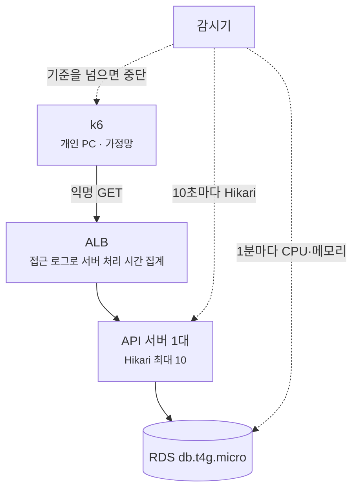

[첫 배포의 커넥션 고갈을 다룬 글](/blog/pool-size-and-alert-threshold/)에서 커넥션 풀 크기를 계산으로 10으로 정했지만, 그 값은 부하를 받아 본 적이 없었습니다.
저장소 문서에는 조회 요청 하나가 커넥션을 여러 번 빌린다는 점도 "알려진 구조적 제약"으로 적혀 있었는데, 이것이 부하에서 실제로 문제가 되는지도 재 본 적이 없었습니다.
그래서 실제 요청 비율 그대로 부하를 걸어 100 RPS까지 올려 봤습니다.

결과를 먼저 요약하면 이렇습니다.

- 100 RPS를 약 4분 유지했고, 서버 처리 시간 p99는 101ms, 오류는 0이었습니다. 평소 평균(약 0.12 RPS)의 약 1,000배, 가장 붐볐던 1시간 평균(3.45 RPS)의 29배입니다.
- 커넥션 풀은 10개 중 평균 1.26개가 쓰였습니다. 요청마다 커넥션을 평균 3.25번 빌리는 건 맞았지만, 트랜잭션 하나로 묶어도 줄어드는 시간은 요청당 0.25ms 이하였습니다(실제로 잰 왕복 시간으로 계산).
- 서버 시간의 23%는 정치인 목록 API 하나가 썼습니다. 인기순 정렬의 집계 쿼리와 뒤 페이지로 갈수록 느려지는 OFFSET이 원인이었고, 뒤 페이지를 부르고 있던 건 웹의 sitemap 생성이었습니다.
- 인기순 쿼리는 실행 계획을 떠 보니 곱해진 조인 결과를 디스크에서 정렬하고 있었습니다. 고친 과정은 [다음 글](/blog/popular-sort-aggregate-query/)에 적었습니다.

## 시험 환경

| 항목 | 값 |
| --- | --- |
| API 서버 | EC2 `t4g.medium` 1대. Spring Boot 3.4, Kotlin, Hibernate 6.6 |
| DB | RDS PostgreSQL `db.t4g.micro` 1대 (vCPU 2, 메모리 1 GiB) |
| 커넥션 풀 | HikariCP 최대 10, 빌리기 대기 한도 1.1초 |
| 평소 트래픽 | 평균 약 0.12 RPS (Datadog에서 4시간 동안 본 사용자 요청) |

### 안전장치

요청은 익명 GET만 보냈고 로그인이나 쓰기는 넣지 않았습니다.
알림 발송, 랭킹 집계, 파이프라인 적재, DB 백업 시각 근처에서는 실행기가 아예 시작하지 않도록 막았습니다.
실행 한 번에 한 단계만 5분씩 보냈고, 매번 앞뒤로 기준선 2분과 회복 10분을 함께 기록한 뒤 결과를 보고 다음 단계를 정했습니다.

실행 중에는 감시기가 10초마다 앱의 Hikari 지표를, 1분마다 RDS 지표를 읽다가 아래 기준 중 하나라도 넘으면 k6를 멈춥니다.

| 무엇을 보나 | 중단 기준 |
| --- | --- |
| k6 | 200이 아닌 응답 1건, 목표 속도를 못 맞춘 요청(dropped) 1건, 단계 p95 500ms 초과, 1초 넘는 요청이 계획 요청 수의 0.05%(최소 5건) 초과 |
| Hikari (10초마다) | 커넥션을 기다리는 스레드 1개 이상, 사용 중 커넥션 8개 이상, 타임아웃 증가, 앱 재시작 |
| RDS (1분마다) | CPU 50% 초과, 여유 메모리 64 MiB 미만, swap 256 MiB 초과, 읽기·쓰기 지연 20ms 초과 등 |

서버 처리 시간은 ALB 접근 로그의 `target_processing_time`으로 쟀습니다.
부하 생성기가 집에 있는 PC라서, k6가 재는 시간에는 집에서 AWS까지의 왕복이 섞여 있기 때문입니다.



## 부하 수준과 요청 구성

### 부하 수준

기준은 ALB 접근 로그 18.9일치였습니다. 가장 붐빈 1시간의 평균이 3.45 RPS였고, 이 정도 부하가 30\~60분 이어진 적이 있습니다.
그보다 낮은 부하로는 새로 알 게 없어서 9, 17, 35 RPS(60분 최대의 2.5배, 5배, 10배)로 계획했습니다.
그리고 35 RPS 결과를 보고 70 RPS(20배)를, 70 RPS 결과를 보고 100 RPS(29배)를 더했습니다.

70 RPS 이후로는 다음 단계를 정하는 질문을 미리 적어 두고 거기에 맞춰 결정했습니다.
결과가 어느 쪽으로 나와도 다음 행동이 달라지는지, 결과를 이미 예측할 수 있는지, 중단 지표마다 임계의 60% 안에 들 것으로 계산되는지 같은 질문입니다.

100 RPS에서 걸린 건 RDS 여유 메모리였습니다. 70 RPS에서 85 MiB까지 내려갔으니 100 RPS에서는 73 MiB 안팎이 예상됐습니다.
64 MiB 근처는 swap이 늘어 느려질 수 있는 수준이고, DB가 멈추는 건 0 근처에서 일어나는 일입니다.
커넥션 대기나 1초 넘는 요청 같은 빠른 증상을 10초 단위로 보고 있다는 전제로 진행했습니다.

### 요청 구성

endpoint 몇 개를 골라 번갈아 부르는 대신, 로그에 남은 실제 요청을 그대로 다시 보냈습니다.
18.9일치 로그에서 익명 공개 GET 성공 응답 15만여 건을 추리고, 그중 무작위로 12,000\~32,000건을 뽑아 재생 목록(fixture)을 만들었습니다.
한 단계 안에서 같은 요청이 되풀이되지 않도록 단계가 클수록 큰 목록을 썼고, 100 RPS에는 32,000건을 썼습니다.
endpoint는 32종이고, 로그인이 필요한 경로와 검색어, 회원 ID가 들어간 파라미터는 뺐습니다.
Datadog APM의 최근 2주 endpoint 비율과 비교해 보니 상위 13개 중 12개가 1%p 안쪽으로 맞았습니다.

첫 시도는 404로 멈췄습니다. 로그가 쌓일 때는 공개였던 기사가 그사이 비공개로 바뀌어 있었습니다.
그 뒤로는 재생 목록의 ID를 DB에서 읽기 전용으로 조회해, 지금도 공개인 것만 남겼습니다.

실제 비율을 그대로 쓰다 보니 뒤에서 이야기할 sitemap 요청도 목록에 같이 들어왔습니다.
그래서 이 목록은 서버에 들어오는 요청 전체의 비율이고, 사용자 요청은 그 일부입니다.

### VU를 잘못 잡았던 일

부하는 k6의 `constant-arrival-rate`로 걸었습니다. 100 RPS로 설정하면 앞 요청의 응답이 왔는지와 상관없이 10ms마다 새 요청을 하나씩 시작합니다.
실제 사용자도 다른 사람의 응답을 기다려 주지 않으니, 서버가 느려져도 보내는 양이 줄지 않는 이 방식이 실제 트래픽에 가깝다고 봤습니다.

이 방식에서 VU(가상 사용자)는 응답을 기다리는 자리에 가깝습니다.
요청 하나가 응답을 받을 때까지 VU 하나를 잡고 있기 때문에, VU 수가 곧 동시에 응답을 기다릴 수 있는 요청 수의 상한이 됩니다.
새 요청을 시작할 차례에 빈 VU가 없으면 k6는 그 요청을 보내지 못하고 dropped로 셉니다.

동시에 기다리는 요청 수는 리틀의 법칙에 따라 도착률 × 응답 시간입니다. 여기서 응답 시간은 k6 쪽에서 본 시간이라 가정망 왕복도 들어갑니다.

| 상황 | 동시에 기다리는 요청 | VU 30이면 |
| --- | ---: | --- |
| 평소: 100 RPS × 15ms | 1.5개 | 충분 |
| 응답이 잠깐 0.3초로 느려짐 | 30개 | 딱 바닥 |
| 응답이 잠깐 0.5초로 느려짐 | 50개 | 20개가 dropped |

1 RPS 스모크 때 정한 VU 30을 그대로 둔 채 100 RPS를 시작했다가, 느린 응답이 몇 개 겹친 순간 16초 만에 dropped로 멈췄습니다.
VU를 도착률 × 견딜 응답 시간(100 × 1초 = 100)으로 바꿔 다시 돌렸습니다.
dropped가 생기면 목표보다 적게 보낸 것이 되고, 서버가 느린 순간일수록 덜 보내서 결과가 실제보다 좋게 나옵니다. 그래서 dropped가 한 건이라도 나오면 시험을 멈추도록 해 두었습니다.

## 100 RPS까지의 결과

9 RPS와 17 RPS는 35 RPS와 거의 같아서, 35 RPS부터 달라진 값만 추리면 이렇습니다.

| 단계 | 서버 p50 / p95 / p99 (ms) | EC2 CPU (5분 평균) | RDS CPU 최대 | RDS 여유 메모리 최저 | 사용 중 커넥션 최대 |
| --- | --- | ---: | ---: | ---: | ---: |
| 35 RPS | 6 / 24 / 52 | 13.9% | 12.3% | 97 MiB | 2 |
| 70 RPS | 6 / 29 / 76 | 21.6% | 23.4% | 85 MiB | 2 |
| 100 RPS | 7 / 44 / 101 | 27.2% | 31.1% | 87 MiB | 7 |

세 단계 모두 k6가 보낸 요청은 전부 200을 받았습니다.

- 느려지는 건 꼬리부터였습니다. 중앙값은 100 RPS까지 6\~7ms로 그대로였는데, p99는 35 RPS 52ms에서 70 RPS 76ms, 100 RPS 101ms로 두 배가 됐습니다.
- CPU는 부하에 비례해 늘었고 한계와는 거리가 있었습니다. 100 RPS에서 EC2 CPU는 27%(5분 평균), RDS CPU는 31%였고, RDS CPU는 RPS당 약 0.27%p씩 늘었습니다. CPU보다 먼저 한계에 가까워진 건 RDS 여유 메모리였습니다(1 GiB 인스턴스에서 최저 85 MiB).
- 100 RPS는 약 4분 뒤 감시기의 Hikari 규칙(사용 중 8개 이상 또는 대기 1개 이상)에 걸려 멈췄지만, 그 순간에도 커넥션 타임아웃과 오류는 없었습니다. 이 결과로 말할 수 있는 건 익명 읽기 요청을 이 비율로 보냈을 때 100 RPS를 약 4분 유지했다는 데까지이고, 어디서 무너지는지(최대 용량)는 재지 않았습니다.

## 조회 요청 하나가 커넥션을 여러 번 빌리는 구조

### 트랜잭션이 갈리는 지점

Spring Data JPA의 Repository 메서드는 어디에 선언돼 있느냐에 따라 트랜잭션이 달라집니다.
`findById`, `findAllById`처럼 `JpaRepository`에서 물려받은 메서드는 구현체 `SimpleJpaRepository`에 붙은 `@Transactional(readOnly = true)`를 따릅니다.
반면 인터페이스에 직접 선언한 쿼리(`@Query`나 `findByNameIn...` 같은 파생 쿼리)에는 트랜잭션 속성이 붙지 않아서, 트랜잭션 없이 쿼리 한 번을 실행하고(autocommit) 커넥션을 바로 돌려줍니다.

뒤쪽은 Spring Data가 트랜잭션 속성을 찾는 코드에서 확인했습니다. 구현체에 같은 메서드가 없으면 속성을 돌려주지 않습니다.

```java
// TransactionalRepositoryProxyPostProcessor
//   .computeTransactionAttribute (spring-data-commons 3.4.5)
Method targetClassMethod = repositoryInformation.getTargetClassMethod(method);

if (targetClassMethod.equals(method)) {
    return null;
}
```

```java
// SimpleJpaRepository (spring-data-jpa 3.4.5)
@Repository
@Transactional(readOnly = true)
public class SimpleJpaRepository<T, ID>
        implements JpaRepositoryImplementation<T, ID> {
```

조회 서비스 가운데 정치인, 법안, 기사 쪽에는 `@Transactional`이 붙어 있지 않습니다.
그래서 요청 하나를 처리하는 동안 Repository를 부를 때마다 커넥션을 새로 빌렸다가 돌려줍니다. 트랜잭션이 있는 서비스라도 컨트롤러가 여러 서비스를 차례로 부르면 서비스마다 따로 빌립니다.
법안 목록 요청 하나가 응답을 만들기까지 커넥션을 몇 번 빌리는지 따라가 보면 7번입니다. 아래 표의 한 줄이 한 번입니다.

| 순서 | 커넥션을 빌리는 호출 | 트랜잭션 |
| ---: | --- | --- |
| 1 | 법안 한 페이지 (`@Query`) | 없음 |
| 2 | 전체 건수 COUNT (`@Query`) | 없음 |
| 3 | 대표발의자 (파생 쿼리) | 없음 |
| 4 | 대표발의자 인물 정보 (`findAllById`) | 읽기 전용 |
| 5 | 위원회 이름 전체 (파생 쿼리) | 없음 |
| 6 | 댓글·반응·리포스트 집계 (서비스 메서드, 쿼리 2개) | 읽기 전용 |
| 7 | 반응 종류별 수 (서비스 메서드) | 읽기 전용 |

요청이 많은 endpoint를 같은 방식으로 세어 보면 다음과 같습니다.

| endpoint | 커넥션 빌림 | SQL |
| --- | ---: | ---: |
| 정치인 목록 | 2 | 2 |
| 정치인 상세 | 3 | 3 |
| 기사 상세 | 2 | 3 |
| 기사 댓글 | 4 | 2\~4 |
| 법안 목록 | 7 | 8 |
| 법안 상세 | 6 | 7 |
| 게시글 목록 | 9 | 6 |

여기에 요청 비율을 곱하면 요청 하나가 평균 3.25번 커넥션을 빌리고 SQL을 3.63개 실행합니다.
요청의 96%를 차지하는 14개 endpoint를 코드로 센 값에 비율을 곱해 낸 값입니다.

다만 빌리는 횟수와 한꺼번에 쥐고 있는 개수는 다릅니다.
한 요청 안의 트랜잭션은 차례대로 돌기 때문에, 앞 트랜잭션이 커넥션을 돌려준 다음에 뒤 트랜잭션이 빌립니다. 게시글 목록이 9번 빌려도 한순간에 쥐고 있는 커넥션은 많아야 1개입니다.

```
게시글 목록 요청 1건 (p50 15ms)
시간 →      [tx1]   [tx2]  [tx3]   …   [tx9]
쥔 커넥션   1  0    1  0   1  0    …   1  0
```

여러 번 빌릴 때 드는 비용은 빌릴 때마다 붙는 트랜잭션 시작과 COMMIT 왕복입니다. 풀 자리를 여러 개 차지하지는 않습니다.

### 100 RPS에서 풀 사용량

Datadog에는 Hikari 지표가 들어오지 않아서, 감시기가 앱이 내보내는 `hikaricp_connections_active`를 10초마다 직접 읽어 기록했습니다.
풀에는 늘 10개가 열려 있고, 이 값은 그중 그 순간 빌려 간 개수입니다. 부하가 실제로 걸린 239초 동안 23번 찍혔습니다.

| 사용 중 커넥션 | 0 | 1 | 2 | 3 | 4 | 7 |
| --- | ---: | ---: | ---: | ---: | ---: | ---: |
| 표본 수 | 10 | 7 | 2 | 1 | 2 | 1 |

평균 1.26개, 중앙값 1개입니다. 표본이 23개뿐이라 평균의 오차가 크기 때문에(95% 범위로 대략 0.5\~2.0개) 다른 데이터로 한 번 더 확인했습니다.

- 같은 구간 ALB 로그에서 요청 23,882건의 서버 처리 시간을 모두 더해 239초로 나누면 1.45가 나옵니다. 앱 안에서 동시에 처리 중인 요청이 평균 1.45개였다는 뜻입니다(리틀의 법칙으로 쓰면 99.9 RPS × 평균 14.5ms).
- 조회 요청은 커넥션을 한 번에 하나까지만 쥡니다. 그러니 풀 사용량의 평균은 1.45개를 넘을 수 없습니다.
- DB에서 활성 상태였던 세션은 평균 0.44개였습니다(Performance Insights의 DB 부하). 초당 약 360개(100 × 3.63)의 쿼리가 하나에 약 1.2ms씩 걸리면, 한순간에 돌고 있는 쿼리는 평균 0.44개가 됩니다. 시험 중 DB 부하는 거의 전부 이 API가 만든 것이라, 풀 사용량의 하한으로 볼 수 있습니다.

세 값을 나란히 놓으면 DB 활성 세션 0.44 ≤ 풀 사용 1.26 ≤ 처리 중 요청 1.45로 순서가 맞고, 풀 사용량의 평균은 0.44\~1.45개 사이로 좁혀집니다.
100 RPS라고 하면 커 보이지만, 요청 하나가 14ms 안팎에 끝나니 어느 순간이든 앱 안에 있는 요청은 한두 개뿐입니다.
사용 중 커넥션은 10초에 한 번 찍은 순간값이라 그사이에 더 높은 값이 있었을 수 있습니다. 최대 7은 적어도 이만큼은 쓰였다는 뜻으로만 봐야 합니다.

### 트랜잭션을 하나로 묶었을 때

요청마다 `@Transactional(readOnly = true)` 하나로 묶으면 줄어드는 건 트랜잭션마다 붙던 COMMIT 왕복으로, 요청당 평균 0.83번입니다.
왕복 한 번에 얼마가 드는지는 Datadog에 남은 SQL span으로 확인했습니다. 100 RPS 구간에서 기본키 조회나 작은 집계 같은 가벼운 쿼리는 앱이 보내고 결과를 받기까지 0.3\~0.6ms였고, 가장 짧은 것이 295µs였습니다.

<figure class="diagram">

<figcaption>100 RPS 구간 끝에 수집된 SQL span. 기본키 조회나 작은 집계 같은 가벼운 쿼리는 295~594µs였습니다. <a href="/images/prd-load-test-100rps/db-span-list.png" target="_blank" rel="noopener">크게 보기</a></figcaption>
</figure>

이 시간에는 DB 실행 시간도 들어 있어서 순수한 왕복은 0.3ms보다 짧습니다. 읽기 전용 트랜잭션의 COMMIT은 DB에서 할 일이 거의 없으니 비용도 이 왕복 정도입니다.
그러면 묶어서 줄어드는 시간은 요청당 많아야 0.25ms(0.83번 × 0.3ms, 평균 서버 처리 시간 14.5ms의 약 2%)이고, 사용 중 커넥션은 약 0.02개 줄어듭니다.
DB 쪽에서 봐도 트랜잭션 하나가 앱을 기다린 시간은 1ms가 안 됐습니다. Performance Insights의 DB 부하 중 25%가 `Client:ClientRead`(DB가 앱의 다음 명령을 기다린 시간)였는데, 이 지표는 트랜잭션 밖에서 쉬는 세션은 세지 않으므로 트랜잭션 안에서 다음 명령이나 COMMIT을 기다린 시간입니다. 초당 약 183건인 트랜잭션으로 나누면 하나당 약 0.6ms입니다.

대신 잃는 것도 있습니다.

- 지금은 쿼리 사이사이 커넥션을 돌려주는데, 묶으면 요청 내내 쥐고 있게 됩니다.
- 서버 시간을 많이 쓰는 정치인 목록과 기사 경로는 이미 트랜잭션이 하나라서 줄어들 게 없습니다.
- 이 저장소는 트랜잭션 경계를 서비스 계층에 두는 규칙이라, endpoint마다 조회용 서비스 메서드를 새로 만들어야 합니다.

`readOnly`를 여기저기 붙이는 데도 비용이 있습니다. Spring의 `HibernateJpaDialect`는 읽기 전용 트랜잭션을 시작할 때 커넥션을 먼저 가져옵니다.
커넥션에 읽기 전용 표시를 해야 해서, 메서드 안에 SQL이 하나도 없어도 커넥션을 빌립니다.

```java
// HibernateJpaDialect.beginTransaction (spring-orm 6.2.6)
if (isolationLevelNeeded || definition.isReadOnly()) {
    if (this.prepareConnection && ConnectionReleaseMode.ON_CLOSE.equals(
            session.getJdbcCoordinator().getLogicalConnection()
                    .getConnectionHandlingMode().getReleaseMode())) {
        preparedCon = session.getJdbcCoordinator()
                .getLogicalConnection().getPhysicalConnection();
        previousIsolationLevel =
                DataSourceUtils.prepareConnectionForTransaction(preparedCon, definition);
    }
    // ...
}
```

Spring이 JPA에 기본으로 쓰는 `DELAYED_ACQUISITION_AND_HOLD` 모드에서 이 분기를 탑니다.

이 규모에서는 여러 번 빌리는 구조가 눈에 띄는 비용이 아니었기 때문에, 성능을 이유로 트랜잭션을 묶는 작업은 하지 않기로 했습니다.

## 서버 시간을 가장 많이 쓴 곳

endpoint별로 요청 비중과 서버 시간 비중(ALB 처리 시간의 합)을 나란히 놓아 봤습니다.

| endpoint | 요청 비중 | 서버 시간 비중 |
| --- | ---: | ---: |
| 정치인 목록 (인기순 제외) | 8.0% | 15.7% |
| 정치인 목록 인기순 | 0.5% | 7.9% |
| 법안 목록 | 8.9% | 10.6% |
| 정치인 상세 | 12.7% | 8.0% |
| 기사 상세 | 11.7% | 7.7% |
| 기사 목록 (전체 분류) | 4.5% | 7.4% |
| 정치인 주요 행적 | 12.1% | 7.2% |
| 기사 댓글 | 9.8% | 5.8% |

`GET /api/v2/celebs` 하나가 요청의 8.5%로 서버 시간의 23.6%를 썼고, 원인은 두 가지였습니다.

### 인기순 정렬의 집계 쿼리

인기순 정렬은 평가 수와 그 정치인 피드에 올라온 글 수를 더한 점수로 줄을 세웁니다.

```kotlin
@Query(
    """
    SELECT c.id FROM CelebJpaEntity c
    LEFT JOIN CelebRatingJpaEntity r ON r.celebId = c.id
    LEFT JOIN PostJpaEntity p ON p.subjectRepresentativeId = c.id
      AND p.kind = :feedKind AND p.deletedAt IS NULL AND p.isHidden = false
    WHERE c.isActive = true
      AND (:type IS NULL OR c.type = :type OR EXISTS (...))
      AND (:party IS NULL OR c.party = :party)
      ...
    GROUP BY c.id, c.name
    ORDER BY (COUNT(DISTINCT r.memberId) + COUNT(DISTINCT p.id)) DESC,
             c.name ASC, c.id ASC
    """,
)
fun findPopularCelebIds(/* ... */, pageable: Pageable): List<String>
```

LEFT JOIN 두 개가 곱해져도 수가 부풀지 않게 `COUNT(DISTINCT)`로 세고, 이 집계를 페이지를 부를 때마다 조건에 맞는 정치인 전체에 대해 새로 합니다.
부하 중 트레이스를 하나 열어 보니 907ms 가운데 이 SQL이 861ms(95%)였습니다.

<figure class="diagram">

<figcaption>민주당 소속으로 좁힌 인기순 요청 한 건(19:39:46)의 스팬 요약. 집계 쿼리가 861ms, 이어서 인물 정보를 읽는 쿼리가 39ms였습니다. 컨트롤러 줄의 빨간 표시는 시험이 중단되며 k6가 연결을 먼저 끊어 응답을 쓰지 못한 오류(Broken pipe)입니다. <a href="/images/prd-load-test-100rps/popular-trace-spans.png" target="_blank" rel="noopener">크게 보기</a></figcaption>
</figure>

필터에 따라 걸리는 시간이 크게 달랐습니다(100 RPS 구간).

| 호출 형태 | 집계 대상 | 혼자 돌 때 (p50) | 다른 인기순 요청과 겹칠 때 (p50) |
| --- | ---: | --- | --- |
| 필터 없음 | 4,566명 | 766ms (6건) | 834ms (10건, 최대 1,236ms) |
| 민주당만 | 2,455명 | 624ms (8건) | 864ms (4건, 최대 1,204ms) |
| 다른 정당만 | — | 64ms (11건) | 118ms (2건) |
| 직위 지정 | — | 30ms (75건) | 24ms (8건) |

집계할 정치인이 많을수록 느리고, 두 요청이 겹치면 1초를 넘깁니다.

시험 부하가 없을 때 DB에서 실행 계획을 떠 보니, 필터 없이 앞에서 10명을 부르는 쿼리 하나가 661ms 걸렸습니다.
두 LEFT JOIN이 곱해져 활성 정치인 4,566명이 87,790행이 되고, `COUNT(DISTINCT)`를 계산하려고 이 행들을 정렬하다 `work_mem`(4MB)을 넘겨 디스크를 씁니다.
실행 계획과 쿼리를 고친 과정은 [다음 글](/blog/popular-sort-aggregate-query/)에 따로 적었습니다.

이 호출을 부르는 곳은 두 군데였습니다.

- 앱의 피드 주제 선택 화면이 필터 없이 인기순 상위 10명을 부릅니다. 실제 사용자가 기다리는 곳입니다.
- 웹의 정치인 목록을 인기순으로 끝까지 넘긴 요청이 있었습니다. 커서가 2,688까지 갑니다. 사람이 이렇게까지 넘기기는 어려워서 크롤러로 추정하지만 확인하지는 않았습니다. 이 페이지들은 검색 색인에서는 빼 두었지만(`noindex, follow`) 링크는 따라가게 열어 둔 상태입니다.

부하 구간의 자원별 최대 지연을 겹쳐 봐도 1초 안팎으로 출렁이는 선은 이 API 하나뿐이었습니다.

<figure class="diagram">

<figcaption>100 RPS 구간(19:35~19:40)의 자원별 최대 지연. 1초 안팎을 오가는 보라색 선이 <code>GET /api/v2/celebs</code>이고, 다른 자원은 0.5초 아래에 머뭅니다.</figcaption>
</figure>

인기순 쿼리가 도는 동안에는 상관없는 다른 요청들도 같이 느려졌습니다.
정치인 상세나 법안 목록 같은 요청을, 시작되는 순간 인기순 쿼리가 돌고 있었는지로 나눠 비교했습니다. 인기순 요청 자체는 뺐습니다.

| 요청이 시작될 때 | 요청 수 | p50 | p99 | 100ms 넘은 요청 |
| --- | ---: | ---: | ---: | ---: |
| 인기순이 돌고 있지 않음 | 21,410 | 7ms | 81ms | 0.8% (163건) |
| 인기순이 돌고 있음 | 2,425 | 11ms | 142ms | 2.2% (53건) |

인기순과 겹친 요청은 p99가 1.8배 길었고, 100ms를 넘는 비율은 약 3배 높았습니다.
0.8초짜리 집계 쿼리가 DB의 vCPU 2개 중 하나를 붙잡고 있는 동안 다른 쿼리가 기다렸다고 보는 게 자연스럽습니다.
다만 확인한 건 같은 시각에 함께 느렸다는 것까지이고, 느려진 요청의 트레이스에서 SQL 시간이 실제로 늘었는지는 보지 않았습니다.

### 뒤 페이지로 갈수록 느린 이름순 목록

인기순이 아닌 목록은 이름순입니다. API에서는 커서라고 부르지만 실제로는 OFFSET입니다.

```kotlin
// CelebPersistenceAdapter
val offset = query.cursor?.toIntOrNull() ?: 0
val pageable = PageRequest.of(offset / query.size, query.size)

// CelebJpaRepository.findCelebs
// ... ORDER BY c.name ASC, c.id ASC
```

필터 없는 이름순 요청을 깊이(cursor + size)별로 나누면 다음과 같습니다.

| 깊이 | 요청 수 | p50 | p95 |
| --- | ---: | ---: | ---: |
| 0\~999 | 538 | 7\~8ms | 33\~36ms |
| 1,000\~1,499 | 236 | 11ms | 45ms |
| 1,500\~1,999 | 227 | 20ms | 83ms |
| 2,000 이상 | 508 | 46\~48ms | 84\~111ms |

같은 깊이(2,400\~3,000)에서 한 번에 50명을 받는 요청은 p50 48ms(292건), 500명을 받는 요청은 55ms(14건)로 거의 차이가 없었습니다.
몇 행을 돌려주느냐보다 몇 행을 건너뛰느냐가 시간을 정하는 셈입니다.

<figure class="diagram">

<figcaption>부하 중 수집된 <code>GET /api/v2/celebs</code> 트레이스. 막대의 파랑은 DB, 분홍은 앱이 쓴 시간입니다. 850ms 이상은 인기순이고, 40~90ms대는 대부분 뒤 페이지(cursor 1,000 이상)였습니다. 느린 요청일수록 시간 대부분이 DB에 있습니다. <a href="/images/prd-load-test-100rps/celebs-trace-list.png" target="_blank" rel="noopener">크게 보기</a></figcaption>
</figure>

실행 계획을 보면 이유가 드러납니다. DB에서 읽기 전용 트랜잭션을 열고, 앱이 보내는 SQL을 그대로 `PREPARE`해 첫 페이지와 2,900번째부터의 페이지를 `EXPLAIN (ANALYZE, BUFFERS)`로 비교했습니다(2026-09-26).
SQL은 `CelebJpaRepository`를 앱과 같은 Hibernate 6.6.13과 PostgreSQL 방언으로 실행해, JDBC로 나가기 직전의 문자열을 받아 썼습니다.

<details>
<summary>실행한 SQL</summary>

sitemap처럼 2,900번째부터 50명을 부르면 앱은 `name_page`의 SQL을 보냅니다. 첫 페이지는 끝이 `fetch first $10 rows only`인 것만 다릅니다(`name_first`).

```sql
PREPARE name_page(varchar, varchar, varchar, varchar, varchar,
                  varchar, varchar, varchar, varchar, int, int) AS
select cje1_0.id,cje1_0.address,cje1_0.birthdate,cje1_0.brief_history,
       cje1_0.career,cje1_0.education,cje1_0.email,cje1_0.gender,
       cje1_0.hanja,cje1_0.is_active,cje1_0.job,cje1_0.metadata,
       cje1_0.military_record,cje1_0.name,cje1_0.office,cje1_0.party,
       cje1_0.phone,cje1_0.profile_image_url,cje1_0.property,cje1_0.property_file,
       cje1_0.type,cje1_0.website
from celeb cje1_0
where cje1_0.is_active=true
  and ($1 is null or cje1_0.type=$2
       or exists(select 1 from celeb_concurrent_role ccrje1_0 where ccrje1_0.celeb_id=cje1_0.id and ccrje1_0.type=$3))
  and ($4 is null or cje1_0.party=$5)
  and ($6 is null or cje1_0.gender=$7)
  and ($8 is null or cje1_0.name like ('%'||cast($9 as text)||'%') escape '')
order by cje1_0.name,cje1_0.id
offset $10 rows fetch first $11 rows only;

PREPARE name_first(varchar, varchar, varchar, varchar, varchar,
                   varchar, varchar, varchar, varchar, int) AS
select cje1_0.id,cje1_0.address,cje1_0.birthdate,cje1_0.brief_history,
       cje1_0.career,cje1_0.education,cje1_0.email,cje1_0.gender,
       cje1_0.hanja,cje1_0.is_active,cje1_0.job,cje1_0.metadata,
       cje1_0.military_record,cje1_0.name,cje1_0.office,cje1_0.party,
       cje1_0.phone,cje1_0.profile_image_url,cje1_0.property,cje1_0.property_file,
       cje1_0.type,cje1_0.website
from celeb cje1_0
where cje1_0.is_active=true
  and ($1 is null or cje1_0.type=$2
       or exists(select 1 from celeb_concurrent_role ccrje1_0 where ccrje1_0.celeb_id=cje1_0.id and ccrje1_0.type=$3))
  and ($4 is null or cje1_0.party=$5)
  and ($6 is null or cje1_0.gender=$7)
  and ($8 is null or cje1_0.name like ('%'||cast($9 as text)||'%') escape '')
order by cje1_0.name,cje1_0.id
fetch first $10 rows only;

EXPLAIN (ANALYZE, BUFFERS)
EXECUTE name_first(NULL, NULL, NULL, NULL, NULL,
                   NULL, NULL, NULL, NULL, 50);        -- 첫 페이지
EXPLAIN (ANALYZE, BUFFERS)
EXECUTE name_page(NULL, NULL, NULL, NULL, NULL,
                  NULL, NULL, NULL, NULL, 2900, 50);   -- 뒤 페이지
```

</details>

| | 첫 페이지 | 뒤 페이지 (2,900번째부터) |
| --- | --- | --- |
| 실행 시간 | 0.28ms | 39.5ms |
| 읽는 방법 | (이름, 생년월일) 유니크 인덱스로 51행 | 테이블 전체 4,566행 (Seq Scan) |
| 정렬 | 이름이 같은 행끼리만 id로 정렬 (Incremental Sort, 48kB) | 4,566행 전체를 모든 컬럼째 정렬 (quicksort, 3,254kB) |
| 버리는 행 | 없음 | 앞의 2,900행 |

<details>
<summary>실행 계획 원본: 첫 페이지 (0.28ms)</summary>

```
QUERY PLAN
------------------------------------------------------------------------------------------------------------------------------------------------------------
 Limit  (cost=0.66..19.41 rows=50 width=1359) (actual time=0.161..0.253 rows=50 loops=1)
   Buffers: shared hit=53
   ->  Incremental Sort  (cost=0.66..1712.87 rows=4566 width=1359) (actual time=0.160..0.247 rows=50 loops=1)
         Sort Key: name, id
         Presorted Key: name
         Full-sort Groups: 2  Sort Method: quicksort  Average Memory: 48kB  Peak Memory: 48kB
         Buffers: shared hit=53
         ->  Index Scan using uq_celeb_name_birthdate on celeb cje1_0  (cost=0.28..1521.19 rows=4566 width=1359) (actual time=0.015..0.083 rows=51 loops=1)
               Filter: is_active
               Buffers: shared hit=53
 Planning:
   Buffers: shared hit=83
 Planning Time: 0.391 ms
 Execution Time: 0.280 ms
(14 rows)
```

</details>

<details>
<summary>실행 계획 원본: 뒤 페이지 (39.5ms)</summary>

```
QUERY PLAN
-----------------------------------------------------------------------------------------------------------------------------
 Limit  (cost=678.90..679.02 rows=50 width=1359) (actual time=39.475..39.488 rows=50 loops=1)
   Buffers: shared hit=340
   ->  Sort  (cost=671.65..683.06 rows=4566 width=1359) (actual time=38.907..39.329 rows=2950 loops=1)
         Sort Key: name, id
         Sort Method: quicksort  Memory: 3254kB
         Buffers: shared hit=340
         ->  Seq Scan on celeb cje1_0  (cost=0.00..385.67 rows=4566 width=1359) (actual time=0.010..1.931 rows=4566 loops=1)
               Filter: is_active
               Rows Removed by Filter: 1
               Buffers: shared hit=340
 Planning Time: 0.193 ms
 Execution Time: 39.523 ms
(12 rows)
```

</details>


한 행이 1.3KB 안팎(경력, 약력 같은 긴 텍스트 포함)이라, 뒤 페이지로 갈수록 인덱스로 한 행씩 찾아가는 것보다 통째로 읽어 정렬하는 편이 싸다고 본 것입니다.
페이지 경계를 OFFSET 대신 마지막으로 받은 (이름, id)로 넘기는 keyset 방식이면 뒤 페이지도 인덱스를 따라 필요한 행만 읽을 수 있습니다. 이쪽은 아직 해 보지 않았습니다.

### 뒤 페이지를 부르던 sitemap

깊은 페이지를 누가 부르는지 요청 모양을 보고 찾아보니 웹의 sitemap이었습니다. sitemap은 정치인, 기사, 법안 목록을 끝까지 넘기면서 URL을 모읍니다.

```ts
// app/sitemap.ts (발췌)
export const revalidate = 3600;

const LIMIT = {
  editorial: 500,
  intelligence: 2000,
  celeb: 3000,
  bill: 3000,
} as const;

const PAGE_SIZE = 50;

drainCursor(async cursor => {
  const page = await getCelebList({
    cursor,
    size: PAGE_SIZE,
    revalidate: SITEMAP_REVALIDATE,
  });
  return {
    items: page.items,
    nextCursor: page.meta.nextCursor,
    hasMore: page.meta.hasMore,
  };
}, LIMIT.celeb);
```

정치인 목록을 50명씩 최대 3,000명까지 넘기니 뒤로 갈수록 앞에서 본 깊은 OFFSET이 됩니다. 활성 정치인은 4,566명이라 sitemap에는 이름순 앞쪽 3,000명만 들어갑니다.
웹과 앱 코드에서 이런 모양으로 목록을 부르는 곳은 sitemap뿐이었습니다.

| sitemap이 부르는 요청 | 요청 비중 | 서버 시간 비중 |
| --- | ---: | ---: |
| 정치인 목록 (50명씩) | 5.8% | 12.9% |
| 기사 목록 (50건씩) | 3.6% | 6.4% |
| 법안 목록 (100건씩) | 1.4% | 3.4% |
| 에디토리얼 목록 (50건씩) | 0.1% | 0.1% |
| 합계 | 10.9% | 22.8% |

sitemap은 한 시간 캐시로 설정돼 있습니다(`revalidate = 3600`).
로그를 보면 정치인 sitemap 요청이 시간당 약 20건이어서, 60장짜리 한 바퀴가 대략 3시간에 한 번 돈 것으로 보입니다.

실제 트래픽으로 치면 sitemap은 초당 0.01건 정도라 사용자가 느낄 일은 없습니다. 하지만 이번 시험에서는 서버 처리 시간의 약 4분의 1을 차지했습니다.
이 비율 그대로 100 RPS로 키웠으니 사용자 수와 상관없는 요청이 서버 시간의 약 30%(sitemap 22.8%, 크롤러로 추정한 인기순 페이지 7.3%)를 차지한 셈이고, 이 결과를 사용자가 30배로 늘어도 버틴다는 뜻으로 읽을 수는 없습니다.

## 다음에 할 것과 하지 않을 것

다음에 할 일은 인기순 집계 쿼리를 고치는 것입니다. 실제 사용자가 기다리는 곳이라 가장 먼저 했고, 결과는 [다음 글](/blog/popular-sort-aggregate-query/)에 적었습니다.

하지 않기로 한 것도 두 가지입니다.
조회 트랜잭션을 묶는 작업은 앞에서 계산한 대로 요청당 0.25ms 이하, 풀 사용은 약 0.02개밖에 줄지 않아서 하지 않습니다.
100 RPS보다 더 올리는 시험도 하지 않습니다. 결과에 걸린 결정이 없고, 서버 시간의 약 30%가 사용자 수와 상관없는 요청(sitemap 22.8%, 크롤러로 추정한 인기순 페이지 7.3%)이라 결과를 사용자 증가로 읽을 수도 없기 때문입니다.

## 한계

- 익명 GET만 보냈습니다. 로그인 사용자의 개인화 쿼리와 쓰기 요청은 빠졌습니다.
- 한 단계에 5분, 100 RPS는 약 4분입니다. 오래 버티는지(soak), 급증에 어떻게 반응하는지(spike), 어디서 무너지는지(breakpoint)는 재지 않았습니다.
- 부하 생성기가 집에 있는 PC였습니다. 판정은 모두 ALB 기준 서버 처리 시간으로 했습니다.
- 확인하지 못한 것: 인기순 쿼리 개선을 앱에 반영한 뒤의 효과([다음 글](/blog/popular-sort-aggregate-query/)에서 확인), 인기순 쿼리가 다른 요청을 느리게 한다는 인과, 순간적으로 커넥션 7\~8개가 쓰인 이유, 인기순 뒤 페이지를 부른 것이 크롤러인지.
- 직접 재지 않고 계산한 값: 요청당 커넥션 빌림 수(코드로 센 값 × 요청 비율), 트랜잭션을 묶었을 때의 효과(잰 왕복 시간 × COMMIT 횟수), sitemap 주기.

앞 글에서 계산으로 정한 풀 10은 이 조건에서는 여유가 컸고, 손봐야 할 곳은 인기순 집계 쿼리와 sitemap이었습니다.
