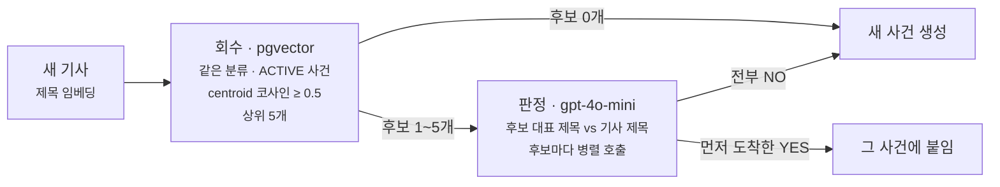

baro의 뉴스 파이프라인은 언론사 피드를 모아 같은 사건을 다룬 기사끼리 묶고, 30분마다 분류별 순위를 매겨 상위 사건을 아티클로 만들어 앱에 발행합니다.
발행까지 사람이 검수하는 단계는 없습니다.

9/19에 이 경로에서 결함 세 개가 한꺼번에 드러났는데, 셋 다 사용자 신고로 알았습니다.
그 뒤에 두 가지를 했습니다. 발행된 아티클을 매시 세는 감사 스케줄러를 붙였고, 사건 판정기(LLM)는 고치기 전에 운영과 같은 조건으로 다시 돌려 원인부터 갈랐습니다.
둘 다 문제를 바로 막기보다 먼저 세는 쪽을 택했습니다.

이후 두 가지를 더 쟀습니다. 감사가 배포 후 나흘 동안 실제로 무엇을 셌는지 운영 로그로 확인했고, 9/19에 「미측정」으로 남겨 둔 판정 정확도를 평가셋 155건과 실제 API 호출 1,240회로 쟀습니다.

## 사용자가 먼저 찾았다

잘못 발행된 아티클을 알아낼 방법이 사용자 신고밖에 없었습니다. 9/19에 드러난 결함 세 개가 모두 그랬습니다.

| 증상 | 노출 기간 | 어떻게 알았나 |
| --- | --- | --- |
| `[인사] 감사원`, `[부고]…씨 장인상` 같은 정기공지 9건이 아티클로 발행돼 있었다 | 가장 오래된 것은 8/31부터 19일 | 사용자 신고 |
| 전날 아침의 「기자회견 30분 연기」 공지 사건에 다른 기사가 붙어 되살아났고, 최신 목록 1번에 올랐다 | 생성 12:28 → 신고 13:36, 68분 | 사용자 신고 |
| 법무부 장관 후보자 사퇴 한 건이 정치 1·4·6위와 사회 8위로 나뉘어 올랐다 | — | 사용자 신고 |

사흘 전(9/16)에도 비슷한 일이 있었습니다. 정부의 임신중지약 도입 발표 한 건이 사회 분류에서 사건 7개로 갈라졌고, 그중 둘이 순위 6·7위를 같이 차지했습니다.

로그로는 알 수 없었습니다. 수집 단계의 제외 로그(`event=crawl.excluded`)는 사회 분류 규칙에만 걸려 있어서 정치·경제 공지는 흔적이 없었고, 공지로 만든 아티클의 생성 로그는 정상 아티클과 똑같았습니다.

그날 공지 필터를 정치·경제까지 넓혔고(운영 제목 20,545건으로 백테스트해 오탐 0건), 서비스에 떠 있던 13건은 백업을 떠 두고 내렸습니다.
그래도 규칙이 모르는 태그는 또 새어 나올 수 있습니다. 1인 운영이라 「사람이 목록을 자주 본다」는 재발 방지 대책이 될 수 없었습니다.

## 1부. 발행 감사: 정확히 셀 수 있는 것만 센다

발행된 뒤에 잘못된 아티클을 찾아내는 단계가 없었습니다. 그래서 발행분을 매시 다시 세는 감사를 붙였습니다.
경고가 자주 틀리면 아무도 읽지 않게 되니, 규칙으로 정확히 셀 수 있는 것만 넣었습니다.

### 무엇을 세나

감사는 매시 50분에 도는 스케줄러 하나입니다.

```kotlin
/**
 * 발행분 사후 감사. 매시 50분 — 스냅샷(:00/:30)·이벤트 종료(:15)·보존(:45)과 겹치지 않는 자리다.
 * 탐지 전용이라 실패해도 파이프라인에 영향이 없다.
 */
@Scheduled(cron = "0 50 * * * *", zone = "Asia/Seoul")
fun runAudit() {
    if (!properties.enabled) return
    publishAuditService.audit()
}
```

스케줄러 스레드 풀이 4개라 정시 작업끼리 겹치면 서로 밀립니다. 그래서 cron으로 박혀 있는 15·30·45분을 피해 50분에 뒀습니다.

검사 항목은 세 가지이고, LLM은 부르지 않습니다.

| 항목 | 세는 것 | 로그 레벨 |
| --- | --- | --- |
| `NOTICE_TITLE` | 발행된 아티클 제목이 공지 태그 정규식에 걸린다. 수집 필터와 같은 설정을 읽지만 분류와 무관하게 전부 적용한다 | WARN |
| `SINGLE_CARD` | 관점 카드가 2장 미만이다. 매체별 관점을 나란히 놓는 게 이 제품이라, 한 장이면 아티클이 성립하지 않는다 | WARN |
| 과분리 지표 | 같은 분류 순위표 안에서 사건 centroid 코사인이 0.6 이상인 쌍의 수 | INFO |

공지인지 가려내는 정규식은 수집 필터가 쓰는 것을 그대로 가져다 씁니다.
다만 필터는 분류마다 정해 둔 규칙만 적용하고, 감사는 모든 규칙을 분류와 상관없이 발행된 아티클 전체에 적용합니다.

이번 결함은 필터가 사회 분류에만 걸려 있어서 정치·경제 공지가 빠져나간 것이었습니다.
감사까지 분류별 설정을 따르면, 필터가 놓친 공지를 감사도 똑같이 놓칩니다.

```kotlin
@Component
class NoticeTitleMatcher(properties: CrawlNoiseFilterProperties) {
    private val patterns: Map<String, Regex> = properties.effectiveRules.values
        .flatMap { rules -> rules.titlePatterns.entries }
        .associate { (name, pattern) -> name to Regex(pattern) }

    fun match(title: String): String? = patterns.entries.firstOrNull { it.value.containsMatchIn(title) }?.key
}
```

로그는 건마다 남기지 않습니다. 회차마다 INFO 한 줄을 남기고, 발견이 있으면 종류별로 WARN 한 줄에 개수와 표본 5건만 담습니다.
배포 직후 첫 회차의 로그입니다(표본은 줄였습니다).

```text
INFO event=publish.audit checked=1174 findings=17 duplicate_topics=4
INFO event=publish.audit.duplicate_topics count=4 samples=POLITICS 0.800 #4 유시민 "대통령, 멸칭 문제… ↔ #10 "신발 속 돌멩이가… | POLITICS 0.774 #1 [속보] 합참 "북한, 동해상으로 미상 발사체 발사 ↔ #6 [속보] 軍 "北, 원산 일대서 동해상으로 탄도미사… | …
WARN event=publish.audit.finding type=SINGLE_CARD count=12 samples=intel_art_…(cards=1) 김민석 "이번주가 지지율 하락 마지노선…" | …
WARN event=publish.audit.finding type=NOTICE_TITLE count=5 samples=intel_art_…(rule=personnel) [인사]기획예산처 | intel_art_…(rule=obituary) [부고]김용진(국민의힘 공보국장)씨 장인상 | …
```

### 넣지 않은 검사: 제목과 카드의 주제가 어긋나는 경우

아티클 제목과 카드가 서로 다른 내용을 다루는 결함도 있었는데, 이건 감사 항목에 넣지 않았습니다. 규칙으로는 정확히 가려낼 수 없어서입니다.

9/19에 정치 1위 아티클의 관점 카드 5장은 전부 사퇴 속보였는데, 제목만 같은 통신사가 두 시간 뒤에 낸 해설(「국정동력 우려 속 金사퇴로 숨돌린 靑…인사실패 비판은 부담」)이었습니다.

이걸 감사로 잡으려면 제목과 카드 출처 제목의 주제가 같은지 판단해야 합니다.
한국어 형태소 분석 없이 토큰 겹침으로 흉내 내면 「사퇴」 같은 단어 하나로 같다고 하거나, 표현이 다르다는 이유로 다르다고 할 겁니다. 그렇게 오탐이 쌓인 경고는 곧 아무도 읽지 않습니다.

그래서 이 결함은 감지하지 않고 구조로 막았습니다.
원인은 제목을 「매체별 대표 기사」에서 뽑은 데 있었습니다. 카드에는 그 매체의 최신 기사가 맞지만, 제목까지 거기서 뽑으면 사건이 나이를 먹을수록 반응·해설 쪽으로 옮겨 갑니다.
제목 후보를 카드에 실린 매체의 기사로 한정하고, 통신사 우선·이른 보도 순으로 정렬하도록 바꿨습니다.

```sql
SELECT pa.title
  FROM news_event_articles nea
  JOIN press_articles pa ON nea.article_ref = pa.article_ref
  JOIN publishers p ON pa.publisher_code = p.publisher_code
 WHERE nea.event_ref = ? AND pa.ingest_kind = 'FEED'
   AND pa.publisher_code IN (/* 카드에 실린 매체 */)
 ORDER BY CASE WHEN p.stance = 'WIRE' THEN 0 ELSE 1 END,
          coalesce(pa.published_at, pa.first_seen_at),
          pa.publisher_code
```

코드에서는 이 후보 중 공지 태그에 걸리는 제목을 건너뜁니다. 최초 보도만 보면 통신사의 `[인사]` 단문이 제목이 될 수 있어서입니다.
회귀 테스트는 수정을 되돌리면 실패하고 복원하면 통과하는 것까지 확인했습니다.

### 첫 구현은 스스로 세운 원칙을 어겼다

처음 만든 감사는 정상인 아티클을 매시 경고했고, 정작 잡아야 할 아티클은 검사 대상에서 빠뜨리고 있었습니다.
그대로 배포했다면 정상 아티클이 매시 최대 30건씩 경고에 걸리는 한편, 19일 동안 떠 있던 공지 같은 결함은 또 놓쳤을 겁니다.

첫 구현에는 검사가 네 개 있었고 전부 WARN이었습니다.
앞에서 제목과 카드를 비교하는 검사를 뺀 이유가 「오탐이 쌓이면 아무도 보지 않는 경고가 된다」였는데, 바로 그런 경고를 두 개 만들었던 겁니다.
코드 리뷰에서 이 두 경고를 지적받았고, 배포 전에 검사 조건까지 다섯 군데를 고쳤습니다.

| 첫 구현 | 문제 | 고친 뒤 |
| --- | --- | --- |
| 순위 없이 발행된 아티클을 WARN | 일부러 순위 없이 발행하던 정상 아티클이 매시 걸린다 | 검사 삭제 |
| 과분리 의심 쌍을 WARN | 절반 가까이가 같은 사건이 아닌데 매시 반복된다 | INFO 지표 |
| 검사 대상이 `status IN ('PUBLISHED','UPDATED')` | 보관 상태로 바뀌었어도 독자에게 보이는 아티클을 놓친다 | `baro_article_id IS NOT NULL` (서비스에 올라간 것 전부) |
| 창이 `created_at` 3일 | 3일 넘게 순위에 있는 아티클이 검사에서 빠진다 | `updated_at` 3일 |
| 공지 규칙을 상수로 복사 | 운영에서 규칙을 더해도 감사는 모른다 | 설정에서 읽음 (`effectiveRules`) |

먼저 틀린 경고를 내던 검사 두 개입니다.

순위 없는 발행 검사는 정상 아티클을 경고합니다. 당시에는 한 회차에 20건까지 만들고 그중 10위 안에만 순위를 줬습니다. 11~20위는 일부러 순위 없이 발행했으니, 이 검사를 두면 분류당 최대 10건, 세 분류면 매시 최대 30건이 걸립니다.
이 검사에 쓰던 `trend_snapshot_items` 상관 서브쿼리도 같이 없앴습니다. 그 표의 `rank`는 점수 순위라 실제 채택 순위와 다르고, 8만 5,750행인데 `event_ref` 단독 인덱스가 없고, 보존 정책으로 잘려 나가는 원장이었습니다.

과분리 의심 쌍은 절반 가까이 틀리는 신호였습니다. 아티클 생성기는 centroid 유사도 0.92 이상만 같은 사건으로 보고 하나를 건너뜁니다. 그러니 0.6짜리 쌍이 순위표에 같이 있는 건 설계상 정상 범위입니다.
게다가 9/19에 0.6 이상 쌍 25개를 라벨해 보니 실제로 같은 사건은 14쌍(56%)이었습니다. 나머지는 반응 기사나 별개 사건이었습니다. 이런 신호를, 같은 쌍이 순위에 머무는 동안 매시 반복해서 WARN으로 올리면 곧 무시됩니다. 그래서 개수만 남깁니다.

나머지 셋은 잡아야 할 아티클을 놓치는 조건이었습니다.

상태로 검사 대상을 고르면 독자에게 보이는 아티클을 놓칩니다. 서비스에서 아티클을 내리는 경로가 없어서 `ARCHIVED`가 된 아티클도 독자에게는 계속 보입니다. 공지가 19일 동안 떠 있던 게 바로 그 상태였습니다. 그래서 상태가 아니라 서비스에 올라갔는지로 골랐습니다.

`created_at`으로 창을 걸면 오래 순위에 있는 아티클이 빠집니다. 갱신은 같은 행을 고치므로, 나흘째 1위인 아티클은 만든 지 3일이 지나 검사에서 빠집니다. 그래서 창을 `updated_at` 기준으로 바꿨습니다.

공지 규칙을 상수로 복사해 두면 운영에서 YAML로 규칙을 더해도 감사는 모릅니다. 그래서 설정에서 읽게 했습니다. 이참에 한 분류만 YAML로 덮으면 나머지 분류 규칙이 조용히 꺼지던 문제도 기본값 위에 병합하는 `effectiveRules`로 막았습니다.

감사 쿼리를 위해 인덱스를 새로 만들지는 않았습니다. 당시 `intelligence_articles`가 2,081행(그중 발행 1,832, 3일 창 안 1,169)이라 매시 훑어도 부담이 없었습니다.

### 나흘치 로그를 세어 보니 같은 경고가 매시 반복됐다

배포하고 나흘 뒤에 로그를 세어 보니 문제가 두 가지 있었습니다. 감사가 같은 기사를 매시 다시 경고하고 있었고, 그 경고는 누구에게도 전달되지 않고 있었습니다.

나흘 동안 감사는 96번 돌았고, WARN 140줄이 나왔는데 기사로는 22건이었습니다. 운영 로그의 `publish.audit` 줄을 항목별로 세면 이렇습니다.

| 항목 | 레벨 | 찍힌 회차 | 서로 다른 기사 | 무엇이었나 |
| --- | --- | --- | ---: | --- |
| `SINGLE_CARD` | WARN | 96회 중 96회 | 17 | 로그 표본으로만 세도 같은 기사가 58회차에 걸쳐 잡혔다 |
| `NOTICE_TITLE` | WARN | 96회 중 처음 44회 | 5 | 전부 9/19에 서비스에서 이미 내린 공지였다 |
| 과분리 지표 | INFO | 96회 중 95회, 회차당 평균 5.8쌍 | — | 합참 「미상 발사체 발사」(15:09 1보, 1위)와 軍 「원산 일대서 탄도미사일 발사」(16:27, 6위)처럼 같은 발사가 두 칸을 차지한 경우가 섞여 있다 |

과분리를 지표로 내린 이유가 그대로 적용되는 문제였습니다. 감사는 매시 「지금 상태」를 3일 창 안에서 다시 셉니다. 그래서 한번 걸린 기사는 창을 벗어날 때까지 매시 다시 걸립니다.
과분리 쌍은 「순위에 머무는 동안 매시 반복된다」는 이유로 지표로 내렸는데, 같은 성질을 가진 나머지 두 항목은 그대로 뒀던 겁니다.

`NOTICE_TITLE`의 5건은 다른 문제도 보여 줍니다. 9/19에 서비스 DB에서 직접 숨긴 기사들인데, 파이프라인은 서비스 쪽 상태를 모릅니다.
게다가 파이프라인 쪽 `updated_at`이 그날 갱신돼 3일 창 안에 남았습니다. 네 건은 오후 정리 작업이, 한 건은 그보다 먼저 새벽 보관 스케줄러가 고쳤습니다. 그래서 네 건은 44번, 한 건은 35번, 이미 내린 공지를 새 결함처럼 보고했습니다.
그 5건 말고 새로 걸린 공지는 없었습니다. 수집 필터와 같은 규칙으로 보는 검사이니, 나흘 동안 그 규칙에 걸리는 공지가 필터를 빠져나가 발행되지 않았다는 뜻입니다. 규칙이 모르는 태그는 이 검사로도 잡지 못합니다.

WARN이 누구에게 전달되지도 않았습니다. 로그는 Grafana Loki로 가지만 `publish.audit.finding`에 걸린 알림 규칙이 없어서, 일부러 검색하지 않으면 보이지 않습니다.

### 새로 걸린 기사만 경고하도록 고쳤다

직전 회차에 걸렸던 기사를 종류별로 기억해 두고, 이번 회차에 새로 걸린 기사만 WARN으로 올리게 바꿨습니다.
계속 걸려 있는 기사는 매시 INFO 줄의 개수로만 남고, 해소됐다가 다시 걸리면 다시 경고합니다.

```kotlin
val newFindings = flagged
    .mapValues { (finding, items) ->
        val seen = lastFlagged[finding].orEmpty()
        items.filterKeys { it !in seen }.values.toList()
    }
    .filterValues { it.isNotEmpty() }

// … 과분리 조회, 보고서 작성 …
logReport(report)
// WARN을 쓴 뒤에 기록한다
lastFlagged = flagged.mapValues { (_, items) -> items.keys.toSet() }
```

처음에는 「이미 본 기사」 기록을 과분리 조회보다 먼저 했습니다. 코드 리뷰에서, 그 사이 조회가 실패하면 새로 걸린 기사가 경고 없이 「이미 본 것」이 돼 창을 벗어날 때까지 다시는 경고되지 않는다는 지적을 받았습니다. 그래서 기록을 WARN을 쓴 뒤로 옮겼습니다.
테스트를 붙이다가 기존 픽스처의 결함도 찾았습니다. `baro_article_id`를 만드는 문자열에 `${'$'}`가 들어 있어, 모든 테스트가 같은 식별자를 쓰고 있었습니다. 식별자를 쓰지 않던 동안에는 드러나지 않던 문제입니다.
회귀 테스트 세 개(반복 억제, 해소 뒤 재경고, 조회 실패 시 기록)는 각각 수정을 되돌리면 실패하는 것까지 확인했습니다.

배포하고 다음 두 회차의 로그를 봤습니다.

```text
18:50:00 INFO event=publish.audit checked=813 findings=6 new=6 duplicate_topics=7
18:50:00 WARN event=publish.audit.finding type=SINGLE_CARD count=6 total=6 samples=…
19:50:00 INFO event=publish.audit checked=810 findings=6 new=0 duplicate_topics=6
```

재기동 직후인 18:50에는 걸려 있던 6건을 전부 새것으로 보고 WARN을 한 번 냈습니다. 19:50에는 같은 6건이 그대로 걸려 있었지만 WARN 줄은 없었습니다. 수정 전이었다면 이 6건은 3일 창을 벗어날 때까지 매시 WARN으로 찍혔을 겁니다.

기억은 프로세스 메모리에 둡니다. 그래서 재기동할 때마다 첫 회차에 WARN이 한 번 나옵니다. 배포가 며칠에 한 번이라 받아들였고, 인스턴스를 늘리거나 재기동이 잦아지면 마지막 보고 시각을 테이블에 남길 계획입니다.

### 공지 발행만 알림으로 보낸다

남은 문제는 WARN을 아무도 받지 않는다는 것이었습니다.
반복이 없어져서 이제 사람에게 보낼 수 있게 됐지만, 두 항목을 모두 보내지는 않았습니다. 받았을 때 할 일이 정해져 있는 공지 발행만 보냅니다.

| 항목 | 나흘 동안 새로 걸린 기사 | 받았을 때 할 일 | 알림 |
| --- | --- | --- | --- |
| `NOTICE_TITLE` | 0건 (WARN 44줄은 이미 내린 공지 5건의 반복) | 서비스에서 내린다 | 보냄 |
| `SINGLE_CARD` | 17건 (하루 약 4건) | 정해져 있지 않다 | 안 보냄 |

공지 발행은 이 감사를 만든 계기이고, 보이면 바로 내려야 하는 결함입니다. 평소에는 0건이라 알림이 울리는 날 자체가 드뭅니다.
카드 1장짜리 기사는 하루 네 건꼴로 새로 걸리는데, 받아도 무엇을 할지 정해 두지 않았습니다. 그대로 보내면 다시 아무도 읽지 않는 알림이 되니 로그와 개수로만 둡니다.

알림은 Grafana의 Loki 규칙으로 정의했습니다. 감사가 쓰는 WARN 한 줄을 10분 창으로 세고, 한 줄이라도 있으면 Slack으로 보냅니다.

```text
sum(count_over_time({job="magazine-pipeline", service="news-intelligence-app"}
  |= "event=publish.audit.finding" |= "type=NOTICE_TITLE" [10m])) > 0
```

규칙을 정하기 전에, Loki로 보내는 운영 로그 원본에 같은 두 필터를 걸어 봤습니다. 앞에서 센 공지 WARN 44줄이 그대로 잡혔습니다.

아직 손대지 않은 것도 있습니다. 서비스에서 숨긴 아티클은 여전히 파이프라인이 모릅니다. 숨김이 서비스 DB를 직접 고치는 작업이라 파이프라인에 흔적이 남지 않기 때문입니다. 반복 억제 덕분에 그런 기사도 경고는 한 번으로 줄었지만, 숨긴 뒤 3일 안에 재기동하면 같은 공지로 알림이 한 번 더 옵니다.

### 코드 주석과 문서도 낡아 있었다

감사 코드의 주석과 파이프라인 문서가 실제 동작과 다른 설명을 하고 있었습니다.
같은 날 두 작업이 따로 진행된 탓입니다. 순위 밖 아티클을 발행하지 않는 발행 게이트가 먼저 머지됐고, 감사는 그 뒤에 머지됐습니다.
게이트는 배포 후 나흘 동안 순위 밖 아티클의 발행을 1,605번 보류했습니다.
그런데 감사 코드의 KDoc은 「지금 코드는 순위 밖 아티클을 의도적으로 발행하므로」 순위 없는 발행 검사를 뺀다고 말하고 있었습니다. 머지된 시점에 이미 틀린 전제였습니다. 파이프라인 개요 문서의 스케줄 표도 감사 항목을 첫 구현의 네 개로 적고 있었습니다.
둘 다 고쳤습니다. 「게이트와 같은 회차에 넣는다」던 순위 없는 발행 검사는 아직 다시 넣지 않았습니다.

## 2부. 사건 판정: 모델을 바꾸기 전에 재현부터

사건을 묶는 LLM 판정이 같은 사건은 여러 개로 가르고, 다른 사건은 하나로 붙이고 있었습니다.
지시문이나 모델을 바꾸기 전에, 운영과 같은 조건으로 다시 호출해 어디서 틀리는지부터 확인했습니다.

### 판정은 이렇게 돈다

기사 하나가 들어오면 두 단계로 사건이 정해집니다.



회수는 후보를 놓치지 않는 쪽을 맡고, 같은 사건인지 가리는 정밀도는 LLM 판정이 맡는 구조입니다.
코사인 하나로는 「수출 증가」와 「수출 감소」가 0.9271로 묶여서, 매거진 앱을 만들 때 이렇게 나눴습니다.

판정 지시문은 이렇습니다. `temperature 0`에 JSON 스키마를 강제해 boolean만 받습니다.

```text
두 뉴스가 **같은 개별 사건**을 보도하는지 판정하라.
주제가 같아도 사건이 다르면(발표 시점이 다르거나, 결정·방향·수치가 다르면) 다른 사건이다.
예: '금리 동결'과 '금리 인상'은 다른 사건이다.
같은 사건을 다른 매체가 다른 표현으로 보도한 경우만 같은 사건이다.
```

### 한 발표가 일곱 사건이 됐다 (9/16)

9/16 오전의 임신중지약 도입 발표는 사회 분류에서 기사 17건이 사건 7개로 갈라졌습니다.

| 배정 시각 | 사건 대표 제목 | 기사 수 |
| --- | --- | ---: |
| 10:14 | [속보] 韓총리 "임신 9주 이하 대상 임신 중지 약물 단계적 도입" | 6 |
| 11:05 | 먹는 임신중지약 정식 도입…첫 2년 '의료기관 처방·조제' | 4 |
| 11:15 | [속보] 식약처 "내년 1분기 내 '임신중지 약물' 도입 위해 최선" | 4 |
| 11:15 | 임신중지약 '미프지미소' 도입 추진…언제 유통될까 | 7 |
| 11:15 | 임신중지약물 도입 반응 엇갈려…"신속 허가" vs "법 개정부터" | 2 |
| 11:16 | [일지] 낙태죄 헌법불합치 결정부터 임신중지 약물 도입까지 | 1 |
| 11:16 | [속보] 정부 "임신중지 약물 음성 유통 女건강권 저해…개선 시급" | 1 |

같은 연합뉴스 기사의 1보와 (종합)판이 서로 다른 사건에 붙기도 했습니다.

### 우연인가, 모델이 약한가

왜 갈라졌는지는 아직 모르는 상태였습니다. 떠오른 설명은 두 가지였습니다. LLM 응답이 흔들려서 어쩌다 갈라졌거나, `gpt-4o-mini`가 약해서 못 묶었거나.
확인하지 않고 고치면 헛수고가 될 수 있어서, 실제 제목 쌍으로 운영과 같은 지시문·`response_format`·`temperature 0` 호출을 다시 보냈습니다.

| 후보 사건 → 들어온 기사 | gpt-4o-mini (운영) | gpt-5.2 |
| --- | --- | --- |
| 총리 발언 → 정식 도입 | NO | YES |
| 총리 발언 → 식약처 | NO | YES |
| 정식 도입 → 식약처 | NO | NO |
| 정식 도입 → 미프지미소 | NO | NO |
| 총리 발언 → 반응 엇갈려 | NO | YES |
| 정식 도입 → 일지 | NO | NO |
| 총리 발언 → 음성 유통 | NO | NO |
| 식약처 → 일문일답 | NO | NO |
| 식약처 → "정식 도입한다" | NO | NO |
| 미프지미소 → "정식 도입한다" | YES | YES |
| 정치: 총리 문제 제기 → 도입 공식화 | NO | NO |

운영 모델은 11쌍 중 10쌍을 NO로 판정했고, 유일한 YES였던 쌍은 실제로도 그 사건에 붙어 있었습니다. 재현이 실제 배정과 맞았으니 응답이 흔들린 게 아니라 지시문과 모델이 일관되게 그렇게 판정한 것입니다.
지시문의 「발표 시점이 다르면 다른 사건」이 총리 발언 → 식약처 브리핑 → 해설 → 일지로 이어지는 같은 날의 후속 보도까지 가르는 쪽으로 작동한 것으로 봤습니다.

모델 쪽 사정도 있었습니다. 판정기에 대해 기록해 둔 「8쌍 라벨링 정확도 8/8」은 `gpt-5.2`로 잰 값이었습니다.
운영 설정은 그 뒤 판정만 `gpt-4o-mini`로 옮겨 둔 상태였습니다. 판정 호출이 전체 LLM 호출의 83%를 차지해서 비용을 줄이려고 한 일입니다.
「전환 전에 8쌍 벤치마크를 `gpt-4o-mini`로 다시 돌려 8/8이면 전환」이라는 조건을 걸어 뒀지만, 그 재실행 결과는 남아 있지 않습니다. 운영에서 도는 판정기는 8/8이라는 관측에 들어 있지 않았습니다.
그렇다고 모델만 올리면 되는 것도 아니었습니다. `gpt-5.2`로도 11쌍 중 6쌍은 NO였습니다.

분할을 굳히는 요인도 몇 가지 더 찾았습니다.

- 판정 입력이 제목 두 줄뿐입니다. 호출당 프롬프트 토큰이 200개 남짓입니다. 게다가 후보 쪽 제목은 사건이 처음 열릴 때의 제목으로 고정돼 바뀌지 않습니다.
- 한번 갈라지면 형제 사건들이 후보 5자리를 차지합니다. 「[속보] 식약처」 기사로 회수를 돌려 보니 원래 사건 「[속보] 韓총리」는 유사도 0.542로 6위, 상한 밖이었습니다.
- 생성 단계의 중복 제거(0.92)는 이 경우 한 번도 걸리지 않습니다. 7개 사건 21쌍의 유사도가 전부 0.462~0.871이었습니다.
- 갈라진 사건을 다시 합치는 경로가 없고, 판정 근거(`match_evidence`)는 전부 `{}`로 저장돼 있었습니다.

이때는 원인만 밝히고 수정은 하지 않았습니다.
지시문이 엄격한 데는 이유가 있습니다. 느슨하게 고치면 「수출 증가/감소」처럼 주제만 같은 사건이 다시 붙을 수 있습니다. 평가셋 없이 문구를 바꾸면 한쪽 실패를 다른 쪽 실패와 맞바꾸는 셈이라, 바꾸는 일은 실험으로 넘겼습니다.

### 9/19: 회수 문제인지 판정 문제인지부터 갈랐다

9/19의 두 결함(한 사건의 분절, 공지 사건의 오병합)은 어느 단계가 틀린 것인지부터 알아야 했습니다. 후보를 찾는 회수가 놓친 것과 판정이 틀린 것은 고칠 곳이 다릅니다.
운영 DB의 centroid 유사도로 확인해 보니 둘 다 후보로는 올라왔고, 판정에서 틀렸습니다.

| 관측 | 수치 | 실패한 곳 |
| --- | --- | --- |
| 사퇴 사건 두 개가 분리됨 | centroid 유사도 0.826 (회수 임계 0.5 초과) | 판정. 후보로 올라왔는데 NO |
| 경쟁 조건 가설 | 사건 생성 10:14 · 10:42 · 11:05 · 11:15 · 11:46 | 기각. 뒤 기사가 들어올 때 앞 사건은 이미 있었다 |
| 다른 공지 기사가 전날 공지 사건에 붙음 | 기사 제목 대 사건 centroid 0.713 | 판정. 후보였고 YES |
| 정치 사건과 사회 사건이 따로 있음 | 0.807 | 구조. 회수가 같은 분류만 본다 |

같은 지시문이 한쪽에서는 같은 사건을 가르고, 다른 쪽에서는 다른 사건을 붙였습니다.

### 판정기를 평가하려면 「같은 사건」의 정의가 먼저 있어야 했다

「같은 사건」이 무엇인지 정해 둔 적이 없어서, 판정기가 맞았는지 틀렸는지를 셀 수 없었습니다.
기준선을 재려고 9/19 하루치에서 같은 분류·같은 날 사건 쌍 중 centroid 유사도가 0.6 이상인 25쌍을 뽑아 라벨을 붙이다가, 7쌍에서 막혔습니다.
「후보자 사퇴」와 「靑 "결정 존중"」을 같은 사건으로 볼지 정할 근거가 없었습니다.

그래서 먼저 정했습니다. 같은 발표·결정·사고를 여러 매체가 다른 표현·인용으로 보도한 것만 같은 사건이고, 그에 대한 제3자의 반응·논평·분석은 다른 사건입니다.
이렇게 정하자 25쌍이 모두 판정 가능해졌습니다. 쌍별 라벨은 에이전트가 이 정의를 적용해 붙였고, 한 쌍씩 사람이 다시 검수하지는 않았습니다.

지표도 한 번 고쳤습니다. 처음에는 「같음 라벨 쌍 중 분리된 비율(미병합률)」을 1차 지표로 뒀는데, 이 평가셋은 이미 분리된 사건 쌍만 모은 것이라 그 값은 구성상 항상 100%입니다.
그래서 둘로 나눴습니다. 운영 상태를 보는 지표는 과분리율(유사도 0.6 이상 분리 쌍 중 같음 라벨 비율)로, 판정기 자체를 보는 지표는 라벨셋을 다시 판정시키는 오프라인 판정 정확도로 뒀습니다.

| 지표 | 9/19 기준선 |
| --- | --- |
| 과분리율 | 56% (14/25: 정치 17 · 사회 6 · 경제 2쌍) |
| 반응 오병합 | 10/26 (가장 큰 사건에 붙은 26건 중 靑 반응 4 · 여야 반응 5 · 해설 1) |
| 오프라인 판정 정확도 | 미측정 (실 API 호출이 필요해 승인 후로 보류) |

1부에서 과분리를 경고가 아니라 지표로 내린 근거가 이 56%입니다.
지시문을 바꾸는 실험(E1)은 가설·변경 단위·성공 기준·롤백 조건까지 적어 두고 실행은 보류했습니다.

## 3부. 미측정으로 남긴 판정 정확도를 쟀다

운영에서 도는 판정기가 얼마나 틀리는지 잰 숫자가 없었습니다. 그 상태로는 지시문을 고쳐도 나아졌는지 알 수 없어서, 평가셋을 만들어 정확도부터 쟀습니다.

### 평가셋 155건

9/19의 라벨셋 25쌍에는 운영이 갈라 놓은 쌍만 있습니다. 그것만으로는 판정기가 너무 가르는 쪽만 보이고, 너무 붙이는 쪽은 보이지 않습니다.
그래서 운영이 실제로 붙인 기사도 넣고, 9/19 하루에 맞춰진 결론이 아닌지 보려고 다른 날짜 표본도 더했습니다.

| 세트 | 건수 | 뽑은 방법 | 운영 결과 | 라벨 |
| --- | ---: | --- | --- | --- |
| 9/19 · 분리 | 25 | 기준선 25쌍 그대로 | 따로 둠 | 같음 14 · 다름 11 |
| 9/19 · 병합 | 25 | 가장 큰 사건(후보자 사퇴)에 붙은 기사 | 붙임 | 같음 15 · 다름 10 |
| 9/15~18 · 분리 | 63 | 같은 분류·같은 날 코사인 0.6 이상 쌍을 분류 × 구간(0.6/0.7/0.8)마다 7쌍 | 따로 둠 | 같음 33 · 다름 30 |
| 9/15~18 · 병합 | 42 | 기사 4건 이상인 사건을 분류마다 7개, 사건당 기사 2건 | 붙임 | 같음 37 · 다름 5 |

판정 입력은 운영과 같습니다. 후보 사건의 대표 제목과 들어온 기사 제목 두 줄이고, 대표 제목은 사건을 만들 때 한 번만 기록되니 병합 세트의 입력은 운영이 실제로 판정한 입력 그대로입니다.

라벨은 판정을 돌리기 전에 확정했습니다. 제목만 보는 판정기와 달리 라벨을 붙일 때는 첫 기사의 요약문과 발행 시각도 봤습니다.
예를 들어 「與권칠승 "토지거래허가 실거주 의무, 내년까지 유예 연장 필요"」 사건에 붙은 「토허구역 내 실거주 유예 신청 내년 말까지로 연장」은 9/15 여당의 요청과 9/17 국토부의 결정이라 다른 사건입니다.
라벨은 이번에도 에이전트(Claude Code)가 붙였고 사람이 한 건씩 검수하지는 않았습니다. 정의만으로 갈리지 않아 추가 규칙에 기댄 25건(예고와 본 사건, 시황의 개장과 마감 등)은 따로 표시했습니다.

비교한 것은 지시문 두 개와 모델 두 개입니다. E1 지시문은 9/19에 정한 정의를 옮기고 운영 지시문의 「발표 시점」 구절을 풀어 쓴 것으로, 호출 전에 고정해 두고 결과를 본 뒤에는 고치지 않았습니다.

```text
두 뉴스가 **같은 개별 사건**을 보도하는지 판정하라.
- 같은 사건: 같은 발표·결정·사고를 여러 매체가 다른 표현·다른 인용으로 보도한 것. 기사가 나온 시각이나 속보·종합 같은 표기가 달라도 같은 사건이다.
- 다른 사건: 그 사건에 대한 제3자의 반응·논평·분석. 또 주제가 같아도 결정·방향·수치가 다르거나, 발표 자체가 다른 날 이뤄졌으면 다른 사건이다.
예: '금리 동결'과 '금리 인상'은 다른 사건이다.
```

`gpt-4o-mini`는 지시문마다 3회, `gpt-5.2`는 1회씩 돌려 모두 1,240번 호출했고 오류는 없었습니다.
운영 지시문과 운영 모델로 다시 돌린 판정은 운영이 실제로 낸 결과(분리는 NO, 병합은 YES)와 155건 중 144건(93%)이 같았습니다. 재현은 성립합니다.

### 결과

운영 판정기의 정확도는 65%였습니다. 같은 사건의 38%를 갈라 놓고, 다른 사건의 30%를 붙입니다. 과분리와 오병합이 한 판정기 안에 함께 있습니다.

조합별 결과는 이렇습니다. 첫 회차 기준입니다.

| 모델 · 지시문 | 정확도 | 같음을 병합 | 다름을 병합 (오병합) | 반응·해설을 병합 |
| --- | --- | --- | --- | --- |
| gpt-4o-mini · 운영 (지금 운영) | 65% (100/155) | 62% (61/99) | 30% (17/56) | 13/22 |
| gpt-4o-mini · E1 | 77% (119/155) | 81% (80/99) | 30% (17/56) | 10/22 |
| gpt-5.2 · 운영 | 70% (109/155) | 74% (73/99) | 36% (20/56) | 15/22 |
| gpt-5.2 · E1 (참고) | 80% (124/155) | 81% (80/99) | 21% (12/56) | 9/22 |

운영 판정기를 세트별로 보면 9/19 하루치는 52%(26/50), 9/15~18은 70%(74/105)였습니다.

### 미리 정한 기준으로는 E1을 기각했다

E1은 정확도를 12%p 올렸지만, 다른 사건을 붙이는 오병합은 17건 그대로였습니다. 늘어난 몫은 거의 다 같은 사건을 더 잘 묶은 데서 나왔습니다(62% → 81%).
9/19에 적어 둔 성공 기준으로 판정하면 이렇습니다.

| 기준 (9/19 세트) | 목표 | E1 결과 | |
| --- | --- | --- | --- |
| 분리 쌍 「같음」 14쌍을 병합 | 11쌍 이상 | 9쌍 | 실패 |
| 분리 쌍 「다름」 11쌍을 병합 | 0쌍 | 4쌍 | 실패 (롤백 조건) |
| 반응·해설 10건을 병합 | 0건 | 5건 | 실패 |
| 호출당 프롬프트 토큰 증가 | 100 이하 | +48 (202 → 250) | 통과 |

롤백 조건은 「다름 쌍이 1건이라도 병합되면 기각」이었습니다. 오병합은 독자에게 다른 사건이 섞인 아티클로 보이기 때문입니다. 그래서 정확도가 올랐어도 E1은 채택하지 않습니다.
E1은 여야 반응 5건을 떼어 냈지만, 부처별 [오늘의 주요일정] 공지나 사퇴 전 국민의힘 성명 같은 5건을 새로 붙였습니다.

### 모델만 올리면 오병합이 늘었다

9/16에 떠올렸던 「모델이 약해서」도 이번에 확인했습니다. 지시문은 그대로 두고 모델만 `gpt-5.2`로 바꾸면 정확도는 70%로 오르지만 오병합이 36%로 늘었습니다.
모델이 전반적으로 더 많이 묶어서, 맞게 묶는 것도 틀리게 묶는 것도 함께 늘었습니다.
둘 다 바꾼 조합이 80%로 가장 높았지만, 이것도 9/19 기준에서 다름 쌍 3쌍과 반응 6건을 붙여 같은 조건으로 탈락합니다.

### 남은 오류는 제목 두 줄로는 풀기 어려운 것들이었다

남은 오류를 유형으로 나누면 네 가지입니다. 지시문 문구를 고치는 것만으로는 풀리지 않는 것들입니다.

첫째, 반응이라는 걸 알아보고도 붙입니다. 靑의 「결정 존중」 기사 4건은 네 조합 모두에서 사퇴 사건에 붙었습니다. `gpt-5.2`는 E1 지시문을 받고 이런 이유를 적었습니다.

```text
두 기사 모두 김승원 법무부 장관 후보자의 후보자직 자진사퇴라는 동일한 사건을 다룬다.
뉴스1은 사퇴 사실 자체를 속보로 전했고, 뉴스2는 같은 사퇴 결정에 대한 청와대의 반응(결정 존중 등)을 전한 것이다.
→ sameEvent: true
```

반응이라는 걸 스스로 적어 놓고도 같은 사건이라고 판정합니다. 지시문에 정의를 한 줄 더 쓰는 것만으로는 이 판단이 바뀌지 않았습니다.

둘째, 날짜가 다른 요청과 결정을 가르지 못합니다. 앞의 토지거래허가 사례(9/15 요청, 9/17 결정)는 네 조합 모두 같은 사건으로 판정했습니다. 판정 입력에 날짜가 없으니 제목만으로는 두 기사가 이틀 떨어져 있다는 걸 알 수 없습니다.

셋째, 제목 속 숫자에 갈립니다. 「"아들한테 용돈 10만원 보내" 말귀 알아듣는 국민은행 앱」과 「"아들에게 30만원 보내주렴"…알아듣는 금융 AI 나왔다」는 같은 서비스(KB국민은행 'KB AI') 출시인데, `gpt-4o-mini`는 두 지시문 모두에서 갈랐습니다. 이유는 이랬습니다.

```text
두 뉴스는 각각 다른 금액(10만원과 30만원)을 언급하고 있으며, 이는 서로 다른 사건으로 간주된다.
```

제목에 예시로 든 금액을 지시문의 「수치가 다르면 다른 사건」에 걸리는 수치로 읽었습니다.

넷째, 정의가 아직 정하지 않은 경계가 있습니다. `gpt-5.2`가 같은 사건을 가를 때 적은 이유에는 「사건 단계(예정 vs 사퇴 확정)가 달라」, 「시점·내용(개장 vs 마감)이 다른 개별 사건」 같은 문장이 나옵니다.
9/16에 짐작했던 「발표 시점」 해석이 판정 이유에 실제로 나타난 겁니다. 다만 이런 쌍은 7건 중 5건이 경계로 표시해 둔 항목입니다. 기자회견 예고와 그 기자회견, 같은 날 증시의 개장과 마감을 같은 사건으로 볼지는 지시문이 아니라 제품 정의로 정할 문제입니다.
경계 25건을 빼고 계산해도 방향은 같았습니다(운영 66% → E1 79%).

### temperature 0이어도 6%는 흔들렸다

`gpt-4o-mini`를 지시문마다 3번씩 돌려 보니, 운영 지시문에서 155건 중 10건(6%)이 한 번 이상 답을 바꿨습니다.
「강호동 농협회장, 국제협동조합농업기구 회장 당선」과 「강호동 농협중앙회장, ICAO 회장 당선」은 NO, NO, YES였습니다.
그래도 회차별 정확도는 63~65%로 거의 같았습니다. 흔들림은 있지만 오류의 주원인은 아니라는 9/16의 결론과 맞습니다.

### 라벨로 다시 잰 운영 상태

유사도 0.6 이상 쌍의 절반가량만 실제 과분리라는 9/19의 판단은 다른 날짜에서도 그대로였습니다. LLM을 부르지 않고 라벨만으로 센 숫자입니다.

| 지표 | 값 |
| --- | --- |
| 과분리율 (9/15~18 분리 쌍 중 같음) | 52% (33/63). 9/19는 56% (14/25) |
| └ 코사인 0.6~0.7 / 0.7~0.8 / 0.8 이상 | 43% (9/21) · 33% (7/21) · 81% (17/21) |
| 오병합 (9/15~18 병합 기사 중 다름) | 12% (5/42) |

0.8 이상만 따로 세면 표본에서는 5쌍 중 4쌍꼴로 실제 과분리였습니다.
다만 감사는 순위표 안의 쌍만 세고 이 표본은 같은 날 사건 전체에서 뽑았다는 차이가 있고, 구간마다 21쌍뿐이라 감사 임계를 바꿀 근거로 쓰기엔 아직 작습니다.

## 정리

| | 발행 감사 | 사건 판정 |
| --- | --- | --- |
| 한 일 | 매시 50분, 공지 태그·카드 수·centroid 유사도만 센다. 과분리는 INFO 지표로 | 운영 조건으로 재현해 판정 실패와 구조 문제를 가르고, 정의를 정하고, 155건으로 쟀다 |
| 이번에 확인한 것 | 나흘 96회차에 WARN 140줄, 기사 22건의 반복. 새로 걸린 공지는 0건 | 운영 판정기 정확도 65%, 오병합 30%. 재현은 운영과 93% 일치 |
| 결정 | 새로 걸린 기사만 WARN. 배포 후 두 번째 회차부터 같은 기사의 WARN 없음. 공지 발행만 Slack 알림 | E1(정의 명시) 기각, 모델 교체 단독도 근거 없음 |
| 남은 것 | 서비스 숨김 상태 반영, 순위 없는 발행 검사 복귀 | 판정 입력에 발행 시각·첫 문장 넣기(E2), 경계 사례의 정의, 사람 검수 라벨 |

감사는 경고 피로를 막으려고 과분리 항목을 지표로 내렸지만, 나머지 두 항목도 같은 이유로 매시 같은 경고를 냈습니다. 새로 걸린 기사만 경고하도록 고쳐 배포했고, 배포 뒤 두 번째 회차부터는 같은 기사로 WARN이 나오지 않았습니다. 그 가운데 공지 발행만 Slack 알림으로 보냅니다.
판정기는 지시문에 정의를 넣으면 나아질 거라고 봤지만, 정확도가 올라도 오병합은 줄지 않았습니다.

판정 모델을 바꿀 때 걸어 둔 검증 조건은 8쌍 벤치마크였고, 그 결과도 남아 있지 않았습니다. 이번에 만든 155건과 실행 스크립트는 판정기의 지시문이나 모델을 바꿀 때마다 먼저 돌리는 기준선으로 남겨 둡니다.

남은 오류 가운데 날짜가 다른 사건은 제목 두 줄만으로는 가를 수 없습니다. 다음 실험(E2)에서는 판정 입력에 발행 시각과 첫 문장을 넣고, 같은 155건으로 다시 잽니다.
