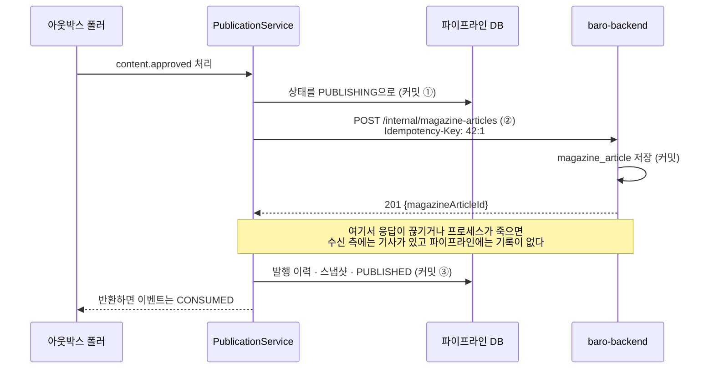

baro에는 뉴스를 모아 검증한 뒤 기사 덱으로 만드는 파이프라인(magazine-pipeline)이 있습니다.
사용자에게 기사를 보여 주는 서버는 이 레포가 아니라 별도 레포인 baro-backend입니다.
파이프라인은 Mac mini 한 대에서 자기 PostgreSQL을 쓰고, baro-backend는 AWS RDS를 씁니다.
에디터가 검수를 승인하면 파이프라인이 baro-backend의 내부 API를 HTTP로 불러 기사를 넘기고, 돌려받은 기사 id를 자기 DB에 기록합니다.

서로 다른 DB에 쓰는 일이라 한 트랜잭션으로 묶을 수 없습니다. 그래서 수신 측은 저장을 마쳤는데 파이프라인은 그 사실을 기록하지 못한 구간이 생깁니다.
응답이 타임아웃으로 끊기거나, 응답은 받았지만 기록하기 전에 프로세스가 죽는 경우입니다.
이때 파이프라인이 아는 것은 보냈는지 안 보냈는지 모른다는 것뿐이고, 그대로 다시 보내면 같은 기사가 두 번 올라갈 수 있습니다.

이 구간은 세 가지로 다뤘습니다.

1. 호출하기 전에 항목 상태를 `PUBLISHING`으로 바꿔 먼저 커밋합니다. 모르는 상태가 DB에 그대로 남습니다.
2. 재시도는 `PUBLISHING`인 항목도 다시 보냅니다.
3. 요청마다 멱등키 `contentItemId:deckVersion`을 싣고, 수신 측은 처음 보는 키면 201, 이미 받은 키면 저장해 둔 기사 id와 함께 200을 돌려줍니다.

로컬 재현(2026-09-24, PostgreSQL 17)은 이번에 직접 돌렸고, dev 환경 관측(2026-08-10)은 당시 남긴 기록을 옮겼습니다.
운영에서는 덱 조립 단계가 꺼져 있고(`magazine.composition.enabled=false`) magazine-app도 2026-09-17부터 멈춰 있습니다. 이 경로의 운영(prd) 동작은 관측하지 않았습니다.

## 왜 HTTP로 넘기나

설계 문서에 네 가지 방식을 비교한 기록이 있습니다. 기준은 파이프라인이 이미 지키고 있던 규칙이었습니다.
단계 사이를 잇는 아웃박스 핸들러들은 모두 자기 작업이 끝난 것을 확인한 뒤에야 성공을 반환합니다. 레포 경계를 넘는 발행도 같은 규칙을 따라야 했습니다.

| 방식 | 판단 |
| --- | --- |
| baro-backend DB에 직접 쓰기 | 서비스 레이어의 검증을 건너뛰고, 스키마가 바뀌면 파이프라인의 SQL이 조용히 깨진다. 기각 |
| SQS | `SendMessage` 성공은 큐에 들어갔다는 뜻이지 저장됐다는 뜻이 아니다. 확인하려면 회신 큐를 따로 만들어야 한다. 기각 |
| S3에 떨구고 baro-backend가 가져가기 | 당시 api-app에는 스케줄러를 돌린 선례가 없었고 배치 앱은 한 번 돌고 끝나는 구조라, 주기적으로 확인할 주체가 없었다. 기각 |
| api-app에 HTTP POST | 응답을 동기로 받아 완료를 확인할 수 있고, 새로 배포할 대상이 생기지 않는다. 채택 |

SQS는 새 인바운드 포트가 생기지 않고 인증을 IAM으로 해결한다는 점에서 HTTP보다 나은 면도 있었다고 문서에 남아 있습니다. 완료를 확인할 수 없다는 한 가지 때문에 떨어졌습니다.

HTTP를 고른 대가도 있습니다. 내부 쓰기 엔드포인트가 회원용 공개 API와 같은 프로세스에 들어갔습니다.
또 api-app의 기존 JWT 인터셉터는 `Authorization` 헤더가 보이면 무조건 JWT로 파싱하려 들어서, 내부 인증 토큰은 `X-Internal-Token`이라는 별도 헤더로 보냅니다.

## 트랜잭션 하나로 묶어도 풀리지 않는다

발행 한 건이 지나가는 순서는 이렇습니다.



①부터 ③까지를 `@Transactional` 하나로 묶는 방법도 있지만, 이 구간에서는 도움이 되지 않습니다. 이유는 두 가지입니다.

첫째, 수신 측의 커밋은 파이프라인의 롤백으로 되돌릴 수 없습니다. 응답을 기다리다 실패해 롤백하면 파이프라인 DB만 승인 상태로 돌아가고, 기록은 "안 보냈다"고 말하게 됩니다. 실제로는 나갔을 수 있는데도 그렇습니다.

둘째, 외부 응답을 기다리는 동안 DB 커넥션을 계속 쥐고 있어야 합니다. 이 앱의 운영 커넥션 풀은 5개입니다.

그러니 로컬 트랜잭션을 어떻게 잡든 중복은 막히지 않습니다. 중복은 수신 측이 이미 받은 요청을 알아볼 때만 막을 수 있고, 그게 멱등키의 역할입니다.
파이프라인 쪽에서 할 일은 모르는 상태를 거짓 없이 남기고, 재시도가 그 상태를 빠뜨리지 않게 하는 것입니다.

## 발행을 세 번의 쓰기로 나눴다

`PublicationService.publish()`에서 정정 관련 검증을 빼면 이렇습니다.

```kotlin
fun publish(contentItemId: Long): PublicationOutcome? {
    val status = publicationStore.status(contentItemId) ?: return null
    val deck = publicationStore.deckMeta(contentItemId) ?: return null
    val latest = publicationStore.existingPublication(contentItemId)

    if (status == ContentItemStatus.PUBLISHED && latest?.deckVersion == deck.deckVersion) {
        return PublicationOutcome(latest.magazineArticleId, created = false, alreadyPublished = true, /* ... */)
    }
    if (status != ContentItemStatus.APPROVED && status != ContentItemStatus.PUBLISHING) {
        log.info { "발행 대상 상태가 아님(스킵): contentItem=$contentItemId status=$status" }
        return null
    }

    publicationStore.markPublishing(contentItemId)                        // ①
    val idempotencyKey = "$contentItemId:${deck.deckVersion}"

    val result = publishClient.publish(                                   // ②
        PublishRequest(idempotencyKey = idempotencyKey, pipelineRef = idempotencyKey, /* 덱 블록 등 */),
    )

    publicationStore.recordPublication(                                   // ③
        contentItemId, result.magazineArticleId, idempotencyKey, deck.deckVersion, /* ... */
    )
    return PublicationOutcome(result.magazineArticleId, result.created, alreadyPublished = false, /* ... */)
}
```

`publish()`에는 트랜잭션이 없습니다. ①의 `markPublishing`은 JdbcTemplate UPDATE 한 문장이라 실행하는 즉시 커밋됩니다.
③의 `recordPublication`은 `@Transactional`이고, 발행 이력 INSERT, 불변 스냅샷 봉인, 정정 회차 종료, `PUBLISHED` 전이를 한 번에 커밋합니다.

재시도는 아웃박스가 맡습니다. 핸들러가 예외를 던지면 폴러가 2초, 4초, 6초, 8초 간격으로 다시 부르고 다섯 번째 실패에서 DEAD로 보냅니다.
프로세스가 죽으면 이벤트는 PENDING인 채로 남았다가 리스 10분이 끝난 뒤 다시 클레임됩니다. 자세한 구조는 [Kafka 없이 아웃박스를 만든 글](/blog/outbox-without-kafka/)에 적었습니다.

어디서 멈추든 다음 시도는 같은 코드를 탑니다.

| 멈춘 곳 | 파이프라인 상태 | 수신 측 | 다음 시도 |
| --- | --- | --- | --- |
| ① 전 | `APPROVED` | 없음 | 처음 보내는 것과 같다. 201 |
| ① 뒤, 요청이 수신 측에 닿기 전 | `PUBLISHING` | 없음 | 보낸다. 201 |
| 수신 측 커밋 뒤, ③ 전 | `PUBLISHING` | 있음 | 같은 키로 보내 200과 저장된 id를 받고 ③을 한다 |
| ③ 뒤, 이벤트 CONSUMED 전 | `PUBLISHED` | 있음 | 같은 덱 버전의 발행 이력이 있으니 건너뛴다 |

세 번째 줄이 이 글이 다루는 구간입니다. 여기서 `PUBLISHING`이 하는 일은 중복을 막는 것이 아닙니다. "보냈을 수도 있다"는 사실을 DB에 남기고, 재시도가 그 항목을 다시 집게 하는 것입니다.

③도 두 번 실행될 수 있어서 멱등하게 만들었습니다.

```sql
INSERT INTO pipeline.publications
    (content_item_id, magazine_post_id, idempotency_key, deck_version, publication_kind)
VALUES (?, ?, ?, ?, ?)
ON CONFLICT (idempotency_key) DO UPDATE
SET idempotency_key = EXCLUDED.idempotency_key
RETURNING id
```

`DO NOTHING`을 쓰면 충돌했을 때 `RETURNING`이 행을 돌려주지 않습니다. 뒤이어 스냅샷을 이 id에 붙여야 해서, 값이 바뀌지 않는 UPDATE로 기존 행의 id를 받아 옵니다.
스냅샷 쪽은 `ON CONFLICT (publication_id) DO NOTHING`입니다. 한 번 봉인된 스냅샷은 다시 쓰지 않습니다.

## 처음 코드는 이 재시도를 성공으로 닫았다

글을 쓰려고 이력을 거슬러 올라가 보니, 2026-07-20 커밋(`15da7d9`)의 상태 검사는 지금과 달랐습니다.

```kotlin
if (status != ContentItemStatus.APPROVED) {
    log.info { "발행 대상 상태가 아님(스킵): contentItem=$contentItemId status=$status" }
    return null
}
```

①은 그때도 있었습니다. 첫 시도가 ① 뒤에 HTTP에서 예외를 던지면 폴러가 재시도하고, 두 번째 시도는 `PUBLISHING`을 보고 `null`을 반환합니다.
핸들러가 예외 없이 끝나면 폴러는 이벤트를 CONSUMED로 바꿉니다. 아웃박스 입장에서는 성공입니다.

코드만 보고 단정하기보다 직접 돌려 봤습니다. 작업 트리와 분리된 git worktree에서 발행 클라이언트를 가짜 수신자로 바꿨습니다.
가짜 수신자는 기존 스텁처럼 키별로 기사를 기억하고, 첫 요청에서는 저장까지 마친 뒤 `ResourceAccessException`(읽기 타임아웃이 날 때 나오는 예외)을 던집니다.
그다음 실제 `OutboxPoller.poll()`을 두 번 불렀습니다. 옛 조건은 지금 코드에서 위 한 줄만 되돌린 것입니다.

| | 폴링 1회 뒤 | 폴링 2회 뒤 |
| --- | --- | --- |
| 지금 코드 | `PUBLISHING`, 이벤트 PENDING(실패 1), 발행 이력 0, 수신 측 1건(201) | `PUBLISHED`, CONSUMED, 발행 이력 1, 수신 측 1건(201, 200) |
| 옛 조건 | 위와 같음 | `PUBLISHING`, CONSUMED, 발행 이력 0, 수신 측 1건(201) |

옛 조건에서 두 번째 폴링이 남긴 로그는 `event=outbox.consume`과 "발행 대상 상태가 아님(스킵)" 두 줄이고, 둘 다 INFO입니다.
수신 측에는 기사가 올라가 있는데 파이프라인은 그 기사 id를 모르고, 항목은 `PUBLISHING`에 멈춰 있고, 다시 처리할 이벤트도 없습니다.
이 항목은 정정도 요청할 수 없습니다. 정정은 `PUBLISHED` 항목에만 열리기 때문입니다.

다섯 번 실패해 DEAD가 된 경우도 코드상 같습니다. 원인을 고친 뒤 운영자가 requeue하면 이벤트는 PENDING으로 돌아가지만, 핸들러가 같은 분기에서 `null`을 반환해 다시 CONSUMED로 닫힙니다.

이 조건은 2026-08-11 정정 기능 커밋(`cad0f77`)에서 `&& status != ContentItemStatus.PUBLISHING`이 붙으며 바뀌었습니다.
정정 설계 문서에는 "아웃박스 재시도에서 `PUBLISHING`도 안전하게 다시 전송한다"고 적었지만 커밋 메시지에는 언급이 없습니다. 약 3주 동안 옛 조건이었고, 그 사이 실제로 이 상황이 있었는지는 기록이 없습니다.

재현하면서 하나 더 확인했습니다. 발행 통합 테스트 5개는 옛 조건과 지금 조건 모두에서 통과했습니다. 이 수정을 지키는 테스트가 없었다는 뜻입니다.
그래서 위 재현을 승인부터 발행까지 폴러로 구동하는 E2E 테스트에 회귀 테스트로 옮겼습니다(`7a77726`). 첫 폴링 뒤에는 `PUBLISHING`과 발행 이력 0건을, 재시도 뒤에는 `PUBLISHED`와 같은 키 두 번(201, 200), 발행 이력 1건을 확인합니다.
가드를 옛 조건으로 되돌리면 이 테스트가 `expected: PUBLISHED but was: PUBLISHING`으로 실패하는 것도 확인했습니다.

돌아보면 상태 검사를 쓸 때 재시도가 도착할 수 있는 상태를 전부 적어 보고, 상태마다 다시 보낼지, 건너뛸지, 예외로 올릴지 정해 뒀어야 했습니다.
이 서비스에서 `null`을 돌려주는 분기는 아웃박스에게 성공과 같아서, 건너뛰기로 정한 상태는 INFO 한 줄만 남기고 닫힙니다.

## 멱등키는 contentItemId:deckVersion

키를 항목 id만으로 만들면 정정할 수 없습니다. 같은 항목의 새 덱이 같은 키를 쓰게 되어, 수신 측이 이미 받은 요청으로 보기 때문입니다(정정 경로에서는 409로 거절됩니다).
덱 버전은 조립할 때마다 1씩 오르고(`CompositionStore.nextDeckVersion`), 검수 서명은 덱 버전별로 셉니다. 버전이 오르면 이전 서명이 무효가 되어 다시 승인을 받아야 합니다.
그래서 키 하나가 사람이 승인한 덱 하나와 짝을 이룹니다.

수신 측 baro-backend는 이 키를 이렇게 처리합니다.

```kotlin
fun publish(command: PublishMagazineArticleCommand): MagazineArticleResult {
    magazineArticlePort.findByIdempotencyKey(command.idempotencyKey)?.let {
        // 멱등 재요청은 아무것도 덮어쓰지 않는다 — HIDDEN 으로 내린 건이 재수신으로 되살아나면 안 된다.
        return MagazineArticleResult(it.id, created = false)
    }
    val article = MagazineArticle(id = idGenerator.next(MAGAZINE_ARTICLE_ID_PREFIX), /* ... */)
    return try {
        magazineArticlePort.save(article)
        MagazineArticleResult(article.id, created = true)
    } catch (e: MagazineArticleWriteConflictException) {
        val existing = magazineArticlePort.findByIdempotencyKey(command.idempotencyKey) ?: throw e
        MagazineArticleResult(existing.id, created = false)
    }
}
```

먼저 조회하는 부분은 순차 재시도를 빨리 돌려보내기 위한 것이고, 동시 요청을 막아 주지는 않습니다.
같은 키가 동시에 들어오면 둘 다 조회에서 빈 결과를 보고 저장하러 갑니다. 승자는 `magazine_article.idempotency_key`의 UNIQUE 제약이 정합니다.

`save()`는 저장소 계층의 짧은 트랜잭션 안에서 `saveAndFlush`까지 끝냅니다. 진 쪽은 flush 시점에 제약 위반을 받고 그 트랜잭션은 롤백됩니다.
그 뒤 서비스가 승자를 다시 조회해 같은 id로 200을 돌려줍니다. 서비스 메서드에 트랜잭션을 걸지 않은 이유가 여기 있습니다.
PostgreSQL에서는 오류가 난 트랜잭션 안의 다음 문장이 모두 실패하므로, 재조회는 새 트랜잭션에서 해야 합니다.

### 본문은 비교하지 않는다

[멱등한 수신 API 설계](/blog/idempotent-receiver-api/)에서 다룬 랭킹 회차 API는 같은 id에 다른 내용이 오면 409로 거절합니다. 이 API는 본문을 비교하지 않습니다.
파이프라인이 요청을 만들 때마다 `publishedAt = Instant.now()`를 넣기 때문입니다. 재시도할 때마다 본문이 달라지니, 비교하면 정상적인 재시도가 409가 됩니다.
그래서 여기서는 키만으로 같은 요청인지 판단하고, 이미 받은 키면 처음 저장한 것을 그대로 둡니다.

대신 키가 틀리면 수신 측은 알아챌 방법이 없습니다. 덱 내용이 바뀌었는데 버전이 그대로인 채 같은 키로 보내면, 200과 옛 기사 id가 돌아오고 바뀐 내용은 버려집니다.
지금은 덱을 바꾸는 경로가 조립 하나이고 조립은 매번 버전을 올려서 이런 일이 생기지 않습니다. 재시도의 안전이 이 키 하나에 걸려 있다는 것은 이런 뜻입니다.

### 계약과 관측

와이어 계약은 magazine-pipeline의 `contracts/publish-api.openapi.yaml`에 있습니다. 두 헤더가 필수이고, 응답은 201(신규)·200(멱등 재요청)·400(스키마 위반)·401(인증 실패)입니다.
본문의 `pipelineRef`는 지금 멱등키와 값이 같지만 용도가 다릅니다. 멱등키는 중복을 거르는 장치이고 `pipelineRef`는 이 기사가 파이프라인의 어느 항목, 어느 덱 버전에서 나왔는지 가리키는 출처 기록이라, 계약은 수신 측에 별도 컬럼으로 영구 보관하라고 적어 둡니다.

글을 쓰며 계약을 다시 읽다가 파이프라인의 동작과 어긋난 문장을 찾았습니다. OpenAPI는 Idempotency-Key를 관례상 만료되며 사라져도 되는 값이라고 적고 있었습니다.
그런데 파이프라인은 DEAD가 된 이벤트를 며칠 뒤 requeue할 때도, 항목이 `PUBLISHING`이면 같은 키로 다시 보냅니다. 수신 측이 그 사이 키를 잊었다면 그 재전송은 두 번째 기사가 됩니다.
지금 수신 측은 키를 UNIQUE 컬럼에 만료 없이 두고 있어 이 조건을 충족하지만, 계약은 수신 측이 키를 만료시키는 저장소로 옮겨도 된다고 허용하고 있었습니다.
그래서 두 엔드포인트의 헤더 설명에 기사가 존재하는 동안 키를 만료시키지 않는다고 적었습니다(계약 0.2.1, `e3ebd9d`). 와이어 형식은 바뀌지 않습니다.

검증은 두 레포가 나눠 가집니다.

- magazine-pipeline의 계약 테스트는 명세가 OpenAPI 3로 파싱되는지, 발행 엔드포인트에 두 헤더와 201·200·401 응답이 정의돼 있는지까지만 봅니다. 동작은 확인하지 않습니다.
- baro-backend의 수용 테스트가 동작을 봅니다. 같은 키 8개를 동시에 보내 201이 1개, 200이 7개, 기사 id가 1개, DB 행이 1개인지 확인합니다. 이 테스트는 H2의 PostgreSQL 호환 모드에서 돕니다.
- dev 환경(RDS PostgreSQL)에서는 2026-08-10에 잘못된 토큰 401, 첫 요청 201, 재요청 200과 같은 id, 동시 8요청 201×1·200×7·그 밖의 응답 0·고유 id 1을 관측한 기록이 있습니다. 파이프라인의 실제 `HttpPublishClient`로 dev에 발행하는 라이브 테스트도 통과했습니다.

baro-backend CI가 이 OpenAPI 파일을 읽어 대조하는 장치는 없습니다. 한쪽 계약이 바뀌어도 다른 쪽 빌드는 모릅니다.

## 정정도 같은 키 규칙을 쓴다

발행한 기사를 고칠 때는 새 기사를 만들지 않고 같은 기사에 revision을 더합니다. 경로는 `POST /internal/magazine-articles/{magazineArticleId}/revisions`이고 멱등키 형식은 같습니다.

파이프라인은 보내기 전에 세 가지를 확인합니다.

```kotlin
PublicationKind.CORRECTION -> {
    checkNotNull(correction) { "기존 발행본을 새 덱으로 덮으려면 열린 정정 요청이 필요함" }
    check(correction.basePublicationId == requireNotNull(latest).id) {
        "정정 기준 발행본이 최신 revision이 아님"
    }
    check(deckVersion > latest.deckVersion) {
        "정정 deckVersion은 최신 발행본보다 커야 함: latest=${latest.deckVersion} requested=$deckVersion"
    }
}
```

수신 측도 따로 막습니다. 기사 행을 `FOR UPDATE`로 잠근 뒤, 이미 받은 키면 같은 기사·같은 revision일 때만 200을 주고 아니면 409를 냅니다.
revision이 현재 값보다 크지 않아도 409입니다. 두 정정이 거꾸로 적용되는 일을 양쪽에서 한 번씩 막는 셈입니다.

응답을 받은 뒤에는 기사 id를 확인합니다.

```kotlin
if (latest != null && result.magazineArticleId != latest.magazineArticleId) {
    error("정정 응답이 기존 공개 아티클 ID와 다름: expected=${latest.magazineArticleId} actual=${result.magazineArticleId}")
}
```

정정 응답은 경로에 넣은 기존 기사 id를 그대로 돌려줘야 합니다. 다른 값을 그대로 기록하면 발행 이력이 다른 기사를 가리키고, 다음 정정은 그 기사 경로로 나갑니다.
`error()`는 예외를 던지므로 ③이 실행되지 않고, 아웃박스는 이 예외를 다른 실패와 똑같이 다룹니다. 다섯 번 재시도한 뒤 DEAD가 되고 ERROR 로그가 남습니다. 항목은 `PUBLISHING`, 정정 회차는 열린 채로 남습니다.

다만 이 검사는 수신 측이 이미 적용한 revision을 되돌리지는 못합니다. 막는 것은 파이프라인 기록이 틀린 기사를 가리키게 되는 일입니다.
지금 수신 측 코드에는 다른 id를 돌려줄 경로가 없어서, 계약이 어긋났을 때를 위한 장치입니다. 이 분기를 지나는 테스트는 없습니다.

정정 경로의 증거는 최초 발행보다 약합니다. 양쪽 레포의 로컬 통합·수용 테스트까지 통과했고, dev·prd에서 실제로 정정을 호출한 적은 없습니다.
baro-backend의 정정 동시 요청 테스트는 CodeBuild에서 가끔 200이 하나 모자라게 나왔는데, 로컬에서 35회 연속 통과해 원인을 찾지 못한 채 주석 처리돼 있습니다(issue #135).

## 기다림에도 끝이 있어야 재시도가 돈다

발행 클라이언트는 요청 팩토리를 직접 넣어 타임아웃을 겁니다.

```kotlin
private fun timeoutRequestFactory(): JdkClientHttpRequestFactory {
    val httpClient = HttpClient.newBuilder().connectTimeout(Duration.ofSeconds(5)).build()
    return JdkClientHttpRequestFactory(httpClient).apply { setReadTimeout(Duration.ofSeconds(60)) }
}
```

이 앱의 클래스패스에는 Apache HttpClient, Jetty, Reactor Netty가 없어서 `RestClient.builder()`는 요청 팩토리를 주지 않으면 `JdkClientHttpRequestFactory`를 고릅니다.
JDK `HttpClient`는 연결 타임아웃 기본값이 없고, 팩토리의 읽기 타임아웃도 기본값이 없습니다.
로컬에서 연결만 받고 응답하지 않는 소켓을 띄워 기본 `RestClient`로 POST를 보내 봤더니, 20초가 지나도 돌아오지 않았습니다.

이 파이프라인에서는 그 영향이 발행 한 건에 그치지 않습니다. 폴러는 한 틱에서 클레임한 이벤트를 키별로 묶어 가상 스레드에서 돌린 뒤, 모두 끝날 때까지 기다립니다(`future.get()`).
그리고 `@Scheduled(fixedDelay)`라서 이전 틱이 끝나야 다음 틱이 시작됩니다. 발행 요청 하나가 끝나지 않으면 다음 클레임이 일어나지 않고, 수집부터 검증까지 모든 단계가 함께 멈춥니다.

타임아웃은 2026-08-02(`3a81be6`)에 들어갔습니다. 계기는 발행이 아니었습니다. 장시간 관측 테스트가 검증 단계에서 55분 넘게 멈췄고, 같은 테스트를 다시 돌리니 2분 4초에 끝나 재현되지 않았습니다.
그걸 조사하다가 OpenAI 클라이언트 5개와 발행 클라이언트에 타임아웃이 없다는 걸 확인하고 함께 넣었습니다. 발행 클라이언트가 실제로 멈춘 적은 없습니다.

60초는 OpenAI 클라이언트용으로 정한 값을 그대로 복제한 것입니다. 그쪽 주석은 "LLM 완성은 느릴 수 있어 넉넉히"라고 이유를 적었고, 발행 API의 응답 시간을 재서 정한 값은 아닙니다.
저장 몇 번이 전부인 발행 요청에는 넉넉한 값으로 보이지만, 수신 측 응답 시간 분포는 재지 않았습니다. 연결 5초와 합쳐도 리스 10분보다 한참 짧아서, 한 번의 시도가 리스를 넘기지는 않습니다.

읽기 타임아웃은 요청이 수신 측에서 처리됐는지 알려 주지 않습니다. 그래서 타임아웃은 앞 표의 세 번째 줄로 들어가는 가장 흔한 길이고, 앞의 재현에서 가짜 수신자가 던지게 한 예외도 이것이었습니다.

## 201과 200을 나눠 남긴다

2026-08-22(`83258ad`) 전까지 `HttpPublishClient`에는 로그가 한 줄도 없었습니다. 이 파이프라인이 외부에 쓰는 유일한 경계인데, 두 레포 사이에서 문제가 생기면 이쪽에는 대조할 기록이 없었습니다.

```kotlin
val status = response.statusCode.value()
// 201 신규 / 200 멱등 히트. 이 구분이 없으면 "발행이 줄었다" 를 조사할 때
// 정말 안 나간 것인지 이미 나가 있어 재전송이 접힌 것인지 알 수 없다.
log.info {
    "event=publish.ok pipelineRef=${request.pipelineRef} magazineArticleId=$magazineArticleId " +
        "status=$status created=${status == HTTP_CREATED} revision=${request.previousMagazineArticleId != null} " +
        "took_ms=${elapsedMs(startedAt)}"
}
```

200을 성공 하나로 뭉쳐 세면 재전송이 접힌 건도 발행 건수에 섞입니다. `created=false`는 수신 측에 이미 도착했던 요청을 다시 보낸 경우이니, 따로 세면 앞에서 말한 모르는 구간을 지나온 재시도가 몇 번이었는지 알 수 있습니다.

실패는 이렇게 남깁니다.

```kotlin
val status = (e as? HttpStatusCodeException)?.statusCode?.value()
log.warn {
    "event=publish.failed pipelineRef=${request.pipelineRef} status=$status " +
        "revision=${request.previousMagazineArticleId != null} took_ms=${elapsedMs(startedAt)} " +
        "error=${e::class.simpleName}: ${e.message?.take(200)}"
}
throw e
```

스택은 싣지 않습니다. 예외를 다시 던지면 아웃박스 폴러가 재시도나 DEAD 로그에 스택을 남기기 때문입니다. 타임아웃처럼 응답이 없으면 `status`는 null로 남습니다.

두 레포를 잇는 좌표는 `pipelineRef`입니다. 수신 측은 같은 값을 `magazine_article.pipeline_ref`에 영구 보관하고, 액세스 로그에는 요청마다 경로, 상태 코드, 소요 시간이 한 줄씩 남습니다.
파이프라인 로그의 `pipelineRef`로 수신 측 DB의 행을 찾고, 시각과 상태 코드로 액세스 로그의 줄을 맞춰 볼 수 있습니다. 액세스 로그 자체에는 멱등키가 찍히지 않습니다.

## 남은 것

- 정정 응답의 기사 id를 확인하는 분기는 테스트가 없습니다.
- 정정 동시 요청 테스트는 원인을 모른 채 꺼져 있고, 정정의 dev·prd 호출은 관측하지 않았습니다.
- 두 레포의 계약을 한 CI에서 대조하는 장치가 없습니다. 이번 계약 문구도 수신 측 빌드가 읽지 않습니다.
- 운영에서 재시도가 200을 받은 비율은 재지 않았습니다. 운영 발행 경로가 꺼져 있어 잴 데이터도 아직 없습니다.
