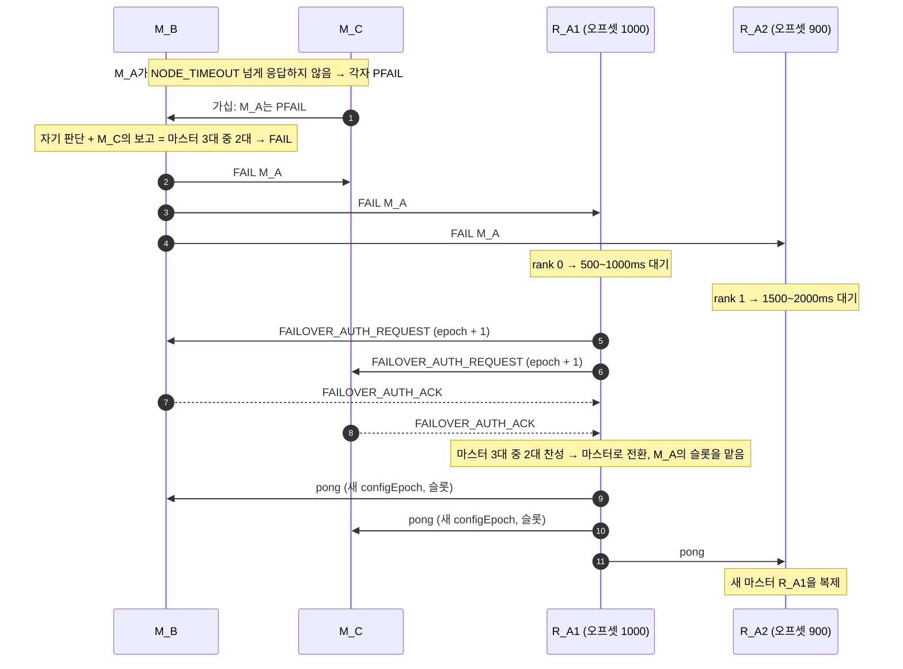

[복제 글](/blog/redis-replication/)에서 레플리카를 붙여 데이터를 한 벌 더 두었습니다. 하지만 복제만으로는 마스터가 죽었을 때 아무 일도 일어나지 않습니다.
누군가 마스터가 정말 죽었는지 판단하고, 레플리카 하나를 마스터로 올리고, 나머지 레플리카와 클라이언트가 새 마스터를 보게 해야 합니다. Redis에서는 이 일을 Sentinel이나 Redis Cluster가 맡습니다.

- **비동기 복제의 한계:** 어떤 방식이든 복제가 비동기라서, 장애 조치 중에 마스터가 응답까지 한 쓰기를 잃을 수 있습니다. `min-replicas-to-write`는 잃을 수 있는 시간 폭을 줄일 뿐입니다.
- **Sentinel:** 별도의 Sentinel 프로세스 여러 대가 마스터를 감시합니다. `quorum`만큼의 Sentinel이 장애에 동의하면 ODOWN이 되고, 과반의 표를 얻은 Sentinel 하나가 리더가 되어 레플리카를 골라 올립니다.
- **Cluster:** 감시 프로세스 없이 노드끼리 감시합니다. 과반의 마스터가 장애를 보고하면 FAIL이 되고, 그 마스터의 레플리카가 스스로 선거에 나서 과반 마스터의 승인을 받아 마스터가 됩니다.
- **소수 쪽에서는 올리지 않습니다:** 두 방식 모두 네트워크가 갈라졌을 때 소수 쪽에서는 새 마스터를 뽑지 않습니다.

## 먼저: 복제는 비동기입니다

Redis 복제는 마스터가 명령을 처리해 클라이언트에 응답한 뒤 레플리카에 전파합니다. 마스터가 응답 직후, 레플리카로 전파하기 전에 죽으면 그 쓰기는 승격된 레플리카에 없습니다.
Sentinel과 Cluster 모두 이 복제 위에서 동작하므로, 장애 조치 중에 클라이언트가 성공 응답까지 받은 쓰기를 잃을 수 있습니다.

이 폭을 줄이는 설정이 `min-replicas-to-write`와 `min-replicas-max-lag`입니다.

- 레플리카는 1초마다 마스터에 어디까지 받았는지 알립니다.
- 마스터는 마지막 알림으로부터 지난 시간(lag)이 `min-replicas-max-lag`초 이하인 레플리카가 `min-replicas-to-write`개 이상일 때만 쓰기를 받고, 아니면 오류를 돌려줍니다.
- 기본값은 꺼져 있습니다(`min-replicas-to-write 0`).

이 설정도 쓰기가 레플리카에 닿았다고 보장하지는 않습니다. 잃을 수 있는 시간 폭을 몇 초로 묶어 둘 뿐입니다. 대신 레플리카가 모두 죽거나 네트워크가 끊기면 마스터가 쓰기를 거부하니, 가용성을 조금 내주고 일관성을 챙기는 설정입니다.
쓰기마다 확인이 필요하면 `WAIT <레플리카 수> <타임아웃>`으로 레플리카가 받았다고 알려 올 때까지 기다릴 수 있습니다. 쓰기를 잃을 가능성은 크게 줄지만, 이것도 Redis를 강한 일관성 저장소로 만들지는 않습니다.

## Redis Sentinel

Sentinel은 Cluster를 쓰지 않을 때 Redis의 고가용성을 맡는 별도 프로세스입니다. 하는 일은 네 가지입니다.

- **모니터링:** 마스터와 레플리카가 제대로 동작하는지 계속 확인합니다.
- **알림:** 문제가 생기면 관리자나 다른 프로그램에 알립니다.
- **자동 장애 조치:** 마스터가 동작하지 않으면 레플리카 하나를 마스터로 올리고, 나머지 레플리카가 새 마스터를 복제하게 바꿉니다.
- **설정 제공:** 클라이언트는 Sentinel에 현재 마스터 주소를 묻습니다. 장애 조치 뒤에는 새 주소를 알려 줍니다.

Sentinel 자체도 여러 대가 함께 동작하는 분산 시스템입니다. 한 대의 판단으로 장애를 선언하지 않으니 오탐이 줄고, Sentinel 몇 대가 죽어도 동작합니다.
공식 문서는 서로 독립적으로 죽는 장비(다른 서버, 다른 가용 영역)에 최소 3대를 두라고 합니다. 기본 포트는 26379입니다.

2대로는 안 되는 이유는 이렇습니다. 마스터와 Sentinel S1이 한 장비에, 레플리카와 S2가 다른 장비에 있다고 해 봅시다. 마스터가 있는 장비째 죽으면 S1도 함께 죽고, 남은 S2 혼자서는 과반인 2표를 얻지 못해 장애 조치를 못 합니다.
과반은 전체 Sentinel 수를 기준으로 하므로 4대여도 3표가 필요합니다. 견딜 수 있는 장애 수가 3대와 같으니 보통 홀수로 둡니다.

### 장애 판단: SDOWN과 ODOWN

- **SDOWN(주관적 다운):** Sentinel 한 대가 혼자 내린 판단입니다. `down-after-milliseconds`(기본 30초) 동안 PING에 유효한 응답(`+PONG`, `-LOADING`, `-MASTERDOWN`)을 한 번도 받지 못하면 그 인스턴스를 SDOWN으로 봅니다. 그 시간 안에 한 번이라도 유효한 응답을 받으면 살아 있는 것으로 봅니다. 30초 설정에서 29초마다 응답하면 정상입니다.
- **ODOWN(객관적 다운):** `quorum` 이상의 Sentinel이 SDOWN이라고 알려 오면 ODOWN이 됩니다. Sentinel들은 `SENTINEL is-master-down-by-addr`로 서로의 판단을 묻습니다. 여기에는 강한 합의 알고리즘을 쓰지 않습니다. 정해진 시간 안에 충분한 보고를 받으면 ODOWN으로 올리고, 보고가 끊기면 다시 내리는 가십에 가깝습니다. ODOWN은 마스터에만 있습니다.

`quorum`은 장애를 판단하는 기준일 뿐, 장애 조치를 해도 된다는 허가가 아닙니다. 실제 장애 조치는 과반의 표를 얻은 Sentinel만 할 수 있습니다(`quorum`을 과반보다 크게 잡았다면 `quorum`만큼).
공식 문서의 예로, Sentinel 5대에 `quorum`이 2면 2대가 동의하는 순간 장애 조치가 시작되지만, 그 Sentinel이 실제로 진행하려면 3대 이상의 허가를 받아야 합니다. 그래서 소수 파티션에서는 장애 조치가 일어나지 않습니다.

### 리더 선출

ODOWN이 되면 장애 조치를 맡을 Sentinel 하나를 뽑습니다.

1. 장애 조치를 하려는 Sentinel은 자기 `current_epoch`를 1 올리고, 다른 Sentinel에게 자기를 뽑아 달라고 요청합니다. `is-master-down-by-addr`에 자기 run ID를 실어 보냅니다.
2. 각 Sentinel은 한 epoch에 한 번만 투표하고, 먼저 온 요청에 표를 줍니다.
3. 알고 있는 전체 Sentinel의 과반, 그리고 `quorum` 이상의 표를 받으면 리더가 됩니다.

다른 Sentinel에게 표를 준 Sentinel은 같은 마스터의 장애 조치를 `failover-timeout`(기본 3분)의 2배 동안 시도하지 않습니다. 여러 Sentinel이 동시에 나서지 않고, 첫 시도가 실패하면 다른 Sentinel이 잠시 뒤 이어받습니다.

임기(epoch)마다 한 표, 먼저 온 요청에 투표, 과반이면 당선이라는 점에서 [Raft](https://raft.github.io/)의 리더 선출과 닮았습니다.
리더가 된 Sentinel은 그 epoch를 새 설정의 버전 번호로 씁니다. 과반이 한 Sentinel에게 허가했으니 같은 번호를 다른 Sentinel이 쓸 수 없고, 장애 조치마다 설정 버전이 겹치지 않습니다.

### 어떤 레플리카를 올리나

리더는 먼저 믿기 어려운 레플리카를 뺍니다.

- SDOWN 상태인 레플리카
- 마스터와 끊긴 시간이 `down-after-milliseconds × 10 + 마스터가 SDOWN이 된 뒤 지난 시간`보다 긴 레플리카. 데이터가 너무 오래되었을 수 있습니다.

남은 레플리카를 이 순서로 비교합니다.

1. `replica-priority`가 낮은 쪽. 기본값은 100이고, 0이면 절대 마스터로 올리지 않습니다.
2. 마스터에게서 받은 데이터가 많은(복제 오프셋이 큰) 쪽
3. run ID가 사전순으로 작은 쪽. 더 나아서가 아니라 선택 결과를 늘 같게 만들려는 규칙입니다.

### 올리고 알리기

1. 고른 레플리카에 `REPLICAOF NO ONE`을 보내 마스터로 바꿉니다. 이 변화가 그 인스턴스의 `INFO`에 보이면 장애 조치는 성공한 것으로 봅니다.
2. 나머지 레플리카에 새 마스터를 복제하라고 알립니다. 한 번에 몇 대씩 바꿀지는 `parallel-syncs`(기본값 1)로 정합니다. 레플리카는 전체 동기화 끝에 새 데이터를 읽는 동안 요청을 받지 못하므로, 한 대씩 바꾸면 레플리카가 한꺼번에 응답하지 못하는 일을 피할 수 있습니다.
3. 새 설정(새 마스터 주소와 epoch)을 마스터와 레플리카의 `__sentinel__:hello` Pub/Sub 채널로 퍼뜨립니다. Sentinel들은 epoch가 더 큰 설정을 따르므로 결국 같은 설정으로 모입니다.
4. 옛 마스터가 돌아오면 Sentinel이 새 마스터의 레플리카로 바꿉니다.

### 클라이언트는 새 마스터를 어떻게 찾나

Sentinel을 지원하는 클라이언트는 마스터 주소 대신 Sentinel 목록을 가지고 시작합니다.

- `SENTINEL GET-MASTER-ADDR-BY-NAME <이름>`으로 현재 마스터 주소를 묻습니다. 장애 조치 중이거나 끝났으면 승격된 레플리카의 주소를 받습니다.
- Sentinel은 마스터가 바뀌면 `+switch-master` 이벤트를 Pub/Sub으로 알립니다. 공식 문서는 외부 사용자에게 가장 중요한 메시지라고 적고 있습니다. 클라이언트는 이 이벤트를 받아 연결을 새 마스터로 바꿉니다.

[우아한레디스 발표](https://www.youtube.com/watch?v=mPB2CZiAkKM)에서는 장애 조치 뒤 클라이언트가 새 마스터로 옮겨 가게 하는 방법으로 이런 것들도 소개합니다.

- **Coordinator:** ZooKeeper, etcd, Consul 같은 곳에 현재 마스터를 적어 두고, 클라이언트가 변경을 받아 연결을 바꿉니다. 이 연동 코드를 직접 짜야 합니다.
- **VIP:** 마스터에 가상 IP를 붙여 두고, 장애 조치 때 새 마스터로 옮깁니다. Sentinel에는 장애 조치로 마스터가 바뀌면 스크립트를 실행하는 `client-reconfig-script` 설정이 있어, 여기서 IP를 옮길 수 있습니다. 클라이언트는 IP 하나만 보면 되지만, 기존 연결을 끊고 새로 붙는 동안의 지연은 감안해야 합니다.
- **DNS:** 마스터 주소를 도메인으로 두고 레코드를 바꿉니다. 클라이언트가 DNS 조회 결과를 캐시하면 바뀐 주소를 늦게 봅니다. 예를 들어 JDK는 security manager가 없으면 조회 결과를 30초 동안 캐시하고, 있으면 기본적으로 계속 캐시합니다(`networkaddress.cache.ttl`).

### 네트워크가 갈라졌을 때 쓰기를 잃는 경우

공식 문서의 예입니다. 장비 3대에 Redis와 Sentinel을 하나씩 두고 `quorum`을 2로 잡았습니다.
네트워크가 끊겨 옛 마스터 M1이 클라이언트 C1과 함께 고립되고, 나머지 쪽에서는 레플리카 R2가 새 마스터로 올라갑니다. C1은 그동안에도 M1에 계속 씁니다.
네트워크가 돌아오면 M1은 새 마스터의 레플리카가 되면서 자기 데이터를 버리고, 그 사이 C1이 쓴 데이터는 사라집니다.

M1에 `min-replicas-to-write 1`, `min-replicas-max-lag 10`을 두면, M1은 레플리카에 쓰지 못한 지 10초가 지나면 쓰기를 거부합니다. 잃는 폭이 10초 정도로 줄어듭니다.
대신 레플리카 둘이 모두 죽으면 마스터도 쓰기를 멈춥니다.

## Redis Cluster

Cluster는 [샤딩](/blog/redis-sharding/)과 장애 조치를 함께 제공합니다. Sentinel 같은 별도 프로세스 없이 데이터 노드들이 서로를 감시합니다.

- 노드마다 클라이언트용 포트(예: 6379) 말고 노드끼리 통신하는 클러스터 버스 포트를 엽니다. 기본은 데이터 포트 + 10000(예: 16379)이고, `cluster-port`로 바꿀 수 있습니다. 바이너리 프로토콜을 씁니다.
- 모든 노드가 서로 TCP로 연결된 풀 메시(full mesh)입니다. ping과 pong(하트비트)에 자기 상태와 맡은 슬롯, 그리고 몇몇 다른 노드에 대한 소식(가십)을 실어 보냅니다.
- 노드는 매초 무작위로 몇 노드에 ping을 보내고, `NODE_TIMEOUT`의 절반 동안 소식이 없던 노드에는 빠짐없이 ping을 보냅니다.

### 장애 판단: PFAIL과 FAIL

- **PFAIL(Possible failure):** 보낸 ping의 응답을 `NODE_TIMEOUT`보다 오래 받지 못하면 그 노드를 PFAIL로 표시합니다. `NODE_TIMEOUT`은 `cluster-node-timeout`으로 정하고 기본값은 15초입니다. 마스터든 레플리카든 표시할 수 있습니다. `NODE_TIMEOUT`의 절반 동안 응답이 없으면 먼저 TCP 연결을 새로 맺어 봐서, 연결 문제 때문에 장애로 잘못 판단하는 일을 줄입니다.
- **FAIL:** 노드 A가 B를 PFAIL로 보고 있고, 가십으로 모은 소식에서 과반의 마스터가 `NODE_TIMEOUT × 2` 안에 B를 PFAIL이나 FAIL로 보고했다면, A는 B를 FAIL로 표시하고 닿을 수 있는 모든 노드에 FAIL 메시지를 보냅니다. 받은 노드는 모두 B를 FAIL로 표시합니다.

여기서 과반은 슬롯을 하나 이상 맡은 마스터 수를 기준으로 합니다. A가 마스터라면 자기 판단도 한 표로 셉니다.
공식 문서는 이 동의가 약하다고 설명합니다. 여러 노드의 판단을 서로 다른 시점에 모은 것이라 어느 한순간 과반이 동의했다는 보장은 없고, 오래된 보고를 버려서 일정 시간 안의 보고만 쓸 뿐입니다. FAIL은 뒤에 이어지는 더 엄격한 선거를 시작하는 신호입니다.

### 레플리카 선거와 승격

Sentinel에서는 Sentinel이 레플리카를 골라 올립니다. Cluster에는 외부 감시자가 없어서, 죽은 마스터의 레플리카가 스스로 "내가 마스터를 맡겠다"며 선거를 시작하고, 다른 마스터들이 승인할지 투표합니다.

레플리카는 이럴 때 선거를 시작합니다.

- 자기 마스터가 FAIL 상태입니다.
- 그 마스터가 슬롯을 하나 이상 맡고 있었습니다.
- 마스터와 끊긴 시간이 너무 길지 않습니다. 기준은 `NODE_TIMEOUT × cluster-replica-validity-factor`(기본 10)이고, 0으로 두면 끊긴 시간과 상관없이 시도합니다.

선거에 바로 나서지 않고 잠시 기다립니다.

```text
DELAY = 500ms + (0~500ms 사이 무작위) + REPLICA_RANK × 1000ms
```

- **고정 500ms:** FAIL 소식이 클러스터에 퍼질 시간을 줍니다. 마스터들이 아직 FAIL을 모르면 표를 주지 않기 때문입니다.
- **무작위 0~500ms:** 레플리카들이 동시에 선거에 나서지 않게 시점을 흩어 놓습니다.
- **rank:** 마스터에게서 받은 데이터가 많을수록(복제 오프셋이 클수록) rank가 낮고(0부터), 먼저 나섭니다. 레플리카끼리 주고받은 정보로 정하는 최선 노력(best effort) 순위라 엄격하지 않습니다. 앞 순위가 당선되지 못하면 다음 순위가 곧 나섭니다.

선거는 이렇게 진행됩니다.

1. 레플리카가 `currentEpoch`를 1 올리고, 모든 마스터에 `FAILOVER_AUTH_REQUEST`를 보냅니다.
2. 마스터는 조건이 맞으면 `FAILOVER_AUTH_ACK`로 찬성합니다. 반대 응답은 없고, 조건이 맞지 않으면 무시합니다.
3. `NODE_TIMEOUT × 2`(최소 2초) 안에 과반 마스터의 찬성을 받으면 당선입니다. 받지 못하면 이번 선거를 접고 `NODE_TIMEOUT × 4`(최소 4초) 뒤에 다시 시도합니다.

마스터가 찬성하는 조건은 이렇습니다.

- 한 epoch에 한 번만 투표하고, 예전 epoch의 요청에는 투표하지 않습니다. 마지막으로 투표한 epoch(`lastVoteEpoch`)를 디스크에 저장해 둡니다.
- 요청한 레플리카의 마스터가 FAIL로 표시되어 있어야 합니다.
- 같은 마스터의 레플리카에 이미 투표했다면 `NODE_TIMEOUT × 2` 동안은 그 마스터의 다른 레플리카에 투표하지 않습니다. 당선된 레플리카가 다른 레플리카들에 알릴 시간을 벌어, 불필요한 두 번째 장애 조치를 막습니다.
- 레플리카가 내세운 슬롯 설정의 버전(`configEpoch`)이 자기가 아는 것보다 낡았으면 투표하지 않습니다.
- 가장 좋은 레플리카를 고르려고 하지 않습니다. 조건만 맞으면 먼저 온 요청에 찬성합니다. 가장 최신 레플리카가 rank 덕분에 먼저 요청하니 보통 그 레플리카가 당선됩니다.

당선된 레플리카는 다른 어떤 마스터보다 큰 새 `configEpoch`를 얻어 마스터가 되고, 옛 마스터의 슬롯을 자기가 맡는다고 ping과 pong에 실어 알립니다. 빨리 퍼지도록 모든 노드에 pong을 한 번 보냅니다.
다른 노드들은 같은 슬롯을 더 큰 `configEpoch`로 주장하는 노드를 보고 설정을 바꾸고, 옛 마스터의 다른 레플리카는 새 마스터를 복제합니다. 이후 그 슬롯의 요청이 다른 노드로 가면 `MOVED`로 새 마스터를 안내받습니다.

마스터의 승인을 받는데도 "레플리카가 주도한다"고 부르는 것은, Sentinel처럼 외부 감시자가 올릴 레플리카를 고르지 않고 레플리카가 스스로 나서기 때문입니다. 스스로 올라가지 않고 투표를 거치는 이유도 있습니다.

- 투표 없이 스스로 올라가면, 네트워크가 갈라졌을 때 양쪽에서 각자 올라가 같은 슬롯의 마스터가 둘이 될 수 있습니다. 과반 마스터의 승인을 받아야 하니 소수 쪽에서는 올라가지 못합니다.
- 같은 epoch에 두 레플리카가 당선되는 일은 없습니다. 마스터마다 epoch당 한 번만 투표하기 때문입니다.
- 마스터는 슬롯의 주인입니다. 슬롯의 주인이 바뀌는 일을 살아 있는 마스터 과반이 승인해야, 누가 어느 슬롯을 맡는지에 대한 클러스터 전체의 기록이 꼬이지 않습니다.

### 예시: 마스터 셋, M_A에 레플리카 둘

마스터 M_A, M_B, M_C가 슬롯을 나눠 맡고, M_A에는 레플리카 R_A1(복제 오프셋 1000)과 R_A2(오프셋 900)가 있습니다. M_A가 죽었습니다.



| 단계 | 내용 | 비고 |
| --- | --- | --- |
| 장애 확정 | 마스터들이 가십으로 PFAIL을 모아 FAIL을 선언 | 마스터 과반의 보고, `NODE_TIMEOUT × 2` 안 |
| 대기 | R_A1은 500~1000ms, R_A2는 1500~2000ms 대기 | FAIL 전파, 시점 분산, 최신 레플리카 우선 |
| 선거 | 살아 있는 마스터에 투표 요청, 과반 찬성 | M_B, M_C가 투표 |
| 전파 | 새 마스터가 슬롯 소유를 알림 | 더 큰 `configEpoch`가 이김 |

전체 시간은 장애 감지(`NODE_TIMEOUT`)에 FAIL 전파, 대기, 선거 시간을 더한 만큼입니다. 공식 문서는 `NODE_TIMEOUT`이 지난 뒤 레플리카를 뽑고 장애를 조치하는 데 몇 초가 더 걸린다고 설명하고, 장애 조치 자체는 보통 1~2초 안에 끝난다고 적고 있습니다.
기본값(15초)이라면 마스터가 죽은 뒤 15초가 넘도록 그 슬롯에 쓸 수 없다는 뜻입니다. `cluster-node-timeout`을 줄이면 빨라지지만, 공식 명세대로 이 값은 네트워크 왕복 시간보다 충분히 커야 합니다. 너무 줄이면 잠깐의 지연을 장애로 잘못 판단하고, 노드끼리 주고받는 ping도 늘어납니다.

### Cluster에서 쓰기를 잃는 경우

- **비동기 복제:** 앞에서 본 것과 같습니다. 마스터가 응답하고 레플리카에 전파하기 전에 죽으면 그 쓰기는 사라집니다.
- **소수 쪽 파티션:** 마스터가 클라이언트와 함께 소수 쪽에 갇히면, 과반 쪽에서 그 마스터의 레플리카가 올라가기 전까지 쓴 것을 잃을 수 있습니다. 다만 과반의 마스터와 `NODE_TIMEOUT` 넘게 연락이 끊긴 마스터는 쓰기를 거부하므로, 잃을 수 있는 폭에는 끝이 있습니다.
- **가용성 조건:** 과반의 마스터가 살아 있고, 죽은 마스터마다 올릴 레플리카가 있어야 클러스터가 계속 동작합니다. 마스터와 그 레플리카가 함께 죽으면 그 슬롯을 맡을 노드가 없고, 기본 설정(`cluster-require-full-coverage yes`)에서는 클러스터 전체가 요청을 받지 않습니다. 레플리카가 없는 마스터에 다른 마스터의 남는 레플리카를 옮겨 주는 replica migration이 이 위험을 줄여 줍니다.

## Sentinel과 Cluster 비교

| | Sentinel | Cluster |
| --- | --- | --- |
| 주 목적 | 고가용성 (샤딩 없음) | 샤딩과 고가용성 |
| 누가 감시하나 | 별도의 Sentinel 프로세스 (최소 3대) | 데이터 노드끼리 (클러스터 버스) |
| 장애 판단 | `quorum`개 Sentinel의 SDOWN → ODOWN | 과반 마스터의 PFAIL 보고 → FAIL |
| 장애 조치를 이끄는 쪽 | 과반의 표를 받은 Sentinel 리더 | 죽은 마스터의 레플리카 (과반 마스터가 승인) |
| 새 마스터 선택 | 리더가 priority, 복제 오프셋, run ID 순으로 고름 | rank 순으로 먼저 나선 레플리카가 당선되기 쉬움 |
| 클라이언트 | Sentinel에 마스터 주소를 물음 | 슬롯 배치를 들고 `MOVED`, `ASK`를 따라감 |
| 제약 | 저장 용량이 마스터 한 대의 메모리 | 여러 키 명령은 같은 슬롯에서만, 0번 DB만 |

데이터가 마스터 한 대에 들어가면 Sentinel로 충분하고, 한 대를 넘으면 Cluster가 필요합니다. 어느 쪽이든 복제가 비동기라는 점은 같으므로, 쓰기를 잃으면 안 되는 데이터라면 `min-replicas-to-write`, `WAIT`, 영속성 설정을 함께 따져 봐야 합니다.

## 참고 자료

- [Redis 문서: High availability with Redis Sentinel](https://redis.io/docs/latest/operate/oss_and_stack/management/sentinel/)
- [Redis 문서: Redis cluster specification](https://redis.io/docs/latest/operate/oss_and_stack/reference/cluster-spec/)
- [Redis 문서: Scale with Redis Cluster](https://redis.io/docs/latest/operate/oss_and_stack/management/scaling/)
- [Redis 문서: Redis replication](https://redis.io/docs/latest/operate/oss_and_stack/management/replication/)
- [Redis 문서: WAIT](https://redis.io/docs/latest/commands/wait/)
- [sentinel.conf (Redis 8.10.2)](https://github.com/redis/redis/blob/8.10.2/sentinel.conf), [redis.conf (Redis 8.10.2)](https://github.com/redis/redis/blob/8.10.2/redis.conf)
- [Redis 소스: sentinel.c](https://github.com/redis/redis/blob/8.10.2/src/sentinel.c), [cluster_legacy.c](https://github.com/redis/redis/blob/8.10.2/src/cluster_legacy.c) (Redis 8.10.2)
- [Raft](https://raft.github.io/)
- [OpenJDK: java.security의 networkaddress.cache.ttl 설명](https://github.com/openjdk/jdk21u/blob/master/src/java.base/share/conf/security/java.security)
- [[우아한테크세미나] 191121 우아한레디스 by 강대명님](https://www.youtube.com/watch?v=mPB2CZiAkKM)
