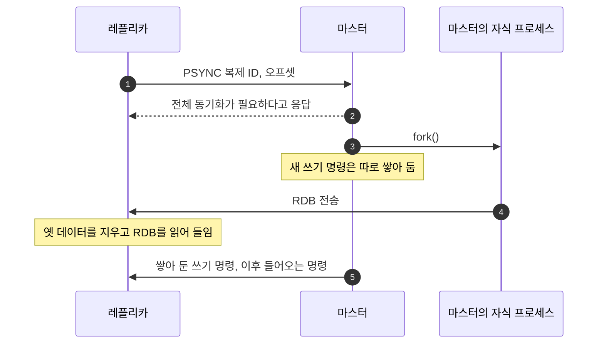

Redis를 처음 들이면 보통 마스터 한 대로 시작합니다. 그러면 곧 "Redis 서버가 뻗으면 어떡할 건데?"라는 질문을 받습니다. 한 대뿐인 서버는 그 자체가 단일 장애 지점(SPOF)이기 때문입니다.
가장 먼저 떠올리는 답은 마스터의 데이터를 그대로 복사해 두는 레플리카를 붙이는 것입니다.

이 글은 레플리카를 붙이는 순간 마스터에서 무슨 일이 일어나는지, 그 비용 때문에 메모리를 어떻게 관리해야 하는지를 정리합니다.
설정 기본값과 동작은 Redis 8.10 기준이고, 버전에 따라 달라진 부분은 본문에 적었습니다.

- **전체 동기화:** 레플리카를 처음 붙이거나 오래 끊겼다가 다시 붙으면, 마스터는 `fork()`로 자식 프로세스를 만들어 스냅샷(RDB)을 뜹니다. 쓰기가 많으면 이 동안 메모리를 평소의 최대 2배까지 쓸 수 있습니다.
- **부분 동기화:** 잠깐 끊겼다 붙으면 마스터가 backlog에 남겨 둔 만큼만 다시 받습니다. backlog가 작으면 짧은 끊김도 전체 동기화로 넘어갑니다.
- **메모리 관리:** 스왑이 일어나면 Redis가 멈칫거리고, 파편화 때문에 운영체제가 보는 메모리(RSS)는 Redis가 쓴다고 보고하는 양보다 커질 수 있습니다. `maxmemory`는 Redis가 보고하는 양을 기준으로만 동작합니다.
- **eviction:** 메모리가 `maxmemory`를 넘으면 정책에 따라 키를 지웁니다. 모든 키를 뒤지지 않고 표본을 뽑아 근사 LRU·LFU로 고릅니다.
- **복제의 한계:** 복제는 같은 데이터를 여러 벌 둘 뿐이라, 서버를 늘려도 담을 수 있는 양은 마스터 한 대의 메모리를 넘지 못합니다.

## 레플리카를 붙이면 일어나는 일

레플리카의 설정 파일에 `replicaof <마스터 IP> <포트>`를 적거나, 실행 중에 `REPLICAOF` 명령을 보내면 복제가 시작됩니다.
5.0 전까지는 이름이 `SLAVEOF`였습니다. 지금도 남아 있지만 deprecated입니다.

마스터는 자기 데이터의 이력을 가리키는 복제 ID(replication ID)와, 복제 스트림을 1바이트 만들 때마다 늘어나는 오프셋을 가지고 있습니다. 복제 ID와 오프셋 한 쌍이 곧 데이터셋의 정확한 한 시점입니다.
레플리카는 접속할 때 `PSYNC` 명령으로 자기가 알던 복제 ID와 어디까지 받았는지(오프셋)를 보냅니다. 마스터는 이것을 보고 둘 중 하나를 고릅니다.

- **부분 동기화(partial resync):** 복제 ID가 맞고, 레플리카가 빠뜨린 부분이 마스터의 backlog에 아직 남아 있으면 그 부분만 보냅니다.
- **전체 동기화(full resync):** 처음 붙는 레플리카이거나, 빠뜨린 부분이 backlog에 더는 남아 있지 않거나, 마스터가 모르는 복제 ID면 데이터 전체를 처음부터 보냅니다.

전체 동기화는 이렇게 진행됩니다.

1. 마스터가 백그라운드 저장을 시작합니다. `fork()`로 자식 프로세스를 만들고, 자식이 현재 메모리를 RDB 형식으로 씁니다.
2. 그동안 들어오는 쓰기 명령은 따로 쌓아 둡니다. 마스터는 복제하는 동안에도 요청을 계속 처리합니다.
3. RDB가 다 만들어지면 레플리카로 보냅니다. 레플리카는 받은 RDB를 디스크에 저장하고, 옛 데이터를 지운 뒤 메모리로 읽어 들입니다.
4. 마스터가 쌓아 둔 쓰기 명령을 보내고, 이후로는 들어오는 명령을 그대로 흘려보냅니다.

몇 가지를 덧붙입니다.

- **diskless 복제:** RDB를 마스터의 디스크에 쓰지 않고 자식 프로세스가 레플리카의 소켓으로 바로 보내는 방식입니다. 2.8.18에 들어왔고 7.0부터 기본값입니다(`repl-diskless-sync yes`). 전송이 시작된 뒤에 도착한 레플리카는 다음 차례로 밀리기 때문에, 마스터는 기본 5초(`repl-diskless-sync-delay`)를 기다렸다가 그 사이 모인 레플리카에게 함께 보냅니다. 디스크를 거치지 않을 뿐 `fork()`는 똑같이 하므로, 아래에서 볼 메모리 문제는 그대로입니다.
- **레플리카 쪽 읽기:** 레플리카는 기본값(`repl-diskless-load disabled`)에서 받은 RDB를 디스크에 먼저 저장한 뒤 읽습니다. 소켓에서 바로 읽게 할 수도 있는데, `swapdb` 옵션은 새 데이터를 다 읽을 때까지 옛 데이터를 메모리에 함께 들고 있어서 메모리가 더 필요합니다. 모자라면 OOM으로 죽을 수 있습니다.
- **레플리카가 멈추는 구간:** 전체 동기화 끝에 옛 데이터를 지우고 새 데이터를 읽는 동안 레플리카는 들어오는 연결을 막습니다. 데이터가 크면 몇 초 넘게 걸릴 수 있습니다.
- **Redis 8의 변화:** 8.0부터는 diskless 복제일 때 마스터가 RDB와 복제 스트림을 연결 두 개로 나눠 동시에 보내고, 복제 스트림은 레플리카가 쌓아 두는 방식이 들어왔습니다. 쓰기 명령을 쌓아 두는 부담이 마스터에서 레플리카로 옮겨 간 것입니다. 레플리카가 쌓아 둘 수 있는 양은 `replica-full-sync-buffer-limit`로 정합니다.

## 위험 1: fork와 Copy-on-Write

`fork()`는 부모 프로세스를 그대로 복사한 자식 프로세스를 만듭니다. 그렇다고 메모리를 통째로 복사하지는 않습니다.
운영체제는 Copy-on-Write(COW)로 부모와 자식이 같은 메모리 페이지를 함께 보게 하고, 어느 한쪽이 페이지를 고칠 때만 그 페이지를 복사합니다.

- **읽기가 많은 서비스:** 읽기는 페이지를 고치지 않으니 복사도 일어나지 않습니다. Redis는 자식 프로세스가 있는 동안에는 읽을 때 키의 마지막 접근 정보(LRU/LFU 값)도 갱신하지 않습니다. 이 갱신 때문에 페이지가 복사되는 일을 막으려는 것입니다.
- **쓰기가 많은 서비스:** 자식이 스냅샷을 뜨는 동안 마스터가 고친 페이지마다 복사본이 생깁니다. 공식 운영 가이드는 쓰기가 많으면 RDB 저장이나 AOF 재작성 중에 메모리를 평소의 **최대 2배**까지 쓸 수 있다고 적고 있습니다. 늘어나는 양은 그 사이 고친 페이지 수에 비례합니다.
- **결과:** 24GB를 쓰는 인스턴스라면 최악의 경우 24GB가 더 필요합니다. 물리 메모리가 모자라면 스왑이 일어나거나, 커널의 OOM killer가 Redis를 죽일 수 있습니다.

`fork()` 자체도 공짜가 아닙니다. 자식에게 페이지 테이블을 복사해 줘야 하는데, 이 작업은 메인 스레드에서 일어나서 그동안 Redis가 멈춥니다.
공식 문서의 계산으로는 24GB 인스턴스의 페이지 테이블이 48MB입니다(24GB ÷ 4KB × 8바이트). 마지막 `fork()`에 걸린 시간은 `INFO`의 `latest_fork_usec`로 볼 수 있습니다.

공식 운영 가이드는 리눅스에서 두 가지를 권합니다.

- **`vm.overcommit_memory = 1`:** 0이면 커널이 자식이 쓸 메모리를 미리 따져서, 부모 메모리를 전부 복제할 만큼 여유가 없으면 `fork()`가 실패합니다. 공식 FAQ의 예로 데이터셋이 3GB인데 여유 메모리가 2GB면 실패합니다. 1로 두면 커널이 `fork()`를 낙관적으로 허용합니다.
- **Transparent Huge Pages 끄기:** 켜져 있으면 큰 페이지 단위로 복사가 일어나서, 바쁜 인스턴스에서는 이벤트 루프 몇 번 만에 메모리 거의 전부가 복사됩니다. 지연과 메모리 사용이 함께 커집니다.

이 비용은 복제만의 문제가 아닙니다. `BGSAVE`(RDB 저장)와 AOF 재작성도 같은 방식으로 `fork()`합니다. 영속성을 꺼 두었어도 레플리카가 전체 동기화를 요청하면 마스터는 `fork()`합니다.

## 위험 2: 여러 대가 한꺼번에 전체 동기화할 때

전체 동기화는 데이터 전체를 네트워크로 보냅니다. 한 대라면 괜찮지만 여러 대가 한꺼번에 하면 네트워크가 먼저 버티지 못합니다.
[우아한레디스 발표](https://www.youtube.com/watch?v=mPB2CZiAkKM)에서 든 예가 이렇습니다. 같은 네트워크에서 30GB를 쓰는 마스터 100대가 네트워크 장애나 작업 실수로 한꺼번에 복제를 다시 시작하면 30GB × 100, 3TB가 한꺼번에 흐릅니다.
대역폭이 넘치면 Redis뿐 아니라 같은 망을 쓰는 다른 서비스까지 영향을 받습니다. 발표에서는 이런 경우 한 대씩 나눠서 복제를 다시 붙이라고 권합니다.

미리 줄일 수 있는 방법도 있습니다.

- **backlog를 넉넉하게:** 잠깐 끊긴 경우가 부분 동기화로 끝나야 전체 동기화가 몰리지 않습니다. `repl-backlog-size`의 기본값은 1MB라서 쓰기가 많으면 금방 넘칩니다. 공식 운영 가이드도 Redis가 쓰는 메모리에 비례해 넉넉하게 잡으라고 권합니다. 전체·부분 동기화가 얼마나 일어나는지는 `INFO`의 `sync_full`, `sync_partial_ok`, `sync_partial_err`로 봅니다.
- **동시에 붙는 레플리카:** 한 마스터에 동기화 요청이 동시에 들어오면 백그라운드 저장 한 번으로 모두 처리합니다. 다만 레플리카마다 데이터 전체를 보내는 것은 같습니다.
- **레플리카에 레플리카 붙이기:** 레플리카는 다른 레플리카를 마스터로 삼을 수 있습니다. 4.0부터는 아래 단계 레플리카도 최상위 마스터와 똑같은 복제 스트림을 받습니다. 마스터 한 대에 레플리카를 몰아 붙이지 않고 계층으로 나눌 수 있습니다.

## 마스터의 영속성을 끌 때

발표에서는 성능을 위해 마스터의 RDB/AOF를 끄고, 필요하면 레플리카에서만 켜라고 권합니다. 공식 문서도 이 구성을 소개하지만 조건을 하나 붙입니다. **영속성을 끈 마스터는 자동으로 재시작되면 안 됩니다.**

1. 마스터 A는 영속성을 껐고, 레플리카 B와 C가 A를 복제합니다.
2. A가 죽었다가 자동 재시작 장치 덕분에 곧바로 다시 뜹니다. 영속성이 꺼져 있으니 빈 데이터로 뜹니다.
3. B와 C는 빈 A를 복제해 자기 데이터까지 비웁니다.

Sentinel을 써도, A가 Sentinel이 장애를 알아채기 전에 재시작하면 같은 일이 생깁니다.
그래서 공식 문서는 복제를 쓸 때 마스터와 레플리카 모두 영속성을 켜라고 강하게 권하고, 디스크가 너무 느린 등의 이유로 그러지 못한다면 자동 재시작을 끄라고 합니다.

## 메모리 관리 1: 스왑

Redis의 속도는 모든 데이터를 메모리에서 바로 읽는 데서 나옵니다.
메모리가 모자라 커널이 Redis의 메모리 페이지를 스왑으로 내보내면, Redis가 그 페이지에 있는 키를 읽을 때 커널이 Redis 프로세스를 멈추고 디스크에서 페이지를 다시 읽어 옵니다. 랜덤 I/O라 느리고, Redis는 명령을 하나씩 처리하므로 그동안 다른 요청도 모두 기다립니다. 클라이언트 쪽에서는 타임아웃이 쏟아집니다.

스왑이 일어나고 있는지는 이렇게 봅니다.

- `INFO memory`에서 `used_memory`(Redis가 할당기로 할당한 양)가 `used_memory_rss`(운영체제가 보는 실제 상주 메모리)보다 눈에 띄게 크면 일부가 스왑으로 나간 것입니다.
- `/proc/<pid>/smaps`의 `Swap:` 항목으로 스왑된 양을 직접 볼 수 있습니다.

그러면 스왑을 아예 꺼 두면 될까요. 그러면 메모리가 넘칠 때 OOM killer가 Redis를 죽입니다.
공식 운영 가이드는 오히려 스왑을 메모리 크기만큼 켜 두고, 지연이 튀는 것을 보고 대응하라고 권합니다. 느려지는 쪽과 죽는 쪽 중에 고르는 문제이고, 어느 쪽이든 메모리를 넉넉히 두는 것이 먼저입니다.

## 메모리 관리 2: 큰 인스턴스 하나보다 작은 인스턴스 여러 개

발표에서는 CPU 4코어, 메모리 32GB 장비라면 24GB 인스턴스 하나보다 8GB 인스턴스 셋이 안전하다고 설명합니다.

- **24GB 한 대:** `fork()` 중 최악의 경우 24GB가 더 필요해 48GB가 됩니다. 32GB 장비로는 버틸 수 없습니다.
- **8GB 세 대:** 한 번에 한 대씩만 `fork()`하게 맞추면, 최악의 경우에도 더 필요한 메모리는 8GB입니다. 세 대가 동시에 `fork()`하면 결국 24GB 한 대와 같아지니, 저장과 복제 시점이 겹치지 않게 해야 합니다.

인스턴스가 작으면 `fork()`로 멈추는 시간도 짧습니다. 복사할 페이지 테이블이 작기 때문입니다. 명령을 처리하는 스레드가 하나라서, 인스턴스를 여러 개 띄우면 CPU 코어도 더 쓸 수 있습니다.
대신 관리할 인스턴스가 늘고, 데이터를 여러 인스턴스에 나눠 담는 방법이 필요합니다. 이 이야기는 [샤딩 글](/blog/redis-sharding/)로 이어집니다.

## 메모리 관리 3: 파편화

많은 키를 지웠는데 운영체제가 보는 Redis의 메모리(RSS)가 줄지 않는 경우가 있습니다.
공식 문서의 예로는 5GB를 채운 뒤 2GB어치를 지우면, Redis가 보고하는 사용량(`used_memory`)은 3GB 정도인데 RSS는 여전히 5GB 근처입니다.

원인은 메모리 할당기에 있습니다. 리눅스용 Redis는 기본으로 Redis 소스에 들어 있는 jemalloc을 씁니다.
jemalloc은 작은 할당을 크기 등급(8, 16, 32, 48, 64바이트 …)으로 올림해서, 같은 등급끼리 모아 둔 묶음(slab)에 촘촘히 담습니다. 1바이트를 요청하면 페이지 하나(4KB)가 아니라 8바이트짜리 칸 하나를 씁니다.
문제는 지울 때입니다. 한 페이지 안의 칸이 모두 비어야 그 페이지를 운영체제에 돌려줄 수 있는데, 지운 키와 남아 있는 키가 같은 페이지에 섞여 있는 경우가 많습니다. 그러면 사용량은 줄었는데 페이지는 그대로 붙잡혀 있습니다.

다만 비운 칸은 다시 씁니다. 2GB를 지운 뒤 키를 다시 2GB 넣으면 RSS는 거의 늘지 않습니다.
그래서 공식 문서는 평소 사용량이 아니라 가장 많이 쓸 때(peak)를 기준으로 메모리를 잡으라고 합니다.

파편화는 이렇게 봅니다.

- `mem_fragmentation_ratio`는 `used_memory_rss ÷ used_memory`입니다. 파편화 말고도 코드, 공유 라이브러리, 스택 같은 프로세스 오버헤드가 함께 들어 있습니다. 전체 차이가 몇 MB 수준이면 비율이 1.5를 넘어도 문제가 아닙니다.
- 할당기 안의 파편화만 보려면 `allocator_frag_ratio`, `allocator_frag_bytes`를 봅니다.
- 피크 뒤에 많이 지운 상태라면 RSS가 피크 때를 반영하고 있어서 비율이 높게 나옵니다.

줄이는 방법은 이렇습니다.

- **active defrag:** 4.0부터 있는 기능으로, 실행 중에 값을 연속된 메모리로 옮겨 담고 옛 사본을 풀어서 파편화를 줄입니다. 기본값은 꺼져 있고(`activedefrag no`), Redis 소스에 들어 있는 jemalloc으로 빌드했을 때만 동작합니다(리눅스 빌드의 기본값). 파편화가 생겼을 때 `CONFIG SET activedefrag yes`로 켜면 됩니다.
- **재시작:** redis.conf 설명대로라면 원래 파편화를 줄이려면 재시작하거나, 데이터를 모두 비우고 다시 넣어야 합니다. RSS를 계속 지켜보다가 기준을 넘으면 재시작하는 방법입니다.
- **비슷한 크기의 값:** 할당기는 크기 등급마다 칸을 따로 관리하므로, 어떤 등급에서 비운 칸은 같은 등급의 할당만 다시 쓸 수 있습니다. 크기가 들쭉날쭉한 값을 넣었다 지웠다 하면 이런 빈칸이 여기저기 남기 쉽습니다. 발표에서도 값의 크기를 비슷하게 맞추라고 권합니다.

## 메모리 관리 4: maxmemory와 eviction

`maxmemory`는 Redis가 데이터에 쓸 메모리의 상한입니다. 64비트 시스템의 기본값은 0(제한 없음)이라, 설정하지 않으면 Redis는 필요한 만큼 계속 할당하다가 장비의 메모리를 다 써 버릴 수 있습니다.
공식 운영 가이드는 명시적으로 설정하되, 데이터 외의 오버헤드와 파편화를 감안해 여유 메모리가 10GB라면 8~9GB로 잡으라고 합니다.

`maxmemory`를 넘었을 때 무엇을 할지는 `maxmemory-policy`로 정합니다. 기본값은 `noeviction`입니다.

| 정책 | 지우는 대상 |
| --- | --- |
| `noeviction` (기본값) | 지우지 않습니다. 메모리가 더 필요한 쓰기 명령은 OOM 오류를 받고, 읽기는 그대로 됩니다. |
| `allkeys-lru`, `volatile-lru` | 가장 오래 안 쓴 키 (근사 LRU) |
| `allkeys-lfu`, `volatile-lfu` | 가장 덜 자주 쓴 키 (근사 LFU, 4.0부터) |
| `allkeys-lrm`, `volatile-lrm` | 가장 오래 안 고친 키 (근사 LRM, 8.6부터). 읽기로는 시각이 갱신되지 않습니다. |
| `allkeys-random`, `volatile-random` | 무작위 |
| `volatile-ttl` | 만료가 가장 가까운 키 |

`allkeys-*`는 모든 키를, `volatile-*`는 만료 시간이 있는 키만 대상으로 합니다. `volatile-*` 정책인데 만료 시간이 있는 키가 없으면 `noeviction`처럼 동작합니다.
공식 문서는 다른 것을 고를 이유가 없다면 `allkeys-lru`를 무난한 선택으로 꼽습니다. 일부 키에 접근이 몰리는 경우가 흔하기 때문입니다.

`maxmemory`에는 조심할 점이 셋 있습니다.

- **비교 대상은 RSS가 아닙니다.** `maxmemory`는 Redis가 할당기로 할당한 양을 기준으로 동작하므로, 파편화로 RSS가 더 커지는 것은 막지 못합니다.
- **복제·AOF 버퍼는 계산에서 빠집니다.** 레플리카로 보낼 데이터와 AOF 버퍼는 사용량 계산에서 뺍니다(`INFO`의 `mem_not_counted_for_evict`). 이것까지 세면, 키를 지워서 생긴 `DEL`이 레플리카 버퍼를 채우고 그게 또 eviction을 부르는 악순환에 빠져 데이터가 모두 지워질 수 있기 때문입니다. 대신 레플리카를 붙였다면 `maxmemory`를 조금 낮게 잡아 버퍼가 쓸 메모리를 남겨 둬야 합니다. `noeviction`이면 필요 없습니다.
- **레플리카는 기본적으로 `maxmemory`를 무시합니다(5.0부터).** 키를 지우는 일은 마스터가 하고, 레플리카에는 `DEL`을 보냅니다. 레플리카가 `maxmemory`보다 메모리를 더 쓸 수 있으니 레플리카 메모리도 따로 지켜봐야 합니다.

### 언제 지우나

`maxmemory`가 설정되어 있으면 Redis는 명령을 실행하기 전에 매번 메모리를 확인하고, 넘었으면 정책에 따라 키를 지웁니다.
지울 키가 없으면(`noeviction`이거나, `volatile-*`인데 만료 시간이 있는 키가 없으면) 메모리를 늘릴 수 있는 명령(`SET`, `INCR`, `HSET`, `LPUSH` 등)은 OOM 오류로 거절합니다. 읽기 명령은 그대로 실행합니다.

지우는 데 시간이 오래 걸리면 그만큼 명령 응답이 늦어집니다. 그래서 6.2부터는 한 번에 지우는 시간에 상한이 있습니다.
`maxmemory-eviction-tenacity`(기본값 10)가 이 상한을 정하는데, 기본값에서는 약 500µs입니다. 상한 안에 목표만큼 지우지 못하면 나머지는 이벤트 루프의 타이머가 짧게 여러 번에 나눠 이어서 지우고, 원래 명령은 그대로 실행됩니다.
그래서 잠시 동안은 `maxmemory`를 넘은 상태가 이어질 수 있습니다. 큰 집합 연산의 결과를 새 키에 저장하는 것처럼 명령 하나가 데이터를 많이 만들면 한도를 크게 넘기도 합니다.

### 무엇을 지우나: 표본 뽑기와 후보 풀

가장 오래 안 쓴 키를 정확히 찾으려면 모든 키를 접근 순서대로 정렬해 들고 있어야 합니다. Redis는 그만큼의 메모리를 쓰지 않으려고 표본을 뽑아 근사합니다.

1. **표본 뽑기:** 키 공간에서 무작위로 `maxmemory-samples`개(기본값 5, 최대 64)를 뽑습니다. `allkeys-*`면 모든 키에서, `volatile-*`면 만료 시간이 있는 키에서 뽑습니다.
2. **후보 풀 채우기:** 3.0부터는 후보 풀(eviction pool)을 계속 들고 있습니다. 지금 구현에서 풀은 16칸입니다. 풀은 지울 만한 정도 순으로 정렬되어 있고, 새 표본이 풀에서 가장 약한 후보보다 낫거나 빈칸이 있으면 풀에 들어갑니다. 지울 만한 정도는 LRU·LRM이면 마지막으로 쓴(고친) 뒤 지난 시간이 길수록, LFU면 사용 빈도가 낮을수록, `volatile-ttl`이면 만료가 가까울수록 큽니다.
3. **지우기:** 풀에서 가장 지울 만한 키를 꺼내 지웁니다. 그사이 이미 사라진 키면 다음 후보로 넘어갑니다.
4. **반복:** 아직 한도를 넘으면 다시 표본을 뽑습니다.

`*-random` 정책은 풀 없이 무작위로 고릅니다.

표본을 늘리면 실제 LRU에 가까워지는 대신 CPU를 더 씁니다. redis.conf 설명으로는 10이면 실제 LRU에 매우 가깝고, 3이면 빠르지만 정확하지 않습니다.
공식 문서는 접근이 일부 키에 몰리는(멱법칙을 따르는) 패턴으로 시뮬레이션해 보니 실제 LRU와 거의 차이가 없었다고 설명합니다.

### 큰 키를 지울 때 멈추는 문제: lazy free

키를 지우는 일은 기본적으로 메인 스레드가 합니다. 원소가 몇 개 안 되는 키는 금방 끝나지만, 원소 수백만 개짜리 Hash나 List라면 메모리를 푸는 동안 서버가 오래(몇 초까지도) 멈추고 그동안 다른 요청은 모두 기다립니다.

4.0부터는 이 해제를 백그라운드 스레드로 넘길 수 있습니다. `lazyfree-lazy-eviction yes`로 두면 eviction 때 이렇게 바뀝니다.

1. 메인 스레드는 키를 키 공간에서 떼어 내기만 합니다. 키 크기와 상관없이 O(1)입니다.
2. 실제 메모리 해제는 백그라운드 스레드가 맡습니다.

기본값은 `no`입니다. 할당이 64개 이하인 작은 값은 백그라운드로 넘기는 편이 오히려 느려서, 옵션을 켜도 그 자리에서 바로 해제합니다.
해제가 나중에 일어나니 메모리가 줄어드는 것도 늦어집니다. 그래서 Redis는 키 16개를 지울 때마다 실제 사용량을 다시 확인하고, 목표에 닿으면 멈춥니다.

만료로 지울 때(`lazyfree-lazy-expire`), `RENAME`처럼 명령의 부수 효과로 지울 때(`lazyfree-lazy-server-del`), 레플리카가 전체 동기화 전에 데이터를 비울 때(`replica-lazy-flush`)도 같은 방식으로 백그라운드 해제를 켤 수 있습니다. 직접 지울 때는 `DEL` 대신 `UNLINK`를 쓰면 됩니다.

## 복제가 해 주는 것과 못 해 주는 것

- **해 주는 것:** 마스터와 같은 데이터를 가진 레플리카가 생깁니다. 마스터가 죽어도 레플리카를 마스터로 올려 서비스를 이어 갈 수 있고, 읽기를 레플리카로 나눌 수도 있습니다.
- **자동 승격은 없습니다.** 복제만으로는 누가 장애를 판단하고 누구를 올릴지 정해 주지 않습니다. 사람이 `REPLICAOF NO ONE`으로 올리거나, Sentinel이나 Cluster가 대신해야 합니다([HA 글](/blog/redis-high-availability/)).
- **쓰기를 잃을 수 있습니다.** 복제는 비동기라서, 마스터가 응답한 쓰기가 레플리카에 닿기 전에 마스터가 죽으면 승격된 레플리카에는 그 쓰기가 없습니다. `WAIT`로 레플리카의 확인을 기다리면 가능성은 크게 줄지만, 강한 일관성이 되지는 않습니다.
- **용량은 늘지 않습니다.** 모든 노드가 같은 데이터를 가지니, 서버를 100대로 늘려도 담을 수 있는 양은 마스터 한 대의 메모리(예: 32GB)를 넘지 못합니다. "저장할 데이터가 더 많으면?"이라는 다음 질문이 [샤딩](/blog/redis-sharding/)으로 이어집니다.

## 참고 자료

- [Redis 문서: Redis replication](https://redis.io/docs/latest/operate/oss_and_stack/management/replication/)
- [Redis 문서: Redis administration](https://redis.io/docs/latest/operate/oss_and_stack/management/admin/)
- [Redis 문서: Diagnosing latency issues](https://redis.io/docs/latest/operate/oss_and_stack/management/optimization/latency/)
- [Redis 문서: Memory optimization](https://redis.io/docs/latest/operate/oss_and_stack/management/optimization/memory-optimization/)
- [Redis 문서: Key eviction](https://redis.io/docs/latest/develop/reference/eviction/)
- [Redis 문서: INFO](https://redis.io/docs/latest/commands/info/)
- [Redis 문서: FAQ](https://redis.io/docs/latest/develop/get-started/faq/)
- [redis.conf (Redis 8.10.2)](https://github.com/redis/redis/blob/8.10.2/redis.conf)
- [Redis 소스: evict.c (Redis 8.10.2)](https://github.com/redis/redis/blob/8.10.2/src/evict.c)
- [jemalloc 매뉴얼](https://jemalloc.net/jemalloc.3.html)
- [[우아한테크세미나] 191121 우아한레디스 by 강대명님](https://www.youtube.com/watch?v=mPB2CZiAkKM)
