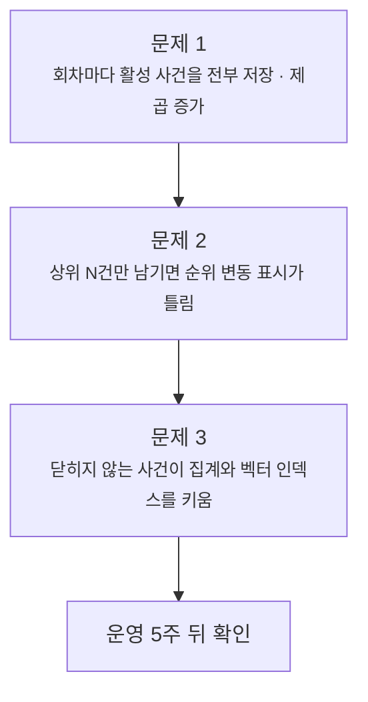
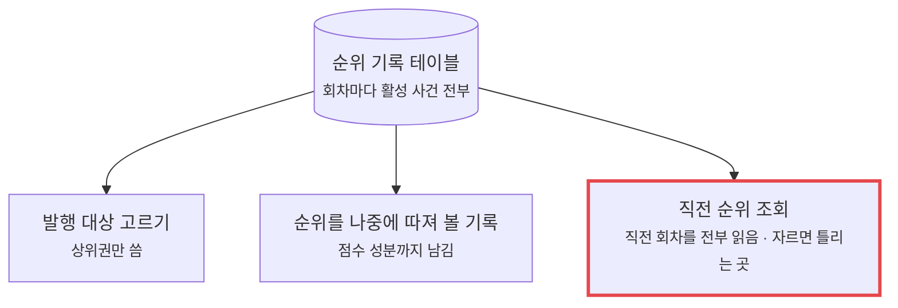
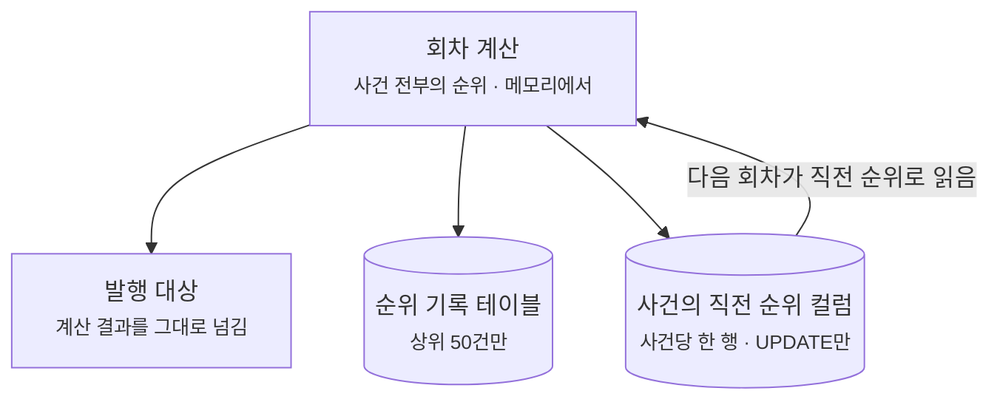

baro의 뉴스 인텔리전스 앱은 30분마다 분류별로 사건 순위를 매기고, 그 회차의 점수와 순위를 `trend_snapshot_items` 테이블에 남깁니다.
출시 전에 실제 피드로 이틀을 돌려 보니 이 테이블이 DB의 45%를 차지했고, 따져 보니 시간의 제곱으로 커지는 구조였습니다.

상위 50건만 남기면 끝날 것 같았지만, 그렇게 자르면 순위 변동 표시가 오류 없이 틀립니다. 그래서 이 테이블이 겸하던 역할부터 갈랐습니다.
출시 뒤 5주 동안 순위 회차는 3,308번 돌았습니다. 점수를 매긴 사건은 누적 550만 건이었고, 기록에는 16만 5천 행이 남았습니다.

문제는 세 개가 이어져 있었습니다.



## 전제

1. 앱은 Mac mini 한 대에서 돌고 DB도 그 안의 PostgreSQL 하나입니다. 디스크와 메모리를 늘려서 버티는 선택지는 없습니다.
2. 순위는 30분마다 분류별로 다시 매깁니다. 세 분류면 하루 144회차입니다.
3. 앱의 순위표에는 사건마다 상승·하락·신규 표시가 붙습니다. 이 표시가 틀리면 순위표 자체를 믿기 어렵습니다.
4. 사건은 1,536차원 임베딩 벡터를 가지고 있고, 새 기사가 들어오면 가까운 사건을 벡터 인덱스로 찾습니다.

## 문제 1. 이틀 만에 가장 큰 테이블

출시 전에 정치 분류 피드 5개로 이틀을 돌린 DB입니다. 전체는 86MB였습니다.

| 테이블 | 행 | 크기 |
| --- | ---: | ---: |
| `trend_snapshot_items` (순위 기록) | 85,801 | 39MB |
| `press_articles` (기사) | 667 | 24MB |
| `news_events` (사건) | 293 | 12MB |

기사가 667건인데 순위 기록은 8만 5천 행이었습니다.
스냅샷은 294개였고 모두 정확히 292행이었습니다. 292는 그때 활성 상태이던 사건 수입니다. 회차마다 활성 사건을 전부 한 행씩 저장하고 있었습니다.

```kotlin
val ranked = scores
    .map { it to computeAttentionScore(it) }
    .sortedByDescending { it.second }

val items = ranked.mapIndexed { index, (score, attention) ->
    TrendSnapshotItemEntity(snapshotId = snapshotId, eventRef = score.eventRef, rank = index + 1, /* 점수 성분 */)
}
trendStore.saveSnapshot(snapshotId, category, ALGORITHM_VERSION, activeSourceCount, items)   // 자르지 않고 전부
```

사건을 닫는 코드도 없었습니다. `CLOSED` 상태는 선언만 돼 있었고, 한번 만들어진 사건은 계속 활성이었습니다.
그러면 회차당 행 수는 그때까지 쌓인 사건 수이고, 누적 행 수는 날짜의 제곱을 따라갑니다.

```text
그날 쌓이는 행 = 하루 회차 수 × 그날까지 쌓인 사건 수
누적 행       ∝ 날짜²
```

엿새 뒤 같은 DB에서 회차당 행 수는 292에서 1,800으로 늘어 있었습니다.
그때 유입량으로 세 분류를 돌린다고 계산하면 한 달 뒤 3GB, 1년 뒤 445GB입니다.

행 하나는 0.47KB로 작습니다. 걸리는 것은 크기가 아니라 늘어나는 방식이었습니다. 하루에 쌓이는 양이 날마다 커지니, 언제 재도 "아직은 괜찮다"로 보이다가 어느 날 디스크와 30분마다 도는 집계가 함께 한계에 닿습니다.

## 문제 2. 상위 50건만 남기면 순위 변동 표시가 틀림

발행에 쓰는 것은 순위 상위권의 스무 건 안쪽입니다. 그러니 상위 50건만 저장하면 될 것처럼 보였습니다.
자르기 전에 이 테이블을 읽는 곳을 다시 세어 보니 셋이었습니다.



셋째가 문제였습니다. 순위표의 상승·하락·신규 표시를 붙이려고, 발행할 때마다 직전 스냅샷을 통째로 읽고 있었습니다.

```kotlin
fun previousRankMap(category: Category, currentSnapshotId: String): Map<String, Int> {
    val top2 = snapshotRepo.findTop2ByCategoryOrderByGeneratedAtDesc(category)
    val previous = top2.firstOrNull { it.snapshotId != currentSnapshotId } ?: return emptyMap()
    return itemRepo.findBySnapshotIdOrderByRankAsc(previous.snapshotId)   // 직전 회차 전부
        .associate { it.eventRef to it.rank }
}
```

직전 회차에 상위 50건만 남아 있으면, 50위 밖에 있다가 10위 안으로 올라온 사건은 직전 순위를 찾을 수 없습니다. 그 사건에는 "상승" 대신 "신규"가 붙습니다.
갑자기 크게 오른 사건이 가장 크게 틀리고, 오류도 로그도 남지 않습니다. 가장 가벼운 쓰임새 하나가 "전부 보관"이라는 가장 무거운 조건을 붙들고 있었습니다.

**후보**

| 후보 | 기록 크기 | 순위 변동 표시 |
| --- | --- | --- |
| 전부 저장 유지 | 제곱으로 증가 | 맞음 |
| 상위 N건만 저장 | 선형 | 50위 밖에서 올라온 사건이 신규로 표시됨 |
| 직전 순위를 사건의 상태로 옮기고 상위 N건만 저장 | 선형 | 맞음 |

둘째 후보가 가장 간단하니, 얼마나 자주 틀리는지부터 재 봤습니다. 쌓여 있던 스냅샷에서 "직전 회차 50위 밖, 이번 회차 10위 안"인 경우를 세니 0.03%였습니다.

이 숫자는 쓸 수 없었습니다. 연속한 스냅샷의 96%가 5분 미만 간격이었습니다(중앙값 122초). 테스트하면서 앱을 잠깐씩 켰다 끈 데이터였고, 운영 주기인 30분 간격은 326쌍 중 7쌍뿐이었습니다. 분류도 정치 하나였습니다.
2분 사이에는 순위가 크게 움직이지 않습니다. 이 데이터로 센 값은 운영에서 틀리는 빈도가 아닙니다.

**선택**

빈도를 추정하지 않고 틀릴 원인을 없앴습니다.
직전 순위는 과거 스냅샷 안에 들어 있어야 하는 기록이 아니라, 그 사건의 지금 상태입니다. 사건 테이블에 컬럼 두 개로 옮겼습니다.

```sql
ALTER TABLE news_events
    ADD COLUMN last_rank      INT,
    ADD COLUMN last_ranked_at TIMESTAMPTZ;
```

사건당 한 행이라 늘지 않고, 회차마다 UPDATE만 합니다. 이제 기록 테이블은 발행도 직전 순위도 상관없이 보존 기준만 보고 자를 수 있습니다.

**바뀐 설계**



회차 계산은 세 단계를 한 트랜잭션으로 묶습니다.

```kotlin
@Transactional
fun generateSnapshot(category: Category): SnapshotResult {
    val ranked = trendStore.computeEventScores(category)
        .map { it to computeAttentionScore(it) }
        .sortedByDescending { it.second }
    val now = Instant.now()

    // ① 덮어쓰기 전에 직전 순위를 읽는다
    val previousRanks = eventDao.validLastRanks(category, properties.lastRankMaxAge, now)

    // ② 기록에는 상위 N건만 남긴다
    val items = ranked.mapIndexed { index, (score, attention) -> /* 순위와 점수 성분을 한 행으로 */ }
    val retained = items.take(properties.snapshotRetainTopN)
    trendStore.saveSnapshot(snapshotId, category, ALGORITHM_VERSION, activeSourceCount, retained)

    // ③ 이번 순위를 사건에 쓴다
    eventDao.updateLastRanks(ranked.mapIndexed { i, (score, _) -> score.eventRef to (i + 1) }, now)

    return SnapshotResult(snapshotId, ranked.map { it.first.eventRef }, previousRanks)
}
```

순서가 곧 규칙입니다. ①이 ③보다 늦으면 "직전"이 "현재"가 되어 모든 사건이 "변동 없음"으로 나옵니다.
발행 쪽은 이 반환값만 씁니다. 저장했다가 다시 읽던 왕복과, 1,800행을 읽어 두 필드만 쓰고 버리던 조회가 함께 없어졌습니다.

순위 변동 표시를 검증하는 테스트는 그때까지 하나도 없었습니다. 이번에 건드리는 바로 그 부분이라 먼저 채웠습니다.
상승과 하락, 직전에 없던 사건은 신규, 직전 회차 자체가 없으면 신규가 아님(앱을 막 띄웠을 때 모든 사건에 신규가 붙는 것을 막습니다), 읽기가 쓰기보다 먼저여야 하는 이유, 오래된 값, 분류끼리 섞이지 않는지까지 여덟 개입니다.

**트레이드오프**

- 사건 테이블에 회차마다 UPDATE가 생깁니다. 점수를 매긴 사건 수만큼이고 배치로 보냅니다.
- 오래된 직전 순위를 걸러야 합니다. 순위에서 빠졌다가 며칠 뒤 돌아온 사건을 며칠 전 순위와 비교하면 표시가 틀립니다. 그래서 60분(주기의 두 배)보다 오래된 값은 직전 회차로 치지 않습니다.
- 기록 테이블로는 50위 밖 사건의 과거 순위를 되짚을 수 없습니다. 발행되는 10건과 그 경계에서 다투는 구간까지만 남습니다.

**다음 문제**

기록은 선형이 됐지만 사건은 여전히 닫히지 않습니다.

## 문제 3. 닫히지 않는 사건이 집계와 벡터 인덱스를 키움

사건이 계속 활성으로 남으면 두 곳이 함께 커집니다.

첫째는 점수 집계입니다. 30분마다 활성 사건 전부를 기사와 조인해 점수를 계산했습니다. 조건은 분류와 `status = 'ACTIVE'`뿐이었습니다.

둘째는 사건 벡터의 HNSW 인덱스입니다. 벡터 한 행이 디스크에서 차지하는 크기를 재 보니 원값(약 6KB)의 2.7배였습니다.

| 구성 | 행당 크기 |
| --- | ---: |
| TOAST (본 테이블 밖에 따로 저장되는 벡터) | 8.05KB |
| HNSW 인덱스 | 8.05KB |
| 힙과 B-tree 인덱스 | 약 0.4KB |
| 합계 | 약 16.5KB |

pgvector의 HNSW는 인덱스 안에도 벡터 전체를 담습니다. 인덱스가 테이블만큼 큽니다.
그리고 HNSW는 행을 DELETE해도 그래프에서 빠지지 않습니다. 빈 자리로 표시만 하고 파일은 줄지 않습니다.

**후보**

| 후보 | 30분 집계 | 벡터 인덱스 | 걸리는 것 |
| --- | --- | --- | --- |
| 오래된 사건을 DELETE | 줄어듦 | 줄지 않음 | 순위 기록과 발행된 아티클이 사건을 참조해, 그쪽부터 지워야 함 |
| 상태를 `CLOSED`로 바꾸고 활성 사건만 인덱스에 | 줄어듦 | 활성 사건 수로 묶임 | 닫힌 사건에는 새 기사가 붙지 않음 |

**선택**

지우지 않고 닫습니다. 72시간 동안 새 기사가 없는 사건을 매시 15분에 `CLOSED`로 바꿉니다.

```sql
UPDATE news_events
   SET status = 'CLOSED', updated_at = now()
 WHERE status = 'ACTIVE' AND last_activity_at < ?   -- 지금보다 72시간 전
```

점수 집계에도 같은 72시간 창을 걸었습니다. 두 값이 다르면 "집계에는 안 들어가는데 활성인" 사건이 생겨, 인덱스에는 남아 있으면서 순위에는 오르지 못하는 사건이 쌓입니다. 그래서 설정 하나를 같이 읽습니다.

벡터 인덱스는 활성 사건만 담는 부분 인덱스로 바꿨습니다.

```sql
CREATE INDEX ix_news_events_centroid_hnsw_active ON news_events
    USING hnsw (centroid vector_cosine_ops)
    WHERE centroid IS NOT NULL AND status = 'ACTIVE';
```

가까운 사건을 찾는 쿼리가 이미 `status = 'ACTIVE'`로 거르고 있어서, 쿼리를 고치지 않아도 이 인덱스를 그대로 탑니다.

스냅샷 저장도 손봤습니다. 행마다 INSERT를 한 번씩 보내던 것을 100건씩 묶어 보냅니다.

**트레이드오프**

- 닫힌 사건에는 기사가 붙지 않습니다. 사흘 넘게 조용하던 사건의 후속 보도는 새 사건이 됩니다.
- 닫힌 사건의 행은 그대로 남습니다. 벡터 인덱스에서는 빠지지만 테이블 크기는 줄지 않습니다.

같은 때 기사의 임베딩과 본문을 14일 뒤에 비우는 보존 정리도 넣었습니다. 그 정리가 임베딩 단계와 서로 되돌리던 문제는 [상태 큐 글](/blog/state-as-queue-without-outbox/)에서 다뤘습니다.

## 운영 5주 뒤

세 가지를 출시 이틀 전에 넣었습니다. 출시 뒤 37일 동안의 순위 회차를 운영 로그에서 셌습니다. 회차마다 "점수를 매긴 사건 수"와 "기록에 남긴 행 수"가 한 줄씩 남습니다.

| 항목 | 값 |
| --- | ---: |
| 순위 회차 | 3,308 |
| 회차당 점수를 매긴 사건 | 평균 1,664 · 중앙값 808 · 최대 14,675 |
| 점수를 매긴 사건 누적 | 5,504,528 |
| 기록에 남긴 행 | 165,400 |

모든 회차가 정확히 50행을 남겼습니다. 점수를 매긴 사건을 전부 저장했다면 550만 행이었을 기록이 16만 5천 행입니다. 33분의 1입니다.
"점수를 매긴 사건"은 72시간 창을 적용한 뒤의 수입니다. 창도 사건 종료도 없던 처음 설계였다면 이보다 많았습니다.

최대 14,675는 공직자 이름으로 기사를 검색해 모으는 기능이 사건을 한꺼번에 많이 만들던 때에 나왔습니다. 회차 평균이 14,428건인 날도 있었습니다. 전부 저장했다면 하루에 약 70만 행이 들어갔을 날에도 기록은 회차당 50행이었습니다.

## 정리

| 문제 | 고른 방법 | 감수한 것 |
| --- | --- | --- |
| 회차마다 활성 사건을 전부 저장해 제곱으로 증가 | 기록에는 상위 50건만 | 50위 밖 사건의 과거 순위는 남지 않음 |
| 상위 N건만 남기면 순위 변동 표시가 틀림 | 직전 순위를 사건의 상태 컬럼으로 옮김 | 회차마다 사건 UPDATE, 오래된 값 거르기 |
| 닫히지 않는 사건이 집계와 벡터 인덱스를 키움 | 72시간 무활동이면 종료, 활성 사건만 담는 부분 인덱스 | 닫힌 사건의 후속 보도는 새 사건이 됨 |

처음에는 "발행에 쓰는 건 상위 몇 건뿐이니 50건이면 넉넉하다"고 판단했습니다. 읽는 곳이 하나라고 생각했기 때문입니다.
지금은 테이블을 줄이기 전에 그 테이블을 읽는 곳을 전부 세고, 데이터로 빈도를 잴 때는 그 데이터가 운영과 같은 조건에서 쌓였는지부터 봅니다.
