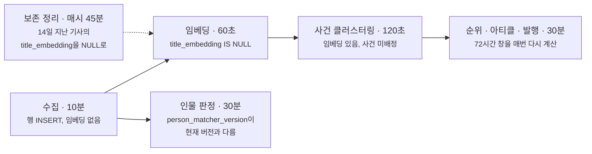

baro의 뉴스 파이프라인 레포에는 앱이 둘 있습니다. [앞 글](/blog/outbox-without-kafka/)에서 다룬 매거진 앱은 단계 사이를 아웃박스 테이블로 잇습니다.
이 글은 두 번째 앱인 뉴스 인텔리전스 앱 이야기입니다.

이 앱은 언론사 피드 29개를 모아 기사 제목을 임베딩하고, 같은 사건을 다룬 기사끼리 묶고, 30분마다 화제성 순위를 매겨
상위 사건마다 매체별 관점을 나란히 놓은 아티클을 만들어 서비스에 발행합니다. 공직자 명부와 기사를 대조해 누가 나오는지 판정하는 인물 축도 같은 앱에 있습니다.
중간에 사람이 들어가는 곳은 없습니다.

단계를 이어야 하는 사정은 매거진 앱과 같습니다. 임베딩, 사건 판정, 관점 추출이 OpenAI를 부르고, 수집된 기사 한 건이 아티클에 반영되려면 네 단계를 더 거칩니다.
아웃박스는 이미 같은 레포에 있었고, 2026-08-13에 쓴 설계 문서에도 서비스로 보내는 경로에 `projection_outbox` 테이블을 그려 두었습니다.
재사용하는 것이 기본 선택지였습니다.

다음 날 구현을 시작하면서 아웃박스는 만들지 않았습니다. 단계마다 `@Scheduled` 메서드가 하나씩 있고, 각자 자기가 처리할 행을 DB 상태로 찾습니다.
제목 임베딩이 비어 있는 기사, 아직 어느 사건에도 붙지 않은 기사, 지금 판정 규칙 버전으로 판정하지 않은 기사를 찾는 식입니다.
이벤트 테이블은 따로 없고, 행의 상태가 곧 대기열입니다.

이 글은 그 선택의 근거와 대가를 정리한 것입니다. 먼저 밝혀 둘 것이 있습니다. 아웃박스를 쓰지 않은 이유가 문서로 남은 건 구현보다 뒤입니다.
2026-08-14 첫 구현 커밋에는 이유가 적혀 있지 않고, 인물 판정을 어디에 둘지 따진 2026-08-16 분석과 2026-08-22 흐름 문서에 근거가 정리돼 있습니다.
이번에 코드를 다시 읽고 로컬에서 재현해 보니, 이 방식 특유의 함정에 실제로 빠졌던 기록이 있었고 문서 설명 중 지금 코드와 맞지 않는 것도 몇 개 있었습니다.

근거는 이렇게 모았습니다.
재현은 로컬 PostgreSQL 17.10(운영과 같은 메이저 버전)에서 했습니다. 로컬에서 며칠 돌렸던 `news_intel` DB(기사 5,561건, 2026-08-15~08-23 수집)를 복사하고,
그 뒤에 나온 마이그레이션 중 이 테이블에 닿는 V21만 손으로 적용했습니다(2026-09-24). 운영 수치는 당시 커밋에 남긴 기록을 옮긴 것이고, 운영 DB는 다시 재지 않았습니다.
인물 축 스케줄러 셋은 2026-08-27부터 운영에서 꺼 두었습니다.

## 두 앱의 연결 방식

| | 매거진 앱 | 뉴스 인텔리전스 앱 |
| --- | --- | --- |
| 단계 연결 | `outbox_events` 테이블과 1초 폴러 | `@Scheduled` 12개가 각자 DB를 조회 |
| 다음 할 일 | PENDING 이벤트 행 | 결과 컬럼이 비어 있는 행 |
| 순서 | `story_key` 단위 직렬 | 키 단위 순서 없음 |
| 실패 처리 | 재시도 4회 뒤 DEAD | 다음 주기에 다시 잡힘. 상한 없음 |
| 사람 개입 | 착수·편집·발행 | 없음 |

앞 글에서 매거진 앱의 단계 연결이 지켜야 할 조건을 네 가지로 적었습니다. 같은 조건을 이 앱에 대 보면 이렇습니다.

1. 상태가 바뀌면 다음 단계가 반드시 이어져야 한다. 여기서는 다음 단계가 바뀐 상태를 직접 조회하므로, 상태와 함께 커밋할 트리거가 따로 없습니다. 임베딩을 저장하는 UPDATE가 그대로 클러스터링 단계에 일을 넘기는 동작입니다.
2. 같은 스토리의 작업은 순서대로 처리돼야 한다. 매거진 앱에서 순서가 필요했던 건 통계 부착과 클레임 추출이 같은 스토리를 동시에 건드리면 안 되기 때문이었습니다.
   여기서 단계 사이의 선후는 조회 조건에 들어 있습니다. 클러스터링은 `title_embedding IS NOT NULL`인 기사만 보므로 임베딩 전 기사를 볼 수 없습니다.
   다만 조회 조건은 서로 다른 단계가 같은 행을 동시에 건드리는 것까지 막지는 못합니다. 매거진 앱이 아웃박스를 고른 이유 중 하나가 이것입니다. 같은 단계가 동시에 도는 문제는 뒤의 스케줄러 절에서 다룹니다.
3. 프로세스가 죽어도 처리하던 일이 사라지면 안 된다. 처리 도중에 죽으면 결과가 저장되지 않았으니 그 행은 여전히 조건에 걸립니다. 리스도, 되살리는 절차도 필요 없습니다.
4. 재시도로도 풀리지 않는 일은 누군가 알아차려야 한다. 이 조건에 대응하는 장치는 약합니다. 뒤에서 따로 적었습니다.

반대로 아웃박스로는 번거롭고 이 방식으로는 쉬운 일이 하나 있었습니다. 판정 규칙을 고친 뒤 이미 처리한 기사를 전부 다시 판정하는 일입니다.
아웃박스의 이벤트는 한 번 소비되면 끝이라, 전건을 다시 돌리려면 모든 기사에 대해 이벤트를 다시 발행하는 잡을 따로 만들어야 합니다.
인물 판정 규칙은 2026-08-18에 처음 들어온 뒤 08-22까지 버전이 세 번 올랐습니다.

## 단계마다 무엇을 기다리는가



점선은 뒤에서 다룰 결함이 지나간 경로입니다.

| 단계 | 주기 | 대기 조건 | 끝났다는 표시 |
| --- | --- | --- | --- |
| 수집 | 10분 | 폴링 주기가 돌아온 피드 | `(publisher_code, canonical_url_hash)` 행이 있음 |
| 임베딩 | 60초 | `title_embedding IS NULL`, ACTIVE, 보존 기간 안이거나 활성 사건 소속 | `title_embedding` 값 |
| 사건 클러스터링 | 120초 | 임베딩이 있고 `news_event_articles`에 없음 | `news_event_articles` 행 |
| 순위·아티클·발행 | 30분 | 대기 조건 없음. 72시간 창을 매번 새로 계산 | 사건당 아티클 하나(`event_ref` UNIQUE) |
| 인물 판정 | 30분 | `person_matcher_version`이 현재 버전과 다름 | `person_matcher_version` 값 |

클러스터링이 할 일을 가져가는 조회는 이렇습니다.

```sql
SELECT pa.article_ref FROM press_articles pa
 WHERE pa.title_embedding IS NOT NULL
   AND pa.status = 'ACTIVE'
   AND NOT EXISTS (
       SELECT 1 FROM news_event_articles nea WHERE nea.article_ref = pa.article_ref
   )
 ORDER BY pa.created_at
 LIMIT ?
```

이 방식은 끝났다는 표시가 처리 결과와 같은 자리에 있어서 성립합니다. 임베딩은 결과 컬럼이 곧 표시라 둘이 어긋날 수 없습니다.
클러스터링은 기사를 사건에 붙인 행이 결과이자 표시이고, 이 테이블의 PK가 `article_ref`라 같은 기사가 두 사건에 붙는 일은 DB가 막습니다.

다만 클러스터링은 결과를 한 트랜잭션으로 묶지 않았습니다. 새 사건을 만들 때 `news_events` INSERT와 기사 연결이 따로 커밋되므로(`EventStore`에 `@Transactional`이 없습니다),
그 사이에 프로세스가 죽으면 기사가 하나도 없는 사건이 남습니다. 기사는 여전히 미배정이라 다음 주기에 다시 판정되고,
그때 방금 남은 빈 사건이 벡터도 대표 제목도 같은 후보로 올라올 것입니다. 코드로 따라가 본 경로이고 재현하지는 않았습니다.
매거진 앱은 같은 자리를 한 트랜잭션으로 묶어 이런 부산물이 생기지 않게 해 두었습니다.

순위·아티클 단계에는 대기열이 없습니다. 30분마다 최근 72시간 창의 사건 점수를 처음부터 다시 계산하고,
그 결과를 저장했다가 다시 읽지 않고 같은 메서드 안에서 곧바로 아티클 생성에 넘깁니다. 이 두 단계 사이는 폴링이 아니라 직접 호출입니다.

## 완료 표시를 행의 존재로 하지 않은 이유

인물 판정 결과는 `article_person_links`에 기사 × 인물 표기 × 규칙 버전 단위로 쌓입니다.
설계 문서에는 "링크 행이 있는지로 판정 여부를 알 수 있으니 별도 커서가 필요 없다"고 적혀 있었습니다.

구현하면서 이 전제를 버렸습니다. V12 마이그레이션 주석에 이유가 남아 있습니다.

```sql
-- 설계 문서 §6.3 은 "링크 행의 존재 여부로 판단하면 되고 별도 커서가 필요 없다" 고 했는데,
-- **실측에서 기사의 38.7% 가 인물 이름을 하나도 안 갖는다.** 그 기사들은 링크 행이 0건이라
-- "안 함" 과 구분되지 않고, 매 배치마다 영원히 다시 스캔된다.
--
-- 버전을 통째로 기록하면 규칙을 고쳐 버전을 올렸을 때 전량 재실행이 그냥 따라온다.
ALTER TABLE press_articles ADD COLUMN person_matcher_version VARCHAR(50);
```

결과가 비어 있는 것과 아직 하지 않은 것을 같은 모양(행 없음)으로 나타내면, 상태를 대기열로 쓰는 순간 둘이 섞입니다.
그래서 결과와 따로 "어느 규칙으로 판정했는가"를 기사 행에 적습니다. 대기 조회와 완료 표시는 이렇습니다.

```kotlin
// 아직 이 버전으로 판정하지 않은 기사.
// IS DISTINCT FROM 이라 NULL(한 번도 안 함)과 옛 버전이 함께 잡힌다.
fun findUnlinked(matcherVersion: String, limit: Int): List<LinkableArticle> = jdbcTemplate.query(
    """
    SELECT article_ref, title, rss_description, body_text
      FROM press_articles
     WHERE person_matcher_version IS DISTINCT FROM ?
       AND status = 'ACTIVE'
     ORDER BY published_at DESC
     LIMIT ?
    """.trimIndent(),
    // ...
)

fun markLinked(articleRefs: List<String>, matcherVersion: String) {
    jdbcTemplate.batchUpdate(
        "UPDATE press_articles SET person_matcher_version = ? WHERE article_ref = ?",
        articleRefs.map { arrayOf<Any>(matcherVersion, it) },
    )
}
```

판정 결과를 저장할 때는 같은 버전의 옛 행을 지우고 새로 넣는 것을 한 트랜잭션으로 합니다. 결과를 저장한 뒤 `markLinked` 전에 죽으면
다음 주기에 같은 기사를 다시 판정하고 행을 통째로 갈아 끼우므로 결과가 두 벌 생기지 않습니다.
버전이 PK에 들어 있어서 다른 버전의 행은 그대로 남고, 버전끼리 대조해 규칙 변경으로 무엇이 달라졌는지 볼 수 있습니다.

규칙을 고치면 설정의 버전 문자열만 올립니다. 모든 기사의 `person_matcher_version`이 새 값과 달라지니 대기 조회가 전부를 다시 잡습니다.

| 버전 | 날짜 | 바꾼 것 |
| --- | --- | --- |
| v1 | 2026-08-18 | 명부(직함·정당·지역구)로 좁히는 결정적 매처 도입 |
| v2 | 2026-08-18 | 「현역 의원 20명이 참석했다」 같은 명단 뒤의 총칭 직함을 개인의 근거로 쓰지 않음. 같은 코퍼스에서 확정 링크 526 → 509 |
| v3 | 2026-08-21 | 제목에 나온 인물(PRIMARY)과 본문에만 나온 인물(MENTIONED) 구분 |
| v4 | 2026-08-22 | 장관을 겸한 의원처럼 명부의 원래 직함과 기사 속 현직이 다른 사람을 겸직 직함으로 확정 |

세 번 올리는 동안 운영에서 재처리를 돌리는 코드는 쓰지 않았습니다. 로컬에서 규칙을 바꾸고 측정을 다시 하려고 전량을 한 번에 재판정하는 develop 태그 테스트가 하나 있을 뿐입니다.

### 버전을 올리면 생기는 공백

올리는 순간부터 인물 롤업과 브리프는 새 버전 행만 읽습니다. 아직 다시 판정하지 않은 기사에는 새 버전 행이 없으니, 따라잡을 때까지 그 기사에는 인물이 안 나온 것처럼 보입니다.
배치는 30분에 200건이고 최신 기사부터 가져옵니다. 로컬 DB 규모(5,561건)라면 28회, 약 14시간이 걸리는 계산입니다(환산).
최신순이라 사용자가 보는 최근 기사부터 채워지지만, 운영에서 실제로 얼마나 걸렸는지는 기록이 없습니다.

### 다시 돌려도 같은 결과가 나오는 단계는 둘뿐이다

흐름 문서는 이 방식의 근거로 "모든 단계가 다시 돌려도 같은 결과가 나오는 변환"이라고 적고 있습니다. 코드를 다시 보니 이 문장이 그대로 맞는 단계는 임베딩과 인물 판정뿐입니다.
인물 판정은 LLM을 쓰지 않는 규칙 기반이고, 도입 커밋에서 파이썬 드라이런과 판정이 완전히 일치하는 것을 확인했습니다.

사건 클러스터링은 다릅니다. 후보 사건이 여럿이면 후보마다 LLM에 같은 사건인지 동시에 묻고, 가장 먼저 "같다"고 돌아온 후보에 붙입니다.

```kotlin
repeat(candidates.size) {
    val result = completionService.take().get()
    if (result != null) return result
}
```

응답이 돌아오는 순서에 따라 붙는 사건이 달라질 수 있고, 어떤 사건이 이미 있는지도 기사를 처리하는 순서에 따라 달라집니다.
그래서 `news_events`에도 `matcher_version` 컬럼이 있지만 기록만 할 뿐, 버전을 올려 다시 묶는 경로는 없습니다.
다시 묶으면 사건이 뒤섞이는데, 발행된 아티클은 사건 하나에 하나씩 매여 있습니다.

이 방식을 받치는 성질은 "결과가 같다"보다 좁습니다. 끝난 행은 조건에서 빠져 다시 돌 일이 없고, 도중에 죽은 행만 다시 돕니다.
버전을 올려 전건을 다시 돌리는 방법은 결과가 결정적인 단계에만 쓸 수 있습니다.

## 설계 문서의 전송 아웃박스는 어디로 갔나

설계 문서는 서비스(baro-backend)로 보내는 경로에 아웃박스를 두고, 장애 대응 표에 "baro-backend 전송 실패 → outbox 재시도, 원장 생성은 계속"이라고 적었습니다.
구현에서는 30분 주기 안에서 아티클을 로컬에 저장한 뒤 곧바로 HTTP로 보냅니다.

이게 가능한 건 보내는 내용이 변경분이 아니라 그 시점의 아티클 전체이기 때문입니다. 본문 블록, 순위, 매체 수를 매번 통째로 보내고,
멱등 키는 `articleId:articleVersion`이며 서비스 쪽은 `pipelineRef`(= articleId)로 같은 아티클을 알아봅니다.
한 번 빠져도 다음 회차가 더 새로운 전체 상태를 보내므로 중간 상태를 잃어도 상관이 없습니다.
오래된 회차가 늦게 도착하는 경우는 받는 쪽이 회차 시각으로 거릅니다([멱등한 수신 API 글](/blog/idempotent-receiver-api/)).

발행 쪽에도 대기열 역할을 하는 상태 조건이 셋 있습니다.

| 할 일 | 대기 조건 | 실패하면 |
| --- | --- | --- |
| 첫 발행 | 이번 회차 순위 안, `baro_article_id` 없음 | 다음 회차에도 순위에 있으면 다시 보낸다 |
| 순위 내리기 | `trending_rank IS NOT NULL`인데 이번 상위에 없음 | 로컬에 저장하지 않으므로 다음 회차에 같은 조건에 다시 걸린다 |
| 회차 순위 스냅샷 | 순위 아티클이 모두 서비스 id를 가짐 | 이번 회차는 건너뛰고 다음 회차가 따라잡는다 |

첫 발행이 실패한 뒤 그 사건이 순위에서 밀려나면 그 아티클은 끝내 발행되지 않습니다. 아웃박스였다면 결국 전달됐을 것입니다.
여기서는 그편이 맞습니다. 순위 밖 아티클은 발행하지 않는 것이 규칙이라, 늦게 도착한 옛 아티클은 보내지 않는 편이 낫습니다.

문제는 대기 조건이 틀렸을 때 아무 신호가 없다는 것입니다. 2026-09-16에 고친 결함이 그랬습니다.
48시간이 지나 보관(ARCHIVED)된 아티클의 사건이 다시 순위에 들면 상태가 ARCHIVED인 채로 순위를 받았는데, 순위 내리기 조회는 PUBLISHED와 UPDATED만 봤습니다.
그 아티클은 다시 밀려나도 내리기 대상에 잡히지 않았고, 서비스의 정치 실시간 이슈에 9/1·9/3 순위가 현재 7·8위와 겹쳐 보였습니다(`b716427`).
나흘 뒤에는 순위 밖 발행을 막으려고 넣은 게이트가 이미 발행된 아티클의 순위 내리기까지 막아, 정치 8위가 세 건 생겼습니다(`c021f80`).

아웃박스였어도 이 결함은 막지 못했을 것입니다. 누구에게 일이 있는지 고르는 쪽이 틀렸으니 이벤트가 애초에 나가지 않았을 테니까요.
차이는 알아차리는 경로에 있습니다. 아웃박스에는 적체 건수와 DEAD라도 있지만, 여기서는 조건 밖으로 빠진 행이 어디에도 집계되지 않아 앱 화면을 보고서야 알았습니다.

## 스케줄러 12개, 스레드 4개

`@Scheduled` 메서드는 12개이고, 운영에서는 인물 축 셋이 `@ConditionalOnProperty`로 꺼져 있어 9개가 빈으로 뜹니다.
스케줄러 스레드 풀은 2026-08-16부터 4입니다.

```yaml
spring:
  task:
    scheduling:
      pool:
        size: 4
```

`fixedDelay`는 이전 실행이 끝난 뒤부터 다음 실행까지의 간격이라, 한 인스턴스 안에서 같은 단계가 겹쳐 돌지 않습니다.
클러스터링에 필요한 동시 실행 배제가 여기서 나옵니다. 같은 새 사건을 다룬 기사 두 건이 동시에 클러스터링되면 서로를 보지 못하고 사건을 하나씩 만들 수 있습니다.
매거진 앱은 이걸 막으려고 pillar마다 `story_key`를 하나씩 줬고, 여기서는 메서드 하나와 `fixedDelay`와 인스턴스 하나가 같은 일을 합니다.
앞에서 순서 보장이 필요 없다고 했지만, 정확히는 같은 단계의 동시 실행 배제는 필요하고 그걸 인스턴스가 하나라는 사실이 주고 있습니다. 인스턴스를 늘리면 이 전제가 깨집니다.

서로 다른 단계는 네 개까지 동시에 돕니다. 관점 추출로 LLM을 여러 번 부르는 순위·아티클 단계, 본문까지 받아 오는 수집, 후보마다 LLM을 부르는 클러스터링이 스레드를 차지하고 있으면
60초짜리 임베딩도 그 뒤에서 기다립니다. 흐름 문서는 이걸 정상 동작으로 적어 두었습니다.
단계끼리 서로 깨우지 않으니, 기사 한 건이 아티클에 반영되기까지 최악의 경우 주기의 합(수집 10분 + 임베딩 1분 + 클러스터링 2분 + 순위 30분 ≈ 43분)에 처리 시간이 더해집니다(환산, 실측 없음).

할 일이 없어도 조회는 돕니다. 복사본 DB에 합성 행을 넣어 약 10만 건으로 키워 재 보니, 인물 판정 조회는 대기 0건을 확인하는 데 23ms,
임베딩 조회는 대기 50건을 찾는 데 12ms가 걸렸고 둘 다 테이블 전체를 순차 스캔했습니다.
지금 규모에서는 문제가 되지 않지만, 조회 비용이 대기 건수가 아니라 누적 기사 수를 따라갑니다. 임베딩 쪽은 뒤에서 다시 다룹니다.

### 커넥션 풀 문서의 전제가 달랐다

커넥션 풀 산정 문서(2026-09-11 확인)는 이 앱에 대해 "스케줄러 풀 = 1(기본값). 9개 `@Scheduled` 메서드가 한 번에 하나만 실행"이라고 적고,
그 전제로 Hikari 풀을 3으로 정했습니다. 실제로는 그보다 앞선 2026-08-16부터 스레드가 4였습니다.

같은 문서는 "가상 스레드 팬아웃은 전부 OpenAI 호출이라 DB 커넥션을 잡지 않는다"고도 적었는데, 이것도 지금은 맞지 않습니다.
관점 추출은 대표 매체마다 가상 스레드를 하나씩 띄우고(시드 매체 11곳이 상한), 관점 캐시가 들어온 V24 이후로는 각 스레드가 LLM 호출 앞에서 캐시를 조회하고 뒤에서 저장합니다.
동시 수요는 스케줄러 스레드 넷에 이 팬아웃까지 더해져 풀 3을 넘을 수 있습니다.

트랜잭션은 전부 DB 작업만 감싸고 있었고, RSS·OpenAI·발행 같은 외부 호출은 모두 트랜잭션 밖에 있었습니다.
커넥션을 오래 쥐는 곳은 찾지 못했으니 넘치는 순간에도 짧게 기다리고 끝날 것으로 봅니다. 다만 커넥션 대기는 지표를 모으지 않아(actuator 노출이 `health`·`info`뿐) 재지 못했습니다.

## 파생물은 지우지 않고 비운다

기사의 제목 임베딩과 본문이 이 앱 DB 용량의 90%를 차지하고, 둘 다 원문에서 다시 만들 수 있는 파생물입니다.
2026-08-24부터 보존 스케줄러가 매시 45분에 14일 지난 기사의 두 컬럼을 NULL로 비웁니다.
활성 사건에 속한 기사는 사건 중심 벡터(소속 기사 임베딩의 평균)를 다시 계산할 때 아직 쓰이므로 건드리지 않습니다.

```sql
UPDATE press_articles pa
   SET title_embedding = NULL, body_text = NULL, updated_at = now()
 WHERE pa.created_at < ?
   AND (pa.title_embedding IS NOT NULL OR pa.body_text IS NOT NULL)
   AND NOT EXISTS (
       SELECT 1
         FROM news_event_articles nea
         JOIN news_events ne ON ne.event_ref = nea.event_ref
        WHERE nea.article_ref = pa.article_ref
          AND ne.status = 'ACTIVE'
   )
```

행을 지우지 않는 이유는 둘입니다.

첫째, 기사 행이 중복 판정 기록입니다. 피드 수집과 인물 검색 수집 모두 저장하기 전에 `(publisher_code, canonical_url_hash)` 행이 있는지 봅니다.
행을 지우면 목록 페이지나 검색 결과에 아직 남아 있는 옛 기사가 새 기사로 다시 들어오고, 새 기사는 모든 단계의 대기 조건에 걸립니다.
임베딩, 사건 판정, 인물 판정을 처음부터 다시 하게 됩니다. 상태가 대기열인 구조에서는 행을 지우는 일이 곧 그 기사를 대기열에 다시 넣는 일입니다.

둘째, 기사 행을 참조하는 외래 키가 지금 일곱 개입니다. 발행된 아티클의 관점 카드가 원문 기사를 참조하고, 사건 소속·인물 판정·관측 기록도 그렇습니다.
행을 지우려면 이것들을 먼저 치워야 합니다.

### NULL이 두 가지 뜻이 되었다

그런데 `title_embedding IS NULL`은 임베딩 단계의 대기 조건이기도 했습니다. 보존 스케줄러가 비운 기사는 임베딩 단계가 보기에 아직 임베딩하지 않은 기사와 구별되지 않았습니다.
60초 안에 임베딩 단계가 이 기사들을 다시 채웠고, 다음 45분에 보존 스케줄러가 다시 비웠습니다.
2026-09-15 수정 커밋(`4d05574`)에 남은 규모는 시간당 약 2.9만 건입니다. 이 반복이 언제부터 얼마나 돌았는지, 비용이 얼마였는지는 재지 않았습니다.

복사본 DB에서 같은 순서를 밟아 봤습니다. 사건 종료와 보존 정리는 스케줄러의 SQL을 그대로 썼습니다.

| 순서 | 결과 |
| --- | --- |
| 72시간 무활동 사건 종료 | 2,242건 CLOSED |
| 14일 보존 정리 | 5,561건 비움 (120ms) |
| 수정 전 조건(`title_embedding IS NULL AND status = 'ACTIVE'`)으로 센 임베딩 대기 | 5,561건 |
| 수정 후 조건으로 센 임베딩 대기 | 0건 |

수정은 임베딩 대기 조건에 보존 조건의 반대를 넣는 것이었습니다.

```sql
-- voidExpiredDerivatives의 반대 조건: 보존 창 안이거나 활성 이벤트가 보호하는 기사만 재생성한다.
SELECT pa.article_ref, pa.title FROM press_articles pa
 WHERE pa.title_embedding IS NULL AND pa.status = 'ACTIVE'
   AND (
       ?::timestamptz IS NULL
       OR pa.created_at >= ?
       OR EXISTS (
           SELECT 1
             FROM news_event_articles nea
             JOIN news_events ne ON ne.event_ref = nea.event_ref
            WHERE nea.article_ref = pa.article_ref
              AND ne.status = 'ACTIVE'
       )
   )
 ORDER BY pa.created_at
 LIMIT ?
```

보존 기간은 두 쪽이 같은 설정(`derivative-ttl`)을 읽게 했고, 정리 뒤 임베딩을 두 번 돌려도 만료 기사가 다시 채워지지 않는지 테스트로 고정했습니다.
다만 활성 사건 보호 조건은 두 SQL에 따로 적혀 있어서, 한쪽만 고치면 반복이 돌아오거나 보호가 샙니다.
NULL이 한 가지 뜻만 갖게 하려면 비웠다는 사실을 별도 컬럼으로 두는 방법이 있는데, 아직 하지 않았습니다.

아웃박스였다면 이 반복은 생기지 않았습니다. 아웃박스에서는 이벤트를 발행하는 코드만 다음 단계를 깨울 수 있고, 보존 잡은 이벤트를 내지 않습니다.
상태를 대기열로 쓰면 그 컬럼에 쓰는 코드가 전부 다음 단계를 깨웁니다. 유지보수 잡도 마찬가지입니다.
앞 절의 38.7%가 "결과가 비어 있음"과 "아직 안 함"이 섞인 경우였다면, 이번에는 "지웠음"과 "아직 안 함"이 섞였습니다.

## 다시 확인해 보니 달랐던 것

### 임베딩 대기 부분 인덱스는 쓰이지 않는다

V13 마이그레이션(2026-08-18)은 임베딩 대기 조회를 받치려고 부분 인덱스를 만들었습니다.

```sql
-- 임베딩 대기 목록이 이 컬럼으로 걸러진다. `title_embedding IS NULL` 과 함께 쓰이므로
-- 부분 인덱스로 충분하다 — 이미 임베딩된 행은 다시 안 본다.
CREATE INDEX ix_press_articles_pending_embedding
    ON press_articles (ingest_kind, created_at)
    WHERE title_embedding IS NULL;
```

만들 당시에는 대기 조회가 인물 검색 기사를 빼려고 `ingest_kind = 'FEED'`로 걸렀고, 대기분은 방금 들어온 기사뿐이라 인덱스가 작았습니다.
같은 날 인물 검색 기사도 클러스터링에 태우기로 하면서 `ingest_kind` 조건이 빠졌습니다(`7aec135`).
엿새 뒤 보존 정리가 들어오면서 14일 지난 기사가 전부 `title_embedding IS NULL`이 되어 이 인덱스로 들어왔습니다.

복사본에서 보존 정리 전후를 재 보니 인덱스는 8kB에서 288kB로 커졌고, 수정 후의 대기 조회는 이 인덱스를 쓰지 않고 테이블을 순차 스캔했습니다.
거의 모든 행이 술어를 만족하니 인덱스로 거를 것이 없습니다. 합성 행을 넣어 100,098건(실제 대기 50건)으로 키워도 같았습니다.

| 규모 | 부분 인덱스 | 계획 | 실행 시간 | 읽은 버퍼 |
| --- | --- | --- | --- | --- |
| 5,561건 (대기 0) | 288kB, 미사용 | Seq Scan | 0.6ms | 1,363 |
| 100,098건 (대기 50) | 4.9MB, 미사용 | Seq Scan | 12ms | 약 12,400 (힙 97MB) |

지금 규모에서는 60초마다 12ms라 문제가 되지 않습니다. 다만 이 인덱스가 대기분을 받친다는 설명은 이제 맞지 않습니다.

### fillfactor 85로도 보존 UPDATE는 HOT 갱신이 되지 않는다

보존 정리를 넣은 V21은 안 쓰이던 제목 HNSW 인덱스를 지우고 fillfactor를 85로 낮췄습니다. 주석은 이유를 이렇게 적었습니다.

```sql
-- 보존 스케줄러가 오래된 행의 title_embedding·body_text 를 NULL 로 UPDATE 하면 dead tuple 이 생긴다.
-- fillfactor 를 낮춰 같은 페이지 안에서 HOT 갱신이 되게 해 블로트를 억제한다(docs P4).
ALTER TABLE press_articles SET (fillfactor = 85);
```

PostgreSQL은 인덱스가 걸린 컬럼이 바뀌면 HOT 갱신을 하지 않는데, 부분 인덱스의 술어에 쓰인 컬럼도 여기에 들어갑니다.
`title_embedding`은 위 대기 인덱스의 술어에 있습니다. 그래서 비우는 UPDATE도, 임베딩을 채우는 UPDATE도 HOT가 될 수 없고, 매번 테이블의 인덱스들에 새 항목을 씁니다.

복사본에서 `VACUUM FULL`로 모든 페이지에 fillfactor 85를 적용한 뒤 갱신 종류별로 확인했습니다.
뒤의 두 줄은 조건을 가르려고 별도 테이블 5,000행으로 한 대조 실험입니다.

| 실험 | 갱신 | HOT |
| --- | ---: | ---: |
| 보존 정리 UPDATE (`title_embedding`, `body_text`) | 5,561 | 0 |
| 같은 UPDATE, 대기 부분 인덱스를 지운 뒤 | 5,561 | 1,293 |
| 수집 재관측과 같은 `last_seen_at` 갱신 | 1,000 | 664 |
| 인물 판정 완료 표시(`person_matcher_version`, 인덱스 컬럼) | 1,000 | 0 |
| 별도 테이블, 부분 인덱스 술어가 갱신 컬럼을 참조 | 5,000 | 0 |
| 별도 테이블, 인덱스가 갱신 컬럼을 참조하지 않음 | 5,000 | 1,064 |

HOT가 갱신 수보다 적은 줄은 한 번에 많은 행을 갱신해 페이지 여유가 먼저 찬 경우입니다. 인덱스나 술어가 갱신 컬럼을 참조하면 페이지 여유와 상관없이 0입니다.

fillfactor가 쓸모없는 건 아닙니다. 보존 계획 문서가 fillfactor를 처음 제안한 이유는 수집이 이미 본 기사를 다시 볼 때마다 `last_seen_at`을 갱신하는 일이었고,
이 갱신은 인덱스 컬럼을 건드리지 않아 HOT가 됩니다. 틀린 건 V21 주석이 이 효과를 보존 UPDATE에 갖다 붙인 부분입니다.
보존 UPDATE에는 V21의 두 변경 중 HNSW 삭제만 효과가 있었습니다.

두 발견이 같은 인덱스를 가리킵니다. 대기 조회에는 쓰이지 않으면서 HOT 갱신은 막고 있고, 지운 복사본에서는 보존 UPDATE도 HOT가 되기 시작했습니다.
다만 운영 DB에서 이 인덱스의 `idx_scan`을 아직 확인하지 않았습니다. V21이 제목 HNSW를 지울 때 배포 후 `idx_scan = 0`을 다시 확인했던 것처럼 같은 절차를 먼저 밟아야 합니다.

### 버전을 올리면 오래된 기사는 본문 없이 판정된다

보존 정리는 본문(`body_text`)도 비웁니다. 인물 판정은 제목·RSS 요약·본문을 합쳐서 보는데, 버전을 올려 전건을 다시 판정하면 14일 지난 기사는 본문 없이 판정됩니다.
규칙이 같아도 입력이 줄었으니 결과가 줄 수 있습니다. 판정 서비스의 주석은 "판정 재료가 크롤 시점에 이미 저장돼 있어 재수집이 필요 없다"고 적고 있는데,
이 말은 이제 14일 안의 기사에만 맞습니다.

아직 일어난 적은 없습니다. 마지막 버전 인상이 2026-08-22, 보존 정리가 2026-08-24, 인물 축이 운영에서 꺼진 것이 2026-08-27입니다.
인물 축을 다시 켜고 버전을 올리기 전에 확인할 항목입니다.

## 재시도 상한이 없다

아웃박스의 DEAD에 해당하는 것이 이 앱에는 없습니다. 실패한 행은 결과가 저장되지 않았으니 다음 주기에 다시 잡히고, 몇 번째 실패인지 세지 않습니다.

실제로 겪은 결과는 로그였습니다. 2026-08-22에 OpenAI가 401을 돌려주는 동안 이 앱은 대기분 전체를 주기마다 다시 시도하면서 건마다 스택을 남겼고,
169초 동안 11,250줄, 초당 66.6줄을 냈습니다. 월로 환산하면 약 22GB입니다.
그때 고친 것은 재시도 상한이 아니라 로그였습니다. 실패를 원인별로 세고 스택은 첫 건만 실어, 단계가 끝날 때 한 줄로 남기게 했습니다.

계속 실패하는 행은 더 조용한 문제도 만듭니다. 임베딩과 클러스터링은 오래된 순으로 가져오므로, 항상 실패하는 행은 매 주기 배치의 맨 앞자리를 차지합니다.
임베딩은 대기분을 묶어서 요청하므로, 묶음 안에 요청 전체를 실패시키는 입력이 하나 있으면 같은 묶음이 매번 다시 실패하고 단계가 통째로 멈춥니다.
클러스터링은 실패를 건별로 넘기지만 그런 행이 배치 크기(50)만큼 쌓이면 새 기사가 들어갈 자리가 없어집니다. 코드로 읽은 경로이고 재현하지는 않았습니다.
보존 정리가 14일 뒤 그 행의 임베딩을 비우면 조건에서 빠지니, 뜻하지 않게 14일짜리 DEAD 노릇을 하는 셈입니다.

적체를 보는 수단도 약합니다. 내부 헬스 엔드포인트 `/health/clustering`은 임베딩 대기와 미배정 기사가 있는지를 불리언으로, 그리고 분류별 마지막 스냅샷 시각을 돌려줍니다.
몇 건이 얼마나 오래 밀려 있는지는 알 수 없습니다.

## 남은 것

| 항목 | 상태 |
| --- | --- |
| 임베딩 대기 조건과 보존 조건 | 손으로 맞춘 반대 조건이다. 활성 사건 보호 절이 두 SQL에 따로 있다 |
| 임베딩 대기 부분 인덱스 | 대기 조회에 쓰이지 않고 HOT 갱신을 막는다. 운영 `idx_scan` 확인 뒤 제거 후보 |
| V21 fillfactor 주석 | 보존 UPDATE가 HOT 갱신이 된다는 설명이 사실과 다르다(`last_seen_at` 갱신에는 맞다) |
| 인물 재판정과 보존 | 14일 지난 기사는 본문 없이 재판정된다. 버전을 올리기 전에 확인할 것 |
| 재판정 중 공백 | 새 버전 행이 채워질 때까지 인물 관측이 빈다. 따라잡는 시간은 잰 적이 없다 |
| 클러스터링 트랜잭션 | 사건 생성과 기사 연결이 따로 커밋된다. 빈 사건이 남을 수 있다 |
| 재시도 상한 | 없다. 계속 실패하는 행은 보존 기간이 지나야 조건에서 빠진다 |
| 적체 관측 | 불리언뿐이다. 건수와 가장 오래 기다린 행의 나이가 없다 |
| 동시 실행 배제 | 클러스터링이 인스턴스가 하나라는 사실에 기대고 있다 |
| 커넥션 풀 문서 | 스케줄러 풀 1, 팬아웃은 DB 무관을 전제로 산정했다. 실제는 스레드 4에 관점 추출 팬아웃도 DB를 잡는다. 대기는 미측정 |
| 흐름 문서의 한 문장 | "모든 단계가 다시 돌려도 같은 결과"는 임베딩과 인물 판정에만 맞다 |

## 정리

| 조건 | 매거진 앱(아웃박스) | 이 앱에서는 | 대가 |
| --- | --- | --- | --- |
| 상태가 바뀌면 다음 단계가 이어짐 | 상태 변경과 같은 트랜잭션에서 이벤트 INSERT | 다음 단계가 바뀐 상태를 직접 조회 | 그 컬럼에 쓰는 모든 코드가 다음 단계를 깨운다. 보존 잡이 시간당 약 2.9만 건을 다시 임베딩시켰다 |
| 같은 스토리의 작업 순서 | `story_key` 단위 직렬 | 단계 사이 선후는 대기 조건의 사슬로, 같은 단계의 배제는 `fixedDelay`와 인스턴스 하나로 | 서로 다른 단계가 겹치는 것은 막지 못한다. 인스턴스를 늘리면 같은 단계의 배제도 깨진다 |
| 죽은 프로세스의 일 복구 | 10분 리스가 끝나면 다시 가져감 | 결과가 없으니 다음 주기에 다시 잡힌다 | 단계 사이 지연이 주기의 합으로 쌓인다 |
| 풀리지 않는 일 알아차리기 | 재시도 4회 뒤 DEAD, 잔고 경고 | 재시도 상한도 DEAD도 없음 | 실패가 주기마다 반복된다. 조건에서 잘못 빠진 행은 어디에도 집계되지 않는다 |
| (조건 밖) 전건 재처리 | 이벤트를 다시 발행하는 잡이 필요 | 버전 문자열 하나 | 결과가 결정적인 단계에만 쓸 수 있다 |

매거진 앱에 아웃박스를 둔 건 같은 스토리에서 무엇이 먼저 도느냐가 결과를 바꿨고, 계속 실패하는 일을 DEAD로 드러내야 했기 때문입니다.
뉴스 인텔리전스 앱의 단계는 결과가 곧 완료 표시이고, 끝난 행은 조건에서 빠지고, 죽은 행은 다시 잡힙니다.
그래서 이벤트 테이블 없이 단계를 이었고, 인물 판정 규칙 버전을 세 번 올리는 동안 운영용 재처리 코드를 쓰지 않았습니다.

대신 대기열이 테이블이 아니라 WHERE 절에 있습니다. 그 조건에 쓰인 컬럼을 건드리는 코드는 전부 대기열을 건드리는 코드이고,
"비어 있음"이 두 가지 뜻을 갖는 순간 대기열이 오염됩니다. 이 앱에서 그런 일이 두 번 있었습니다.
한 번은 설계하면서 알아채 버전 컬럼을 따로 뒀고, 한 번은 보존 잡을 붙인 지 22일 뒤에 고쳤습니다.
