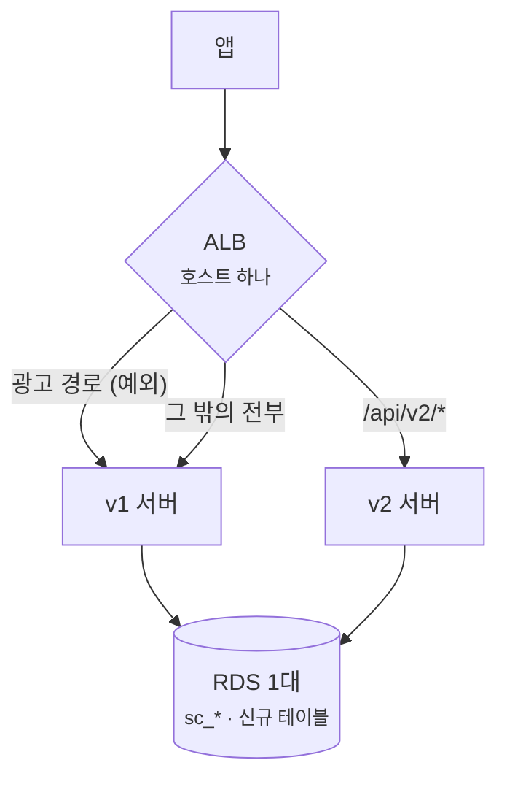
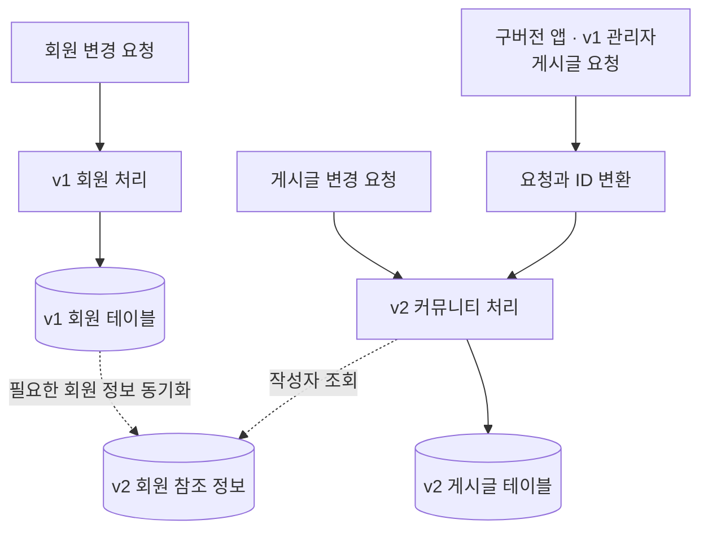
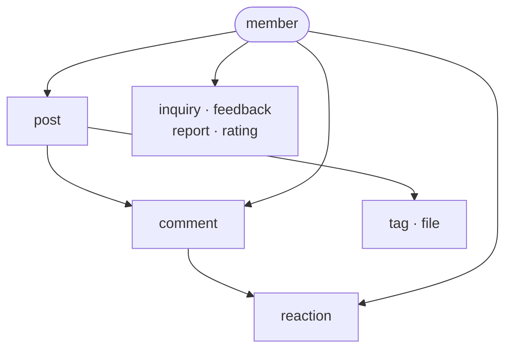
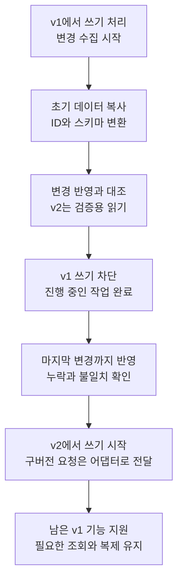

레거시 시스템을 새 시스템으로 옮길 때 자주 쓰는 방법 중 하나가 **Strangler Fig**입니다.
옛 시스템 앞에 요청을 가로채는 앞단(facade)을 두고, 기능을 하나씩 새 시스템으로 보낸 뒤 마지막에 옛 시스템을 내리는 방식입니다.
사용자는 같은 인터페이스를 계속 쓰기 때문에 어느 기능이 먼저 옮겨졌는지 알 필요가 없습니다.

저희도 그렇게 계획했습니다. 정치 정보 앱의 v1 서버를 v2로 전면 재작성하면서 설계 문서에 이렇게 적었습니다.

> 도메인 cutover마다 해당 prefix를 V2 룰로 승격 = strangler fig

로드밸런서(ALB) 규칙을 도메인마다 하나씩 옮기면 된다는 계획이었습니다.

실제로는 두 서버를 호스트로 나눠 띄운 뒤, 새 앱 출시와 데이터 이관을 맞춰 한 번에 전환했습니다.
도메인·모듈·테이블·API·배포 구조까지 바꾸는 작업이었고, 앱과 사용자 규모를 고려해 빅뱅 방식을 선택했습니다.

그렇다면 처음 생각한 Strangler Fig를 끝까지 적용했다면 어떻게 했어야 할까요.
로드밸런서 규칙을 옮기는 것부터 시작해 보니 API 호환이 걸리고, 그걸 맞추면 이번에는 데이터가 걸립니다. 당시 고민했던 CDC와 양방향 동기화까지 포함해, 도메인 하나를 실제로 넘길 수 있는 설계로 이어가 보려 합니다.

## 계획: 한 호스트, 경로로 나누기

계획의 앞단은 ALB 하나였습니다. 앱은 호스트 하나만 알고, ALB가 경로를 보고 v1과 v2로 나눕니다.

- **두 서버가 같은 RDS를 씁니다.** v1의 `sc_*` 테이블과 v2의 신규 테이블을 함께 둡니다. 테이블 이름은 겹치지 않지만, 같은 회원과 게시글을 서로 다른 테이블에 저장하므로 데이터는 따로 맞춰야 합니다.
- **도메인 하나가 v2에 준비되면** 그 도메인의 v1 경로를 v2 쪽 규칙으로 옮깁니다. 이게 계획의 "승격"입니다.
- **되돌리기는 규칙을 원래대로 돌리고 v2가 쓴 행을 정리하는 것**으로 잡았습니다. 다만 v2에서 실제 사용자 쓰기를 받기 시작하면, 이 방법으로는 그동안 생긴 데이터를 보존할 수 없습니다.
- 광고 경로 예외는 v1 광고 모듈이 이미 `/api/v2/ads` 같은 경로를 쓰고 있어서 생긴 규칙입니다.

단계는 다섯이었습니다.

| 단계 | 내용 |
| --- | --- |
| 0 | v1 단독 운영, v2 개발 |
| 1 | v2 배포. v2에만 있는 새 기능만 노출 |
| 2 | 도메인별 전환: 작은 도메인부터, 회원·인증은 가장 신중하게 |
| 3 | v1 축소 |
| 4 | v1 종료, `sc_*` 보관 후 삭제 |

dev에는 `/api/v2/ads*`·`/api/v2/admin*`은 v1, `/api/v2*`는 v2, 나머지는 v1으로 보내는 규칙이 있었습니다.
다만 v1 경로를 v2로 넘긴 적은 dev에서도 없습니다.

## 첫 번째 문제: API 경로가 달랐다

Strangler Fig의 앞단이 하는 일은 **같은 요청을 다른 구현으로 보내는 것**입니다.
호출자는 같은 경로로 같은 모양의 요청을 보내고, 앞단이 뒤에서 목적지만 바꿉니다.

그런데 v2는 **API 계약 자체를 새로 설계했습니다.** 게시글 작성 하나만 봐도 이렇습니다.

| | v1 | v2 |
| --- | --- | --- |
| 게시글 작성 | `POST /api/customer/board/agora` | `POST /api/v2/posts/agora` |
| 게시글 id | UUID | `post_{ULID}` |
| 로그인한 회원 | JWT `userId` claim (UUID) | `mbr_{ULID}` |

그러니 ALB에서 `/api/customer/board/agora`를 v2로 돌려도 **v2에는 그 경로가 없습니다.** 404입니다.
"규칙 승격"이 아무것도 전환하지 못합니다.

v1·v2 엔드포인트를 대조해 보니 경로가 겹치는 건 광고뿐이었습니다.
이 상태라면 나머지는 앱이 새 v2 URL을 호출하도록 바꿔야 합니다. 전환 시점도 앱 업데이트에 묶입니다.
처음 생각한 것처럼 서버 쪽에서 도메인을 하나씩 넘기려면 구 API를 받아줄 곳이 더 필요합니다.

스위치를 어디에 둘지는 두 갈래입니다.

### 방법 1: v2가 v1 계약을 지원한다

v2가 v1 경로와 응답 형식을 그대로 받아 주는 **번역 계층**을 둡니다. 그러면 스위치를 다시 로드밸런서에 둘 수 있습니다.
구버전 앱은 서버가 바뀐 줄 모른 채 계속 같은 API를 호출합니다.

대가는 **요청마다 번역**입니다.

- **id 번역**: 들어오는 UUID를 새 id로, 나가는 새 id를 UUID로 바꿔야 합니다.
  이관 때 만든 `migration_id_map(domain, legacy_id, new_id)`을 이관 뒤에도 ID 변환에 계속 사용해야 합니다.
  전환 뒤 v2에서 새로 생긴 게시글에도 구 API에서 사용할 UUID를 부여하고 매핑을 유지하겠습니다. 그래야 구버전 앱에 새 ID 형식을 요구하지 않아도 됩니다.
- **인증 재현**: v1 필터가 하는 검사를 v2가 똑같이 해야 합니다.
  같은 서명 키로 v1 토큰을 검증하고, `userId` claim을 새 회원 id로 바꾸고,
  요청마다 붙어 오는 리프레시 토큰 헤더의 사용자가 일치하는지 보고, v1의 Redis 로그아웃 블랙리스트를 조회합니다.
- **응답 모양 재현**: v1이 내려 주던 필드를 그대로 만들어야 합니다. 프로필 응답의 리워드 포인트처럼 **v2가 버린 도메인의 필드**까지 포함해서입니다.

v2에는 이 번역 계층을 둘 **자리(`controller/v1/`)만 예약**돼 있었습니다.
v1 형식으로 만든 엔드포인트는 **헬스체크 하나**뿐입니다. 옛 호스트를 v2로 돌린 뒤에도 구버전 앱의 업데이트 확인 요청을 받기 위해 남긴 경로입니다.

### 방법 2: 앱이 도메인마다 목적지를 바꾼다

당시 계획은 이쪽이었습니다: "FE는 도메인별로 SDK base URL만 바꾼다."
이러면 **앞단은 로드밸런서가 아니라 앱 코드 안의 분기**입니다.

새 앱은 JS 번들을 스토어 심사 없이 OTA로 바꿀 수 있어서, 분기 하나를 바꾸는 비용 자체는 낮습니다.
하지만 OTA에는 이 앱 설정에서 두 가지 제약이 있습니다.

- **다음 실행에 적용됩니다.** 실행할 때 업데이트를 확인하되 기다리지 않고(`checkAutomatically: ON_LOAD`, `fallbackToCacheTimeout: 0`), 받은 번들은 **다음 실행**에 씁니다.
- **같은 앱 버전 바이너리에만 갑니다**(`runtimeVersion.policy: appVersion`).

그래서 도메인 하나를 넘긴 직후에도 **옛 분기를 쓰는 앱이 한동안 남습니다.**
그 도메인의 v1 엔드포인트를 곧바로 막으면 그 사용자들의 기능이 깨집니다. 반대로 v1·v2가 각자 자기 테이블에 계속 쓰도록 두면 **같은 서비스의 데이터가 둘로 갈라집니다.**
구버전 요청을 새 쓰기 경로로 전달하거나 업데이트를 요구해야 하고, 양쪽 쓰기를 유지한다면 동기화가 필요합니다.

여기서는 **방법 1로 설계해 보겠습니다.** 앱 업데이트 여부와 관계없이 서버에서 도메인 전환 시점을 정하려면, 옛 요청을 받아주는 어댑터가 필요합니다.
v2에 해당 도메인의 구 경로와 응답 형식을 구현한 뒤 ALB 규칙을 옮깁니다. 새 API도 같은 도메인 처리 로직을 호출하게 두면 구앱과 신앱의 쓰기를 한곳으로 모을 수 있습니다.
구 API의 필드를 새 모델에서 만들 수 없다면 필요한 레거시 정보를 남겨두겠습니다. 호환할 수 없는 기능은 어댑터가 준비되기 전까지 전환하지 않습니다.

요청을 v2로 보내는 방법은 정했습니다. 이제 v2가 어떤 데이터를 읽고 쓸지 정해야 합니다.

## 두 번째 문제: 복사한 뒤에도 데이터는 계속 바뀐다

v1 회원을 v2 회원 테이블로 옮겼다고 회원 이관이 끝나는 건 아닙니다. v1이 계속 운영된다면 그 뒤에도 가입과 탈퇴가 발생합니다. 게시글도 수정되거나 삭제됩니다.

같은 RDS 안에 있더라도 두 테이블은 자동으로 맞춰지지 않습니다. 처음 복사한 순간에 값이 같았을 뿐입니다.

| 공존 중 발생할 수 있는 변경 | 다른 쪽에 반영하지 않으면 |
| --- | --- |
| v1에서 회원 가입 | v2에 회원과 ID 매핑이 없음 |
| v1에서 회원 탈퇴·정지 | v2는 이전 회원 상태를 계속 사용 |
| v2에서 게시글 수정 | v1은 수정 전 내용을 노출 |
| v1 관리자에서 게시글 숨김 | v2에는 그대로 노출 |

그래서 다음으로 정할 것은 **각 데이터의 변경을 어느 쪽에서 받아들일지**입니다.

### 한 도메인의 쓰기는 한쪽에서 받기

우선 회원은 v1에 남기고 커뮤니티부터 옮겨 보겠습니다. 회원의 가입·수정·탈퇴는 v1이, 게시글·댓글의 생성·수정·삭제는 전환 이후 v2가 담당하도록 나눕니다.
v2에는 작성자 표시와 참조에 필요한 회원 정보를 복제하고, 회원 자체를 바꾸는 요청은 계속 v1에서 받겠습니다.

이 구성에서는 구버전 앱의 게시글 요청도 v2로 전달해야 합니다. v1 관리자 화면에서 삭제하더라도 실제 게시글 변경은 v2에서 일어나야 합니다.
화면과 서버를 한 번에 전부 옮기지 않더라도, 해당 데이터의 쓰기 경로는 한쪽으로 모아야 합니다.

단방향 복제도 전환 단계에 따라 방향이 달라집니다. v1이 쓰기를 담당하는 동안에는 `v1 → v2`로 변경을 보내고, v2로 넘긴 뒤 레거시에서 최신 데이터를 읽어야 한다면 `v2 → v1`으로 필요한 정보를 보내는 식입니다.
이는 같은 게시글을 양쪽에서 독립적으로 수정하게 두는 것과는 다릅니다.

### 양쪽에서 쓰면 충돌 규칙까지 필요하다

구버전 앱은 v1에, 신버전 앱은 v2에 계속 쓰도록 두면 앱 전환은 편해 보입니다. 하지만 같은 게시글을 v1에서는 수정하고 v2에서는 삭제했을 때 어떤 상태를 남길지 정해야 합니다.

나중에 도착한 변경으로 덮어쓰면, 늦게 도착한 수정 이벤트가 삭제한 글을 되살릴 수 있습니다. 시간값으로 비교하더라도 수정과 삭제 중 무엇을 우선할지는 별개의 결정입니다.
다시 전달받은 변경을 새로운 변경으로 인식해 양쪽에서 계속 전송하지 않도록 출처도 구분해야 합니다.

여기에 UUID와 새 ID의 매핑, 서로 다른 상태값, v2에서만 생긴 데이터의 역변환까지 붙습니다.
양방향 동기화를 선택하면 이런 규칙을 공존 기간 내내 유지해야 합니다.
이 설계에서는 같은 데이터의 쓰기 주체를 하나로 정하고, 반대쪽에는 필요한 읽기용 데이터만 전달하겠습니다. 그러면 충돌 해결 대신 변경의 누락·순서·지연을 관리하는 데 집중할 수 있습니다.

## 회원을 따로 옮기려면 필요한 것

기존 이관 잡의 의존 관계는 이렇습니다. 화살표는 뒤쪽 잡이 앞쪽 데이터의 ID 매핑을 사용한다는 뜻입니다.

댓글을 옮기려면 작성자의 회원 매핑과 게시글 매핑이 모두 있어야 합니다. 기존 잡은 매핑이 없는 행을 건너뜁니다.
이 상태로 회원과 커뮤니티를 나눠 옮기려면, 한 번 만든 매핑을 계속 최신 상태로 유지해야 합니다.

**커뮤니티를 먼저 옮기는 경우**, v1에서 막 가입한 사용자가 곧바로 v2에서 글을 쓰면 회원 동기화보다 요청이 먼저 도착할 수 있습니다.
가입 직후의 글 작성을 복제 지연 때문에 막고 싶지는 않습니다. 매핑이 없으면 v1 회원 API를 조회해 필요한 참조 정보와 매핑을 만들도록 하겠습니다.
동시에 같은 회원을 가져오거나 나중에 복제 이벤트가 도착해도 회원이 중복 생성되지 않도록, 레거시 회원 ID의 유일성을 보장하고 같은 매핑을 재사용해야 합니다. 뒤늦은 이벤트가 더 최신인 회원 정보를 덮어쓰지 않도록 버전도 비교합니다.

반대로 v1에서 회원을 정지했는데 그 변경이 아직 v2에 도착하지 않았다면, v2는 계속 글 작성을 허용할 수 있습니다.
닉네임이나 프로필 사진의 표시는 복제본을 사용하되, 글 작성처럼 회원 상태에 따라 허용 여부가 달라지는 요청은 v1에 현재 상태를 확인하겠습니다.
v1이 응답하지 않으면 해당 쓰기는 실패시키고 재시도를 안내합니다. 이 선택으로 회원 서버 장애가 커뮤니티 쓰기에도 영향을 주지만, 오래된 복제본만 보고 정지된 회원의 요청을 허용하지는 않게 됩니다.
상태 확인 직후 정지가 발생하는 경합까지 없애는 것은 아닙니다. 정지와 진행 중 요청 사이의 경계는 별도로 정해야 하지만, 적어도 복제 지연 시간 전체를 허용하는 구조는 피할 수 있습니다.

**회원·인증을 먼저 옮기는 경우**에는 v1에 남은 기능이 v2 회원과 토큰을 이해하도록 수정해야 합니다. v1이 회원 테이블을 직접 JOIN하는 부분이 있다면 API 조회나 호환용 데이터로 바꾸는 작업도 따라옵니다.

이번 설계에서는 회원을 뒤로 미루겠습니다. 커뮤니티를 옮기는 동안에는 v1 인증을 받아들이고, 회원에 의존하는 다른 기능도 차례로 새 회원 조회 경계를 사용하도록 바꿉니다.
이후 회원을 v2로 넘길 때는 각 기능이 회원을 직접 JOIN하는 부분을 다시 뜯지 않고, 이 조회·인증 경계의 구현을 바꿀 수 있어야 합니다.
회원과 커뮤니티를 나누려면 이런 연결 지점부터 만들어야 합니다.

## 이관 잡에 변경 동기화를 붙이기

기존 이관 잡은 이미 옮긴 행을 건너뛰도록 만들어져 있습니다. 재실행하면 새로 생긴 행은 가져올 수 있지만, 이미 복사한 행의 수정·삭제까지 따라가는 동기화는 아닙니다.

예를 들어 월요일에 게시글을 복사하고 화요일에 v1에서 그 글을 수정했다고 해 보겠습니다. 수요일에 v1 쓰기를 멈추고 잡을 다시 돌려도, 이미 옮긴 행을 건너뛴다면 v2에는 월요일 내용이 남습니다. 화요일에 삭제한 글도 마찬가지입니다.

**쓰기를 멈추면 그 뒤의 변경은 막을 수 있지만, 그전에 생긴 차이는 별도로 맞춰야 합니다.**
v2가 아직 사용자 쓰기를 받지 않았다면 정지 시점의 원본으로 대상 데이터를 재구성하거나 수정·삭제까지 대조할 수 있습니다. 이미 v2에도 고유한 데이터가 쌓였다면 지우고 다시 복사할 수 없으므로 병합 기준이 필요합니다.

### CDC를 쓰더라도 변환은 남는다

CDC(Change Data Capture)는 DB에서 발생한 변경을 수집하는 방식입니다. 초기 데이터를 복사한 뒤에도 원본의 추가·수정·삭제를 따라갈 수 있습니다.
다만 테이블 구조와 ID가 달라서, 변경된 행을 그대로 새 테이블에 넣을 수는 없습니다.

- v1 회원 UUID를 v2 회원 ID로 바꾸고, 게시글·댓글의 참조도 같은 매핑으로 변환해야 합니다.
- v1의 한 행이 v2의 여러 테이블로 나뉜다면, 어느 테이블까지 함께 갱신할지 정해야 합니다.
- 삭제나 상태 변경을 v2에서 어떻게 표현할지 정하고, 늦게 도착한 예전 변경이 최신 상태를 덮어쓰지 않도록 해야 합니다.
- 동기화가 끊겼을 때 어디서 다시 시작할지, 원본 변경 기록이 더 이상 남아 있지 않으면 어떻게 다시 맞출지 준비해야 합니다.

PostgreSQL 기본 논리 복제도 임의의 스키마 변환을 대신하지 않습니다. 테이블 매칭과 대상 스키마에 제약이 있으므로, 이런 재설계에는 별도의 변환 처리가 필요합니다. [PostgreSQL 논리 복제 제약](https://www.postgresql.org/docs/current/logical-replication-restrictions.html)

초기 복사와 변경 수집이 이어지는 지점도 중요합니다. 복사를 끝낸 뒤 변경 수집을 켜면 그 사이의 수정이 빠질 수 있습니다.
일관된 스냅샷과 그에 대응하는 변경 기록 위치를 연결하고, 복사와 겹쳐 들어온 변경은 중복 적용해도 결과가 같도록 처리해야 합니다.

### 애플리케이션에서 변경을 전달하는 방법

DB 변경을 수집하는 대신, 회원 가입·수정·탈퇴를 처리하는 코드에서 변경 이벤트를 남길 수도 있습니다.
이때 회원 저장 후 별도로 이벤트를 보내면, 저장은 성공했는데 전송 전에 서버가 종료되는 경우 변경이 전달되지 않습니다.

Outbox를 쓴다면 원본 변경과 전달할 이벤트를 같은 DB 트랜잭션에 저장하고, 별도 작업이 이벤트를 읽어 반대쪽에 반영합니다. 재전송으로 같은 이벤트가 여러 번 도착할 수 있으므로 받는 쪽의 중복 처리와 순서 관리도 필요합니다. [Transactional outbox 동작과 주의점](https://docs.aws.amazon.com/prescriptive-guidance/latest/cloud-design-patterns/transactional-outbox.html)

이 방법은 v1의 쓰기 코드를 수정해야 합니다. API뿐 아니라 관리자 기능과 배치 등 데이터를 바꾸는 경로가 빠짐없이 이벤트를 남겨야 합니다.
DB 변경을 수집하든 애플리케이션에서 이벤트를 만들든, 누락과 지연을 감시하고 실패한 변경을 재처리하는 운영은 따라옵니다.

같은 PostgreSQL 데이터베이스 안의 테이블이라면 하나의 트랜잭션에서 구·신 테이블을 함께 갱신하는 방법도 있습니다.
두 쓰기를 실제로 같은 트랜잭션으로 묶으면 한쪽만 커밋되는 문제를 피할 수 있지만, 모든 변경 경로에 두 스키마를 함께 갱신하는 로직이 필요합니다. 두 서버가 같은 RDS를 쓴다는 사실만으로 그렇게 동작하지는 않습니다.

여기서는 **초기 이관과 전환 전 변경 추적에 CDC를 사용하는 쪽으로 잡겠습니다.** 레거시의 여러 쓰기 경로에 이벤트 발행을 추가하는 대신 DB 변경을 수집하고, 변환 처리를 한곳에 모으려는 선택입니다.
수집 대상 테이블과 삭제 이벤트에 필요한 키, 로그 보존과 재시작 조건을 먼저 점검해야 합니다. CDC 도입만으로 해결됐다고 볼 수는 없고, 아래 전환 절차에서 실제 데이터 대조까지 통과해야 합니다.
전환 후에도 회원은 v1에서 v2로 계속 복제하되, v2가 쓰기를 맡은 게시글은 더 이상 v1에서 덮어쓰지 않도록 대상에서 분리하겠습니다.

## 관리자와 수집 잡도 데이터를 쓴다

관리자 화면을 마지막에 따로 옮겨도 될지 생각해 보면, 게시글을 숨기는 기능부터 걸립니다. 게시글을 v2로 옮겨 놓고 v1 관리자에서 기존 테이블의 글을 숨겨 봐야 v2의 노출 상태는 바뀌지 않습니다.
화면은 남기되 게시글 조회와 변경을 v2 관리자 API에 연결하겠습니다. 이 연결은 게시글 전환 전에 준비해야 합니다. 회원 정지처럼 아직 v1이 맡은 작업은 기존 경로를 유지합니다.

공개 데이터도 사용자가 수정하지 않을 뿐 수집 잡은 계속 씁니다.
의안은 국회 API에서 새로 적재할 수 있지만, v1·v2가 같은 원천을 읽더라도 수집 시점과 실패·재시도, 정정·삭제 반영 방식이 다르면 결과가 달라질 수 있습니다.
공개 데이터 도메인도 처음에는 v1 수집을 유지하고 그 결과를 v2에 반영하겠습니다. 읽기 결과와 ID 참조를 맞춘 뒤 해당 수집 잡을 멈추고, 마지막 반영을 확인한 다음 v2 수집을 시작합니다.
API 요청이 적은 시간에 라우팅만 바꾸는 것으로는 끝나지 않고, 수집 작업의 인계도 함께 해야 합니다.

푸시처럼 외부로 나가는 동작도 있습니다. v1·v2가 같은 변경을 보고 각각 알림을 보내면 데이터가 같아도 사용자는 알림을 두 번 받습니다.
복제 적용은 데이터 반영만 하도록 분리하겠습니다. 게시글 전환 후 관련 알림은 v2에서 발송하고, v1의 같은 발송 작업은 중지해야 합니다. 전환 전에 대기 중이던 발송 작업도 어느 쪽에서 마저 처리할지 정해야 합니다.

## 점진 전환을 했다면 필요한 순서

이제 커뮤니티를 옮기는 순서를 잡을 수 있습니다. 게시글·댓글·반응은 첫 전환 범위로 묶고, 회원은 v1에 남깁니다. 이관 의존만으로 정할 수는 없으므로, 구현 전에 이 범위 바깥의 데이터를 같은 트랜잭션에서 바꾸는 경로가 있는지도 살펴봐야 합니다.
v1이 쓰기를 받는 동안 v2 데이터를 준비하고, 마지막에 커뮤니티의 쓰기 주체를 넘기겠습니다.

여기서 쓰기 차단은 앱 API만 막는다는 뜻이 아닙니다. 해당 데이터를 바꾸는 관리자 기능, 배치, 재시도 작업도 포함합니다.
이미 처리 중인 쓰기가 끝난 뒤의 최종 변경 위치를 잡고, 그 위치까지 v2에 반영됐는지 확인해야 합니다.
이 짧은 정지 구간에는 커뮤니티 쓰기만 일시 중지하고, 회원 등 나머지 도메인은 계속 운영합니다. 점진 전환을 한다고 모든 도메인을 무정지로 넘겨야 하는 것은 아닙니다.

대조할 때는 행 개수뿐 아니라 ID 매핑 누락, 게시글·댓글의 참조 관계, 삭제·정지 상태처럼 기능에 영향을 주는 값도 봐야 합니다.
변환에 실패해서 건너뛴 행이 있다면 동기화 작업이 끝났다는 것만으로 전환할 수 없습니다.

v2에서 쓰기를 시작한 뒤에는 이전 단계의 `v1 → v2` 동기화가 v2의 새 변경을 덮어쓰지 않도록 정리해야 합니다.
기존 경로는 v2의 호환 어댑터로, 새 경로는 v2의 새 API로 연결합니다. 두 경로가 같은 커뮤니티 로직을 호출하게 하고, v1 내부에 남은 직접 쓰기도 차단해야 합니다. 구버전 앱이 글을 쓴 직후 다시 읽는 요청 역시 v2로 가야 복제 지연 때문에 방금 쓴 글이 사라져 보이지 않습니다.

회원 복제는 계속 돌아갑니다. 커뮤니티 데이터의 이관이 끝났다고 회원 동기화까지 끄면 다음 가입자부터 다시 문제가 생기므로, 복제의 종료 조건도 도메인별로 나눠야 합니다.

## 롤백은 v2가 쓰기를 받기 전후로 달라진다

라우팅을 되돌리는 작업 자체는 간단합니다. 하지만 v2에서 생성한 게시글이 v1에 없으면, 사용자는 방금 쓴 글을 잃어버린 것처럼 보게 됩니다.

| 시점 | v1으로 돌아가기 위해 필요한 것 |
| --- | --- |
| v2가 검증용 복사본인 동안 | v1 원본을 유지하고 요청을 v1에서 계속 처리 |
| v2가 사용자 쓰기를 받은 뒤 | v2 변경을 v1 형식으로 반영하고 API 호환도 확보 |
| v2에서 v1에 없는 구조·상태를 사용한 뒤 | 역변환 가능 여부와 보존 방법부터 결정 |

v2의 새 게시글에 v1 UUID가 없다면 역방향 ID 매핑부터 필요합니다. v1에 대응하는 필드가 없는 데이터는 어디에 보관할지도 정해야 합니다.
이런 준비 없이 v2 행을 지우고 되돌리는 것은 롤백 과정에서 사용자 데이터를 버리는 일이 됩니다.

그래서 커뮤니티를 넘긴 직후에는 v1으로 돌아갈 수 있는 기간을 두겠습니다. 그동안은 v2에서 받은 변경을 v1 형식으로 변환해 레거시 테이블에도 반영하고, v1에서 표현할 수 없는 새 기능은 아직 열지 않습니다.
v1 테이블은 이 기간에 복구용 복사본으로만 사용합니다. v1 앱이나 관리자가 독립적으로 쓰게 두지는 않습니다.

되돌려야 한다면 v2 쓰기를 멈추고 진행 중인 작업을 마친 뒤, 마지막 변경까지 v1에 반영하고 대조하겠습니다. 그다음 복제를 멈추고 v1 쓰기와 라우팅을 다시 엽니다.
새 API를 쓰는 앱이 이미 있다면 그 요청을 v1 처리로 변환하는 경로도 필요합니다. 이 역방향 API와 데이터 변환까지 시험한 뒤에야 "v1으로 롤백할 수 있다"고 할 수 있습니다.

이 기간이 끝나 레거시 복구용 데이터를 더 이상 유지하지 않기로 하면, 복구 방법도 바뀝니다. 이후에는 v2 안에서 호환되는 코드 버전으로 되돌리거나 데이터를 보정하는 방식으로 대응해야 합니다.
v1 테이블과 역방향 변환 처리를 제거하는 시점을, 단순한 정리 작업이 아니라 복구 가능 범위를 바꾸는 결정으로 잡겠습니다.

## 이 순서로 v1을 줄여 나간다면

커뮤니티 하나의 전환을 이렇게 잡고 나니, 전체 순서도 처음의 "작은 도메인부터"보다 구체적으로 정할 수 있습니다.

| 단계 | 옮길 것 | 함께 끝내야 할 작업 |
| --- | --- | --- |
| 준비 | 구 API 어댑터·회원 조회 경계 | ID·인증·응답 변환, CDC와 데이터 대조 준비 |
| 첫 전환 | 게시글·댓글·반응 | 관리자 경로와 알림 인계, v1 회원 참조 유지 |
| 후속 전환 | 문의·신고 등 남은 사용자 기능 | 회원 직접 참조 제거, 각 도메인의 쓰기와 데이터 전환 |
| 공개 데이터 | 의회·정치인·뉴스 등 | API와 수집 잡을 함께 인계, 참조 ID 유지 |
| 회원·인증 | 가입·탈퇴·회원 상태·토큰 처리 | 회원 복제 종료, 구 토큰과 로그인 갱신 호환 |
| 종료 | 남은 관리 기능과 v1 운영 | 복구 기간 종료, 레거시 직접 접근 제거 |

회원은 마지막까지 v1이 담당하도록 두었습니다. 그동안 옮긴 기능이 회원 조회·인증 경계를 통해 접근하게 만들어 두면, 회원 전환 시 그 경계의 연결 대상을 바꿀 수 있습니다.
다만 이미 발급한 v1 토큰이 그 순간 없어지지는 않습니다. 구 토큰의 검증과 회원 ID 변환, 리프레시·로그아웃 처리를 호환 계층에서 유지하고, 더 이상 구 토큰을 갱신하지 않는 시점과 재로그인 정책을 정해야 합니다.

공개 API를 v1에 남긴 채 v2 인증을 도입하는 순서로 바꾸려면 또 한 가지를 챙겨야 합니다. v1 필터는 공개 경로에도 `Authorization` 헤더가 있으면 토큰을 검증했습니다.
v2 토큰 때문에 공개 조회가 거절되지 않도록 해당 요청에서는 토큰을 빼거나 필터를 수정해야 합니다. 도메인 순서를 바꾸면 이런 인증 경계도 다시 살펴봐야 합니다.

마지막에 v1 서버를 내리더라도 구 API 어댑터는 남길 수 있습니다. 구버전 앱이 계속 사용하는 경로는 v2에서 받아주고, 해당 앱 버전의 지원을 끝낼 때 어댑터도 제거하면 됩니다.

처음에는 도메인의 API가 준비되면 ALB 규칙을 옮길 수 있다고 생각했습니다. 여기까지 설계해 보니 그 시점은 훨씬 뒤에 있습니다.
구 요청을 받아줄 코드, 최신 상태까지 따라온 데이터, 관리자와 배치의 새 쓰기 경로, 되돌릴 때의 처리까지 준비돼야 도메인 하나를 넘길 수 있습니다.
**Strangler Fig를 적용했다면 도메인마다 이 과정을 반복했어야 합니다.** ALB 규칙 변경은 그렇게 준비한 전환을 실제 요청에 적용하는 마지막 단계입니다.
