레거시 시스템을 새 시스템으로 옮길 때 자주 쓰는 방법 중 하나가 [**Strangler Fig**](https://martinfowler.com/bliki/StranglerFigApplication.html)입니다.
옛 시스템 앞에 요청을 가로채는 앞단(facade)을 두고, 기능을 하나씩 새 시스템으로 보낸 뒤 마지막에 옛 시스템을 내리는 방식입니다.
사용자는 같은 인터페이스를 계속 쓰기 때문에 어느 기능이 먼저 옮겨졌는지 알 필요가 없습니다.

저희도 그렇게 계획했습니다. 정치 정보 앱의 v1 서버를 v2로 전면 재작성하면서 설계 문서에 이렇게 적었습니다.

> 도메인 cutover마다 해당 prefix를 V2 룰로 승격 = strangler fig

로드밸런서(ALB) 규칙을 도메인마다 하나씩 옮기면 된다는 계획이었습니다.

실제로는 두 서버를 호스트로 나눠 띄운 뒤, 새 앱 출시와 데이터 이관을 맞춰 한 번에 전환했습니다.
도메인·모듈·테이블·API·배포 구조까지 바꾸는 작업이었고, 앱과 사용자 규모를 고려해 빅뱅 방식을 선택했습니다.

이 글은 처음 계획대로 Strangler Fig를 끝까지 적용했다면 어떻게 설계해야 했을지 따져 보는 사고 실험입니다.
문제가 나올 때마다 해결 후보를 나열해 비교하고, 하나를 고른 이유와 그 대가를 적은 뒤, 고른 방법으로 설계를 고칩니다. 고친 설계에서 다음 문제가 나옵니다.

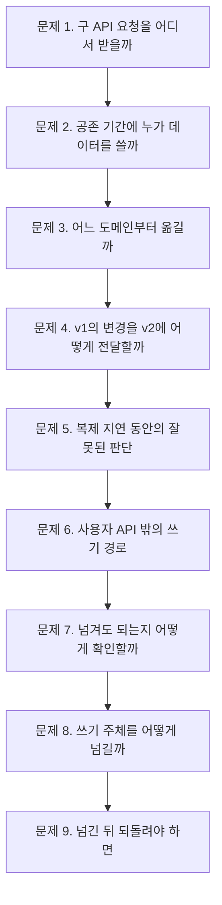
```mermaid
flowchart TB
    P1["문제 1. 구 API 요청을 어디서 받을까"] --> P2["문제 2. 공존 기간에 누가 데이터를 쓸까"]
    P2 --> P3["문제 3. 어느 도메인부터 옮길까"]
    P3 --> P4["문제 4. v1의 변경을 v2에 어떻게 전달할까"]
    P4 --> P5["문제 5. 복제 지연 동안의 잘못된 판단"]
    P5 --> P6["문제 6. 사용자 API 밖의 쓰기 경로"]
    P6 --> P7["문제 7. 넘겨도 되는지 어떻게 확인할까"]
    P7 --> P8["문제 8. 쓰기 주체를 어떻게 넘길까"]
    P8 --> P9["문제 9. 넘긴 뒤 되돌려야 하면"]
```

## 전제

실제 전환에서는 빅뱅을 골랐으니, 이 사고 실험에서는 점진 전환이 필요한 조건을 먼저 정해 둡니다. 뒤에서 후보를 비교할 때 이 세 가지를 기준으로 씁니다.

1. **v1을 멈추고 한 번에 바꾸지 않습니다.** 도메인을 하나씩 넘기고, 문제가 생기면 그 도메인만 되돌릴 수 있어야 합니다.
2. **구버전 앱이 한동안 남습니다.** 앱을 업데이트하지 않은 사용자도 계속 서비스를 써야 합니다.
3. **v2는 재작성입니다.** 두 서버가 같은 RDS를 쓰지만 테이블·ID·API가 모두 다릅니다.

## 처음 계획

계획의 앞단은 ALB 하나였습니다. 앱은 호스트 하나만 알고, ALB가 경로를 보고 v1과 v2로 나눕니다.

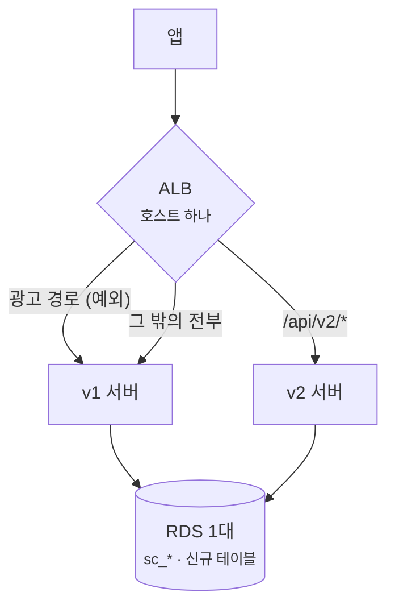
```mermaid
flowchart TB
    App["앱"] --> ALB{"ALB<br/><small>호스트 하나</small>"}
    ALB -- "광고 경로 (예외)" --> V1["v1 서버"]
    ALB -- "/api/v2/*" --> V2["v2 서버"]
    ALB -- "그 밖의 전부" --> V1
    V1 --> DB[("RDS 1대<br/><small>sc_* · 신규 테이블</small>")]
    V2 --> DB
```

- **두 서버가 같은 RDS를 씁니다.** v1의 `sc_*` 테이블과 v2의 신규 테이블을 함께 둡니다. 테이블 이름은 겹치지 않지만, 같은 회원과 게시글을 서로 다른 테이블에 저장하므로 데이터는 따로 맞춰야 합니다.
- **도메인 하나가 v2에 준비되면** 그 도메인의 v1 경로를 v2 쪽 규칙으로 옮깁니다. 이게 계획의 "승격"입니다.
- **되돌리기는 규칙을 원래대로 돌리고 v2가 쓴 행을 정리하는 것**으로 잡았습니다. 다만 v2에서 실제 사용자 쓰기를 받기 시작하면, 이 방법으로는 그동안 생긴 데이터를 보존할 수 없습니다.
- 광고 경로 예외는 v1 광고 모듈이 이미 `/api/v2/ads` 같은 경로를 쓰고 있어서 생긴 규칙입니다.

단계는 다섯이었습니다.

| 단계 | 내용 |
| --- | --- |
| 0 | v1 단독 운영, v2 개발 |
| 1 | v2 배포. v2에만 있는 새 기능만 노출 |
| 2 | 도메인별 전환: 작은 도메인부터, 회원·인증은 가장 신중하게 |
| 3 | v1 축소 |
| 4 | v1 종료, `sc_*` 보관 후 삭제 |

dev에는 `/api/v2/ads*`·`/api/v2/admin*`은 v1, `/api/v2*`는 v2, 나머지는 v1으로 보내는 규칙이 있었습니다.
다만 v1 경로를 v2로 넘긴 적은 dev에서도 없습니다. 이 계획대로 도메인 하나를 실제로 넘겨 보면 첫 문제가 나옵니다.

## 문제 1. 구 API 요청을 어디서 받을까

Strangler Fig의 앞단이 하는 일은 **같은 요청을 다른 구현으로 보내는 것**입니다.
호출자는 같은 경로로 같은 모양의 요청을 보내고, 앞단이 뒤에서 목적지만 바꿉니다.

그런데 v2는 **API 계약 자체를 새로 설계했습니다.** 게시글 작성 하나만 봐도 이렇습니다.

| | v1 | v2 |
| --- | --- | --- |
| 게시글 작성 | `POST /api/customer/board/agora` | `POST /api/v2/posts/agora` |
| 게시글 id | UUID | `post_{ULID}` |
| 로그인한 회원 | JWT `userId` claim (UUID) | `mbr_{ULID}` |

그러니 ALB에서 `/api/customer/board/agora`를 v2로 돌려도 **v2에는 그 경로가 없습니다.** 404입니다. "규칙 승격"이 아무것도 전환하지 못합니다.
v1·v2 엔드포인트를 대조해 보니 경로가 겹치는 건 광고뿐이었습니다. 구 API 요청을 받아 줄 곳이 따로 있어야 합니다.

**후보**

1. **v2에 구 API 어댑터를 둡니다.** v2가 v1의 경로와 응답 형식을 그대로 받아 새 로직으로 처리합니다. 전환 스위치는 다시 ALB 규칙이 됩니다.
2. **v1이 받아서 v2로 넘깁니다.** v1이 구 API를 계속 받고, 옮긴 도메인의 요청만 v1 안에서 v2를 호출합니다. [AWS 가이드](https://docs.aws.amazon.com/prescriptive-guidance/latest/cloud-design-patterns/strangler-fig.html)가 소개하는 모놀리스 안의 변환 계층(ACL)입니다.
3. **앱이 도메인마다 목적지를 바꿉니다.** 당시 계획은 이쪽이었습니다: "FE는 도메인별로 SDK base URL만 바꾼다." 앞단이 로드밸런서가 아니라 앱 코드 안의 분기가 됩니다.

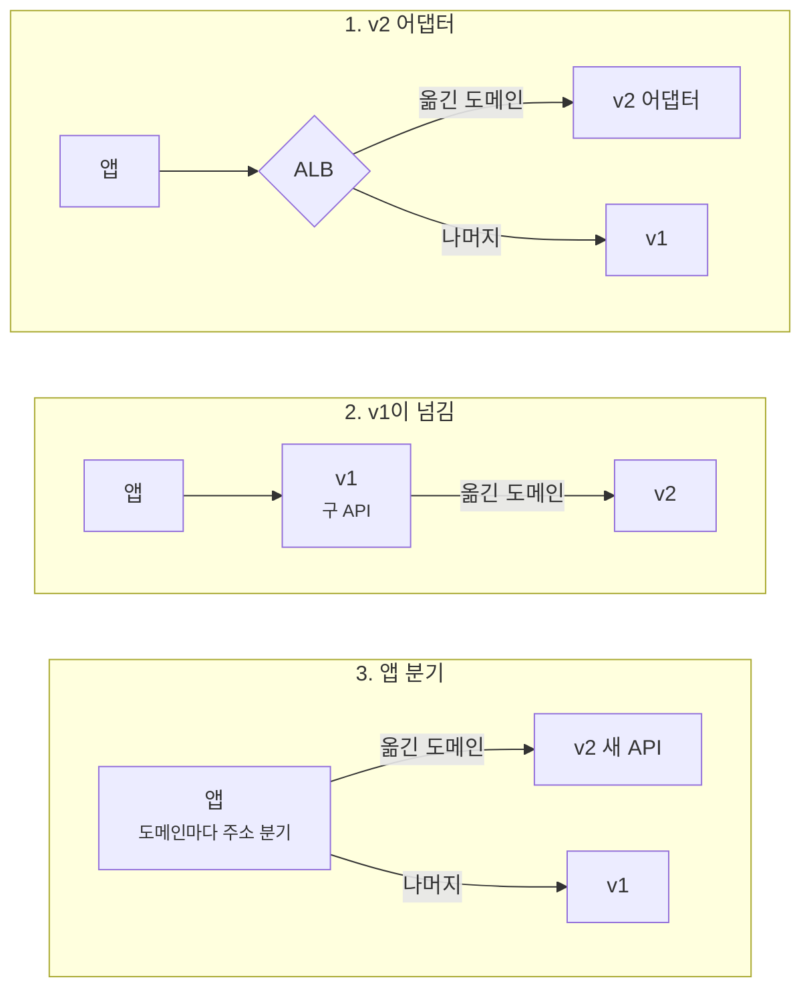
```mermaid
flowchart TB
    subgraph C1["1. v2 어댑터"]
        direction LR
        A1["앱"] --> L1{"ALB"} -->|"옮긴 도메인"| N1["v2 어댑터"]
        L1 -->|"나머지"| O1["v1"]
    end
    subgraph C2["2. v1이 넘김"]
        direction LR
        A2["앱"] --> O2["v1<br/><small>구 API</small>"] -->|"옮긴 도메인"| N2["v2"]
    end
    subgraph C3["3. 앱 분기"]
        direction LR
        A3["앱<br/><small>도메인마다 주소 분기</small>"] -->|"옮긴 도메인"| N3["v2 새 API"]
        A3 -->|"나머지"| O3["v1"]
    end
    C1 ~~~ C2 ~~~ C3
```

3번은 새 앱의 JS 번들을 스토어 심사 없이 OTA로 바꿀 수 있어서 분기 하나를 바꾸는 비용 자체는 낮습니다. 하지만 이 앱 설정에서 OTA에는 두 가지 제약이 있습니다.

- **다음 실행에 적용됩니다.** 실행할 때 업데이트를 확인하되 기다리지 않고(`checkAutomatically: ON_LOAD`, `fallbackToCacheTimeout: 0`), 받은 번들은 **다음 실행**에 씁니다.
- **같은 앱 버전 바이너리에만 갑니다**(`runtimeVersion.policy: appVersion`).

그래서 도메인 하나를 넘긴 직후에도 옛 분기로 v1을 부르는 앱이 한동안 남습니다. 그 도메인의 v1 엔드포인트를 막으면 그 사용자들의 기능이 깨지고, 열어 두면 v1과 v2가 각자 자기 테이블에 써서 **같은 서비스의 데이터가 둘로 갈라집니다.**

| | 1. v2 어댑터 | 2. v1이 넘김 | 3. 앱 분기 |
| --- | --- | --- | --- |
| 전환 시점을 정하는 곳 | 서버 (ALB 규칙) | 서버 (v1 배포) | 앱 업데이트 |
| 구버전 앱 (전제 2) | 그대로 동작 | 그대로 동작 | 업데이트를 강제하거나 데이터가 갈라짐 |
| v1을 줄일 수 있나 (전제 1) | 옮긴 도메인은 v1을 거치지 않음 | 모든 요청이 끝까지 v1을 거침 | 옮긴 도메인은 v1을 거치지 않음 |
| 만들 것 | ID·인증·응답 번역 | v1의 v2 호출과 응답 변환 | 앱의 도메인별 분기 |

**선택**

1번, v2에 구 API 어댑터를 둡니다.
구버전 앱이 남아 있어도 서버가 도메인별 전환 시점을 정할 수 있고, 옮긴 도메인의 요청은 v1을 거치지 않습니다.
2번은 v1을 마지막까지 앞단으로 운영해야 해서 v1을 줄여 가는 목표와 맞지 않고, v1 장애가 옮긴 도메인까지 막습니다. 3번은 전환 시점이 앱 업데이트에 묶입니다.
새 API도 같은 도메인 로직을 호출하게 두면 구버전 앱과 신버전 앱의 쓰기가 한곳으로 모입니다.

**트레이드오프**

요청마다 번역해야 합니다.

- **ID 번역**: 들어오는 UUID를 새 ID로, 나가는 새 ID를 UUID로 바꿔야 합니다.
  이관 때 만든 `migration_id_map(domain, legacy_id, new_id)`을 이관 뒤에도 ID 변환에 계속 사용해야 합니다.
  전환 뒤 v2에서 새로 생긴 게시글에도 구 API에서 사용할 UUID를 부여하고 ID 대응을 유지하겠습니다. 그래야 구버전 앱에 새 ID 형식을 요구하지 않아도 됩니다.
- **인증 재현**: v1의 인증 필터가 하던 일을 v2가 똑같이 해야 합니다.
  - 같은 서명 키로 v1 토큰을 검증하고, `userId` claim을 새 회원 ID로 바꿉니다.
  - 로그아웃한 토큰인지 v1의 Redis 블랙리스트를 조회합니다.
  - 인증이 필요한 요청이면 일반 회원은 리프레시 토큰 헤더도 함께 보냅니다. 그 토큰의 사용자가 액세스 토큰의 사용자와 같은지 확인합니다.
  - 액세스 토큰이 만료됐으면 리프레시 토큰으로 새로 발급해 응답 헤더에 담아 보냅니다.
  - 인증이 필요한 요청마다 회원이 탈퇴했거나 정지됐는지 확인합니다.
- **응답 모양 재현**: v1이 내려 주던 필드를 그대로 만들어야 합니다. 프로필 응답의 리워드 포인트(`rewardPoint`)처럼 **v2가 버린 도메인의 필드**까지 포함해서입니다.

v2에는 이 번역 계층을 둘 **자리(`controller/v1/`)만 예약**돼 있었고, v1 형식으로 만든 엔드포인트는 **헬스체크(`/api/open/healthCheck`) 하나**뿐입니다. 옛 호스트를 v2로 돌린 뒤에도 구버전 앱의 업데이트 확인 요청을 받기 위해 남긴 경로입니다.
구 API의 필드를 새 모델에서 만들 수 없다면 필요한 레거시 정보를 남겨 두고, 호환할 수 없는 기능은 어댑터가 준비되기 전까지 전환하지 않습니다.

어댑터는 구버전 앱 지원을 끝낼 때까지 남습니다. [Azure 문서](https://learn.microsoft.com/en-us/azure/architecture/patterns/strangler-fig)도 전환이 끝난 뒤 앞단을 옛 클라이언트를 위한 어댑터로 남기는 방법을 소개합니다. [Stripe의 API 버전 관리](https://stripe.com/blog/api-versioning)는 옛 버전의 요청과 응답을 코어 코드 밖의 변환 모듈로 처리하고, 언젠가 옛 버전을 종료할 계획을 밝힙니다.

**바뀐 설계**

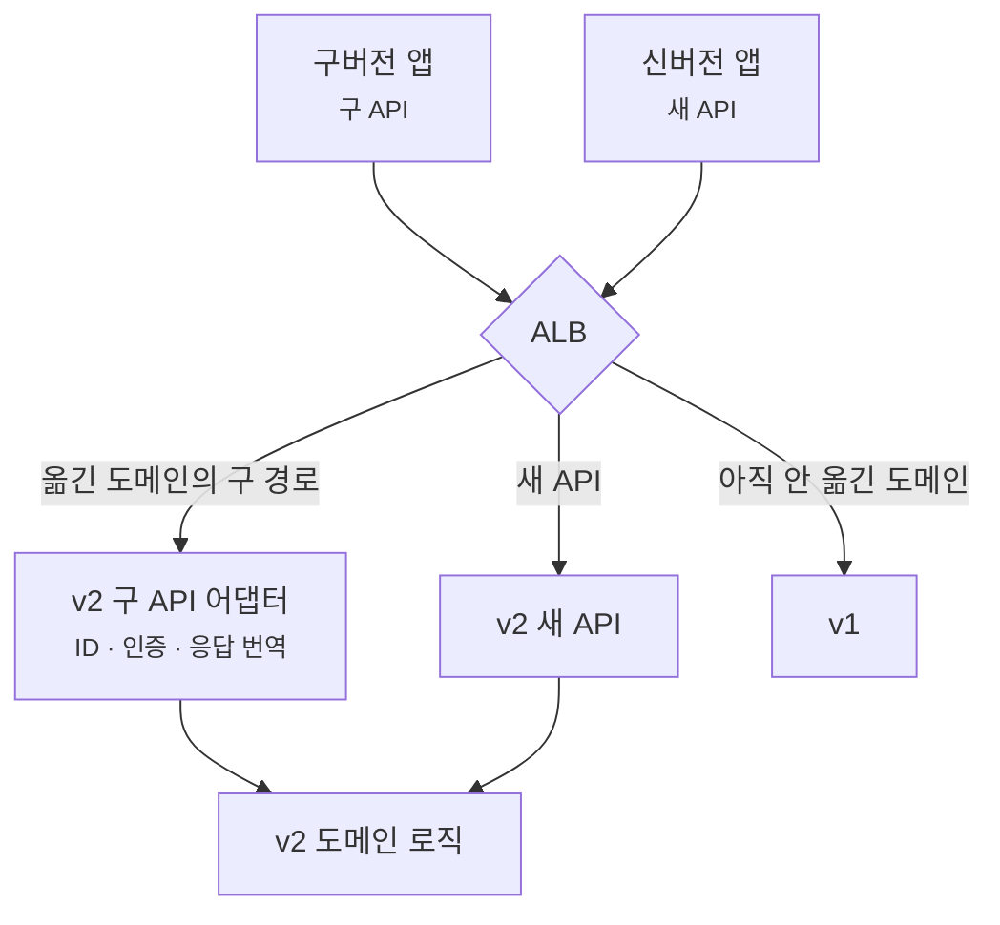
```mermaid
flowchart TB
    Old["구버전 앱<br/><small>구 API</small>"] --> ALB{"ALB"}
    New["신버전 앱<br/><small>새 API</small>"] --> ALB
    ALB -->|"옮긴 도메인의 구 경로"| AD["v2 구 API 어댑터<br/><small>ID · 인증 · 응답 번역</small>"]
    ALB -->|"새 API"| NA["v2 새 API"]
    ALB -->|"아직 안 옮긴 도메인"| V1["v1"]
    AD --> L["v2 도메인 로직"]
    NA --> L
```

**다음 문제**

구 API 요청을 v2가 받을 수 있게 됐습니다. 하지만 v2가 요청을 처리하려면 데이터가 있어야 하고, v1의 데이터는 공존 기간에도 계속 바뀝니다.

## 문제 2. 공존 기간에 누가 데이터를 쓸까

v1 회원을 v2 회원 테이블로 옮겼다고 회원 이관이 끝나는 건 아닙니다. v1이 계속 운영되는 동안 가입과 탈퇴가 생기고, 게시글도 수정되거나 삭제됩니다.
같은 RDS 안에 있더라도 두 테이블은 자동으로 맞춰지지 않습니다. 처음 복사한 순간에 값이 같았을 뿐입니다.

| 공존 중 발생할 수 있는 변경 | 다른 쪽에 반영하지 않으면 |
| --- | --- |
| v1에서 회원 가입 | v2에 회원과 ID 대응이 없음 |
| v1에서 회원 탈퇴·정지 | v2는 이전 회원 상태를 계속 사용 |
| v2에서 게시글 수정 | v1은 수정 전 내용을 노출 |
| v1 관리자에서 게시글 숨김 | v2에는 그대로 노출 |

**후보**

1. **양쪽에서 쓰고 서로 맞춥니다.** 구버전 앱은 v1에, 신버전 앱은 v2에 쓰고 양방향으로 동기화합니다.
2. **도메인마다 쓰기 주체를 하나로 두고, 정해진 시점에 넘깁니다.** 반대쪽에는 읽기용 데이터만 복제합니다.
3. **복제하지 않고 v2가 v1 테이블을 씁니다.** 처음에는 v2의 코드가 v1 테이블을 그대로 읽고 쓰고, 요청 전환이 끝난 뒤에 v2 테이블로 데이터를 옮깁니다. 두 서버가 같은 RDS를 쓰고 있어서 접근은 가능합니다.

1번은 같은 게시글을 두 서버가 각자 수정할 수 있게 되어 이런 규칙이 필요합니다.

- **충돌 규칙:** 같은 게시글을 v1에서는 수정하고 v2에서는 삭제했을 때 어떤 상태를 남길지 정해야 합니다. 나중에 도착한 변경으로 덮어쓰면 늦게 도착한 수정 이벤트가 삭제한 글을 되살릴 수 있고, 시간값으로 비교하더라도 수정과 삭제 중 무엇을 우선할지는 별개의 결정입니다.
- **출처 구분:** 다시 전달받은 변경을 새로운 변경으로 인식해 양쪽에서 계속 전송하지 않도록 해야 합니다.
- **변환 유지:** UUID와 새 ID의 대응, 서로 다른 상태값, v2에서만 생긴 데이터의 역변환을 공존 기간 내내 유지해야 합니다.

3번은 [Azure 문서의 데이터베이스 분리 예시](https://learn.microsoft.com/en-us/azure/architecture/patterns/strangler-fig)가 이 순서로 시작합니다. 새 시스템이 해당 도메인의 요청을 받으면서 처음에는 레거시 DB의 도메인 테이블을 읽고 쓰고, 이후에 도메인 전용 DB로 옮깁니다. [Khan Academy](https://blog.khanacademy.org/go-services-one-goliath-project/)는 Python 백엔드를 Go 서비스로 옮기면서 데이터베이스는 그대로 두기로 했습니다.
같은 행을 읽고 쓰므로 복제가 필요 없고, 전환은 두 번으로 나뉩니다.

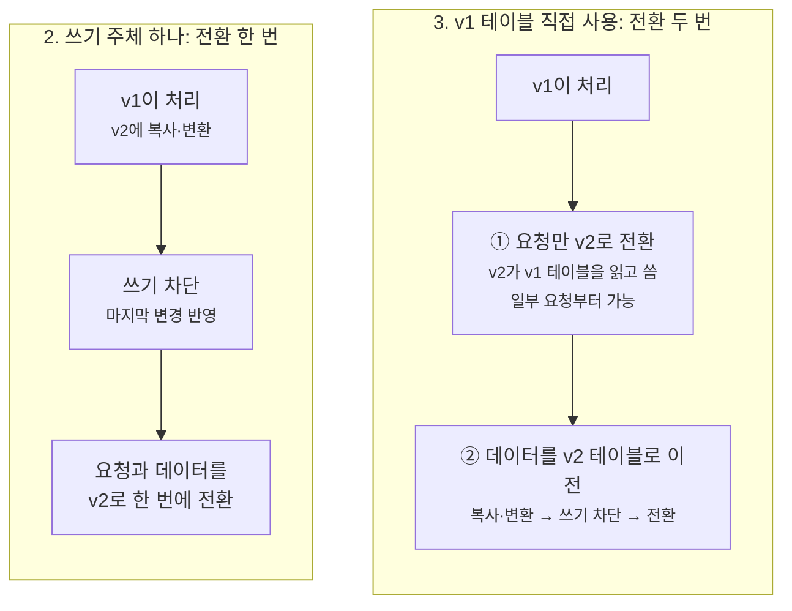
```mermaid
flowchart TB
    subgraph SB["3. v1 테이블 직접 사용: 전환 두 번"]
        direction TB
        D1["v1이 처리"] --> D2["① 요청만 v2로 전환<br/><small>v2가 v1 테이블을 읽고 씀<br/>일부 요청부터 가능</small>"] --> D3["② 데이터를 v2 테이블로 이전<br/><small>복사·변환 → 쓰기 차단 → 전환</small>"]
    end
    subgraph SA["2. 쓰기 주체 하나: 전환 한 번"]
        direction TB
        R1["v1이 처리<br/><small>v2에 복사·변환</small>"] --> R2["쓰기 차단<br/><small>마지막 변경 반영</small>"] --> R3["요청과 데이터를<br/>v2로 한 번에 전환"]
    end
```

| | 1. 양쪽 쓰기 | 2. 쓰기 주체 하나 | 3. v1 테이블 직접 사용 |
| --- | --- | --- | --- |
| 충돌 규칙 | 필요 | 필요 없음 | 필요 없음 |
| 요청 일부부터 전환 | 가능 | 어려움 (쓰기 주체가 둘이 됨) | 가능 (ALB [가중치](https://docs.aws.amazon.com/elasticloadbalancing/latest/application/rule-action-types.html)) |
| 롤백 | 양쪽에 데이터가 있음 (동기화가 맞을 때) | v2 변경을 v1 형식으로 역반영 | 라우팅 되돌리기 |
| v2의 새 ID·모델을 쓰는 시점 | v1이 표현할 수 있는 범위 안에서만 (v1을 내릴 때까지) | 복구 기간이 끝난 뒤 | 데이터 이전 뒤의 복구 기간이 끝난 뒤 |
| 따로 만들 것 | 양방향 변환, 충돌 해결 | 단방향 변환, ID 대응, 복구 기간의 역방향 변환 | v1 스키마용 저장소 계층, 나중의 데이터 이전 |

**선택**

2번, 도메인마다 쓰기 주체를 하나로 둡니다.
1번은 충돌 규칙과 출처 구분을 공존 기간 내내 유지해야 합니다.
3번은 v2를 이미 새 스키마 위에 만든 상태에서 v1 스키마(UUID, 옛 테이블 구조)를 읽고 쓰는 저장소 계층을 하나 더 만들어야 하고, 데이터를 옮기고 나면 그 코드는 버립니다. v2 테이블로 옮기는 두 번째 전환에서는 초기 복사, 변경 동기화, 쓰기 차단, 복구 기간을 처음부터 다시 거쳐야 합니다.
2번은 충돌 해결 대신 변경의 누락·순서·지연만 관리하면 됩니다.
Sam Newman도 [Monolith to Microservices](https://samnewman.io/books/monolith-to-microservices/)에서 코드로 두 DB를 맞추는 방식은 기존 시스템과 새 서비스 중 한쪽만 쓸 때 가장 잘 맞고, 카나리처럼 양쪽이 동시에 요청을 받으면 동기화가 복잡해진다고 설명합니다.

**트레이드오프**

- 사용자 일부부터 v2로 보내 보는 카나리를 쓸 수 없습니다. 도메인을 한 시점에 넘겨야 하고, 그 순간 짧은 쓰기 차단이 필요합니다(문제 8).
- 반대쪽에 데이터를 계속 복제해야 하고, 복제에는 지연이 있습니다(문제 4, 5).
- 되돌리려면 v2의 변경을 v1 형식으로 역반영해야 합니다(문제 9).
- v1과 구조 차이가 작은 도메인이라면 저장소 계층이 얇으니 3번이 더 낫다고 봅니다. 요청 전환과 데이터 이전을 나눠서 하나씩 검증할 수 있기 때문입니다.

**바뀐 설계**

예를 들어 커뮤니티를 넘긴다면, 옮긴다는 것은 v1과 v2가 커뮤니티를 함께 받는다는 뜻이 아닙니다. **커뮤니티 데이터의 쓰기 주체를 정해진 시점에 v1에서 v2로 넘긴다**는 뜻입니다.

- 전환 전에는 게시글·댓글·반응의 조회와 생성·수정·삭제를 모두 v1이 처리합니다. v2에는 복사본만 있습니다.
- 전환 후에는 모두 v2가 처리합니다. 구버전 앱과 v1 관리자 화면의 게시글 요청도 v2로 갑니다.
- 아직 넘기지 않은 도메인은 계속 v1이 받습니다.

서버 두 대는 전환 기간 내내 함께 떠 있지만, 같은 데이터를 두 서버가 동시에 쓰는 기간은 만들지 않습니다.

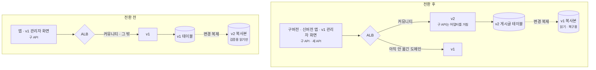
```mermaid
flowchart TB
    subgraph after["전환 후"]
        A2["구버전 · 신버전 앱 · v1 관리자 화면<br/><small>구 API · 새 API</small>"] --> L2{"ALB"}
        L2 -->|"커뮤니티"| S2["v2<br/><small>구 API는 어댑터를 거침</small>"]
        L2 -->|"아직 안 옮긴 도메인"| S3["v1"]
        S2 --> T2[("v2 게시글 테이블")]
        T2 -. "변경 복제" .-> C2[("v1 복사본<br/><small>읽기 · 복구용</small>")]
    end
    subgraph before["전환 전"]
        A1["앱 · v1 관리자 화면<br/><small>구 API</small>"] --> L1{"ALB"}
        L1 -->|"커뮤니티 · 그 밖"| S1["v1"]
        S1 --> T1[("v1 테이블")]
        T1 -. "변경 복제" .-> C1[("v2 복사본<br/><small>검증용 읽기만</small>")]
    end
```

화면과 서버를 한 번에 전부 옮기지 않더라도, 해당 데이터의 쓰기 경로는 한쪽으로 모아야 합니다.

쓰기 요청을 받는 쪽과 복제가 흐르는 방향은 따로 봐야 합니다. 쓰기 요청은 언제나 한쪽만 받고, 복제는 그 한쪽에서 반대쪽으로만 흐릅니다. 반대쪽에 쌓이는 데이터는 읽기만 하는 복사본이라, 사용자나 관리자의 요청으로 직접 고치지 않습니다.

| | 쓰기 요청을 받는 쪽 | 복제 방향 | 반대쪽 복사본의 쓰임 |
| --- | --- | --- | --- |
| 전환 전 | v1 | `v1 → v2` | v2가 넘겨받기 전에 검증용으로 읽음 |
| 전환 후 | v2 | `v2 → v1` | v1에 남은 기능이 조회하거나, 되돌릴 때 복구에 씀(문제 9) |

전환 후의 `v2 → v1` 복제는 필요할 때만 둡니다. v1에 남은 기능이 그 데이터를 읽지 않고 복구 기간도 끝났다면 없애도 됩니다.
[AWS 가이드](https://docs.aws.amazon.com/prescriptive-guidance/latest/cloud-design-patterns/strangler-fig.html)도 새 서비스가 자기 데이터를 소유하게 하고, 레거시 DB와는 큐와 동기화 작업으로 맞추라고 합니다. 이렇게 맞춘 복사본은 원본보다 늦게 따라오므로 장기 해법이 아니라 임시 해법으로 다루라고 덧붙입니다.

**다음 문제**

쓰기 주체를 도메인마다 넘기려면 어느 도메인부터 넘길지 정해야 합니다. 그런데 도메인끼리 ID로 얽혀 있습니다.

## 문제 3. 어느 도메인부터 옮길까

v1과 v2는 ID 형식이 다릅니다. v1은 UUID를, v2는 `mbr_{ULID}`·`post_{ULID}` 같은 새 ID를 씁니다. 그래서 기존 이관 Job은 행을 하나 옮길 때마다 `migration_id_map`에 "v1의 이 ID는 v2의 저 ID가 됐다"는 대응을 적어 둡니다.

이 대응표는 다음에 옮길 데이터가 참조하는 ID를 바꿀 때 씁니다. 댓글에는 작성자 회원 ID와 게시글 ID가 들어 있는데, 둘 다 v2의 새 ID로 바꿔야 v2 댓글로 저장할 수 있습니다. 대응표에서 찾지 못하면 그 댓글은 옮기지 않고 건너뜁니다.

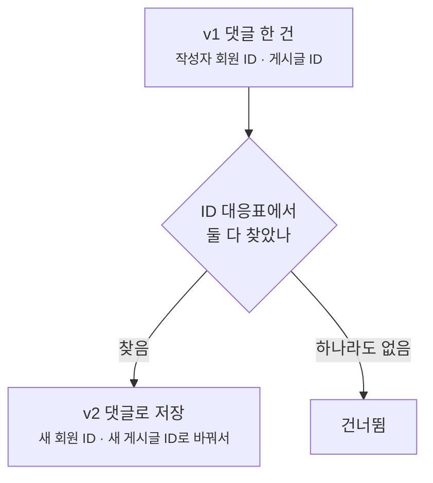
```mermaid
flowchart TB
    C["v1 댓글 한 건<br/><small>작성자 회원 ID · 게시글 ID</small>"] --> L{"ID 대응표에서<br/>둘 다 찾았나"}
    L -->|"찾음"| N["v2 댓글로 저장<br/><small>새 회원 ID · 새 게시글 ID로 바꿔서</small>"]
    L -->|"하나라도 없음"| S["건너뜀"]
```

그래서 옮기는 순서가 정해집니다. 아래 그림의 화살표는 "**앞의 것을 먼저 옮겨야 뒤의 것을 옮길 수 있다**"는 뜻입니다. 뒤의 것이 앞의 것의 ID를 참조하기 때문입니다.

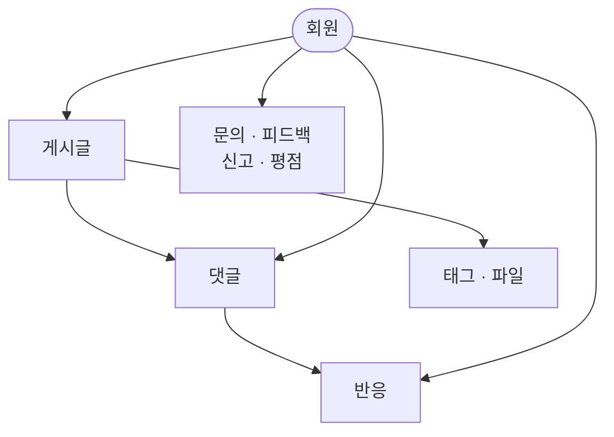
```mermaid
flowchart TB
    M(["회원"]) --> P["게시글"] --> C["댓글"] --> R["반응"]
    M --> C
    M --> R
    M --> Q["문의 · 피드백<br/>신고 · 평점"]
    P --> T["태그 · 파일"]
```

회원은 거의 모든 데이터가 참조합니다. 회원을 언제 옮기느냐에 따라 전체 순서가 정해집니다.

**후보**

1. **회원·인증부터 옮깁니다.**
2. **커뮤니티부터 옮기고 회원은 v1에 남깁니다.**
3. **회원과 커뮤니티를 함께 옮깁니다.**

1번이면 로그인과 토큰 발급, 회원 정보가 v2에 있으므로 v1에 남은 기능에 두 가지 문제가 생깁니다.

- v1의 인증 필터가 v2가 발급한 토큰을 이해하도록 수정해야 합니다.
- v1 코드가 SQL로 회원 테이블을 직접 JOIN하던 부분은, 회원 데이터가 v2로 넘어가 v1 회원 테이블이 더 이상 최신이 아니게 됩니다. v2 회원 API 조회나 호환용 데이터로 바꿔야 합니다.

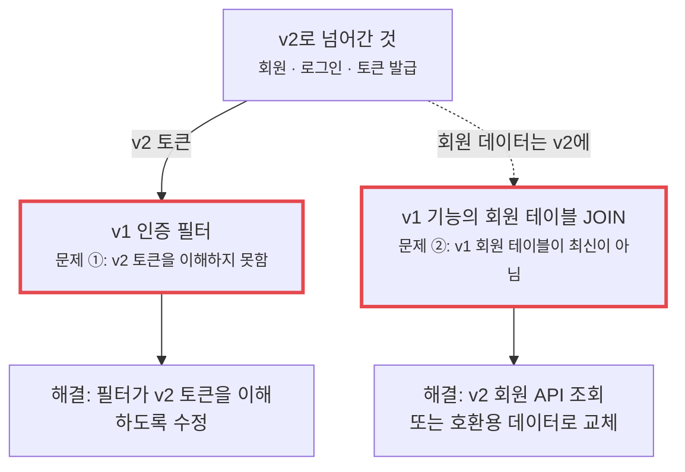
```mermaid
flowchart TB
    M2["v2로 넘어간 것<br/><small>회원 · 로그인 · 토큰 발급</small>"]
    F["v1 인증 필터<br/><small>문제 ①: v2 토큰을 이해하지 못함</small>"]
    Q["v1 기능의 회원 테이블 JOIN<br/><small>문제 ②: v1 회원 테이블이 최신이 아님</small>"]
    M2 -->|"v2 토큰"| F
    M2 -.->|"회원 데이터는 v2에"| Q
    F --> FX["해결: 필터가 v2 토큰을 이해하도록 수정"]
    Q --> QX["해결: v2 회원 API 조회<br/>또는 호환용 데이터로 교체"]
    classDef problem stroke:#e5484d,stroke-width:3px
    class F,Q problem
```

2번이면 v1에 남은 회원 정보를 v2가 계속 받아 와야 합니다. 커뮤니티를 옮기는 동안에도 v1에서는 새 회원이 가입하고 탈퇴하기 때문입니다.
3번은 의존 문제는 줄지만 한 번에 넘기는 범위가 커져서, 문제가 생겼을 때 되돌릴 범위도 커집니다(전제 1). 문의·신고처럼 회원을 참조하는 다른 기능은 여전히 v1에 남습니다.

| | 1. 회원부터 | 2. 커뮤니티부터 | 3. 함께 |
| --- | --- | --- | --- |
| v1에서 고칠 것 | 남은 기능 전부의 인증 필터와 회원 JOIN | 커뮤니티 쓰기 차단, 관리자 연결 | 남은 기능의 인증 필터와 회원 JOIN |
| 계속 맞춰야 할 데이터 | v2 회원 → v1 남은 기능 | v1 회원 → v2 | v2 회원 → v1 남은 기능 |
| 한 번에 넘기는 범위 | 회원·인증 | 커뮤니티 | 회원·인증·커뮤니티 |

**선택**

2번, 커뮤니티부터 옮기고 회원은 마지막에 옮깁니다.
회원·인증은 거의 모든 기능이 의존하고 있어서, 먼저 옮기면 v1에 남은 기능을 전부 고쳐야 합니다. 커뮤니티부터 옮기면 v1 쪽 변경이 가장 적고, 한 번에 넘기는 범위도 작습니다.

**트레이드오프**

- v1 회원 정보를 v2로 계속 전달해야 합니다(문제 4).
- 그 전달에 지연이 있어서 v2가 예전 회원 정보로 판단할 수 있습니다(문제 5).
- 회원이 마지막이라 각 기능이 v1 회원에 의존하는 기간이 깁니다. 나중에 회원을 옮길 때 기능마다 다시 뜯지 않도록 연결 지점을 먼저 만들어야 합니다.

**바뀐 설계**

v2에는 작성자 표시와 참조에 필요한 회원 정보를 복사해 둡니다. 이 글에서는 이것을 **회원 복사본**이라고 부르겠습니다. 회원 자체를 바꾸는 요청은 계속 v1이 받습니다.

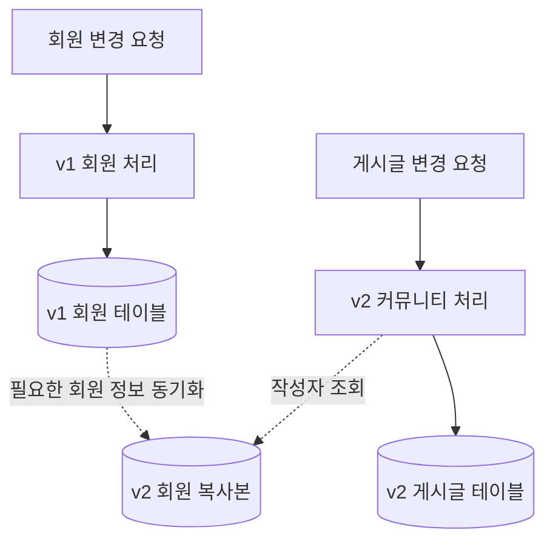
```mermaid
flowchart TB
    M["회원 변경 요청"] --> V1["v1 회원 처리"]
    V1 --> D1[("v1 회원 테이블")]
    D1 -. "필요한 회원 정보 동기화" .-> D2[("v2 회원 복사본")]
    P["게시글 변경 요청"] --> V2["v2 커뮤니티 처리"]
    V2 --> D3[("v2 게시글 테이블")]
    V2 -. "작성자 조회" .-> D2
```

커뮤니티를 옮기는 동안에는 v1 인증을 그대로 받아들이고, 회원에 의존하는 다른 기능도 차례로 **회원 조회·인증 경계**를 거치도록 바꿉니다. 경계는 회원 정보를 읽고 로그인 상태를 확인하는 코드를 한 곳에 모은 부분입니다. 각 기능은 회원 테이블을 직접 JOIN하는 대신 이 경계만 호출합니다.
이렇게 해 두면 나중에 회원을 v2로 넘길 때 각 기능을 다시 뜯지 않고, 경계가 연결하는 대상만 v1에서 v2로 바꾸면 됩니다.

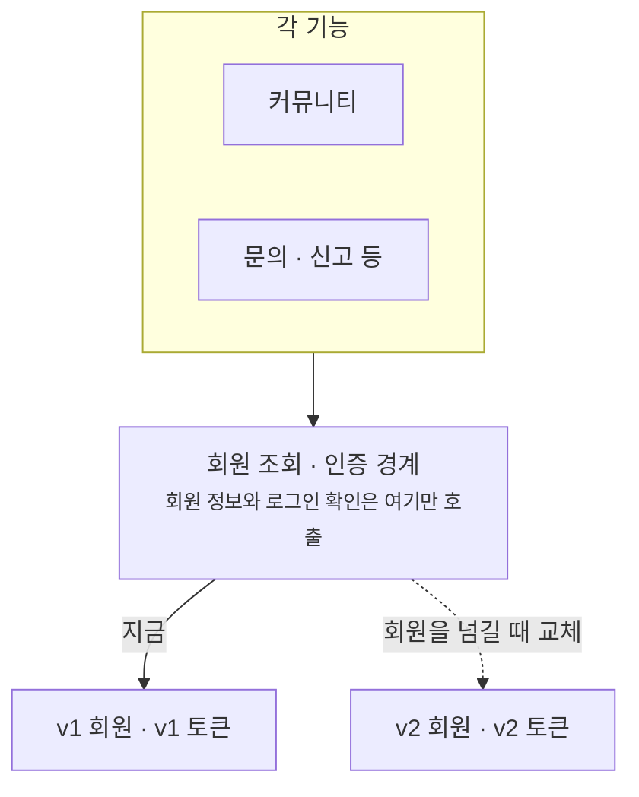
```mermaid
flowchart TB
    subgraph FN["각 기능"]
        C["커뮤니티"]
        I["문의 · 신고 등"]
    end
    FN --> B["회원 조회 · 인증 경계<br/><small>회원 정보와 로그인 확인은 여기만 호출</small>"]
    B -->|"지금"| M1["v1 회원 · v1 토큰"]
    B -.->|"회원을 넘길 때 교체"| M2["v2 회원 · v2 토큰"]
```

**다음 문제**

회원 복사본은 v1의 회원 변경을 계속 따라가야 합니다. 커뮤니티 데이터도 넘기기 직전까지 v1에서 계속 바뀝니다. 기존 이관 Job으로는 이 변경을 따라갈 수 없습니다.

## 문제 4. v1의 변경을 v2에 어떻게 전달할까

기존 이관 Job은 이미 옮긴 행을 건너뛰도록 만들어져 있습니다. 재실행하면 새로 생긴 행은 가져올 수 있지만, 이미 복사한 행의 수정·삭제까지 따라가는 동기화는 아닙니다.

예를 들어 월요일에 게시글을 복사하고 화요일에 v1에서 그 글을 수정했다고 해 보겠습니다. 수요일에 v1 쓰기를 멈추고 Job을 다시 돌려도, 이미 옮긴 행을 건너뛰므로 v2에는 월요일 내용이 남습니다. 화요일에 삭제한 글도 마찬가지입니다.

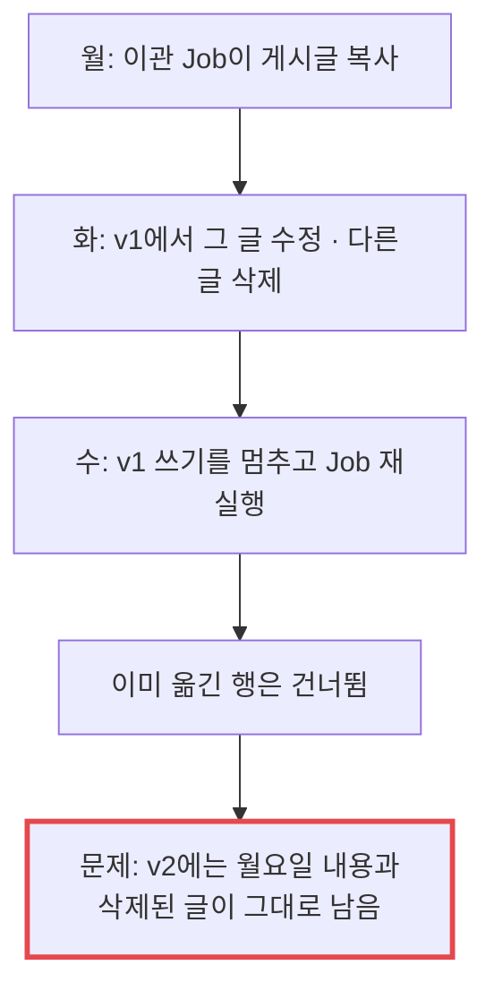
```mermaid
flowchart TB
    A["월: 이관 Job이 게시글 복사"] --> B["화: v1에서 그 글 수정 · 다른 글 삭제"]
    B --> C["수: v1 쓰기를 멈추고 Job 재실행"]
    C --> D["이미 옮긴 행은 건너뜀"]
    D --> E["문제: v2에는 월요일 내용과<br/>삭제된 글이 그대로 남음"]
    classDef problem stroke:#e5484d,stroke-width:3px
    class E problem
```

**후보**

1. **이관 Job을 고쳐 주기적으로 돌립니다.** 수정 시각(`updated_date`)이 바뀐 행도 다시 읽어 덮어쓰게 합니다.
2. **v1 코드에서 변경 이벤트를 만들어 보냅니다.** 원본 변경과 보낼 이벤트를 같은 DB 트랜잭션에 저장하고, 별도 작업이 이벤트를 읽어 전달하는 Outbox 방식으로 만듭니다.
3. **DB 트리거를 둡니다.** v1 테이블이 바뀔 때마다 트리거가 변경 내용을 별도 테이블에 적고, 별도 작업이 그 테이블을 읽어 전달합니다.
4. **한 트랜잭션에서 v1·v2 테이블을 함께 갱신합니다.** 같은 PostgreSQL 데이터베이스라서 가능합니다.
5. **CDC를 씁니다.** DB가 커밋한 변경을 남기는 트랜잭션 로그를 별도 프로세스가 읽어 v2에 반영합니다.

| 후보 | v1 코드 수정 | 삭제 | 그 밖의 대가 |
| --- | --- | --- | --- |
| 1. 주기적 재실행 | 없음, 단 모든 쓰기 경로가 수정 시각을 갱신해야 함 | 잡지 못함 | 반영이 주기만큼 늦음, 주기마다 조회 부하 |
| 2. 코드에서 이벤트 발행 | 모든 쓰기 경로, outbox 테이블 | 잡음 | 같은 이벤트가 여러 번 갈 수 있어 받는 쪽이 중복을 견뎌야 함 |
| 3. 트리거 | 없음 (DB에 트리거 추가) | 잡음 | 모든 쓰기 트랜잭션 안에서 트리거가 실행됨, 스키마가 바뀔 때 함께 관리 |
| 4. 한 트랜잭션 갱신 | 모든 쓰기 경로 | 잡음 | v1 코드가 v2 스키마를 알아야 함, 지연은 없음 |
| 5. CDC | 없음 | 잡음 (기본 키가 없는 테이블은 복제 식별자 설정 필요) | 논리 복제 설정, CDC 프로세스 운영, 변환 직접 구현 |

2번을 Outbox로 만드는 것은 [Transactional outbox](https://docs.aws.amazon.com/prescriptive-guidance/latest/cloud-design-patterns/transactional-outbox.html) 문서가 설명하는 이중 쓰기 문제 때문입니다. 저장한 뒤에 이벤트를 따로 보내면, DB 저장은 성공했는데 이벤트 전송이 실패할 때 받는 쪽은 변경을 모릅니다. 반대로 트랜잭션이 롤백됐는데 이벤트가 나가면 없는 변경이 전달됩니다. Outbox는 이 문제를 풀지만, v1의 쓰기 경로마다 outbox 저장을 넣어야 합니다.
Sam Newman도 [Monolith to Microservices](https://samnewman.io/books/monolith-to-microservices/)에서 DB 변경을 잡는 방법으로 트리거, 트랜잭션 로그 읽기, 주기적인 변경분 복사를 듭니다.

**큐는 어디에 들어가나**

메시지 큐를 쓰는 방법도 있습니다. 다만 큐는 변경을 **어떻게 잡느냐**가 아니라 잡은 변경을 **어떻게 전달하느냐**를 정합니다. 2·3·5번 어느 방식이든 뒤에 큐를 둘 수 있습니다.

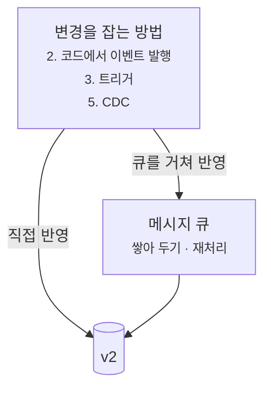
```mermaid
flowchart TB
    CAP["변경을 잡는 방법<br/><small>2. 코드에서 이벤트 발행<br/>3. 트리거<br/>5. CDC</small>"]
    CAP -->|"직접 반영"| V2[("v2")]
    CAP -->|"큐를 거쳐 반영"| Q["메시지 큐<br/><small>쌓아 두기 · 재처리</small>"] --> V2
```

큐를 두면 v2가 느리거나 멈춰도 변경이 쌓여서 기다리고, 받는 곳을 늘리기도 쉽습니다. 대신 운영할 대상이 하나 늘고, 같은 메시지가 두 번 올 수 있어 받는 쪽이 중복을 견뎌야 합니다. 순서가 필요하면 순서를 보장하는 큐를 써야 합니다. 위 문서도 SQS 표준 큐는 메시지를 한 번 이상 전달해 중복이 생길 수 있고, 순서가 필요하면 FIFO 큐를 쓸 수 있다고 설명합니다.

**선택**

5번, CDC를 쓰고 큐 없이 v2에 바로 반영합니다.
v1 코드를 고치지 않으므로 API뿐 아니라 관리자 기능과 배치까지, 데이터를 바꾸는 경로를 하나도 빠뜨리지 않습니다. 2번과 4번은 그 경로를 전부 찾아 고쳐야 합니다.
1번과 달리 삭제를 잡고, 3번과 달리 v1의 쓰기 트랜잭션 안에서 실행되는 작업이 없습니다. 변환 처리도 CDC 뒤 한곳에 모입니다.
[Azure 문서의 데이터베이스 분리 예시](https://learn.microsoft.com/en-us/azure/architecture/patterns/strangler-fig)도 초기 ETL 뒤에 CDC로 도메인 데이터를 동기화하고, 전환 전에 두 데이터베이스의 일관성을 검증합니다. Fowler 쪽 [Event Interception 사례](https://www.martinfowler.com/articles/patterns-legacy-displacement/event-interception.html)도 지속적인 동기화를 CDC로 처리했습니다.
큐는 두지 않겠습니다. 변경을 받는 곳이 v2 하나뿐이라 큐로 얻는 것보다 운영할 대상이 늘어나는 비용이 큽니다. v2 반영이 자주 밀리거나 받는 곳이 늘어나면 그때 CDC 뒤에 큐를 붙입니다.

**트레이드오프**

- **복제 지연이 생깁니다.** CDC는 v1이 저장을 끝낸 뒤에 따로 돕니다(문제 5).
- **변환은 직접 만들어야 합니다.** 테이블 구조와 ID가 달라서 변경된 행을 그대로 새 테이블에 넣을 수 없습니다.
  - v1 회원 UUID를 v2 회원 ID로 바꾸고, 게시글·댓글의 참조도 같은 ID 대응표로 변환해야 합니다.
  - v1의 한 행이 v2의 여러 테이블로 나뉜다면, 어느 테이블까지 함께 갱신할지 정해야 합니다.
  - 삭제나 상태 변경을 v2에서 어떻게 표현할지 정하고, 늦게 도착한 예전 변경이 최신 상태를 덮어쓰지 않도록 해야 합니다.
  - PostgreSQL 기본 논리 복제는 스키마를 복제하지 않고, 넘어온 데이터가 대상 테이블 구조에 맞지 않으면 복제가 오류로 멈춥니다. ID 형식과 테이블 구조가 다른 이번 재설계에는 변환 처리를 따로 둬야 합니다. [PostgreSQL 논리 복제 제약](https://www.postgresql.org/docs/current/logical-replication-restrictions.html)
- **초기 복사와 변경 수집을 이어 붙여야 합니다.** 복사를 끝낸 뒤 변경 수집을 켜면 그 사이의 수정이 빠질 수 있습니다. 일관된 스냅샷과 그에 대응하는 로그 위치를 연결하고, 복사와 겹쳐 들어온 변경은 중복 적용해도 결과가 같도록 처리해야 합니다.
- **v1 테이블의 복제 식별자를 먼저 확인해야 합니다.** PostgreSQL은 UPDATE와 DELETE를 복제하려면 행을 식별할 복제 식별자가 필요하고, 기본값은 기본 키입니다. 기본 키가 없는 테이블을 발행 대상에 넣으면 v1의 UPDATE와 DELETE가 오류로 실패할 수 있습니다. [PostgreSQL 발행 문서](https://www.postgresql.org/docs/current/logical-replication-publication.html)
- **운영이 따라옵니다.** 로그 보존과 재시작 조건을 먼저 점검해야 합니다. 동기화가 끊겼을 때 어디서 다시 시작할지, 로그가 더 이상 남아 있지 않으면 어떻게 다시 맞출지도 준비해야 합니다. 누락과 지연을 감시하고 실패한 변경을 재처리하는 일은 어떤 방법을 골라도 따라옵니다.

**바뀐 설계**

회원 복사본과 넘기기 전의 커뮤니티 데이터는 이렇게 채워집니다.

1. v1 서버는 평소처럼 v1 DB에 저장(커밋)합니다. v1 코드는 v2를 몰라도 되고, 바뀌는 것이 없습니다.
2. DB는 커밋한 변경을 **트랜잭션 로그**에 남깁니다. PostgreSQL이면 WAL입니다. DB가 원래 기록하는 것입니다.
3. **CDC**는 이 로그를 읽는 별도 프로세스입니다. 로그에서 "어떤 행이 어떻게 바뀌었는지"를 꺼냅니다.
4. CDC가 ID 대응표로 v1 ID를 v2 ID로 바꾸는 등 변환을 거쳐 v2 테이블에 씁니다.

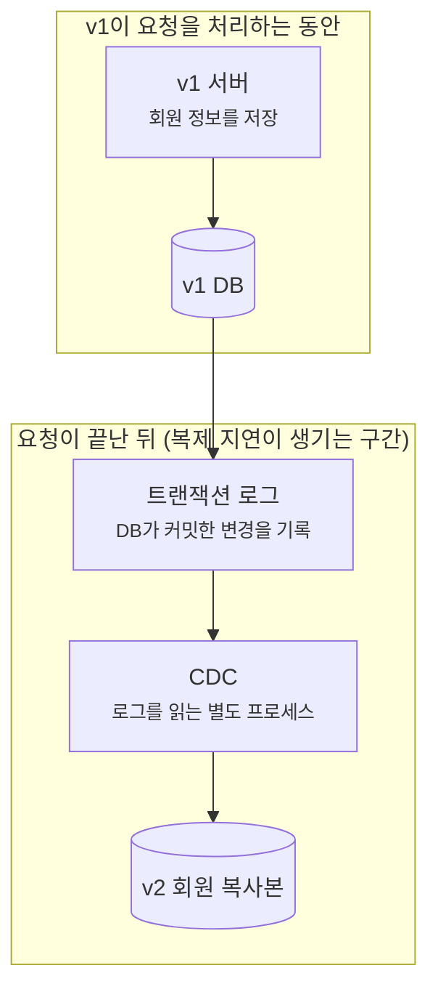
```mermaid
flowchart TB
    subgraph req["v1이 요청을 처리하는 동안"]
        A["v1 서버<br/><small>회원 정보를 저장</small>"] --> B[("v1 DB")]
    end
    subgraph after["요청이 끝난 뒤 (복제 지연이 생기는 구간)"]
        L["트랜잭션 로그<br/><small>DB가 커밋한 변경을 기록</small>"] --> C["CDC<br/><small>로그를 읽는 별도 프로세스</small>"] --> D[("v2 회원 복사본")]
    end
    B --> L
```

커뮤니티를 넘긴 뒤에도 회원은 v1에서 v2로 계속 복제하고, v2가 쓰기를 맡은 게시글은 더 이상 v1에서 덮어쓰지 않도록 복제 대상에서 뺍니다.

**다음 문제**

위 순서의 3, 4번은 v1이 저장을 끝내고 사용자에게 응답한 **뒤에** 따로 실행됩니다. v1에서 바뀐 값이 v2에 보이기까지 시간차가 생깁니다.

## 문제 5. 복제 지연 동안의 잘못된 판단

v1의 저장과 v2 복사본 갱신은 하나의 트랜잭션이 아닙니다. 그래서 v1에서 값이 바뀐 순간부터 v2 복사본에 반영될 때까지 시간차가 생깁니다. 이 시간차가 **복제 지연**(replication lag)입니다.
CDC가 로그를 읽고 변환해 쓰는 데 걸리는 시간이고, CDC가 밀리거나 멈추면 길어집니다. 그동안 v2는 바뀌기 전의 값을 봅니다. 닉네임 변경으로 시간 순서를 보면 이렇습니다.

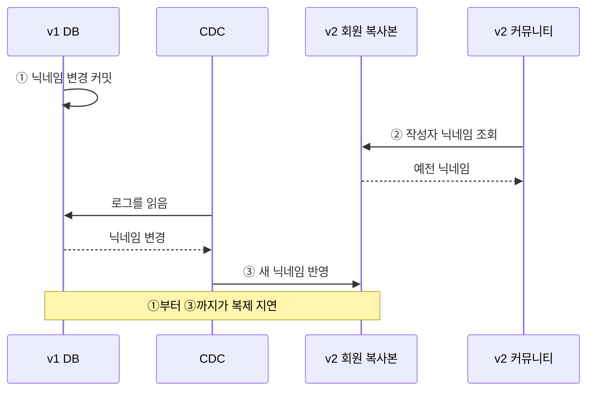
```mermaid
%%{init: {"sequence": {"diagramMarginX": 10}}}%%
sequenceDiagram
    participant V1 as v1 DB
    participant C as CDC
    participant V2 as v2 회원 복사본
    participant W as v2 커뮤니티
    V1->>V1: ① 닉네임 변경 커밋
    W->>V2: ② 작성자 닉네임 조회
    V2-->>W: 예전 닉네임
    C->>V1: 로그를 읽음
    V1-->>C: 닉네임 변경
    C->>V2: ③ 새 닉네임 반영
    Note over V1,V2: ①부터 ③까지가 복제 지연
```

닉네임이 잠깐 예전 값으로 보이는 정도는 괜찮습니다. 문제는 v2가 이 복사본으로 **판단**하는 요청입니다. 회원이 아직 복사되지 않은 경우와 예전 상태로 남아 있는 경우, 두 가지입니다.

### 가입 직후의 글 작성

v1에서 막 가입한 사용자가 곧바로 v2에서 글을 쓰면, CDC가 회원을 v2에 반영하기 전에 글 작성 요청이 먼저 도착할 수 있습니다. v2의 회원 복사본에는 그 사용자가 아직 없고 ID 대응도 없어서, 그대로는 작성자를 정할 수 없습니다.

**후보**

1. **복제가 도착할 때까지 글 작성을 거절합니다.**
2. **복사본에 없으면 v1 회원 API로 가져와 그 자리에서 만듭니다.**
3. **복사본을 쓰지 않고 매번 v1 회원 API로 조회합니다.**

| | 1. 거절 | 2. 없으면 가져오기 | 3. 매번 조회 |
| --- | --- | --- | --- |
| 가입 직후 사용자 | 글 작성 실패 | 그대로 작성 | 그대로 작성 |
| v1 호출 | 없음 | 복사본에 없을 때만 | 작성자 정보가 필요한 모든 요청 |
| 따로 만들 것 | 없음 | 중복 생성 방지 | 없음 |

**선택**

2번, 복사본에 없을 때만 v1에서 가져옵니다.
가입 직후의 글 작성을 복제 지연 때문에 막고 싶지는 않습니다. 3번은 v1 회원 서버의 지연과 장애가 커뮤니티 전체에 영향을 주고, 글 목록처럼 작성자가 많은 화면에서 호출이 늘어납니다. 2번은 복사본에 없는 드문 경우에만 v1을 부릅니다.

**트레이드오프**

같은 회원이 두 번 만들어지지 않게 해야 합니다. 같은 회원의 요청이 동시에 오거나, 방금 만든 회원의 변경이 CDC로 뒤늦게 도착할 수 있기 때문입니다.

- ID 대응표는 (도메인, v1 ID)를 기본 키로 두고 있어서 같은 v1 회원 ID를 두 번 기록할 수 없습니다. 회원 생성과 대응 기록을 한 트랜잭션으로 묶으면, 동시에 들어온 두 번째 요청은 기록에 실패하고 먼저 만들어진 회원을 다시 읽어 쓰면 됩니다.
- 뒤늦게 도착한 CDC 변경이 더 최신인 회원 정보를 덮어쓰지 않도록 버전을 비교합니다.

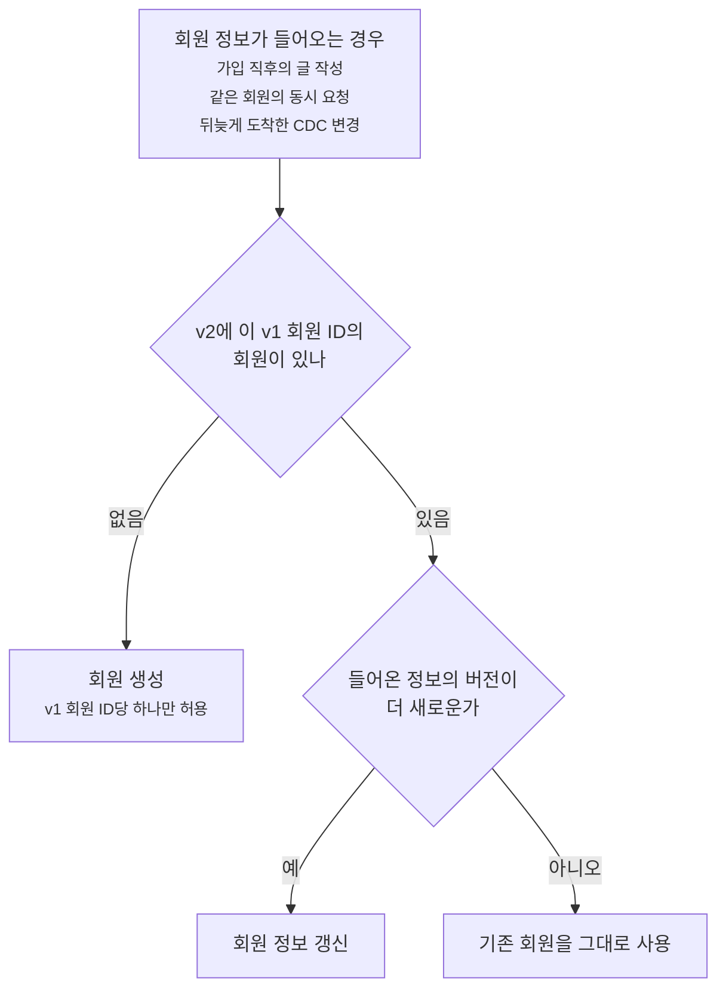
```mermaid
flowchart TB
    A["회원 정보가 들어오는 경우<br/><small>가입 직후의 글 작성<br/>같은 회원의 동시 요청<br/>뒤늦게 도착한 CDC 변경</small>"] --> K{"v2에 이 v1 회원 ID의<br/>회원이 있나"}
    K -->|"없음"| C["회원 생성<br/><small>v1 회원 ID당 하나만 허용</small>"]
    K -->|"있음"| V{"들어온 정보의 버전이<br/>더 새로운가"}
    V -->|"예"| U["회원 정보 갱신"]
    V -->|"아니오"| I["기존 회원을 그대로 사용"]
```

**바뀐 설계**

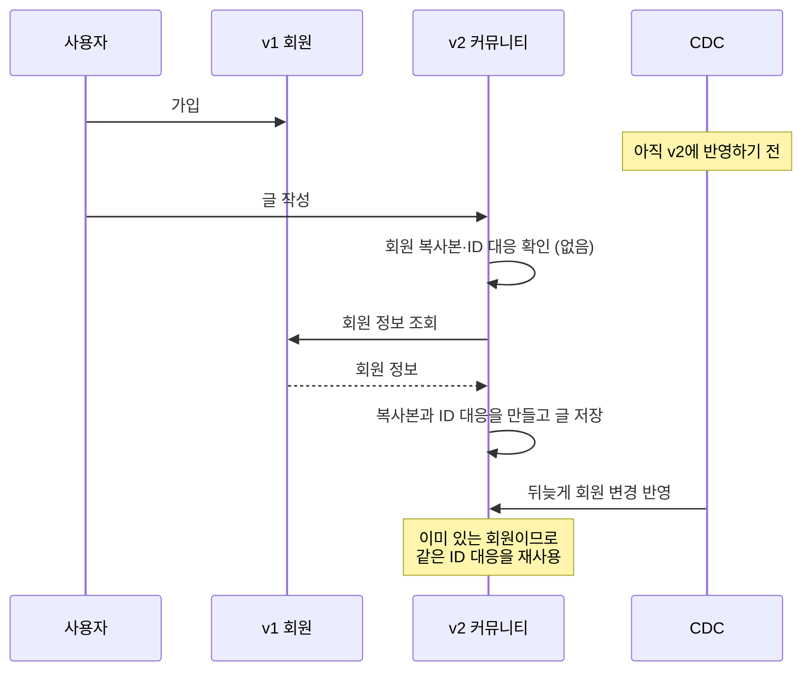
```mermaid
%%{init: {"sequence": {"diagramMarginX": 10}}}%%
sequenceDiagram
    participant U as 사용자
    participant V1 as v1 회원
    participant V2 as v2 커뮤니티
    participant R as CDC
    U->>V1: 가입
    Note over R: 아직 v2에 반영하기 전
    U->>V2: 글 작성
    V2->>V2: 회원 복사본·ID 대응 확인 (없음)
    V2->>V1: 회원 정보 조회
    V1-->>V2: 회원 정보
    V2->>V2: 복사본과 ID 대응을 만들고 글 저장
    R->>V2: 뒤늦게 회원 변경 반영
    Note over V2: 이미 있는 회원이므로<br/>같은 ID 대응을 재사용
```

### 정지 직후의 글 작성

v1 인증 필터는 인증이 필요한 요청마다 회원이 정지됐는지 확인합니다(문제 1). v2 어댑터가 이 확인을 회원 복사본으로 하면 문제가 생깁니다.
v1에서 회원을 정지했는데 그 변경이 아직 v2에 도착하지 않았다면, v2의 회원 복사본은 여전히 정상 회원입니다. 이 값만 보고 판단하면 정지된 회원이 글을 쓸 수 있습니다.

**후보**

1. **복사본을 그대로 믿습니다.** 복제 지연 동안에는 정지된 회원의 글 작성을 허용하게 됩니다.
2. **허용 여부가 회원 상태에 따라 갈리는 요청만 v1에 현재 상태를 묻습니다.**
3. **정지할 때 v1이 v2에 바로 알립니다.** v1의 정지 처리 경로를 고쳐야 합니다.

**선택**

2번, 판단이 필요한 요청만 v1에 확인합니다.
1번은 복제 지연 시간 전체 동안 정지가 적용되지 않습니다. 3번은 관리자 화면 등 v1에서 정지를 거는 경로를 모두 고쳐야 하고, 알림이 실패하면 결국 1번과 같아집니다.
2번은 닉네임이나 프로필 사진처럼 화면에 표시하는 정보는 복사본을 쓰고, 글 작성처럼 회원 상태에 따라 허용 여부가 달라지는 요청만 v1에 확인합니다. 표시용 정보는 잠깐 예전 값이어도 큰 문제가 없습니다.

**트레이드오프**

- v1 회원 서버의 장애가 커뮤니티 쓰기에도 영향을 줍니다. v1이 응답하지 않으면 그 쓰기는 실패시키고 재시도를 안내합니다. 대신 예전 복사본만 보고 정지된 회원의 요청을 허용하지는 않습니다.
- 상태를 확인한 직후에 정지가 일어나는 경우까지 없애지는 못합니다. 정지와 진행 중인 요청 사이의 경계는 따로 정해야 하지만, 적어도 복제 지연 시간 전체 동안 정지된 회원이 글을 쓰는 것은 막을 수 있습니다.

**바뀐 설계**

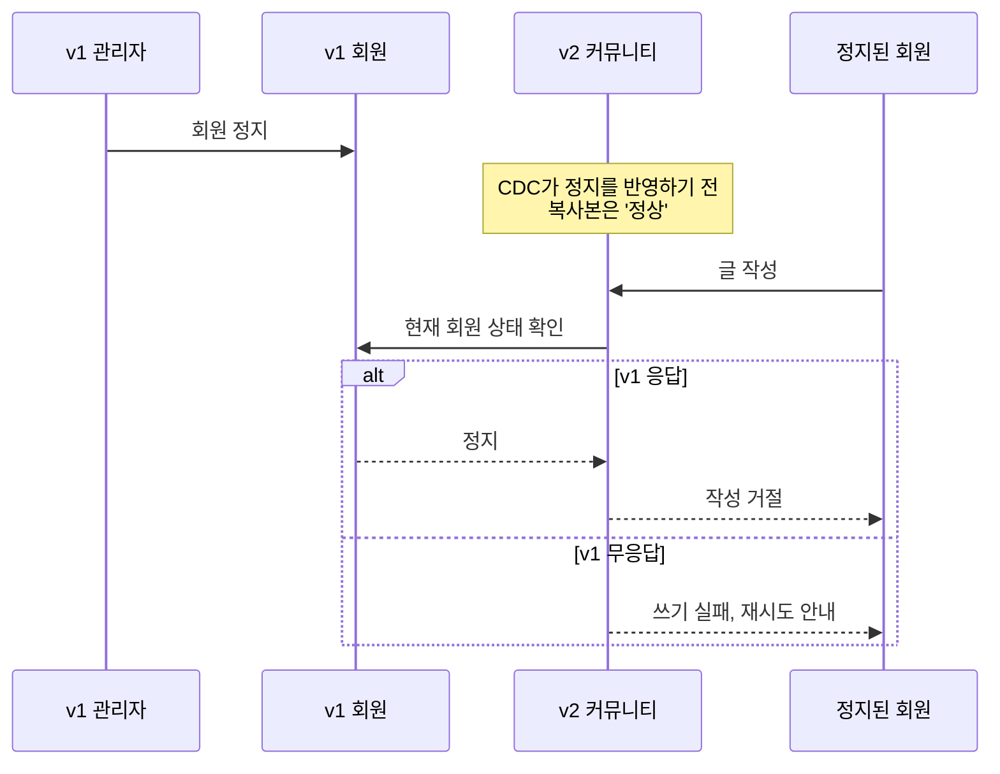
```mermaid
%%{init: {"sequence": {"diagramMarginX": 10}}}%%
sequenceDiagram
    participant A as v1 관리자
    participant V1 as v1 회원
    participant V2 as v2 커뮤니티
    participant U as 정지된 회원
    A->>V1: 회원 정지
    Note over V2: CDC가 정지를 반영하기 전<br/>복사본은 '정상'
    U->>V2: 글 작성
    V2->>V1: 현재 회원 상태 확인
    alt v1 응답
        V1-->>V2: 정지
        V2-->>U: 작성 거절
    else v1 무응답
        V2-->>U: 쓰기 실패, 재시도 안내
    end
```

**다음 문제**

사용자 요청은 여기까지로 정리됩니다. 그런데 데이터를 바꾸는 곳은 사용자 API만이 아닙니다.

## 문제 6. 사용자 API 밖의 쓰기 경로

관리자 화면, 공개 데이터 수집 Job, 푸시 알림도 데이터를 쓰거나 데이터 변경에 따라 움직입니다. 사용자 API만 v2로 돌리면 이 경로들이 그대로 남습니다.

| 경로 | 그대로 두면 | 후보 | 선택 |
| --- | --- | --- | --- |
| 관리자 화면 (게시글 숨김) | v1 관리자가 v1 테이블의 글을 숨겨도 v2의 노출 상태는 그대로 | ① 관리자 화면을 v2에 새로 만든 뒤 전환 ② v1 화면은 두고 게시글 조회·변경만 v2 관리자 API로 연결 ③ 전환 뒤 한동안 관리자 기능 중지 | ② |
| 공개 데이터 수집 Job | v1·v2가 같은 원천을 읽어도 수집 시점, 실패·재시도, 정정·삭제 반영이 달라 결과가 갈림 | ① 양쪽이 동시에 수집 ② v1 수집을 유지하며 결과를 v2에 반영한 뒤 인계 ③ 바로 v2 수집으로 교체 | ② |
| 푸시 알림 | v1·v2가 같은 변경을 보고 각각 보내면 사용자가 두 번 받음 | ① 양쪽에서 발송 ② 발송 주체를 하나로 두고 복제 적용은 데이터 반영만 | ② |

**선택**

- **관리자 화면은 ②입니다.** ①은 전환 전에 관리자 화면까지 새로 만들어야 하고, ③은 운영 중 숨겨야 할 글을 숨길 수 없습니다. 화면은 남기되 게시글 조회와 변경을 v2 관리자 API에 연결하고, 이 연결은 게시글 전환 전에 준비합니다. 회원 정지처럼 아직 v1이 맡은 작업은 기존 경로를 유지합니다.
- **수집 Job은 ②입니다.** 의안은 국회 API에서 새로 적재할 수 있지만, ①은 결과가 갈리고 ③은 ID 참조가 맞는지 확인할 틈이 없습니다. 처음에는 v1 수집을 유지하고 그 결과를 v2에 반영합니다. 읽기 결과와 ID 참조를 맞춘 뒤 v1 수집 Job을 멈추고, 마지막 반영을 확인한 다음 v2 수집을 시작합니다.
- **푸시 알림은 ②입니다.** 게시글을 넘긴 뒤 관련 알림은 v2에서만 보내고, v1의 같은 발송 작업은 멈춥니다.

**트레이드오프**

- 라우팅만 바꾸는 것으로 끝나지 않고, 전환 전에 관리자 API 연결과 수집 Job 인계를 준비해야 합니다.
- 전환 시점에 대기 중이던 발송 작업을 어느 쪽에서 마저 처리할지 정해야 합니다.

**바뀐 설계**

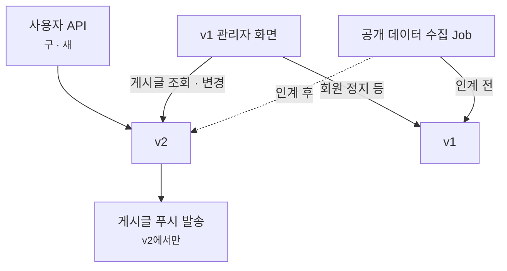
```mermaid
flowchart TB
    U["사용자 API<br/><small>구 · 새</small>"] --> V2["v2"]
    AD["v1 관리자 화면"] -->|"게시글 조회 · 변경"| V2
    AD -->|"회원 정지 등"| V1["v1"]
    J["공개 데이터 수집 Job"] -->|"인계 전"| V1
    J -.->|"인계 후"| V2
    V2 --> P["게시글 푸시 발송<br/><small>v2에서만</small>"]
```

**다음 문제**

쓰기 경로까지 정했으면, 이제 넘겨도 되는지 확인할 방법이 필요합니다.

## 문제 7. 넘겨도 되는지 어떻게 확인할까

복제가 끝났다는 표시만으로는 v2가 v1과 같게 동작한다고 볼 수 없습니다. 읽기와 쓰기는 확인 방법이 다릅니다.

### 읽기

**후보**

1. **데이터만 대조합니다.** v1과 v2 테이블의 행 개수, ID 대응 누락, 게시글·댓글의 참조 관계, 삭제·정지 상태를 비교합니다.
2. **요청을 처리하면서 v2도 함께 호출해 비교합니다.** Stripe는 [Scientist로 옛 테이블과 새 테이블을 함께 읽어](https://stripe.com/blog/online-migrations) 결과가 다르면 실시간으로 경보를 받았고, 새 경로에서 오류가 나도 서비스에는 영향이 없게 했습니다. [Khan Academy](https://blog.khanacademy.org/incremental-rewrites-with-graphql/)도 게이트웨이가 Python과 Go를 함께 호출해 차이를 기록하고 Python의 결과만 돌려줬습니다.
3. **요청 로그의 조회를 비교 Job이 다시 실행합니다.** v1과 v2 어댑터에 같은 조회를 보내 응답을 비교합니다.

| | 1. 데이터 대조 | 2. 요청 중 함께 호출 | 3. 비교 Job |
| --- | --- | --- | --- |
| 확인하는 것 | 데이터만 (어댑터 응답과 ID 변환은 못 봄) | 데이터와 어댑터 응답, 실제 요청 그대로 | 데이터와 어댑터 응답 |
| 사용자 응답에 주는 영향 | 없음 | v1 안에서 호출하면 v2의 지연이 응답에 섞임 | 없음 |
| 만들 것 | 대조 쿼리 | 요청을 복제하는 프록시, 또는 v1 안의 비교 코드 | 비교 Job |

**선택**

1번과 3번을 함께 씁니다.
2번을 하려면 같은 요청을 양쪽에 보내야 하는데, ALB 규칙으로는 이 비교를 만들 수 없습니다. ALB가 지원하는 규칙 동작은 [전달·리다이렉트·고정 응답 등](https://docs.aws.amazon.com/elasticloadbalancing/latest/application/rule-action-types.html)이고, 요청을 복제해 양쪽에 보내는 동작은 없습니다. 요청을 복제하는 프록시를 따로 두면 운영할 구성 요소가 늘고, v1 코드 안에서 v2를 부르면 v2의 지연이 사용자 응답에 영향을 줍니다.
1번으로 데이터를 대조하고, 3번으로 v1의 응답과 v2 어댑터의 응답을 비교하면 ID 변환과 응답 필드 호환까지 확인할 수 있습니다.

**트레이드오프**

- 실시간 비교가 아닙니다. 로그를 뽑은 시점 이후의 차이는 다음 실행에서 잡힙니다.
- 회원별 값이 섞이는 응답은 테스트 계정으로만 확인할 수 있습니다.
- 변환에 실패해서 건너뛴 행이 있다면 동기화 작업이 끝났다는 것만으로 넘길 수 없습니다.

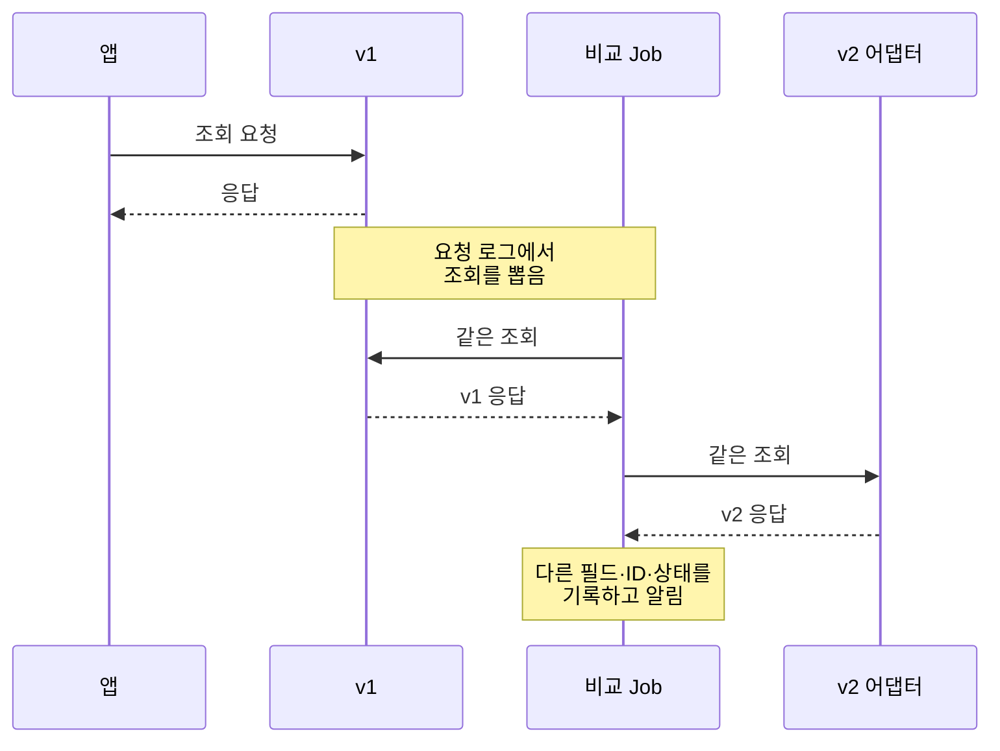
```mermaid
%%{init: {"sequence": {"diagramMarginX": 10}}}%%
sequenceDiagram
    participant App as 앱
    participant V1 as v1
    participant Job as 비교 Job
    participant V2 as v2 어댑터
    App->>V1: 조회 요청
    V1-->>App: 응답
    Note over V1,Job: 요청 로그에서<br/>조회를 뽑음
    Job->>V1: 같은 조회
    V1-->>Job: v1 응답
    Job->>V2: 같은 조회
    V2-->>Job: v2 응답
    Note over Job: 다른 필드·ID·상태를<br/>기록하고 알림
```

### 쓰기

같은 글 작성 요청을 v1과 v2에 모두 실행하면 게시글이 두 개가 됩니다. Khan Academy도 side-by-side 비교가 변경 요청은 다루지 못한다고 밝히고, 일부 사용자에게만 새 코드를 보내는 카나리 단계를 따로 두었습니다.
이 설계는 문제 2에서 카나리를 포기했으므로 쓰기는 이렇게 나눠 확인합니다.

| 확인할 것 | 방법 | 이 방법으로 알 수 없는 것 |
| --- | --- | --- |
| 복제가 정확한가 | v1에서 일어난 생성·수정·삭제·숨김이 v2 복사본에 같은 값으로 반영됐는지 행 단위로 대조 | v2가 직접 쓴 결과 |
| 어댑터가 쓰기를 처리하는가 | 테스트 데이터로 구 API 쓰기를 실행하고, 결과가 v1 형식으로 다시 읽히는지 확인 | 실제 사용자 입력의 다양성 |

실제 사용자의 쓰기가 v2에 처음 들어오는 순간은 넘긴 뒤입니다. 그래서 넘긴 직후에 문제가 생길 가능성이 가장 큽니다(문제 9).

**다음 문제**

확인을 통과하면 쓰기 주체를 넘겨야 합니다. v1이 쓰는 도중에 넘기면 마지막 변경이 빠질 수 있습니다.

## 문제 8. 쓰기 주체를 어떻게 넘길까

넘기는 범위는 게시글·댓글·반응입니다. 이관 순서만 보고 정할 수는 없으므로, 이 범위 바깥의 데이터를 같은 트랜잭션에서 바꾸는 경로가 있는지도 구현 전에 살펴봐야 합니다.

**후보**

1. **쓰기를 잠깐 막고, 마지막 변경까지 반영한 뒤 넘깁니다.** Shopify는 상점을 다른 샤드로 옮길 때 [복제가 초 단위로 따라잡으면 그 상점의 쓰기를 잠깐 막고](https://shopify.engineering/mysql-database-shard-balancing-terabyte-scale) 마지막 변경까지 반영한 뒤 라우팅을 바꿉니다. 쓰기 락을 제때 잡지 못하면 그 이동은 실패로 처리합니다. Netflix도 결제 데이터를 [국가별로 옮길 때 그 국가의 GET이 아닌 API를 끄고](https://medium.com/netflix-techblog/netflix-billing-migration-to-aws-part-ii-834f6358126) 데이터를 옮긴 뒤 다시 켰습니다.
2. **쓰기를 막는 대신 큐에 쌓아 두고, 넘긴 뒤 v2에서 처리합니다.** Netflix 결제 애플리케이션은 [동기화가 끝날 때까지 새 DB를 읽기 전용으로 열고, 쓰기는 SQS 큐에 쌓아 두어](https://www.infoq.com/news/2018/11/netflix-data-migrations) 사용자가 중단을 느끼지 않게 했습니다.
3. **양쪽에 함께 쓰는 기간을 두고 중단 없이 넘깁니다.** Stripe는 [옛 테이블과 새 테이블에 함께 쓰고](https://stripe.com/blog/online-migrations), 읽기를 먼저 새 테이블로 옮긴 다음 쓰기를 옮겼습니다.

| | 1. 쓰기 차단 | 2. 큐에 쌓기 | 3. 양쪽에 쓰기 |
| --- | --- | --- | --- |
| 사용자 영향 | 커뮤니티 쓰기가 잠깐 멈춤 | 쓴 글이 넘긴 뒤에야 반영됨 | 없음 |
| 만들 것 | 관리자·배치까지 막는 쓰기 차단, 마지막 반영 확인 | 쓰기 요청을 담을 큐, 넘긴 뒤 처리와 실패 처리 | 양쪽 쓰기 코드, 그 기간의 일치 확인 |
| 이 설계와 맞나 | 맞음 | 맞지만 큐를 새로 운영 | 문제 2에서 피한 "쓰기 주체 둘"이 다시 생김 |

**선택**

1번, 쓰기를 잠깐 막고 넘깁니다.
커뮤니티 쓰기만 잠깐 멈추면 되고, 회원 등 나머지 도메인은 계속 운영합니다. 점진 전환을 한다고 모든 도메인을 무정지로 넘겨야 하는 것은 아닙니다.
2번은 큐를 새로 운영해야 하고, 쌓인 요청이 넘긴 뒤 실패하면 사용자에게 이미 성공으로 보인 글을 어떻게 처리할지도 정해야 합니다. 3번은 문제 2의 선택과 맞지 않습니다.

**트레이드오프**

- 커뮤니티 쓰기가 잠깐 멈춥니다.
- 쓰기 차단은 앱 API만 막는다는 뜻이 아닙니다. 해당 데이터를 바꾸는 관리자 기능, 배치, 재시도 작업도 포함합니다. 이미 처리 중인 쓰기가 끝난 뒤의 최종 로그 위치를 잡고, 그 위치까지 v2에 반영됐는지 확인해야 합니다.

**바뀐 설계**

```mermaid
flowchart TB
    A["v1에서 쓰기 처리<br/>변경 수집 시작"] --> B["초기 데이터 복사<br/>ID와 스키마 변환"]
    B --> C["변경 반영과 대조<br/>v2는 검증용 읽기"]
    C --> D["v1 쓰기 차단<br/>진행 중인 작업 완료"]
    D --> E["마지막 변경까지 반영<br/>누락과 불일치 확인"]
    E --> F["v2에서 쓰기 시작<br/>구버전 요청은 어댑터로 전달"]
    F --> G["남은 v1 기능 지원<br/>필요한 조회와 복제 유지"]
```

v2에서 쓰기를 시작한 뒤에는 이전 단계의 `v1 → v2` 동기화가 v2의 새 변경을 덮어쓰지 않도록 정리해야 합니다.
기존 경로는 v2의 호환 어댑터로, 새 경로는 v2의 새 API로 연결합니다. 두 경로가 같은 커뮤니티 로직을 호출하게 하고, v1 내부에 남은 직접 쓰기도 차단해야 합니다. 구버전 앱이 글을 쓴 직후 다시 읽는 요청 역시 v2로 가야 복제 지연 때문에 방금 쓴 글이 사라져 보이지 않습니다.
회원 복제는 계속 돌아갑니다. 커뮤니티 데이터의 이관이 끝났다고 회원 동기화까지 끄면 다음 가입자부터 다시 문제가 생기므로, 복제의 종료 조건도 도메인별로 나눠야 합니다.

**다음 문제**

넘긴 직후는 실제 사용자 쓰기가 v2에 처음 들어오는 구간입니다. 여기서 문제가 나면 되돌려야 합니다.

## 문제 9. 넘긴 뒤 되돌려야 하면

라우팅을 되돌리는 작업 자체는 간단합니다. 하지만 v2에서 생성한 게시글이 v1에 없으면, 사용자는 방금 쓴 글을 잃어버린 것처럼 보게 됩니다.

**후보**

1. **라우팅만 v1으로 되돌립니다.**
2. **넘긴 뒤 일정 기간 v2의 변경을 v1 형식으로 계속 반영해 두고, 필요하면 v1으로 되돌립니다.**
3. **되돌리지 않고 v2 안에서 고칩니다.** 호환되는 코드 버전으로 되돌리거나 데이터를 보정합니다.

| | 1. 라우팅만 | 2. v1에 역반영 | 3. v2 안에서 고치기 |
| --- | --- | --- | --- |
| v2에서 생긴 데이터 | 사라져 보임 | 보존 | 보존 |
| 만들 것 | 없음 | 역방향 변환과 ID 대응, 새 API 요청을 v1 처리로 바꾸는 경로 | 없음 |
| 대가 | 사용자 데이터 유실 | 그 기간에는 v1에서 표현할 수 없는 새 기능을 열 수 없음 | 코드를 되돌려도 안 풀리는 문제는 데이터를 직접 보정해야 함 |

**선택**

넘긴 직후에는 2번, 기간이 끝나면 3번을 씁니다.
1번은 롤백 과정에서 사용자 데이터를 버리게 됩니다. 실제 사용자 쓰기가 처음 들어오는 넘긴 직후(문제 7)에는 v1으로 돌아갈 방법이 있어야 하므로 2번을 쓰고, v2가 안정되면 3번으로 바꿉니다.

**트레이드오프**

- v2의 새 게시글에 v1 UUID가 없다면 역방향 ID 대응부터 필요합니다. v1에 대응하는 필드가 없는 데이터는 어디에 보관할지도 정해야 합니다.
- 이 기간 v1 테이블은 복구용 복사본으로만 씁니다. v1 앱이나 관리자가 독립적으로 쓰게 두지 않습니다.
- 되돌려야 한다면 v2 쓰기를 멈추고 진행 중인 작업을 마친 뒤, 마지막 변경까지 v1에 반영하고 대조합니다. 그다음 복제를 멈추고 v1 쓰기와 라우팅을 다시 엽니다. 새 API를 쓰는 앱이 이미 있다면 그 요청을 v1 처리로 바꾸는 경로도 필요합니다. 이 역방향 API와 데이터 변환까지 시험한 뒤에야 "v1으로 롤백할 수 있다"고 할 수 있습니다.
- 기간을 끝내고 v1 테이블과 역방향 변환을 지우는 것은 단순한 정리가 아니라 복구할 수 있는 범위를 바꾸는 결정입니다. [Azure 문서](https://learn.microsoft.com/en-us/azure/architecture/patterns/strangler-fig)도 레거시 객체를 지운 뒤의 롤백은 객체와 동기화를 되살리고 변경을 다시 재생해야 해서 노력과 위험이 크게 늘어난다며, 제거를 도메인별 마지막 단계로 두라고 권합니다.

**바뀐 설계**

커뮤니티가 거치는 상태와 되돌릴 수 있는 지점은 이렇습니다.

```mermaid
stateDiagram-v2
    state "1. v1이 처리<br/>v1 → v2 복제" as S1
    state "2. 쓰기 차단<br/>마지막 변경 반영" as S2
    state "3. v2가 처리<br/>복구 기간<br/>v2 → v1 반영" as S3
    state "4. v2만 처리<br/>v1 복사본 제거" as S4
    [*] --> S1
    S1 --> S2: 대조 통과
    S2 --> S1: 불일치 발견
    S2 --> S3: 누락·불일치 없음
    S3 --> S1: 롤백
    S3 --> S4: 복구 기간 종료
    S4 --> [*]
```

## 커뮤니티 다음의 순서

커뮤니티 하나의 전환을 이렇게 잡고 나니, 전체 순서도 처음의 "작은 도메인부터"보다 구체적으로 정할 수 있습니다.

| 단계 | 옮길 것 | 함께 끝내야 할 작업 |
| --- | --- | --- |
| 준비 | 구 API 어댑터·회원 조회 경계 | ID·인증·응답 변환, CDC와 데이터 대조 준비 |
| 첫 전환 | 게시글·댓글·반응 | 관리자 경로와 알림 인계, v1 회원 참조 유지 |
| 후속 전환 | 문의·신고 등 남은 사용자 기능 | 회원 직접 참조 제거, 각 도메인의 쓰기와 데이터 전환 |
| 공개 데이터 | 의회·정치인·뉴스 등 | API와 수집 Job을 함께 인계, 참조 ID 유지 |
| 회원·인증 | 가입·탈퇴·회원 상태·토큰 처리 | 회원 복제 종료, 구 토큰과 로그인 갱신 호환 |
| 종료 | 남은 관리 기능과 v1 운영 | 복구 기간 종료, 레거시 직접 접근 제거 |

회원은 마지막까지 v1이 담당합니다. 그동안 옮긴 기능이 회원 조회·인증 경계를 통해 접근하게 만들어 두면, 회원 전환 시 그 경계의 연결 대상을 바꿀 수 있습니다.
다만 이미 발급한 v1 토큰이 그 순간 없어지지는 않습니다. 구 토큰의 검증과 회원 ID 변환, 리프레시·로그아웃 처리를 호환 계층에서 유지하고, 더 이상 구 토큰을 갱신하지 않는 시점과 재로그인 정책을 정해야 합니다.

공개 API를 v1에 남긴 채 v2 인증을 먼저 도입하는 순서로 바꾼다면 인증 경계를 하나 더 확인해야 합니다. v1 필터는 공개 경로에서도 `Authorization` 헤더가 있으면 토큰을 검증하고, 검증에 실패하면 요청을 막지 않고 익명 사용자로 처리합니다.
그래서 v2 토큰을 든 사용자의 공개 조회가 거절되지는 않지만, v1이 처리하는 공개 화면에서는 로그인하지 않은 사용자로 보입니다. 도메인 순서를 바꾸면 이런 인증 경계도 다시 살펴봐야 합니다.

마지막에 v1 서버를 내리더라도 구 API 어댑터는 남길 수 있습니다. 구버전 앱이 계속 사용하는 경로는 v2에서 받아주고, 해당 앱 버전의 지원을 끝낼 때 어댑터도 제거하면 됩니다.

## 고른 것과 감수한 것

| 문제 | 고른 방법 | 감수한 것 |
| --- | --- | --- |
| 1. 구 API 요청 | v2 구 API 어댑터 | 요청마다 ID·인증·응답 번역, 구버전 지원 기간 내내 어댑터 유지 |
| 2. 공존 기간의 쓰기 | 도메인마다 쓰기 주체 하나 | 카나리 불가, 반대쪽 복제와 그 지연 |
| 3. 옮기는 순서 | 커뮤니티 먼저, 회원은 마지막 | 회원 복사본 유지, 회원 조회·인증 경계 작업 |
| 4. 변경 전달 | CDC, 큐 없이 | 복제 지연, 변환 직접 구현, CDC 운영 |
| 5. 지연 동안의 판단 | 없으면 v1에서 가져오기, 상태는 v1에 확인 | v1 장애가 커뮤니티 쓰기에 영향 |
| 6. API 밖 쓰기 경로 | 관리자는 v2 API 연결, 수집 Job과 알림은 인계 | 전환 전 준비 작업 |
| 7. 확인 | 데이터 대조와 비교 Job | 실시간이 아님, 쓰기는 넘긴 뒤에야 실제로 확인 |
| 8. 넘기기 | 짧은 쓰기 차단 | 커뮤니티 쓰기 잠깐 중단 |
| 9. 되돌리기 | 복구 기간 동안 v1에 역반영 | 그동안 새 기능 보류, 역변환 구현 |

처음에는 도메인의 API가 준비되면 ALB 규칙을 옮길 수 있다고 생각했습니다. 여기까지 설계해 보니 그 시점은 훨씬 뒤에 있습니다.
구 요청을 받아줄 코드, 최신 상태까지 따라온 데이터, 관리자와 배치의 새 쓰기 경로, 되돌릴 때의 처리까지 준비돼야 도메인 하나를 넘길 수 있습니다.
**Strangler Fig를 적용했다면 도메인마다 이 과정을 반복했어야 합니다.** ALB 규칙 변경은 그렇게 준비한 전환을 실제 요청에 적용하는 마지막 단계입니다.

## 참고 자료

- [Martin Fowler: Strangler Fig Application](https://martinfowler.com/bliki/StranglerFigApplication.html)
- [Martin Fowler: Patterns of Legacy Displacement](https://martinfowler.com/articles/patterns-legacy-displacement/)
- [Martin Fowler: Event Interception](https://www.martinfowler.com/articles/patterns-legacy-displacement/event-interception.html)
- [Sam Newman: Monolith to Microservices](https://samnewman.io/books/monolith-to-microservices/)
- [Azure Architecture Center: Strangler Fig pattern](https://learn.microsoft.com/en-us/azure/architecture/patterns/strangler-fig)
- [AWS Prescriptive Guidance: Strangler fig pattern](https://docs.aws.amazon.com/prescriptive-guidance/latest/cloud-design-patterns/strangler-fig.html)
- [AWS Prescriptive Guidance: Transactional outbox pattern](https://docs.aws.amazon.com/prescriptive-guidance/latest/cloud-design-patterns/transactional-outbox.html)
- [AWS 문서: Application Load Balancer 리스너 규칙의 동작 유형](https://docs.aws.amazon.com/elasticloadbalancing/latest/application/rule-action-types.html)
- [PostgreSQL 문서: Logical Replication Restrictions](https://www.postgresql.org/docs/current/logical-replication-restrictions.html)
- [PostgreSQL 문서: Logical Replication Publication](https://www.postgresql.org/docs/current/logical-replication-publication.html)
- [Stripe: Online migrations at scale](https://stripe.com/blog/online-migrations)
- [Stripe: APIs as infrastructure: future-proofing Stripe with versioning](https://stripe.com/blog/api-versioning)
- [Shopify Engineering: Shard Balancing: Moving Shops Confidently with Zero-Downtime at Terabyte-scale](https://shopify.engineering/mysql-database-shard-balancing-terabyte-scale)
- [Khan Academy: Incremental Rewrites with GraphQL](https://blog.khanacademy.org/incremental-rewrites-with-graphql/)
- [Khan Academy: Go + Services = One Goliath Project](https://blog.khanacademy.org/go-services-one-goliath-project/)
- [Netflix Tech Blog: Netflix Billing Migration to AWS, Part II](https://medium.com/netflix-techblog/netflix-billing-migration-to-aws-part-ii-834f6358126)
- [InfoQ: Building Resilience in Netflix Production Data Migrations](https://www.infoq.com/news/2018/11/netflix-data-migrations)
