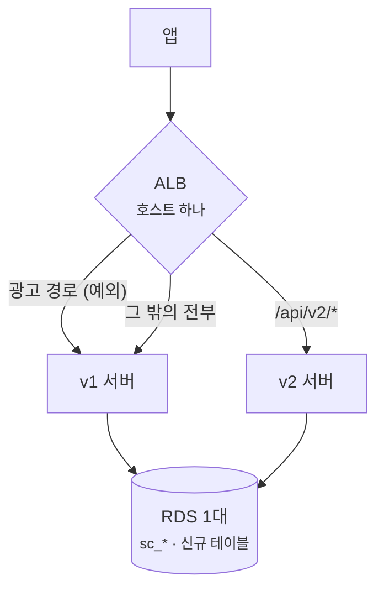
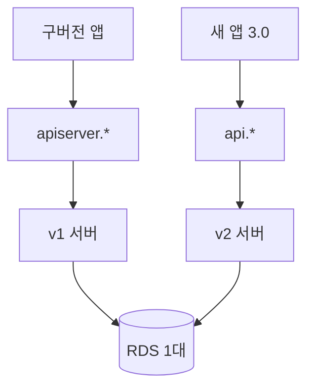
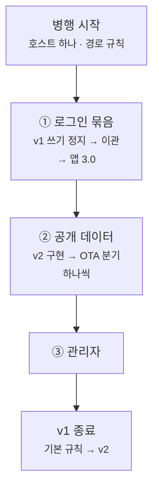

레거시 시스템을 새 시스템으로 옮길 때 자주 쓰는 방법 중 하나가 **Strangler Fig**입니다.
옛 시스템 앞에 요청을 가로채는 앞단(facade)을 두고, 기능을 하나씩 새 시스템으로 보낸 뒤 마지막에 옛 시스템을 내리는 방식입니다.
사용자는 같은 인터페이스를 계속 쓰기 때문에 어느 기능이 먼저 옮겨졌는지 알 필요가 없습니다.

저희도 그렇게 계획했습니다. 정치 정보 앱의 v1 서버를 v2로 전면 재작성하면서 설계 문서에 이렇게 적었습니다.

> 도메인 cutover마다 해당 prefix를 V2 룰로 승격 = strangler fig

로드밸런서(ALB) 규칙을 도메인마다 하나씩 옮기면 된다는 계획이었습니다.

**실제로는 그렇게 하지 않았습니다.** 두 서버를 호스트로 나눠 띄워 두고,
새 앱을 출시하면서 **모든 도메인을 한 번에** 넘겼습니다. 레거시 경로를 v2로 넘긴 로드밸런서 규칙은 **0개**입니다.

계획을 포기한 이유는 전환 범위와 서비스 규모를 함께 봤기 때문입니다.
v2는 도메인 경계와 모듈 구조만 고친 버전이 아니라, 테이블 구조와 운영 배포 구조, 앱이 호출하는 API 경로까지 전부 다시 만든 시스템이었습니다.
이 상태에서 도메인별 전환을 유지하려면 v1·v2의 서로 다른 API와 데이터를 한동안 함께 지원하고, 각 단계마다 라우팅·이관·되돌리기 절차를 따로 만들어야 했습니다.

바꿀 것은 많았지만 앱 규모는 작았고, 점진 전환의 복잡성을 감수해야 할 만큼 사용자가 많지도 않다고 판단했습니다.
그래서 공존 기간을 길게 가져가는 대신 새 앱 출시와 데이터 이관을 한 번에 맞추는 **빅뱅 전환**을 선택했습니다.

당시 계획을 다시 따라가 보니 로드밸런서 규칙보다 먼저 풀어야 할 문제가 두 가지 있었습니다.

1. **API 계약을 바꾸면, 전환 스위치가 로드밸런서에서 클라이언트로 옮겨 간다**
2. **회원 데이터가 로그인이 필요한 기능 전부를 한 덩어리로 묶는다**

## 계획 — 한 호스트, 경로로 나누기

계획의 앞단은 ALB 하나였습니다. 앱은 호스트 하나만 알고, ALB가 경로를 보고 v1과 v2로 나눕니다.

- **두 서버가 같은 DB를 씁니다.** v1 테이블은 `sc_*`, v2 테이블은 새 이름이라 스키마가 부딪히지 않습니다.
- **도메인 하나가 v2에 준비되면** 그 도메인의 v1 경로를 v2 쪽 규칙으로 옮깁니다. 이게 계획의 "승격"입니다.
- **되돌리기는 규칙을 원래대로 돌리고 v2가 쓴 행을 정리하는 것**이었습니다. 도메인 하나 단위라 폭이 작다는 게 이 계획을 고른 근거 중 하나였습니다.
- 광고 경로 예외는 v1 광고 모듈이 이미 `/api/v2/ads` 같은 경로를 쓰고 있어서 생긴 규칙입니다.

단계는 다섯이었습니다.

| 단계 | 내용 |
| --- | --- |
| 0 | v1 단독 운영, v2 개발 |
| 1 | v2 배포. v2에만 있는 새 기능만 노출 |
| 2 | 도메인별 전환 — 작은 도메인부터, 회원·인증은 가장 신중하게 |
| 3 | v1 축소 |
| 4 | v1 종료, `sc_*` 보관 후 삭제 |

dev에는 `/api/v2/ads*`·`/api/v2/admin*`은 v1, `/api/v2*`는 v2, 나머지는 v1으로 보내는 규칙이 있었습니다.
다만 v1 경로를 v2로 넘긴 적은 dev에서도 없습니다.

## 실제로 한 것 — 두 호스트, 앱 버전으로 나누기

운영에서는 경로가 아니라 **호스트로** 나눴습니다. 구버전 앱이 원래 쓰던 호스트는 100% v1, 새 호스트는 100% v2.
**어느 서버로 갈지는 로드밸런서가 아니라 사용자가 설치한 앱 버전이 정했습니다.**

- 운영 이관 절차(런북)는 v1 쓰기를 멈추고 이관 잡 전체를 순서대로 한 번에 돌리는 것이었습니다.
- 새 앱(3.0)을 출시한 다음 날 v1 서버를 내리고, 옛 호스트를 v2로 돌렸습니다.
- v2에는 구버전 앱의 강제 업데이트 확인에 필요한 **헬스체크 경로 하나만** v1 형식으로 남겼습니다.

실사용자가 두 시스템을 함께 쓴 기간은 출시일과 v1 종료일로 따지면 **약 하루**입니다.

그럼 계획대로 했다면 무엇이 필요했을까요.

## 첫 번째 문제 — API 경로가 달랐다

Strangler Fig의 앞단이 하는 일은 **같은 요청을 다른 구현으로 보내는 것**입니다.
호출자는 같은 경로로 같은 모양의 요청을 보내고, 앞단이 뒤에서 목적지만 바꿉니다.

그런데 v2는 **API 계약 자체를 새로 설계했습니다.** 게시글 작성 하나만 봐도 이렇습니다.

| | v1 | v2 |
| --- | --- | --- |
| 게시글 작성 | `POST /api/customer/board/agora` | `POST /api/v2/posts/agora` |
| 게시글 id | UUID | `post_{ULID}` |
| 로그인한 회원 | JWT `userId` claim (UUID) | `mbr_{ULID}` |

그러니 ALB에서 `/api/customer/board/agora`를 v2로 돌려도 **v2에는 그 경로가 없습니다.** 404입니다.
"규칙 승격"이 아무것도 전환하지 못합니다.

v1·v2 엔드포인트를 대조해 보니 경로가 겹치는 건 광고뿐이었습니다.
나머지는 앱이 새 v2 URL을 호출하도록 바꾸고, v1 컨트롤러를 비활성화해서 다시 배포해야 했습니다.

결국 전환 시점을 정하는 쪽은 로드밸런서가 아니라 클라이언트였습니다.
ALB 규칙이 필요했던 곳은 경로가 겹치는 광고 모듈 하나였습니다.

스위치를 어디에 둘지는 두 갈래입니다.

### 길 A — v2가 v1 계약을 흉내 낸다

v2가 v1 경로와 응답 형식을 그대로 받아 주는 **번역 계층**을 둡니다. 그러면 스위치를 다시 로드밸런서에 둘 수 있습니다.
구버전 앱은 서버가 바뀐 줄 모른 채 계속 같은 API를 호출합니다.

대가는 **요청마다 번역**입니다.

- **id 번역** — 들어오는 UUID를 새 id로, 나가는 새 id를 UUID로 바꿔야 합니다.
  이관 때 만든 `migration_id_map(domain, legacy_id, new_id)`이 이관 뒤 보관만 하는 테이블이 아니라 **모든 요청이 거치는 테이블**이 됩니다.
  전환 뒤 v2에서 새로 생긴 게시글에는 대응하는 UUID가 없다는 문제도 남습니다. 구버전 앱이 새 id 형식을 받아들일지도 알 수 없었습니다.
- **인증 재현** — v1 필터가 하는 검사를 v2가 똑같이 해야 합니다.
  같은 서명 키로 v1 토큰을 검증하고, `userId` claim을 새 회원 id로 바꾸고,
  요청마다 붙어 오는 리프레시 토큰 헤더의 사용자가 일치하는지 보고, v1의 Redis 로그아웃 블랙리스트를 조회합니다.
- **응답 모양 재현** — v1이 내려 주던 필드를 그대로 만들어야 합니다. 프로필 응답의 리워드 포인트처럼 **v2가 버린 도메인의 필드**까지 포함해서입니다.

v2에는 이 번역 계층을 둘 **자리(`controller/v1/`)만 예약**돼 있었습니다.
v1 형식으로 만든 엔드포인트는 **헬스체크 하나**뿐입니다. 옛 호스트를 v2로 돌린 뒤에도 구버전 앱의 업데이트 확인 요청을 받기 위해 남긴 경로입니다.

### 길 B — 앱이 도메인마다 목적지를 바꾼다

당시 계획은 이쪽이었습니다 — "FE는 도메인별로 SDK base URL만 바꾼다."
이러면 **앞단은 로드밸런서가 아니라 앱 코드 안의 분기**입니다.

새 앱은 JS 번들을 스토어 심사 없이 OTA로 바꿀 수 있어서, 분기 하나를 바꾸는 비용 자체는 낮습니다.
하지만 OTA에는 이 앱 설정에서 두 가지 제약이 있습니다.

- **다음 실행에 적용됩니다.** 실행할 때 업데이트를 확인하되 기다리지 않고(`checkAutomatically: ON_LOAD`, `fallbackToCacheTimeout: 0`), 받은 번들은 **다음 실행**에 씁니다.
- **같은 앱 버전 바이너리에만 갑니다**(`runtimeVersion.policy: appVersion`).

그래서 도메인 하나를 넘긴 직후에도 **옛 분기를 쓰는 앱이 한동안 남습니다.**
그 도메인의 v1 엔드포인트를 곧바로 막으면 그 사용자들의 기능이 깨지고, 안 막으면 **두 서버에 같은 종류의 데이터가 따로 쌓입니다.**
도메인마다 이 꼬리를 정리하는 게 길 B의 대가입니다.

어느 쪽이든 규칙 하나만 옮겨서는 끝나지 않습니다.
길 A라면 서버에 번역 계층이 필요하고, 길 B라면 클라이언트 분기와 구버전 정리가 따라옵니다.

## 두 번째 문제 — 회원 데이터가 모든 기능을 묶었다

API 문제를 풀어도 **도메인을 어떤 순서로 옮길지**가 남습니다.

이관 잡은 여러 매핑 테이블을 JOIN합니다.

화살표는 "이 잡이 저 매핑을 JOIN한다"는 뜻입니다.
예를 들어 댓글 잡은 작성자를 회원 매핑에서, 게시글을 게시글 매핑에서 찾아야 댓글을 옮길 수 있습니다. 매핑이 없으면 그 행은 조용히 건너뜁니다.
**사용자가 만든 데이터 중 회원 매핑 없이 옮길 수 있는 건 없습니다.** tag·file도 게시글을 거쳐 결국 회원에 닿습니다.

이게 순서를 어떻게 묶는지 두 경우로 보겠습니다.

**커뮤니티를 먼저 옮기면** — 회원은 아직 v1이 주인입니다.
v1으로 새로 가입한 사람은 회원 매핑에 없으니, 그 사람의 글은 v2로 옮길 수 없고 그 사람은 v2에 글을 쓸 수도 없습니다.
막으려면 v2가 v1 회원을 **계속 따라가야** 합니다 — 복제하든, v1 회원 테이블을 직접 읽든,
가입이 일어날 때마다 v1 회원 id와 v2 회원 id를 잇는 연결을 새로 만들어야 합니다.
결국 회원 데이터를 계속 복제하는 장치가 하나 더 필요합니다.

**회원·인증을 먼저 옮기면** — 이제 로그인은 v2가 합니다.
그러면 v1에 남은 **로그인이 필요한 모든 엔드포인트가 v2 토큰을 이해해야** 합니다.
계획 문서는 결국 이 번역을 만들지 않기로 했습니다. 대신 **로그인이 필요한 사용자 기능을 전부 v2로 옮겨** v1에 토큰을 읽을 API가 남지 않게 하는 쪽이었습니다.
그러면 v1에 남는 건 **로그인 없이 읽는 공개 데이터**(의회·정치인·선거구·뉴스)와 **관리자 기능**뿐입니다.

즉 "도메인 단위"로 쪼갠다던 계획은, 의존을 따라가면 **세 조각**으로 줄어듭니다.

| 조각 | 무엇 | 옮기는 방식 |
| --- | --- | --- |
| ① 로그인 묶음 | 회원·인증·게시글·댓글·반응·문의·신고·평점 | **한 번에** |
| ② 공개 데이터 | 의회·정치인·선거구·뉴스 (로그인 없이 읽기) | 하나씩 |
| ③ 관리자 | 회원 관리·모더레이션·광고 관리 | 따로 |

**쪼갤 수 있는 단위를 정한 건 도메인 구분이 아니라 의존이었습니다.** 같은 회원을 쓰는 기능은 같이 움직입니다.

## 계획대로 했다면 — 다시 그린 설계

두 문제를 반영하면, 점진 전환은 이런 순서가 됐을 겁니다.

**앞단** — 호스트 하나에 dev와 같은 규칙 셋을 둡니다. 광고 경로는 v1, `/api/v2/*`는 v2, 나머지는 v1.

**① 로그인 묶음** — 해당 도메인의 v1 쓰기를 멈추고, 이관 잡을 순서대로 돌리고, 새 앱을 출시합니다.
이관 잡은 이미 옮긴 행을 건너뛰게 만들어져 있어서, 다시 돌리면 **그사이 새로 생긴 행**은 따라옵니다.
하지만 이미 옮긴 행의 **수정·삭제는 따라오지 않으니** 쓰기를 멈추는 단계는 빠질 수 없습니다.

**② 공개 데이터** — 새 앱은 아직 v2에 없는 화면을 **v1 공개 API로 읽습니다.** 요청은 기본 규칙을 타고 v1으로 갑니다.
v2가 하나를 구현하면 그 화면의 분기를 OTA로 바꿉니다. **Strangler Fig가 제대로 힘을 쓰는 곳이 여기입니다.**

- **사용자가 쓰는 데이터가 없습니다.** 옛 분기를 쓰는 앱이 남아 있어도 두 서버의 데이터가 갈라질 일이 없고, v1 엔드포인트를 서둘러 막을 이유도 없습니다.
- **데이터의 원천이 외부 기관입니다.** 사용자 데이터처럼 v1에서 옮겨야 하는 게 아니라 v2가 원천 쪽에서 새로 적재할 수 있습니다. 의안이 실제로 그렇게 국회 API에서 들어옵니다.

함정이 하나 있습니다. v1 필터는 `Authorization` 헤더가 붙어 있으면 **공개 경로에서도 토큰을 검증**했습니다.
새 앱이 v2 토큰을 모든 요청에 붙이면 v1 공개 API가 그 토큰을 무효로 보고 거절합니다.
앱이 공개 경로에는 토큰을 안 붙이거나, v1 필터가 공개 경로에서 무효 토큰을 익명으로 통과시켜야 합니다.
그래서 dev에서는 공개 경로에 무효 토큰이 붙어도 익명 요청으로 통과하도록 v1 필터를 수정했습니다.

**③ 관리자** — v1 관리자 로그인을 내부망으로 격리해 두거나 v2로 옮깁니다.

**v1 종료** — 기본 규칙을 v2로 돌리고, 구버전 앱이 부르는 헬스체크만 받아 줍니다. **실제로 한 마지막 단계와 같습니다.**

### 되돌리기는 조각마다 다르다

| 조각 | 되돌리는 방법 | 비고 |
| --- | --- | --- |
| ① 로그인 묶음 | v2 코드 롤백뿐 | 새 앱은 v2 계약만 안다. 라우팅으로는 못 되돌린다 |
| ② 공개 데이터 | 화면 분기를 OTA로 되돌린다 | 쓰기가 없어 잃는 데이터가 없다 |

"도메인 하나 단위로 되돌린다"는 계획의 약속은 **②에서만** 지켜집니다.

## 무엇이 달라졌을까

| | 실제로 한 것 | 계획대로 했다면 |
| --- | --- | --- |
| 로그인 묶음 | 앱 3.0으로 한 번에 | **같다** — 앱 3.0으로 한 번에 |
| 공개 데이터 화면 | 출시 전에 전부 v2로 구현 | v1에 둔 채 출시, 하나씩 이전 |
| v1 수명 | 출시 다음 날 종료 | 공개 데이터 이전이 끝날 때까지 |
| 되돌리기 | v2 코드 롤백 | ①은 같다, ②는 조각별로 가능 |

**가장 위험한 조각은 똑같습니다.** 회원·인증과 사용자 데이터를 한 번에 넘기는 일은 어느 쪽이든 피할 수 없었습니다.
Strangler Fig가 줄여 줬을 위험은 **원래 작았던 쪽**, 읽기 전용 공개 데이터의 위험입니다.

그래도 장점은 있습니다. **새 앱 출시가 공개 데이터 이식을 기다리지 않아도** 됩니다.
실제로는 새 앱이 v2만 부르기 때문에, 3.0에 들어갈 화면은 출시 전에 전부 v2에 있어야 했습니다.

대신 운영할 것이 늘어납니다.

- **v1을 더 오래 운영** — v1 서버, v1이 읽기에 쓰던 DB 복제본, 두 서버 커넥션 풀의 합을 DB 연결 한도(81) 안에 맞추는 일
- **새 앱에 v1 API 클라이언트** — 공개 데이터 화면마다 v1 모양으로 한 번 만들고, 이전할 때 다시 만든다
- **v1 수정** — 공개 경로 토큰 처리, 광고 경로 예외 유지
- **푸시 발송 주체 정리** — v1에 관리자 발송 기능이 남는 동안, v1(회원 행의 토큰 한 칸)과 v2(기기 테이블)가 같은 사람에게 따로 보내지 않게 발송 주체를 하나로 정해야 한다

## 정리

돌아보면서 남은 결론은 세 가지입니다.

**① Strangler Fig의 스위치는 계약이 보존되는 곳에 있다.**
새 시스템이 옛 API 계약을 그대로 받으면 로드밸런서가 스위치가 됩니다.
계약을 바꾸면 앞단이 번역하거나, 스위치가 클라이언트로 갑니다. 모바일 앱이라면 그 스위치에는 **릴리즈와 업데이트 꼬리**가 따라옵니다.

**② 쪼갤 수 있는 단위는 의존이 정한다.**
같은 회원을 쓰는 기능은 같이 움직입니다. 이관 잡이 무엇을 JOIN하는지 보면 그 경계가 보입니다.

**③ 가장 위험한 조각이 가장 크면, 점진 전환은 그 위험을 줄여 주지 않는다.**
나머지 작은 조각을 부드럽게 만들 뿐입니다. 그게 운영 비용을 치를 만한지는 그 작은 조각이 얼마나 많은지에 달려 있습니다.
시스템을 빨리 내려야 하거나 규모가 작아 통째로 바꾸는 편이 단순하다면, 점진 전환을 유지하는 비용이 오히려 더 클 수 있습니다.

돌이켜 보면 계획에서 가장 먼저 검증했어야 할 건 한 줄이었습니다 — **옮길 도메인의 v1 경로를 v2가 그대로 받는가?**
v1과 v2 경로를 나란히 놓자 답은 바로 나왔습니다. 광고를 빼면 경로가 모두 달랐습니다.
