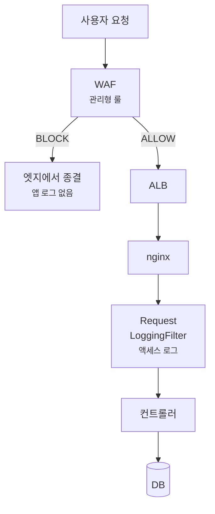
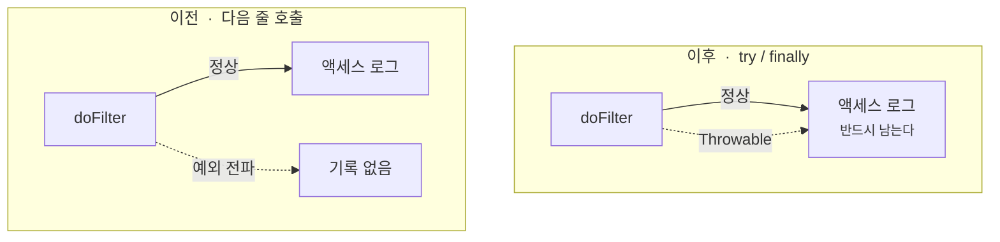
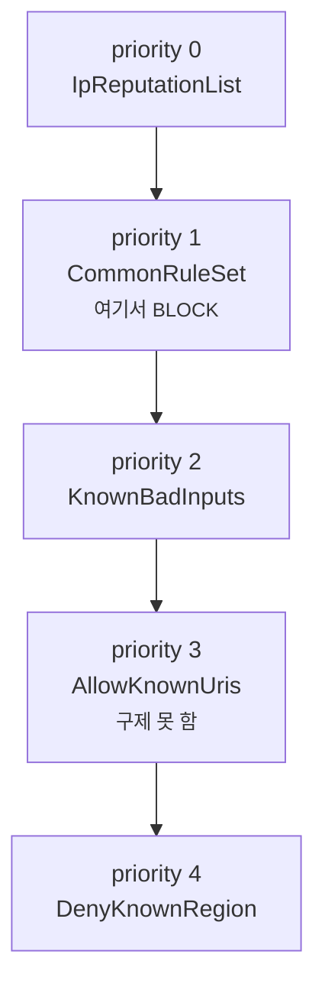

장애 제보가 들어왔는데 **로그가 한 줄도 없으면** 그때부터는 디버깅이 아니라 추측이 시작됩니다.

2026년 9월 6일, "피드 > 토론 글 작성이 안 된다"는 제보를 받았습니다.
APM을 열었는데 **완전히 비어 있었습니다.** 실패한 요청은커녕 그 시각에 해당 엔드포인트로 들어온 요청 자체가 없었습니다.
앱 코드를 다시 읽어도 문제가 없었습니다.

원인을 찾고 보니 **문제가 하나가 아니라 둘이었고, 서로 층이 달랐습니다.**

- 하나는 **로그 코드가 분명히 있는데 한 번도 찍히지 않고 있었던 것**
- 하나는 **요청이 애초에 앱에 닿지도 못한 것**

공통점이 있습니다. 둘 다 **"로그를 더 남기자"로는 풀리지 않습니다.**
전자는 이미 남기고 있었고, 후자는 남길 코드가 도는 지점까지 요청이 오지 못했습니다.

## 요청이 죽을 수 있는 지점

먼저 지도를 그려야 합니다. 요청은 앱에 도착하기 전에도 죽을 수 있습니다.



**앱 로그는 요청이 타겟에 닿아야만 생깁니다.** 그 위에서 끝난 요청은 앱 입장에서 존재한 적이 없습니다.
"로그가 없다"가 "요청이 없었다"를 뜻하지 않는다는 것 — 이게 이번 사건의 출발점입니다.

## 문제 1. 만들어진 이래 한 번도 찍히지 않은 액세스 로그

액세스 로그 필터는 이렇게 생겼었습니다.

```kotlin
class RequestLoggingFilter : OncePerRequestFilter() {
    private val logger = KotlinLogging.logger {}   // ← 이름이 문제
    // ...
    logger.info { "HTTP ${request.method} $path → $status (${elapsed}ms)" }
}
```

문법적으로 아무 문제가 없어 보이고, **실제로 컴파일도 통과합니다.** 그런데 출력이 없었습니다.

### 왜 안 찍혔나

`OncePerRequestFilter`의 부모인 `GenericFilterBean`이 이미 이런 필드를 갖고 있습니다.

```java
protected final Log logger = LogFactory.getLog(getClass());
```

commons-logging의 `Log`입니다. 클래스 안에서 `logger`라는 이름을 쓰면 **부모 필드가 이깁니다.**
그리고 commons-logging의 시그니처가 이렇습니다.

```java
void info(Object message);
```

`Object`를 받습니다. Kotlin의 `logger.info { ... }`는 **람다 자체가 `Object`로 넘어갑니다.**
타입이 맞으니 컴파일은 조용히 통과하고, 런타임에는 람다의 `toString()`이 찍힙니다 —
`Function0<Unit>` 같은 값이요.

> **가장 나쁜 종류의 버그입니다.** 컴파일러도, 테스트도, 런타임도 아무 말을 하지 않습니다.
> 로그 파일에 뭔가는 찍히니까 "로그가 있다"고 믿게 됩니다.

### 고친 방법

필드 이름을 바꾸는 것입니다. 부모에 `log`는 없으므로 섀도잉이 일어나지 않습니다.

```kotlin
// 이름이 `logger` 면 안 된다. OncePerRequestFilter 의 부모 GenericFilterBean 이
// `protected final Log logger` 를 갖고 있어서 클래스 안에서는 그쪽이 이긴다. …
// 실제로 그렇게 나가고 있었다 — 액세스 로그가 만들어진 이래 한 번도 렌더링된 적이 없다.
private val log = KotlinLogging.logger {}
```

주석을 길게 남긴 이유가 있습니다. **고친 코드만 보면 왜 `log`인지 알 수 없습니다.**
다음 사람이 스타일 통일을 이유로 `logger`로 되돌리면 같은 버그가 조용히 부활합니다.

## 문제 2. 예외가 나가면 로그 호출이 통째로 사라진다

같은 필터에 두 번째 문제가 있었습니다. 로그 호출이 `doFilter` **다음 줄**에 있었습니다.

```kotlin
filterChain.doFilter(request, response)
writeAccessLog(...)   // ← 예외가 전파되면 여기까지 오지 않는다
```

`ApiControllerAdvice`가 잡는 예외는 정상 응답으로 바뀌니 괜찮습니다.
문제는 **그 바깥**입니다 — 상위 필터, 서블릿 컨테이너, 비동기 디스패치.
거기서 터지면 액세스 로그가 통째로 사라집니다.

**가장 심각한 실패일수록 기록이 안 남는 구조**였습니다.



### 세 가지 결정

```kotlin
var failure: Throwable? = null
try {
    filterChain.doFilter(request, response)
} catch (e: Throwable) {
    failure = e
    throw e                 // 삼키지 않는다. 붙잡을 뿐이다
} finally {
    if (!isSilentPath(request.requestURI)) {
        writeAccessLog(request, path, response.status, elapsed, failure)
    }
    LogContext.restore(priorSnapshot)
}
```

**① `Exception`이 아니라 `Throwable`** — `OutOfMemoryError`로 죽는 요청도 흔적은 남아야 합니다.
`Error`를 잡는 건 보통 피하지만, 여기서는 **삼키지 않고 다시 던지므로** 동작이 바뀌지 않습니다.

**② 상태코드를 믿지 않습니다** — 예외가 전파되는 중에는 컨테이너가 아직 상태를 정하기 전이라
`response.status`가 **200일 수 있습니다.** 그래서 `outcome`을 따로 적습니다.

```
HTTP POST /api/v2/posts → 200 (1203ms) outcome=exception ex=IOException
```

상태코드만 보면 성공한 요청으로 보입니다. `outcome=exception`이 없으면 이 줄은 거짓말입니다.

**③ ERROR가 아니라 WARN** — 여기 걸리는 것 중 상당수가 **클라이언트 연결 끊김**(앱 종료, 네트워크 전환)입니다.
진짜 5xx는 `ApiControllerAdvice`가 스택과 함께 ERROR로 이미 남깁니다.
**이 줄은 오류 기록이 아니라 접속 기록입니다.**

> 정리를 로그 쓰기 **다음에** 두는 것도 의도입니다. 순서가 바뀌면 그 줄만 `requestId`·`memberId`를 잃습니다.

## 문제 3. 앱에 닿지도 못한 요청

여기까지는 "앱에 도착한 요청"의 이야기입니다. 9월 6일 사건은 다른 층이었습니다.

원인은 WAF 관리형 룰 `AWSManagedRulesCommonRuleSet`의 **`SizeRestrictions_BODY`**였습니다.
본문이 **8,192바이트**를 넘으면 무조건 BLOCK합니다.

이미지를 첨부한 글쓰기는 multipart라 이 선을 쉽게 넘습니다.
실측해 보니 `content-length` **49,730바이트**로 5초 간격 두 번 시도했고 **둘 다 BLOCK**이었습니다.

### 예외 경로가 뒤에 있었다

Web ACL에 `AllowKnownUris`라는 허용 룰이 있었는데, **우선순위가 뒤였습니다.**



**priority 1에서 이미 종결되므로 priority 3은 평가되지 않습니다.**
그리고 본문 검사 면제 경로는 `/internal/*`와 관리자 에디토리얼 **둘뿐**이었습니다.
즉 **사용자 multipart 쓰기 경로가 전부 막혀 있었습니다.**

### 왜 아무 기록도 없었나

- **앱 로그** — 타겟에 닿아야 생깁니다. WAF BLOCK은 그 앞에서 끝납니다
- **ALB 액세스 로그** — `access_logs.s3.enabled = false`, 꺼져 있었습니다
- **WAF 로깅** — `logging_configuration` 자체가 없었습니다
- **`wafv2 get-sampled-requests`** — **최근 3시간만** 보여줍니다
- **CloudWatch `BlockedRequests`** — 건수는 있지만 **룰별 집계라 어느 URI가 죽었는지 알 수 없습니다**

제보를 받은 직후에 봐서 3시간 창 안에 겨우 잡았습니다. **하루만 늦었으면 증거가 영구 소실됐습니다.**

건수 메트릭이 왜 쓸모없었는지도 숫자로 남았습니다. 같은 기간
`IpReputationList`가 **50,746건**을 막았고 사용자가 섞여 있던 `CommonRuleSet`은 **1,251건**이었습니다.
**봇 노이즈에 사용자 장애가 묻힙니다.**

## 엣지 관측을 어디에 둘 것인가

선택지가 셋이었습니다.

| | 남는 것 | 보존 | 한계 |
| --- | --- | --- | --- |
| `get-sampled-requests` | 샘플 요청 | **3시간** | 지나면 영구 소실 |
| WAF 로깅 | **어느 룰이** 왜 막았나 | 설정한 만큼 | 별도 구성·비용 |
| ALB 액세스 로그 | **어느 URI가** 어떻게 끝났나 | 설정한 만큼 | 룰 정보 없음 |

**ALB 액세스 로그를 사건 당일 켰습니다.** 이유는 하나입니다 —
**엣지에서 죽은 요청의 URI를 기록하는 유일한 지점**이기 때문입니다.

액세스 로그에는 `elb_status_code` · `target_status_code` · `actions_executed`가 있어서
"**403인데 `target_status_code`가 `-`이고 `actions_executed`에 waf가 있다**"로
WAF 차단을 **URI 단위로 집계**할 수 있습니다.

비용도 먼저 쟀습니다. 14일 실측으로 타겟 도달 49,354건 + ELB 4xx 62,202건 = **하루 약 8천 줄**.
**90일 보관해도 S3 비용이 월 1달러 미만**입니다.

```hcl
access_logs {
  enabled = true
  bucket  = aws_s3_bucket.prd_alb_access_logs.id
  prefix  = "prd-alb"
}
depends_on = [aws_s3_bucket_policy.prd_alb_access_logs]
```

> `depends_on`이 필요합니다. 버킷 정책이 먼저 붙어야 ALB가 쓸 수 있어서,
> 없으면 최초 apply 때 `Access Denied for bucket`으로 실패합니다.

## 룰은 어떻게 고쳤나

### 룰그룹을 끄지 않고 룰 하나만 Count로

```hcl
rule_action_override {
  name = "SizeRestrictions_BODY"
  action_to_use { count {} }
}
```

`rule_action_override`는 **룰 단위**입니다. 같은 룰그룹의 `CrossSiteScripting_BODY` 등은 그대로 Block입니다.
**룰그룹을 통째로 끄는 것과는 다릅니다.** 다만 업로드 경로는 30분 뒤 두 룰그룹의 본문 검사에서 통째로 뺐습니다. 이유는 아래에 적었습니다.

크기 상한이 사라지는 것도 아닙니다. nginx `client_max_body_size 50m`와
Spring `max-request-size 50MB` / 파일당 10MB가 그대로 남아 있습니다.
**WAF에서 떼어 온 게 아니라, 원래 뒤에 있던 방어가 드러난 것에 가깝습니다.**

### 왜 경로별이 아니라 사이트 전체인가

이게 이번 결정에서 제일 중요한 부분입니다.

면제 경로를 늘리는 방식으로는 **같은 ALB 뒤의 레거시 웹**을 덮을 수 없었습니다.
그쪽도 `POST /`, `/en`이 8KB를 넘겨 막히고 있었는데(실측 3시간에 7건),
**경로 목록으로 관리할 수 있는 대상이 아닙니다.**

경로를 하나씩 추가하는 방식은 이미 두 번 했고 **세 번째 버그가 났습니다.**
근본 원인은 "8KB를 넘는 multipart를 쓰는 경로"를 **전수로 훑지 않고 신고 들어온 경로만 추가해 온 것**입니다.

### 크기 룰만 끄자 XSS 룰이 사진을 막았다

크기 룰을 Count로 내린 30분 뒤, 실제 사진(JPEG 3.6MB) 8장을 올려 봤습니다. 7장은 앱까지 갔고 1장은 `CrossSiteScripting_BODY`에 막혔습니다. 막힌 사진은 세 번 모두 막혔고, 통과한 사진은 세 번 모두 통과했습니다.
사진 앞부분에 `<q`, `<A`처럼 태그로 보이는 바이트가 우연히 들어가면, 그 사진은 몇 번을 다시 올려도 올라가지 않습니다. WAF에서 끝나니 앱 로그도 남지 않습니다. 이번에 찾아낸 실패와 같은 모양입니다.

본문을 잘못 막을 수 있는 룰은 이것만이 아니었습니다. `CommonRuleSet`에는 `GenericLFI_BODY`, `GenericRFI_BODY` 같은 룰이 더 있고, `KnownBadInputsRuleSet`에도 `Log4JRCE_BODY` 같은 본문 검사가 있습니다.
룰을 하나씩 끄는 것은 경로를 하나씩 더하던 것과 같은 실수라서, **업로드 경로는 두 룰그룹의 본문 검사에서 통째로 뺐습니다.**
대상 경로는 신고된 것만이 아니라, multipart를 받는 코드를 `grep -rn MULTIPART_FORM_DATA_VALUE`로 전수 조사해 정했습니다.

### 면제 목록을 하나로 합쳤다

```hcl
waf_body_inspection_exempt_prefixes = [
  "/internal/",
  "/api/v2/admin/editorial-articles",
  "/api/v2/posts",
  "/api/v2/members/me/profile/image",
]
```

`CommonRuleSet`과 `KnownBadInputsRuleSet`이 **같은 목록을 공유**합니다.
예전에는 이 목록이 한쪽에만 있어서 **룰그룹 한쪽만 뚫린 채로 남아 있었습니다.**

## 결과와 남은 것

**남게 된 것**

- 어떤 경로로 죽어도 접속 기록 한 줄이 반드시 남습니다 —
  `HTTP {method} {maskedPath} → {status} ({ms}ms) outcome=exception ex={type}`
- 엣지에서 종결된 요청이 **URI 단위로 90일** 보존됩니다

**아직 없는 것**

- **WAF 룰 단위 로깅은 미도입입니다.** `logging_configuration`이 여전히 없습니다.
  지금은 "**어느 URI가 죽었는지는 보이고, 어느 룰이 왜 막았는지는 안 보이는**" 상태입니다.
  그건 여전히 `get-sampled-requests`의 3시간 창뿐입니다.
- 그리고 **고친 것은 룰과 로그이지 습관이 아닙니다.** WAF 예외를 만질 때
  `grep -rn MULTIPART_FORM_DATA_VALUE`로 전수를 먼저 뽑는 절차는 **사람의 규율로만 남아 있습니다.**

## 정리

세 문제의 층이 전부 달랐습니다.

| | 무엇이 없었나 | 왜 안 보였나 |
| --- | --- | --- |
| 액세스 로그 미렌더 | 로그 **내용** | 부모 클래스 필드 섀도잉 — 컴파일러가 안 잡는다 |
| 예외 시 로그 소실 | 로그 **줄 자체** | 호출 위치가 `doFilter` 다음 줄 |
| WAF 차단 | **요청의 존재** | 앱에 닿기 전에 종결 |

**"로그를 더 남기자"가 답이었던 건 셋 중 하나도 없습니다.**
하나는 이름을 바꾸는 일이었고, 하나는 호출 위치를 옮기는 일이었고,
하나는 **애초에 로그를 남길 수 있는 층이 아니었습니다.**

관측 가능성은 로그의 양이 아니라 "**어디서 죽어도 그 사실이 어딘가에 남는가**"의 문제였습니다.
